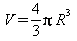
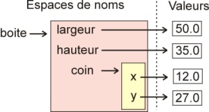
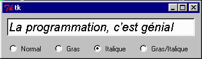
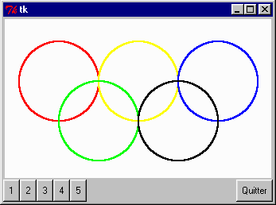

<span id="coverxml.xml"></span>

<div id="coverxml.xml#cover">

Apprendre à programmer avec Python 3
====================================

 {.soustitre}
-----------------------------------------------------------------------


</div>

<div>

Gérard Swinnen

</div>

<span id="about.xml"></span>

<div class="synopsis">

Un livre incontournable de 435 pages pour acquérir l'exigeante
discipline qu'est l'art de la programmation !

Original et stimulant, cet ouvrage aborde au travers d'exemples
attrayants et concrets tous les fondamentaux de la programmation.
L'auteur a choisi Python, langage moderne et élégant, aussi performant
pour le développement d'applications web complexes que pour la
réalisation de scripts système ou l'analyse de fichiers XML. Un support
de cours réputé et adopté par de nombreux enseignants, avec 60 pages
d'exercices corrigés.

Reconnu et utilisé par les enseignants de nombreuses écoles et IUT,
complété d'exercices accompagnés de leurs corrigés, cet ouvrage original
et érudit est une référence sur tous les fondamentaux de la
programmation : choix d'une structure de données, paramétrage,
modularité, orientation objet et héritage, conception d'interface,
multithreading et gestion d'événements, protocoles de communication et
gestion réseau, bases de données... jusqu'à la désormais indispensable
norme Unicode (le format UTF-8). On verra notamment la réalisation avec
Python 3 d'une application web interactive et autonome, intégrant une
base de données SQLite. Cette nouvelle édition traite de la possibilité
de produire des documents imprimables (PDF) de grande qualité en
exploitant les ressources combinées de Python 2 et Python 3.

A qui s'adresse ce livre ?

Aux étudiants en BTS et IUT Informatique et à leurs enseignants ; À tous
les autodidactes férus de programmation qui veulent découvrir le langage
Python.

Disponible également en version papier: [Commandez sur Amazon
!](wwwdeveloppec-21)

Droits de copie de cette version : Creative Commons (Paternité - Pas
d'utilisation commerciale - Partage des conditions initiales à
l'identique.)

[Commentez](showthread.php?t=1173913)

</div>

<div>

-   **Titre** : Apprendre à programmer avec Python 3
-   **Auteur** : Gérard Swinnen
-   **Parution** :
-   **Mise à jour** : 26 juillet 2015
-   **Licence** : Le contenu de cet article est rédigé par Gérard
    Swinnen et est mis à disposition selon les termes de la [Licence
    Creative Commons Attribution 3.0 non transposé](deed.fr). Les logos
    Developpez.com, en-tête, pied de page, css, et look & feel de
    l'article sont Copyright ® 2013 Developpez.com.

</div>

<span id="article.xml"></span>

1 - Avant-propos {#article.xml#Ld0e182 .TitreSection0}
================

Quelques paragraphes de cet ouvrage ont été adaptés de :\
***How to think like a computer scientist***\
 de *Allen B. Downey, Jeffrey Elkner & Chris Meyers*\
 disponible sur : [http://thinkpython.com]()\
 ou :
[http://www.openbookproject.net/thinkCSpy](thinkCSpy)

**Copyright (C) 2000-2010 Gérard Swinnen**

L'ouvrage qui suit est distribué suivant les termes de la Licence
***Creative Commons*** « Paternité-Pas d'Utilisation Commerciale-Partage
des Conditions Initiales à l'Identique - 2.0 France ».

Cela signifie que vous pouvez copier, modifier et redistribuer ces pages
tout à fait librement, pour autant que vous respectiez un certain nombre
de règles qui sont précisées dans cette licence.

Pour l'essentiel, sachez que vous ne pouvez pas vous approprier ce texte
pour le redistribuer ensuite (modifié ou non) en définissant vous-même
d'autres droits de copie. Le document que vous redistribuez, modifié ou
non, doit obligatoirement inclure intégralement le texte de la licence
citée ci-dessus, le présent avis et la préface qui suit. L'accès à ces
notes doit rester libre pour tout le monde. Vous êtes autorisé à
demander une contribution financière à ceux à qui vous redistribuez ces
notes, mais la somme demandée ne peut concerner que les frais de
reproduction. Vous ne pouvez pas redistribuer ces notes en exigeant pour
vous-même des droits d'auteur, ni limiter les droits de reproduction des
copies que vous distribuez. La diffusion commerciale de ce texte en
librairie, sous la forme classique d'un manuel imprimé, est réservée
exclusivement à la maison d'édition Eyrolles (Paris).

1-A - La couverture {#article.xml#Ld0e216 .TitreSection1}
-------------------

*Choisie délibérément hors propos, l'illustration de couverture est la
reproduction d'une œuvre à l'huile réalisée par l'auteur en 1987. Elle
met en scène un dundee harenguier de Boulogne, reconstitué d'après des
plans anciens et naviguant toutes voiles dehors. Ces bateaux possédaient
des mâts articulés pouvant être amenés sur les lieux de pêche, afin de
permettre la pêche de dérive.*

*La capture et la commercialisation du hareng ont été jadis un des
principaux piliers de l'économie de l'Europe du Nord.*

*Grace Hopper, inventeur du compilateur :*\
*« Pour moi, la programmation est plus qu'un art appliqué important.
C'est aussi une ambitieuse quête menée dans les tréfonds de la
connaissance. »*

*À Maximilien, Élise, Lucille, Augustin et Alexane.*

2 - Préface {#article.xml#Ld0e234 .TitreSection0}
===========

En tant que professeur ayant pratiqué l'enseignement de la programmation
en parallèle avec d'autres disciplines, je crois pouvoir affirmer qu'il
s'agit là d'une forme d'apprentissage extrêmement enrichissante pour la
formation intellectuelle d'un jeune, et dont la valeur formative est au
moins égale, sinon supérieure, à celle de branches plus classiques
telles que le latin.

Excellente idée donc, que celle de proposer cet apprentissage dans
certaines filières, y compris de l'enseignement secondaire.
Comprenons-nous bien : il ne s'agit pas de former trop précocement de
futurs programmeurs professionnels. Nous sommes simplement convaincus
que l'apprentissage de la programmation a sa place dans la forma<span
style="color:#000000;">tion générale des jeunes (ou au moins d'une
partie d'entre eux), car c'est une extraordinaire école de logique, de
rigueur, et même de courage.</span>

<span style="color:#000000;">À l'origine, le présent ouvrage a été
rédigé à l'intention des élèves qui suivent le cours </span>*<span
style="color:#000000;">Programmation et langages</span>*<span
style="color:#000000;">de l'option </span>*<span
style="color:#000000;">Sciences & informatique</span>*<span
style="color:#000000;">au 3e degré de l'enseignement secondaire belge.
Il nous a semblé par la suite que ce cours pouvait également très bien
convenir à toute personne n'ayant encore jamais programmé, mais
souhaitant s'initier à cette discipline en autodidacte. </span>

<span style="color:#000000;">Nous y proposons une dém</span>arche
d'apprentissage non linéaire qui est très certainement critiquable. Nous
sommes conscients qu'elle apparaîtra un peu chaotique aux yeux de
certains puristes, mais nous l'avons voulue ainsi parce que nous sommes
convaincus qu'il existe de nombreuses manières d'apprendre (pas
seulement la programmation, d'ailleurs), et qu'il faut accepter d'emblée
ce fait établi que des individus différents n'assimilent pas les mêmes
concepts dans le même ordre. Nous avons donc cherché avant tout à
susciter l'intérêt et à ouvrir un maximum de portes, en nous efforçant
tout de même de respecter les principes directeurs suivants :

-   L'apprentissage que nous visons se veut généraliste : nous
    souhaitons mettre en évidence les invariants de la programmation et
    de l'informatique, sans nous laisser entraîner vers une
    spécialisation quelconque, ni supposer que le lecteur dispose de
    capacités intellectuelles hors du commun.
-   Les outils utilisés au cours de l'apprentissage doivent être
    modernes et performants, mais il faut aussi que le lecteur puisse se
    les procurer en toute légalité à très bas prix pour son usage
    personnel. Notre texte s'adresse en effet en priorité à des
    étudiants, et toute notre démarche d'apprentissage vise à leur
    donner la possibilité de mettre en chantier le plus tôt possible des
    réalisations personnelles qu'il pourront développer et exploiter à
    leur guise.
-   <span style="color:#000000;">Nous aborderons très tôt la
    programmation d'une interface graphique, avant même d'avoir présenté
    l'ensemble des structures de données disponibles, parce que cette
    programmation présente des défis qui apparaissent bien concrets aux
    yeux d'un programmeur débutant. Nous observons par ailleurs que les
    jeunes qui arrivent aujourd'hui dans nos classes « baignent » déjà
    dans une culture informatique à base de fenêtres et autres objets
    graphiques interactifs. S</span>'ils choisissent d'apprendre la
    programmation, ils sont forcément impatients de créer par eux-mêmes
    des applications (peut-être très simples) où l'aspect graphique est
    déjà bien présent. Nous avons donc choisi cette approche un peu
    inhabituelle afin de permettre au lecteur de se lancer très tôt dans
    de petits projets personnels attrayants, par lesquels ils puisse se
    sentir valorisé. En revanche, nous laisserons délibérément de côté
    les environnements de programmation sophistiqués qui écrivent
    automatiquement de nombreuses lignes de code, parce que nous ne
    voulons pas non plus masquer la complexité sous-jacente.

Certains nous reprocheront que notre démarche n'est pas suffisamment
centrée sur l'algorithmique pure et dure. Nous pensons que celle-ci est
moins primordiale que par le passé. Il semble en effet que
l'apprentissage de la programmation moderne par objets nécessite plutôt
une mise en contact aussi précoce que possible de l'apprenant avec des
objets et des bibliothèques de classes préexistants. Ainsi il apprend
très tôt à raisonner en termes d'interactions entre objets, plutôt qu'en
termes de construction de procédures, et cela l'autorise assez vite à
tirer profit de concepts avancés, tels que l'instanciation, l'héritage
et le polymorphisme.

Nous avons par ailleurs accordé une place assez importante à la
manipulation de différents types de structures de données, car nous
estimons que c'est la réflexion sur les données qui doit rester la
colonne vertébrale de tout développement logiciel.

2-A - Choix d'un premier langage de programmation {#article.xml#Ld0e273 .TitreSection1}
-------------------------------------------------

Il existe un très grand nombre de langages de programmation, chacun avec
ses avantages et ses inconvénients. Il faut bien en choisir un. Lorsque
nous avons commencé à réfléchir à cette question, durant notre
préparation d'un curriculum pour la nouvelle option Sciences &
Informatique, nous avions personnellement accumulé une assez longue
expérience de la programmation sous *Visual Basic* (*Microsoft*) et sous
*Clarion* (*Topspeed*). Nous avions également expérimenté quelque peu
sous *Delphi* (*Borland*). Il était donc naturel que nous pensions
d'abord exploiter l'un ou l'autre de ces langages. Si nous souhaitions
les utiliser comme outils de base pour un apprentissage général de la
programmation, ces langages présentaient toutefois deux gros
inconvénients :

-   Ils sont liés à des environnements de programmation (c'est-à-dire
    des logiciels) propriétaires.\
     Cela signifiait donc, non seulement que l'institution scolaire
    désireuse de les utiliser devrait acheter une licence de ces
    logiciels pour chaque poste de travail (<span
    style="color:#000000;">ce qui pouvait se révéler coûteux</span>),
    mais surtout que les élèves souhaitant utiliser leurs compétences de
    programmation ailleurs qu'à l'école seraient implicitement forcés
    d'acquérir eux aussi des licences, ce que nous ne pouvions pas
    accepter. <span style="color:#000000;">Un autre grave inconvénient
    de ces produits propriétaires est qu'ils comportent de nombreuses «
    boîtes noires » dont on ne peut connaître le contenu. Leur
    documentation est donc incomplète, et leur évolution incertaine.
    </span>
-   Ce sont des langages spécifiquement liés au seul système
    d'exploitation *Windows*. Ils ne sont pas « portables » sur d'autres
    systèmes (*Unix*, *Mac OS*, *etc*.). Cela ne cadrait pas avec notre
    projet pédagogique qui ambitionne d'inculquer une formation générale
    (et donc diversifiée) dans laquelle les invariants de l'informatique
    seraient autant que possible mis en évidence.

Nous avons alors décidé d'examiner l'offre alternative, c'est-à-dire
celle qui est proposée gratuitement dans la mouvance de l'informatique
libre^<span
id="article.xml#signetNoteBasPage1">[(1)](#notes.xml#noteBasPage1)</span>^.
Ce que nous avons trouvé nous a enthousiasmés : non seulement il existe
dans le monde de *l'OpenSource* des interpréteurs et des compilateurs
gratuits pour toute une série de langages, mais surtout ces langages
sont modernes, performants, portables (c'est-à-dire utilisables sur
différents systèmes d'exploitation tels que *Windows*, *Linux*, *Mac OS*
...), et fort bien documentés.

Le langage dominant y est sans conteste *C/C++*. Ce langage s'impose
comme une référence absolue, et tout informaticien sérieux doit s'y
frotter tôt ou tard. Il est malheureusement très rébarbatif et
compliqué, trop proche de la machine. Sa syntaxe est peu lisible et fort
contraignante. La mise au point d'un gros logiciel écrit en *C/C++* est
longue et pénible. (Les mêmes remarques valent aussi dans une large
mesure pour le langage *Java.*)

D'autre part, la pratique moderne de ce langage fait abondamment appel à
des générateurs d'applications et autres outils d'assistance très
élaborés tels *C++Builder*, *Kdevelop*, etc. Ces environnements de
programmation peuvent certainement se révéler très efficaces entre les
mains de programmeurs expérimentés, mais ils proposent d'emblée beaucoup
trop d'outils complexes, et ils présupposent de la part de l'utilisateur
des connaissances qu'un débutant ne maîtrise évidemment pas encore. Ce
seront donc aux yeux de celui-ci de véritables « usines à gaz » qui
risquent de lui masquer les mécanismes de base du langage lui-même. Nous
laisserons donc le *C/C++* pour plus tard.

Pour nos débuts dans l'étude de la programmation, il nous semble
préférable d'utiliser un langage de plus haut niveau, moins
contraignant, à la syntaxe plus lisible. Après avoir successivement
examiné et expérimenté quelque peu les langages *Perl* et *Tcl*/*Tk* ,
nous avons finalement décidé d'adopter Python, langage très moderne à la
popularité grandissante.

2-B - Présentation du langage Python {#article.xml#Ld0e380 .TitreSection1}
------------------------------------

> <span style="color:#000000;">Ce texte de Stéfane Fermigier date un
> peu, mais il reste d'actualité pour l'essentiel. Il est extrait d'un
> article paru dans le magazine Programmez! en décembre 1998. Il
> e</span>st également disponible sur
> http://www.linux-center.org/articles/9812/python.html. Stéfane
> Fermigier est le co-fondateur de l'AFUL (Association Francophone des
> Utilisateurs de Linux et des logiciels libres).

Python est un langage portable, dynamique, extensible, gratuit, qui
permet (sans l'imposer) une approche modulaire et orientée objet de la
programmation. Python est développé depuis 1989 par Guido van Rossum et
de nombreux contributeurs bénévoles.

### 2-B-1 - Caractéristiques du langage {#article.xml#Ld0e389 .TitreSection2}

Détaillons un peu les principales caractéristiques de Python, plus
précisément, du langage et de ses deux implantations actuelles:

-   Python est **portable**, non seulement sur les différentes variantes
    d'*Unix*, mais aussi sur les OS propriétaires : *Mac OS*, *BeOS*,
    *NeXTStep*, *MS-DOS* et les différentes variantes de *Windows*. Un
    nouveau compilateur, baptisé *JPython*, est écrit en Java et génère
    du *bytecode* Java.
-   Python est **gratuit**, mais on peut l'utiliser sans restriction
    dans des projets commerciaux.
-   Python convient aussi bien à des **scripts** d'une dizaine de lignes
    qu'à des **projets complexes** de plusieurs dizaines de milliers de
    lignes.
-   La **syntaxe** de Python est **très simple** et, combinée à des
    **types de données évolués** (listes, dictionnaires...), conduit à
    des programmes à la fois très compacts et très lisibles. À
    fonctionnalités égales, un programme Python (abondamment commenté et
    présenté selon les canons standards) est souvent de 3 à 5 fois plus
    court qu'un programme C ou C++ (ou même Java) équivalent, ce qui
    représente en général un temps de développement de 5 à 10 fois plus
    court et une facilité de maintenance largement accrue.
-   Python gère ses ressources (mémoire, descripteurs de fichiers...)
    sans intervention du programmeur, par un mécanisme de **comptage de
    références** (proche, mais différent, d'un *garbage collector*).
-   Il n'y a **pas de pointeurs** explicites en Python.
-   Python est (optionnellement) **multi-threadé**.
-   Python est **orienté-objet**. Il supporte **l'héritage multiple** et
    **la surcharge des opérateurs**. Dans son modèle objets, et en
    reprenant la terminologie de C++, toutes les méthodes sont
    virtuelles.
-   Python intègre, comme Java ou les versions récentes de C++, un
    système **d'exceptions**, qui permettent de simplifier
    considérablement la gestion des erreurs.
-   Python est **dynamique** (l'interpréteur peut évaluer des chaînes de
    caractères représentant des expressions ou des instructions Python),
    **orthogonal** (un petit nombre de concepts suffit à engendrer des
    constructions très riches), **réflectif** (il supporte la
    métaprogrammation, par exemple la capacité pour un objet de se
    rajouter ou de s'enlever des attributs ou des méthodes, ou même de
    changer de classe en cours d'exécution) et **introspectif** (un
    grand nombre d'outils de développement, comme le *debugger* ou le
    *profiler*, sont implantés en Python lui-même).
-   Comme *Scheme* ou *SmallTalk*, Python est dynamiquement typé. Tout
    objet manipulable par le programmeur possède un type bien défini à
    l'exécution, qui n'a pas besoin d'être déclaré à l'avance.
-   Python possède actuellement deux implémentations. L'une,
    **interprétée**, dans laquelle les programmes Python sont compilés
    en instructions portables, puis exécutés par une machine virtuelle
    (comme pour Java, avec une différence importante : Java étant
    statiquement typé, il est beaucoup plus facile d'accélérer
    l'exécution d'un programme Java que d'un programme Python). L'autre
    génère directement du *bytecode* Java.
-   Python est **extensible** : comme *Tcl* ou *Guile*, on peut
    facilement l'interfacer avec des bibliothèques C existantes. On peut
    aussi s'en servir comme d'un langage d'extension pour des systèmes
    logiciels complexes.
-   La **bibliothèque standard** de Python, et les paquetages
    contribués, donnent accès à une grande variété de services : chaînes
    de caractères et expressions régulières, services UNIX standards
    (fichiers, *pipes*, signaux, sockets, threads...), protocoles
    Internet (Web, News, FTP, CGI, HTML...), persistance et bases de
    données, interfaces graphiques.
-   Python est un langage qui **continue à évoluer**, soutenu par une
    communauté d'utilisateurs enthousiastes et responsables, dont la
    plupart sont des supporters du logiciel libre. Parallèlement à
    l'interpréteur principal, écrit en C et maintenu par le créateur du
    langage, un deuxième interpréteur, écrit en Java, est en cours de
    développement.
-   Enfin, Python est un langage de choix pour traiter le XML.

2-C - Pour le professeur qui souhaite utiliser cet ouvrage comme support de cours {#article.xml#Ld0e544 .TitreSection1}
---------------------------------------------------------------------------------

Nous souhaitons avec ces notes ouvrir un maximum de portes. À notre
niveau d'études, il nous paraît important de montrer que la
programmation d'un ordinateur est un vaste univers de concepts et de
méthodes, dans lequel chacun peut trouver son domaine de prédilection.
Nous ne pensons pas que tous nos étudiants doivent apprendre exactement
les mêmes choses. Nous voudrions plutôt qu'ils arrivent à développer
chacun des compétences quelque peu différentes, qui leur permettent de
se valoriser à leurs propres yeux ainsi qu'à ceux de leurs condisciples,
et également d'apporter leur contribution spécifique lorsqu'on leur
proposera de collaborer à des travaux d'envergure.

De toute manière, notre préoccupation primordiale doit être d'arriver à
susciter l'intérêt, ce qui est loin d'être acquis d'avance pour un sujet
aussi ardu que la programmation d'un ordinateur. Nous ne voulons pas
feindre de croire que nos jeunes élèves vont se passionner d'emblée pour
la construction de beaux algorithmes. Nous sommes plutôt convaincus
qu'un certain intérêt ne pourra durablement s'installer qu'à partir du
moment où ils commenceront à réaliser qu'ils sont devenus capables de
développer un projet personnel original, dans une certaine autonomie.

Ce sont ces considérations qui nous ont amenés à développer une
structure de cours que certains trouveront peut-être un peu chaotique.
Nous commençons par une série de chapitres très courts, qui expliquent
sommairement ce qu'est l'activité de programmation et posent les
quelques bases indispensables à la réalisation de petits programmes.
Ceux-ci pourront faire appel très tôt à des bibliothèques d'objets
existants, tels ceux de l'interface graphique *tkinter* par exemple,
afin que ce concept d'objet devienne rapidement familier. Ils devront
être suffisamment attrayants pour que leurs auteurs aient le sentiment
d'avoir déjà acquis une certaine maîtrise. Nous souhaiterions en effet
que les élèves puissent déjà réaliser une petite application graphique
dès la fin de leur première année d'études.

Très concrètement, cela signifie que nous pensons pouvoir explorer les
huit premiers chapitres de ces notes durant la première année de cours.
Cela suppose que l'on aborde d'abord toute une série de concepts
importants (types de données, variables, instructions de contrôle du
flux, fonctions et boucles) d'une manière assez rapide, sans trop se
préoccuper de ce que chaque concept soit parfaitement compris avant de
passer au suivant, en essayant plutôt d'inculquer le goût de la
recherche personnelle et de l'expérimentation. Il sera souvent plus
efficace de ré-expliquer les notions et les mécanismes essentiels plus
tard, en situation et dans des contextes variés.

Dans notre esprit, c'est surtout en seconde année que l'on cherchera à
structurer les connaissances acquises, en les approfondissant. Les
algorithmes seront davantage décortiqués et commentés. Les projets,
cahiers des charges et méthodes d'analyse seront discutés en
concertation. On exigera la tenue régulière d'un cahier de notes et la
rédaction de rapports techniques pour certains travaux.

L'objectif ultime sera pour chaque élève de réaliser un projet de
programmation original d'une certaine importance. On s'efforcera donc de
boucler l'étude théorique des concepts essentiels suffisamment tôt dans
l'année scolaire, afin que chacun puisse disposer du temps nécessaire.

Il faut bien comprendre que les nombreuses informations fournies dans
ces notes concernant une série de domaines particuliers (gestion des
interfaces graphiques, des communications, des bases de données, etc.)
sont facultatives. Ce sont seulement une série de suggestions et de
repères que nous avons inclus pour aider les étudiants à choisir et à
commencer leur projet personnel de fin d'études. Nous ne cherchons en
aucune manière à former des spécialistes d'un certain langage ou d'un
certain domaine technique : nous voulons simplement donner un petit
aperçu des immenses possibilités qui s'offrent à celui qui se donne la
peine d'acquérir une compétence de programmeur.

2-D - Versions du langage {#article.xml#Ld0e564 .TitreSection1}
-------------------------

Python continue à évoluer, mais cette évolution ne vise qu'à améliorer
ou perfectionner le produit. Il est donc très rare qu'il faille modifier
les programmes afin de les adapter à une nouvelle version qui serait
devenue incompatible avec les précédentes. Les exemples de ce livre ont
été réalisés les uns après les autres sur une période de temps
relativement longue : certains ont été développés sous Python 1.5.2,
puis d'autres sous Python 1.6, Python 2.0, 2.1, 2.2, 2.3, 2.4, etc. Ils
n'ont guère nécessité de modifications avant l'apparition de Python 3.

Cette nouvelle version du langage a cependant apporté quelques
changements de fond qui lui confèrent une plus grande cohérence et même
une plus grande facilité d'utilisation, mais qui imposent une petite
mise à jour de tous les scripts écrits pour les versions précédentes. La
présente édition de ce livre a donc été remaniée, non seulement pour
adapter ses exemples à la nouvelle version, mais surtout pour tirer
parti de ses améliorations, qui en font probablement le meilleur outil
d'apprentissage de la programmation à l'heure actuelle.

Installez donc sur votre système la dernière version disponible
(quelques-uns de nos exemples nécessitent désormais la version 3.1 ou
une version postérieure), et amusez-vous bien ! Si toutefois vous devez
analyser des scripts développés pour une version antérieure, sachez que
des outils de conversion existent (voir en particulier le script
2to3.py), et que nous maintenons en ligne sur notre site web
*http://inforef.be/swi/python.htm* la précédente mouture de ce texte,
adaptée aux versions antérieures de Python, et toujours librement
téléchargeable.

2-E - Distribution de Python et bibliographie {#article.xml#Ld0e576 .TitreSection1}
---------------------------------------------

Les différentes versions de Python (pour *Windows*, *Unix*, etc.), son
**tutoriel** original, son **manuel de référence**, la **documentation**
des bibliothèques de fonctions, etc. sont disponibles en téléchargement
gratuit depuis Internet, à partir du site web officiel :
*http://www.python.org*

Il existe également de très bons ouvrages imprimés concernant Python. La
plupart concernent encore Python 2.x, mais vous ne devrez guère éprouver
de difficultés à adapter leurs exemples à Python 3. En langue française,
vous pourrez très profitablement consulter les manuels ci-après :

-   ***Au cœur de Python***, volumes 1 et 2, par Wesley J. Chun,
    traduction de *Python core programming, 2d edition* (Prentice Hall)
    par Marie-Cécile Baland, Anne Bohy et Luc Carité, Editions
    CampusPress, Paris, 2007, respectivement 645 et 385 p., ISBN
    978-2-7440-2148-0 et 978-2-7440-2195-4. C'est un ouvrage de
    référence indispensable, très bien écrit.

D'autres excellents ouvrages en français étaient proposés par la
succursale française de la maison d'éditions O'Reilly, laquelle a
malheureusement disparu. En langue anglaise, le choix est évidemment
beaucoup plus vaste. Nous apprécions personnellement beaucoup ***Python
: How to program***, par Deitel, Liperi & Wiedermann, Prentice Hall,
Upper Saddle River - NJ 07458, 2002, 1300 p., ISBN 0-13-092361-3, très
complet, très clair, agréable à lire et qui utilise une méthodologie
éprouvée.

Pour aller plus loin, notamment dans l'utilisation de la bibliothèque
graphique ***Tkinter***, on pourra utilement consulter ***Python and
Tkinter Programming***, par John E. Grayson, Manning publications co.,
Greenwich (USA), 2000, 658 p., ISBN 1-884777-81-3 , et surtout
l'incontournable ***Programming Python*** (second edition) de Mark Lutz,
Editions O'Reilly, 2001, 1255 p., ISBN 0-596-00085-5, qui est une
extraordinaire mine de renseignements sur de multiples aspects de la
programmation moderne (sur tous systèmes).

Si vous savez déjà bien programmer, et que vous souhaitez progresser
encore en utilisant les concepts les plus avancés de l'algorithmique
Pythonienne, procurez vous ***Python cookbook***, par Alex Martelli et
David Ascher, Editions O'Reilly, 2002, 575 p., ISBN 0-596-00167-3 , dont
les recettes sont savoureuses.

2-F - Exemples du livre {#article.xml#Ld0e635 .TitreSection1}
-----------------------

Le code source des exemples de ce livre peut être téléchargé
[ici](exemples_cours_python.zip)

2-G - Remerciements {#article.xml#Ld0e642 .TitreSection1}
-------------------

Ce livre est pour une partie le résultat d'un travail personnel, mais
pour une autre - bien plus importante - la compilation d'informations et
d'idées mises à la disposition de tous par des professeurs et des
chercheurs bénévoles. La source qui a inspiré mes premières ébauches du
livre est le cours de A.Downey, J.Elkner & C.Meyers : *How to think like
a computer scientist* (Voir :
http://greenteapress.com/thinkpython/thinkCSpy). Merci encore à ces
professeurs enthousiastes. J'avoue aussi m'être inspiré du tutoriel
original écrit par Guido van Rossum lui-même (l'auteur principal de
Python), ainsi que d'exemples et de documents divers émanant de la (très
active) communauté des utilisateurs de Python. Il ne m'est
malheureusement pas possible de préciser davantage les références de
tous ces textes, mais je voudrais que leurs auteurs soient assurés de
toute ma reconnaissance.

Merci également à tous ceux qui œuvrent au développement de Python, de
ses accessoires et de sa documentation, à commencer par Guido van
Rossum, bien sûr, mais sans oublier non plus tous les autres
((mal)heureusement trop nombreux pour que je puisse les citer tous ici).

Merci encore à mes collègues Freddy Klich et David Carrera, professeurs
à l'Institut Saint-Jean Berchmans de Liège, qui ont accepté de se lancer
dans l'aventure de ce nouveau cours avec leurs élèves, et ont également
suggéré de nombreuses améliorations. Un merci tout particulier à
Christophe Morvan, professeur à l'IUT de Marne-la-Vallée, pour ses avis
précieux et ses encouragements. Grand merci aussi à Florence Leroy, mon
éditrice chez O'Reilly, qui a corrigé mes incohérences et mes
belgicismes avec une compétence sans faille. Merci encore à mes
partenaires actuels chez Eyrolles, Sandrine Panie<span
style="color:#000000;">l, Muriel Shan Sei Fan, Matthieu Montaudouin et
Taï-marc Le Thanh, qui ont efficacem</span>ent pris en charge cette
nouvelle édition.

Merci enfin à mon épouse Suzel, pour sa patience et sa compréhension.

3 - À l'école des sorciers {#article.xml#Ld0e659 .TitreSection0}
==========================

Apprendre à programmer est une activité déjà très intéressante en
elle-même : elle peut stimuler puissamment votre curiosité
intellectuelle. Mais ce n'est pas tout. Acquérir cette compétence vous
ouvre également la voie menant à la réalisation de projets tout à fait
concrets (utiles ou ludiques), ce qui vous procurera certainement
beaucoup de fierté et de grandes satisfactions.

Avant de nous lancer dans le vif du sujet, nous allons vous proposer ici
quelques réflexions sur la nature de la programmation et le comportement
parfois étrange de ceux qui la pratiquent, ainsi que l'explication de
quelques concepts fondamentaux. Il n'est pas vraiment difficile
d'apprendre à programmer, mais il faut de la méthode et une bonne dose
de persévérance, car vous pourrez continuer à progresser sans cesse dans
cette science : elle n'a aucune limite

3-A - Boîtes noires et pensée magique {#article.xml#Ld0e666 .TitreSection1}
-------------------------------------

Une caractéristique remarquable de notre société moderne est que nous
vivons de plus en plus entourés de nombreuses **boîtes noires**. Les
scientifiques ont l'habitude de nommer ainsi les divers dispositifs
technologiques que nous utilisons couramment, sans en connaître ni la
structure ni le fonctionnement exacts. Tout le monde sait se servir d'un
téléphone, par exemple, alors qu'il n'existe qu'un très petit nombre de
techniciens hautement spécialisés qui soient capables d'en concevoir un
nouveau modèle.

Des boîtes noires existent dans tous les domaines, et pour tout le
monde. En général, cela ne nous affecte guère, car nous pouvons nous
contenter d'une compréhension sommaire de leur mécanisme pour les
utiliser sans état d'âme. Dans la vie courante, par exemple, la
composition précise d'une pile électrique ne nous importe guère. Le
simple fait de savoir qu'elle produit son électricité à partir d'une
réaction chimique nous suffit pour admettre sans difficulté qu'elle sera
épuisée après quelque temps d'utilisation, et qu'elle sera alors devenue
un objet polluant qu'il ne faudra pas jeter n'importe où. Inutile donc
d'en savoir davantage.

Il arrive cependant que certaines boîtes noires deviennent tellement
complexes que nous n'arrivons plus à en avoir une compréhension
suffisante pour les utiliser tout-à-fait correctement dans n'importe
quelle circonstance. Nous pouvons alors être tentés de tenir à leur
encontre des raisonnements qui se rattachent à *la pensée magique*,
c'est-à-dire à une forme de pensée faisant appel à l'intervention de
propriétés ou de pouvoirs surnaturels pour expliquer ce que notre raison
n'arrive pas à comprendre. C'est ce qui se passe lorsqu'un magicien nous
montre un tour de passe-passe, et que nous sommes enclins à croire qu'il
possède un pouvoir particulier, tel un don de « double vue », ou à
accepter l'existence de mécanismes paranormaux (« fluide magnétique »,
etc.), tant que nous n'avons pas compris le truc utilisé.

Du fait de leur extraordinaire complexité, les ordinateurs constituent
bien évidemment l'exemple type de la boîte noire. Même si vous avez
l'impression d'avoir toujours vécu entouré de moniteurs vidéo et de
claviers, il est fort probable que vous n'ayez qu'une idée très confuse
de ce qui se passe réellement dans la machine, par exemple lorsque vous
déplacez la souris, et qu'en conséquence de ce geste un petit dessin en
forme de flèche se déplace docilement sur votre écran. Qu'est-ce qui se
déplace, au juste ? Vous sentez-vous capable de l'expliquer en détail,
sans oublier (entre autres) les capteurs, les ports d'interface, les
mémoires, les portes et bascules logiques, les transistors, les bits,
les octets, les interruptions processeur, les cristaux liquides de
l'écran, la micro-programmation, les pixels, le codage des couleurs ...
?

De nos jours, plus personne ne peut prétendre maîtriser absolument
toutes les connaissances techniques et scientifiques mises en œuvre dans
le fonctionnement d'un ordinateur. Lorsque nous utilisons ces machines,
nous sommes donc forcément amenés à les traiter mentalement, en partie
tout au moins, comme des objets magiques, sur lesquels nous sommes
habilités à exercer un certain pouvoir, magique lui aussi.

Par exemple, nous comprenons tous très bien une instruction telle que :
« déplacer la fenêtre d'application en la saisissant par sa barre de
titre ». Dans le monde réel, nous savons parfaitement ce qu'il faut
faire pour l'exécuter, à savoir manipuler un dispositif technique
familier (souris, pavé tactile …) qui va transmettre des impulsions
électriques à travers une machinerie d'une complexité prodigieuse, avec
pour effet ultime la modification de l'état de transparence ou de
luminosité d'une partie des pixels de l'écran. Mais dans notre esprit,
il ne sera nullement question d'interactions physiques ni de circuiterie
complexe. C'est un objet tout à fait virtuel qui sera activé (la flèche
du curseur se déplaçant à l'écran), et qui agira tout à fait comme une
baguette magique, pour faire obéir un objet tout aussi virtuel et
magique (la fenêtre d'application). L'explication rationnelle de ce qui
se passe effectivement dans la machine est donc tout à fait escamotée au
profit d'un « raisonnement » figuré, qui nous rassure par sa simplicité,
mais qui est bel et bien une illusion.

Si vous vous intéressez à la programmation des ordinateurs, sachez que
vous serez constamment confronté à des formes diverses de cette « pensée
magique », non seulement chez les autres (par exemple ceux qui vous
demanderont de réaliser tel ou tel programme), mais surtout aussi dans
vos propres représentations mentales. Vous devrez inlassablement
démonter ces pseudo-raisonnements qui ne sont en fait que des
spéculations, basées sur des interprétations figuratives simplifiées de
la réalité, pour arriver à mettre en lumière (au moins en partie) leurs
implications concrètes véritables.

Ce qui est un peu paradoxal, et qui justifie le titre de ce chapitre,
c'est qu'en progressant dans cette compétence, vous allez acquérir de
plus en plus de pouvoir sur la machine, et de ce fait vous allez
vous-même devenir petit à petit aux yeux des autres, une sorte de
magicien !

Bienvenue donc, comme le célèbre *Harry Potter*, à l'école des sorciers
!

3-B - Magie blanche, magie noire {#article.xml#Ld0e696 .TitreSection1}
--------------------------------

Nous n'avons bien évidemment aucune intention d'assimiler la
programmation d'un ordinateur à une science occulte. Si nous vous
accueillons ici comme un apprenti sorcier, c'est seulement pour attirer
votre attention sur ce qu'implique cette image que vous donnerez
probablement de vous-même (involontairement) à vos contemporains. Il
peut être intéressant aussi d'emprunter quelques termes au vocabulaire
de la magie pour illustrer plaisamment certaines pratiques.

La programmation est l'art d'apprendre à une machine comment elle pourra
accomplir des tâches nouvelles, qu'elle n'avait jamais été capable
d'effectuer auparavant. C'est par la programmation que vous pourrez
acquérir le plus de contrôle, non seulement sur votre machine, mais
aussi peut-être sur celles des autres, par l'intermédiaire des réseaux.
D'une certaine façon, cette activité peut donc être assimilée à une
forme particulière de magie. Elle donne effectivement à celui qui
l'exerce un certain **pouvoir**, mystérieux pour le plus grand nombre,
voire inquiétant quand on se rend compte qu'il peut être utilisé à des
fins malhonnêtes.

Dans le monde de la programmation, on désigne par le terme de
***hackers*** les programmeurs chevronnés qui ont perfectionné les
systèmes d'exploitation de type *Unix* et mis au point les techniques de
communication qui sont à la base du développement extraordinaire de
l'internet. Ce sont eux également qui continuent inlassablement à
produire et à améliorer les logiciels libres, dits « o*pen source* ».
Dans notre analogie, les *hackers* sont donc des maîtres-sorciers, qui
pratiquent la magie blanche.

Mais il existe aussi un autre groupe de gens que les journalistes mal
informés désignent erronément sous le nom de *hackers* (alors qu'ils
devraient les appeler plutôt des *crackers*). Ces personnes se
prétendent *hackers* parce qu'ils veulent faire croire qu'ils sont très
compétents, alors qu'en général ils ne le sont guère. Ils sont cependant
très nuisibles, parce qu'ils utilisent leurs quelques connaissances pour
rechercher les moindres failles des systèmes informatiques construits
par d'autres, afin d'y effectuer toutes sortes d'opérations illicites :
vol d'informations confidentielles, escroquerie, diffusion de spam, de
virus, de propagande haineuse, de pornographie et de contrefaçons,
destruction de sites web, etc. Ces sorciers dépravés s'adonnent bien sûr
à une forme grave de magie noire.

Mais il y en a une autre.

Les vrais *hackers* cherchent à promouvoir dans leur domaine une
certaine éthique, basée principalement sur l'émulation et le partage des
connaissances^<span
id="article.xml#signetNoteBasPage2">[(2)](#notes.xml#noteBasPage2)</span>^.
La plupart d'entre eux sont des perfectionnistes, qui veillent non
seulement à ce que leurs constructions logiques soient efficaces, mais
aussi à ce qu'elles soient élégantes, avec une structure parfaitement
lisible et documentée. Vous découvrirez rapidement qu'il est aisé de
produire à la va-vite des programmes d'ordinateur qui fonctionnent,
certes, mais qui sont obscurs et confus, indéchiffrables pour toute
autre personne que leur auteur (et encore !). Cette forme de
programmation abstruse et ingérable est souvent aussi qualifiée de «
magie noire » par les *hackers*.

3-C - La démarche du programmeur {#article.xml#Ld0e750 .TitreSection1}
--------------------------------

Comme le sorcier, le programmeur compétent semble doté d'un pouvoir
étrange qui lui permet de transformer une machine en une autre, une
machine à calculer en une machine à écrire ou à dessiner, par exemple,
un peu à la manière d'un sorcier qui transformerait un prince charmant
en grenouille, à l'aide de quelques incantations mystérieuses entrées au
clavier. Comme le sorcier, il est capable de guérir une application
apparemment malade, ou de jeter des sorts à d'autres, via l'internet.

Mais comment cela est-il possible ?

Cela peut paraître paradoxal, mais comme nous l'avons déjà fait
remarquer plus haut, le vrai maître est en fait celui qui ne croit à
aucune magie, aucun don, aucune intervention surnaturelle. Seule la
froide, l'implacable, l'inconfortable logique est de mise.

Le mode de pensée d'un programmeur combine des constructions
intellectuelles complexes, similaires à celles qu'accomplissent les
mathématiciens, les ingénieurs et les scientifiques. Comme le
mathématicien, il utilise des langages formels pour décrire des
raisonnements (ou algorithmes). Comme l'ingénieur, il conçoit des
dispositifs, il assemble des composants pour réaliser des mécanismes et
il évalue leurs performances. Comme le scientifique, il observe le
comportement de systèmes complexes, il crée des modèles, il teste des
prédictions.

> ***L'activité essentielle d'un programmeur consiste à résoudre des
> problèmes.***

Il s'agit-là d'une compétence de haut niveau, qui implique des capacités
et des connaissances diverses : être capable de (re)formuler un problème
de plusieurs manières différentes, être capable d'imaginer des solutions
innovantes et efficaces, être capable d'exprimer ces solutions de
manière claire et complète. Comme nous l'avons déjà évoqué plus haut, il
s'agira souvent de mettre en lumière les implications concrètes d'une
représentation mentale « magique », simpliste ou trop abstraite.

La programmation d'un ordinateur consiste en effet à « expliquer » en
détail à une machine ce qu'elle doit faire, en sachant d'emblée qu'elle
ne peut pas véritablement « comprendre » un langage humain, mais
seulement effectuer un traitement automatique sur des séquences de
caractères. Il s'agit la plupart du temps de convertir un souhait
exprimé à l'origine en termes « magiques », en un vrai raisonnement
parfaitement structuré et élucidé dans ses moindres détails, que l'on
appelle un *algorithme.*

Considérons par exemple une suite de nombres fournis dans le désordre :
47, 19, 23, 15, 21, 36, 5, 12 … Comment devons-nous nous y prendre pour
obtenir d'un ordinateur qu'il les remette dans l'ordre ?

Le souhait « magique » est de n'avoir à effectuer qu'un clic de souris
sur un bouton, ou entrer une seule instruction au clavier, pour
qu'automatiquement les nombres se mettent en place. Mais le travail du
sorcier-programmeur est justement de créer cette « magie ». Pour y
arriver, il devra décortiquer tout ce qu'implique pour nous une telle
opération de tri (au fait, existe-t-il une méthode unique pour cela, ou
bien y en a-t-il plusieurs ?), et en traduire toutes les étapes en une
suite d'instructions simples, telles que par exemple : « comparer les
deux premiers nombres, les échanger s'ils ne sont pas dans l'ordre
souhaité, recommencer avec le deuxième et le troisième, etc., etc.,
...».

Si les instructions ainsi mises en lumière sont suffisamment simples, il
pourra alors les encoder dans la machine en respectant de manière très
stricte un ensemble de conventions fixées à l'avance, que l'on appelle
un **langage informatique**. Pour « comprendre » celui-ci, la machine
sera pourvue d'un mécanisme qui décode ces instructions en associant à
chaque « mot » du langage une action précise. Ainsi seulement, la magie
pourra s'accomplir.

3-D - Langage machine, langage de programmation {#article.xml#Ld0e780 .TitreSection1}
-----------------------------------------------

À strictement parler, un ordinateur n'est rien d'autre qu'une machine
effectuant des opérations simples sur des séquences de signaux
électriques, lesquels sont conditionnés de manière à ne pouvoir prendre
que deux états seulement (par exemple un potentiel électrique maximum ou
minimum). Ces séquences de signaux obéissent à une logique du type «
tout ou rien » et peuvent donc être considérés conventionnellement comme
des suites de nombres ne prenant jamais que les deux valeurs 0 et 1. Un
système numérique ainsi limité à deux chiffres est appelé système
binaire.

Sachez dès à présent que dans son fonctionnement interne, un ordinateur
est totalement incapable de traiter autre chose que des nombres
binaires. Toute information d'un autre type doit être convertie, ou
codée, *en format binaire*. Cela est vrai non seulement pour les données
que l'on souhaite traiter (les textes, les images, les sons, les
nombres, etc.), mais aussi pour les programmes, c'est-à-dire les
séquences d'instructions que l'on va fournir à la machine pour lui dire
ce qu'elle doit faire avec ces données.

Le seul « langage » que l'ordinateur puisse véritablement « comprendre »
est donc très éloigné de ce que nous utilisons nous-mêmes. C'est une
longue suite de 1 et de 0 (les « bits ») souvent traités par groupes de
8 (les « octets »), 16, 32, ou même 64. Ce « langage machine » est
évidemment presque incompréhensible pour nous. Pour « parler » à un
ordinateur, il nous faudra utiliser des systèmes de traduction
automatiques, capables de convertir en nombres binaires des suites de
caractères formant des mots-clés (anglais en général) qui seront plus
significatifs pour nous.

Ces systèmes de traduction automatique seront établis sur la base de
toute une série de conventions, dont il existera évidemment de
nombreuses variantes.

Le système de traduction proprement dit s'appellera *interpréteur* ou
bien *compilateur*, suivant la méthode utilisée pour effectuer la
traduction. On appellera *langage de programmation* un ensemble de
mots-clés (choisis arbitrairement) associé à un ensemble de règles très
précises indiquant comment on peut assembler ces mots pour former des «
phrases » que l'interpréteur ou le compilateur puisse traduire en
langage machine (binaire).

Suivant son niveau d'abstraction, on pourra dire d'un langage qu'il est
« de bas niveau » (ex : *assembleur*) ou « de haut niveau » (ex :
*Pascal*, *Perl*, *Smalltalk*, *Scheme*, *Lisp*...). Un langage de bas
niveau est constitué d'instructions très élémentaires, très « proches de
la machine ». Un langage de haut niveau comporte des instructions plus
abstraites, plus « puissantes » (et donc plus « magiques »). Cela
signifie que chacune de ces instructions pourra être traduite par
l'interpréteur ou le compilateur en un grand nombre d'instructions
machine élémentaires.

Le langage que vous avez allez apprendre en premier est *Python*. Il
s'agit d'un langage de haut niveau, dont la traduction en code binaire
est complexe et prend donc toujours un certain temps. Cela pourrait
paraître un inconvénient. En fait, les avantages que présentent les
langages de haut niveau sont énormes : il est *beaucoup plus facile*
d'écrire un programme dans un langage de haut niveau ; l'écriture du
programme prend donc beaucoup moins de temps ; la probabilité d'y faire
des fautes est nettement plus faible ; la maintenance (c'est-à-dire
l'apport de modifications ultérieures) et la recherche des erreurs (les
« bugs ») sont grandement facilitées. De plus, un programme écrit dans
un langage de haut niveau sera souvent *portable*, c'est-à-dire que l'on
pourra le faire fonctionner sans guère de modifications sur des machines
ou des systèmes d'exploitation différents. Un programme écrit dans un
langage de bas niveau ne peut jamais fonctionner que sur un seul type de
machine : pour qu'une autre l'accepte, il faut le réécrire entièrement.

Dans ce que nous venons d'expliquer sommairement, vous aurez sans doute
repéré au passage de nombreuses « boîtes noires » : interpréteur,
système d'exploitation, langage, instructions machine, code binaire,
etc. L'apprentissage de la programmation va vous permettre d'en
entrouvrir quelques-unes. Restez cependant conscients que vous
n'arriverez pas à les décortiquer toutes. De nombreux *objets*
informatiques créés par d'autres resteront probablement « magiques »
pour vous pendant longtemps (à commencer par le langage de programmation
lui-même, par exemple). Vous devrez donc faire confiance à leurs
auteurs, quitte à être déçus parfois en constatant que cette confiance
n'est pas toujours méritée. Restez donc vigilants, apprenez à vérifier,
à vous documenter sans cesse. Dans vos propres productions, soyez
rigoureux et évitez à tout prix la « magie noire » (les programmes
pleins d'astuces tarabiscotées que vous êtes seul à comprendre) : un
*hacker* digne de confiance n'a rien à cacher.

3-E - Édition du code source - Interprétation {#article.xml#Ld0e844 .TitreSection1}
---------------------------------------------

Le programme tel que nous l'écrivons dans un langage de programmation
quelconque est à strictement parler un simple texte. Pour rédiger ce
texte, on peut faire appel à toutes sortes de logiciels plus ou moins
perfectionnés, à la condition qu'ils ne produisent que du texte brut,
c'est-à-dire sans mise en page particulière ni aucun attribut de style
(pas de spécification de police, donc, pas de gros titres, pas de gras,
ni de souligné, ni d'italique, etc.)^<span
id="article.xml#signetNoteBasPage3">[(3)](#notes.xml#noteBasPage3)</span>^.

Le texte ainsi produit est ce que nous appellerons désormais un « code
source ».

Comme nous l'avons déjà évoqué plus haut, le code source doit être
traduit en une suite d'instructions binaires directement compréhensibles
par la machine : le « code objet ». Dans le cas de Python, cette
traduction est prise en charge par un *interpréteur* assisté d'un
*pré-compilateur*. Cette technique hybride (également utilisée par le
langage *Java*) vise à exploiter au maximum les avantages de
l'interprétation et de la compilation, tout en minimisant leurs
inconvénients respectifs.

Veuillez consulter un ouvrage d'informatique générale si vous voulez en
savoir davantage sur ces deux techniques. Sachez simplement à ce sujet
que vous pourrez réaliser des programmes extrêmement performants avec
Python, même s'il est indiscutable qu'un langage strictement compilé tel
que le C peut toujours faire mieux en termes de rapidité d'exécution.

3-F - Mise au point d'un programme - Recherche des erreurs (debug) {#article.xml#Ld0e873 .TitreSection1}
------------------------------------------------------------------

La programmation est une démarche très complexe, et comme c'est le cas
dans toute activité humaine, on y commet de nombreuses erreurs. Pour des
raisons anecdotiques, les erreurs de programmation s'appellent des «
*bugs* » (ou « bogues », en Français)^<span
id="article.xml#signetNoteBasPage4">[(4)](#notes.xml#noteBasPage4)</span>^,
et l'ensemble des techniques que l'on met en œuvre pour les détecter et
les corriger s'appelle « *debug* » (ou « débogage »).

En fait, il peut exister dans un programme trois types d'erreurs assez
différentes, et il convient que vous appreniez à bien les distinguer.

### 3-F-1 - Erreurs de syntaxe {#article.xml#Ld0e896 .TitreSection2}

Python ne peut exécuter un programme que si sa syntaxe est parfaitement
correcte. Dans le cas contraire, le processus s'arrête et vous obtenez
un message d'erreur. Le terme syntaxe se réfère aux règles que les
auteurs du langage ont établies pour la structure du programme.

Tout langage comporte sa syntaxe. Dans la langue française, par exemple,
une phrase doit toujours commencer par une majuscule et se terminer par
un point. ainsi cette phrase comporte deux erreurs de syntaxe

Dans les textes ordinaires, la présence de quelques petites fautes de
syntaxe par-ci par-là n'a généralement pas d'importance. Il peut même
arriver (en poésie, par exemple), que des fautes de syntaxe soient
commises volontairement. Cela n'empêche pas que l'on puisse comprendre
le texte.

Dans un programme d'ordinateur, par contre, la moindre erreur de syntaxe
produit invariablement un arrêt de fonctionnement (un « plantage »)
ainsi que l'affichage d'un message d'erreur. Au cours des premières
semaines de votre carrière de programmeur, vous passerez certainement
pas mal de temps à rechercher vos erreurs de syntaxe. Avec de
l'expérience, vous en commettrez beaucoup moins.

Gardez à l'esprit que les mots et les symboles utilisés n'ont aucune
signification en eux-mêmes : ce ne sont que des suites de codes destinés
à être convertis automatiquement en nombres binaires. Par conséquent, il
vous faudra être très attentifs à respecter scrupuleusement la syntaxe
du langage.

Finalement, souvenez-vous que **tous** les détails ont de l'importance.
Il faudra en particulier faire très attention à la *casse* (c'est-à-dire
l'emploi des majuscules et des minuscules) et à la *ponctuation*. Toute
erreur à ce niveau (même minime en apparence, tel l'oubli d'une virgule,
par exemple) peut modifier considérablement la signification du code, et
donc le déroulement du programme.

Il est heureux que vous fassiez vos débuts en programmation avec un
langage interprété tel que Python. La recherche des erreurs y est facile
et rapide. Avec les langages compilés (tel le C++), il vous faudrait
recompiler l'intégralité du programme après chaque modification, aussi
minime soit-elle.

### 3-F-2 - Erreurs sémantiques {#article.xml#Ld0e922 .TitreSection2}

Le second type d'erreur est l'erreur sémantique ou erreur de logique.
S'il existe une erreur de ce type dans un de vos programmes, celui-ci
s'exécute parfaitement, en ce sens que vous n'obtenez aucun message
d'erreur, mais le résultat n'est pas celui que vous attendiez : vous
obtenez autre chose.

En réalité, le programme fait exactement ce que vous lui avez dit de
faire. Le problème est que ce que vous lui avez dit de faire ne
correspond pas à ce que vous vouliez qu'il fasse. La séquence
d'instructions de votre programme ne correspond pas à l'objectif
poursuivi. La sémantique (la logique) est incorrecte.

Rechercher des fautes de logique peut être une tâche ardue. C'est là que
se révélera votre aptitude à démonter toute forme résiduelle de « pensée
magique » dans vos raisonnements. Il vous faudra analyser patiemment ce
qui sort de la machine et tâcher de vous représenter une par une les
opérations qu'elle a effectuées, à la suite de chaque instruction.

### 3-F-3 - Erreurs à l'exécution {#article.xml#Ld0e931 .TitreSection2}

Le troisième type d'erreur est l'erreur en cours d'exécution (*Run-time
error*), qui apparaît seulement lorsque votre programme fonctionne déjà,
mais que des circonstances particulières se présentent (par exemple,
votre programme essaie de lire un fichier qui n'existe plus). Ces
erreurs sont également appelées des *exceptions*, parce qu'elles
indiquent généralement que quelque chose d'exceptionnel (et de
malencontreux) s'est produit. Vous rencontrerez davantage ce type
d'erreurs lorsque vous programmerez des projets de plus en plus
volumineux, et vous apprendrez plus loin dans ce cours qu'il existe des
techniques particulières pour les gérer.

3-G - Recherche des erreurs et expérimentation {#article.xml#Ld0e942 .TitreSection1}
----------------------------------------------

L'une des compétences les plus importantes à acquérir au cours de votre
apprentissage est celle qui consiste à *déboguer* efficacement un
programme. Il s'agit d'une activité intellectuelle parfois énervante
mais toujours très riche, dans laquelle il faut faire montre de beaucoup
de perspicacité.

Ce travail ressemble par bien des aspects à une enquête policière. Vous
examinez un ensemble de faits, et vous devez émettre des hypothèses
explicatives pour reconstituer les processus et les événements qui ont
logiquement entraîné les résultats que vous constatez.

Cette activité s'apparente aussi au travail expérimental en sciences.
Vous vous faites une première idée de ce qui ne va pas, vous modifiez
votre programme et vous essayez à nouveau. Vous avez émis une hypothèse,
qui vous permet de prédire ce que devra donner la modification. Si la
prédiction se vérifie, alors vous avez progressé d'un pas sur la voie
d'un programme qui fonctionne. Si la prédiction se révèle fausse, alors
il vous faut émettre une nouvelle hypothèse. Comme l'a bien dit Sherlock
Holmes : « Lorsque vous avez éliminé l'impossible, ce qui reste, même si
c'est improbable, doit être la vérité » (A. Conan Doyle, *Le signe des
quatre*).

Pour certaines personnes, « programmer » et « déboguer » signifient
exactement la même chose. Ce qu'elles veulent dire par là est que
l'activité de programmation consiste en fait à modifier, à corriger sans
cesse un même programme, jusqu'à ce qu'il se comporte finalement comme
vous le vouliez. L'idée est que la construction d'un programme commence
toujours par une ébauche qui fait déjà quelque chose (et qui est donc
déjà déboguée), à laquelle on ajoute couche par couche de petites
modifications, en corrigeant au fur et à mesure les erreurs, afin
d'avoir de toute façon à chaque étape du processus un programme qui
fonctionne.

Par exemple, vous savez que Linux est un système d'exploitation (et donc
un gros logiciel) qui comporte des milliers de lignes de code. Au
départ, cependant, cela a commencé par un petit programme simple que
Linus Torvalds avait développé pour tester les particularités du
processeur *Intel 80386*. D'après Larry Greenfield (« *The Linux user's
guide* », beta version 1) : « L'un des premiers projets de Linus était
un programme destiné à convertir une chaîne de caractères AAAA en BBBB.
C'est cela qui plus tard finit par devenir Linux ! ».

Ce qui précède ne signifie pas que nous voulions vous pousser à
programmer par approximations successives, à partir d'une vague idée.
Lorsque vous démarrerez un projet de programmation d'une certaine
importance, il faudra au contraire vous efforcer d'établir le mieux
possible un *cahier des charges* détaillé, lequel s'appuiera sur un plan
solidement construit pour l'application envisagée.

Diverses méthodes existent pour effectuer cette tâche d'analyse, mais
leur étude sort du cadre de ces notes. Nous vous présenterons cependant
plus loin quelques idées de base.

4 - Premiers pas {#article.xml#Ld0e974 .TitreSection0}
================

*La programmation est donc l'art de commander à un ordinateur de faire
exactement ce que vous voulez, et Python compte parmi les langages qu'il
est capable de comprendre pour recevoir vos ordres. Nous allons essayer
cela tout de suite avec des ordres très simples concernant des nombres,
puisque ce sont les nombres qui constituent son matériau de
prédilection. Nous allons lui fournir nos premières « instructions », et
préciser au passage la définition de quelques termes essentiels du
vocabulaire informatique, que vous rencontrerez constamment dans la
suite de cet ouvrage.*

Remarque préliminaire : Comme nous l'avons expliqué dans la préface
(voir : Versions du langage, page ), nous avons pris le parti d'utiliser
dans ce cours la nouvelle version 3 de Python, laquelle a introduit
quelques changements syntaxiques par rapport aux versions précédentes.
Dans la mesure du possible, nous vous indiquerons ces différences dans
le texte, afin que vous puissiez sans problème analyser ou utiliser
d'anciens programmes écrits pour Python 1 ou 2.

4-A - Calculer avec Python {#article.xml#Ld0e982 .TitreSection1}
--------------------------

Python présente la particularité de pouvoir être utilisé de plusieurs
manières différentes. Vous allez d'abord l'utiliser *en mode
interactif*, c'est-à-dire d'une manière telle que vous pourrez dialoguer
avec lui directement depuis le clavier. Cela vous permettra de découvrir
très vite un grand nombre de fonctionnalités du langage. Dans un second
temps, vous apprendrez comment créer vos premiers programmes (scripts)
et les sauvegarder sur disque.

L'interpréteur peut être lancé directement depuis la ligne de commande
(dans un « shell » *Linux*, ou bien dans une fenêtre *DOS* sous
*Windows*) : il suffit d'y taper la commande **<span
style="color:#000080;">python3</span>** (en supposant que le logiciel
lui-même ait été correctement installé, et qu'il s'agisse d'une des
dernières versions de Python), ou **<span
style="color:#000080;">python</span>** (si la version de Python
installée sur votre ordinateur est antérieure à la version 3.0).

Si vous utilisez une interface graphique telle que *Windows*, *Gnome*,
*WindowMaker* ou *KDE*, vous préférerez vraisemblablement travailler
dans une « fenêtre de terminal », ou encore dans un environnement de
travail spécialisé tel que *IDLE*. Voici par exemple ce qui apparaît
dans une fenêtre de terminal *Gnome* (sous *Ubuntu Linux*)^<span
id="article.xml#signetNoteBasPage5">[(5)](#notes.xml#noteBasPage5)</span>^
:

<div class="imagecenter">


</div>

Avec *IDLE* sous *Windows*, votre environnement de travail ressemblera à
celui-ci :

<div class="imagecenter">


</div>

Par exemple, vous pouvez tout de suite utiliser l'interpréteur comme une
simple calculatrice de bureau. Veuillez donc vous-même tester les
commandes ci-dessous (Prenez l'habitude d'utiliser votre cahier
d'exercices pour noter les résultats qui apparaissent à l'écran) :

<div class="codeglobal">

``` {.code_uniquement}
>>> 5+3
 
>>> 2 ? 9      # les espaces sont optionnels
 
>>> 7 + 3 * 4	   # la hiérarchie des opérations mathématiques
	 # est-elle respectée ?
 
>>> (7+3)*4
 
>>> 20 / 3	# attention : ceci fonctionnerait différemment sous Python 2
 
>>> 20 // 3
```

</div>

Comme vous pouvez le constater, les opérateurs arithmétiques pour
l'addition, la soustraction, la multiplication et la division sont
respectivement +, -, \* et /. Les parenthèses ont la fonction attendue.

> Sous Python 3, l'opérateur de division / effectue une division réelle.
> Si vous souhaitez obtenir une division entière (c'est-à-dire dont le
> résultat - tronqué - ne peut être qu'un entier), vous devez utiliser
> l'opérateur //. Veuillez bien noter que ceci est l'un des changements
> de syntaxe apportés à la version 3 de Python, par rapport aux versions
> précédentes. Si vous utilisez l'une de ces versions, sachez que
> l'opérateur / y effectue par défaut une division entière, si on lui
> fournit des arguments qui sont eux-mêmes des entiers, et une division
> réelle, si au moins l'un des arguments est un réel. Cet ancien
> comportement de Python a été heureusement abandonné car il pouvait
> parfois conduire à des bugs difficilement repérables.

<div class="codeglobal">

``` {.code_uniquement}
>>> 20.5 / 3
 
>>> 8,7 / 5	   # Erreur !
```

</div>

Veuillez remarquer au passage ce qui est la règle dans tous les langages
de programmation, à savoir que les conventions mathématiques de base
sont celles qui sont en vigueur dans les pays anglophones : le
séparateur décimal y est donc toujours un point, et non une virgule
comme chez nous. Notez aussi que dans le monde de l'informatique, les
nombres réels sont souvent désignés comme des nombres « à virgule
flottante » (*floating point numbers*).

4-B - Données et variables {#article.xml#Ld0e1330 .TitreSection1}
--------------------------

Nous aurons l'occasion de détailler plus loin les différents types de
données numériques. Mais avant cela, nous pouvons dès à présent aborder
un concept de grande importance.

L'essentiel du travail effectué par un programme d'ordinateur consiste à
manipuler des *données*. Ces données peuvent être très diverses (tout ce
qui est *numérisable*, en fait^<span
id="article.xml#signetNoteBasPage6">[(6)](#notes.xml#noteBasPage6)</span>^),
mais dans la mémoire de l'ordinateur elles se ramènent toujours en
définitive à *unesuitefiniedenombresbinaires*.

Pour pouvoir accéder aux données, le programme d'ordinateur (quel que
soit le langage dans lequel il est écrit) fait abondamment usage d'un
grand nombre de *variables* de différents types.

Une variable apparaît dans un langage de programmation sous un
*nomdevariable* à peu près quelconque (voir ci-après), mais pour
l'ordinateur il s'agit d'une *référence* désignant une adresse mémoire,
c'est-à-dire un emplacement précis dans la mémoire vive.

À cet emplacement est stockée une *valeur* bien déterminée. C'est la
donnée proprement dite, qui est donc stockée sous la forme d'une suite
de nombres binaires, mais qui n'est pas nécessairement un nombre aux
yeux du langage de programmation utilisé. Cela peut être en fait à peu
près n'importe quel « objet » susceptible d'être placé dans la mémoire
d'un ordinateur, par exemple : un nombre entier, un nombre réel, un
nombre complexe, un vecteur, une chaîne de caractères typographiques, un
tableau, une fonction, etc.

Pour distinguer les uns des autres ces divers contenus possibles, le
langage de programmation fait usage de différents types de variables (le
type *entier*, le type *réel*, le type *chaînedecaractères*, le type
*liste*, etc.). Nous allons expliquer tout cela dans les pages
suivantes.

4-C - Noms de variables et mots réservés {#article.xml#Ld0e1383 .TitreSection1}
----------------------------------------

Les noms de variables sont des noms que vous choisissez vous-même assez
librement. Efforcez-vous cependant de bien les choisir : de préférence
assez courts, mais aussi explicites que possible, de manière à exprimer
clairement ce que la variable est censée contenir. Par exemple, des noms
de variables tels que *altitude*, *altit* ou *alt* conviennent mieux que
x pour exprimer une altitude.

> ***Un bon programmeur doit veiller à ce que ses lignes d'instructions
> soient faciles à lire.***

Sous Python, les noms de variables doivent en outre obéir à quelques
règles simples :

-   Un nom de variable est une séquence de lettres (a → z , A → Z) et de
    chiffres (0 → 9), qui doit toujours commencer par une lettre.
-   Seules les lettres ordinaires sont autorisées. Les lettres
    accentuées, les cédilles, les espaces, les caractères spéciaux tels
    que \$, \#, @, etc. sont interdits, à l'exception du caractère \_
    (souligné).
-   La casse est significative (les caractères majuscules et minuscules
    sont distingués).\
    *Attention : Joseph, joseph, JOSEPH sont donc des variables
    différentes. Soyez attentifs !*

Prenez l'habitude d'écrire l'essentiel des noms de variables en
caractères minuscules (y compris la première lettre^<span
id="article.xml#signetNoteBasPage7">[(7)](#notes.xml#noteBasPage7)</span>^).
Il s'agit d'une simple convention, mais elle est largement respectée.
N'utilisez les majuscules qu'à l'intérieur même du nom, pour en
augmenter éventuellement la lisibilité, comme dans *tableDesMatieres*.

En plus de ces règles, il faut encore ajouter que vous ne pouvez pas
utiliser comme nom de variables les 33 « mots réservés » ci-dessous (ils
sont utilisés par le langage lui-même) :

<div class="divtableau">

  ---------- ---------- ---------- ---------- ---------- ---------- ----------
  and        as         assert     break      class      continue   def
  del        elif       else       except     False      finally    for
  from       global     if         import     in         is         lambda
  None       nonlocal   not        or         pass       raise      return
  True       try        while      with       yield                 
  ---------- ---------- ---------- ---------- ---------- ---------- ----------

</div>

4-D - Affectation (ou assignation) {#article.xml#Ld0e1502 .TitreSection1}
----------------------------------

Nous savons désormais comment choisir judicieusement un nom de variable.
Voyons à présent comment nous pouvons *définir* une variable et lui
*affecter* une valeur. Les termes « affecter une valeur » ou « assigner
une valeur » à une variable sont équivalents. Ils désignent l'opération
par laquelle on établit un lien entre le nom de la variable et sa valeur
(son contenu).

En Python comme dans de nombreux autres langages, l'opération
d'affectation est représentée par le signe *égale*^<span
id="article.xml#signetNoteBasPage8">[(8)](#notes.xml#noteBasPage8)</span>^
:

<div class="codeglobal">

``` {.code_uniquement}
>>> n = 7	      # définir n et lui donner la valeur 7
>>> msg = "Quoi de neuf ?"    # affecter la valeur "Quoi de neuf ?" à msg
>>> pi = 3.14159	 # assigner sa valeur à la variable pi
```

</div>

Les exemples ci-dessus illustrent des instructions d'affectation Python
tout à fait classiques. Après qu'on les ait exécutées, il existe dans la
mémoire de l'ordinateur, à des endroits différents :

-   trois noms de variables, à savoir **n**, **msg** et **pi** ;
-   trois séquences d'octets, où sont encodées le nombre entier **7**,
    la chaîne de caractères **Quoi de neuf ?** et le nombre réel
    **3,14159**.

Les trois instructions d'affectation ci-dessus ont eu pour effet chacune
de réaliser plusieurs opérations dans la mémoire de l'ordinateur :

-   créer et mémoriser un **nom de variable** ;
-   lui attribuer un **type** bien déterminé (ce point sera explicité à
    la page suivante) ;
-   créer et mémoriser une **valeur** particulière ;
-   établir un **lien** (par un système interne de pointeurs) entre le
    nom de la variable et l'emplacement mémoire de la valeur
    correspondante.

On peut mieux se représenter tout cela par un diagramme d'état tel que
celui-ci :

<div class="imagecenter">


</div>

Les trois noms de variables sont des *références*, mémorisées dans une
zone particulière de la mémoire que l'on appelle espace de noms, alors
que les valeurs correspondantes sont situées ailleurs, dans des
emplacements parfois fort éloignés les uns des autres. Nous aurons
l'occasion de préciser ce concept plus loin dans ces pages.

4-E - Afficher la valeur d' une variable {#article.xml#Ld0e1742 .TitreSection1}
----------------------------------------

À la suite de l'exercice ci-dessus, nous disposons donc des trois
variables **n**, **msg** et **pi**.\
 Pour afficher leur valeur à l'écran, il existe deux possibilités. La
première consiste à entrer au clavier le nom de la variable, puis
\<*Enter*\>. Python répond en affichant la valeur correspondante :

<div class="codeglobal">

``` {.code_uniquement}
>>> n
7
>>> msg
'Quoi de neuf ?'
>>> pi
3.14159
```

</div>

Il s'agit cependant là d'une fonctionnalité secondaire de
l'interpréteur, qui est destinée à vous faciliter la vie lorsque vous
faites de simples exercices à la ligne de commande. À l'intérieur d'un
programme, vous utiliserez toujours la fonction **<span
style="color:#000080;">print()</span>**^<span
id="article.xml#signetNoteBasPage9">[(9)](#notes.xml#noteBasPage9)</span>^
:

<div class="codeglobal">

``` {.code_uniquement}
>>> print(msg)
Quoi de neuf ?
>>> print(n)
7
```

</div>

Remarquez la subtile différence dans les affichages obtenus avec chacune
des deux méthodes. La fonction **<span
style="color:#000080;">print()</span>** n'affiche strictement que la
valeur de la variable, telle qu'elle a été encodée, alors que l'autre
méthode (celle qui consiste à entrer seulement le nom de la variable)
affiche aussi des apostrophes afin de vous rappeler que la variable
traitée est du type « chaîne de caractères » : nous y reviendrons.

> Dans les versions de Python antérieures à la version 3.0, le rôle de
> la **fonction<span style="color:#000080;">print()</span>** était
> assuré par une **instruction<span
> style="color:#000080;">print</span>** particulière, faisant d'ailleurs
> l'objet d'un mot réservé (voir page ). Cette instruction s'utilisait
> sans parenthèses. Dans les exercices précédents, il fallait donc
> entrer « **<span style="color:#000080;">print n</span>** » ou «
> **<span style="color:#000080;">print msg</span>** ». Si vous essayez
> plus tard de faire fonctionner sous Python 3, des programmes écrits
> dans l'une ou l'autre version ancienne, sachez donc que vous devrez
> ajouter des parenthèses après chaque instruction **<span
> style="color:#000080;">print</span>** afin de convertir celle-ci en
> fonction (des utilitaires permettent de réaliser cela
> automatiquement). Dans ces mêmes versions anciennes, les chaînes de
> caractères étaient traitées différemment (nous en reparlerons en
> détail plus loin). Suivant la configuration de votre ordinateur, vous
> pouviez alors parfois rencontrer quelques effets bizarres avec les
> chaînes contenant des caractères accentués, tels que par exemple :

> **<span style="color:#000080;">\>\>\> msg = "Mon prénom est Chimène"
> </span>**\
> **<span style="color:#000080;">\>\>\> msg </span>**\
> **<span style="color:#000080;">'Mon pr\\xe9nom est
> Chim\\xe8ne'</span>**

> Ces bizarreries appartiennent désormais au passé, mais nous verrons
> plus loin qu'un programmeur digne de ce nom doit savoir de quelle
> manière sont encodés les caractères typographiques rencontrés dans
> différentes sources de données, car les normes définissant ces
> encodages ont changé au cours des années, et il faut connaître les
> techniques qui permettent de les convertir.

4-F - Typage des variables {#article.xml#Ld0e1892 .TitreSection1}
--------------------------

Sous Python, il n'est pas nécessaire d'écrire des lignes de programme
spécifiques pour définir le type des variables avant de pouvoir les
utiliser. Il vous suffit en effet d'assigner une valeur à un nom de
variable pour que celle-ci soit *automatiquement créée avec le type qui
correspond au mieux à la valeur fournie*. Dans l'exercice précédent, par
exemple, les variables **n**, **msg** et **pi** ont été créées
automatiquement chacune avec un type différent (« nombre entier » pour
**n**, « chaîne de caractères » pour **msg**, « nombre à virgule
flottante » (ou « *float* », en anglais) pour **pi**).

Ceci constitue une particularité intéressante de Python, qui le rattache
à une famille particulière de langages où l'on trouve aussi par exemple
*Lisp*, *Scheme*, et quelques autres. On dira à ce sujet que *le typage
des variables sous Python est un typage dynamique*, par opposition au
*typage statique* qui est de règle par exemple en C++ ou en Java. Dans
ces langages, il faut toujours - par des instructions distinctes -
d'abord déclarer (définir) le nom et le type des variables, et ensuite
seulement leur assigner un contenu, lequel doit bien entendu être
compatible avec le type déclaré.

Le typage statique est préférable dans le cas des langages compilés,
parce qu'il permet d'optimiser l'opération de compilation (dont le
résultat est un code binaire « figé »).

Le typage dynamique quant à lui permet d'écrire plus aisément des
constructions logiques de niveau élevé (métaprogrammation, réflexivité),
en particulier dans le contexte de la programmation orientée objet
(polymorphisme). Il facilite également l'utilisation de structures de
données très riches telles que les listes et les dictionnaires.

4-G - Affectations multiples {#article.xml#Ld0e1939 .TitreSection1}
----------------------------

Sous Python, on peut assigner une valeur à plusieurs variables
simultanément. Exemple :

<div class="codeglobal">

``` {.code_uniquement}
>>> x = y = 7
>>> x
7
>>> y
7
```

</div>

On peut aussi effectuer des *affectations parallèles* à l'aide d'un seul
opérateur :

<div class="codeglobal">

``` {.code_uniquement}
>>> a, b = 4, 8.33
>>> a
4
>>> b
8.33
```

</div>

Dans cet exemple, les variables **a** et **b** prennent simultanément
les nouvelles valeurs **4** et **8,33**.

> Les francophones que nous sommes avons pour habitude d*'*utiliser la
> virgule comme séparateur ***décimal, alors que les langages de
> programmation utilisent toujours la convention en vigueur dans les
> pays de langue anglaise, c**'*est-à-dire le point décimal. La virgule,
> quant à elle, est très généralement utilisée pour séparer différents
> éléments (arguments, etc.) comme on le voit dans notre exemple, pour
> les variables elles-mêmes ainsi que pour les valeurs qu*'*on leur
> attribue.

Exercices

<span style="color:#000000;">.</span>Décrivez le plus clairement et le
plus complètement possible ce qui se passe à chacune des trois lignes de
l'exemple ci-dessous :\

<div class="codeglobal">

``` {.code_uniquement}
>>> largeur = 20
>>> hauteur = 5 * 9.3
>>> largeur * hauteur
930
```

</div>

.Assignez les valeurs respectives 3, 5, 7 à trois variables a, b, c.\
 Effectuez l'opération *a - b//c*. Interprétez le résultat obtenu.

4-H - Opérateurs et expressions {#article.xml#Ld0e2116 .TitreSection1}
-------------------------------

On manipule les valeurs et les variables qui les référencent en les
combinant avec des *opérateurs* pour former des *expressions*. Exemple :

<div class="codeglobal">

``` {.code_uniquement}
a, b = 7.3, 12
y = 3*a + b/5
```

</div>

Dans cet exemple, nous commençons par affecter aux variables **a** et
**b** les valeurs **7,3** et **12**.\
 Comme déjà expliqué précédemment, Python assigne automatiquement le
type « réel » à la variable **a**, et le type « entier » à la variable
**b**.

La seconde ligne de l'exemple consiste à affecter à une nouvelle
variable **y** le résultat d'une expression qui combine les
*opérateurs***\*** , **+** et **/** avec les *opérandes***a**, **b**,
**3** et **5**. Les opérateurs sont les symboles spéciaux utilisés pour
représenter des opérations mathématiques simples, telles l'addition ou
la multiplication. Les opérandes sont les valeurs combinées à l'aide des
opérateurs.

Python évalue chaque expression qu'on lui soumet, aussi compliquée
soit-elle, et le résultat de cette évaluation est toujours lui-même une
valeur. À cette valeur, il attribue automatiquement un type, lequel
dépend de ce qu'il y a dans l'expression. Dans l'exemple ci-dessus, y
sera du type réel, parce que l'expression évaluée pour déterminer sa
valeur contient elle-même au moins un réel.

Les opérateurs Python ne sont pas seulement les quatre opérateurs
mathématiques de base. Nous avons déjà signalé l'existence de
l'opérateur de division entière //. Il faut encore ajouter l'opérateur
**\*\*** pour l'exponentiation, ainsi qu'un certain nombre d'opérateurs
logiques, des opérateurs agissant sur les chaînes de caractères, des
opérateurs effectuant des tests d'identité ou d'appartenance, etc. Nous
reparlerons de tout cela plus loin.

Signalons au passage la disponibilité de l'opérateur *modulo*,
représenté par le caractère typographique **%**. Cet opérateur fournit
*le reste de la division entière* d'un nombre par un autre. Essayez par
exemple :

<div class="codeglobal">

``` {.code_uniquement}
>>> 10 % 3	   # (et prenez note de ce qui se passe !)
>>> 10 % 5
```

</div>

Cet opérateur vous sera très utile plus loin, notamment pour tester si
un nombre **a** est divisible par un nombre **b**. Il suffira en effet
de vérifier que **a % b** donne un résultat égal à zéro.

**Exercice**

<span style="color:#000000;">.Testez les lignes d'instructions
suivantes. Décrivez dans votre cahier ce qui se passe :</span>\
**<span style="color:#000000;">\>\>\> </span><span
style="color:#000000;">r , pi = 12, 3.14159</span>**\
**<span style="color:#000000;">\>\>\> </span><span
style="color:#000000;">s = pi \* r\*\*2 </span>**\
**<span style="color:#000000;">\>\>\> </span><span
style="color:#000000;">print(s)</span>**\
**<span style="color:#000000;">\>\>\> </span><span
style="color:#000000;">print(type(r), type(pi), type(s))</span>**

Quelle est, à votre avis, l'utilité de la *fonction*type() ?\
 (Note : les *fonctions* seront décrites en détail aux chapitres 6 et
7.)

4-I - Priorité des opérations {#article.xml#Ld0e2348 .TitreSection1}
-----------------------------

Lorsqu'il y a plus d'un opérateur dans une expression, l'ordre dans
lequel les opérations doivent être effectuées dépend de *règles de
priorité*. Sous Python, les règles de priorité sont les mêmes que celles
qui vous ont été enseignées au cours de mathématique. Vous pouvez les
mémoriser aisément à l'aide d'un « truc » mnémotechnique, l'acronyme
*PEMDAS* :

-   *P* pour *parenthèses*. Ce sont elles qui ont la plus haute
    priorité. Elles vous permettent donc de « forcer » l'évaluation
    d'une expression dans l'ordre que vous voulez.\
     Ainsi **<span style="color:#000080;">2\*(3-1) = 4</span>** , et
    **<span style="color:#000080;">(1+1)\*\*(5-2) = 8</span>**.
-   *E* pour *exposants*. Les exposants sont évalués ensuite, avant les
    autres opérations.\
     Ainsi **<span style="color:#000080;">2\*\*1+1 = 3</span>** (et non
    4), et **<span style="color:#000080;">3\*1\*\*10 = 3</span>** (et
    non 59049 !).
-   *M* et *D* pour *multiplication* et *division*, qui ont la même
    priorité. Elles sont évaluées avant *l'additionA* et
    *lasoustractionS*, lesquelles sont donc effectuées en dernier lieu.\
     Ainsi **<span style="color:#000080;">2\*3-1 = 5</span>** (plutôt
    que 4), et **<span style="color:#000080;">2/3-1
    = -0.3333...</span>** (plutôt que 1.0).
-   Si deux opérateurs ont la même priorité, l'évaluation est effectuée
    de gauche à droite.\
     Ainsi dans l'expression <span
    style="color:#000080;">59\*100//60</span>, la multiplication est
    effectuée en premier, et la machine doit donc ensuite effectuer
    5900//60, ce qui donne 98. Si la division était effectuée en
    premier, le résultat serait 59 (rappelez-vous ici que l'opérateur //
    effectue une division entière, et vérifiez en effectuant
    59\*(100//60)).

4-J - Composition {#article.xml#Ld0e2430 .TitreSection1}
-----------------

Jusqu'ici nous avons examiné les différents éléments d'un langage de
programmation, à savoir : les *variables*, les *expressions* et les
*instructions*, mais sans traiter de la manière dont nous pouvons les
combiner les unes avec les autres.

Or l'une des grandes forces d'un langage de programmation de haut niveau
est qu'il permet de construire des instructions complexes par assemblage
de fragments divers. Ainsi par exemple, si vous savez comment
additionner deux nombres et comment afficher une valeur, vous pouvez
combiner ces deux instructions en une seule :

<div class="codeglobal">

``` {.code_uniquement}
>>> print(17 + 3)
>>> 20
```

</div>

Cela n'a l'air de rien, mais cette fonctionnalité qui paraît si évidente
va vous permettre de programmer des algorithmes complexes de façon
claire et concise. Exemple :

<div class="codeglobal">

``` {.code_uniquement}
>>> h, m, s = 15, 27, 34
>>> print("nombre de secondes écoulées depuis minuit = ", h*3600 + m*60 + s)
```

</div>

Attention, cependant : il y a une limite à ce que vous pouvez combiner
ainsi :

**Dans une expression**, ce que vous placez à la gauche du signe égale
doit toujours être une variable, et non une expression. Cela provient du
fait que le signe égale n'a pas ici la même signification qu'en
mathématique : comme nous l'avons déjà signalé, il s'agit d'un symbole
d'affectation (nous plaçons un certain contenu dans une variable) et non
un symbole d'égalité. Le symbole d'égalité (dans un test conditionnel,
par exemple) sera évoqué un peu plus loin.

Ainsi par exemple, l'instruction **<span style="color:#000080;">m + 1 =
b</span>** est tout à fait **illégale**.

Par contre, écrire **<span style="color:#000080;">a = a + 1</span>**est
inacceptable en mathématique, alors que cette forme d'écriture est très
fréquente en programmation. L'instruction **<span
style="color:#000080;">a = a + 1</span>** signifie en l'occurrence «
augmenter la valeur de la variable a d'une unité » (ou encore : «
incrémenter a »).

Nous aurons l'occasion de revenir bientôt sur ce sujet. Mais auparavant,
il nous faut encore aborder un autre concept de grande importance.

5 - Contrôle du flux d'exécution {#article.xml#Ld0e2585 .TitreSection0}
================================

Dans notre premier chapitre, nous avons vu que l'activité essentielle
d'un programmeur est la résolution de problèmes. Or, pour résoudre un
problème informatique, il faut toujours effectuer une série d'actions
dans un certain ordre. La description structurée de ces actions et de
l'ordre dans lequel il convient de les effectuer s'appelle
un**algorithme** .

Le « chemin » suivi par Python à travers un programme est appelé
un**flux d'exécution** ,et les constructions qui le modifient sont
appelées des **instructions de contrôle de flux** .

Les **structures de contrôle** sont les groupes d'instructions qui
déterminent l'ordre dans lequel les actions sont effectuées. En
programmation moderne, il en existe seulement trois : la séquence^<span
id="article.xml#signetNoteBasPage10">[(10)](#notes.xml#noteBasPage10)</span>^
et la sélection, que nous allons décrire dans ce chapitre, et la
répétition que nous aborderons au chapitre suivant.

5-A - Séquence d'instructions {#article.xml#Ld0e2630 .TitreSection1}
-----------------------------

Sauf mention explicite, les instructions d'un programme s'exécutent les
unes après les autres, *dans l'ordre où elles ont été écrites à
l'intérieur du script*.

Cette affirmation peut vous paraître banale et évidente à première vue.
L'expérience montre cependant qu'un grand nombre d'erreurs sémantiques
dans les programmes d'ordinateur sont la conséquence d'une mauvaise
disposition des instructions. Plus vous progresserez dans l'art de la
programmation, plus vous vous rendrez compte qu'il faut être extrêmement
attentif à l'ordre dans lequel vous placez vos instructions les unes
derrière les autres. Par exemple, dans la séquence d'instructions
suivantes :

<div class="codeglobal">

``` {.code_uniquement}
>>> a, b = 3, 7
>>> a = b
>>> b = a
>>> print(a, b)
```

</div>

Vous obtiendrez un résultat contraire si vous intervertissez les 2^e^ et
3^e^ lignes.

Python exécute normalement les instructions de la première à la
dernière, sauf lorsqu'il rencontre une *instruction conditionnelle*
comme l'instruction **if** décrite ci-après (nous en rencontrerons
d'autres plus loin, notamment à propos des boucles de répétition). Une
telle instruction va permettre au programme de suivre différents chemins
suivant les circonstances.

5-B - Sélection ou exécution conditionnelle {#article.xml#Ld0e2705 .TitreSection1}
-------------------------------------------

Si nous voulons pouvoir écrire des applications véritablement utiles, il
nous faut des techniques permettant d'aiguiller le déroulement du
programme dans différentes directions, en fonction des circonstances
rencontrées. Pour ce faire, nous devons disposer d'instructions capables
de *tester une certaine condition* et de modifier le comportement du
programme en conséquence.

La plus simple de ces instructions conditionnelles est l'instruction
**if**. Pour expérimenter son fonctionnement, veuillez entrer dans votre
éditeur Python les deux lignes suivantes :

<div class="codeglobal">

``` {.code_uniquement}
>>> a = 150
>>> if (a > 100):
...
```

</div>

La première commande affecte la valeur 150 à la variable **a**.
Jusqu'ici rien de nouveau.\
 Lorsque vous finissez d'entrer la seconde ligne, par contre, vous
constatez que Python réagit d'une nouvelle manière. En effet, et à moins
que vous n'ayez oublié le caractère « : » à la fin de la ligne, vous
constatez que le *prompt principal* (**<span
style="color:#000080;">\>\>\></span>**) est maintenant remplacé par un
*prompt secondaire* constitué de trois points^<span
id="article.xml#signetNoteBasPage11">[(11)](#notes.xml#noteBasPage11)</span>^.

Si votre éditeur ne le fait pas automatiquement, vous devez à présent
effectuer une tabulation (ou entrer 4 espaces) avant d'entrer la ligne
suivante, de manière à ce que celle-ci soit *indentée* (c'est-à-dire en
retrait) par rapport à la précédente. Votre écran devrait se présenter
maintenant comme suit :

<div class="codeglobal">

``` {.code_uniquement}
>>> a = 150
>>> if (a > 100):
...    print("a dépasse la centaine")
...
```

</div>

Frappez encore une fois \<*Enter*\>. Le programme s'exécute, et vous
obtenez :

<div class="codeglobal">

``` {.code_uniquement}
a dépasse la centaine
```

</div>

Recommencez le même exercice, mais avec **<span style="color:#000080;">a
= 20</span>** en guise de première ligne : cette fois Python n'affiche
plus rien.

L'expression que vous avez placée entre parenthèses est ce que nous
appellerons désormais une *condition*. L'instruction **if** permet de
tester la validité de cette condition. Si la condition est vraie, alors
l'instruction que nous avons *indentée* après le « : » est exécutée. Si
la condition est fausse, rien ne se passe. Notez que les parenthèses
utilisées ici avec l'instruction if sont optionnelles : nous les avons
utilisées pour améliorer la lisibilité. Dans d'autres langages, il se
peut qu'elles soient obligatoires.

Recommencez encore, en ajoutant deux lignes comme indiqué ci-dessous.
Veillez bien à ce que la quatrième ligne débute tout à fait à gauche
(pas d'indentation), mais que la cinquième soit à nouveau indentée (de
préférence avec un retrait identique à celui de la troisième) :

<div class="codeglobal">

``` {.code_uniquement}
>>> a = 20
>>> if (a > 100):
...    print("a dépasse la centaine")
... else:
...    print("a ne dépasse pas cent")
...
```

</div>

Frappez \<*Enter*\> encore une fois. Le programme s'exécute, et affiche
cette fois :

<div class="codeglobal">

``` {.code_uniquement}
a ne dépasse pas cent
```

</div>

Comme vous l'aurez certainement déjà compris, l'instruction **else** («
sinon », en anglais) permet de programmer une exécution alternative,
dans laquelle le programme doit choisir entre deux possibilités. On peut
faire mieux encore en utilisant aussi l'instruction **elif**
(contraction de « else if ») :

<div class="codeglobal">

``` {.code_uniquement}
>>> a = 0
>>> if a > 0 :
...    print("a est positif")
... elif a < 0 :
...    print("a est négatif")
... else:
...    print("a est nul")
...
```

</div>

5-C - Opérateurs de comparaison {#article.xml#Ld0e3064 .TitreSection1}
-------------------------------

La condition évaluée après l'instruction if peut contenir les
*opérateurs de comparaison* suivants :

<div class="codeglobal">

``` {.code_uniquement}
x == y	      # x est égal à y
x != y	      # x est différent de y
x > y	     # x est plus grand que y
x < y	     # x est plus petit que y
x >= y	      # x est plus grand que, ou égal à y
x <= y	      # x est plus petit que, ou égal à y
```

</div>

**Exemple**

<div class="codeglobal">

``` {.code_uniquement}
>>> a = 7
>>> if (a % 2 == 0):
...    print("a est pair")
...    print("parce que le reste de sa division par 2 est nul")
... else:
...    print("a est impair")
... 
```

</div>

Notez bien que l'opérateur de comparaison pour l'égalité de deux valeurs
est constitué de deux signes « égale » et non d'un seul^<span
id="article.xml#signetNoteBasPage12">[(12)](#notes.xml#noteBasPage12)</span>^.
Le signe « égale » utilisé seul est un opérateur d'affectation, et non
un opérateur de comparaison. Vous retrouverez le même symbolisme en
*C++* et en *Java.*

5-D - Instructions composées - blocs d'instructions {#article.xml#Ld0e3428 .TitreSection1}
---------------------------------------------------

La construction que vous avez utilisée avec l'instruction **if**est
votre premier exemple d'**instruction composée**. Vous en rencontrerez
bientôt d'autres. Sous Python, les instructions composées ont toujours
la même structure : une ligne d'en-tête terminée par un double point,
suivie d'une ou de plusieurs instructions indentées sous cette ligne
d'en-tête. Exemple :

<div class="codeglobal">

``` {.code_uniquement}
Ligne d'en-tête:
 première instruction du bloc
 ... ...
 ... ...
 dernière instruction du bloc
```

</div>

S'il y a plusieurs instructions indentées sous la ligne d'en-tête, elles
doivent l'être exactement au même niveau (comptez un décalage de 4
caractères, par exemple). Ces instructions indentées constituent ce que
nous appellerons désormais un bloc d'instructions. Un bloc
d'instructions est une suite d'instructions formant un ensemble logique,
qui n'est exécuté que dans certaines conditions définies dans la ligne
d'en-tête. Dans l'exemple du paragraphe précédent, les deux lignes
d'instructions indentées sous la ligne contenant l'instruction
**if**constituent un même bloc logique : ces deux lignes ne sont
exécutées - toutes les deux - que si la condition testée avec
l'instruction **if**se révèle vraie, c'est-à-dire si le reste de la
division de **a**par 2 est nul.

5-E - Instructions imbriquées {#article.xml#Ld0e3452 .TitreSection1}
-----------------------------

Il est parfaitement possible d'imbriquer les unes dans les autres
plusieurs instructions composées, de manière à réaliser des structures
de décision complexes. Exemple :

<div class="codeglobal">

``` {.code_uniquement}
if embranchement == "vertébrés":	    # 1
 if classe == "mammifères":		 # 2
     if ordre == "carnivores":		 # 3
     if famille == "félins":	      # 4
	 print("c'est peut-être un chat")      # 5
     print("c'est en tous cas un mammifère")	  # 6
 elif classe == "oiseaux":		# 7
     print("c'est peut-être un canari")      # 8
print("la classification des animaux est complexe")  # 9
```

</div>

Analysez cet exemple. Ce fragment de programme n'imprime la phrase «
c'est peut-être un chat » que dans le cas où les quatre premières
conditions testées sont vraies.

Pour que la phrase « c'est en tous cas un mammifère » soit affichée, il
faut et il suffit que les deux premières conditions soient vraies.
L'instruction d'affichage de cette phrase (ligne 4) se trouve en effet
au même niveau d'indentation que l'instruction : **if ordre ==
"carnivores"**: (ligne 3). Les deux font donc partie d'un même bloc,
lequel est entièrement exécuté si les conditions testées aux lignes 1 et
2 sont vraies.

Pour que la phrase « c'est peut-être un canari » soit affichée, il faut
que la variable **embranchement** contienne « vertébrés », et que la
variable **classe** contienne « oiseaux ».

Quant à la phrase de la ligne 9, elle est affichée dans tous les cas,
parce qu'elle fait partie du même bloc d'instructions que la ligne 1.

5-F - Quelques règles de syntaxe Python {#article.xml#Ld0e3740 .TitreSection1}
---------------------------------------

Tout ce qui précède nous amène à faire le point sur quelques règles de
syntaxe :

### 5-F-1 - Les limites des instructions et des blocs sont définies par la mise en page {#article.xml#Ld0e3745 .TitreSection2}

Dans de nombreux langages de programmation, il faut terminer chaque
ligne d'instructions par un caractère spécial (souvent le
point-virgule). Sous Python, c'est le caractère de fin de ligne^<span
id="article.xml#signetNoteBasPage13">[(13)](#notes.xml#noteBasPage13)</span>^
qui joue ce rôle. (Nous verrons plus loin comment outrepasser cette
règle pour étendre une instruction complexe sur plusieurs lignes.) On
peut également terminer une ligne d'instructions par un commentaire. Un
commentaire Python commence toujours par le caractère spécial **\#**.
Tout ce qui est inclus entre ce caractère et le saut à la ligne suivant
est complètement ignoré par le compilateur.

Dans la plupart des autres langages, un bloc d'instructions doit être
délimité par des symboles spécifiques (parfois même par des
instructions, telles que **begin** et **end**). En *C++* et en *Java*,
par exemple, un bloc d'instructions doit être délimité par des
accolades. Cela permet d'écrire les blocs d'instructions les uns à la
suite des autres, sans se préoccuper ni d'indentation ni de sauts à la
ligne, mais cela peut conduire à l'écriture de programmes confus,
difficiles à relire pour les pauvres humains que nous sommes. On
conseille donc à tous les programmeurs qui utilisent ces langages de se
servir *aussi* des sauts à la ligne et de l'indentation pour bien
délimiter visuellement les blocs.

Avec Python, vous *devez* utiliser les sauts à la ligne et
l'indentation, mais en contrepartie vous n'avez pas à vous préoccuper
d'autres symboles délimiteurs de blocs. En définitive, Python vous force
donc à écrire du code lisible, et à prendre de bonnes habitudes que vous
conserverez lorsque vous utiliserez d'autres langages.

### 5-F-2 - Instruction composée : en-tête, double point, bloc d'instructions indenté {#article.xml#Ld0e3778 .TitreSection2}

Nous aurons de nombreuses occasions d'approfondir le concept de « bloc
d'instructions » et de faire des exercices à ce sujet dès le chapitre
suivant.

Le schéma ci-contre en résume le principe.

<div class="imagecenter">


</div>

-   Les blocs d'instructions sont toujours associés à une ligne
    d'en-tête contenant une instruction bien spécifique (if, elif, else,
    while, def, etc.) *se terminant par un double point*.
-   Les blocs sont *délimités par l'indentation* : toutes les lignes
    d'un même bloc doivent être indentées exactement de la même manière
    (c'est-à-dire décalées vers la droite d'un même nombre d'espaces).
    Le nombre d'espaces à utiliser pour l'indentation est quelconque,
    mais la plupart des programmeurs utilisent des multiples de 4.
-   Notez que le code du bloc le plus externe (bloc 1) ne peut pas
    lui-même être écarté de la marge de gauche (il n'est imbriqué dans
    rien).

> **Important :** *vous pouvez aussi indenter à l'aide de tabulations,
> mais alors vous devrez faire très attention à ne pas utiliser tantôt
> des espaces, tantôt des tabulations pour indenter les lignes d'un même
> bloc. En effet, et même si le résultat paraît identique à l'écran,
> espaces et tabulations sont des codes binaires distincts : Python
> considérera donc que ces lignes indentées différemment font partie de
> blocs différents. Il peut en résulter des erreurs difficiles à
> déboguer.*\
> *En conséquence, la plupart des programmeurs préfèrent se passer des
> tabulations. Si vous utilisez un éditeur de texte « intelligent »,
> vous avez tout intérêt à activer son option « Remplacer les
> tabulations par des espaces ».*

### 5-F-3 - Les espaces et les commentaires sont normalement ignorés {#article.xml#Ld0e3807 .TitreSection2}

À part ceux qui servent à l'indentation, en début de ligne, les espaces
placés à l'intérieur des instructions et des expressions sont presque
toujours ignorés (sauf s'ils font partie d'une chaîne de caractères). Il
en va de même pour les commentaires : ceux-ci commencent toujours par un
caractère dièse (\#) et s'étendent jusqu'à la fin de la ligne courante.

6 - Instructions répétitives {#article.xml#Ld0e3812 .TitreSection0}
============================

L'une des tâches que les machines font le mieux est la répétition sans
erreur de tâches identiques. Il existe bien des méthodes pour programmer
ces tâches répétitives. Nous allons commencer par l'une des plus
fondamentales : la boucle de répétition construite autour de
l'instruction while.

6-A - Ré-affectation {#article.xml#Ld0e3817 .TitreSection1}
--------------------

Nous ne l'avions pas encore signalé explicitement : il est permis de
ré-affecter une nouvelle valeur à une même variable, autant de fois
qu'on le souhaite.

L'effet d'une ré-affectation est de remplacer l'ancienne valeur d'une
variable par une nouvelle.

<div class="codeglobal">

``` {.code_uniquement}
>>> altitude = 320
>>> print(altitude)
320
>>> altitude = 375
>>> print(altitude)
375
```

</div>

Ceci nous amène à attirer une nouvelle fois votre attention sur le fait
que le symbole *égale* utilisé sous Python pour réaliser une affectation
ne doit en aucun cas être confondu avec un symbole d'égalité tel qu'il
est compris en mathématique. Il est tentant d'interpréter l'instruction
**altitude = 320** comme une affirmation d'égalité, mais ce n'en est pas
une !

-   Premièrement, l'égalité est *commutative*, alors que l'affectation
    ne l'est pas. Ainsi, en mathématique, les écritures **a = 7** et **7
    = a**sont équivalentes, alors qu'une instruction de programmation
    telle que **375 = altitude** serait illégale.
-   Deuxièmement, l'égalité est *permanente*, alors que l'affectation
    peut être remplacée comme nous venons de le voir. Lorsqu'en
    mathématique, nous affirmons une égalité telle que a = b au début
    d'un raisonnement, alors a continue à être égal à b durant tout le
    développement qui suit.\
     En programmation, une première instruction d'affectation peut
    rendre égales les valeurs de deux variables, et une instruction
    ultérieure en changer ensuite l'une ou l'autre. Exemple :

<div class="codeglobal">

``` {.code_uniquement}
>>> a = 5
>>> b = a     # a et b contiennent des valeurs égales
>>> b = 2     # a et b sont maintenant différentes
```

</div>

Rappelons ici que Python permet d'affecter leurs valeurs à plusieurs
variables simultanément :

<div class="codeglobal">

``` {.code_uniquement}
>>> a, b, c, d = 3, 4, 5, 7
```

</div>

Cette fonctionnalité de Python est bien plus intéressante encore qu'elle
n'en a l'air à première vue. Supposons par exemple que nous voulions
maintenant échanger les valeurs des variables **a** et **c**
(actuellement, **a** contient la valeur **3**, et **c** la valeur **5**
; nous voudrions que ce soit l'inverse). Comment faire ?

Exercice

.Écrivez les lignes d'instructions nécessaires pour obtenir ce résultat.

À la suite de l'exercice proposé ci-dessus, vous aurez certainement
trouvé une méthode, et un professeur vous demanderait certainement de la
commenter en classe. Comme il s'agit d'une opération courante, les
langages de programmation proposent souvent des raccourcis pour
l'effectuer (par exemple des instructions spécialisées, telle
l'instruction SWAP du langage *Basic*). Sous Python, *l'affectation
parallèle* permet de programmer l'échange d'une manière particulièrement
élégante :

<div class="codeglobal">

``` {.code_uniquement}
>>> a, b = b, a
```

</div>

(On pourrait bien entendu échanger d'autres variables en même temps,
dans la même instruction.)

6-B - Répétitions en boucle - l'instruction while {#article.xml#Ld0e4073 .TitreSection1}
-------------------------------------------------

L'une des tâches que les machines font le mieux est la répétition sans
erreur de tâches identiques. Il existe bien des méthodes pour programmer
ces tâches répétitives. Nous allons commencer par l'une des plus
fondamentales : la boucle construite à partir de l'instruction
**while**.

Veuillez donc entrer les commandes ci-dessous :

<div class="codeglobal">

``` {.code_uniquement}
>>> a = 0
>>> while (a < 7):     # (n'oubliez pas le double point !)
...    a = a + 1     # (n'oubliez pas l'indentation !)
...    print(a)
```

</div>

Frappez encore une fois \<*Enter*\>.

Que se passe-t-il ?

Avant de lire les commentaires de la page suivante, prenez le temps
d'ouvrir votre cahier et d'y noter cette série de commandes. Décrivez
aussi le résultat obtenu, et essayez de l'expliquer de la manière la
plus détaillée possible.

### 6-B-1 - Commentaires {#article.xml#Ld0e4185 .TitreSection2}

Le mot **while** signifie « tant que » en anglais. Cette instruction
utilisée à la seconde ligne indique à Python qu'il lui faut *répéter
continuellement le bloc d'instructions qui suit, tant que* le contenu de
la variable a reste inférieur à 7.

Comme l'instruction if abordée au chapitre précédent, l'instruction
**while** amorce une *instructioncomposée*. Le double point à la fin de
la ligne introduit le bloc d'instructions à répéter, lequel doit
obligatoirement se trouver en retrait. Comme vous l'avez appris au
chapitre précédent, toutes les instructions d'un même bloc doivent être
indentées exactement au même niveau (c'est-à-dire décalées à droite d'un
même nombre d'espaces).

Nous avons ainsi construit notre première *boucle de programmation*,
laquelle répète un certain nombre de fois le bloc d'instructions
indentées. Voici comment cela fonctionne :

-   Avec l'instruction **while**, Python commence par évaluer la
    validité de la *condition* fournie entre parenthèses (celles-ci sont
    optionnelles, nous ne les avons utilisées que pour clarifier notre
    explication).
-   Si la condition se révèle fausse, alors tout le bloc qui suit est
    ignoré et l'exécution du programme se termine^<span
    id="article.xml#signetNoteBasPage14">[(14)](#notes.xml#noteBasPage14)</span>^.
-   Si la condition est vraie, alors Python exécute tout le bloc
    d'instructions constituant *le corps de la boucle*, c'est-à-dire :
    -   l'instruction **a = a + 1** qui incrémente d'une unité le
        contenu de la variable **a** (ce qui signifie que l'on affecte à
        la variable **a** une nouvelle valeur, qui est égale à la valeur
        précédente augmentée d'une unité).
    -   l'appel de la fonction**print()** pour afficher la valeur
        courante de la variable **a**.
-   lorsque ces deux instructions ont été exécutées, nous avons assisté
    à une première *itération*, et le programme boucle, c'est-à-dire que
    l'exécution reprend à la ligne contenant l'instruction **while**. La
    condition qui s'y trouve est à nouveau évaluée, et ainsi de suite.\
     Dans notre exemple, si la condition **a \< 7** est encore vraie, le
    corps de la boucle est exécuté une nouvelle fois et le bouclage se
    poursuit.

### 6-B-2 - Remarques {#article.xml#Ld0e4264 .TitreSection2}

-   La variable évaluée dans la condition doit exister au préalable (il
    faut qu'on lui ait déjà affecté au moins une valeur).
-   Si la condition est fausse au départ, le corps de la boucle n'est
    jamais exécuté.
-   Si la condition reste toujours vraie, alors le corps de la boucle
    est répété indéfiniment (tout au moins tant que Python lui-même
    continue à fonctionner). Il faut donc veiller à ce que le corps de
    la boucle contienne au moins une instruction qui change la valeur
    d'une variable intervenant dans la condition évaluée par while, de
    manière à ce que cette condition puisse devenir fausse et la boucle
    se terminer.\
     Exemple de boucle sans fin (à éviter !) :

<div class="codeglobal">

``` {.code_uniquement}
>>> n = 3
>>> while n < 5:
...    print("hello !")
```

</div>

### 6-B-3 - Élaboration de tables {#article.xml#Ld0e4321 .TitreSection2}

Recommencez à présent le premier exercice, mais avec la petite
modification ci-dessous :

<div class="codeglobal">

``` {.code_uniquement}
>>> a = 0
>>> while a < 12:
...    a = a +1
...    print(a , a**2 , a**3)
```

</div>

Vous devriez obtenir la liste des carrés et des cubes des nombres de 1 à
12.\
 Notez au passage que la fonction **print()** permet d'afficher
plusieurs expressions l'une à la suite de l'autre sur la même ligne : il
suffit de les séparer par des virgules. Python insère automatiquement un
espace entre les éléments affichés.

### 6-B-4 - Construction d'une suite mathématique {#article.xml#Ld0e4390 .TitreSection2}

Le petit programme ci-dessous permet d'afficher les dix premiers termes
d'une suite appelée « *Suite de Fibonacci* ». Il s'agit d'une suite de
nombres dont chaque terme est égal à la somme des deux termes qui le
précèdent. Analysez ce programme (qui utilise judicieusement
l'affectation parallèle) et décrivez le mieux possible le rôle de
chacune des instructions.

<div class="codeglobal">

``` {.code_uniquement}
>>> a, b, c = 1, 1, 1
>>> while c < 11 :
...    print(b, end =" ")
...    a, b, c = b, a+b, c+1
```

</div>

Lorsque vous lancez l'exécution de ce programme, vous obtenez :

<div class="codeglobal">

``` {.code_uniquement}
1 2 3 5 8 13 21 34 55 89
```

</div>

Les termes de la suite de Fibonacci sont affichés sur la même ligne.
Vous obtenez ce résultat grâce au second argument **<span
style="color:#000080;">end =" " </span>** fourni à la fonction
**print()**. Par défaut, la fonction **print()** ajoute en effet un
caractère de saut à la ligne à toute valeur qu'on lui demande
d'afficher. L'argument **<span style="color:#000080;">end =" " </span>**
signifie que vous souhaitez remplacer le saut à la ligne par un simple
espace. Si vous supprimez cet argument, les nombres seront affichés l'un
en-dessous de l'autre.

Dans vos programmes futurs, vous serez très souvent amenés à mettre au
point des boucles de répétition comme celle que nous analysons ici. Il
s'agit d'une question essentielle, que vous devez apprendre à maîtriser
parfaitement. Soyez sûr que vous y arriverez progressivement, à force
d'exercices.

Lorsque vous examinez un problème de cette nature, vous devez considérer
les lignes d'instruction, bien entendu, mais surtout décortiquer *les
états successifs des différentes variables* impliquées dans la boucle.
Cela n'est pas toujours facile, loin de là. Pour vous aider à y voir
plus clair, prenez la peine de dessiner sur papier une table d'états
similaire à celle que nous reproduisons ci-dessous pour notre programme
« suite de Fibonacci » :

<div class="divtableau">

  ------------------ ------------------ ------------------ ------------------
  Variables          a                  b                  c

  Valeurs initiales  1                  1                  1

  Valeurs prises     1                  2                  2
  successivement, au                                       
  cours des                                                
  itérations                                               

  2                  3                  3                  

  3                  5                  4                  

  5                  8                  5                  

  …                  …                  …                  

  Expression de      b                  a+b                c+1
  remplacement                                             
  ------------------ ------------------ ------------------ ------------------

</div>

Dans une telle table, on effectue en quelque sorte « à la main » le
travail de l'ordinateur, en indiquant ligne par ligne les valeurs que
prendront chacune des variables au fur et à mesure des itérations
successives. On commence par inscrire en haut du tableau les noms des
variables concernées. Sur la ligne suivante, les valeurs initiales de
ces variables (valeurs qu'elles possèdent avant le démarrage de la
boucle). Enfin, tout en bas du tableau, les expressions utilisées dans
la boucle pour modifier l'état de chaque variable à chaque itération.

On remplit alors quelques lignes correspondant aux premières itérations.
Pour établir les valeurs d'une ligne, il suffit d'appliquer à celles de
la ligne précédente, l'expression de remplacement qui se trouve en bas
de chaque colonne. On vérifie ainsi que l'on obtient bien la suite
recherchée. Si ce n'est pas le cas, il faut essayer d'autres expressions
de remplacement.

Exercices

.Écrivez un programme qui affiche les 20 premiers termes de la table de
multiplication par 7.

<span style="color:#000000;">.Écrivez un programme qui affiche une table
de conversion de sommes d'argent </span>exprimées en euros, en dollars
canadiens. La progression des sommes de la table sera « géométrique »,
comme dans l'exemple ci-dessous :\

<div class="codeglobal">

``` {.code_uniquement}
1 euro(s) = 1.65 dollar(s)
2 euro(s) = 3.30 dollar(s)
4 euro(s) = 6.60 dollar(s)
8 euro(s) = 13.20 dollar(s)
```

</div>

\
 etc. (S'arrêter à 16384 eur<span style="color:#000000;">os.)</span>

.Écrivez un programme qui affiche une suite de 12 nombres dont chaque
terme soit égal au triple du terme précédent.

6-C - Premiers scripts, ou comment conserver nos programmes {#article.xml#Ld0e4580 .TitreSection1}
-----------------------------------------------------------

Jusqu'à présent, vous avez toujours utilisé Python *en mode interactif*
(c'est-à-dire que vous avez à chaque fois entré les commandes
directement dans l'interpréteur, sans les sauvegarder au préalable dans
un fichier). Cela vous a permis d'apprendre très rapidement les bases du
langage, par expérimentation directe. Cette façon de faire présente
toutefois un gros inconvénient : toutes les séquences d'instructions que
vous avez écrites disparaissent irrémédiablement dès que vous fermez
l'interpréteur. Avant de poursuivre plus avant votre étude, il est donc
temps que vous appreniez à sauvegarder vos programmes dans des fichiers,
sur disque dur ou clef USB, de manière à pouvoir les retravailler par
étapes successives, les transférer sur d'autres machines, etc.

Pour ce faire, vous allez désormais rédiger vos séquences d'instructions
dans un *éditeur de texte* quelconque (par exemple *Kate*, *Gedit*,
*Geany*,... sous *Linux*, *Wordpad, Geany, Komodo editor, ...* sous
*Windows*, ou encore l'éditeur incorporé dans l'interface de
développement *IDLE* qui fait partie de la distribution de Python pour
Windows). Ainsi vous écrirez *unscript*, que vous pourrez ensuite
sauvegarder, modifier, copier, etc. comme n'importe quel autre texte
traité par ordinateur^<span
id="article.xml#signetNoteBasPage15">[(15)](#notes.xml#noteBasPage15)</span>^.
La figure ci-dessus illustre l'utilisation de l'éditeur *Gedit* sous
*Linux (Ubuntu)* :

<div class="imagecenter">


</div>

Par la suite, lorsque vous voudrez tester l'exécution de votre
programme, il vous suffira de lancer l'interpréteur Python en lui
fournissant (comme argument) le nom du fichier qui contient le script.
Par exemple, si vous avez placé un script dans un fichier nommé «
MonScript », il suffira d'entrer la commande suivante dans une fenêtre
de terminal pour que ce script s'exécute :

python3 MonScript ^<span
id="article.xml#signetNoteBasPage16">[(16)](#notes.xml#noteBasPage16)</span>^

Pour faire mieux encore, veillez à choisir pour votre fichier un nom qui
se termine par l'extension .**py**

Si vous respectez cette convention, vous pourrez aussi lancer
l'exécution du script, simplement en cliquant sur son nom ou sur l'icône
correspondante dans le gestionnaire de fichiers (c'est-à-dire
l'explorateur, sous *Windows*, ou bien *Nautilus*, *Konqueror*... sous
*Linux*).

Ces gestionnaires graphiques « savent » en effet qu'il doivent lancer
l'interpréteur Python chaque fois que leur utilisateur essaye d'ouvrir
un fichier dont le nom se termine par .py (cela suppose bien entendu
qu'ils aient été correctement configurés). La même convention permet en
outre aux éditeurs « intelligents » de reconnaître automatiquement les
scripts Python, et d'adapter leur coloration syntaxique en conséquence.

Un script Python contiendra des séquences d'instructions identiques à
celles que vous avez expérimentées jusqu'à présent. Puisque ces
séquences sont destinées à être conservées et relues plus tard par
vous-même ou par d'autres, *il vous est très fortement recommandé
d'expliciter vos scripts le mieux possible, en y incorporant de nombreux
commentaires*. La principale difficulté de la programmation consiste en
effet à mettre au point des algorithmes corrects. Afin que ces
algorithmes puissent être vérifiés, corrigés, modifiés, etc. dans de
bonnes conditions, il est essentiel que leur auteur les décrive le plus
complètement et le plus clairement possible. Et le meilleur emplacement
pour cette description est le corps même du script (ainsi elle ne peut
pas s'égarer).

> Un bon programmeur veille toujours à insérer un grand nombre de
> commentaires dans ses scripts. En procédant ainsi, non seulement il
> facilite la compréhension de ses algorithmes pour d'autres lecteurs
> éventuels, mais encore il se force lui-même à avoir les idées plus
> claires.

On peut insérer des commentaires quelconques à peu près n'importe où
dans un script. Il suffit de les faire précéder d'un caractère \#.
Lorsqu'il rencontre ce caractère, l'interpréteur Python ignore tout ce
qui suit, jusqu'à la fin de la ligne courante.

Comprenez bien qu'il est important d'inclure des commentaires *au fur et
à mesure de l'avancement de votre travail de programmation*. N'attendez
pas que votre script soit terminé pour les ajouter « après coup ». Vous
vous rendrez progressivement compte qu'un programmeur passe *énormément
de temps* à relire son propre code (pour le modifier, y rechercher des
erreurs, etc.). Cette relecture sera grandement facilitée si le code
comporte de nombreuses explications et remarques.

Ouvrez donc un éditeur de texte, et rédigez le script ci-dessous :

<div class="codeglobal">

``` {.code_uniquement}
# Premier essai de script Python
# petit programme simple affichant une suite de Fibonacci, c.à.d. une suite
# de nombres dont chaque terme est égal à la somme des deux précédents.
 
a, b, c = 1, 1, 1	# a & b servent au calcul des termes successifs
	     # c est un simple compteur
print(b)	   # affichage du premier terme
while c<15:	      # nous afficherons 15 termes au total
 a, b, c = b, a+b, c+1
 print(b)
```

</div>

Afin de vous montrer tout de suite le bon exemple, nous commençons ce
script par trois lignes de commentaires, qui contiennent une courte
description de la fonctionnalité du programme. Prenez l'habitude de
faire de même dans vos propres scripts.

Certaines lignes de code sont également elle-mêmes documentées. Si vous
procédez comme nous l'avons fait, c'est-à-dire en insérant des
commentaires à la droite des instructions correspondantes, veillez à les
écarter suffisamment de celles-ci, afin de ne pas gêner leur lisibilité.

Lorsque vous aurez bien vérifié votre texte, sauvegardez-le et
exécutez-le.

> Bien que ce ne soit pas indispensable, nous vous recommandons une fois
> encore de choisir pour vos scripts des noms de fichiers se terminant
> par l'extension .py. Cela aide beaucoup à les identifier comme tels
> dans un répertoire. Les gestionnaires graphiques de fichiers
> (explorateur Windows, Nautilus, Konqueror) se servent d'ailleurs de
> cette extension pour leur associer une icône spécifique. **Évitez
> cependant de choisir des noms qui risqueraient d'être déjà attribués à
> des modules python existants** : des noms tels que math.py ou
> tkinter.py, par exemple, sont à proscrire !

Si vous travaillez en mode texte sous *Linux*, ou dans une fenêtre
*MS-DOS*, vous pouvez exécuter votre script à l'aide de la commande
python3 suivie du nom du script. Si vous travaillez en mode graphique
sous *Linux*, vous pouvez ouvrir une fenêtre de terminal et faire la
même chose :

<div class="codeglobal">

``` {.code_uniquement}
python3 monScript.py
```

</div>

Dans un gestionnaire graphique de fichiers, vous pouvez en principe
lancer l'exécution de votre script en effectuant un (double ?) clic de
souris sur l'icône correspondante. Ceci ne pourra cependant fonctionner
que si c'est bien **Python 3** qui a été désigné comme interpréteur par
défaut pour les fichiers comportant l'extension .py (des problèmes
peuvent en effet apparaître si plusieurs versions de Python sont
installées sur votre machine - voyez votre professeur ou votre gourou
local pour détailler ces questions).

Si vous travaillez avec *IDLE*, vous pouvez lancer l'exécution du script
en cours d'édition, directement à l'aide de la combinaison de touches
\<**Ctrl**-**F5**\>. Dans d'autres environnements de travail
spécifiquement dédiés à Python, tels que *Geany*, vous trouverez
également des icônes et/ou des raccourcis clavier pour lancer
l'exécution (il s'agit souvent de la touche F5). Consultez votre
professeur ou votre *gourou* local concernant les autres possibilités de
lancement éventuelles sur différents systèmes d'exploitation.

### 6-C-1 - Problèmes éventuels liés aux caractères accentués {#article.xml#Ld0e5006 .TitreSection2}

Si vous avez rédigé votre script avec un logiciel éditeur récent (tels
ceux que nous avons déjà indiqués), le script décrit ci-dessus devrait
s'exécuter sans problème avec la version actuelle de Python 3. Si votre
logiciel éditeur est ancien ou mal configuré, par contre, il se peut que
vous obteniez un message d'erreur similaire à celui-ci :

<div class="codeglobal">

``` {.code_uniquement}
File "fibo2.py", line 2 
SyntaxError: Non-UTF-8 code starting with '\xe0' in file fibo2.py on line 2, but no encoding declared; see http://python.org/dev/peps/pep-0263/ for details
```

</div>

Ce message vous indique que le script contient des caractères
typographiques encodés suivant une norme ancienne (vraisemblablement la
norme ISO-8859-1 ou Latin-1).

Nous détaillerons les différentes normes d'encodage plus loin dans ce
livre. Pour l'instant, il vous suffit de savoir que vous devez dans ce
cas :

-   soit reconfigurer votre éditeur de textes pour qu'il encode les
    caractères en Utf-8 (ou vous procurer un autre éditeur fonctionnant
    suivant cette norme). C'est la meilleure solution, car ainsi vous
    serez certain à l'avenir de travailler en accord avec les
    conventions de standardisation actuelles, qui finiront tôt ou tard
    par remplacer partout les anciennes.
-   soit inclure le pseudo-commentaire suivant au début de tous vos
    scripts (obligatoirement à la 1^e^ ou à la 2^e^ ligne) :\
    \
    **<span style="color:#000080;">\# -\*- coding:Latin-1 -\*-</span>**

Le pseudo-commentaire ci-dessus indique à Python que vous utilisez dans
votre script le jeu de caractères accentués *ASCII étendu* correspondant
aux principales langues de l'Europe occidentale (Français, Allemand,
Portugais, etc.), encodé sur un seul octet suivant la norme
*ISO-8859-1*, laquelle est souvent désignée aussi par l'étiquette
*Latin-1* .

Python peut traiter correctement les caractères encodés suivant toute
une série de normes, mais il faut alors lui signaler laquelle vous
utilisez à l'aide d'un pseudo-commentaire en début de script. Sans cette
indication, Python considère que vos scripts ont été encodés en
Utf-8^<span
id="article.xml#signetNoteBasPage17">[(17)](#notes.xml#noteBasPage17)</span>^,
suivant en cela la nouvelle norme *Unicode*, laquelle a été mise au
point pour standardiser la représentation numérique de tous les
caractères spécifiques des différentes langues mondiales, ainsi que les
symboles mathématiques, scientifiques, etc. Il existe plusieurs
représentations ou *encodages* de cette norme, et nous devrons
approfondir cette question plus loin^<span
id="article.xml#signetNoteBasPage18">[(18)](#notes.xml#noteBasPage18)</span>^,
mais pour l'instant il vous suffit de savoir que l'encodage le plus
répandu sur les ordinateurs récents est *Utf-8*. Dans ce système, les
caractères standard (*ASCII*) sont encore encodés sur un seul octet, ce
qui assure une certaine compatibilité avec l'ancienne norme d'encodage
*Latin-1*, mais les autres caractères (parmi lesquels nos caractères
accentués) peuvent être encodés sur 2, 3, ou même parfois 4 octets.

Nous apprendrons comment gérer et convertir ces différents encodages,
lorsque nous étudierons plus en détail le traitement des fichiers texte
(au chapitre 9).

Exercices

.Écrivez un programme qui calcule le volume d'un parallélépipède
rectangle dont sont fournis au départ la largeur, la hauteur et la
profondeur.

.Écrivez un programme qui convertit un nombre entier de secondes fourni
au départ en un nombre d'années, de mois, de jours, de minutes et de
secondes (utilisez l'opérateur modulo : **%**).

.Écrivez un programme qui affiche les 20 premiers termes de la table de
multiplication par 7, en signalant au passage (à l'aide d'une
astérisque) ceux qui sont des multiples de 3.\
 Exemple : 7 14 21 \* 28 35 42 \* 49 ...

.Écrivez un programme qui calcule les 50 premiers termes de la table de
multiplication par 13, mais n'affiche que ceux qui sont des multiples de
7.

<span style="color:#000000;">.Écrivez un programme qui affiche la suite
de symboles suivante :</span>

<div class="codeglobal">

``` {.code_uniquement}
*
**
***
****
*****
******
*******
```

</div>

7 - Principaux types de données {#article.xml#Ld0e5089 .TitreSection0}
===============================

Dans le chapitre 2, nous avons déjà manipulé des données de différents
types : des nombres entiers ou réels, et des chaînes de caractères. Il
est temps à présent d'examiner d'un peu plus près ces types de données,
et également de vous en faire découvrir d'autres.

7-A - Les données numériques {#article.xml#Ld0e5094 .TitreSection1}
----------------------------

Dans les exercices réalisés jusqu'à présent, nous avons déjà utilisé des
données de deux types : les nombres *entiers* ordinaires et les nombres
*réels* (aussi appelés nombres *à virgule flottante*). Tâchons de mettre
en évidence les caractéristiques (et les limites) de ces concepts.

### 7-A-1 - Le type integer {#article.xml#Ld0e5108 .TitreSection2}

Supposons que nous voulions modifier légèrement notre précédent exercice
sur la suite de Fibonacci, de manière à obtenir l'affichage d'un plus
grand nombre de termes. A priori, il suffit de modifier la condition de
bouclage, dans la deuxième ligne. Avec **<span
style="color:#000080;">while c \<50: </span>**, nous devrions obtenir
quarante-neuf termes. Modifions donc légèrement l'exercice, de manière à
afficher aussi le type de la variable principale :

<div class="codeglobal">

``` {.code_uniquement}
>>> a, b, c = 1, 1, 1
>>> while c <50:
     print(c, ":", b, type(b))
     a, b, c = b, a+b, c+1
...
...
...  (affichage des 43 premiers termes)
... 
44 : 1134903170 <class 'int'> 
45 : 1836311903 <class 'int'> 
46 : 2971215073 <class 'int'> 
47 : 4807526976 <class 'int'> 
48 : 7778742049 <class 'int'> 
49 : 12586269025 <class 'int'>
```

</div>

Que pouvons-nous constater ?

Il semble que Python soit capable de traiter des nombres entiers de
taille illimitée. La fonction **type()** nous permet de vérifier à
chaque itération que le type de la variable **b** reste bien en
permanence de ce type.

L'exercice que nous venons de réaliser pourrait cependant intriguer ceux
d'entre vous qui s'interrogent sur la représentation « interne » des
nombres dans un ordinateur. Vous savez probablement en effet que le «
cœur » de celui-ci est constitué par un circuit intégré électronique
(une « puce » de silicium) à très haut degré d'intégration, qui peut
effectuer plus d'un milliard d'opérations en une seule seconde, mais
seulement sur des nombres binaires de taille limitée : 32 bits
actuellement^<span
id="article.xml#signetNoteBasPage19">[(19)](#notes.xml#noteBasPage19)</span>^.
Or, la gamme de valeurs décimales qu'il est possible d'encoder sous
forme de nombres binaires de 32 bits s'étend de -2147483648
à +2147483647.

Les opérations effectuées sur des entiers compris entre ces deux limites
sont donc toujours très rapides, parce que le processeur est capable de
les traiter directement. En revanche, lorsqu'il est question de traiter
des nombres entiers plus grands, ou encore des nombres réels (nombres «
à virgule flottante »), les logiciels que sont les interpréteurs et
compilateurs doivent effectuer un gros travail de codage/décodage, afin
de ne présenter en définitive au processeur que des opérations binaires
sur des nombres entiers, de 32 bits au maximum.

Vous n'avez pas à vous préoccuper de ces considérations techniques.
Lorsque vous lui demandez de traiter des entiers quelconques, Python les
transmet au processeur sous la forme de nombres binaires de 32 bits
chaque fois que cela est possible, afin d'optimiser la vitesse de calcul
et d'économiser l'espace mémoire. Lorsque les valeurs à traiter sont des
nombres entiers se situant au-delà des limites indiquées plus haut, leur
encodage dans la mémoire de l'ordinateur devient plus complexe, et leur
traitement par le processeur nécessite alors plusieurs opérations
successives, mais tout cela se fait automatiquement, sans que vous
n'ayez à vous en soucier^<span
id="article.xml#signetNoteBasPage20">[(20)](#notes.xml#noteBasPage20)</span>^.

Vous pouvez donc effectuer avec Python des calculs impliquant des
valeurs entières comportant un nombre de chiffres significatifs
quelconque. Ce nombre n'est limité en effet *que par la taille de la
mémoire disponible sur l'ordinateur utilisé.* Il va de soi cependant que
les calculs impliquant de très grands nombres devront être décomposés
par l'interpréteur en calculs multiples sur des nombres plus simples, ce
qui pourra nécessiter un temps de traitement considérable dans certains
cas.

***Exemple :***

<div class="codeglobal">

``` {.code_uniquement}
>>> a, b, c = 3, 2, 1
>>> while c < 15:
     print(c, ": ", b)
     a, b, c = b, a*b, c+1
 
1 :  2
2 :  6
3 :  12
4 :  72
5 :  864
6 :  62208
7 :  53747712
8 :  3343537668096
9 :  179707499645975396352
10 :  600858794305667322270155425185792
11 :  107978831564966913814384922944738457859243070439030784
12 :  64880030544660752790736837369104977695001034284228042891827649456186234
582611607420928
13 :  70056698901118320029237641399576216921624545057972697917383692313271754
88362123506443467340026896520469610300883250624900843742470237847552
14 :  45452807645626579985636294048249351205168239870722946151401655655658398
64222761633581512382578246019698020614153674711609417355051422794795300591700
96950422693079038247634055829175296831946224503933501754776033004012758368256
>>> 
```

</div>

Dans l'exemple ci-dessus, la valeur des nombres affichés augmente très
rapidement, car chacun d'eux est égal au produit des deux termes
précédents.

Vous pouvez bien évidemment continuer cette suite mathématique plus loin
si vous voulez. La progression continue avec des nombres de plus en plus
gigantesques, mais la vitesse de calcul diminue au fur et à mesure.

Note complémentaire : les entiers de valeur comprise entre les deux
limites indiquées plus haut occupent chacun 32 bits dans la mémoire de
l'ordinateur. Les très grands entiers occupent une place variable, en
fonction de leur taille.

7-B - Le type float {#article.xml#Ld0e5506 .TitreSection1}
-------------------

Vous avez déjà rencontré précédemment cet autre type de donnée numérique
: le type « nombre réel », ou « nombre à virgule flottante », désigné en
anglais par l'expression *floatingpointnumber*, et que pour cette raison
on appellera type **float** sous Python.

Ce type autorise les calculs sur de très grands ou très petits nombres
(données scientifiques, par exemple), avec un degré de précision
constant.

Pour qu'une donnée numérique soit considérée par Python comme étant du
type **float**, il suffit qu'elle contienne dans sa formulation un
élément tel qu'un point décimal ou un exposant de 10.

Par exemple, les données :

<div class="codeglobal">

``` {.code_uniquement}
3.14	10.	.001	   1e100      3.14e-10
```

</div>

sont automatiquement interprétées par Python comme étant du type
***float***.

Essayons donc ce type de données dans un nouveau petit programme
(inspiré du précédent) :

<div class="codeglobal">

``` {.code_uniquement}
>>> a, b, c = 1., 2., 1 	 # => a et b seront du type 'float'
>>> while c <18:
...    a, b, c = b, b*a, c+1
...    print(b)
 
2.0
4.0
8.0
32.0
256.0
8192.0
2097152.0
17179869184.0
3.6028797019e+16
6.18970019643e+26
2.23007451985e+43
1.38034926936e+70
3.07828173409e+113
4.24910394253e+183
1.30799390526e+297
      Inf
      Inf
```

</div>

Comme vous l'aurez certainement bien compris, nous affichons cette fois
encore une série dont les termes augmentent extrêmement vite, chacun
d'eux étant égal au produit des deux précédents. Au huitième terme, nous
dépassons déjà largement la capacité d'un *integer*. Au neuvième terme,
Python passe automatiquement à la notation scientifique (« e+n »
signifie en fait : « fois dix à l'exposant n »). Après le quinzième
terme, nous assistons à nouveau à un dépassement de capacité (sans
message d'erreur) : les nombres vraiment trop grands sont tout
simplement notés « inf » (pour « infini »).

Le type *float* utilisé dans notre exemple permet de manipuler des
nombres (positifs ou négatifs) compris entre 10^-308^ et 10^308^ avec
une précision de 12 chiffres significatifs. Ces nombres sont encodés
d'une manière particulière sur 8 octets (64 bits) dans la mémoire de la
machine : une partie du code correspond aux 12 chiffres significatifs,
et une autre à l'ordre de grandeur (exposant de 10).

Exercices

.Écrivez un programme qui convertisse en radians un angle fourni au
départ en degrés, minutes, secondes.

.Écrivez un programme qui convertisse en degrés, minutes, secondes un
angle fourni au départ en radians.

.Écrivez un programme qui convertisse en degrés Celsius une température
exprimée au départ en degrés Fahrenheit, ou l'inverse.\
 La formule de conversion est : .

.Écrivez un programme qui calcule les intérêts accumulés chaque année
pendant 20 ans, par capitalisation d'une somme de 100 euros placée en
banque au taux fixe de 4,3 %

<span style="color:#000000;">.Une légende de l'Inde ancienne raconte que
le jeu d'échecs a été inventé par un vieux sage, que son roi voulut
remercier en lui affirmant qu'il lui accorderait n'importe quel cadeau
en récompense. Le vieux sage demanda qu'on lui fournisse simplement un
peu de riz pour ses vieux jours, et plus précisément un nombre de grains
de riz suffisant pour que l'on puisse en déposer 1 seul sur la première
case du jeu qu'il venait d'inventer, deux sur la suivante, quatre sur la
troisième, et ainsi de suite jusqu'à la 64</span>^<span
style="color:#000000;">e</span>^<span
style="color:#000000;">case.</span>\
<span style="color:#000000;">Écrivez un programme Python qui affiche le
nombre de grains à déposer sur chacune des 64 cases du jeu. Calculez ce
nombre de deux manières :</span>

-   <span style="color:#000000;">le nombre exact de grains (nombre
    entier) ;</span>
-   <span style="color:#000000;">le nombre de grains en notation
    scientifique (nombre réel).</span>

7-C - Les données alphanumériques {#article.xml#Ld0e5774 .TitreSection1}
---------------------------------

Jusqu'à présent nous n'avons manipulé que des nombres. Mais un programme
d'ordinateur peut également traiter des caractères alphabétiques, des
mots, des phrases, ou des suites de symboles quelconques. Dans la
plupart des langages de programmation, il existe pour cet usage des
structures de données particulières que l'on appelle « chaînes de
caractères ».

> Nous apprendrons plus loin (au chapitre 10) qu'il ne faut pas
> confondre les notions de « chaîne de caractères » et « séquence
> d'octets » comme le faisaient abusivement les langages e programmation
> anciens (dont les premières versions de Python). Pour l'instant,
> contentons-nous de nous réjouir que Python traite désormais de manière
> parfaitement cohérente toutes les chaînes de caractères, ceux-ci
> pouvant faire partie d'alphabets quelconques^<span
> id="article.xml#signetNoteBasPage21">[(21)](#notes.xml#noteBasPage21)</span>^.

### 7-C-1 - Le type string {#article.xml#Ld0e5793 .TitreSection2}

Une donnée de type *string* peut se définir en première approximation
comme une suite quelconque de caractères. Dans un script python, on peut
délimiter une telle suite de caractères, soit par des apostrophes
(simple quotes), soit par des guillemets (double quotes). Exemples :

<div class="codeglobal">

``` {.code_uniquement}
>>> phrase1 = 'les oeufs durs.'
>>> phrase2 = '"Oui", répondit-il,'
>>> phrase3 = "j'aime bien"
>>> print(phrase2, phrase3, phrase1)
"Oui", répondit-il, j'aime bien les oeufs durs.
```

</div>

Les 3 variables **phrase1**, **phrase2**, **phrase3** sont donc des
variables de type *string*.

Remarquez l'utilisation des guillemets pour délimiter une chaîne dans
laquelle il y a des apostrophes, ou l'utilisation des apostrophes pour
délimiter une chaîne qui contient des guillemets. Remarquez aussi encore
une fois que la fonction **print()** insère un espace entre les éléments
affichés.

Le caractère spécial « \\ » (*antislash*) permet quelques subtilités
complémentaires :

-   En premier lieu, il permet d'écrire sur plusieurs lignes une
    commande qui serait trop longue pour tenir sur une seule (cela vaut
    pour n'importe quel type de commande).
-   À l'intérieur d'une chaîne de caractères, l'*antislash* permet
    d'insérer un certain nombre de codes spéciaux (sauts à la ligne,
    apostrophes, guillemets, etc.). Exemples :

<div class="codeglobal">

``` {.code_uniquement}
>>> txt3 = '"N\'est-ce pas ?" répondit-elle.'
>>> print(txt3)
"N'est-ce pas ?" répondit-elle.
>>> Salut = "Ceci est une chaîne plutôt longue\n contenant plusieurs lignes \
... de texte (Ceci fonctionne\n de la même façon en C/C++.\n\
...    Notez que les blancs en début\n de ligne sont significatifs.\n"
>>> print(Salut)
Ceci est une chaîne plutôt longue
 contenant plusieurs lignes de texte (Ceci fonctionne
 de la même façon en C/C++.
 Notez que les blancs en début
 de ligne sont significatifs.
```

</div>

#### 7-C-1-A - Remarques {#article.xml#Ld0e6251 .TitreSection3}

-   La séquence **<span style="color:#000080;">\\n</span>** dans une
    chaîne provoque un saut à la ligne.
-   La séquence **<span style="color:#000080;">\\</span><span
    style="color:#000080;">'</span>** permet d'insérer une apostrophe
    dans une chaîne délimitée par des apostrophes. De la même manière,
    la séquence **<span style="color:#000080;">\\"</span>** permet
    d'insérer des guillemets dans une chaîne délimitée elle-même par des
    guillemets.
-   Rappelons encore ici que la casse est significative dans les noms de
    variables (il faut respecter scrupuleusement le choix initial de
    majuscules ou minuscules).

#### 7-C-1-B - Triple quotes {#article.xml#Ld0e6275 .TitreSection3}

Pour insérer plus aisément des caractères spéciaux ou « exotiques » dans
une chaîne, sans faire usage de l'*antislash*, ou pour faire accepter
l'*antislash* lui-même dans la chaîne, on peut encore délimiter la
chaîne à l'aide de *triplesguillemets* ou de *triplesapostrophes* :

<div class="codeglobal">

``` {.code_uniquement}
>>> a1 = """
... Usage: trucmuche[OPTIONS]
... { -h
...   -H hôte
... }"""
 
>>> print(a1)
 
Usage: trucmuche[OPTIONS]
{ -h
 -H hôte
}
```

</div>

### 7-C-2 - Accès aux caractères individuels d'une chaîne {#article.xml#Ld0e6378 .TitreSection2}

Les chaînes de caractères constituent un cas particulier d'un type de
données plus général que l'on appelle des *données composites*. Une
donnée composite est une entité qui rassemble dans une seule structure
un ensemble d'entités plus simples : dans le cas d'une chaîne de
caractères, par exemple, ces entités plus simples sont évidemment les
caractères eux-mêmes. En fonction des circonstances, nous souhaiterons
traiter la chaîne de caractères, tantôt comme un seul objet, tantôt
comme une collection de caractères distincts. Un langage de
programmation tel que Python doit donc être pourvu de mécanismes qui
permettent d'accéder séparément à chacun des caractères d'une chaîne.
Comme vous allez le voir, cela n'est pas bien compliqué.

Python considère qu'une chaîne de caractères est un objet de la
catégorie des *séquences*, lesquelles sont des *collections ordonnées
d'éléments*. Cela signifie simplement que les caractères d'une chaîne
sont toujours disposés dans un certain ordre. Par conséquent, chaque
caractère de la chaîne peut être désigné par sa place dans la séquence,
à l'aide d'un *index*.

Pour accéder à un caractère bien déterminé, on utilise le nom de la
variable qui contient la chaîne et on lui accole, entre deux crochets,
l'index numérique qui correspond à la position du caractère dans la
chaîne.

*Attention cependant :* comme vous aurez l'occasion de le vérifier par
ailleurs, les données informatiques sont presque toujours numérotées *à
partir de zéro* (et non à partir de un). C'est le cas pour les
caractères d'une chaîne.

***Exemple*** :

<div class="codeglobal">

``` {.code_uniquement}
>>> ch = "Christine"
>>> print(ch[0], ch[3], ch[5])
C i t
```

</div>

Vous pouvez recommencer l'exercice de l'exemple ci-dessus en utilisant
cette fois un ou deux caractères « non-ASCII », tels que lettres
accentuées, cédilles, etc. Contrairement à ce qui pouvait se passer dans
certains cas avec les versions de Python antérieures à la version 3.0,
vous obtenez sans surprise les résultats attendus :

<div class="codeglobal">

``` {.code_uniquement}
>>> ch ="Noël en Décembre"
>>> print(ch[1],ch[2],ch[3],ch[4],ch[8],ch[9],ch[10],ch[11],ch[12])
o ë l	 D é c e m
```

</div>

Ne vous préoccupez pas pour l'instant de savoir de quelle manière exacte
Python mémorise et traite les caractères typographiques dans la mémoire
de l'ordinateur. Sachez cependant que la technique utilisée exploite la
norme internationale **unicode**. qui permet de distinguer de façon
univoque n'importe quel caractère de n'importe quel alphabet. Vous
pourrez donc mélanger dans une même chaîne des caractères latins, grecs,
cyrilliques, arabes, ... (y compris les caractères accentués), ainsi que
des symboles mathématiques, des pictogrammes, etc. Nous verrons au
chapitre 10 comment faire apparaître d'autres caractères que ceux qui
sont directement accessibles au clavier.

### 7-C-3 - Opérations élémentaires sur les chaînes {#article.xml#Ld0e6521 .TitreSection2}

Python intègre de nombreuses *fonctions* qui permettent d'effectuer
divers traitements sur les chaînes de caractères (conversions
majuscules/minuscules, découpage en chaînes plus petites, recherche de
mots, etc.). Une fois de plus, cependant, nous devons vous demander de
patienter : ces questions ne seront développées qu'à partir du chapitre
10.

Pour l'instant, nous pouvons nous contenter de savoir qu'il est possible
d'accéder individuellement à chacun des caractères d'une chaîne, comme
cela a été expliqué dans la section précédente. Sachons en outre que
l'on peut aussi :

-   assembler plusieurs petites chaînes pour en construire de plus
    grandes. Cette opération s'appelle *concaténation* et on la réalise
    sous Python à l'aide de l'opérateur **+** (cet opérateur réalise
    donc l'opération d'addition lorsqu'on l'applique à des nombres, et
    l'opération de concaténation lorsqu'on l'applique à des chaînes de
    caractères). Exemple :

**<span style="color:#000080;">a = </span><span
style="color:#000080;">'</span><span style="color:#000080;">Petit
poisson</span><span style="color:#000080;">'</span>**\
**<span style="color:#000080;">b = </span><span
style="color:#000080;">'</span><span style="color:#000080;">deviendra
grand</span><span style="color:#000080;">'</span>**\
**<span style="color:#000080;">c = a + b</span>**\
**<span style="color:#000080;">print(c)</span>**\
**<span style="color:#000080;">petit poisson deviendra grand</span>**

-   déterminer la longueur (c'est-à-dire le nombre de caractères) d'une
    chaîne, en faisant appel à la fonction intégrée **len()** :

**<span style="color:#000080;">\>\>\> ch =</span><span
style="color:#000080;">'</span><span
style="color:#000080;">Georges</span><span
style="color:#000080;">'</span>**\
**<span style="color:#000080;">\>\>\> print(len(ch))</span>**\
**<span style="color:#000080;">7</span>**

Cela marche tout aussi bien si la chaîne contient des caractères
accentués :

**<span style="color:#000080;">\>\>\> ch =</span><span
style="color:#000080;">'</span><span
style="color:#000080;">René</span><span
style="color:#000080;">'</span>**\
**<span style="color:#000080;">\>\>\> print(len(ch))</span>**\
**<span style="color:#000080;">4</span>**

-   Convertir en nombre véritable une chaîne de caractères qui
    représente un nombre. Exemple :

**<span style="color:#000080;">\>\>\> ch = </span><span
style="color:#000080;">'</span><span
style="color:#000080;">8647</span><span
style="color:#000080;">'</span>**\
**<span style="color:#000080;">\>\>\> print(ch + 45)</span>**\
 → \*\*\* erreur \*\*\* : on ne peut pas additionner une chaîne et un
nombre\
**<span style="color:#000080;">\>\>\> n = int(ch) </span>**\
**<span style="color:#000080;">\>\>\> print(n + 65)</span>**\
**<span style="color:#000080;">8712 </span>***<span
style="color:#666699;">\# OK : on peut additionner 2 nombres </span>*

Dans cet exemple, la fonction intégrée **int()** convertit la chaîne en
nombre entier. Il serait également possible de convertir une chaîne de
caractères en nombre réel, à l'aide de la fonction intégrée **float()**.

Exercices

.Écrivez un script qui détermine si une chaîne contient ou non le
caractère « e ».

.Écrivez un script qui compte le nombre d'occurrences du caractère « e »
dans une chaîne.

<span style="color:#000000;">.Écrivez un script qui recopie une chaîne
(dans une nouvelle variable), en insérant des astérisques entre les
caractères.</span>\
<span style="color:#000000;">Ainsi par exemp</span>le, « **<span
style="color:#000080;">gaston</span>** » devra devenir « **<span
style="color:#000080;">g\*a\*s\*t\*o\*n</span>** »

<span style="color:#000000;">.Écrivez un script qui recopie un</span>e
chaîne (dans une nouvelle variable) en l'inversant.\
 Ainsi par exemple, « **<span style="color:#000080;">zorglub</span>** »
deviendra « **<span style="color:#000080;">bulgroz</span>** ».

<span style="color:#000000;">.En partant de l'exercice précédent,
écrivez un script qui détermine si une chaîne de caractères donnée est
un </span>*palindrome*<span style="color:#000000;">(c'est-à-dire une
chaîne qui peut se lire indifféremment dans les deux sens), comme par
exemple « radar » ou « s.o.s ».</span>

7-D - Les listes (première approche) {#article.xml#Ld0e6700 .TitreSection1}
------------------------------------

Les chaînes que nous avons abordées à la rubrique précédente
constituaient un premier exemple de *données composites*. On appelle
ainsi les structures de données qui sont utilisées pour regrouper de
manière structurée des ensembles de valeurs. Vous apprendrez
progressivement à utiliser plusieurs autres types de données composites,
parmi lesquelles les *listes*, les *tuples* et les *dictionnaires*^<span
id="article.xml#signetNoteBasPage22">[(22)](#notes.xml#noteBasPage22)</span>^.
Nous n'allons cependant aborder ici que le premier de ces trois types,
et ce de façon assez sommaire. Il s'agit-là en effet d'un sujet fort
vaste, sur lequel nous devrons revenir à plusieurs reprises.

Sous Python, on peut définir une liste comme *une collection d'éléments
séparés par des virgules, l'ensemble étant enfermé dans des crochets*.
Exemple :

<div class="codeglobal">

``` {.code_uniquement}
>>> jour = ['lundi', 'mardi', 'mercredi', 1800, 20.357, 'jeudi', 'vendredi']
>>> print(jour)
['lundi', 'mardi', 'mercredi', 1800, 20.357, 'jeudi', 'vendredi']
```

</div>

Dans cet exemple, la valeur de la variable **jour** est une liste.

Comme on peut le constater dans le même exemple, les éléments
individuels qui constituent une liste peuvent être de types variés. Dans
cet exemple, en effet, les trois premiers éléments sont des chaînes de
caractères, le quatrième élément est un entier, le cinquième un réel,
etc. (nous verrons plus loin qu'un élément d'une liste peut lui-même
être une liste !). À cet égard, le concept de liste est donc assez
différent du concept de « tableau » (*array*) ou de « variable indicée »
que l'on rencontre dans d'autres langages de programmation.

Remarquons aussi que, comme les chaînes de caractères, les listes sont
des *séquences*, c'est-à-dire des *collections ordonnées d'objets*. Les
divers éléments qui constituent une liste sont en effet toujours
disposés dans le même ordre, et l'on peut donc accéder à chacun d'entre
eux individuellement si l'on connaît son *index* dans la liste. Comme
c'était déjà le cas pour les caractères dans une chaîne, il faut
cependant retenir que la numérotation de ces index commence *à partir de
zéro*, et non à partir de un.

***Exemples :***

<div class="codeglobal">

``` {.code_uniquement}
>>> jour = ['lundi', 'mardi', 'mercredi', 1800, 20.357, 'jeudi', 'vendredi']
>>> print(jour[2])
mercredi
>>> print(jour[4])
20.357
```

</div>

À la différence de ce qui se passe pour les chaînes, qui constituent un
type de données *non-modifiables* (nous aurons plus loin diverses
occasions de revenir là-dessus), il est possible de changer les éléments
individuels d'une liste :

<div class="codeglobal">

``` {.code_uniquement}
>>> print(jour)
['lundi', 'mardi', 'mercredi', 1800, 20.357, 'jeudi', 'vendredi']
>>> jour[3] = jour[3] +47
>>> print(jour)
['lundi', 'mardi', 'mercredi', 1847, 20.357, 'jeudi', 'vendredi']
```

</div>

On peut donc remplacer certains éléments d'une liste par d'autres, comme
ci-dessous :

<div class="codeglobal">

``` {.code_uniquement}
>>> jour[3] = 'Juillet'
>>> print(jour)
['lundi', 'mardi', 'mercredi', 'Juillet', 20.357, 'jeudi', 'vendredi']
```

</div>

La *fonction intégrée***len()**, que nous avons déjà rencontrée à propos
des chaînes, s'applique aussi aux listes. Elle renvoie le nombre
d'éléments présents dans la liste :

<div class="codeglobal">

``` {.code_uniquement}
>>> print(len(jour))
7
```

</div>

Une autre *fonction intégrée* permet de supprimer d'une liste un élément
quelconque (à partir de son index). Il s'agit de la fonction **del()**
^<span
id="article.xml#signetNoteBasPage23">[(23)](#notes.xml#noteBasPage23)</span>^:

<div class="codeglobal">

``` {.code_uniquement}
>>> del(jour[4])
>>> print(jour)
['lundi', 'mardi', 'mercredi', 'juillet', 'jeudi', 'vendredi']
```

</div>

Il est également tout à fait possible d'ajouter un élément à une liste,
mais pour ce faire, il faut considérer que la liste est un *objet*, dont
on va utiliser l'une des *méthodes*. Les concepts informatiques
*d'objet* et de *méthode* ne seront expliqués qu'un peu plus loin dans
ces notes, mais nous pouvons dès à présent montrer « comment ça marche »
dans le cas particulier d'une liste :

<div class="codeglobal">

``` {.code_uniquement}
>>> jour.append('samedi')
>>> print(jour)
['lundi', 'mardi', 'mercredi', 'juillet', 'jeudi', 'vendredi', 'samedi']
>>>
```

</div>

Dans la première ligne de l'exemple ci-dessus, nous avons appliqué la
*méthode***append()** à *l'objet***jour**, avec *l'argument*'samedi'. Si
l'on se rappelle que le mot « append » signifie « ajouter » en anglais,
on peut comprendre que la méthode **append()** est une sorte de
*fonction* qui est en quelque manière attachée ou intégrée aux objets du
type « liste ». L'argument que l'on utilise avec cette fonction est bien
entendu l'élément que l'on veut ajouter à la fin de la liste.

Nous verrons plus loin qu'il existe ainsi toute une série de ces
*méthodes* (c'est-à-dire des fonctions intégrées, ou plutôt «
encapsulées » dans les objets de type « liste »). Notons simplement au
passage que l'on applique une méthode à un objet *en reliant les deux à
l'aide d'un point*. (D'abord le nom de la variable qui référence
l'objet, puis le point, puis le nom de la méthode, cette dernière
toujours accompagnée d'une paire de parenthèses.)

Comme les chaînes de caractères, les listes seront approfondies plus
loin dans ces notes. Nous en savons cependant assez pour commencer à les
utiliser dans nos programmes. Veuillez par exemple analyser le petit
script ci-dessous et commenter son fonctionnement :

<div class="codeglobal">

``` {.code_uniquement}
jour = ['dimanche','lundi','mardi','mercredi','jeudi','vendredi','samedi']
a, b = 0, 0
while a<25:
  a = a + 1
  b = a % 7
  print(a, jour[b])
```

</div>

La 5^e^ ligne de cet exemple fait usage de l'opérateur « *modulo* » déjà
rencontré précédemment et qui peut rendre de grands services en
programmation. On le représente par % dans de nombreux langages (dont
Python). Quelle est l'opération effectuée par cet opérateur ?

Exercices

.Soient les listes suivantes :

**<span style="color:#000080;">t1 = [31, 28, 31, 30, 31, 30, 31, 31, 30,
31, 30, 31]</span>**\
**<span style="color:#000080;">t2 = [</span><span
style="color:#000080;">'</span><span
style="color:#000080;">Janvier</span><span
style="color:#000080;">'</span><span style="color:#000080;">,
</span><span style="color:#000080;">'</span><span
style="color:#000080;">Février</span><span
style="color:#000080;">'</span><span style="color:#000080;">,
</span><span style="color:#000080;">'</span><span
style="color:#000080;">Mars</span><span
style="color:#000080;">'</span><span style="color:#000080;">,
</span><span style="color:#000080;">'</span><span
style="color:#000080;">Avril</span><span
style="color:#000080;">'</span><span style="color:#000080;">,
</span><span style="color:#000080;">'</span><span
style="color:#000080;">Mai</span><span
style="color:#000080;">'</span><span style="color:#000080;">,
</span><span style="color:#000080;">'</span><span
style="color:#000080;">Juin</span><span
style="color:#000080;">'</span><span style="color:#000080;">,</span>**\
**<span style="color:#000080;">'</span><span
style="color:#000080;">Juillet</span><span
style="color:#000080;">'</span><span style="color:#000080;">,
</span><span style="color:#000080;">'</span><span
style="color:#000080;">Août</span><span
style="color:#000080;">'</span><span style="color:#000080;">,
</span><span style="color:#000080;">'</span><span
style="color:#000080;">Septembre</span><span
style="color:#000080;">'</span><span style="color:#000080;">,
'Octobre</span><span style="color:#000080;">'</span><span
style="color:#000080;">, </span><span
style="color:#000080;">'</span><span
style="color:#000080;">Novembre</span><span
style="color:#000080;">'</span><span style="color:#000080;">,
</span><span style="color:#000080;">'</span><span
style="color:#000080;">Décembre</span><span
style="color:#000080;">'</span><span style="color:#000080;">]</span>**

Écrivez un petit programme qui crée une nouvelle liste **t3**. Celle-ci
devra contenir tous les éléments des deux listes en les alternant, de
telle manière que chaque nom de mois soit suivi du nombre de jours
correspondant :

**<span style="color:#000080;">[</span><span
style="color:#000080;">'</span><span
style="color:#000080;">Janvier</span><span
style="color:#000080;">'</span><span
style="color:#000080;">,31,</span><span
style="color:#000080;">'</span><span
style="color:#000080;">Février</span><span
style="color:#000080;">'</span><span
style="color:#000080;">,28,</span><span
style="color:#000080;">'</span><span
style="color:#000080;">Mars</span><span
style="color:#000080;">'</span><span style="color:#000080;">,31,
etc...].</span>**

.Écrivez un programme qui affiche « proprement » tous les éléments d'une
liste. Si on l'appliquait par exemple à la liste **t2** de l'exercice
ci-dessus, on devrait obtenir :

**<span style="color:#000080;">Janvier Février Mars Avril Mai Juin
Juillet Août Septembre Octobre Novembre Décembre</span>**

.Écrivez un programme qui recherche le plus grand élément présent dans
une liste donnée. Par exemple, si on l'appliquait à la liste **<span
style="color:#000080;">[32, 5, 12, 8, 3, 75, 2, 15]</span>**, ce
programme devrait afficher :

**<span style="color:#000080;">le plus grand élément de cette liste a la
valeur 75</span>.**

<span style="color:#000000;">.Écrive</span>z un programme qui analyse un
par un tous les éléments d'une liste de nombres (par exemple celle de
l'exercice précédent) pour générer deux nouvelles listes. L'une
contiendra seulement les nombres *pairs* de la liste initiale, et
l'autre les nombres *impairs*. Par exemple, si la liste initiale est
celle de l'exercice précédent, le programme devra construire une liste
**pairs** qui contiendra **<span style="color:#000080;">[32, 12, 8,
2]</span>**, et une liste **impairs** qui contiendra **<span
style="color:#000080;">[5, 3, 75, 15]</span>**. Astuce : pensez à
utiliser l'opérateur **modulo** (%) déjà cité pr<span
style="color:#000000;">écédemment.</span>

<span style="color:#000000;">.Écrivez un programme qui analyse un par un
tous les éléments d'une liste de mots (par exemple : </span>**<span
style="color:#000080;">[</span><span
style="color:#000080;">'</span><span
style="color:#000080;">Jean</span><span
style="color:#000080;">'</span><span style="color:#000080;">,
</span><span style="color:#000080;">'</span><span
style="color:#000080;">Maximilien</span><span
style="color:#000080;">'</span><span style="color:#000080;">,
</span><span style="color:#000080;">'</span><span
style="color:#000080;">Brigitte</span><span
style="color:#000080;">'</span><span style="color:#000080;">,
</span><span style="color:#000080;">'</span><span
style="color:#000080;">Sonia</span><span
style="color:#000080;">'</span><span style="color:#000080;">,
</span><span style="color:#000080;">'</span><span
style="color:#000080;">Jean-Pierre</span><span
style="color:#000080;">'</span><span style="color:#000080;">,
</span><span style="color:#000080;">'</span><span
style="color:#000080;">Sandra</span><span
style="color:#000080;">'</span><span
style="color:#000080;">]</span>**<span style="color:#000000;">) pour
générer deux nouvelles listes. L'une contiendra les mots comportant
moins de 6 caractères, l'autre les mots comportant 6 caractères ou
davantage.</span>

8 - Fonctions prédéfinies {#article.xml#Ld0e7769 .TitreSection0}
=========================

L'un des concepts les plus importants en programmation est celui de
fonction^<span
id="article.xml#signetNoteBasPage24">[(24)](#notes.xml#noteBasPage24)</span>^.
Les fonctions permettent en effet de décomposer un programme complexe en
une série de sous-programmes plus simples, lesquels peuvent à leur tour
être décomposés en fragments plus petits, et ainsi de suite. D'autre
part, les fonctions sont réutilisables : si nous disposons d'une
fonction capable de calculer une racine carrée, par exemple, nous
pouvons l'utiliser un peu partout dans nos programmes sans avoir à la
ré-écrire à chaque fois.

8-A - Affichage : la fonction print() {#article.xml#Ld0e7780 .TitreSection1}
-------------------------------------

Nous avons bien évidemment déjà rencontré cette fonction. Précisons
simplement ici qu'elle permet d'afficher n'importe quel nombre de
valeurs fournies en arguments (c'est-à-dire entre les parenthèses). Par
défaut, ces valeurs seront séparées les unes des autres par un espace,
et le tout se terminera par un saut à la ligne.

Vous pouvez remplacer le séparateur par défaut (l'espace) par un autre
caractère quelconque (ou même par aucun caractère), grâce à l'argument «
sep ». Exemple :

<div class="codeglobal">

``` {.code_uniquement}
>>> print("Bonjour", "à", "tous", sep ="*") 
Bonjour*à*tous
 >>> print("Bonjour", "à", "tous", sep ="") 
Bonjouràtous 
```

</div>

De même, vous pouvez remplacer le saut à la ligne terminal avec
l'argument « end » :

<div class="codeglobal">

``` {.code_uniquement}
>>> n =0
>>> while n<6: 
...    print("zut", end ="") 
...    n = n+1 
... 
zutzutzutzutzut
```

</div>

8-B - Interaction avec l'utilisateur : la fonction input() {#article.xml#Ld0e7930 .TitreSection1}
----------------------------------------------------------

La plupart des scripts élaborés nécessitent à un moment ou l'autre une
intervention de l'utilisateur (entrée d'un paramètre, clic de souris sur
un bouton, etc.). Dans un script en mode texte (comme ceux que nous
avons créés jusqu'à présent), la méthode la plus simple consiste à
employer la fonction intégrée **input()**. Cette fonction provoque une
interruption dans le programme courant. L'utilisateur est invité à
entrer des caractères au clavier et à terminer avec \<*Enter*\>. Lorsque
cette touche est enfoncée, l'exécution du programme se poursuit, et la
fonction fournit en retour une chaîne de caractères correspondant à ce
que l'utilisateur a entré. Cette chaîne peut alors être assignée à une
variable quelconque, convertie, etc.

On peut invoquer la fonction **input()** en laissant les parenthèses
vides. On peut aussi y placer en argument un message explicatif destiné
à l'utilisateur. Exemple :

<div class="codeglobal">

``` {.code_uniquement}
prenom = input("Entrez votre prénom : ")
print("Bonjour,", prenom)
```

</div>

ou encore :

<div class="codeglobal">

``` {.code_uniquement}
print("Veuillez entrer un nombre positif quelconque : ", end=" ")
ch = input()
nn = int(ch)	     # conversion de la chaîne en un nombre entier
print("Le carré de", nn, "vaut", nn**2)
```

</div>

### 8-B-1 - Remarque importante {#article.xml#Ld0e8122 .TitreSection2}

-   La fonction **input()** renvoie toujours une chaîne de
    caractères^<span
    id="article.xml#signetNoteBasPage25">[(25)](#notes.xml#noteBasPage25)</span>^.
    Si vous souhaitez que l'utilisateur entre une valeur numérique, vous
    devrez donc convertir la valeur entrée (qui sera donc de toute façon
    de type string) en une valeur numérique du type qui vous convient,
    par l'intermédiaire des fonctions intégrées **int()** (si vous
    attendez un entier) ou **float()** (si vous attendez un réel).
    Exemple :

<div class="codeglobal">

``` {.code_uniquement}
>>> a = input("Entrez une donnée numérique : ")
Entrez une donnée numérique : 52.37
>>> type(a)
<class 'str'>
>>> b = float(a)     # conversion de la chaîne en un nombre réel
>>> type(b)
<class 'float'>
```

</div>

8-C - Importer un module de fonctions {#article.xml#Ld0e8287 .TitreSection1}
-------------------------------------

Vous avez déjà rencontré des *fonctionsintégrées* au langage lui-même,
comme la fonction **len()**, par exemple, qui permet de connaître la
longueur d'une chaîne de caractères. Il va de soi cependant qu'il n'est
pas possible d'intégrer toutes les fonctions imaginables dans le corps
standard de Python, car il en existe virtuellement une infinité : vous
apprendrez d'ailleurs très bientôt comment en créer vous-même de
nouvelles. Les fonctions intégrées au langage sont relativement peu
nombreuses : ce sont seulement celles qui sont susceptibles d'être
utilisées très fréquemment. Les autres sont regroupées dans des fichiers
séparés que l'on appelle des *modules*.

> Les modules sont des fichiers qui regroupent des ensembles de
> fonctions^<span
> id="article.xml#signetNoteBasPage26">[(26)](#notes.xml#noteBasPage26)</span>^.

Vous verrez plus loin combien il est commode de découper un programme
important en plusieurs fichiers de taille modeste pour en faciliter la
maintenance. Une application Python typique sera alors constituée d'un
programme principal, accompagné de un ou plusieurs modules contenant
chacun les définitions d'un certain nombre de fonctions accessoires.

Il existe un grand nombre de modules pré-programmés qui sont fournis
d'office avec Python. Vous pouvez en trouver d'autres chez divers
fournisseurs. Souvent on essaie de regrouper dans un même module des
ensembles de fonctions apparentées, que l'on appelle des
*bibliothèques*.

Le module *math*, par exemple, contient les définitions de nombreuses
fonctions mathématiques telles que *sinus*, *cosinus*, *tangente*,
*racinecarrée*, etc. Pour pouvoir utiliser ces fonctions, il vous suffit
d'incorporer la ligne suivante au début de votre script :

<div class="codeglobal">

``` {.code_uniquement}
from math import *
```

</div>

Cette ligne indique à Python qu'il lui faut inclure dans le programme
courant *toutes* les fonctions (c'est là la signification du symbole «
joker » \* ) du module *math*, lequel contient une bibliothèque de
fonctions mathématiques pré-programmées.

Dans le corps du script lui-même, vous écrirez par exemple :\
**<span style="color:#000080;">racine = sqrt(nombre)</span>** pour
assigner à la variable **<span style="color:#000080;">racine</span>** la
racine carrée de **<span style="color:#000080;">nombre</span>**,\
**<span style="color:#000080;">sinusx = sin(angle)</span>** pour
assigner à la variable **<span style="color:#000080;">sinusx</span>** le
sinus de **<span style="color:#000080;">angle</span>** (en radians !),
etc.

***Exemple :***

<div class="codeglobal">

``` {.code_uniquement}
# Démo : utilisation des fonctions du module <math>
 
from math import *
 
nombre = 121
angle = pi/6	   # soit 30°
	  # (la bibliothèque math inclut aussi la définition de pi)
print("racine carrée de", nombre, "=", sqrt(nombre))
print("sinus de", angle, "radians", "=", sin(angle))
```

</div>

L'exécution de ce script provoque l'affichage suivant :

<div class="codeglobal">

``` {.code_uniquement}
racine carrée de 121 = 11.0
sinus de 0.523598775598 radians = 0.5
```

</div>

Ce court exemple illustre déjà fort bien quelques caractéristiques
importantes des fonctions :

-   une fonction apparaît sous la forme d'*un nom quelconque associé à
    des parenthèses*\
     exemple : **sqrt()**
-   dans les parenthèses, on *transmet* à la fonction un ou plusieurs
    *arguments*\
     exemple : **sqrt(121)**
-   la fonction fournit une *valeurderetour* (on dira aussi qu'elle «
    retourne », ou mieux : qu'elle « renvoie » une valeur)\
     exemple : **11.0**

Nous allons développer tout ceci dans les pages suivantes. Veuillez
noter au passage que les fonctions mathématiques utilisées ici ne
représentent qu'un tout premier exemple. Un simple coup d'œil dans la
documentation des bibliothèques Python vous permettra de constater que
de très nombreuses fonctions sont d'ores et déjà disponibles pour
réaliser une multitude de tâches, y compris des algorithmes
mathématiques très complexes (Python est couramment utilisé dans les
universités pour la résolution de problèmes scientifiques de haut
niveau). Il est donc hors de question de fournir ici une liste
détaillée. Une telle liste est aisément accessible dans le système
d'aide de Python :

*Documentation HTML →Python documentation →Modules index →math*

Au chapitre suivant, nous apprendrons comment créer nous-mêmes de
nouvelles fonctions.

Exercices

> **Note :** dans tous ces exercices, utilisez la fonction **input()**
> pour l'entrée des données.

.Écrivez un programme qui convertisse en mètres par seconde et en km/h
une vitesse fournie par l'utilisateur en miles/heure. (*Rappel : 1 mile
= 1609 mètres*)

.Écrivez un programme qui calcule le périmètre et l'aire d'un triangle
quelconque dont l'utilisateur fournit les 3 côtés.\
*(Rappel : l'aire d'un triangle quelconque se calcule à l'aide de la
formule :*\
\
*dans laquelle d désigne la longueur du demi-périmètre, et a, b, c
celles des trois côtés.)*

.Écrivez un programme qui calcule la période d'un pendule simple de
longueur donnée.\
 La formule qui permet de calculer la période d'un pendule simple est
 ,\
***l*** représentant la longueur du pendule et ***g*** la valeur de
l'accélération de la pesanteur au lieu d'expérience.

.Écrivez un programme qui permette d'encoder des valeurs dans une liste.
Ce programme devrait fonctionner en boucle, l'utilisateur étant invité à
entrer sans cesse de nouvelles valeurs, jusqu'à ce qu'il décide de
terminer en frappant \<*Enter*\> en guise d'entrée. Le programme se
terminerait alors par l'affichage de la liste. Exemple de fonctionnement
:

**<span style="color:#000080;">Veuillez entrer une valeur : 25</span>**\
**<span style="color:#000080;">Veuillez entrer une valeur : 18</span>**\
**<span style="color:#000080;">Veuillez entrer une valeur :
6284</span>**\
**<span style="color:#000080;">Veuillez entrer une valeur :</span>**\
**<span style="color:#000080;">[25, 18, 6284]</span>**

8-D - Un peu de détente avec le module turtle {#article.xml#Ld0e8688 .TitreSection1}
---------------------------------------------

Comme nous venons de le voir, l'une des grandes qualités de Python est
qu'il est extrêmement facile de lui ajouter de nombreuses
fonctionnalités par importation de divers *modules*.

Pour illustrer cela, et nous amuser un peu avec d'autres objets que des
nombres, nous allons explorer un module Python qui permet de réaliser
des « graphiques tortue », c'est-à-dire des dessins géométriques
correspondant à la piste laissée derrière elle par une petite « tortue »
virtuelle, dont nous contrôlons les déplacements sur l'écran de
l'ordinateur à l'aide d'instructions simples.

Activer cette tortue est un vrai jeu d'enfant. Plutôt que de vous donner
de longues explications, nous vous invitons à essayer tout de suite :

<div class="imagecenter">


</div>

<div class="codeglobal">

``` {.code_uniquement}
>>> from turtle import *
>>> forward(120)
>>> left(90)
>>> color('red')
>>> forward(80)
```

</div>

L'exercice est évidemment plus riche si l'on utilise des boucles :

<div class="codeglobal">

``` {.code_uniquement}
>>> reset()
>>> a = 0
>>> while a <12:
     a = a +1
     forward(150)
     left(150)
```

</div>

Attention cependant : avant de lancer un tel script, assurez-vous
toujours qu'il ne comporte pas de boucle sans fin (voir page ), car si
c'est le cas vous risquez de ne plus pouvoir reprendre le contrôle des
opérations (en particulier sous *Windows*).

Amusez-vous à écrire des scripts qui réalisent des dessins suivant un
modèle imposé à l'avance. Les principales fonctions mises à votre
disposition dans le module *turtle* sont les suivantes :

**reset()**On efface tout et on recommence\
**goto(x, y)**Aller à l'endroit de coordonnées x, y\
**forward(distance)**Avancer d'une distance donnée\
**backward(distance)**Reculer\
**up()**Relever le crayon (pour pouvoir avancer sans dessiner)\
**down()**Abaisser le crayon (pour recommencer à dessiner)\
**color(couleur)***couleur* peut être une chaîne prédéfinie ('red',
'blue', etc.)\
**left(angle)**Tourner à gauche d'un angle donné (exprimé en degrés)\
**right(angle)**Tourner à droite\
**width(épaisseur)**Choisir l'épaisseur du tracé\
**fill(1)**Remplir un contour fermé à l'aide de la couleur sélectionnée\
**write(texte)***texte* doit être une chaîne de caractères

8-E - Véracité/fausseté d'une expression {#article.xml#Ld0e8905 .TitreSection1}
----------------------------------------

Lorsqu'un programme contient des instructions telles que **while** ou
**if**, l'ordinateur qui exécute ce programme doit évaluer la véracité
d'une condition, c'est-à-dire déterminer si une expression est *vraie*
ou *fausse*. Par exemple, une boucle initiée par **<span
style="color:#000080;"> while c\<20: </span>** s'exécutera aussi
longtemps que la condition **<span style="color:#000080;">c\<20</span>**
restera *vraie***.**

Mais comment un ordinateur peut-il déterminer si quelque chose est
*vrai* ou *faux* ?

En fait - et vous le savez déjà - un ordinateur ne manipule strictement
que des nombres. Tout ce qu'un ordinateur doit traiter doit d'abord
toujours être converti en valeur numérique. Cela s'applique aussi à la
notion de vrai/faux. En Python, tout comme en *C*, en *Basic* et en de
nombreux autres langages de programmation, on considère que toute valeur
numérique autre que zéro est « vraie ». Seule la valeur zéro est «
fausse ». Exemple :

<div class="codeglobal">

``` {.code_uniquement}
ch = input('Entrez un nombre entier quelconque')
n =int(ch)
if n:
 print("vrai")
else:
 print("faux")
```

</div>

Le petit script ci-dessus n'affiche « faux » que si vous entrez la
valeur 0. Pour toute autre valeur numérique, vous obtiendrez « vrai ».

Ce qui précède signifie donc qu'une expression à évaluer, telle par
exemple la condition **<span style="color:#000080;"> a \> 5</span>**,
est d'abord convertie par l'ordinateur en une valeur numérique (**1** si
l'expression est vraie, et **zéro** si l'expression est fausse). Ce
n'est pas tout à fait évident, parce que l'interpréteur Python est doté
d'un dispositif qui traduit ces deux valeurs en « True » ou « False »
lorsqu'on les lui demande explicitement. Exemple :

<div class="codeglobal">

``` {.code_uniquement}
>>> a, b = 3, 8
>>> c = (a < b)
>>> d = (a > b)
>>> c
True
>>> d
False
```

</div>

(L'expression **<span style="color:#000080;"> a \< b </span>** est
évaluée, et son résultat (« vrai ») est mémorisé dans la variable **c**.
De même pour le résultat de l'expression inverse, dans la variable
**d**^<span
id="article.xml#signetNoteBasPage27">[(27)](#notes.xml#noteBasPage27)</span>^.)

À l'aide d'une petite astuce, nous pouvons quand même vérifier que ces
valeurs**<span style="color:#000080;"> True </span>**et **<span
style="color:#000080;"> False </span>**sont en réalité les deux nombres
1 et 0 « déguisés » :

<div class="codeglobal">

``` {.code_uniquement}
>>> accord = ["non", "oui"]
>>> accord[d]
non
>>> accord[c]
oui
```

</div>

(En utilisant les valeurs des variables **c** et **d** comme indices
pour extraire les éléments de la liste **accord**, nous confirmons bien
que False =0 et True =1.)

Le petit script ci-après est très similaire au précédent. Il nous permet
de tester le caractère « vrai » ou « faux » d'une chaîne de caractères :

<div class="codeglobal">

``` {.code_uniquement}
ch = input("Entrez une chaîne de caractères quelconque")
if ch:
 print("vrai")
else:
 print("faux")
```

</div>

Vous obtiendrez « faux » pour toute chaîne *vide*, et « vrai » pour
toute chaîne contenant au moins un caractère. Vous pourriez de la même
manière tester la « véracité » d'une liste, et constater qu'une liste
vide est « fausse », alors qu'une liste ayant un contenu quelconque est
« vraie »^<span
id="article.xml#signetNoteBasPage28">[(28)](#notes.xml#noteBasPage28)</span>^.

L'instruction **<span style="color:#000080;"> if ch:</span>** , à la
troisième ligne de cet exemple, est donc équivalente à une instruction
du type : **<span style="color:#000080;"> if ch !="":</span>** , du
moins de notre point de vue d'êtres humains.

Pour l'ordinateur, cependant, ce n'est pas tout à fait pareil. Pour lui,
l'instruction **<span style="color:#000080;"> if ch: </span>** consiste
à vérifier directement si la valeur de la variable **ch** est une chaîne
vide ou non, comme nous venons de le voir. La seconde formulation, par
contre :**<span style="color:#000080;"> if ch != "": </span>**lui impose
de commencer par comparer le contenu de **ch***à la valeur d'une autre
donnée que nous lui fournissons par notre programme* (une chaîne vide),
puis à évaluer *ensuite* si le résultat de cette comparaison est
lui-même « vrai » ou « faux » (ou en d'autres termes, à vérifier si ce
résultat est lui-même « True » ou « False »). Cela lui demande donc deux
opérations successives, là où la première formulation ne lui en demande
qu'une seule. La première formulation est donc plus performante.

Pour les mêmes raisons, dans un script tel celui-ci :

<div class="codeglobal">

``` {.code_uniquement}
ch =input("Veuillez entrer un nombre : ")
n =int(ch)
if n % 2:
   print("Il s'agit d'un nombre impair.")
else:
   print("Il s'agit d'un nombre pair.")
```

</div>

il est plus efficace de programmer la troisième ligne comme nous l'avons
fait ci-dessus, plutôt que d'écrire explicitement : **<span
style="color:#000080;"> if n % 2 != 0 </span>**, car cette formulation
imposerait à l'ordinateur d'effectuer deux comparaisons successives au
lieu d'une seule.

Ce raisonnement « proche de la machine » vous paraîtra probablement un
peu subtil au début, mais croyez bien que cette forme d'écriture vous
deviendra très vite tout à fait familière.

8-F - Révision {#article.xml#Ld0e9420 .TitreSection1}
--------------

Dans ce qui suit, nous n'allons pas apprendre de nouveaux concepts mais
simplement utiliser tout ce que nous connaissons déjà, pour réaliser de
vrais petits programmes.

### 8-F-1 - Contrôle du flux - utilisation d'une liste simple {#article.xml#Ld0e9425 .TitreSection2}

Commençons par un petit retour sur les branchements conditionnels (il
s'agit peut-être là du groupe d'instructions le plus important, dans
n'importe quel langage !) :

<div class="codeglobal">

``` {.code_uniquement}
# Utilisation d'une liste et de branchements conditionnels
 
print("Ce script recherche le plus grand de trois nombres")
print("Veuillez entrer trois nombres séparés par des virgules : ")
ch =input()
# Note : l'association des fonctions eval() et list() permet de convertir
# en liste toute chaîne de valeurs séparées par des virgules :29En fait, la fonction eval() évalue le contenu de la chaîne fournie en argument comme étant une expression Python
 dont elle doit renvoyer le résultat. Par exemple :  eval("7 + 5") renvoie l'entier 12. Si on lui fournit une chaîne de valeurs séparées par des virgules, cela correspond pour
 elle à un tuple. Les tuples sont des séquences apparentées aux listes. Ils seront abordés au chapitre 10 (cf. page 199).
nn = list(eval(ch))
max, index = nn[0], 'premier'
if nn[1] > max: 	    # ne pas omettre le double point !
 max = nn[1]
 index = 'second'
if nn[2] > max:
 max = nn[2]
 index = 'troisième'
print("Le plus grand de ces nombres est", max)
print("Ce nombre est le", index, "de votre liste.")
```

</div>

Dans cet exercice, vous retrouvez à nouveau le concept de « bloc
d*'*instructions », déjà abondamment commenté aux chapitres 3 et 4, et
que vous devez absolument assimiler. Pour rappel, les blocs
d*'*instructions sont délimités par *l'indentation*. Après la première
instruction **if**, par exemple, il y a deux lignes indentées
définissant un bloc d*'*instructions. Ces instructions ne seront
exécutées que si la condition **<span style="color:#000080;">nn[1] \>
max </span>**est vraie.

La ligne suivante, par contre (celle qui contient la deuxième
instruction **if** ) n'est pas indentée. Cette ligne se situe donc au
même niveau que celles qui définissent le corps principal du programme.
L'instruction contenue dans cette ligne est donc toujours exécutée,
alors que les deux suivantes (qui constituent encore un autre bloc) ne
sont exécutées que si la condition **<span style="color:#000080;">
nn[2] \> max </span>** est vraie.

En suivant la même logique, on voit que les instructions des deux
dernières lignes font partie du bloc principal et sont donc toujours
exécutées.

### 8-F-2 - Boucle while - instructions imbriquées {#article.xml#Ld0e10236 .TitreSection2}

Continuons dans cette voie en imbriquant d'autres structures :

<div class="codeglobal">

1.  ``` {.LignePreCode}
    # Instructions composées <while> - <if> - <elif> - <else> 
    ```

2.  ``` {.LignePreCode}
      
    ```

3.  ``` {.LignePreCode}
    print('Choisissez un nombre de 1 à 3 (ou 0 pour terminer) ', end=' ') 
    ```

4.  ``` {.LignePreCode}
    ch = input() 
    ```

5.  ``` {.LignePreCode}
    a = int(ch)	   # conversion de la chaîne entrée en entier 
    ```

6.  ``` {.LignePreCode}
    while a:	# équivalent à : < while a != 0: > 
    ```

7.  ``` {.LignePreCode}
      if a == 1: 
    ```

8.  ``` {.LignePreCode}
          print("Vous avez choisi un :") 
    ```

9.  ``` {.LignePreCode}
          print("le premier, l'unique, l'unité ..." 
    ```

10. ``` {.LignePreCode}
      elif a == 2: 
    ```

11. ``` {.LignePreCode}
          print("Vous préférez le deux :") 
    ```

12. ``` {.LignePreCode}
          print("la paire, le couple, le duo ...") 
    ```

13. ``` {.LignePreCode}
      elif a == 3: 
    ```

14. ``` {.LignePreCode}
          print("Vous optez pour le plus grand des trois :") 
    ```

15. ``` {.LignePreCode}
          print("le trio, la trinité, le triplet ...") 
    ```

16. ``` {.LignePreCode}
      else : 
    ```

17. ``` {.LignePreCode}
          print("Un nombre entre UN et TROIS, s.v.p.") 
    ```

18. ``` {.LignePreCode}
      print('Choisissez un nombre de 1 à 3 (ou 0 pour terminer) ', end =' ') 
    ```

19. ``` {.LignePreCode}
      a = int(input()) 
    ```

20. ``` {.LignePreCode}
    print("Vous avez entré zéro :") 
    ```

21. ``` {.LignePreCode}
    print("L'exercice est donc terminé.") 
    ```

</div>

Nous retrouvons ici une boucle **while**, associée à un groupe
d'instructions **if**, **elif** et **else**. Notez bien cette fois
encore comment la structure logique du programme est créée à l'aide des
indentations (... et n'oubliez pas le caractère « : » à la fin de chaque
ligne d'en-tête !).

À la ligne 6, l'instruction **while** est utilisée de la manière
expliquée à la page : pour la comprendre, il suffit de vous rappeler que
toute valeur numérique autre que zéro est considérée comme « vraie » par
l'interpréteur Python. Vous pouvez remplacer cette forme d'écriture par
: «**<span style="color:#000080;"> while a != 0 </span>**: » si vous
préférez (rappelons à ce sujet que l'opérateur de comparaison **<span
style="color:#000080;">!=</span>** signifie « est différent de »), mais
c'est moins efficace.

Cette « boucle while » relance le questionnement après chaque réponse de
l'utilisateur (du moins jusqu'à ce que celui-ci décide de « quitter » en
entrant une valeur nulle : ).

Dans le corps de la boucle, nous trouvons le groupe d'instructions
**if**, **elif** et **else** (de la ligne 7 à la ligne 17), qui aiguille
le flux du programme vers les différentes réponses, ensuite une
instruction **print()** et une instruction **input()** (lignes 18 & 19)
qui seront exécutées dans tous les cas de figure : notez bien leur
niveau d'indentation, qui est le même que celui du bloc **if**, **elif**
et **else**. Après ces instructions, le programme boucle et l'exécution
reprend à l'instruction **while** (ligne 6).

À la ligne 19, nous utilisons la composition pour écrire un code plus
compact, qui est équivalent aux lignes 4 & 5 rassemblées en une seule.

Les deux dernières instructions **print()** (lignes 20 & 21) ne sont
exécutées qu'à la sortie de la boucle.

Exercices

.Que fait le programme ci-dessous, dans les quatre cas où l'on aurait
défini au préalable que la variable **a** vaut 1, 2, 3 ou 15 ?

**<span style="color:#000080;">if a !=2:</span>**\
**<span style="color:#000080;">print(</span><span
style="color:#000080;">'</span><span
style="color:#000080;">perdu</span><span
style="color:#000080;">')</span>**\
**<span style="color:#000080;">elif a ==3:</span>**\
**<span style="color:#000080;">print(</span><span
style="color:#000080;">'</span><span style="color:#000080;">un instant,
s.v.p.</span><span style="color:#000080;">')</span>**\
**<span style="color:#000080;">else :</span>**\
**<span style="color:#000080;">print(</span><span
style="color:#000080;">'</span><span
style="color:#000080;">gagné</span><span
style="color:#000080;">')</span>**

.Que font ces programmes ?\
**<span style="color:#000080;">a) </span><span style="color:#000080;">a
= 5</span>**\
**<span style="color:#000080;">b = 2</span>**\
**<span style="color:#000080;">if (a==5) & (b\<2):</span>**\
**<span style="color:#000080;">print(</span><span
style="color:#000080;">'</span><span style="color:#000080;">"&" signifie
"et"; on peut aussi utiliser\\</span>**\
**<span style="color:#000080;">le mot "and"</span><span
style="color:#000080;">')</span>**\
**<span style="color:#000080;">b) </span><span style="color:#000080;">a,
b = 2, 4</span>**\
**<span style="color:#000080;">if (a==4) or (b!=4):</span>**\
**<span style="color:#000080;">print(</span><span
style="color:#000080;">'</span><span
style="color:#000080;">gagné</span><span
style="color:#000080;">')</span>**\
**<span style="color:#000080;">elif (a==4) or (b==4):</span>**\
**<span style="color:#000080;">print(</span><span
style="color:#000080;">'</span><span style="color:#000080;">presque
gagné</span><span style="color:#000080;">')</span>**\
**<span style="color:#000080;">c) </span><span style="color:#000080;">a
= 1</span>**\
**<span style="color:#000080;">if not a:</span>**\
**<span style="color:#000080;">print(</span><span
style="color:#000080;">'</span><span
style="color:#000080;">gagné</span><span
style="color:#000080;">')</span>**\
**<span style="color:#000080;">elif a:</span>**\
**<span style="color:#000080;">print(</span><span
style="color:#000080;">'</span><span
style="color:#000080;">perdu</span><span
style="color:#000080;">')</span>**

.Reprendre le programme c) avec a = 0 au lieu de a = 1.\
 Que se passe-t-il ? Conclure !

.Écrire un programme qui, étant données deux bornes entières a et b,
additionne les nombres multiples de 3 et de 5 compris entre ces bornes.
Prendre par exemple a = 0, b = 32 ; le résultat devrait être alors 0 +
15 + 30 = 45.\
 Modifier légèrement ce programme pour qu'il additionne les nombres
multiples de 3 ou de 5 compris entre les bornes a et b. Avec les bornes
0 et 32, le résultat devrait donc être : 0 + 3 + 5 + 6 + 9 + 10 + 12 +
15 + 18 + 20 + 21 + 24 + 25 + 27 + 30 = 225.

.Déterminer si une année (dont le millésime est introduit par
l'utilisateur) est bissextile ou non. Une année A est bissextile si A
est divisible par 4. Elle ne l'est cependant pas si A est un multiple de
100, à moins que A ne soit multiple de 400.

.Demander à l'utilisateur son nom et son sexe (M ou F). En fonction de
ces données, afficher « Cher Monsieur » ou « Chère Mademoiselle » suivi
du nom de la personne.

.Demander à l'utilisateur d'entrer trois longueurs a, b, c. À l'aide de
ces trois longueurs, déterminer s'il est possible de construire un
triangle. Déterminer ensuite si ce triangle est rectangle, isocèle,
équilatéral ou quelconque. Attention : un triangle rectangle peut être
isocèle.

.Demander à l'utilisateur qu'il entre un nombre. Afficher ensuite : soit
la racine carrée de ce nombre, soit un message indiquant que la racine
carrée de ce nombre ne peut être calculée.

.Convertir une note scolaire N quelconque, entrée par l'utilisateur sous
forme de points (par exemple 27 sur 85), en une note standardisée
suivant le code ci-dessous :\
**<span style="color:#000080;">Note </span><span
style="color:#000080;">Appréciation</span>**\
**<span style="color:#000080;">N \>= 80 % </span><span
style="color:#000080;">A</span>**\
**<span style="color:#000080;">80 % \> N \>= 60 % </span><span
style="color:#000080;">B</span>**\
**<span style="color:#000080;">60 % \> N \>= 50 % </span><span
style="color:#000080;">C</span>**\
**<span style="color:#000080;">50 % \> N \>= 40 % </span><span
style="color:#000080;">D</span>**\
**<span style="color:#000080;">N \< 40 % </span><span
style="color:#000080;">E</span>**

.Soit la liste suivante :\
**<span style="color:#000080;">[</span><span
style="color:#000080;">'</span><span
style="color:#000080;">Jean-Michel</span><span
style="color:#000080;">'</span><span style="color:#000080;">,
</span><span style="color:#000080;">'</span><span
style="color:#000080;">Marc</span><span
style="color:#000080;">'</span><span style="color:#000080;">,
</span><span style="color:#000080;">'</span><span
style="color:#000080;">Vanessa</span><span
style="color:#000080;">'</span><span style="color:#000080;">,
</span><span style="color:#000080;">'</span><span
style="color:#000080;">Anne</span><span
style="color:#000080;">'</span><span style="color:#000080;">,
'Maximilien</span><span style="color:#000080;">'</span><span
style="color:#000080;">,</span>**\
**<span style="color:#000080;">'</span><span
style="color:#000080;">Alexandre-Benoît</span><span
style="color:#000080;">'</span><span style="color:#000080;">,
</span><span style="color:#000080;">'</span><span
style="color:#000080;">Louise</span><span
style="color:#000080;">'</span><span style="color:#000080;">]</span>**\
 Écrivez un script qui affiche chacun de ces noms avec le nombre de
caractères correspondant.

.Écrire une boucle de programme qui demande à l'utilisateur d'entrer des
notes d'élèves. La boucle se terminera seulement si l'utilisateur entre
une valeur négative. Avec les notes ainsi entrées, construire
progressivement une liste. Après chaque entrée d'une nouvelle note (et
donc à chaque itération de la boucle), afficher le nombre de notes
entrées, la note la plus élevée, la note la plus basse, la moyenne de
toutes les notes.

.Écrivez un script qui affiche la valeur de la force de gravitation
s'exerçant entre deux masses de 10 000 kg , pour des distances qui
augmentent suivant une progression géométrique de raison 2, à partir de
5 cm (0,05 mètre).

La force de gravitation est régie par la formule


Exemple d'affichage :

**<span style="color:#000080;">d = .05 m : </span><span
style="color:#000080;">la force vaut </span><span
style="color:#000080;">2.668 N</span>**\
**<span style="color:#000080;">d = .1 m </span><span
style="color:#000080;">: </span><span style="color:#000080;">la force
vaut </span><span style="color:#000080;">0.667 N</span>**\
**<span style="color:#000080;">d = .2 m </span><span
style="color:#000080;">: </span><span style="color:#000080;">la force
vaut </span><span style="color:#000080;">0.167 N</span>**\
**<span style="color:#000080;">d = .4 m </span><span
style="color:#000080;">: </span><span style="color:#000080;">la force
vaut </span><span style="color:#000080;">0.0417 N</span>**

etc.

9 - Fonctions originales {#article.xml#Ld0e11309 .TitreSection0}
========================

La programmation est l'art d'apprendre à un ordinateur comment accomplir
des tâches qu'il n'était pas capable de réaliser auparavant. L'une des
méthodes les plus intéressantes pour y arriver consiste à ajouter de
nouvelles instructions au langage de programmation que vous utilisez,
sous la forme de fonctions originales.

9-A - Définir une fonction {#article.xml#Ld0e11314 .TitreSection1}
--------------------------

Les scripts que vous avez écrits jusqu'à présent étaient à chaque fois
très courts, car leur objectif était seulement de vous faire assimiler
les premiers éléments du langage. Lorsque vous commencerez à développer
de véritables projets, vous serez confrontés à des problèmes souvent
fort complexes, et les lignes de programme vont commencer à
s'accumuler...

L'approche efficace d'un problème complexe consiste souvent à le
décomposer en plusieurs sous-problèmes plus simples qui seront étudiés
séparément (ces sous-problèmes peuvent éventuellement être eux-mêmes
décomposés à leur tour, et ainsi de suite). Or il est important que
cette décomposition soit représentée fidèlement dans les
algorithmes^<span
id="article.xml#signetNoteBasPage29">[(29)](#notes.xml#noteBasPage29)</span>^
pour que ceux-ci restent clairs.

D'autre part, il arrivera souvent qu'une même séquence d'instructions
doive être utilisée à plusieurs reprises dans un programme, et on
souhaitera bien évidemment ne pas avoir à la reproduire
systématiquement.

Les *fonctions*^<span
id="article.xml#signetNoteBasPage30">[(30)](#notes.xml#noteBasPage30)</span>^
et les *classesd'objets* sont différentes structures de sous-programmes
qui ont été imaginées par les concepteurs des langages de haut niveau
afin de résoudre les difficultés évoquées ci-dessus. Nous allons
commencer par décrire ici la *définitiondefonctions* sous Python. Les
*objets* et les *classes* seront examinés plus loin.

Nous avons déjà rencontré diverses fonctions pré-programmées. Voyons à
présent comment en définir nous-mêmes de nouvelles.

La syntaxe Python pour la définition d'une fonction est la suivante :

<div class="codeglobal">

``` {.code_uniquement}
def nomDeLaFonction(liste de paramètres):
 ... 
 bloc d'instructions
 ...
```

</div>

-   Vous pouvez choisir n'importe quel nom pour la fonction que vous
    créez, à l'exception des mots réservés du langage^<span
    id="article.xml#signetNoteBasPage31">[(31)](#notes.xml#noteBasPage31)</span>^,
    et à la condition de n'utiliser aucun caractère spécial ou accentué
    (le caractère souligné « \_ » est permis). Comme c'est le cas pour
    les noms de variables, il vous est conseillé d'utiliser surtout des
    lettres minuscules, notamment au début du nom (les noms commençant
    par une majuscule seront réservés aux *classes* que nous étudierons
    plus loin).
-   Comme les instructions **if** et **while** que vous connaissez déjà,
    l'instruction **def** est une *instructioncomposée*. La ligne
    contenant cette instruction se termine obligatoirement par un double
    point, lequel introduit un bloc d'instructions que vous ne devez pas
    oublier *d'indenter*.
-   La *listedeparamètres* spécifie quelles informations il faudra
    fournir en guise *d'arguments* lorsque l'on voudra utiliser cette
    fonction (les parenthèses peuvent parfaitement rester vides si la
    fonction ne nécessite pas d'arguments).
-   Une fonction s'utilise pratiquement comme une instruction
    quelconque. Dans le corps d'un programme, un *appel de fonction* est
    constitué du nom de la fonction suivi de parenthèses.\
     Si c'est nécessaire, on place dans ces parenthèses le ou les
    arguments que l'on souhaite transmettre à la fonction. Il faudra en
    principe fournir un argument pour chacun des paramètres spécifiés
    dans la définition de la fonction, encore qu'il soit possible de
    définir pour ces paramètres des valeurs par défaut (voir plus loin).

### 9-A-1 - Fonction simple sans paramètres {#article.xml#Ld0e11426 .TitreSection2}

Pour notre première approche concrète des fonctions, nous allons
travailler à nouveau en mode interactif. Le mode interactif de Python
est en effet idéal pour effectuer des petits tests comme ceux qui
suivent. C'est une facilité que n'offrent pas tous les langages de
programmation !

<div class="codeglobal">

``` {.code_uniquement}
>>> def table7():
...    n = 1
...    while n <11 :
...	  print(n * 7, end =' ')
...	  n = n +1
...
```

</div>

En entrant ces quelques lignes, nous avons défini une fonction très
simple qui calcule et affiche les 10 premiers termes de la table de
multiplication par 7. Notez bien les parenthèses^<span
id="article.xml#signetNoteBasPage32">[(32)](#notes.xml#noteBasPage32)</span>^,
le double point, et l'indentation du bloc d'instructions qui suit la
ligne d'en-tête (c'est ce bloc d'instructions qui constitue le corps de
la fonction proprement dite).

Pour utiliser la fonction que nous venons de définir, il suffit de
l'appeler par son nom. Ainsi :

<div class="codeglobal">

``` {.code_uniquement}
>>> table7()
```

</div>

provoque l'affichage de :

<div class="codeglobal">

``` {.code_uniquement}
7 14 21 28 35 42 49 56 63 70
```

</div>

Nous pouvons maintenant réutiliser cette fonction à plusieurs reprises,
autant de fois que nous le souhaitons. Nous pouvons également
l'incorporer dans la définition d'une autre fonction, comme dans
l'exemple ci-dessous :

<div class="codeglobal">

``` {.code_uniquement}
>>> def table7triple():
...    print('La table par 7 en triple exemplaire :')
...    table7()
...    table7()
...    table7()
...
```

</div>

Utilisons cette nouvelle fonction, en entrant la commande :

<div class="codeglobal">

``` {.code_uniquement}
>>> table7triple()
```

</div>

l'affichage résultant devrait être :

<div class="codeglobal">

``` {.code_uniquement}
La table par 7 en triple exemplaire :
7 14 21 28 35 42 49 56 63 70
7 14 21 28 35 42 49 56 63 70
7 14 21 28 35 42 49 56 63 70
```

</div>

Une première fonction peut donc appeler une deuxième fonction, qui
elle-même en appelle une troisième, etc. Au stade où nous sommes, vous
ne voyez peut-être pas encore très bien l'utilité de tout cela, mais
vous pouvez déjà noter deux propriétés intéressantes :

-   Créer une nouvelle fonction vous offre l'opportunité de donner un
    nom à tout un ensemble d'instructions. De cette manière, vous pouvez
    simplifier le corps principal d'un programme, en dissimulant un
    algorithme secondaire complexe sous une commande unique, à laquelle
    vous pouvez donner un nom très explicite, en français si vous
    voulez.
-   Créer une nouvelle fonction peut servir à raccourcir un programme,
    par élimination des portions de code qui se répètent. Par exemple,
    si vous devez afficher la table par 7 plusieurs fois dans un même
    programme, vous n'avez pas à réécrire chaque fois l'algorithme qui
    accomplit ce travail.

Une fonction est donc en quelque sorte une nouvelle instruction
personnalisée, que vous ajoutez vous-même librement à votre langage de
programmation.

### 9-A-2 - Fonction avec paramètre {#article.xml#Ld0e11613 .TitreSection2}

Dans nos derniers exemples, nous avons défini et utilisé une fonction
qui affiche les termes de la table de multiplication par 7. Supposons à
présent que nous voulions faire de même avec la table par 9. Nous
pouvons bien entendu réécrire entièrement une nouvelle fonction pour
cela. Mais si nous nous intéressons plus tard à la table par 13, il nous
faudra encore recommencer. Ne serait-il donc pas plus intéressant de
définir une fonction qui soit capable d'afficher n'importe quelle table,
à la demande ?

Lorsque nous appellerons cette fonction, nous devrons bien évidemment
pouvoir lui indiquer quelle table nous souhaitons afficher. Cette
information que nous voulons transmettre à la fonction au moment même où
nous l'appelons s'appelle un ***argument***. Nous avons déjà rencontré à
plusieurs reprises des fonctions intégrées qui utilisent des arguments.
La fonction **sin(a)**, par exemple, calcule le sinus de l'angle **a**.
La fonction **sin()** utilise donc la valeur numérique de **a** comme
argument pour effectuer son travail.

Dans la définition d'une telle fonction, il faut prévoir une variable
particulière pour recevoir l'argument transmis. Cette variable
particulière s'appelle un ***paramètre***. On lui choisit un nom en
respectant les mêmes règles de syntaxe que d'habitude (pas de lettres
accentuées, etc.), et on place ce nom entre les parenthèses qui
accompagnent la définition de la fonction.

Voici ce que cela donne dans le cas qui nous intéresse :

<div class="codeglobal">

``` {.code_uniquement}
>>> def table(base):
...    n = 1
...    while n <11 :
...	print(n * base, end =' ')
...	n = n +1
```

</div>

La fonction **table()** telle que définie ci-dessus utilise le paramètre
**base** pour calculer les dix premiers termes de la table de
multiplication correspondante.

Pour tester cette nouvelle fonction, il nous suffit de l'appeler avec un
argument. Exemples :

<div class="codeglobal">

``` {.code_uniquement}
>>> table(13)
13 26 39 52 65 78 91 104 117 130
 
>>> table(9)
9 18 27 36 45 54 63 72 81 90
```

</div>

Dans ces exemples, la valeur que nous indiquons entre parenthèses lors
de l'appel de la fonction (et qui est donc un argument) est
automatiquement affectée au paramètre **base**. Dans le corps de la
fonction, **base** joue le même rôle que n'importe quelle autre
variable. Lorsque nous entrons la commande **<span
style="color:#000080;">table(9)</span>**, nous signifions à la machine
que nous voulons exécuter la fonction **table()** en affectant la valeur
**9** à la variable **base**.

### 9-A-3 - Utilisation d'une variable comme argument {#article.xml#Ld0e11817 .TitreSection2}

Dans les 2 exemples qui précèdent, l'argument que nous avons utilisé en
appelant la fonction **table()** était à chaque fois une constante (la
valeur 13, puis la valeur 9). Cela n'est nullement obligatoire.
*L'argument que nous utilisons dans l'appel d'une fonction peut être une
variable* lui aussi, comme dans l'exemple ci-dessous. Analysez bien cet
exemple, essayez-le concrètement, et décrivez le mieux possible dans
votre cahier d'exercices ce que vous obtenez, en expliquant avec vos
propres mots ce qui se passe. Cet exemple devrait vous donner un premier
aperçu de l'utilité des fonctions pour accomplir simplement des tâches
complexes :

<div class="codeglobal">

``` {.code_uniquement}
>>> a = 1
>>> while a <20:
...    table(a)
...    a = a +1
...
```

</div>

#### 9-A-3-A - Remarque importante {#article.xml#Ld0e11870 .TitreSection3}

Dans l'exemple ci-dessus, l'argument que nous passons à la fonction
**table()** est le contenu de la variable **a**. À l'intérieur de la
fonction, cet argument est affecté au paramètre **base**, qui est une
tout autre variable. Notez donc bien dès à présent que :

> Le nom d*'*une variable que nous passons comme argument n*'*a rien à
> voir avec le nom du paramètre correspondant dans la fonction.

Ces noms peuvent être identiques si vous le voulez, mais vous devez bien
comprendre qu'ils ne désignent pas la même chose (en dépit du fait
qu'ils puissent éventuellement contenir une valeur identique).

Exercice

.Importez le module***turtle*** pour pouvoir effectuer des dessins
simples.

Vous allez dessiner une série de triangles équilatéraux de différentes
couleurs.\
 Pour ce faire, définissez d'abord une fonction **triangle()** capable
de dessiner un triangle d'une couleur bien déterminée (ce qui signifie
donc que la définition de votre fonction doit comporter un paramètre
pour recevoir le nom de cette couleur).

Utilisez ensuite cette fonction pour reproduire ce même triangle en
différents endroits, en changeant de couleur à chaque fois.

### 9-A-4 - Fonction avec plusieurs paramètres {#article.xml#Ld0e11911 .TitreSection2}

La fonction **table()** est certainement intéressante, mais elle
n'affiche toujours que les dix premiers termes de la table de
multiplication, alors que nous pourrions souhaiter qu'elle en affiche
d'autres. Qu'à cela ne tienne. Nous allons l'améliorer en lui ajoutant
des paramètres supplémentaires, dans une nouvelle version que nous
appellerons cette fois **tableMulti()** :

<div class="codeglobal">

``` {.code_uniquement}
>>> def tableMulti(base, debut, fin):
...    print('Fragment de la table de multiplication par', base, ':')
...    n = debut
...    while n <= fin :
...	print(n, 'x', base, '=', n * base)
...	n = n +1
```

</div>

Cette nouvelle fonction utilise donc trois paramètres : la base de la
table comme dans l'exemple précédent, l'indice du premier terme à
afficher, l'indice du dernier terme à afficher.

Essayons cette fonction en entrant par exemple :

<div class="codeglobal">

``` {.code_uniquement}
>>> tableMulti(8, 13, 17)
```

</div>

ce qui devrait provoquer l'affichage de :

<div class="codeglobal">

``` {.code_uniquement}
Fragment de la table de multiplication par 8 :
13 x 8 = 104
14 x 8 = 112
15 x 8 = 120
16 x 8 = 128
17 x 8 = 136
```

</div>

#### 9-A-4-A - Notes {#article.xml#Ld0e12109 .TitreSection3}

-   Pour définir une fonction avec plusieurs paramètres, il suffit
    d'inclure ceux-ci entre les parenthèses qui suivent le nom de la
    fonction, en les séparant à l'aide de virgules.
-   Lors de l'appel de la fonction, les arguments utilisés doivent être
    fournis *dans le même ordre* que celui des paramètres correspondants
    (en les séparant eux aussi à l'aide de virgules). Le premier
    argument sera affecté au premier paramètre, le second argument sera
    affecté au second paramètre, et ainsi de suite.
-   À titre d'exercice, essayez la séquence d'instructions suivantes et
    décrivez dans votre cahier d'exercices le résultat obtenu :\

<div class="codeglobal">

``` {.code_uniquement}
>>> t, d, f = 11, 5, 10 
>>> while t<21:
...    tableMulti(t,d,f)
...    t, d, f = t +1, d +3, f +5 
...
```

</div>

9-B - Variables locales, variables globales {#article.xml#Ld0e12181 .TitreSection1}
-------------------------------------------

Lorsque nous définissons des variables à l'intérieur du corps d'une
fonction, ces variables ne sont accessibles qu'à la fonction elle-même.
On dit que ces variables sont des *variables locales* à la fonction.
C'est par exemple le cas des variables **base**, **debut**, **fin** et
**n** dans l'exercice précédent.

Chaque fois que la fonction **tableMulti()** est appelée, Python réserve
pour elle (dans la mémoire de l'ordinateur) un nouvel *espace de
noms*^<span
id="article.xml#signetNoteBasPage33">[(33)](#notes.xml#noteBasPage33)</span>^.
Les contenus des variables **base**, **debut**, **fin** et **n** sont
stockés dans cet espace de noms qui est *inaccessible depuis l'extérieur
de la fonction*. Ainsi par exemple, si nous essayons d'afficher le
contenu de la variable **base** juste après avoir effectué l'exercice
ci-dessus, nous obtenons un message d'erreur :

<div class="codeglobal">

``` {.code_uniquement}
>>> print(base) 
Traceback (most recent call last): 
 File "<stdin>", line 1, in <module> 
NameError: name 'base' is not defined 
```

</div>

La machine nous signale clairement que le symbole **base** lui est
inconnu, alors qu'il était correctement imprimé par la fonction
**tableMulti()** elle-même. L'espace de noms qui contient le symbole
**base** est strictement réservé au fonctionnement interne de
**tableMulti()**, et il est automatiquement détruit dès que la fonction
a terminé son travail.

Les variables définies à l'extérieur d'une fonction sont des *variables
globales*. Leur contenu est « visible » de l'intérieur d'une fonction,
mais la fonction *ne peut pas le modifier*. Exemple :

<div class="codeglobal">

``` {.code_uniquement}
>>> def mask():
...    p = 20
...    print(p, q)
...
>>> p, q = 15, 38
>>> mask()
20 38
>>> print(p, q)
15 38 
```

</div>

***Analysons attentivement cet exemple :***

Nous commençons par définir une fonction très simple (qui n'utilise
d'ailleurs aucun paramètre). À l'intérieur de cette fonction, une
variable **p** est définie, avec **20** comme valeur initiale. Cette
variable **p** qui est définie à l'intérieur d'une fonction sera donc
une *variable locale*.

Une fois la définition de la fonction terminée, nous revenons au niveau
principal pour y définir les deux variables **p** et **q** auxquelles
nous attribuons les contenus **15** et **38**. Ces deux variables
définies au niveau principal seront donc des *variables globales*.

Ainsi le même nom de variable **p** a été utilisé ici à deux reprises,
*pour définir deux variables différentes* : l'une est globale et l'autre
est locale. On peut constater dans la suite de l'exercice que ces deux
variables sont bel et bien des variables distinctes, indépendantes,
obéissant à une règle de priorité qui veut qu'à l'intérieur d'une
fonction (où elles pourraient entrer en compétition), ce sont les
variables définies localement qui ont la priorité.

On constate en effet que lorsque la fonction **mask()** est lancée, la
variable globale **q** y est accessible, puisqu'elle est imprimée
correctement. Pour **p**, par contre, c'est la valeur attribuée
localement qui est affichée.

On pourrait croire d'abord que la fonction **mask()** a simplement
modifié le contenu de la variable globale **p** (puisqu'elle est
accessible). Les lignes suivantes démontrent qu'il n'en est rien : en
dehors de la fonction **mask()**, la variable globale **p** conserve sa
valeur initiale.

Tout ceci peut vous paraître compliqué au premier abord. Vous
comprendrez cependant très vite combien il est utile que des variables
soient ainsi définies comme étant locales, c'est-à-dire en quelque sorte
confinées à l'intérieur d'une fonction. Cela signifie en effet que vous
pourrez toujours utiliser une infinité de fonctions sans vous préoccuper
le moins du monde des noms de variables qui y sont utilisées : ces
variables ne pourront en effet jamais interférer avec celles que vous
aurez vous-même définies par ailleurs.

Cet état de choses peut toutefois être modifié si vous le souhaitez. Il
peut se faire par exemple que vous ayez à définir une fonction qui soit
capable de modifier une variable globale. Pour atteindre ce résultat, il
vous suffira d'utiliser l'instruction **global**. Cette instruction
permet d'indiquer - à l'intérieur de la définition d'une fonction -
quelles sont les variables à traiter globalement.

Dans l'exemple ci-dessous, la variable **a** utilisée à l'intérieur de
la fonction **monter()** est non seulement accessible, mais également
modifiable, parce qu'elle est signalée explicitement comme étant une
variable qu'il faut traiter globalement. Par comparaison, essayez le
même exercice en supprimant l'instruction **global** : la variable **a**
n'est plus incrémentée à chaque appel de la fonction.

<div class="codeglobal">

``` {.code_uniquement}
>>> def monter():
...    global a
...    a = a+1
...    print(a)
...
>>> a = 15
>>> monter()
16
>>> monter()
17
>>>
```

</div>

9-C - Vraies fonctions et procédures {#article.xml#Ld0e12564 .TitreSection1}
------------------------------------

Pour les puristes, les fonctions que nous avons décrites jusqu'à présent
ne sont pas tout à fait des fonctions au sens strict, mais plus
exactement des *procédures*^<span
id="article.xml#signetNoteBasPage34">[(34)](#notes.xml#noteBasPage34)</span>^.
Une « vraie » fonction (au sens strict) doit en effet
*renvoyerunevaleur* lorsqu'elle se termine. Une « vraie » fonction peut
s'utiliser à la droite du signe égale dans des expressions telles que
**<span style="color:#000080;">y = sin(a)</span>**. On comprend aisément
que dans cette expression, la fonction **sin()** renvoie une valeur (le
sinus de l'argument **a**) qui est directement affectée à la variable
**y**.

Commençons par un exemple extrêmement simple :

<div class="codeglobal">

``` {.code_uniquement}
>>> def cube(w):
...    return w*w*w
...
```

</div>

L'instruction **return** définit ce que doit être la valeur renvoyée par
la fonction. En l'occurrence, il s'agit du cube de l'argument qui a été
transmis lors de l'appel de la fonction. Exemple :

<div class="codeglobal">

``` {.code_uniquement}
>>> b = cube(9)
>>> print(b)
729
```

</div>

À titre d'exemple un peu plus élaboré, nous allons maintenant modifier
quelque peu la fonction **table()** sur laquelle nous avons déjà pas mal
travaillé, afin qu'elle renvoie elle aussi une valeur. Cette valeur sera
en l'occurrence une liste (la liste des dix premiers termes de la table
de multiplication choisie). Voilà donc une occasion de reparler des
listes. Dans la foulée, nous en profiterons pour apprendre encore un
nouveau concept :

<div class="codeglobal">

``` {.code_uniquement}
>>> def table(base):
...    resultat = []	     # resultat est d'abord une liste vide
...    n = 1
...    while n < 11:
...	b = n * base
...	resultat.append(b)     # ajout d'un terme à la liste
...	n = n +1	 # (voir explications ci-dessous)
...    return resultat
...
```

</div>

Pour tester cette fonction, nous pouvons entrer par exemple :

<div class="codeglobal">

``` {.code_uniquement}
>>> ta9 = table(9)
```

</div>

Ainsi nous affectons à la variable **ta9** les dix premiers termes de la
table de multiplication par 9, sous la forme d'une liste :

<div class="codeglobal">

``` {.code_uniquement}
>>> print(ta9)
[9, 18, 27, 36, 45, 54, 63, 72, 81, 90]
>>> print(ta9[0])
9
>>> print(ta9[3])
36
>>> print(ta9[2:5])
[27, 36, 45]
>>> 
```

</div>

(Rappel : le premier élément d'une liste correspond à l'indice 0).

### 9-C-1 - Notes {#article.xml#Ld0e12927 .TitreSection2}

-   Comme nous l'avons vu dans l'exemple précédent, l'instruction
    **return** définit ce que doit être la valeur « renvoyée » par la
    fonction. En l'occurrence, il s'agit ici du contenu de la variable
    **resultat**, c'est-à-dire la liste des nombres générés par la
    fonction^<span
    id="article.xml#signetNoteBasPage35">[(35)](#notes.xml#noteBasPage35)</span>^.
-   L'instruction **resultat.append(b)** est notre second exemple de
    l'utilisation d'un concept important sur lequel nous reviendrons
    encore abondamment par la suite : dans cette instruction, nous
    appliquons la *méthode***append()** à l'*objet***resultat**.\
    \
     Nous préciserons petit à petit ce qu'il faut entendre par *objet*
    en programmation. Pour l'instant, admettons simplement que ce terme
    très général s'applique notamment aux *listes* de Python. Une
    *méthode* n'est en fait rien d'autre qu'une fonction (que vous
    pouvez d'ailleurs reconnaître comme telle à la présence des
    parenthèses), mais *une fonction qui est associée à un objet*. Elle
    fait partie de la définition de cet objet, ou plus précisément de la
    *classe* particulière à laquelle cet objet appartient (nous
    étudierons ce concept de classe plus tard).\
    \
    *Mettre en œuvre une méthode associée à un objet* consiste en
    quelque sorte à « faire fonctionner » cet objet d'une manière
    particulière. Par exemple, on met en œuvre la méthode **methode4()**
    d'un objet **objet3**, à l'aide d'une instruction du type :
    **objet3.methode4()** , c'est-à-dire le nom de l'objet, puis le nom
    de la méthode, reliés l'un à l'autre par un point. Ce point joue un
    rôle essentiel : on peut le considérer comme un véritable
    *opérateur*.\
    \
     Dans notre exemple, nous appliquons donc la méthode **append()** à
    l'objet **resultat**, qui est une liste. Sous Python, les *listes*
    constituent donc une *classe* particulière d'objets, auxquels on
    peut effectivement appliquer toute une série de *méthodes*. En
    l'occurrence, la méthode **append()** des objets « listes » sert à
    leur ajouter un élément par la fin. L'élément à ajouter est transmis
    entre les parenthèses, comme tout argument qui se respecte.
-   ***Remarque :*** nous aurions obtenu un résultat similaire si nous
    avions utilisé à la place de cette instruction une expression telle
    que « **<span style="color:#000080;">resultat = resultat +
    [b]</span>** » (l'opérateur de concaténation fonctionne en effet
    aussi avec les listes). Cette façon de procéder est cependant moins
    rationnelle et beaucoup moins efficace, car elle consiste à
    redéfinir à chaque itération de la boucle une nouvelle liste
    **resultat**, dans laquelle la totalité de la liste précédente est à
    chaque fois recopiée avec ajout d'un élément supplémentaire.\
     Lorsque l'on utilise la méthode **append()**, par contre,
    l'ordinateur procède bel et bien à une modification de la liste
    existante (sans la recopier dans une nouvelle variable). Cette
    technique est donc préférable, car elle mobilise moins lourdement
    les ressources de l'ordinateur, et elle est plus rapide (surtout
    lorsqu'il s'agit de traiter des listes volumineuses).
-   Il n'est pas du tout indispensable que la valeur renvoyée par une
    fonction soit affectée à une variable (comme nous l'avons fait
    jusqu'ici dans nos exemples par souci de clarté). Ainsi, nous
    aurions pu tester les fonction **cube()** et **table()** en entrant
    les commandes :\
    **<span style="color:#000080;">\>\>\> print(cube(9))</span>**\
    **<span style="color:#000080;">\>\>\> print(table(9))</span>**\
    **<span style="color:#000080;">\>\>\> print(table(9)[3])</span>**\
     ou encore plus simplement encore :\
    **<span style="color:#000080;">\>\>\> cube(9)</span>**...

9-D - Utilisation des fonctions dans un script {#article.xml#Ld0e13062 .TitreSection1}
----------------------------------------------

Pour cette première approche des fonctions, nous n'avons utilisé
jusqu'ici que le mode interactif de l'interpréteur Python.

Il est bien évident que les fonctions peuvent aussi s'utiliser dans des
scripts. Veuillez donc essayer vous-même le petit programme ci-dessous,
lequel calcule le volume d'une sphère à l'aide de la formule que vous
connaissez certainement : 

<div class="codeglobal">

``` {.code_uniquement}
def cube(n):
 return n**3
 
def volumeSphere(r):
 return 4 * 3.1416 * cube(r) / 3
 
r = input('Entrez la valeur du rayon : ')
print('Le volume de cette sphère vaut', volumeSphere(float(r)))
```

</div>

### 9-D-1 - Notes {#article.xml#Ld0e13202 .TitreSection2}

À bien y regarder, ce programme comporte trois parties : les deux
fonctions **cube()** et **volumeSphere()**, et ensuite le corps
principal du programme.

Dans le corps principal du programme, on appelle la fonction
**volumeSphere()**, en lui transmettant la valeur entrée par
l'utilisateur pour le rayon, préalablement convertie en un nombre réel à
l'aide de la fonction intégrée **float()**.

À l'intérieur de la fonction **volumeSphere()**, il y a un appel de la
fonction **cube()**.

Notez bien que les trois parties du programme ont été disposées dans un
certain ordre : *d'abord la définition des fonctions, et ensuite le
corps principal du programme.* Cette disposition est nécessaire, parce
que l'interpréteur exécute les lignes d'instructions du programme l'une
après l'autre, dans l'ordre où elles apparaissent dans le code source.

> Dans un script, la définition des fonctions doit précéder leur
> utilisation.

Pour vous en convaincre, intervertissez cet ordre (en plaçant par
exemple le corps principal du programme au début), et prenez note du
type de message d'erreur qui est affiché lorsque vous essayez d'exécuter
le script ainsi modifié.

En fait, le corps principal d'un programme Python constitue lui-même une
entité un peu particulière, qui est toujours reconnue dans le
fonctionnement interne de l'interpréteur sous le nom réservé
**\_\_main\_\_** (le mot « main » signifie « principal », en anglais. Il
est encadré par des caractères « souligné » en double, pour éviter toute
confusion avec d'autres symboles). L'exécution d'un script commence
toujours avec la première instruction de cette entité **\_\_main\_\_**,
où qu'elle puisse se trouver dans le listing. Les instructions qui
suivent sont alors exécutées l'une après l'autre, dans l'ordre, jusqu'au
premier appel de fonction. Un appel de fonction est comme un détour dans
le flux de l'exécution : au lieu de passer à l'instruction suivante,
l'interpréteur exécute la fonction appelée, puis revient au programme
appelant pour continuer le travail interrompu. Pour que ce mécanisme
puisse fonctionner, il faut que l'interpréteur ait pu lire la définition
de la fonction avant l'entité **\_\_main\_\_**, et celle-ci sera donc
placée en général à la fin du script.

Dans notre exemple, l'entité **\_\_main\_\_** appelle une première
fonction qui elle-même en appelle une deuxième. Cette situation est très
fréquente en programmation. Si vous voulez comprendre correctement ce
qui se passe dans un programme, vous devez donc apprendre à lire un
script, non pas de la première à la dernière ligne, mais plutôt en
suivant un cheminement analogue à ce qui se passe lors de l'exécution de
ce script. Cela signifie donc concrètement que vous devrez souvent
analyser un script en commençant par ses dernières lignes !

9-E - Modules de fonctions {#article.xml#Ld0e13254 .TitreSection1}
--------------------------

Afin que vous puissiez mieux comprendre encore la distinction entre la
définition d'une fonction et son utilisation au sein d'un programme,
nous vous suggérons de placer fréquemment vos définitions de fonctions
dans un module Python, et le programme qui les utilise dans un autre.

***Exemple :***

*On souhaite réaliser la série de dessins ci-dessous, à l'aide du
**moduleturtle****:***

<div class="imagecenter">


</div>

Écrivez les lignes de code suivantes, et sauvegardez-les dans un fichier
auquel vous donnerez le nom***dessins\_tortue.py** **:***

<div class="codeglobal">

``` {.code_uniquement}
from turtle import *
 
def carre(taille, couleur):
 "fonction qui dessine un carré de taille et de couleur déterminées"
 color(couleur)
 c =0
 while c <4:
     forward(taille)
     right(90)
     c = c +1
```

</div>

Vous pouvez remarquer que la définition de la fonction **carre()**
commence par une chaîne de caractères. Cette chaîne ne joue aucun rôle
fonctionnel dans le script : elle est traitée par Python *comme un
simple commentaire*, mais qui est mémorisé à part dans un système de
documentation interne automatique, lequel pourra ensuite être exploité
par certains utilitaires et éditeurs « intelligents ».

Si vous programmez dans l'environnement IDLE, par exemple, vous verrez
apparaître cette chaîne documentaire dans une « bulle d'aide », chaque
fois que vous ferez appel aux fonctions ainsi documentées.

En fait, Python place cette chaîne dans une variable spéciale dont le
nom est \_\_doc\_\_ (le mot « doc » entouré de deux paires de caractères
« souligné »), et qui est associée à l'objet fonction comme étant l'un
de ses attributs (vous en apprendrez davantage au sujet de ces attributs
lorsque nous aborderons les classes d'objets). Ainsi, vous pouvez
vous-même retrouver la chaîne de documentation d'une fonction quelconque
en affichant le contenu de cette variable. Exemple :

<div class="codeglobal">

``` {.code_uniquement}
>>> def essai():
...    "Cette fonction est bien documentée mais ne fait presque rien."
...    print("rien à signaler")
...
>>> essai()
rien à signaler
>>> print(essai.__doc__)
Cette fonction est bien documentée mais ne fait presque rien.
```

</div>

Prenez donc la peine d'incorporer une telle chaîne explicative dans
toutes vos définitions de fonctions futures : il s'agit là d'une
pratique hautement recommandable.

Le fichier que vous aurez créé ainsi est dorénavant un véritable module
de fonctions Python, au même titre que les modules turtle ou math que
vous connaissez déjà. Vous pouvez donc l'utiliser dans n'importe quel
autre script, comme celui-ci, par exemple, qui effectuera le travail
demandé :

<div class="codeglobal">

``` {.code_uniquement}
from dessins_tortue import *
 
up()		# relever le crayon
goto(-150, 50)	      # reculer en haut à gauche
 
# dessiner dix carrés rouges, alignés :
i = 0
while i < 10:
 down() 	# abaisser le crayon
 carre(25, 'red')    # tracer un carré
 up()		  # relever le crayon
 forward(30)	     # avancer + loin
 i = i +1
a = input()	   # attendre
```

</div>

> Attention -

> Vous pouvez à priori nommer vos modules de fonctions comme bon vous
> semble. Sachez cependant qu'il vous sera impossible d'importer un
> module si son nom est l'un des 33 mots réservés Python signalés à la
> page , car le nom du module importé deviendrait une variable dans
> votre script, et les mots réservés ne peuvent pas être utilisés comme
> noms de variables. Rappelons aussi qu'il vous faut éviter de donner à
> vos modules - et à tous vos scripts en général - le même nom que celui
> d'un module Python préexistant, sinon vous devez vous attendre à des
> conflits. Par exemple, si vous donnez le nom turtle.py à un exercice
> dans lequel vous avez placé une instruction d'importation du module
> turtle, c'est l'exercice lui-même que vous allez importer !

<div class="imagecenter">


</div>

Exercices

.Définissez une fonction **ligneCar(n, ca)** qui renvoie une chaîne de
**n** caractères **ca**.

.Définissez une fonction **surfCercle(R)**. Cette fonction doit renvoyer
la surface (l'aire) d'un cercle dont on lui a fourni le rayon **R** en
argument. Par exemple, l'exécution de l'instruction :\
**<span style="color:#000080;">print(surfCercle(2.5)) </span>** doit
donner le résultat : **<span style="color:#000080;">19.63495...</span>**

.Définissez une fonction **volBoite(x1,x2,x3)** qui renvoie le volume
d'une boîte parallélépipédique dont on fournit les trois dimensions
**x1, x2, x3** en arguments.\
 Par exemple, l'exécution de l'instruction :\
**<span style="color:#000080;">print(volBoite(5.2, 7.7, 3.3)) </span>**
doit donner le résultat : **<span
style="color:#000080;">132.132.</span>**

.Définissez une fonction **maximum(n1,n2,n3)** qui renvoie le plus grand
de 3 nombres **n1, n2, n3** fournis en arguments. Par exemple,
l'exécution de l'instruction :\
**<span style="color:#000080;">print(maximum(2,5,4)) </span>** doit
donner le résultat : **<span style="color:#000080;">5.</span>**

.Complétez le module de fonctions graphiques **dessins\_tortue.py**
décrit à la page .\
 Commencez par ajouter un paramètre **angle** à la fonction **carre()**,
de manière à ce que les carrés puissent être tracés dans différentes
orientations.\
 Définissez ensuite une fonction **triangle(taille, couleur, angle)**
capable de dessiner un triangle équilatéral d'une taille, d'une couleur
et d'une orientation bien déterminées.\
 Testez votre module à l'aide d'un programme qui fera appel à ces
fonctions à plusieurs reprises, avec des arguments variés pour dessiner
une série de carrés et de triangles :

<div class="imagecenter">


</div>

.Ajoutez au module de l'exercice précédent une fonction **etoile5()**
spécialisée dans le dessin d'étoiles à 5 branches. Dans votre programme
principal, insérez une boucle qui dessine une rangée horizontale de de 9
petites étoiles de tailles variées :

<div class="imagecenter">


</div>

.Ajoutez au module de l'exercice précédent une fonction **etoile6()**
capable de dessiner une étoile à 6 branches, elle-même constituée de
deux triangles équilatéraux imbriqués. Cette nouvelle fonction devra
faire appel à la fonction **triangle()** définie précédemment.\
 Votre programme principal dessinera également une série de ces étoiles
:


<div class="imagecenter">


</div>

.Définissez une fonction **indexMax(liste)** qui renvoie l'index de
l'élément ayant la valeur la plus élevée dans la liste transmise en
argument. Exemple d'utilisation :\
**<span style="color:#000080;">serie = [5, 8, 2, 1, 9, 3, 6,
7]</span>**\
**<span style="color:#000080;">print(indexMax(serie))</span>**\
**<span style="color:#000080;">4</span>**

.Définissez une fonction **nomMois(n)** qui renvoie le nom du n-ième
mois de l'année.\
 Par exemple, l'exécution de l'instruction :\
**<span style="color:#000080;">print(nomMois(4))</span>** doit donner le
résultat : **<span style="color:#000080;">Avril.</span>**

.Définissez une fonction **inverse(ch)** qui permette d'inverser les
l'ordre des caractères d'une chaîne quelconque. La chaîne inversée sera
renvoyée au programme appelant.

.Définissez une fonction **compteMots(ph)** qui renvoie le nombre de
mots contenus dans la phrase **ph**. On considère comme mots les
ensembles de caractères inclus entre des espaces.

9-F - Typage des paramètres {#article.xml#Ld0e13881 .TitreSection1}
---------------------------

Vous avez appris que le *typage* des variables sous Python est un
*typage dynamique*, ce qui signifie que le type d'une variable est
défini au moment où on lui affecte une valeur. Ce mécanisme fonctionne
aussi pour les paramètres d'une fonction. Le type d'un paramètre devient
automatiquement le même que celui de l'argument qui a été transmis à la
fonction. Exemple :

<div class="codeglobal">

``` {.code_uniquement}
>>> def afficher3fois(arg):
...    print(arg, arg, arg)
...
 
>>> afficher3fois(5)
5 5 5
 
>>> afficher3fois('zut')
zut zut zut
 
>>> afficher3fois([5, 7])
[5, 7] [5, 7] [5, 7]
 
>>> afficher3fois(6**2)
36 36 36
```

</div>

Dans cet exemple, vous pouvez constater que la même fonction
**afficher3fois()** accepte dans tous les cas l'argument qu'on lui
transmet, que cet argument soit un nombre, une chaîne de caractères, une
liste, *ou même une expression*. Dans ce dernier cas, Python commence
par évaluer l'expression, et c'est le résultat de cette évaluation qui
est transmis comme argument à la fonction.

9-G - Valeurs par défaut pour les paramètres {#article.xml#Ld0e14026 .TitreSection1}
--------------------------------------------

Dans la définition d'une fonction, il est possible (et souvent
souhaitable) de définir un argument par défaut pour chacun des
paramètres. On obtient ainsi une fonction *qui peut être appelée avec
une partie seulement des arguments attendus*. Exemples :

<div class="codeglobal">

``` {.code_uniquement}
>>> def politesse(nom, vedette ='Monsieur'):
...    print("Veuillez agréer ,", vedette, nom, ", mes salutations cordiales.")
...
 
>>> politesse('Dupont')
Veuillez agréer , Monsieur Dupont , mes salutations cordiales.
>>> politesse('Durand', 'Mademoiselle')
Veuillez agréer , Mademoiselle Durand , mes salutations cordiales.
```

</div>

Lorsque l'on appelle cette fonction en ne lui fournissant que le premier
argument, le second reçoit tout de même une valeur par défaut. Si l'on
fournit les deux arguments, la valeur par défaut pour le deuxième est
tout simplement ignorée.

Vous pouvez définir une valeur par défaut pour tous les paramètres, ou
une partie d'entre eux seulement. Dans ce cas, cependant, *les
paramètres sans valeur par défaut doivent précéder les autres* dans la
liste. Par exemple, la définition ci-dessous est incorrecte :

<div class="codeglobal">

``` {.code_uniquement}
def politesse(vedette ='Monsieur', nom):
```

</div>

Autre exemple :

<div class="codeglobal">

``` {.code_uniquement}
>>> def question(annonce, essais =4, please ='Oui ou non, s.v.p.!'):
...    while essais >0:
...	 reponse = input(annonce)
...	 if reponse in ('o', 'oui','O','Oui','OUI'):
...	     return 1
...	 if reponse in ('n','non','N','Non','NON'):
...	     return 0
...	 print(please)
...	 essais = essais-1
...
>>>
```

</div>

Cette fonction peut être appelée de différentes façons, telles par
exemple :

**<span style="color:#000080;">rep = question(</span><span
style="color:#000080;">'</span><span style="color:#000080;">Voulez-vous
vraiment terminer ? </span><span style="color:#000080;">'</span><span
style="color:#000080;">)</span>**

ou bien :

**<span style="color:#000080;">rep = question(</span><span
style="color:#000080;">'</span><span style="color:#000080;">Faut-il
effacer ce fichier ? </span><span style="color:#000080;">'</span><span
style="color:#000080;">, 3)</span>**

ou même encore :

**<span style="color:#000080;">rep = question(</span><span
style="color:#000080;">'</span><span style="color:#000080;">Avez-vous
compris ? </span><span style="color:#000080;">'</span><span
style="color:#000080;">, 2, </span><span
style="color:#000080;">'</span><span style="color:#000080;">Répondez par
oui ou par non !</span><span style="color:#000080;">'</span><span
style="color:#000080;">)</span>**

Prenez la peine d'essayer et de décortiquer cet exemple.

9-H - Arguments avec étiquettes {#article.xml#Ld0e14408 .TitreSection1}
-------------------------------

Dans la plupart des langages de programmation, les arguments que l'on
fournit lors de l'appel d'une fonction doivent être fournis *exactement
dans le même ordre* que celui des paramètres qui leur correspondent dans
la définition de la fonction.

Python autorise cependant une souplesse beaucoup plus grande. Si les
paramètres annoncés dans la définition de la fonction ont reçu chacun
une valeur par défaut, sous la forme déjà décrite ci-dessus, on peut
faire appel à la fonction en fournissant les arguments correspondants
*dans n'importe quel ordre, à la condition de désigner nommément les
paramètres correspondants*. Exemple :

<div class="codeglobal">

``` {.code_uniquement}
>>> def oiseau(voltage=100, etat='allumé', action='danser la java'):
...    print('Ce perroquet ne pourra pas', action)
 
...    print('si vous le branchez sur', voltage, 'volts !')
...    print("L'auteur de ceci est complètement", etat)
...
 
>>> oiseau(etat='givré', voltage=250, action='vous approuver')
Ce perroquet ne pourra pas vous approuver
si vous le branchez sur 250 volts !
L'auteur de ceci est complètement givré
 
>>> oiseau()
Ce perroquet ne pourra pas danser la java
si vous le branchez sur 100 volts !
L'auteur de ceci est complètement allumé
```

</div>

Exercices

.Modifiez la fonction **volBoite(x1,x2,x3)** que vous avez définie dans
un exercice précédent, de manière à ce qu'elle puisse être appelée avec
trois, deux, un seul, ou même aucun argument. Utilisez pour ceux ci des
valeurs par défaut égales à 10.\
 Par exemple :\
**<span style="color:#000080;">print(volBoite())</span>**doit donner le
résultat : **<span style="color:#000080;">1000</span>**\
**<span style="color:#000080;">print(volBoite(5.2))</span>**doit donner
le résultat : **<span style="color:#000080;">520.0</span>**\
**<span style="color:#000080;">print(volBoite(5.2, 3))</span>**doit
donner le résultat : **<span style="color:#000080;">156.0</span>**

.Modifiez la fonction **volBoite(x1,x2,x3)** ci-dessus de manière à ce
qu'elle puisse être appelée avec un, deux, ou trois arguments. Si un
seul est utilisé, la boîte est considérée comme cubique (l'argument
étant l'arête de ce cube). Si deux sont utilisés, la boîte est
considérée comme un prisme à base carrée (auquel cas le premier argument
est le côté du carré, et le second la hauteur du prisme). Si trois
arguments sont utilisés, la boîte est considérée comme un
parallélépipède. Par exemple :\
**<span style="color:#000080;">print(volBoite())</span>**doit donner le
résultat :**<span style="color:#000080;"> -1</span>** (indication d'une
erreur)\
**<span style="color:#000080;">print(volBoite(5.2))</span>**doit donner
le résultat :**<span style="color:#000080;"> 140.608</span>**\
**<span style="color:#000080;">print(volBoite(5.2, 3))</span>**doit
donner le résultat :**<span style="color:#000080;"> 81.12</span>**\
**<span style="color:#000080;">print(volBoite(5.2, 3, 7.4))</span>**doit
donner le résultat :**<span style="color:#000080;"> 115.44</span>**

.Définissez une fonction **changeCar(ch,ca1,ca2,debut,fin)** qui
remplace tous les caractères **ca1** par des caractères **ca2** dans la
chaîne de caractères **ch**, à partir de l'indice **debut** et jusqu'à
l'indice **fin**, ces deux derniers arguments pouvant être omis (et dans
ce cas la chaîne est traitée d'une extrémité à l'autre). Exemples de
la<span style="color:#000000;"> fonctionnalité attendue :</span>

**<span style="color:#000080;">\>\>\> phrase = </span><span
style="color:#000080;">'</span><span style="color:#000080;">Ceci est une
toute petite phrase.</span><span style="color:#000080;">'</span>**\
**<span style="color:#000080;">\>\>\> print(changeCar(phrase,
</span><span style="color:#000080;">'</span><span
style="color:#000080;">'</span><span style="color:#000080;">,
</span><span style="color:#000080;">'</span><span
style="color:#000080;">\*</span><span
style="color:#000080;">'</span><span style="color:#000080;">))</span>**\
**<span
style="color:#000080;">Ceci\*est\*une\*toute\*petite\*phrase.</span>**\
**<span style="color:#000080;">\>\>\> print(changeCar(phrase,
</span><span style="color:#000080;">'</span><span
style="color:#000080;">'</span><span style="color:#000080;">,
</span><span style="color:#000080;">'</span><span
style="color:#000080;">\*</span><span
style="color:#000080;">'</span><span style="color:#000080;">, 8,
12))</span>**\
**<span style="color:#000080;">Ceci est\*une\*toute petite
phrase.</span>**\
**<span style="color:#000080;">\>\>\> print(changeCar(phrase,
</span><span style="color:#000080;">'</span><span
style="color:#000080;">'</span><span style="color:#000080;">,
</span><span style="color:#000080;">'</span><span
style="color:#000080;">\*</span><span
style="color:#000080;">'</span><span style="color:#000080;">,
12))</span>**\
**<span style="color:#000080;">Ceci est
une\*toute\*petite\*phrase.</span>**\
**<span style="color:#000080;">\>\>\> print(changeCar(phrase,
</span><span style="color:#000080;">'</span><span
style="color:#000080;">'</span><span style="color:#000080;">,
</span><span style="color:#000080;">'</span><span
style="color:#000080;">\*</span><span
style="color:#000080;">'</span><span style="color:#000080;">, fin =
12))</span>**\
**<span style="color:#000080;">Ceci\*est\*une\*toute petite
phrase.</span>**

.Définissez une fonction **eleMax(liste,debut,fin)** qui renvoie
l'élément ayant la plus grande valeur dans la liste transmise. Les deux
arguments **debut** et **fin** indiqueront les indices entre lesquels
doit s'exercer la recherche, et chacun d'eux pourra être omis (comme
dans l'exercice précédent). Exemples de la fonctionnalité attendue :

**<span style="color:#000080;">\>\>\> serie = [9, 3, 6, 1, 7, 5, 4, 8,
2]</span>**\
**<span style="color:#000080;">\>\>\> print(eleMax(serie))</span>**\
**<span style="color:#000080;">9</span>**\
**<span style="color:#000080;">\>\>\> print(eleMax(serie, 2,
5))</span>**\
**<span style="color:#000080;">7</span>**\
**<span style="color:#000080;">\>\>\> print(eleMax(serie, 2))</span>**\
**<span style="color:#000080;">8 </span>**\
**<span style="color:#000080;">\>\>\> print(eleMax(serie, fin =3, debut
=1))</span>**\
**<span style="color:#000080;">6</span>**

10 - Utilisation de fenêtres et de graphismes {#article.xml#Ld0e14957 .TitreSection0}
=============================================

Jusqu'à présent, nous avons utilisé Python exclusivement « en mode texte
». Nous avons procédé ainsi parce qu'il nous fallait absolument d'abord
dégager un certain nombre de concepts élémentaires ainsi que la
structure de base du langage, avant d'envisager des expériences
impliquant des objets informatiques plus élaborés (fenêtres, images,
sons, etc.). Nous pouvons maintenant nous permettre une petite incursion
dans le vaste domaine des interfaces graphiques, mais ce ne sera qu'un
premier amuse-gueule : il nous reste en effet encore bien des choses
fondamentales à apprendre, et pour nombre d'entre elles l'approche
textuelle reste la plus abordable.

10-A - Interfaces graphiques (GUI) {#article.xml#Ld0e14962 .TitreSection1}
----------------------------------

Si vous ne le saviez pas encore, apprenez dès à présent que le domaine
des interfaces graphiques (ou *GUI : Graphical User Interfaces*) est
extrêmement complexe. Chaque système d'exploitation peut en effet
proposer plusieurs « bibliothèques » de fonctions graphiques de base,
auxquelles viennent fréquemment s'ajouter de nombreux compléments, plus
ou moins spécifiques de langages de programmation particuliers. Tous ces
composants sont généralement présentés comme des *classes d'objets*,
dont il vous faudra étudier les *attributs* et les *méthodes*.

Avec Python, la bibliothèque graphique la plus utilisée jusqu'à présent
est la bibliothèque *tkinter*, qui est une adaptation de la bibliothèque
*Tk* développée à l'origine pour le langage *Tcl*. Plusieurs autres
bibliothèques graphiques fort intéressantes ont été proposées pour
Python : *wxPython*, *pyQT*, *pyGTK*, etc. Il existe également des
possibilités d'utiliser les bibliothèques de *widgetsJava* et les *MFC*
de *Windows*. Dans le cadre de ces notes, nous nous limiterons cependant
à *tkinter*, dont il existe fort heureusement des versions similaires
(et gratuites) pour les plates-formes *Linux*, *Windows* et *Mac OS*.

10-B - Premiers pas avec tkinter {#article.xml#Ld0e15020 .TitreSection1}
--------------------------------

Pour la suite des explications, nous supposerons bien évidemment que le
module *tkinter*^<span
id="article.xml#signetNoteBasPage36">[(36)](#notes.xml#noteBasPage36)</span>^
a déjà été installé sur votre système. Pour pouvoir en utiliser les
fonctionnalités dans un script Python, il faut que l'une des premières
lignes de ce script contienne l'instruction d'importation :

<div class="codeglobal">

``` {.code_uniquement}
from tkinter import *
```

</div>

Comme toujours sous Python, il n'est même pas nécessaire d'écrire un
script. Vous pouvez faire un grand nombre d'expériences directement à la
ligne de commande, en ayant simplement lancé Python en mode interactif.

Dans l'exemple qui suit, nous allons créer une fenêtre très simple, et y
ajouter deux *widgets*^<span
id="article.xml#signetNoteBasPage37">[(37)](#notes.xml#noteBasPage37)</span>^
typiques : un bout de texte (ou *label*) et un bouton (ou *button*).

<div class="codeglobal">

``` {.code_uniquement}
>>> from tkinter import *
>>> fen1 = Tk()
>>> tex1 = Label(fen1, text='Bonjour tout le monde !', fg='red')
>>> tex1.pack()
>>> bou1 = Button(fen1, text='Quitter', command = fen1.destroy)
>>> bou1.pack()
>>> fen1.mainloop()
```

</div>

<div class="imagecenter">


</div>

> Suivant la version de Python utilisée, vous verrez déjà apparaître la
> fenêtre d*'*application immédiatement après avoir entré la deuxième
> commande de cet exemple, ou bien seulement après la septième^<span
> id="article.xml#signetNoteBasPage38">[(38)](#notes.xml#noteBasPage38)</span>^.

### 10-B-1 - Examinons à présent plus en détail chacune des lignes de commandes exécutées {#article.xml#Ld0e15219 .TitreSection2}

1.  Comme cela a déjà été expliqué précédemment, il est aisé de
    construire différents modules Python, qui contiendront des scripts,
    des définitions de fonctions, des classes d'objets, etc. On peut
    alors importer tout ou partie de ces modules dans n'importe quel
    programme, ou même dans l'interpréteur fonctionnant en mode
    interactif (c'est-à-dire directement à la ligne de commande). C'est
    ce que nous faisons à la première ligne de notre exemple : **from
    tkinter import \*** consiste à importer toutes les classes contenues
    dans le module *tkinter*.\
     Nous devrons de plus en plus souvent parler de ces *classes*. En
    programmation, on appelle ainsi des *générateurs d'objets*, lesquels
    sont eux-mêmes des morceaux de programmes réutilisables. Nous
    n'allons pas essayer de vous fournir dès à présent une définition
    définitive et précise de ce que sont les objets et les classes, mais
    plutôt vous proposer d'en utiliser directement quelques-un(e)s. Nous
    affinerons notre compréhension petit à petit par la suite.
2.  À la deuxième ligne de notre exemple : **fen1 = Tk()**, nous
    utilisons l'une des classes du module *tkinter*, la classe **Tk()**,
    et nous en créons une *instance* (autre terme désignant un objet
    spécifique), à savoir la fenêtre **fen1**.\
     Ce processus d'*instanciation d'un objet à partir d'une classe* est
    une opération fondamentale dans les techniques actuelles de
    programmation. Celles-ci font en effet de plus en plus souvent appel
    à une méthodologie que l'on appelle *programmation orientée objet*
    (ou OOP : *Object Oriented Programming*).\
     La **classe** est en quelque sorte un modèle général (ou un moule)
    à partir duquel on demande à la machine de construire un objet
    informatique particulier. La classe contient toute une série de
    définitions et d'options diverses, dont nous n'utilisons qu'une
    partie dans l'objet que nous créons à partir d'elle. Ainsi la classe
    **Tk()**, qui est l'une des classes les plus fondamentales de la
    bibliothèque *tkinter*, contient tout ce qu'il faut pour engendrer
    différents types de fenêtres d'application, de tailles ou de
    couleurs diverses, avec ou sans barre de menus, etc.\
     Nous nous en servons ici pour créer notre objet graphique de base,
    à savoir la fenêtre qui contiendra tout le reste. Dans les
    parenthèses de **Tk()**, nous pourrions préciser différentes
    options, mais nous laisserons cela pour un peu plus tard.\
     L'instruction d'*instanciation* ressemble à une simple affectation
    de variable. Comprenons bien cependant qu'il se passe ici deux
    choses à la fois :
    1.  *la création d'un nouvel objet*, (lequel peut être fort complexe
        dans certains cas, et par conséquent occuper un espace mémoire
        considérable) ;
    2.  *l'affectation d'une variable,* qui va désormais servir de
        *référence* pour manipuler l'objet^<span
        id="article.xml#signetNoteBasPage39">[(39)](#notes.xml#noteBasPage39)</span>^.

3.  À la troisième ligne :\
    **tex1 = Label(fen1, text='Bonjour tout le monde !', fg='red')**,\
     nous créons un autre objet (un *widget*), cette fois à partir de la
    classe **Label()**.\
     Comme son nom l'indique, cette classe définit toutes sortes
    d'*étiquettes* (ou de *libellés*). En fait, il s'agit tout
    simplement de fragments de texte quelconques, utilisables pour
    afficher des informations et des messages divers à l'intérieur d'une
    fenêtre.\
     Nous efforçant d'apprendre au passage la manière correcte
    d'exprimer les choses, nous dirons que nous créons ici l'objet
    **tex1** par *instanciation* de la classe **Label()**.\
     Remarquons que nous faisons appel à une classe, de la même manière
    que nous faisons appel à une fonction : c'est-à-dire en fournissant
    un certain nombre d'arguments dans des parenthèses. Nous verrons
    plus loin qu'une classe est en fait une sorte de « conteneur » dans
    lequel sont regroupées des fonctions et des données.\
     Quels arguments avons-nous donc fournis pour cette instanciation ?
    1.  Le premier argument transmis (**fen1**), indique que le nouveau
        *widget* que nous sommes en train de créer sera contenu *dans un
        autre widget préexistant*, que nous désignons donc ici comme son
        « maître » : l'objet **fen1** est le *widget maître* de l'objet
        **tex1**. On pourra dire aussi que l'objet **tex1** est un
        *widget esclave* de l'objet **fen1.**
    2.  Les deux arguments suivants servent à préciser la forme exacte
        que doit prendre notre *widget*. Ce sont en effet deux options
        de création, chacune fournie sous la forme d'une chaîne de
        caractères : d'abord le texte de l'étiquette, ensuite sa couleur
        d'avant-plan (ou *foreground*, en abrégé **fg**). Ainsi le texte
        que nous voulons afficher est bien défini, et il doit apparaître
        coloré en rouge.\
         Nous pourrions encore préciser bien d'autres caractéristiques :
        la police à utiliser, ou la couleur d'arrière-plan, par exemple.
        Toutes ces caractéristiques ont cependant une valeur par défaut
        dans les définitions internes de la classe **Label()**. Nous ne
        devons indiquer des options que pour les caractéristiques que
        nous souhaitons différentes du modèle standard.

4.  À la quatrième ligne de notre exemple : **tex1.pack()**, nous
    activons une *méthode* associée à l'objet **tex1** : la méthode
    **pack()**. Nous avons déjà rencontré ce terme de méthode (à propos
    des listes, notamment). Une méthode est une fonction intégrée à un
    objet (on dira aussi qu'elle est *encapsulée* dans l'objet). Nous
    apprendrons bientôt qu'un ***objet*** informatique est en fait un
    élément de programme contenant toujours :
    1.  un certain nombre de *données* (numériques ou autres), contenues
        dans des variables de types divers : on les appelle les
        *attributs* (ou les *propriétés*) de l'objet ;
    2.  un certain nombre de *procédures* ou de *fonctions* (qui sont
        donc des algorithmes) : on les appelle les *méthodes* de
        l'objet.\
         La méthode **pack()** fait partie d'un ensemble de méthodes qui
        sont applicables non seulement aux widgets de la classe
        **Label()**, mais aussi à la plupart des autres widgets
        *tkinter*, et qui agissent sur leur disposition géométrique dans
        la fenêtre. Comme vous pouvez le constater par vous-même si vous
        entrez les commandes de notre exemple une par une, la méthode
        **pack()** réduit automatiquement la taille de la fenêtre «
        maître » afin qu'elle soit juste assez grande pour contenir les
        widgets « esclaves » définis au préalable.

5.  À la cinquième ligne :\
    **<span style="color:#000080;">bou1 = Button(fen1, text=</span><span
    style="color:#000080;">'</span><span
    style="color:#000080;">Quitter</span><span
    style="color:#000080;">'</span><span style="color:#000080;">,
    command = fen1.destroy)</span>**,\
     nous créons notre second widget « esclave » : un bouton.\
    <span style="color:#ffffff;">Z</span>\
     Comme nous l'avons fait pour le widget précédent, nous appelons la
    classe **Button()** en fournissant entre parenthèses un certain
    nombre d'arguments. Étant donné qu'il s'agit cette fois d'un objet
    interactif, nous devons préciser avec l'option **command** ce qui
    devra se passer lorsque l'utilisateur effectuera un clic sur le
    bouton. Dans ce cas précis, nous actionnerons la méthode **destroy**
    associée à l'objet **fen1**, ce qui devrait provoquer l'effacement
    de la fenêtre^<span
    id="article.xml#signetNoteBasPage40">[(40)](#notes.xml#noteBasPage40)</span>^.
6.  La sixième ligne utilise la méthode **pack()** pour adapter la
    géométrie de la fenêtre au nouvel objet que nous venons d'y
    intégrer.
7.  La septième ligne : **<span style="color:#000080;">fen1.</span><span
    style="color:#000080;">mainloop</span><span
    style="color:#000080;">()</span>** est très importante, parce que
    c'est elle qui provoque le démarrage du *réceptionnaire
    d'événements* associé à la fenêtre. Cette instruction est nécessaire
    pour que votre application soit « à l'affût » des clics de souris,
    des pressions exercées sur les touches du clavier, etc. C'est donc
    cette instruction qui « la met en marche », en quelque sorte.\
     Comme son nom l'indique (*mainloop*), il s'agit d'une méthode de
    l'objet **fen1**, qui active une *boucle* de programme, laquelle «
    tournera » en permanence en tâche de fond, dans l'attente de
    messages émis par le système d'exploitation de l'ordinateur.
    Celui-ci interroge en effet sans cesse son environnement, notamment
    au niveau des périphériques d'entrée (souris, clavier, etc.).
    Lorsqu'un événement quelconque est détecté, divers *messages*
    décrivant cet événement sont expédiés aux programmes qui souhaitent
    en être avertis. Voyons cela un peu plus en détail.

10-C - Programmes pilotés par des événements {#article.xml#Ld0e15528 .TitreSection1}
--------------------------------------------

Vous venez d'expérimenter votre premier programme utilisant une
interface graphique. Ce type de programme est structuré d'une manière
différente des scripts « textuels » étudiés auparavant.

<div class="imgtext-perso">

Tous les programmes d'ordinateur comportent *grosso*-*modo* trois phases
principales : *unephased'initialisation*, laquelle contient les
instructions qui préparent le travail à effectuer (appel des modules
externes nécessaires, ouverture de fichiers, connexion à un serveur de
bases de données ou à l'Internet, etc.), *unephasecentrale* où l'on
trouve la véritable fonctionnalité du programme (c'est-à-dire tout ce
qu'il est censé faire : afficher des données à l'écran, effectuer des
calculs, modifier le contenu d'un fichier, imprimer, etc.), et enfin
*unephasedeterminaison* qui sert à clôturer « proprement » les
opérations (c'est-à-dire fermer les fichiers restés ouverts, couper les
connexions externes, etc.).\
 Dans un programme « en mode texte », ces trois phases sont simplement
organisées suivant un schéma *linéaire* comme dans l'illustration
ci-contre. En conséquence, ces programmes se caractérisent par une
*interactivitétrèslimitée* avec l'utilisateur. Celui-ci ne dispose
pratiquement d'aucune liberté : il lui est demandé de temps à autre
d'entrer des données au clavier, mais toujours dans un ordre
prédéterminé correspondant à la séquence d'instructions du programme.

</div>

<div class="infobulleclear">

</div>

Dans le cas d'un programme qui utilise une interface graphique, par
contre, l'organisation interne est différente. On dit d'un tel programme
qu'il est *pilotéparlesévénements*. Après sa phase d'initialisation, un
programme de ce type se met en quelque sorte « en attente », et passe la
main à un autre logiciel, lequel est plus ou moins intimement intégré au
système d'exploitation de l'ordinateur et « tourne » en permanence.

Ce *réceptionnaired'événements* scrute sans cesse tous les périphériques
(clavier, souris, horloge, modem, etc.) et réagit immédiatement
lorsqu'un événement y est détecté.\
 Un tel événement peut être une action quelconque de l'utilisateur :
déplacement de la souris, appui sur une touche, etc., mais aussi un
événement externe ou un automatisme (top d'horloge, par exemple).

<div class="imagecenter">


</div>

Lorsqu'il détecte un événement, le réceptionnaire envoie un message
spécifique au programme^<span
id="article.xml#signetNoteBasPage41">[(41)](#notes.xml#noteBasPage41)</span>^,
lequel doit être conçu pour réagir en conséquence.

La phase d'initialisation d'un programme utilisant une interface
graphique comporte un ensemble d'instructions qui mettent en place les
divers composants interactifs de cette interface (fenêtres, boutons,
cases à cocher, etc.). D'autres instructions définissent les messages
d'événements qui devront être pris en charge : on peut en effet décider
que le programme ne réagira qu'à certains événements en ignorant tous
les autres.

Alors que dans un programme « textuel », la phase centrale est
constituée d'une suite d'instructions qui décrivent à l'avance l'ordre
dans lequel la machine devra exécuter ses différentes tâches (même s'il
est prévu des cheminements différents en réponse à certaines conditions
rencontrées en cours de route), on ne trouve dans la phase centrale d'un
programme avec interface graphique qu'un ensemble de fonctions
indépendantes. Chacune de ces fonctions est appelée spécifiquement
lorsqu'un événement particulier est détecté par le système
d'exploitation : elle effectue alors le travail que l'on attend du
programme en réponse à cet événement, et rien d'autre^<span
id="article.xml#signetNoteBasPage42">[(42)](#notes.xml#noteBasPage42)</span>^.

Il est important de bien comprendre ici que pendant tout ce temps, le
réceptionnaire continue à « tourner » et à guetter l'apparition d'autres
événements éventuels.

S'il arrive d'autres événements, il peut donc se faire qu'une deuxième
fonction (ou une 3^e^, une 4^e^...) soit activée et commence à effectuer
son travail « en parallèle » avec la première qui n'a pas encore terminé
le sien^<span
id="article.xml#signetNoteBasPage43">[(43)](#notes.xml#noteBasPage43)</span>^.
Les systèmes d'exploitation et les langages modernes permettent en effet
ce parallélisme que l'on appelle aussi *multitâche*.

Au chapitre précédent, nous avons déjà remarqué que la structure du
texte d'un programme n'indique pas directement l'ordre dans lequel les
instructions seront finalement exécutées. Cette remarque s'applique
encore bien davantage dans le cas d'un programme avec interface
graphique, puisque l'ordre dans lequel les fonctions sont appelées n'est
plus inscrit nulle part dans le programme. Ce sont les événements qui
pilotent !

Tout ceci doit vous paraître un peu compliqué. Nous allons l'illustrer
dans quelques exemples.

### 10-C-1 - Exemple graphique :tracé de lignes dans un canevas {#article.xml#Ld0e15610 .TitreSection2}

<div class="imgtext-perso">

Le script décrit ci-dessous crée une fenêtre comportant trois boutons et
un *canevas*. Suivant la terminologie de *tkinter*, un *canevas* est une
surface rectangulaire délimitée, dans laquelle on peut installer ensuite
divers dessins et images à l'aide de méthodes spécifiques^<span
id="article.xml#signetNoteBasPage44">[(44)](#notes.xml#noteBasPage44)</span>^.\
 Lorsque l'on clique sur le bouton « Tracer une ligne », une nouvelle
ligne colorée apparaît sur le canevas, avec à chaque fois une
inclinaison différente de la précédente.\
 Si l'on actionne le bouton « Autre couleur », une nouvelle couleur est
tirée au hasard dans une série limitée. Cette couleur est celle qui
s'appliquera aux tracés suivants.

</div>

<div class="infobulleclear">

</div>

Le bouton « Quitter » sert bien évidemment à terminer l'application en
refermant la fenêtre.

<div class="codeglobal">

``` {.code_uniquement}
# Petit exercice utilisant la bibliothèque graphique tkinter
 
from tkinter import *
from random import randrange
 
# --- définition des fonctions gestionnaires d'événements : ---
def drawline():
 "Tracé d'une ligne dans le canevas can1"
 global x1, y1, x2, y2, coul
 can1.create_line(x1,y1,x2,y2,width=2,fill=coul)
 
 # modification des coordonnées pour la ligne suivante :
 y2, y1 = y2+10, y1-10
 
def changecolor():
 "Changement aléatoire de la couleur du tracé"
 global coul
 pal=['purple','cyan','maroon','green','red','blue','orange','yellow']
 c = randrange(8)      # => génère un nombre aléatoire de 0 à 7
 coul = pal[c]
 
#------ Programme principal -------
 
# les variables suivantes seront utilisées de manière globale :
x1, y1, x2, y2 = 10, 190, 190, 10      # coordonnées de la ligne
coul = 'dark green'	      # couleur de la ligne
 
# Création du widget principal ("maître") :
fen1 = Tk()
# création des widgets "esclaves" :
can1 = Canvas(fen1,bg='dark grey',height=200,width=200)
can1.pack(side=LEFT)
bou1 = Button(fen1,text='Quitter',command=fen1.quit)
bou1.pack(side=BOTTOM)
bou2 = Button(fen1,text='Tracer une ligne',command=drawline)
bou2.pack()
bou3 = Button(fen1,text='Autre couleur',command=changecolor)
bou3.pack()
 
fen1.mainloop()        # démarrage du réceptionnaire d'événements
 
fen1.destroy()	       # destruction (fermeture) de la fenêtre
```

</div>

Conformément à ce que nous avons expliqué dans le texte des pages
précédentes, la fonctionnalité de ce programme est essentiellement
assurée par les deux fonctions **drawline()** et **changecolor()**, qui
seront activées par des événements, ceux-ci étant eux-mêmes définis dans
la phase d'initialisation.

Dans cette phase d'initialisation, on commence par importer
l'intégralité du module tkinter ainsi qu'une fonction du module *random*
qui permet de tirer des nombres au hasard. On crée ensuite les
différents widgets par instanciation à partir des classes **Tk()**,
**Canvas()** et **Button()**. Remarquons au passage que la même classe
**Button()** sert à instancier plusieurs boutons, qui sont des objets
similaires pour l'essentiel, mais néanmoins individualisés grâce aux
options de création et qui pourront fonctionner indépendamment l'un de
l'autre.

L'initialisation se termine avec l'instruction **fen1.mainloop()** qui
démarre le réceptionnaire d'événements. Les instructions qui suivent ne
seront exécutées qu'à la sortie de cette boucle, sortie elle-même
déclenchée par la méthode **fen1.quit()** (voir ci-après).

L'option **command** utilisée dans l'instruction d'instanciation des
boutons permet de désigner la fonction qui devra être appelée lorsqu'un
événement « *clic gauche de la souris sur le widget* » se produira. Il
s'agit en fait d'un raccourci pour cet événement particulier, qui vous
est proposé par *tkinter* pour votre facilité parce que cet événement
est celui que l'on associe naturellement à un widget de type bouton.
Nous verrons plus loin qu'il existe d'autres techniques plus générales
pour associer n'importe quel type d'événement à n'importe quel widget.

Les fonctions de ce script peuvent modifier les valeurs de certaines
variables qui ont été définies au niveau principal du programme. Cela
est rendu possible grâce à l'instruction **global** utilisée dans la
définition de ces fonctions. Nous nous permettrons de procéder ainsi
pendant quelque temps encore (ne serait-ce que pour vous habituer à
distinguer les comportements des variables locales et globales), mais
comme vous le comprendrez plus loin, *cette pratique n'est pas vraiment
recommandable,* surtout lorsqu'il s'agit d'écrire de grands programmes.
Nous apprendrons une meilleure technique lorsque nous aborderons l'étude
des classes.

Dans notre fonction **changecolor()**, une couleur est choisie au hasard
dans une liste. Nous utilisons pour ce faire la fonction **randrange()**
importée du module *random*. Appelée avec un argument **N**, cette
fonction renvoie un nombre entier, tiré au hasard entre **0** et
**N-1**.

La commande liée au bouton « Quitter » appelle la méthode **quit()** de
la fenêtre **fen1**. Cette méthode sert à fermer (quitter) le
réceptionnaire d'événements (**mainloop**) associé à cette fenêtre.
Lorsque cette méthode est activée, l'exécution du programme se poursuit
avec les instructions qui suivent l'appel de **mainloop**. Dans notre
exemple, cela consiste donc à effacer (**destroy**) la fenêtre.

Exercices

.Comment faut-il modifier le programme pour ne plus avoir que des lignes
de couleur *cyan, maroon* et *green* ?

.Comment modifier le programme pour que toutes les lignes tracées soient
horizontales et parallèles ?

.Agrandissez le canevas de manière à lui donner une largeur de 500
unités et une hauteur de 650. Modifiez également la taille des lignes,
afin que leurs extrémités se confondent avec les bords du canevas.

.Ajoutez une fonction **drawline2** qui tracera deux lignes rouges en
croix au centre du canevas : l'une horizontale et l'autre verticale.
Ajoutez également un bouton portant l'indication « viseur ». Un clic sur
ce bouton devra provoquer l'affichage de la croix.

.Reprenez le programme initial. Remplacez la méthode **create\_line**
par **create\_rectangle**. Que se passe-t-il ?\
 De la même façon, essayez aussi **create\_arc**, **create\_oval**, et
**create\_polygon**.\
 Pour chacune de ces méthodes, notez ce qu'indiquent les coordonnées
fournies en paramètres.\
 (Remarque : pour le polygone, il est nécessaire de modifier légèrement
le programme !)

.- Supprimez la ligne **global x1, y1, x2, y2** dans la fonction
**drawline** du programme original. Que se passe-t-il ? Pourquoi ?\
 - Si vous placez plutôt « x1, y1, x2, y2 » entre les parenthèses, dans
la ligne de définition de la fonction **drawline**, de manière à
transmettre ces variables à la fonction en tant que paramètres, le
programme fonctionne-t-il encore ? N'oubliez pas de modifier aussi la
ligne du programme qui fait appel à cette fonction !\
 - Si vous définissez **x1, y1, x2, y2 = 10, 390, 390, 10** à la place
de **global x1, y1, ...**, que se passe-t-il ? Pourquoi ? Quelle
conclusion pouvez-vous tirer de tout cela ?

.a) Créez un court programme qui dessinera les 5 anneaux olympiques dans
un rectangle de fond blanc (white). Un bouton « Quitter » doit permettre
de fermer la fenêtre.\
 b) Modifiez le programme ci-dessus en y ajoutant 5 boutons. Chacun de
ces boutons provoquera le tracé de chacun des 5 anneaux

.Dans votre cahier de notes, établissez un tableau à deux colonnes. Vous
y noterez à gauche les définitions des classes d'objets déjà rencontrées
(avec leur liste de paramètres), et à droite les méthodes associées à
ces classes (également avec leurs paramètres). Laissez de la place pour
compléter ultérieurement.

### 10-C-2 - Exemple graphique : deux dessins alternés {#article.xml#Ld0e16494 .TitreSection2}

Cet autre exemple vous montrera comment vous pouvez exploiter les
connaissances que vous avez acquises précédemment, concernant les
boucles, les listes et les fonctions, afin de réaliser de nombreux
dessins avec seulement quelques lignes de code. Il s'agit d'une petite
application qui affiche l'un ou l'autre des deux dessins reproduits
ci-dessous, en fonction du bouton choisi :


<div class="codeglobal">

``` {.code_uniquement}
from tkinter import *
 
def cercle(x, y, r, coul ='black'):
  "tracé d'un cercle de centre (x,y) et de rayon r"
  can.create_oval(x-r, y-r, x+r, y+r, outline=coul)
 
def figure_1():
  "dessiner une cible"
  # Effacer d'abord tout dessin préexistant :
  can.delete(ALL)
  # tracer les deux lignes (vert. Et horiz.) :
  can.create_line(100, 0, 100, 200, fill ='blue')
  can.create_line(0, 100, 200, 100, fill ='blue')
  # tracer plusieurs cercles concentriques :
  rayon = 15
  while rayon < 100:
      cercle(100, 100, rayon)
      rayon += 15 
 
def figure_2():
  "dessiner un visage simplifié"
  # Effacer d'abord tout dessin préexistant :
  can.delete(ALL)
  # Les caractéristiques de chaque cercle sont
  # placées dans une liste de listes :
  cc =[[100, 100, 80, 'red'],	   # visage
    [70, 70, 15, 'blue'],      # yeux
    [130, 70, 15, 'blue'],	
    [70, 70, 5, 'black'],      
    [130, 70, 5, 'black'],
    [44, 115, 20, 'red'],      # joues
    [156, 115, 20, 'red'],
    [100, 95, 15, 'purple'],   # nez
    [100, 145, 30, 'purple']]  # bouche
  # on trace tous les cercles à l'aide d'une boucle :
  i =0
  while i < len(cc):	  # parcours de la liste
      el = cc[i]      # chaque élément est lui-même une liste
      cercle(el[0], el[1], el[2], el[3])
      i += 1
 
##### Programme principal : ############
 
fen = Tk()
can = Canvas(fen, width =200, height =200, bg ='ivory')
can.pack(side =TOP, padx =5, pady =5)
b1 = Button(fen, text ='dessin 1', command =figure_1)
b1.pack(side =LEFT, padx =3, pady =3)
b2 = Button(fen, text ='dessin 2', command =figure_2)
b2.pack(side =RIGHT, padx =3, pady =3)
fen.mainloop()
```

</div>

Commençons par analyser le programme principal, à la fin du script :

Nous y créons une fenêtre, par instanciation d'un objet de la classe
**Tk()** dans la variable **fen**.\
 Ensuite, nous installons 3 widgets dans cette fenêtre : un canevas et
deux boutons. Le canevas est instancié dans la variable **can**, et les
deux boutons dans les variables **b1** et **b2**. Comme dans le script
précédent, les widgets sont mis en place dans la fenêtre à l'aide de
leur méthode **pack()**, mais cette fois nous utilisons celle-ci avec
des options :

-   l'option **side** peut accepter les valeurs TOP, BOTTOM, LEFT ou
    RIGHT, pour « pousser » le widget du côté correspondant dans la
    fenêtre. Ces noms écrits en majuscules sont en fait ceux d'une série
    de variables importées avec le module tkinter, et que vous pouvez
    considérer comme des « pseudo-constantes ».
-   les options **padx** et **pady** permettent de réserver un petit
    espace autour du widget. Cet espace est exprimé en nombre de pixels
    : **padx** réserve un espace à gauche et à droite du widget,
    **pady** réserve un espace au-dessus et au-dessous du widget.

Les boutons commandent l'affichage des deux dessins, en invoquant les
fonctions **figure\_1()** et **figure\_2()**. Considérant que nous
aurions à tracer un certain nombre de cercles dans ces dessins, nous
avons estimé qu'il serait bien utile de définir d'abord une fonction
**cercle()** spécialisée. En effet, vous savez probablement déjà que le
canevas tkinter est doté d'une méthode **create\_oval()** qui permet de
dessiner des ellipses quelconques (et donc aussi des cercles), mais
cette méthode doit être invoquée avec quatre arguments qui seront les
coordonnées des coins supérieur gauche et inférieur droit d'un rectangle
fictif, dans lequel l'ellipse viendra alors s'inscrire. Cela n'est pas
très pratique dans le cas particulier du cercle : il nous semblera plus
naturel de commander ce tracé en fournissant les coordonnées de son
centre ainsi que son rayon. C'est ce que nous obtiendrons avec notre
fonction **cercle()**, laquelle invoque la méthode **create\_oval()** en
effectuant la conversion des coordonnées. Remarquez aussi que cette
fonction attend un argument facultatif en ce qui concerne la couleur du
cercle à tracer (noir par défaut).

L'efficacité de cette approche apparaît clairement dans la fonction
**figure\_1()**, ou nous trouvons une simple boucle de répétition pour
dessiner toute la série de cercles (de même centre et de rayon
croissant). Notez au passage l'utilisation de l'opérateur **+=** qui
permet d'incrémenter une variable (dans notre exemple, la variable **r**
voit sa valeur augmenter de 15 unités à chaque itération).

Le second dessin est un peu plus complexe, parce qu'il est composé de
cercles de tailles variées centrés sur des points différents. Nous
pouvons tout de même tracer tous ces cercles à l'aide d'une seule boucle
de répétition, si nous mettons à profit nos connaissances concernant les
listes.

En effet, ce qui différencie les cercles que nous voulons tracer tient
en quatre caractéristiques : coordonnées **x** et **y** du centre, rayon
et couleur. Pour chaque cercle, nous pouvons placer ces quatre
caractéristiques dans une petite liste, et rassembler toutes les petites
listes ainsi obtenues dans une autre liste plus grande. Nous disposerons
ainsi d'une liste de listes, qu'il suffira ensuite de parcourir à l'aide
d'une boucle pour effectuer les tracés correspondants.\

Exercices

.Inspirez-vous du script précédent pour écrire une petite application
qui fait apparaître un damier (dessin de cases noires sur fond blanc)
lorsque l'on clique sur un bouton : 

.À l'application de l'exercice précédent, ajoutez un bouton qui fera
apparaître des pions au hasard sur le damier (chaque pression sur le
bouton fera apparaître un nouveau pion).

### 10-C-3 - Exemple graphique : calculatrice minimaliste {#article.xml#Ld0e17488 .TitreSection2}

<div class="imgtext-perso">

Bien que très court, le petit script ci-dessous implémente une
calculatrice complète, avec laquelle vous pourrez même effectuer des
calculs comportant des parenthèses et des fonctions scientifiques. N'y
voyez rien d'extraordinaire. Toute cette fonctionnalité n'est qu'une
conséquence du fait que vous utilisez un interpréteur plutôt qu'un
compilateur pour exécuter vos programmes.

</div>

<div class="infobulleclear">

</div>

Comme vous le savez, le compilateur n'intervient qu'une seule fois, pour
traduire l'ensemble de votre code source en un programme exécutable. Son
rôle est donc terminé *avant même* l'exécution du programme.
L'interpréteur, quant à lui, est toujours actif *pendant* l'exécution du
programme, et donc tout à fait disponible pour traduire un nouveau code
source quelconque, comme une expression mathématique entrée au clavier
par l'utilisateur.

Les langages interprétés disposent donc toujours de fonctions permettant
d'évaluer une chaîne de caractères comme une suite d'instructions du
langage lui-même. Il devient alors possible de construire en peu de
lignes des structures de programmes très dynamiques. Dans l'exemple
ci-dessous, nous utilisons la fonction intégrée **eval()** pour analyser
l'expression mathématique entrée par l'utilisateur dans le champ prévu à
cet effet, et nous n'avons plus ensuite qu'à afficher le résultat.

<div class="codeglobal">

``` {.code_uniquement}
# Exercice utilisant la bibliothèque graphique tkinter et le module math
 
from tkinter import *
from math import *
 
# définition de l'action à effectuer si l'utilisateur actionne
# la touche "enter" alors qu'il édite le champ d'entrée :
 
def evaluer(event):
 chaine.configure(text = "Résultat = " + str(eval(entree.get())))
 
# ----- Programme principal : -----
 
fenetre = Tk()
entree = Entry(fenetre)
entree.bind("<Return>", evaluer)
chaine = Label(fenetre)
entree.pack()
chaine.pack()
 
fenetre.mainloop()
```

</div>

Au début du script, nous commençons par importer les modules **tkinter**
et **math**, ce dernier étant nécessaire afin que la dite calculatrice
puisse disposer de toutes les fonctions mathématiques et scientifiques
usuelles : sinus, cosinus, racine carrée, etc.

Ensuite nous définissons une fonction **evaluer()**, qui sera en fait la
commande exécutée par le programme lorsque l'utilisateur actionnera la
touche *Return* (ou *Enter*) après avoir entré une expression
mathématique quelconque dans le champ d'entrée décrit plus loin.

Cette fonction utilise la méthode **configure()** du widget
**chaine**^<span
id="article.xml#signetNoteBasPage45">[(45)](#notes.xml#noteBasPage45)</span>^,
pour modifier son attribut **text**. L'attribut en question reçoit donc
ici une nouvelle valeur, déterminée par ce que nous avons écrit à la
droite du signe égale : il s'agit en l'occurrence d'une chaîne de
caractères construite dynamiquement, à l'aide de deux fonctions
intégrées dans Python : **eval()** et **str()**, et d'une méthode
associée à un widget *tkinter* : la méthode **get()**.

**eval()** fait appel à l'interpréteur pour évaluer une expression
Python qui lui est transmise dans une chaîne de caractères. Le résultat
de l'évaluation est fourni en retour. Exemple :

<div class="codeglobal">

``` {.code_uniquement}
chaine = "(25 + 8)/3"    # chaîne contenant une expression mathématique
res = eval(chaine)     # évaluation de l'expression contenue dans la chaîne
print(res +5)	      # => le contenu de la variable res est numérique
```

</div>

**str()** transforme une expression numérique en chaîne de caractères.
Nous devons faire appel à cette fonction parce que la précédente renvoie
une valeur numérique, que nous convertissons à nouveau en chaîne de
caractères pour pouvoir l'incorporer au message **<span
style="color:#000080;">Résultat =</span>**.

**get()** est une méthode associée aux widgets de la classe **Entry**.
Dans notre petit programme exemple, nous utilisons un widget de ce type
pour permettre à l'utilisateur d'entrer une expression numérique
quelconque à l'aide de son clavier. La méthode **get()** permet en
quelque sorte « d'extraire » du widget **entree** la chaîne de
caractères qui lui a été fournie par l'utilisateur.

Le corps du programme principal contient la phase d'initialisation, qui
se termine par la mise en route de l'observateur d'événements
(**mainloop**). On y trouve l'instanciation d'une fenêtre **Tk()**,
contenant un widget **chaine** instancié à partir de la classe
**Label()**, et un widget **entree** instancié à partir de la classe
**Entry()**.

***Attention :*** afin que ce dernier widget puisse vraiment faire son
travail, c'est-à-dire transmettre au programme l'expression que
l'utilisateur y aura encodée, nous lui associons un événement à l'aide
de la méthode **bind()**^<span
id="article.xml#signetNoteBasPage46">[(46)](#notes.xml#noteBasPage46)</span>^
:

<div class="codeglobal">

``` {.code_uniquement}
entree.bind("<Return>",evaluer)
```

</div>

Cette instruction signifie : « *Lier l'événement \<pression sur la
touche Return\> à l'objet \<entree\>, le gestionnaire de cet événement
étant la fonction \<evaluer\>* ».

L'événement à prendre en charge est décrit dans une chaîne de caractères
spécifique (dans notre exemple, il s'agit de la chaîne **<span
style="color:#000080;">"\<Return\>"</span>**. Il existe un grand nombre
de ces événements (mouvements et clics de la souris, enfoncement des
touches du clavier, positionnement et redimensionnement des fenêtres,
passage au premier plan, etc.). Vous trouverez la liste des chaînes
spécifiques de tous ces événements dans les ouvrages de référence
traitant de tkinter.

Remarquez bien qu'il n'y a pas de parenthèses après le nom de la
fonction **evaluer**. En effet : dans cette instruction, nous ne
souhaitons pas déjà invoquer la fonction elle-même (ce serait prématuré)
; ce que nous voulons, c'est établir un lien entre un type d'événement
particulier et cette fonction, de manière à ce qu'elle soit invoquée
plus tard, chaque fois que l'événement se produira. Si nous mettions des
parenthèses, l'argument qui serait transmis à la méthode **bind()**
serait la valeur de retour de cette fonction et non sa référence.

Profitons aussi de l'occasion pour observer encore une fois la syntaxe
des instructions destinées à mettre en œuvre une méthode associée à un
objet :

***objet.méthode(arguments)***

On écrit d'abord le nom de l'objet sur lequel on désire intervenir, puis
le point (qui fait office d'opérateur), puis le nom de la méthode à
mettre en œuvre ; entre les parenthèses associées à cette méthode, on
indique enfin les arguments qu'on souhaite lui transmettre.

### 10-C-4 - Exemple graphique : détection et positionnement d'un clic souris {#article.xml#Ld0e18056 .TitreSection2}

Dans la définition de la fonction « evaluer » de l'exemple précédent,
vous aurez remarqué que nous avons fourni un argument **event** (entre
les parenthèses).

Cet argument est obligatoire^<span
id="article.xml#signetNoteBasPage47">[(47)](#notes.xml#noteBasPage47)</span>^.
Lorsque vous définissez une fonction gestionnaire d'événement qui est
associée à un widget quelconque à l'aide de sa méthode **bind()**, vous
devez toujours l'utiliser comme premier argument. Cet argument désigne
en effet un objet créé automatiquement par tkinter, qui permet de
transmettre au gestionnaire d'événement un certain nombre d'attributs de
l'événement :

-   le type d'événement : déplacement de la souris, enfoncement ou
    relâchement de l'un de ses boutons, appui sur une touche du clavier,
    entrée du curseur dans une zone prédéfinie, ouverture ou fermeture
    d'une fenêtre, etc.
-   une série de propriétés de l'événement : l'instant où il s'est
    produit, ses coordonnées, les caractéristiques du ou des widget(s)
    concerné(s), etc.

Nous n'allons pas entrer dans trop de détails. Si vous voulez bien
encoder et expérimenter le petit script ci-dessous, vous aurez vite
compris le principe.

<div class="codeglobal">

``` {.code_uniquement}
# Détection et positionnement d'un clic de souris dans une fenêtre :
 
from tkinter import *
 
def pointeur(event):
 chaine.configure(text = "Clic détecté en X =" + str(event.x) +\
	     ", Y =" + str(event.y))
 
fen = Tk()
cadre = Frame(fen, width =200, height =150, bg="light yellow")
cadre.bind("<Button-1>", pointeur)
cadre.pack()
chaine = Label(fen)
chaine.pack()
 
fen.mainloop()
```

</div>

Le script fait apparaître une fenêtre contenant un *cadre* (**Frame**)
rectangulaire de couleur jaune pâle, dans lequel l'utilisateur est
invité à effectuer des clics de souris.

La méthode **bind()** du widget *cadre* associe l'événement \<*clic à
l'aide du premier bouton de la souris*\> au gestionnaire d'événement «
pointeur ».

Ce gestionnaire d'événement peut utiliser les attributs **x** et **y**
de l'objet **event** généré automatiquement par tkinter, pour construire
la chaîne de caractères qui affichera la position de la souris au moment
du clic.

<div class="imagecenter">


</div>

Exercice

<span style="color:#000000;">.Modifiez le script ci-dessus de manière à
faire apparaître un petit cercle rouge à l'endroit où l'utilisateur a
effectué son clic (vous devrez d'abord remplacer le widget
</span>**Frame**<span style="color:#000000;">par un widget
Canvas).</span>

10-D - Les classes de widgets tkinter {#article.xml#Ld0e18333 .TitreSection1}
-------------------------------------

> <span style="color:#000000;">Tout au long de cet ouvrage, nous vous
> présenterons petit à petit le mode d</span>*'*<span
> style="color:#000000;">utilisation d</span>*'*<span
> style="color:#000000;">un certain nombre de </span>**<span
> style="color:#000000;">widgets</span>**<span style="color:#000000;">.
> Comprenez bien cependant qu</span>*'*<span style="color:#000000;">il
> n'entre pas dans nos intentions de fournir ici un manuel de référence
> complet sur </span>**<span
> style="color:#000000;">tkinter</span>**<span style="color:#000000;">.
> Nous limiterons nos explications aux widgets qui nous semblent les
> plus intéressants d</span>*'*<span style="color:#000000;">un point de
> vue didactique, c</span>*'*<span style="color:#000000;">est-à-dire
> ceux qui pourront nous aider à mettre en évidence des concepts de
> programmation importants, tels ceux de classe et d'objet. Veuillez
> donc consulter la littérature (voir page ) si vous souhaitez davantage
> de précisions.</span>

Il existe 15 classes de base pour les widgets tkinter :

<div class="divtableau">

  ------------- ---------------------------------------------------------------------------------------------------------------------------------------------------------------------------------------------------------------------------------------------------------------------
  Widget        Description
  Button        Un bouton classique, à utiliser pour provoquer l'exécution d'une commande quelconque.
  Canvas        Un espace pour disposer divers éléments graphiques. Ce widget peut être utilisé pour dessiner, créer des éditeurs graphiques, et aussi pour implémenter des widgets personnalisés.
  Checkbutton   Une case à cocher qui peut prendre deux états distincts (la case est cochée ou non). Un clic sur ce widget provoque le changement d'état.
  Entry         Un champ d'entrée, dans lequel l'utilisateur du programme pourra insérer un texte quelconque à partir du clavier.
  Frame         Une surface rectangulaire dans la fenêtre, où l'on peut disposer d'autres widgets. Cette surface peut être colorée. Elle peut aussi être décorée d'une bordure.
  Label         Un texte (ou libellé) quelconque (éventuellement une image).
  Listbox       Une liste de choix proposés à l'utilisateur, généralement présentés dans une sorte de boîte. On peut également configurer la Listbox de telle manière qu'elle se comporte comme une série de « boutons radio » ou de cases à cocher.
  Menu          Un menu. Ce peut être un menu déroulant attaché à la barre de titre, ou bien un menu « *pop up* » apparaissant n'importe où à la suite d'un clic.
  Menubutton    Un bouton-menu, à utiliser pour implémenter des menus déroulants.
  Message       Permet d'afficher un texte. Ce widget est une variante du widget Label, qui permet d'adapter automatiquement le texte affiché à une certaine taille ou à un certain rapport largeur/hauteur.
  Radiobutton   Représente (par un point noir dans un petit cercle) une des valeurs d'une variable qui peut en posséder plusieurs. Cliquer sur un bouton radio donne la valeur correspondante à la variable, et « vide » tous les autres boutons radio associés à la même variable.
  Scale         Vous permet de faire varier de manière très visuelle la valeur d'une variable, en déplaçant un curseur le long d'une règle.
  Scrollbar     Ascenseur ou barre de défilement que vous pouvez utiliser en association avec les autres widgets : Canvas, Entry, Listbox, Text.
  Text          Affichage de texte formaté. Permet aussi à l'utilisateur d'éditer le texte affiché. Des images peuvent également être insérées.
  Toplevel      Une fenêtre affichée séparément, au premier plan.
  ------------- ---------------------------------------------------------------------------------------------------------------------------------------------------------------------------------------------------------------------------------------------------------------------

</div>

Ces classes de widgets intègrent chacune un grand nombre de méthodes. On
peut aussi leur associer (lier) des événements, comme nous venons de le
voir dans les pages précédentes. Vous allez apprendre en outre que tous
ces widgets peuvent être positionnés dans les fenêtres à l'aide de trois
méthodes différentes : la méthode **grid()**, la méthode **pack()** et
la méthode **place()**.

L'utilité de ces méthodes apparaît clairement lorsque l'on s'efforce de
réaliser des programmes portables (c'est-à-dire susceptibles de
fonctionner de manière identique sur des systèmes d'exploitation aussi
différents que *Unix*, *Mac OS* ou *Windows*), et dont les fenêtres
soient *redimensionnables.*

10-E - Utilisation de la méthode grid() pour contrôler la disposition des widgets {#article.xml#Ld0e18479 .TitreSection1}
---------------------------------------------------------------------------------

Jusqu'à présent, nous avons toujours disposé les widgets dans leur
fenêtre à l'aide de la méthode **pack()**. Cette méthode présentait
l'avantage d'être extraordinairement simple, mais elle ne nous donnait
pas beaucoup de liberté pour disposer les widgets à notre guise. Comment
faire, par exemple, pour obtenir la fenêtre ci-contre ?


<span style="color:#000000;">Nous pourrions effectuer un certain nombre
de tentatives en fournissant à la méthode </span>**pack()**<span
style="color:#000000;"> des arguments de type « side = », comme nous
l</span>'<span style="color:#000000;">avons déjà fait précédemment, mais
cela ne nous mène pas très loin. Essayons par exemple :</span>

<div class="codeglobal">

``` {.code_uniquement}
from tkinter import *
 
fen1 = Tk()
txt1 = Label(fen1, text = 'Premier champ :')
txt2 = Label(fen1, text = 'Second :')
entr1 = Entry(fen1)
entr2 = Entry(fen1)
txt1.pack(side =LEFT)
txt2.pack(side =LEFT)
entr1.pack(side =RIGHT)
entr2.pack(side =RIGHT)
 
fen1.mainloop()
```

</div>

<span style="color:#000000;">... mais le résultat n</span>'<span
style="color:#000000;">est pas vraiment celui que nous recherchions
!</span>

<div class="imagecenter">


</div>

<div class="imagecenter">


</div>

<span style="color:#000000;">Il est temps que nous apprenions à utiliser
une autre approche du problème. Veuillez donc analyser le script
ci-dessous : il contient en effet (presque) la solution :</span>

<div class="codeglobal">

``` {.code_uniquement}
from tkinter import *
 
fen1 = Tk()
txt1 = Label(fen1, text = 'Premier champ :')
txt2 = Label(fen1, text = 'Second :')
entr1 = Entry(fen1)
entr2 = Entry(fen1)
txt1.grid(row =0)
txt2.grid(row =1)
entr1.grid(row =0, column =1)
entr2.grid(row =1, column =1)
fen1.mainloop()
```

</div>

<div class="imagecenter">


</div>

Dans ce script, nous avons donc remplacé la méthode **pack()** par la
méthode **grid()**. Comme vous pouvez le constater, l'utilisation de la
méthode **grid()** est très simple. Cette méthode considère la fenêtre
comme un tableau (ou une grille). Il suffit alors de lui indiquer dans
quelle ligne (**row**) et dans quelle colonne (**column**) de ce tableau
on souhaite placer les widgets. On peut numéroter les lignes et les
colonnes comme on veut, en partant de zéro, ou de un, ou encore d'un
nombre quelconque : tkinter ignorera les lignes et colonnes vides. Notez
cependant que si vous ne fournissez aucun numéro pour une ligne ou une
colonne, la valeur par défaut sera zéro.

*Tkinter*<span style="color:#000000;"> détermine automatiquement le
nombre de lignes et de colonnes nécessaire. Mais ce n</span>'<span
style="color:#000000;">est pas tout : si vous examinez en détail la
petite fenêtre produite par le script ci-dessus, vous constaterez que
nous n</span>'<span style="color:#000000;">avons pas encore tout à fait
atteint le but poursuivi. Les deux chaînes apparaissant dans la partie
gauche de la fenêtre sont </span>*centrées*<span
style="color:#000000;">, alors que nous souhaitions les
</span>*aligner*<span style="color:#000000;"> l</span>'<span
style="color:#000000;">une et l</span>'<span
style="color:#000000;">autre par la droite. Pour obtenir ce résultat, il
nous suffit d</span>'<span style="color:#000000;">ajouter un argument
dans l</span>'<span style="color:#000000;">appel de la méthode
</span>**grid()**<span style="color:#000000;"> utilisée pour ces
widgets. L</span>'<span style="color:#000000;">option
</span>**sticky**<span style="color:#000000;"> peut prendre
l</span>'<span style="color:#000000;">une des quatre valeurs </span>**N,
S, W, E**<span style="color:#000000;"> (les quatre points cardinaux en
anglais). En fonction de cette valeur, on obtiendra un alignement des
widgets par le haut, par le bas, par la gauche ou par la droite.
Remplacez donc les deux premières instructions </span>**grid()**<span
style="color:#000000;"> du script par :</span>

<div class="codeglobal">

``` {.code_uniquement}
txt1.grid(row =0, sticky =E)
txt2.grid(row =1, sticky =E)
```

</div>

<span style="color:#000000;">.,. et vous atteindrez enfin exactement le
but recherché.</span>

***Analysons à présent la fenêtre suivante :***

<div class="imagecenter">


</div>

Cette fenêtre comporte 3 colonnes : une première avec les 3 chaînes de
caractères, une seconde avec les 3 champs d'entrée, et une troisième
avec l'image. Les deux premières colonnes comportent chacune 3 lignes,
mais l'image située dans la dernière colonne *s'étale* en quelque sorte
sur les trois.

Le code correspondant est le suivant :

<div class="codeglobal">

``` {.code_uniquement}
from tkinter import *
 
fen1 = Tk()
 
# création de widgets 'Label' et 'Entry' :
txt1 = Label(fen1, text ='Premier champ :')
txt2 = Label(fen1, text ='Second :')
txt3 = Label(fen1, text ='Troisième :')
entr1 = Entry(fen1)
entr2 = Entry(fen1)
entr3 = Entry(fen1)
 
# création d'un widget 'Canvas' contenant une image bitmap :
can1 = Canvas(fen1, width =160, height =160, bg ='white')
photo = PhotoImage(file ='martin_p.gif')
item = can1.create_image(80, 80, image =photo)
 
# Mise en page à l'aide de la méthode 'grid' :
txt1.grid(row =1, sticky =E)
txt2.grid(row =2, sticky =E)
txt3.grid(row =3, sticky =E)
entr1.grid(row =1, column =2)
entr2.grid(row =2, column =2)
entr3.grid(row =3, column =2)
can1.grid(row =1, column =3, rowspan =3, padx =10, pady =5)
 
# démarrage :
fen1.mainloop()
```

</div>

Pour pouvoir faire fonctionner ce script, il vous faudra probablement
remplacer le nom du fichier image (*martin\_p.gif*) par le nom d'une
image de votre choix. Attention : la bibliothèque tkinter standard
n'accepte qu'un petit nombre de formats pour cette image. Choisissez de
préférence le format GIF^<span
id="article.xml#signetNoteBasPage48">[(48)](#notes.xml#noteBasPage48)</span>^.

Nous pouvons remarquer un certain nombre de choses dans ce script :

1.  La technique utilisée pour incorporer une image :\
     tkinter ne permet pas d'insérer directement une image dans une
    fenêtre. Il faut d'abord installer un canevas, et ensuite
    positionner l'image dans celui-ci. Nous avons opté pour un canevas
    de couleur blanche, afin de pouvoir le distinguer de la fenêtre.
    Vous pouvez remplacer le paramètre **<span style="color:#000080;">bg
    ='white'</span>** par **<span style="color:#000080;">bg
    ='gray'</span>** si vous souhaitez que le canevas devienne
    invisible. Étant donné qu'il existe de nombreux types d'images, nous
    devons en outre déclarer l'objet image comme étant un bitmap GIF, à
    partir de la classe **PhotoImage()**.
2.  La ligne où nous installons l'image dans le canevas est la ligne :\
    **<span style="color:#000080;"> item = can1.create\_image(80, 80,
    image =photo)</span>**\
     Pour employer un vocabulaire correct, nous dirons que nous
    utilisons ici la méthode **create\_image()** associée à l'objet
    **can1** (lequel objet est lui-même une instance de la classe
    **Canvas**). Les deux premiers arguments transmis (**80**, **80**)
    indiquent les coordonnées **x** et **y**du canevas où il faut placer
    le centre de l'image. Les dimensions du canevas étant de 160x160,
    notre choix aboutira donc à un centrage de l'image au milieu du
    canevas.
3.  La numérotation des lignes et colonnes dans la méthode **grid()** :\
     On peut constater que la numérotation des lignes et des colonnes
    dans la méthode **grid()** utilisée ici commence cette fois à partir
    de 1 (et non à partir de zéro comme dans le script précédent). Comme
    nous l'avons déjà signalé plus haut, ce choix de numérotation est
    tout à fait libre.\
     On pourrait tout aussi bien numéroter : 5, 10, 15, 20... puisque
    tkinter ignore les lignes et les colonnes vides. Numéroter à partir
    de l augmente probablement la lisibilité de notre code.
4.  Les arguments utilisés avec **grid()** pour positionner le canevas
    :\
    **<span style="color:#000080;">can1.grid(row =1, column =3, rowspan
    =3, padx =10, pady =5)</span>**\
     Les deux premiers arguments indiquent que le canevas sera placé
    dans la première ligne de la troisième colonne. Le troisième
    (**<span style="color:#000080;">rowspan =3</span>**) indique qu'il
    pourra « s'étaler » sur trois lignes.\
     Les deux derniers (**<span style="color:#000080;">padx =10, pady
    =5</span>**) indiquent la dimension de l'espace qu'il faut réserver
    autour de ce widget (en largeur et en hauteur).
5.  Et tant que nous y sommes, profitons de cet exemple de script, que
    nous avons déjà bien décortiqué, pour apprendre à simplifier quelque
    peu notre code…

10-F - Composition d'instructions pour écrire un code plus compact {#article.xml#Ld0e19393 .TitreSection1}
------------------------------------------------------------------

Python étant un langage de programmation de haut niveau, il est souvent
possible (et souhaitable) de retravailler un script afin de le rendre
plus compact.

Vous pouvez par exemple assez fréquemment utiliser la composition
d'instructions pour appliquer la méthode de mise en page des widgets
(**grid()**, **pack()** ou **place()**) au moment même où vous créez ces
widgets. Le code correspondant devient alors un peu plus simple, et
parfois plus lisible. Vous pouvez par exemple remplacer les deux lignes
:\
\
**<span style="color:#000080;">txt1 = Label(fen1, text =</span><span
style="color:#000080;">'</span><span style="color:#000080;">Premier
champ :</span><span style="color:#000080;">'</span><span
style="color:#000080;">)</span>**\
**<span style="color:#000080;">txt1.grid(row =1, sticky =E)</span>**

du script précédent par une seule, telle que :

**<span style="color:#000080;">Label(fen1, text =</span><span
style="color:#000080;">'</span><span style="color:#000080;">Premier
champ :</span><span style="color:#000080;">'</span><span
style="color:#000080;">).grid(row =1, sticky =E)</span>**

Dans cette nouvelle écriture, vous pouvez constater que nous faisons
l'économie de la variable intermédiaire **txt1**. Nous avions utilisé
cette variable pour bien dégager les étapes successives de notre
démarche, mais elle n'est pas toujours indispensable. Le simple fait
d'invoquer la classe **Label()** provoque en effet l'instanciation d'un
objet de cette classe, même si l'on ne mémorise pas la référence de cet
objet dans une variable (tkinter la conserve de toute façon dans sa
représentation interne de la fenêtre). Si l'on procède ainsi, la
référence est perdue pour le restant du script, mais elle peut tout de
même être transmise à une méthode de mise en page telle que **grid()**
au moment même de l'instanciation, en une seule instruction composée.
Voyons cela un peu plus en détail.

Jusqu'à présent, nous avons créé des objets divers (par instanciation à
partir d'une classe quelconque), en les affectant à chaque fois à des
variables. Par exemple, lorsque nous avons écrit :

**<span style="color:#000080;">txt1 = Label(fen1, text =</span><span
style="color:#000080;">'</span><span style="color:#000080;">Premier
champ :</span><span style="color:#000080;">'</span><span
style="color:#000080;">)</span>**

nous avons créé une instance de la classe **Label()**, que nous avons
assignée à la variable **txt1.**

La variable **txt1** peut alors être utilisée pour faire référence à
cette instance, partout ailleurs dans le script, mais dans les faits
nous ne l'utilisons qu'une seule fois pour lui appliquer la méthode
**grid()**, le widget dont il est question n'étant rien d'autre qu'une
simple étiquette descriptive. Or, créer ainsi une nouvelle variable pour
n'y faire référence ensuite qu'une seule fois (et directement après sa
création) n'est pas une pratique très recommandable, puisqu'elle
consiste à réserver inutilement un certain espace mémoire.

Lorsque ce genre de situation se présente, il est plus judicieux
d'utiliser la composition d'instructions. Par exemple, on préférera le
plus souvent remplacer les deux instructions :

**<span style="color:#000080;">somme = 45 + 72</span>**\
**<span style="color:#000080;">print(somme)</span>**

par une seule instruction composée, telle que :

**<span style="color:#000080;">print(45 + 72)</span>**

on fait ainsi l'économie d'une variable.

De la même manière, lorsque l'on met en place des widgets auxquels on ne
souhaite plus revenir par la suite, comme c'est souvent le cas pour les
widgets de la classe **Label()**, on peut en général appliquer la
méthode de mise en page (**grid()** , **pack()** ou **place()**)
directement au moment de la création du widget, en une seule instruction
composée.

Cela s'applique seulement aux widgets qui ne sont plus référencés après
qu'on les ait créés. *Tous les autres doivent impérativement être
assignés à des variables, afin que l'on puisse encore interagir avec eux
ailleurs dans le script.*

Et dans ce cas, il faut obligatoirement utiliser deux instructions
distinctes, l'une pour instancier le widget, et l'autre pour lui
appliquer ensuite la méthode de mise en page. Vous ne pouvez pas, par
exemple, construire une instruction composée telle que :

**<span style="color:#000080;">entree =
Entry(fen1).pack()</span>***<span style="color:#666699;">\# faute de
programmation !!!</span>*

En apparence, cette instruction devrait instancier un nouveau widget et
l'assigner à la variable **entree**, la mise en page s'effectuant dans
la même opération à l'aide de la méthode **pack()**.\
 Dans la réalité, cette instruction produit bel et bien un nouveau
widget de la classe **Entry()**, et la méthode **pack()** effectue bel
et bien sa mise en page dans la fenêtre, mais la valeur qui est
mémorisée dans la variable **entree** n'est pas la référence du widget !
C'est *la valeur de retour de la méthode***pack()** : vous devez vous
rappeler en effet que les méthodes, comme les fonctions, renvoient
toujours une valeur au programme qui les appelle. Et vous ne pouvez rien
faire de cette valeur de retour : il s'agit en l'occurrence d'un objet
vide (**None**).

Pour obtenir une vraie référence du widget, vous devez obligatoirement
utiliser deux instructions :

<div class="codeglobal">

``` {.code_uniquement}
entree = Entry(fen1)	   # instanciation du widget
entree.pack()	      # application de la mise en page
```

</div>

> <span style="color:#000000;">Lorsque vous utilisez la méthode grid(),
> vous pouvez simplifier encore un peu votre code, en omettant
> l'indication de nombreux numéros de lignes et de colonnes. À partir du
> moment où c'est la la méthode grid()qui est utilisée pour positionner
> les widgets, tkinter considère en effet qu'il existe forcément des
> lignes et des colonnes</span>^<span
> id="article.xml#signetNoteBasPage49">[(49)](#notes.xml#noteBasPage49)</span>^<span
> style="color:#000000;">. Si un numéro de ligne ou de colonne n'est pas
> indiqué, le widget correspondant est placé dans la première case vide
> disponible.</span>

<span style="color:#000000;">Le script ci-dessous intègre les
simplifications que nous venons d</span><span
style="color:#000080;">'</span><span style="color:#000000;">expliquer
:</span>

10-G - Modification des propriétés d'un objet - Animation {#article.xml#Ld0e19635 .TitreSection1}
---------------------------------------------------------

À ce stade de votre apprentissage, vous souhaitez probablement pouvoir
faire apparaître un petit dessin quelconque dans un canevas, et puis le
déplacer à volonté, par exemple à l'aide de boutons.

<span style="color:#000000;">Veuillez donc écrire, tester, puis analyser
le script ci-dessous :</span>

<div class="codeglobal">

``` {.code_uniquement}
from tkinter import *
 
# procédure générale de déplacement :
def avance(gd, hb):
 global x1, y1
 x1, y1 = x1 +gd, y1 +hb
 can1.coords(oval1, x1,y1, x1+30,y1+30)
 
# gestionnaires d'événements :
def depl_gauche():
 avance(-10, 0)
 
def depl_droite():
 avance(10, 0)
 
def depl_haut():
 avance(0, -10)
 
def depl_bas():
 avance(0, 10)	  
#------ Programme principal -------
 
# les variables suivantes seront utilisées de manière globale :
x1, y1 = 10, 10        # coordonnées initiales
 
# Création du widget principal ("maître") :
fen1 = Tk()
fen1.title("Exercice d'animation avec tkinter")
 
# création des widgets "esclaves" :
can1 = Canvas(fen1,bg='dark grey',height=300,width=300)
oval1 = can1.create_oval(x1,y1,x1+30,y1+30,width=2,fill='red')
can1.pack(side=LEFT)
Button(fen1,text='Quitter',command=fen1.quit).pack(side=BOTTOM)
Button(fen1,text='Gauche',command=depl_gauche).pack()
Button(fen1,text='Droite',command=depl_droite).pack()
Button(fen1,text='Haut',command=depl_haut).pack()
Button(fen1,text='Bas',command=depl_bas).pack()
 
# démarrage du réceptionnaire d'évènements (boucle principale) :
fen1.mainloop()
```

</div>

<div class="imagecenter">


</div>

Le corps de ce programme reprend de nombreux éléments connus : nous y
créons une fenêtre **fen1**, dans laquelle nous installons un canevas
contenant lui-même un cercle coloré, plus cinq boutons de contrôle.
Veuillez remarquer au passage que nous n'instancions pas les widgets
boutons dans des variables (c'est inutile, puisque nous n'y faisons plus
référence par la suite) : nous devons donc appliquer la méthode
**pack()** directement au moment de la création de ces objets.

La vraie nouveauté de ce programme réside dans la fonction **avance()**
définie au début du script. Chaque fois qu'elle sera appelée, cette
fonction redéfinira les coordonnées de l'objet « cercle coloré » que
nous avons installé dans le canevas, ce qui provoquera l'animation de
cet objet.

Cette manière de procéder est tout à fait caractéristique de la
programmation « orientée objet » : on commence par créer des objets,
puis *on agit sur ces objets en modifiant leurs propriétés, par
l'intermédiaire de méthodes*.

En programmation impérative « à l'ancienne » (c'est-à-dire sans
utilisation d'objets), on anime des figures en les effaçant à un endroit
pour les redessiner ensuite un petit peu plus loin. En programmation «
orientée objet », par contre, ces tâches sont prises en charge
automatiquement par les classes dont les objets dérivent, et il ne faut
donc pas perdre son temps à les reprogrammer.

Exercices

.Écrivez un programme qui fait apparaître une fenêtre avec un canevas.
Dans ce canevas on verra deux cercles (de tailles et de couleurs
différentes), qui sont censés représenter deux astres. Des boutons
doivent permettre de les déplacer à volonté tous les deux dans toutes
les directions. Sous le canevas, le programme doit afficher en
permanence : a) la distance séparant les deux astres; b) la force
gravitationnelle qu'ils exercent l'un sur l'autre (penser à afficher en
haut de fenêtre les masses choisies pour chacun d'eux, ainsi que
l'échelle des distances). Dans cet exercice, vous utiliserez évidemment
la loi de la gravitation universelle de Newton (cf. exercice 6.16, page
, et un manuel de Physique générale).

.En vous inspirant du programme qui détecte les clics de souris dans un
canevas, modifiez le programme ci-dessus pour y réduire le nombre de
boutons : pour déplacer un astre, il suffira de le choisir avec un
bouton, et ensuite de cliquer sur le canevas pour que cet astre se
positionne à l'endroit où l'on a cliqué.

.Extension du programme ci-dessus. Faire apparaître un troisième astre,
et afficher en permanence la force résultante agissant sur chacun des
trois (en effet : chacun subit en permanence l'attraction
gravitationnelle exercée par les deux autres !).

.Même exercice avec des charges électriques (loi de Coulomb). Donner
cette fois une possibilité de choisir le signe des charges.

.Écrivez un petit programme qui fait apparaître une fenêtre avec deux
champs : l'un indique une température en degrés *Celsius*, et l'autre la
même température exprimée en degrés *Fahrenheit*. Chaque fois que l'on
change une quelconque des deux températures, l'autre est corrigée en
conséquence. Pour convertir les degrés *Fahrenheit* en *Celsius* et
vice-versa, on utilise la formule  . Revoyez
aussi le petit programme concernant la calculatrice simplifiée (page ).

.Écrivez un programme qui fait apparaître une fenêtre avec un canevas.
Dans ce canevas, placez un petit cercle censé représenter une balle.
Sous le canevas, placez un bouton. Chaque fois que l'on clique sur le
bouton, la balle doit avancer d'une petite distance vers la droite,
jusqu'à ce qu'elle atteigne l'extrémité du canevas. Si l'on continue à
cliquer, la balle doit alors revenir en arrière jusqu'à l'autre
extrémité, et ainsi de suite.

.Améliorez le programme ci-dessus pour que la balle décrive cette fois
une trajectoire circulaire ou elliptique dans le canevas (lorsque l'on
clique continuellement). Note : pour arriver au résultat escompté, vous
devrez nécessairement définir une variable qui représentera l'angle
décrit, et utiliser les fonctions *sinus* et *cosinus* pour positionner
la balle en fonction de cet angle.

.Modifiez le programme ci-dessus de telle manière que la balle, en se
déplaçant, laisse derrière elle une trace de la trajectoire décrite.

.Modifiez le programme ci-dessus de manière à tracer d'autres figures.
Consultez votre professeur pour des suggestions (courbes de
*Lissajous*).

.Écrivez un programme qui fait apparaître une fenêtre avec un canevas et
un bouton. Dans le canevas, tracez un rectangle gris foncé, lequel
représentera une route, et par-dessus, une série de rectangles jaunes
censés représenter un passage pour piétons. Ajoutez quatre cercles
colorés pour figurer les feux de circulation concernant les piétons et
les véhicules. Chaque utilisation du bouton devra provoquer le
changement de couleur des feux : 

<span style="color:#000000;">.Écrivez un programme qui montre un canevas
dans lequel est dessiné un circuit électrique simple (générateur +
interrupteur + résistance). La fenêtre doit être pourvue de champs
d</span><span style="color:#000080;">'</span><span
style="color:#000000;">entrée qui permettront de paramétrer chaque
élément (c</span><span style="color:#000080;">'</span><span
style="color:#000000;">est-à-dire choisir les valeurs des résistances et
tensions). L</span><span style="color:#000080;">'</span><span
style="color:#000000;">interrupteur doit être fonctionnel (prévoyez un
bouton « Marche/arrêt » pour cela). Des « étiquettes » doivent afficher
en permanence les tensions et intensités résultant des choix effectués
par l</span><span style="color:#000080;">'</span><span
style="color:#000000;">utilisateur. </span>

10-H - Animation automatique - Récursivité {#article.xml#Ld0e20269 .TitreSection1}
------------------------------------------

<span style="color:#000000;">Pour conclure cette première prise de
contact avec l</span><span style="color:#000080;">'</span><span
style="color:#000000;">interface graphique tkinter, voici un dernier
exemple d</span><span style="color:#000080;">'</span><span
style="color:#000000;">animation, qui fonctionne cette fois de manière
autonome dès qu</span><span style="color:#000080;">'</span><span
style="color:#000000;">on l</span><span
style="color:#000080;">'</span><span style="color:#000000;">a mise en
marche.</span>

<div class="codeglobal">

``` {.code_uniquement}
from tkinter import *
 
# définition des gestionnaires
# d'événements :
 
def move():
  "déplacement de la balle"
  global x1, y1, dx, dy, flag
  x1, y1 = x1 +dx, y1 + dy
  if x1 >210:
      x1, dx, dy = 210, 0, 15
  if y1 >210:
      y1, dx, dy = 210, -15, 0
  if x1 <10:
      x1, dx, dy = 10, 0, -15
  if y1 <10:
      y1, dx, dy = 10, 15, 0
  can1.coords(oval1,x1,y1,x1+30,y1+30)
  if flag >0: 
      fen1.after(50,move)      # => boucler, après 50 millisecondes
 
def stop_it():
  "arrêt de l'animation"
  global flag	  
  flag =0
 
def start_it():
  "démarrage de l'animation"
  global flag
  if flag ==0:	     # pour ne lancer qu'une seule boucle
     flag =1
     move()
 
#========== Programme principal =============
 
# les variables suivantes seront utilisées de manière globale :
x1, y1 = 10, 10        # coordonnées initiales
dx, dy = 15, 0		 # 'pas' du déplacement
flag =0 	   # commutateur
 
# Création du widget principal ("parent") :
fen1 = Tk()
fen1.title("Exercice d'animation avec tkinter")
# création des widgets "enfants" :
can1 = Canvas(fen1,bg='dark grey',height=250, width=250)
can1.pack(side=LEFT, padx =5, pady =5)
oval1 = can1.create_oval(x1, y1, x1+30, y1+30, width=2, fill='red')
bou1 = Button(fen1,text='Quitter', width =8, command=fen1.quit)
bou1.pack(side=BOTTOM)
bou2 = Button(fen1, text='Démarrer', width =8, command=start_it)
bou2.pack()
bou3 = Button(fen1, text='Arrêter', width =8, command=stop_it)
bou3.pack()
# démarrage du réceptionnaire d'événements (boucle principale) :
fen1.mainloop()
```

</div>

La seule nouveauté mise en œuvre dans ce script se trouve tout à la fin
de la définition de la fonction **move()** : vous y noterez
l'utilisation de la méthode **after()**. Cette méthode peut s'appliquer
à un widget quelconque. Elle déclenche l'appel d'une fonction *après
qu'un certain laps de temps se soit écoulé*. Ainsi par exemple, **<span
style="color:#000080;">window.after(200,qqc)</span>** déclenche pour le
widget **window** un appel de la fonction **qqc()** après une pause de
200 millisecondes.

Dans notre script, la fonction qui est appelée par la méthode
**after()** est la fonction **move()** elle-même. Nous utilisons donc
ici pour la première fois une technique de programmation très puissante,
que l'on appelle *récursivité*. Pour faire simple, nous dirons que la
récursivité est ce qui se passe lorsqu'une fonction s'appelle elle-même.
On obtient bien évidemment ainsi un bouclage, qui peut se perpétuer
indéfiniment si l'on ne prévoit pas aussi un moyen pour l'interrompre.

Voyons comment cela fonctionne dans notre exemple.

La fonction **move()** est invoquée une première fois lorsque l'on
clique sur le bouton « Démarrer ». Elle effectue son travail
(c'est-à-dire positionner la balle). Ensuite, par l'intermédiaire de la
méthode **after()**, elle s'invoque elle-même après une petite pause.
Elle repart donc pour un second tour, puis s'invoque elle-même à
nouveau, et ainsi de suite indéfiniment...

C'est du moins ce qui se passerait si nous n'avions pas pris la
précaution de placer quelque part dans la boucle une instruction de
sortie. En l'occurrence, il s'agit d'un simple test conditionnel : à
chaque itération de la boucle, nous examinons le contenu de la variable
**flag** à l'aide d'une instruction **if**. Si le contenu de la variable
**flag** est zéro, alors le bouclage ne s'effectue plus et l'animation
s'arrête. Remarquez que nous avons pris la précaution de définir
**flag** comme une variable globale. Ainsi nous pouvons aisément changer
sa valeur à l'aide d'autres fonctions, en l'occurrence celles que nous
avons associées aux boutons « Démarrer » et « Arrêter ».

Nous obtenons ainsi un mécanisme simple pour lancer ou arrêter notre
animation : un premier clic sur le bouton « Démarrer » assigne une
valeur non-nulle à la variable **flag**, puis provoque immédiatement un
premier appel de la fonction **move()**. Celle-ci s'exécute, puis
continue ensuite à s'appeler elle-même toutes les 50 millisecondes, tant
que **flag** ne revient pas à zéro. Si l'on continue à cliquer sur le
bouton « Démarrer », la fonction **move()** ne peut plus être appelée,
parce que la valeur de **flag** vaut désormais 1. On évite ainsi le
démarrage de plusieurs boucles concurrentes.

Le bouton « Arrêter » remet **flag** à zéro, et la boucle s'interrompt.

Exercices

.Dans la fonction **start\_it()**, supprimez l'instruction **<span
style="color:#000080;">if flag == 0: </span>**(et l'indentation des deux
lignes suivantes). Que se passe-t-il ? (Cliquez plusieurs fois sur le
bouton « Démarrer ».)\
 Tâchez d'exprimer le plus clairement possible votre explication des
faits observés.

.Modifiez le programme de telle façon que la balle change de couleur à
chaque « virage ».

.Modifiez le programme de telle façon que la balle effectue des
mouvements obliques comme une bille de billard qui rebondit sur les
bandes (« en zig-zag »).

.Modifiez le programme de manière à obtenir d'autres mouvements. Tâchez
par exemple d'obtenir un mouvement circulaire (comme dans les exercices
de la page ).

.Modifiez ce programme, ou bien écrivez-en un autre similaire, de
manière à simuler le mouvement d'une balle qui tombe (sous l'effet de la
pesanteur), et rebondit sur le sol. Attention : il s'agit cette fois de
mouvements accélérés !

.À partir des scripts précédents, vous pouvez à présent écrire un
programme de jeu fonctionnant de la manière suivante : une balle se
déplace au hasard sur un canevas, à vitesse faible. Le joueur doit
essayer de cliquer sur cette balle à l'aide de la souris. S'il y arrive,
il gagne un point, mais la balle se déplace désormais un peu plus vite,
et ainsi de suite. Arrêter le jeu après un certain nombre de clics et
afficher le score atteint.

.Variante du jeu précédent : chaque fois que le joueur parvient à «
l'attraper », la balle devient plus petite (elle peut également changer
de couleur).

.Écrivez un programme dans lequel évoluent plusieurs balles de couleurs
différentes, qui rebondissent les unes sur les autres ainsi que sur les
parois.

.Perfectionnez le jeu des précédents exercices en y intégrant
l'algorithme ci-dessus. Il s'agit à présent pour le joueur de cliquer
seulement sur la balle rouge. Un clic erroné (sur une balle d'une autre
couleur) lui fait perdre des points.

.Écrivez un programme qui simule le mouvement de deux planètes tournant
autour du soleil sur des orbites circulaires différentes (ou deux
électrons tournant autour d'un noyau d'atome...).

.Écrivez un programme pour le jeu du serpent : un « serpent » (constitué
en fait d'une courte ligne de carrés) se déplace sur le canevas dans
l'une des 4 directions : droite, gauche, haut, bas. Le joueur peut à
tout moment changer la direction suivie par le serpent à l'aide des
touches fléchées du clavier. Sur le canevas se trouvent également des «
proies » (des petits cercles fixes disposés au hasard). Il faut diriger
le serpent de manière à ce qu'il « mange » les proies sans arriver en
contact avec les bords du canevas. À chaque fois qu'une proie est
mangée, le serpent s'allonge d'un carré, le joueur gagne un point, et
une nouvelle proie apparaît ailleurs. La partie s'arrête lorsque le
serpent touche l'une des parois, ou lorsqu'il a atteint une certaine
taille.

<span style="color:#000000;">.Perfectionnement du jeu précédent : la
partie s</span><span style="color:#000080;">'</span><span
style="color:#000000;">arrête également si le serpent « se recoupe
».</span>

11 - Manipuler des fichiers {#article.xml#Ld0e21140 .TitreSection0}
===========================

<span style="color:#000000;">Jusqu'à présent, les programmes que nous
avons réalisés ne traitaient qu'un très petit nombre de données. Nous
pouvions donc à chaque fois inclure ces données dans le corps du
programme lui-même (par exemple dans une liste). Cette façon de procéder
devient cependant tout à fait inadéquate lorsque l'on souhaite traiter
une quantité d'informations plus importante.</span>

11-A - Utilité des fichiers {#article.xml#Ld0e21146 .TitreSection1}
---------------------------

Imaginons par exemple que nous voulions écrire un petit programme
exerciseur qui fasse apparaître à l'écran des questions à choix
multiple, avec traitement automatique des réponses de l'utilisateur.
Comment allons-nous mémoriser le texte des questions elles-mêmes ?

<span style="color:#000000;">L</span>'<span style="color:#000000;">idée
la plus simple consiste à placer chacun de ces textes dans une variable,
en début de programme, avec des instructions d</span>'<span
style="color:#000000;">affectation du genre :</span>

<div class="codeglobal">

``` {.code_uniquement}
a = "Quelle est la capitale du Guatemala ?"
b = "Qui à succédé à Henri IV ?"
c = "Combien font 26 x 43 ?"
     ... etc.
```

</div>

<span style="color:#000000;">Cette idée est malheureusement beaucoup
trop simpliste. Tout va se compliquer en effet lorsque nous essayerons
d</span>'<span style="color:#000000;">élaborer la suite du programme,
c</span>'<span style="color:#000000;">est-à-dire les instructions qui
devront servir à sélectionner au hasard l</span>'<span
style="color:#000000;">une ou l</span>'<span
style="color:#000000;">autre de ces questions pour les présenter à
l</span>'<span style="color:#000000;">utilisateur. Employer par exemple
une longue suite d</span>'<span style="color:#000000;">instructions
</span>**if**<span style="color:#000000;"> ... </span>**elif**<span
style="color:#000000;"> ... </span>**elif**<span style="color:#000000;">
... comme dans l</span>'<span style="color:#000000;">exemple ci-dessous
n</span>'<span style="color:#000000;">est certainement pas la bonne
solution (ce serait d</span>'<span style="color:#000000;">ailleurs bien
pénible à écrire : n</span>'<span style="color:#000000;">oubliez pas que
nous souhaitons traiter un grand nombre de questions !) :</span>

<div class="codeglobal">

``` {.code_uniquement}
if choix == 1:
 selection = a
elif choix == 2:
 selection = b
elif choix == 3:
 selection = c
     ... etc.
```

</div>

<span style="color:#000000;">La situation se présente déjà beaucoup
mieux si nous faisons appel à une liste :</span>

<div class="codeglobal">

``` {.code_uniquement}
liste = ["Qui a vaincu Napoléon à Waterloo ?",
      "Comment traduit-on 'informatique' en anglais ?",
      "Quelle est la formule chimique du méthane ?", ... etc ...]
```

</div>

<span style="color:#000000;">On peut en effet extraire n</span>'<span
style="color:#000000;">importe quel élément de cette liste à
l</span>'<span style="color:#000000;">aide de son indice. Exemple
:</span>

<span style="color:#000000;">Rappel -</span>

> <span style="color:#000000;">L</span>'<span
> style="color:#000000;">indiçage commence toujours à partir de
> zéro.</span>

Même si cette façon de procéder est déjà nettement meilleure que la
précédente, nous sommes toujours confrontés à plusieurs problèmes
gênants :

-   La lisibilité du programme va se détériorer très vite lorsque le
    nombre de questions deviendra important. En corollaire, nous
    accroîtrons la probabilité d'insérer une erreur de syntaxe dans la
    définition de cette longue liste. De telles erreurs seront bien
    difficiles à débusquer.
-   L'ajout de nouvelles questions, ou la modification de certaines
    d'entre elles, imposeront à chaque fois de rouvrir le code source du
    programme. En corollaire, il deviendra malaisé de retravailler ce
    même code source, puisqu'il comportera de nombreuses lignes de
    données encombrantes.
-   L'échange de données avec d'autres programmes (peut-être écrits dans
    d'autres langages) est tout simplement impossible, puisque ces
    données font partie du programme lui-même.

Cette dernière remarque nous suggère la direction à prendre : il est
temps que nous apprenions à *séparer les données et les programmes qui
les traitent dans des fichiers différents*.

Pour que cela devienne possible, nous devrons doter nos programmes de
divers mécanismes permettant de créer des fichiers, d'y envoyer des
données et de les récupérer par la suite.

<span style="color:#000000;">Les langages de programmation proposent des
jeux d</span>'<span style="color:#000000;">instructions plus ou moins
sophistiqués pour effectuer ces tâches. Lorsque les quantités de données
deviennent très importantes, il devient d</span>'<span
style="color:#000000;">ailleurs rapidement nécessaire de structurer les
relations entre ces données, et l</span>'<span style="color:#000000;">on
doit alors élaborer des systèmes appelés
</span>*basesdedonnéesrelationnelles*<span style="color:#000000;">, dont
la gestion peut s</span>'<span style="color:#000000;">avérer très
complexe. Lorsque l</span>'<span style="color:#000000;">on est confronté
à ce genre de problème, il est d</span>'<span
style="color:#000000;">usage de déléguer une bonne part du travail à des
logiciels très spécialisés tels que </span>*Oracle*<span
style="color:#000000;">, </span>*IBMDB2*<span style="color:#000000;">,
</span>*Sybase*<span style="color:#000000;">, </span>*Adabas*<span
style="color:#000000;">, </span>*PostgreSQL*<span
style="color:#000000;">, </span>*MySQL*<span style="color:#000000;">,
etc. Python est parfaitement capable de dialoguer avec ces systèmes,
mais nous laisserons cela pour un peu plus tard (voir : </span>*<span
style="color:#000000;">gestion</span><span style="color:#000000;">
d</span>'<span style="color:#000000;">une base de données</span>*<span
style="color:#000000;">.</span>

<span style="color:#000000;">Nos ambitions présentes sont plus modestes.
Nos données ne se comptent pas encore par centaines de milliers, aussi
nous pouvons nous contenter de mécanismes simples pour les enregistrer
dans un fichier de taille moyenne, et les en extraire ensuite.</span>

11-B - Travailler avec des fichiers {#article.xml#Ld0e21553 .TitreSection1}
-----------------------------------

L'utilisation d'un fichier ressemble beaucoup à l'utilisation d'un
livre. Pour utiliser un livre, vous devez d'abord le trouver (à l'aide
de son titre), puis l'ouvrir. Lorsque vous avez fini de l'utiliser, vous
le refermez. Tant qu'il est ouvert, vous pouvez y lire des informations
diverses, et vous pouvez aussi y écrire des annotations, mais
généralement vous ne faites pas les deux à la fois. Dans tous les cas,
vous pouvez vous situer à l'intérieur du livre, notamment en vous aidant
des numéros de pages. Vous lisez la plupart des livres en suivant
l'ordre normal des pages, mais vous pouvez aussi décider de consulter
n'importe quel paragraphe dans le désordre.

<span style="color:#000000;">Tout ce que nous venons de dire des livres
s</span>'<span style="color:#000000;">applique également aux fichiers
informatiques. Un fichier se compose de données enregistrées sur votre
disque dur, sur une disquette, une clef USB ou un CD. Vous y accédez
grâce à son nom (lequel peut inclure aussi un nom de répertoire). Vous
pouvez en première approximation considérer le contenu d</span>'<span
style="color:#000000;">un fichier comme une suite de caractères, ce qui
signifie que vous pouvez traiter ce contenu, ou une partie quelconque de
celui-ci, à l</span>'<span style="color:#000000;">aide des fonctions
servant à traiter les chaînes de caractères</span>^<span
id="article.xml#signetNoteBasPage50">[(50)](#notes.xml#noteBasPage50)</span>^<span
style="color:#000000;">.</span>

11-C - Noms de fichiers - le répertoire courant {#article.xml#Ld0e21577 .TitreSection1}
-----------------------------------------------

Pour simplifier les explications qui vont suivre, nous indiquerons
seulement des noms simples pour les fichiers que nous allons manipuler.
Si vous procédez ainsi dans vos exercices, les fichiers en question
seront créés et/ou recherchés par Python *dans le répertoire courant*.
Celui-ci est habituellement le répertoire où se trouve le script
lui-même, sauf si vous lancez ce script depuis la fenêtre d'un shell
*IDLE*, auquel cas le répertoire courant est défini au lancement de
*IDLE* lui-même (sous *Windows*, la définition de ce répertoire fait
partie des propriétés de l'icône de lancement).

<span style="color:#000000;">Si vous travaillez avec </span>*IDLE*<span
style="color:#000000;">, vous souhaiterez donc certainement forcer
Python à changer son répertoire courant, afin que celui-ci corresponde à
vos attentes. Pour ce faire, utilisez les commandes suivantes en début
de session. Nous supposons pour la démonstration que le répertoire visé
est le répertoire </span>**<span
style="color:#000080;">/home/jules/exercices</span>**<span
style="color:#000000;"> . Même si vous travaillez sous
</span>*Windows*<span style="color:#000000;"> (où ce n</span>'<span
style="color:#000000;">est pas la règle), vous pouvez utiliser cette
syntaxe (c</span>'<span style="color:#000000;">est-à-dire des caractères
</span>**/**<span style="color:#000000;"> et non </span>**\\**<span
style="color:#000000;"> en guise de séparateurs : c</span>'<span
style="color:#000000;">est la convention en vigueur dans le monde
</span>*Unix*<span style="color:#000000;">). Python effectuera
automatiquement les conversions nécessaires, suivant que vous travaillez
sous </span>*Mac OS*<span style="color:#000000;">, </span>*Linux*<span
style="color:#000000;">, ou </span>*Windows*^<span
id="article.xml#signetNoteBasPage51">[(51)](#notes.xml#noteBasPage51)</span>^<span
style="color:#000000;">.</span>

<div class="codeglobal">

``` {.code_uniquement}
>>> from os import chdir
>>> chdir("/home/jules/exercices")
```

</div>

La première commande importe la fonction **chdir()** du module **os**.
Le module **os** contient toute une série de fonctions permettant de
dialoguer avec le système d'exploitation (**os** = *operatingsystem*),
quel que soit celui-ci.

<span style="color:#000000;">La seconde commande provoque le changement
de répertoire (</span>**chdir =***changedirectory*<span
style="color:#000000;">).</span>

-   Vous avez également la possibilité d'insérer ces commandes en début
    de script, ou encore d'indiquer le chemin d'accès complet dans le
    nom des fichiers que vous manipulez, mais cela risque peut-être
    d'alourdir l'écriture de vos programmes.
-   <span style="color:#000000;">Choisissez de préférence des noms de
    fichiers courts. Évitez dans toute la mesure du possible les
    caractères accentués, les espaces et les signes typographiques
    spéciaux. Dans les environnements de travail de type Unix (MacOS,
    Linux, BSD ...), il est souvent recommandé aussi de n'utiliser que
    des caractères minuscules.</span>

11-D - Les deux formes d'importation {#article.xml#Ld0e21725 .TitreSection1}
------------------------------------

Les lignes d'instructions que nous venons d'utiliser sont l'occasion
d'expliquer un mécanisme intéressant. Vous savez qu'en complément des
fonctions intégrées dans le module de base, Python met à votre
disposition une très grande quantité de fonctions plus spécialisées, qui
sont regroupées dans des *modules*. Ainsi vous connaissez déjà fort bien
le module *math* et le module *tkinter*.

Pour utiliser les fonctions d'un module, il suffit de les importer. Mais
cela peut se faire de deux manières différentes, comme nous allons le
voir ci-dessous. Chacune des deux méthodes présente des avantages et des
inconvénients.

<span style="color:#000000;">Voici un exemple de la première méthode
:</span>

<div class="codeglobal">

``` {.code_uniquement}
>>> import os
>>> rep_cour = os.getcwd()
>>> print rep_cour
C:\Python22\essais
```

</div>

<span style="color:#000000;">La première ligne de cet exemple importe
l'</span>*intégralité*<span style="color:#000000;">du module
</span>**os**<span style="color:#000000;">, lequel contient de
nombreuses fonctions intéressantes pour l'accès au système
d'exploitation. La seconde ligne utilise la fonction
</span>**getcwd()**<span style="color:#000000;">du module
</span>**os**^<span
id="article.xml#signetNoteBasPage52">[(52)](#notes.xml#noteBasPage52)</span>^<span
style="color:#000000;">. Comme vous pouvez le constater, la fonction
</span>**getcwd()**<span style="color:#000000;">renvoie le nom du
répertoire courant (</span>*getcwd = get current working directory*<span
style="color:#000000;">). Par comparaison, voici un exemple similaire
utilisant la seconde méthode d'importation :</span>

<div class="codeglobal">

``` {.code_uniquement}
>>> from os import getcwd
>>> rep_cour = getcwd() 
>>> print(rep_cour)
C:\Python31\essais
```

</div>

Dans ce nouvel exemple, nous n'avons importé du module **os** que la
fonction **getcwd()**. Importée de cette manière, la fonction s'intègre
à notre propre code comme si nous l'avions écrite nous-mêmes. Dans les
lignes où nous l'utilisons, il n'est pas nécessaire de rappeler qu'elle
fait partie du module **os**.

<span style="color:#000000;">Nous pouvons de la même manière importer
plusieurs fonctions du même module :</span>

<div class="codeglobal">

``` {.code_uniquement}
>>> from math import sqrt, pi, sin, cos
>>> print(pi)
3.14159265359
>>> print(sqrt(5))	# racine carrée de 5
2.2360679775
>>> print(sin(pi/6))	  # sinus d'un angle de 30°
0.5
```

</div>

<span style="color:#000000;">Nous pouvons même importer
</span>*toutes*<span style="color:#000000;"> les fonctions
d</span>'<span style="color:#000000;">un module, comme dans :</span>

<div class="codeglobal">

``` {.code_uniquement}
from tkinter import *
```

</div>

Cette méthode d'importation présente l'avantage d'alléger l'écriture du
code. Elle présente l'inconvénient (surtout dans sa dernière forme,
celle qui importe toutes les fonctions d'un module) d'encombrer l'espace
de noms courant. Il se pourrait alors que certaines fonctions importées
aient le même nom que celui d'une variable définie par vous-même, ou
encore le même nom qu'une fonction importée depuis un autre module. Si
cela se produit, l'un des deux noms en conflit n'est évidemment plus
accessible.

Dans les programmes d'une certaine importance, qui font appel à un grand
nombre de modules d'origines diverses, il sera donc toujours préférable
de privilégier la première méthode, c'est-à-dire celle qui utilise des
noms pleinement qualifiés.

On fait généralement exception à cette règle dans le cas particulier du
module tkinter, parce que les fonctions qu'il contient sont très
sollicitées (dès lors que l'on décide d'utiliser ce module).

11-E - Écriture séquentielle dans un fichier {#article.xml#Ld0e22032 .TitreSection1}
--------------------------------------------

<span style="color:#000000;">Sous Python, l</span>'<span
style="color:#000000;">accès aux fichiers est assuré par l</span>'<span
style="color:#000000;">intermédiaire d</span>'<span
style="color:#000000;">un objet-interface particulier, que
l</span>'<span style="color:#000000;">on appelle
</span>*objet-fichier*<span style="color:#000000;">. On crée cet objet à
l</span>'<span style="color:#000000;">aide de la fonction intégrée
</span>**open()**^<span
id="article.xml#signetNoteBasPage53">[(53)](#notes.xml#noteBasPage53)</span>^<span
style="color:#000000;">. Celle-ci renvoie un objet doté de méthodes
spécifiques, qui vous permettront de lire et écrire dans le
fichier.</span>

<span style="color:#000000;">L</span>'<span
style="color:#000000;">exemple ci-après vous montre comment ouvrir un
fichier en écriture, y enregistrer deux chaînes de caractères, puis le
refermer. Notez bien que si le fichier n</span>'<span
style="color:#000000;">existe pas encore, il sera créé automatiquement.
Par contre, si le nom utilisé concerne un fichier préexistant qui
contient déjà des données, les caractères que vous y enregistrerez
viendront s</span>'<span style="color:#000000;">ajouter à la suite de
ceux qui s</span>'<span style="color:#000000;">y trouvent déjà. Vous
pouvez faire tout cet exercice directement à la ligne de commande
:</span>

<div class="codeglobal">

``` {.code_uniquement}
>>> obFichier = open('Monfichier','a')
>>> obFichier.write('Bonjour, fichier !')
>>> obFichier.write("Quel beau temps, aujourd'hui !")
>>> obFichier.close()
>>>
```

</div>

### 11-E-1 - Notes {#article.xml#Ld0e22196 .TitreSection2}

-   La première ligne crée l'*objet-fichier***obFichier**, lequel fait
    référence à un fichier véritable (sur disque ou disquette) dont le
    nom sera **Monfichier**. Attention : *ne confondez pas le nom de
    fichier avec le nom de l'objet-fichier* qui y donne accès ! À la
    suite de cet exercice, vous pouvez vérifier qu'il s'est bien créé
    sur votre système (dans le répertoire courant) un fichier dont le
    nom est **Monfichier** (et dont vous pouvez visualiser le contenu à
    l'aide d'un éditeur quelconque).
-   La fonction **open()** attend deux arguments, qui doivent tous deux
    être des chaînes de caractères. Le premier argument est le nom du
    fichier à ouvrir, et le second est le mode d'ouverture. **<span
    style="color:#000080;">'</span><span
    style="color:#000080;">a</span><span
    style="color:#000080;">'</span>** indique qu'il faut ouvrir ce
    fichier en mode « ajout » (*append*), ce qui signifie que les
    données à enregistrer doivent être ajoutées à la fin du fichier, à
    la suite de celles qui s'y trouvent éventuellement déjà. Nous
    aurions pu utiliser aussi le mode **<span
    style="color:#000080;">'</span><span
    style="color:#000080;">w</span><span
    style="color:#000080;">'</span>** (pour *write*), mais lorsqu'on
    utilise ce mode, Python crée toujours un nouveau fichier (vide), et
    l'écriture des données commence à partir du début de ce nouveau
    fichier. S'il existe déjà un fichier de même nom, celui-ci est
    effacé au préalable.
-   La méthode **write()** réalise l'écriture proprement dite. Les
    données à écrire doivent être fournies en argument. Ces données sont
    enregistrées dans le fichier les unes à la suite des autres (c'est
    la raison pour laquelle on parle de fichier à accès séquentiel).
    Chaque nouvel appel de **write()** continue l'écriture à la suite de
    ce qui est déjà enregistré.
-   La méthode **close()** referme le fichier. Celui-ci est désormais
    disponible pour tout usage.

11-F - Lecture séquentielle d'un fichier {#article.xml#Ld0e22256 .TitreSection1}
----------------------------------------

<span style="color:#000000;">Vous allez maintenant rouvrir le fichier,
mais cette fois en lecture, de manière à pouvoir y relire les
informations que vous avez enregistrées dans l</span>'<span
style="color:#000000;">étape précédente :</span>

<div class="codeglobal">

``` {.code_uniquement}
>>> ofi = open('Monfichier', 'r')
>>> t = ofi.read()
>>> print(t)
Bonjour, fichier !Quel beau temps, aujourd'hui !
>>> ofi.close()
```

</div>

Comme on pouvait s'y attendre, la méthode **read()** lit les données
présentes dans le fichier et les transfère dans une variable de type
chaîne de caractères (*string*) . Si on utilise cette méthode sans
argument, la totalité du fichier est transférée.

### 11-F-1 - Notes {#article.xml#Ld0e22359 .TitreSection2}

-   Le fichier que nous voulons lire s'appelle **Monfichier**.
    L'instruction d'ouverture de fichier devra donc nécessairement faire
    référence à ce nom là. Si le fichier n'existe pas, nous obtenons un
    message d'erreur. Exemple :\
    **<span style="color:#000080;">\>\>\> ofi = open(</span><span
    style="color:#000080;">'</span><span
    style="color:#000080;">Monficier</span><span
    style="color:#000080;">'</span><span
    style="color:#000080;">,</span><span
    style="color:#000080;">'</span><span
    style="color:#000080;">r</span><span
    style="color:#000080;">'</span><span
    style="color:#000080;">)</span>**\
    **<span style="color:#000080;">IOError: [Errno 2] No such file or
    directory: </span><span style="color:#000080;">'</span><span
    style="color:#000080;">Monficier</span><span
    style="color:#000080;">'</span>**
-   Par contre, nous ne sommes tenus à aucune obligation concernant le
    nom à choisir pour *l'objet-fichier*. C'est un nom de variable
    quelconque. Ainsi donc, dans notre première instruction, nous avons
    choisi de créer un objet-fichier **ofi**, faisant référence au
    fichier réel **Monfichier**, lequel est ouvert en lecture (argument
    **<span style="color:#000080;">'</span><span
    style="color:#000080;">r</span><span
    style="color:#000080;">'</span>**).
-   Les deux chaînes de caractères que nous avions entrées dans le
    fichier sont à présent accolées en une seule. C'est normal, puisque
    nous n'avons fourni aucun caractère de séparation lorsque nous les
    avons enregistrées. Nous verrons un peu plus loin comment
    enregistrer des lignes de texte distinctes.
-   La méthode **read()** peut également être utilisée avec un argument.
    Celui-ci indiquera combien de caractères doivent être lus, à partir
    de la position déjà atteinte dans le fichier :\
    **<span style="color:#000080;">\>\>\> ofi = open(</span><span
    style="color:#000080;">'</span><span
    style="color:#000080;">Monfichier</span><span
    style="color:#000080;">'</span><span style="color:#000080;">,
    </span><span style="color:#000080;">'</span><span
    style="color:#000080;">r</span><span
    style="color:#000080;">'</span><span
    style="color:#000080;">)</span>**\
    **<span style="color:#000080;">\>\>\> t = ofi.read(7)</span>**\
    **<span style="color:#000080;">\>\>\> print(t)</span>**\
    **<span style="color:#000080;">Bonjour</span>**\
    **<span style="color:#000080;">\>\>\> t = ofi.read(15)</span>**\
    **<span style="color:#000080;">\>\>\> print(t)</span>**\
    **<span style="color:#000080;">, fichier !Quel</span>**\
    \
     S'il ne reste pas assez de caractères au fichier pour satisfaire la
    demande, la lecture s'arrête tout simplement à la fin du fichier :\
    **<span style="color:#000080;">\>\>\> t = ofi.read(1000)</span>**\
    **<span style="color:#000080;">\>\>\> print(t)</span>**\
    **<span style="color:#000080;"> beau temps, aujourd</span><span
    style="color:#000080;">'</span><span style="color:#000080;">hui
    !</span>**\
    \
     Si la fin du fichier est déjà atteinte, **read()** renvoie une
    chaîne vide :\
    **<span style="color:#000080;">\>\>\> t = ofi.read()</span>**\
    **<span style="color:#000080;">\>\>\> print(t)</span>**
-   <span style="color:#000000;">N</span>'<span
    style="color:#000000;">oubliez pas de refermer le fichier après
    usage :</span>\
    **<span style="color:#000080;">\>\>\> ofi.close()</span>**

> <span style="color:#000000;">Dans tout ce qui précède, nous avons
> admis sans explication que les chaînes de caractères étaient échangées
> telles quelles entre l'interpréteur Python et le fichier. En réalité,
> ceci est inexact, parce que les séquences de caractères doivent être
> converties en séquences d'octets pour pouvoir être mémorisées dans les
> fichiers, et il existe malheureusement différentes normes pour cela.
> En toute rigueur, il faudrait donc préciser à Python la norme
> d'encodage que vous souhaitez utiliser dans vos fichiers : nous
> verrons comment faire au chapitre suivant. En attendant, vous pouvez
> tabler sur le fait que Python utilise par défaut la norme en vigueur
> sur votre système d'exploitation, ce qui devrait vous éviter tout
> problème pour ces premiers exercices. Si vous obtenez tout de même un
> rendu bizarre de vos caractères accentués, veuillez l'ignorer
> provisoirement.</span>

11-G - L'instruction break pour sortir d'une boucle {#article.xml#Ld0e22514 .TitreSection1}
---------------------------------------------------

Il va de soi que les boucles de programmation s'imposent lorsque l'on
doit traiter un fichier dont on ne connaît pas nécessairement le contenu
à l'avance. L'idée de base consistera à lire ce fichier morceau par
morceau, jusqu'à ce que l'on ait atteint la fin du fichier.

<span style="color:#000000;">La fonction ci-dessous illustre cette idée.
Elle copie l</span><span style="color:#000080;">'</span><span
style="color:#000000;">intégralité d</span><span
style="color:#000080;">'</span><span style="color:#000000;">un fichier,
quelle que soit sa taille, en transférant des portions de 50 caractères
à la fois :</span>

<div class="codeglobal">

``` {.code_uniquement}
def copieFichier(source, destination):
  "copie intégrale d'un fichier" 
 fs = open(source, 'r')
 fd = open(destination, 'w')
 while 1:
     txt = fs.read(50)
     if txt =="":
     break
     fd.write(txt)
 fs.close()
 fd.close()
 return
```

</div>

<span style="color:#000000;">Si vous voulez tester cette fonction, vous
devez lui fournir deux arguments : le premier est le nom du fichier
original, le second est le nom à donner au fichier qui accueillera la
copie. Exemple :</span>

<div class="codeglobal">

``` {.code_uniquement}
copieFichier('Monfichier','Tonfichier') 
```

</div>

Vous aurez remarqué que la boucle **while** utilisée dans cette fonction
est construite d'une manière différente de ce que vous avez rencontré
précédemment. Vous savez en effet que l'instruction **while** doit
toujours être suivie d'une condition à évaluer ; le bloc d'instructions
qui suit est alors exécuté en boucle, aussi longtemps que cette
condition reste vraie. Or nous avons remplacé ici la condition à évaluer
par une simple constante, et vous savez également^<span
id="article.xml#signetNoteBasPage54">[(54)](#notes.xml#noteBasPage54)</span>^
que l'interpréteur Python considère comme vraie toute valeur numérique
différente de zéro.

<span style="color:#000000;">Une boucle </span>**while**<span
style="color:#000000;">construite comme nous l</span><span
style="color:#000080;">'</span><span style="color:#000000;">avons fait
ci-dessus devrait donc boucler indéfiniment, puisque la condition de
continuation reste toujours vraie. Nous pouvons cependant interrompre ce
bouclage en faisant appel à l</span><span
style="color:#000080;">'</span><span style="color:#000000;">instruction
</span>**break**<span style="color:#000000;">, laquelle permet
éventuellement de mettre en place plusieurs mécanismes de sortie
différents pour une même boucle :</span>

<div class="codeglobal">

``` {.code_uniquement}
while <condition 1> :
 --- instructions diverses ---
 if <condition 2> :
     break
 --- instructions diverses ---
 if <condition 3>:
      break
 etc.
```

</div>

Dans notre fonction **copieFichier()**, il est facile de voir que
l'instruction **break** s'exécutera seulement lorsque la fin du fichier
aura été atteinte.

11-H - Fichiers texte {#article.xml#Ld0e22768 .TitreSection1}
---------------------

Un *fichier texte* est un fichier qui contient des caractères
imprimables et des espaces organisés en lignes successives, ces lignes
étant séparées les unes des autres par un caractère spécial
non-imprimable appelé « marqueur de fin de ligne »^<span
id="article.xml#signetNoteBasPage55">[(55)](#notes.xml#noteBasPage55)</span>^.

Les fichiers texte sont donc des fichiers que nous pouvons lire et
comprendre à l'aide d'un simple éditeur de texte, par opposition aux
*fichiers binaires* dont le contenu est - au moins en partie -
inintelligible pour un lecteur humain, et qui ne prend son sens que
lorsqu'il est décodé par un logiciel spécifique. Par exemple, les
fichiers contenant des images, des sons, des vidéos, etc. sont presque
toujours des fichiers binaires. Nous donnons un petit exemple de
traitement de fichier binaire un peu plus loin, mais dans le cadre de ce
cours, nous nous intéresserons presqu'exclusivement aux fichiers texte.

<span style="color:#000000;">Il est très facile de traiter des fichiers
texte avec Python. Par exemple, les instructions suivantes suffisent
pour créer un fichier texte de quatre lignes :</span>

<div class="codeglobal">

``` {.code_uniquement}
>>> f = open("Fichiertexte", "w")
>>> f.write("Ceci est la ligne un\nVoici la ligne deux\n")
>>> f.write("Voici la ligne trois\nVoici la ligne quatre\n")
>>> f.close() 
```

</div>

Notez bien le marqueur de fin de ligne **\\n** inséré dans les chaînes
de caractères, aux endroits où l'on souhaite séparer les lignes de texte
dans l'enregistrement. Sans ce marqueur, les caractères seraient
enregistrés les uns à la suite des autres, comme dans les exemples
précédents.

<span style="color:#000000;">Lors des opérations de lecture, les lignes
d</span><span style="color:#000080;">'</span><span
style="color:#000000;">un fichier texte peuvent être extraites
séparément les unes des autres. La méthode </span>**readline()**<span
style="color:#000000;">, par exemple, ne lit qu</span><span
style="color:#000080;">'</span><span style="color:#000000;">une seule
ligne à la fois (en incluant le caractère de fin de ligne) :</span>

<div class="codeglobal">

``` {.code_uniquement}
>>> f = open('Fichiertexte','r')
>>> t = f.readline()
>>> print(t)
Ceci est la ligne un
>>> print(f.readline())
Voici la ligne deux
```

</div>

<span style="color:#000000;">La méthode </span>**readlines()**<span
style="color:#000000;">transfère toutes les lignes restantes dans une
liste de chaînes :</span>

<div class="codeglobal">

``` {.code_uniquement}
>>> t = f.readlines()
>>> print(t)
['Voici la ligne trois\n', 'Voici la ligne quatre\n']
>>> f.close()
```

</div>

### 11-H-1 - Remarques {#article.xml#Ld0e23110 .TitreSection2}

-   La liste apparaît ci-dessus en format brut, avec des apostrophes
    pour délimiter les chaînes, et les caractères spéciaux sous leur
    forme conventionnelle. Vous pourrez bien évidemment parcourir cette
    liste (à l'aide d'une boucle **while**, par exemple) pour en
    extraire les chaînes individuelles.
-   La méthode **readlines()** permet donc de lire l'intégralité d'un
    fichier en une instruction seulement. Cela n'est possible toutefois
    que si le fichier à lire n'est pas trop gros : puisqu'il est copié
    intégralement dans une variable, c'est-à-dire dans la mémoire vive
    de l'ordinateur, il faut que la taille de celle-ci soit suffisante.
    Si vous devez traiter de gros fichiers, utilisez plutôt la méthode
    **readline()** dans une boucle, comme le montrera l'exemple suivant.
-   Notez bien que **readline()** est une méthode qui renvoie une
    *chaîne de caractères*, alors que la méthode **readlines()** renvoie
    une *liste*. À la fin du fichier, **readline()** renvoie une chaîne
    vide, tandis que **readlines()** renvoie une liste vide.

<span style="color:#000000;">Le script qui suit vous montre comment
créer une fonction destinée à effectuer un certain traitement sur un
fichier texte. En l</span><span style="color:#000080;">'</span><span
style="color:#000000;">occurrence, il s</span><span
style="color:#000080;">'</span><span style="color:#000000;">agit ici de
recopier un fichier texte, en omettant toutes les lignes qui commencent
par un caractère </span>**<span style="color:#000080;">'</span><span
style="color:#000080;">\#</span><span
style="color:#000080;">'</span>**<span style="color:#000000;"> :</span>

<div class="codeglobal">

``` {.code_uniquement}
def filtre(source,destination):
  "recopier un fichier en éliminant les lignes de remarques"
 fs = open(source, 'r')
 fd = open(destination, 'w')
 while 1:
     txt = fs.readline()
     if txt =='':
     break
     if txt[0] != '#':
     fd.write(txt)
 fs.close()
 fd.close()
 return
```

</div>

<span style="color:#000000;">Pour appeler cette fonction, vous devez
utiliser deux arguments : le nom du fichier original, et le nom du
fichier destiné à recevoir la copie filtrée. Exemple :</span>

<div class="codeglobal">

``` {.code_uniquement}
filtre('test.txt', 'test_f.txt')
```

</div>

11-I - Enregistrement et restitution de variables diverses {#article.xml#Ld0e23339 .TitreSection1}
----------------------------------------------------------

<span style="color:#000000;">L</span><span
style="color:#000080;">'</span><span style="color:#000000;">argument de
la méthode </span>**write()**<span style="color:#000000;">utilisée avec
un fichier texte doit être une chaîne de caractères. Avec ce que nous
avons appris jusqu</span><span style="color:#000080;">'</span><span
style="color:#000000;">à présent, nous ne pouvons donc enregistrer
d</span><span style="color:#000080;">'</span><span
style="color:#000000;">autres types de valeurs qu</span><span
style="color:#000080;">'</span><span style="color:#000000;">en les
transformant d</span><span style="color:#000080;">'</span><span
style="color:#000000;">abord en chaînes de caractères
(</span>*string*<span style="color:#000000;">). Nous pouvons réaliser
cela à l</span><span style="color:#000080;">'</span><span
style="color:#000000;">aide de la fonction intégrée
</span>**str()**<span style="color:#000000;"> :</span>

<div class="codeglobal">

``` {.code_uniquement}
>>> x = 52
>>> f.write(str(x))
```

</div>

<span style="color:#000000;">Nous verrons plus loin qu</span><span
style="color:#000080;">'</span><span style="color:#000000;">il existe
d</span><span style="color:#000080;">'</span><span
style="color:#000000;">autres possibilités pour convertir des valeurs
numériques en chaînes de caractères (voir à ce sujet : </span>*Formatage
des chaînes de caractères*<span style="color:#000000;">). Mais la
question n</span><span style="color:#000080;">'</span><span
style="color:#000000;">est pas vraiment là. Si nous enregistrons les
valeurs numériques en les transformant d</span><span
style="color:#000080;">'</span><span style="color:#000000;">abord en
chaînes de caractères, nous risquons de ne plus pouvoir les
re-transformer correctement en valeurs numériques lorsque nous allons
relire le fichier. Exemple :</span>

<div class="codeglobal">

``` {.code_uniquement}
>>> a = 5
>>> b = 2.83
>>> c = 67
>>> f = open('Monfichier', 'w')
>>> f.write(str(a))
>>> f.write(str(b))
>>> f.write(str(c))
>>> f.close()
>>> f = open('Monfichier', 'r')
>>> print(f.read())
52.8367
>>> f.close()
```

</div>

Nous avons enregistré trois valeurs numériques. Mais comment
pouvons-nous les distinguer dans la chaîne de caractères résultante,
lorsque nous effectuons la lecture du fichier ? C'est impossible ! Rien
ne nous indique d'ailleurs qu'il y a là trois valeurs plutôt qu'une
seule, ou 2, ou 4…

<span style="color:#000000;">Il existe plusieurs solutions à ce genre de
problèmes. L</span><span style="color:#000080;">'</span><span
style="color:#000000;">une des meilleures consiste à importer un module
Python spécialisé : le module </span>**pickle**^<span
id="article.xml#signetNoteBasPage56">[(56)](#notes.xml#noteBasPage56)</span>^<span
style="color:#000000;">. Voici comment il s</span><span
style="color:#000080;">'</span><span style="color:#000000;">utilise
:</span>

<div class="codeglobal">

``` {.code_uniquement}
>>> import pickle 
>>> a, b, c = 27, 12.96, [5, 4.83, "René"] 
>>> f =open('donnees_test', 'wb') 
>>> pickle.dump(a, f) 
>>> pickle.dump(b, f) 
>>> pickle.dump(c, f) 
>>> f.close()
>>> f = open('donnes_test', 'rb') 
>>> j = pickle.load(f) 
>>> k = pickle.load(f) 
>>> l = pickle.load(f) 
>>> print(j, type(j))
27 <class 'int'> 
>>> print(k, type(k))
12.96 <class 'float'> 
>>> print(l, type(l)) 
[5, 4.83, 'René'] <class 'list'>
>>> f.close()
```

</div>

Comme vous pouvez le constater dans ce court exemple, le module *pickle*
permet d'enregistrer des données avec conservation de leur type. Les
contenus des trois variables **a**, **b** et **c** sont enregistrés dans
le fichier ***donnees\_test***, et ensuite fidèlement restitués, avec
leur type, dans les variables **j**, **k** et **l**. Vous pouvez donc
mémorisera ainsi des entiers, des réels, des chaînes de caractères, des
listes, et d'autres types de données encore que nous étudierons plus
loin.

***Attention :*** les fichiers traités à l'aide des fonctions du module
*pickle* ne seront pas des des fichiers texte, mais bien des *fichiers
binaires*^<span
id="article.xml#signetNoteBasPage57">[(57)](#notes.xml#noteBasPage57)</span>^.
Pour cette raison, ils doivent obligatoirement être ouverts comme tels à
l'aide de la fonction **open()**. Vous utiliserez l'argument 'wb' pour
ouvrir un fichier binaire en écriture (comme à la 3^e^ ligne de notre
exemple), et l'argument 'rb' pour ouvrir un fichier binaire en lecture
(comme à la 8^e^ ligne de notre exemple).

La fonction **dump()** du module **pickle** attend deux arguments : le
premier est la variable à enregistrer, le second est l'objet fichier
dans lequel on travaille. La fonction **pickle.load()** effectue le
travail inverse, c'est-à-dire la restitution de chaque variable avec son
type.

11-J - Gestion des exceptions : les instructions try - except - else {#article.xml#Ld0e24037 .TitreSection1}
--------------------------------------------------------------------

<span style="color:#000000;">Les </span>*exceptions*<span
style="color:#000000;">sont les opérations qu</span><span
style="color:#000080;">'</span><span style="color:#000000;">effectue un
interpréteur ou un compilateur lorsqu</span><span
style="color:#000080;">'</span><span style="color:#000000;">une erreur
est détectée au cours de l</span><span
style="color:#000080;">'</span><span style="color:#000000;">exécution
d</span><span style="color:#000080;">'</span><span
style="color:#000000;">un programme. En règle générale, l</span><span
style="color:#000080;">'</span><span style="color:#000000;">exécution du
programme est alors interrompue, et un message d</span><span
style="color:#000080;">'</span><span style="color:#000000;">erreur plus
ou moins explicite est affiché. Exemple :</span>

<div class="codeglobal">

``` {.code_uniquement}
>>> print(55/0)
ZeroDivisionError: int division or modulo by zero
```

</div>

> <span style="color:#000000;">D</span>*<span
> style="color:#000080;">'</span>*<span style="color:#000000;">autres
> informations complémentaires sont affichées, lesquelles indiquent
> notamment à quel endroit du script l</span>*<span
> style="color:#000080;">'</span>*<span style="color:#000000;">erreur a
> été détectée, mais nous ne les reproduisons pas ici.</span>

Le message d'erreur proprement dit comporte deux parties séparées par un
double point : d'abord le type d'erreur, et ensuite une information
spécifique de cette erreur.

Dans de nombreux cas, il est possible de prévoir à l'avance certaines
des erreurs qui risquent de se produire à tel ou tel endroit du
programme et d'inclure à cet endroit des instructions particulières, qui
seront activées seulement si ces erreurs se produisent. Dans les
langages de niveau élevé comme Python, il est également possible
d'associer un mécanisme de surveillance à *tout un ensemble
d'instructions*, et donc de simplifier le traitement des erreurs qui
peuvent se produire dans n'importe laquelle de ces instructions.

Un mécanisme de ce type s'appelle en général *mécanisme de traitement
des exceptions*. Celui de Python utilise l'ensemble d'instructions
**try** - **except** - **else**, qui permettent d'intercepter une erreur
et d'exécuter une portion de script spécifique de cette erreur. Il
fonctionne comme suit.

Le bloc d'instructions qui suit directement une instruction **try** est
exécuté par Python *sousréserve*. Si une erreur survient pendant
l'exécution de l'une de ces instructions, alors Python annule cette
instruction fautive et exécute à sa place le code inclus dans le bloc
qui suit l'instruction **except.** Si aucune erreur ne s'est produite
dans les instructions qui suivent **try**, alors c'est le bloc qui suit
l'instruction **else** qui est exécuté (si cette instruction est
présente). Dans tous les cas, l'exécution du programme peut se
poursuivre ensuite avec les instructions ultérieures.

<span style="color:#000000;">Considérons par exemple un script qui
demande à l</span><span style="color:#000080;">'</span><span
style="color:#000000;">utilisateur d</span><span
style="color:#000080;">'</span><span style="color:#000000;">entrer un
nom de fichier, lequel fichier étant destiné à être ouvert en lecture.
Si le fichier n</span><span style="color:#000080;">'</span><span
style="color:#000000;">existe pas, nous ne voulons pas que le programme
se « plante ». Nous voulons qu</span><span
style="color:#000080;">'</span><span style="color:#000000;">un
avertissement soit affiché, et éventuellement que l</span><span
style="color:#000080;">'</span><span style="color:#000000;">utilisateur
puisse essayer d</span><span style="color:#000080;">'</span><span
style="color:#000000;">entrer un autre nom.</span>

<div class="codeglobal">

``` {.code_uniquement}
filename = input("Veuillez entrer un nom de fichier : ")
try:
 f = open(filename, "r")
except:
 print("Le fichier", filename, "est introuvable")
```

</div>

<span style="color:#000000;">Si nous estimons que ce genre de test est
susceptible de rendre service à plusieurs endroits d</span><span
style="color:#000080;">'</span><span style="color:#000000;">un
programme, nous pouvons aussi l</span><span
style="color:#000080;">'</span><span style="color:#000000;">inclure dans
une fonction :</span>

<div class="codeglobal">

``` {.code_uniquement}
def existe(fname):
 try:
     f = open(fname,'r')
     f.close()
     return 1
 except:
     return 0
 
filename = input("Veuillez entrer le nom du fichier : ")
if existe(filename):
 print("Ce fichier existe bel et bien.")
else:
 print("Le fichier", filename, "est introuvable.")
```

</div>

Il est également possible de faire suivre l'instruction **try** de
plusieurs blocs **except**, chacun d'entre eux traitant un type d'erreur
spécifique, mais nous ne développerons pas ces compléments ici. Veuillez
consulter un ouvrage de référence sur Python si nécessaire.

Exercices

.Écrivez un script qui permette de créer et de relire aisément un
fichier texte. Votre programme demandera d'abord à l'utilisateur
d'entrer le nom du fichier. Ensuite il lui proposera le choix, soit
d'enregistrer de nouvelles lignes de texte, soit d'afficher le contenu
du fichier.\
 L'utilisateur devra pouvoir entrer ses lignes de texte successives en
utilisant simplement la touche \<Enter\> pour les séparer les unes des
autres. Pour terminer les entrées, il lui suffira d'entrer une ligne
vide (c'est-à-dire utiliser la touche \<Enter\> seule).\
 L'affichage du contenu devra montrer les lignes du fichier séparées les
unes des autres de la manière la plus naturelle (les codes de fin de
ligne ne doivent pas apparaître).

.Considérons que vous avez à votre disposition un fichier texte
contenant des phrases de différentes longueurs. Écrivez un script qui
recherche et affiche la phrase la plus longue.

.Écrivez un script qui génère automatiquement un fichier texte contenant
les tables de multiplication de 2 à 30 (chacune d'entre elles incluant
20 termes seulement).

.Écrivez un script qui recopie un fichier texte en triplant tous les
espaces entre les mots.

.Vous avez à votre disposition un fichier texte dont chaque ligne est la
représentation d'une valeur numérique de type réel (mais sans
exposants). Par exemple :

**<span style="color:#000080;">14.896</span>**\
**<span style="color:#000080;">7894.6</span>**\
**<span style="color:#000080;">123.278</span>**\
**<span style="color:#000080;">etc.</span>**

Écrivez un script qui recopie ces valeurs dans un autre fichier en les
arrondissant en nombres entiers (l'arrondi doit être correct).

.Écrivez un script qui compare les contenus de deux fichiers et signale
la première différence rencontrée.

.À partir de deux fichiers préexistants A et B, construisez un fichier C
qui contienne alternativement un élément de A, un élément de B, un
élément de A... et ainsi de suite jusqu'à atteindre la fin de l'un des
deux fichiers originaux. Complétez ensuite C avec les éléments restant
sur l'autre.

.Écrivez un script qui permette d'encoder un fichier texte dont les
lignes contiendront chacune les noms, prénom, adresse, code postal et
n^o^ de téléphone de différentes personnes (considérez par exemple qu'il
s'agit des membres d'un club).

.Écrivez un script qui recopie le fichier utilisé dans l'exercice
précédent, en y ajoutant la date de naissance et le sexe des personnes
(l'ordinateur devra afficher les lignes une par une et demander à
l'utilisateur d'entrer pour chacune les données complémentaires).

.Considérons que vous avez fait les exercices précédents et que vous
disposez à présent d'un fichier contenant les coordonnées d'un certain
nombre de personnes. Écrivez un script qui permette d'extraire de ce
fichier les lignes qui correspondent à un code postal bien déterminé.

.Modifiez le script de l'exercice précédent, de manière à retrouver les
lignes correspondant à des prénoms dont la première lettre est située
entre F et M (inclus) dans l'alphabet.

<span style="color:#000000;">.Écrivez des fonctions qui effectuent le
même travail que celles du module </span>**pickle**<span
style="color:#000000;">. Ces fonctions doivent permettre
l'enregistrement de variables diverses dans un fichier texte, en les
accompagnant systématiquement d'informations concernant leur format
exact.</span>

12 - Approfondir les structures de données {#article.xml#Ld0e24500 .TitreSection0}
==========================================

<span style="color:#000000;">Jusqu'à présent, nous nous sommes contentés
d'opérations assez simples. Nous allons maintenant passer à la vitesse
supérieure. Les structures de données que vous utilisez déjà présentent
quelques caractéristiques que vous ne connaissez pas encore, et il est
également temps de vous faire découvrir d'autres structures plus
complexes.</span>

12-A - Le point sur les chaînes de caractères {#article.xml#Ld0e24506 .TitreSection1}
---------------------------------------------

Nous avons déjà rencontré les chaînes de caractères au chapitre 5. À la
différence des données numériques, qui sont des entités singulières, les
chaînes de caractères constituent *un type de donnée composite*. Nous
entendons par là une entité bien définie qui est faite elle-même d'un
ensemble d'entités plus petites, en l'occurrence : les caractères.
Suivant les circonstances, nous serons amenés à traiter une telle donnée
composite, tantôt comme un seul objet, tantôt comme une *suite ordonnée
d'éléments*. Dans ce dernier cas, nous souhaiterons probablement pouvoir
accéder à chacun de ces éléments à titre individuel.

En fait, les chaînes de caractères font partie d'une catégorie d'objets
Python que l'on appelle des *séquences*, et dont font partie aussi les
*listes* et les *tuples*. On peut effectuer sur les séquences tout un
ensemble d'opérations similaires. Vous en connaissez déjà quelques unes,
et nous allons en décrire quelques autres dans les paragraphes suivants.

### 12-A-1 - Indiçage, extraction, longueur {#article.xml#Ld0e24528 .TitreSection2}

<span style="color:#000000;">Petit rappel du chapitre 5 : les chaînes
sont des </span>*séquences*<span style="color:#000000;">de caractères.
Chacun de ceux-ci occupe une place précise dans la séquence. Sous
Python, les éléments d</span><span style="color:#000080;">'</span><span
style="color:#000000;">une séquence sont toujours </span>*indicés*<span
style="color:#000000;">(ou numérotés) de la même manière, c</span><span
style="color:#000080;">'</span><span style="color:#000000;">est-à-dire
</span>*à partir de zéro*<span style="color:#000000;">. Pour extraire un
caractère d</span><span style="color:#000080;">'</span><span
style="color:#000000;">une chaîne, il suffit d</span><span
style="color:#000080;">'</span><span style="color:#000000;">accoler au
nom de la variable qui contient cette chaîne, son </span>*indice*<span
style="color:#000000;">entre crochets :</span>

<div class="codeglobal">

``` {.code_uniquement}
>>> nom = 'Cédric'
>>> print(nom[1], nom[3], nom[5])
é r c
```

</div>

<span style="color:#000000;">Il est souvent utile de pouvoir désigner
l'emplacement d'un caractère par rapport à la fin de la chaîne. Pour ce
faire, il suffit d'utiliser des indices négatifs : ainsi -1 désignera le
dernier caractère, -2 l'avant-dernier, etc. : </span>

<div class="codeglobal">

``` {.code_uniquement}
>>> print(nom[-1], nom[-2], nom[-4], nom[-6]) 
c i d C 
>>> 
```

</div>

<span style="color:#000000;">Si l</span><span
style="color:#000080;">'</span><span style="color:#000000;">on désire
déterminer le nombre de caractères présents dans une chaîne, on utilise
la fonction intégrée </span>**len()**<span style="color:#000000;">
:</span>

<div class="codeglobal">

``` {.code_uniquement}
>>> print(len(nom))
6
```

</div>

### 12-A-2 - Extraction de fragments de chaînes {#article.xml#Ld0e24678 .TitreSection2}

<span style="color:#000000;">Il arrive fréquemment, lorsque
l</span><span style="color:#000080;">'</span><span
style="color:#000000;">on travaille avec des chaînes, que l</span><span
style="color:#000080;">'</span><span style="color:#000000;">on souhaite
extraire une petite chaîne d</span><span
style="color:#000080;">'</span><span style="color:#000000;">une chaîne
plus longue. Python propose pour cela une technique simple que
l</span><span style="color:#000080;">'</span><span
style="color:#000000;">on appelle </span>*slicing*<span
style="color:#000000;">(« découpage en tranches »). Elle consiste à
indiquer entre crochets les indices correspondant au début et à la fin
de la « tranche » que l</span><span style="color:#000080;">'</span><span
style="color:#000000;">on souhaite extraire :</span>

<div class="codeglobal">

``` {.code_uniquement}
>>> ch = "Juliette"
>>> print(ch[0:3])
Jul
```

</div>

<span style="color:#000000;">Dans la tranche </span>**[n,m]**<span
style="color:#000000;">, le n</span>^<span
style="color:#000000;">ième</span>^<span
style="color:#000000;">caractère est inclus, mais pas le m</span>^<span
style="color:#000000;">ième</span>^<span style="color:#000000;">. Si
vous voulez mémoriser aisément ce mécanisme, il faut vous représenter
que les indices pointent des emplacements situés </span>***entre***<span
style="color:#000000;">les caractères, comme dans le schéma ci-dessous
:</span>

<div class="imagecenter">


</div>

<span style="color:#000000;">Les indices de découpage ont des valeurs
par défaut : un premier indice non défini est considéré comme zéro,
tandis que le second indice omis prend par défaut la taille de la chaîne
complète :</span>

<div class="codeglobal">

``` {.code_uniquement}
>>> print(ch[:3])	# les 3 premiers caractères
Jul
>>> print(ch[3:])    # tout ce qui suit les 3 premiers caractères
iette
```

</div>

<span style="color:#000000;">Les caractères accentués ne doivent pas
faire problème :</span>

<div class="codeglobal">

``` {.code_uniquement}
>>> ch = 'Adélaïde'
>>> print(ch[:3], ch[4:8])
Adé aïde 
```

</div>

### 12-A-3 - Concaténation, répétition {#article.xml#Ld0e24897 .TitreSection2}

<span style="color:#000000;">Les chaînes peuvent être
</span>*concaténées*<span style="color:#000000;">avec l</span><span
style="color:#000080;">'</span><span style="color:#000000;">opérateur
</span>**+**<span style="color:#000000;">et </span>*répétées*<span
style="color:#000000;">avec l</span><span
style="color:#000080;">'</span><span style="color:#000000;">opérateur
</span>**\***<span style="color:#000000;"> :</span>

<div class="codeglobal">

``` {.code_uniquement}
>>> n = 'abc' + 'def'      # concaténation
>>> m = 'zut ! ' * 4	   # répétition
>>> print(n, m)
abcdef zut ! zut ! zut ! zut ! 
```

</div>

Exercices

.Déterminez vous-même ce qui se passe, dans la technique de *slicing*,
lorsque l'un ou l'autre des indices de découpage est erroné, et décrivez
cela le mieux possible. (Si le second indice est plus petit que le
premier, par exemple, ou bien si le second indice est plus grand que la
taille de la chaîne).

.Découpez une grande chaîne en fragments de 5 caractères chacun.
Rassemblez ces morceaux dans l'ordre inverse.<span
style="color:#000000;"> La chaîne doit pouvoir contenir des caractères
accentués.</span>

.Tâchez d'écrire une petite fonction **trouve()** qui fera exactement le
contraire de ce que fait l'opérateur d'indexage (c'est-à-dire les
crochets **[ ]**). Au lieu de partir d'un index donné pour retrouver le
caractère correspondant, cette fonction devra retrouver l'index
correspondant à un caractère donné.\
 En d'autres termes, il s'agit d'écrire une fonction qui attend deux
arguments : le nom de la chaîne à traiter et le caractère à
trouver.<span style="color:#000000;"> La fonction doit fournir en retour
l'index du </span>premier caractère de ce type dans la chaîne. Ainsi par
exemple, l'instruction :\
**<span style="color:#000080;">print(trouve("Juliette & Roméo",
"&"))</span>**\
 devra afficher : **9**\
 Attention : il faut penser à tous les cas possibles. Il faut notamment
veiller à ce que la fonction renvoie une valeur particulière (par
exemple la valeur -1) si le caractère recherché n'existe pas dans la
chaîne traitée. Les caractères accentués doivent être acceptés.

.Améliorez la fonction de l'exercice précédent en lui ajoutant un
troisième paramètre : l'index à partir duquel la recherche doit
s'effectuer dans la chaîne. Ainsi par exemple, l'instruction :\
**<span style="color:#000080;">print(trouve ("César & Cléopâtre", "r",
5))</span>**\
 devra afficher : **15** (et non 4 !).

.Écrivez une fonction **compteCar()** qui compte le nombre d'occurrences
d'un caractère donné dans une chaîne. Ainsi :\
**<span style="color:#000080;">print(compteCar("ananas au
jus","a"))</span>**\
 devra afficher : **4**\
**<span style="color:#000080;">print(compteCar("Gédéon est déjà
là","é"))</span>**\
 devra afficher : **3.**

### 12-A-4 - Parcours d'une séquence : l'instruction for - in ... {#article.xml#Ld0e25088 .TitreSection2}

<span style="color:#000000;">Il arrive très souvent que l</span><span
style="color:#000080;">'</span><span style="color:#000000;">on doive
traiter l</span><span style="color:#000080;">'</span><span
style="color:#000000;">intégralité d</span><span
style="color:#000080;">'</span><span style="color:#000000;">une chaîne
caractère par caractère, du premier jusqu</span><span
style="color:#000080;">'</span><span style="color:#000000;">au dernier,
pour effectuer à partir de chacun d</span><span
style="color:#000080;">'</span><span style="color:#000000;">eux une
opération quelconque. Nous appellerons cette opération un
</span>*parcours*<span style="color:#000000;">. En nous limitant aux
outils Python que nous connaissons déjà, nous pouvons envisager
d</span><span style="color:#000080;">'</span><span
style="color:#000000;">encoder un tel parcours à l</span><span
style="color:#000080;">'</span><span style="color:#000000;">aide
d</span><span style="color:#000080;">'</span><span
style="color:#000000;">une boucle, articulée autour de l</span><span
style="color:#000080;">'</span><span style="color:#000000;">instruction
</span>**while** <span style="color:#000000;">:</span>

<div class="codeglobal">

``` {.code_uniquement}
>>> nom ="Joséphine"
>>> index =0
>>> while index < len(nom):
...   print(nom[iindex] + ' *', end =' ')
...   index = index +1
...
J * o * s * é * p * h * i * n * e *
```

</div>

Cette boucle *parcourt* donc la chaîne **nom** pour en extraire un à un
tous les caractères, lesquels sont ensuite imprimés avec interposition
d'astérisques. Notez bien que la condition utilisée avec l'instruction
**while** est **<span style="color:#000080;">index \< len(nom)</span>**,
ce qui signifie que le bouclage doit s'effectuer jusqu'à ce que l'on
soit arrivé à l'indice numéro 9 (la chaîne compte en effet 10
caractères). Nous aurons effectivement traité tous les caractères de la
chaîne, puisque ceux-ci sont indicés de 0 à 9.

Le *parcours d'une séquence* est une opération très fréquente en
programmation. Pour en faciliter l'écriture, Python vous propose une
structure de boucle plus appropriée que la boucle **while**, basée sur
le couple d'instructions **for ... in ... :**

<span style="color:#000000;">Avec ces instructions, le programme
ci-dessus devient :</span>

<div class="codeglobal">

``` {.code_uniquement}
>>> nom ="Cléopâtre" 
>>> for car in nom:
...    print(car + ' *', end =' ')
... 
C * l * é * o * p * â * t * r * e *
```

</div>

Comme vous pouvez le constater, cette structure de boucle est plus
compacte. Elle vous évite d'avoir à définir et à incrémenter une
variable spécifique (un « compteur ») pour gérer l'indice du caractère
que vous voulez traiter à chaque itération (c'est Python qui s'en
charge). La structure **for ... in ...** ne montre donc que l'essentiel,
à savoir que variable **car** contiendra successivement tous les
caractères de la chaîne, du premier jusqu'au dernier.

<span style="color:#000000;">L</span><span
style="color:#000080;">'</span><span style="color:#000000;">instruction
</span>**for**<span style="color:#000000;">permet donc d</span><span
style="color:#000080;">'</span><span style="color:#000000;">écrire des
boucles, dans lesquelles </span>*l'itération traite successivement tous
les éléments d'une séquence donnée*<span style="color:#000000;">. Dans
l</span><span style="color:#000080;">'</span><span
style="color:#000000;">exemple ci-dessus, la séquence était une chaîne
de caractères. L</span><span style="color:#000080;">'</span><span
style="color:#000000;">exemple ci-après démontre que l</span><span
style="color:#000080;">'</span><span style="color:#000000;">on peut
appliquer le même traitement aux </span>*listes*<span
style="color:#000000;">(et il en sera de même pour les
</span>*tuples*<span style="color:#000000;">étudiés plus loin) :</span>

<div class="codeglobal">

``` {.code_uniquement}
liste = ['chien', 'chat', 'crocodile', u'éléphant']
for animal in liste:
 print('longueur de la chaîne', animal, '=', len(animal))
```

</div>

<span style="color:#000000;">L</span><span
style="color:#000080;">'</span><span style="color:#000000;">exécution de
ce script donne :</span>

<div class="codeglobal">

``` {.code_uniquement}
longueur de la chaîne chien = 5
longueur de la chaîne chat = 4
longueur de la chaîne crocodile = 9
longueur de la chaîne éléphant = 8
```

</div>

L'instruction **for ... in ... :** est un nouvel exemple d'*instruction
composée*. N'oubliez donc pas le double point obligatoire à la fin de la
ligne, et l'indentation pour le bloc d'instructions qui suit.

<span style="color:#000000;">Le nom qui suit le mot réservé
</span>**in**<span style="color:#000000;">est celui de la séquence
qu</span><span style="color:#000080;">'</span><span
style="color:#000000;">il faut traiter. Le nom qui suit le mot
réservé</span>**for**<span style="color:#000000;">est celui que vous
choisissez pour la </span>*variable*<span
style="color:#000000;">destinée à contenir successivement tous les
éléments de la séquence. Cette variable est définie automatiquement
(c</span><span style="color:#000080;">'</span><span
style="color:#000000;">est-à-dire qu</span><span
style="color:#000080;">'</span><span style="color:#000000;">il est
inutile de la définir au préalable), et </span>*son type est
automatiquement adapté*<span style="color:#000000;">à celui de
l</span><span style="color:#000080;">'</span><span
style="color:#000000;">élément de la séquence qui est en cours de
traitement (rappelons en effet que dans le cas d</span><span
style="color:#000080;">'</span><span style="color:#000000;">une liste,
tous les éléments ne sont pas nécessairement du même type). Exemple
:</span>

<div class="codeglobal">

``` {.code_uniquement}
divers = ['lézard', 3, 17.25, [5, 'Jean']]
for e in divers:
 print(e, type(e))
```

</div>

<span style="color:#000000;">L</span><span
style="color:#000080;">'</span><span style="color:#000000;">exécution de
ce script donne :</span>

<div class="codeglobal">

``` {.code_uniquement}
lézard <class 'str'> 
3 <class 'int'>
17.25 <class 'float'>
[5, 'Jean'] <class 'list'>
```

</div>

<span style="color:#000000;">Bien que les éléments de la liste
</span>**divers**<span style="color:#000000;">soient tous de types
différents (une chaîne de caractères, un entier, un réel, une liste), on
peut affecter successivement leurs contenus à la variable
</span>**e**<span style="color:#000000;">, sans qu</span><span
style="color:#000080;">'</span><span style="color:#000000;">il
s</span><span style="color:#000080;">'</span><span
style="color:#000000;">ensuive des erreurs (ceci est rendu possible
grâce au </span>*typage dynamique*<span style="color:#000000;">des
variables Python).</span>

Exercices

.Dans un conte américain, huit petits canetons s'appellent
respectivement : *Jack, Kack, Lack, Mack, Nack, Oack, Pack et Qack*.
Écrivez un petit script qui génère tous ces noms à partir des deux
chaînes suivantes :

**<span style="color:#000080;">prefixes = </span><span
style="color:#000080;">'</span><span
style="color:#000080;">JKLMNOP</span><span
style="color:#000080;">'</span>** et **<span
style="color:#000080;">suffixe = </span><span
style="color:#000080;">'</span><span
style="color:#000080;">ack</span><span style="color:#000080;">'</span>**

Si vous utilisez une instruction **for ... in ...**, votre script ne
devrait comporter que deux lignes.

.Dans un script, écrivez une fonction qui recherche le nombre de mots
contenus dans une phrase donnée.

.Écrivez un script qui recherche le nombre de caractères "e", "é", "è",
"ê", "ë" contenus dans une phrase donnée.

### 12-A-5 - Appartenance d'un élément à une séquence : l'instruction in utilisée seule {#article.xml#Ld0e25721 .TitreSection2}

<span style="color:#000000;">L</span><span
style="color:#000080;">'</span><span style="color:#000000;">instruction
</span>**in**<span style="color:#000000;">peut être utilisée
indépendamment de </span>**for**<span style="color:#000000;">, pour
</span>*vérifier si un élément donné fait partie ou non d'une
séquence*<span style="color:#000000;">. Vous pouvez par exemple vous
servir de </span>**in**<span style="color:#000000;">pour vérifier si tel
caractère alphabétique fait partie d</span><span
style="color:#000080;">'</span><span style="color:#000000;">un groupe
bien déterminé :</span>

<div class="codeglobal">

``` {.code_uniquement}
car = "e"
voyelles = "aeiouyAEIOUYàâéèêëùîï"
if car in voyelles:
 print(car, "est une voyelle")
```

</div>

<span style="color:#000000;">D</span><span
style="color:#000080;">'</span><span style="color:#000000;">une manière
similaire, vous pouvez vérifier l</span><span
style="color:#000080;">'</span><span style="color:#000000;">appartenance
d</span><span style="color:#000080;">'</span><span
style="color:#000000;">un élément à une liste :</span>

<div class="codeglobal">

``` {.code_uniquement}
n = 5
premiers = [1, 2, 3, 5, 7, 11, 13, 17]
if n in premiers:
 print(n, "fait partie de notre liste de nombres premiers")
```

</div>

> <span style="color:#000000;">Cette instruction très puissante effectue
> donc à elle seule un véritable parcours de la séquence. À titre
> d</span>*<span style="color:#000080;">'</span>*<span
> style="color:#000000;">exercice, écrivez les instructions qui
> effectueraient le même travail à l</span>*<span
> style="color:#000080;">'</span>*<span style="color:#000000;">aide
> d</span>*<span style="color:#000080;">'</span>*<span
> style="color:#000000;">une boucle classique utilisant l</span>*<span
> style="color:#000080;">'</span>*<span
> style="color:#000000;">instruction while.</span>

Exercices

<span style="color:#000000;">.Écrivez une fonction
</span>**estUnChiffre()**<span style="color:#000000;">qui renvoie « vrai
», si l'argument transmis est un chiffre, et « faux » sinon. Tester
ainsi tous les caractères d'une chaîne en parcourant celle-ci à l'aide
d'une boucle </span>**for**<span style="color:#000000;">.</span>

.Écrivez une fonction **estUneMaj()** qui renvoie « vrai » si l'argument
transmis est une majuscule. Tâchez de tenir compte des majuscules
accentuées !

.Écrivez une fonction **chaineListe()** qui convertisse une phrase en
une liste de mots.

.Utilisez les fonctions définies dans les exercices précédents pour
écrire un script qui puisse extraire d'un texte tous les mots qui
commencent par une majuscule.

<span style="color:#000000;">.Utilisez les fonctions définies dans les
exercices précédents pour écrire une fonction qui renvoie le nombre de
caractères majuscules contenus dans une phrase donnée en
argument.</span>

### 12-A-6 - Les chaînes sont des séquences non modifiables {#article.xml#Ld0e25946 .TitreSection2}

<span style="color:#000000;">Vous ne pouvez pas modifier le contenu
d</span><span style="color:#000080;">'</span><span
style="color:#000000;">une chaîne existante. En d</span><span
style="color:#000080;">'</span><span style="color:#000000;">autres
termes, vous ne pouvez pas utiliser l</span><span
style="color:#000080;">'</span><span style="color:#000000;">opérateur
</span>**[ ]**<span style="color:#000000;">dans la partie gauche
d</span><span style="color:#000080;">'</span><span
style="color:#000000;">une instruction d</span><span
style="color:#000080;">'</span><span style="color:#000000;">affectation.
Essayez par exemple d</span><span style="color:#000080;">'</span><span
style="color:#000000;">exécuter le petit script suivant (qui cherche
intuitivement à remplacer une lettre dans une chaîne) :</span>

<div class="codeglobal">

``` {.code_uniquement}
salut = 'bonjour à tous'
salut[0] = 'B'
print(salut)
```

</div>

Le résultat attendu par le programmeur qui a écrit ces instructions est
« Bonjour à tous » (avec un B majuscule). Mais contrairement à ses
attentes, ce script *lève* une erreur du genre : *TypeError: 'str'
object does not support item assignment*. Cette erreur est provoquée à
la deuxième ligne du script. On y essaie de remplacer une lettre par une
autre dans la chaîne, mais cela n'est pas permis.

<span style="color:#000000;">Par contre, le script ci-dessous fonctionne
parfaitement :</span>

<div class="codeglobal">

``` {.code_uniquement}
salut = 'bonjour à tous'
salut = 'B' + salut[1:]
print salut
```

</div>

Dans cet autre exemple, en effet, nous ne modifions pas la chaîne
**salut**. Nous en re-créons une nouvelle, avec le même nom, à la
deuxième ligne du script (à partir d'un morceau de la précédente, soit,
mais qu'importe : il s'agit bien d'une *nouvelle* chaîne).

### 12-A-7 - Les chaînes sont comparables {#article.xml#Ld0e26076 .TitreSection2}

<span style="color:#000000;">Tous les opérateurs de comparaison dont
nous avons parlé à propos des instructions de contrôle de flux
(c</span><span style="color:#000080;">'</span><span
style="color:#000000;">est-à-dire les instructions </span>**<span
style="color:#000000;">if ... elif ... else</span>**<span
style="color:#000000;">) fonctionnent aussi avec les chaînes de
caractères. Cela peut vous être utile pour trier des mots par ordre
alphabétique :</span>

<div class="codeglobal">

``` {.code_uniquement}
while True: 
 mot = input("Entrez un mot quelconque : (<enter> pour terminer)")
 if mot =="": 
     break
 if mot < "limonade": 
     place = "précède" 
 elif mot > "limonade": 
     place = "suit" 
 else: 
     place = "se confond avec" 
 print("Le mot", mot, place, "le mot 'limonade' dans l'ordre alphabétique")
```

</div>

Ces comparaisons sont possibles, parce que dans toutes les normes
d'encodage, les codes numériques représentant les caractères ont été
attribués dans l'ordre alphabétique, tout au moins pour les caractères
non accentués. Dans le système de codage *ASCII*, par exemple, A=65,
B=66, C=67, etc.

Comprenez cependant que cela ne fonctionne bien que pour des mots qui
sont tous entièrement en minuscules, ou entièrement en majuscules, et
qui ne comportent aucun caractère accentué. Vous savez en effet que les
majuscules et minuscules utilisent des ensembles de codes distincts.
Quant aux caractères accentués, vous avez vu qu'ils sont encodés en
dehors de l'ensemble constitué par les caractères du standard *ASCII*.
Construire un algorithme de tri alphabétique qui prenne en compte à la
fois la casse des caractères et tous leurs accents n'est donc pas une
mince affaire !

### 12-A-8 - La norme Unicode {#article.xml#Ld0e26290 .TitreSection2}

À ce stade, il peut être utile de s'intéresser aux valeurs des
identifiants numériques associés à chaque caractère. Sous Python 3, les
chaînes de caractères (données de type string) sont désormais des
chaînes Unicode^<span
id="article.xml#signetNoteBasPage58">[(58)](#notes.xml#noteBasPage58)</span>^,
ce qui signifie que les identifiants numériques de leurs caractères sont
uniques (il ne peut exister qu'un seul caractère typographique pour
chaque code) et universels (les identifiants choisis couvrent la gamme
complète de tous les caractères utilisés dans les différentes langues du
monde entier).

À l'origine du développement des technologies informatiques, alors que
les capacités de mémorisation des ordinateurs étaient encore assez
limitées, on n'imaginait pas que ceux-ci seraient utilisés un jour pour
traiter d'autres textes que des communications techniques,
essentiellement en anglais. Il semblait donc tout-à-fait raisonnable de
ne prévoir pour celles-ci qu'un jeu de caractères restreint, de manière
à pouvoir représenter chacun de ces caractères avec un petit nombre de
bits, et ainsi occuper aussi peu d'espace que possible dans les
coûteuses unités de stockage de l'époque. Le jeu de caractères
*ASCII*^<span
id="article.xml#signetNoteBasPage59">[(59)](#notes.xml#noteBasPage59)</span>^
fut donc choisi en ce temps là, avec l'estimation que 128 caractères
suffiraient (à savoir le nombre de combinaisons possibles pour des
groupes de 7 bits^<span
id="article.xml#signetNoteBasPage60">[(60)](#notes.xml#noteBasPage60)</span>^).
En l'étendant par la suite à 256 caractères, on put l'adapter aux
exigences du traitement des textes écrits dans d'autres langues que
l'anglais, mais au prix d'une dispersion des normes (ainsi par exemple,
la norme *ISO-8859-1 (latin-1)* codifie tous les caractères accentués du
français ou de l'allemand (entre autres), mais aucun caractère grec,
hébreu ou cyrillique. Pour ces langues, il faudra respectivement
utiliser les normes *ISO-8859-7, ISO-8859-8, ISO-8859-5*, bien
évidemment incompatibles, et d'autres normes encore pour l'arabe, le
tchèque, le hongrois...

L'intérêt résiduel de ces normes anciennes réside dans leur simplicité.
Elles permettent en effet aux développeurs d'applications informatiques
de considérer que *chaque caractère typographique est assimilable à un
octet*, et que par conséquent une chaîne de caractères n'est rien
d'autre qu'une séquence d'octets. C'est ainsi que fonctionnait l'ancien
type de données *string* de Python (dans les versions antérieures à la
version 3.0).

Toutefois, comme nous l'avons déjà évoqué sommairement au chapitre 5,
les applications informatiques modernes ne peuvent plus se satisfaire de
ces normes étriquées. Il faut désormais pouvoir encoder, dans un même
texte, tous les caractères de n'importe quel alphabet de n'importe
quelle langue. Une organisation internationale a donc été créée : le
*Consortium Unicode*, laquelle a effectivement développé une norme
universelle sous le nom de *Unicode*. Cette nouvelle norme vise à donner
à tout caractère de n'importe quel système d'écriture de langue un nom
et un identifiant numérique, et ce de manière unifiée, quelle que soit
la plate-forme informatique ou le logiciel.

Une difficulté se présente, cependant. Se voulant universelle, la norme
*Unicode* doit attribuer un identifiant numérique *différent* à
plusieurs dizaines de milliers de caractères. Tous ces identifiants ne
pourront évidemment pas être encodés sur un seul octet. À première vue,
ils serait donc tentant de décréter qu'à l'avenir, chaque caractère
devra être encodé sur deux octets (cela ferait 65536 possibilités), ou
trois (16777216 possibilités) ou quatre (plus de 4 milliards de
possibilités). Chacun de ces choix rigides entraîne cependant son lot
d'inconvénients. Le premier, commun à tous, est que l'on perd la
compatibilité avec la multitude de documents informatiques préexistants
(et notamment de logiciels), qui ont été encodés aux normes anciennes,
sur la base du paradigme « un caractère égale un octet ». Le second est
lié à l'impossibilité de satisfaire deux exigences contradictoires : si
l'on se contente de deux octets, on risque de manquer de possibilités
pour identifier des caractères rares ou des attributs de caractères qui
seront probablement souhaités dans l'avenir ; si l'on impose trois,
quatre octets ou davantage, par contre, on aboutit à un monstrueux
gaspillage de ressources : la plupart des textes courants se
satisfaisant d'un jeu de caractères restreint, l'immense majorité de ces
octets ne contiendraient en effet que des zéros.

Afin de ne pas se retrouver piégée dans un carcan de ce genre, la norme
*Unicode* ne fixe aucune règle concernant le nombre d'octets ou de bits
à réserver pour l'encodage. Elle spécifie seulement la valeur numérique
de l'identifiant associé à chaque caractère. En fonction des besoins,
chaque système informatique est donc libre d'encoder « en interne » cet
identifiant comme bon lui semble, par exemple sous la forme d'un entier
ordinaire. Comme tous les langages de programmation modernes, Python
s'est donc pourvu d'un type de données « chaîne de caractères » (le type
*string*) qui respecte scrupuleusement la norme *Unicode*, et la
représentation « interne » des codes numériques correspondants est sans
importance pour le programmeur.

Nous verrons un peu plus loin dans ce chapitre qu'il est effectivement
possible de placer dans une chaîne de ce type un mélange quelconque de
caractères issus d'alphabets différents (qu'il s'agisse de caractères
*ASCII* standards, de caractères accentués, de symboles mathématiques ou
de caractères grecs, cyrilliques, arabes, etc.), et que chacun d'eux est
effectivement représenté « en interne » par un code numérique unique.

### 12-A-9 - Séquences d'octets : le type bytes {#article.xml#Ld0e26362 .TitreSection2}

À ce stade de nos explications, il devient urgent de préciser encore
quelque chose.

Nous avons donc vu que la norme *Unicode* ne fixe en fait rien d'autre
que des valeurs numériques, pour tous les identifiants standardisés
destinés à désigner de manière univoque les caractères des alphabets du
monde entier (plus de 240000 en novembre 2005). Elle ne précise en
aucune façon la manière dont ces valeurs numériques doivent être
encodées concrètement sous forme d'octets ou de bits.

Pour le fonctionnement *interne* des applications informatiques, cela
n'a pas d'importance. Les concepteurs de langages de programmation, de
compilateurs ou d'interpréteurs pourront décider librement de
représenter ces caractères par des entiers sur 8, 16, 24, 32, 64 bits,
ou même (bien que l'on n'en voie pas l'intérêt !) par des réels en
virgule flottante : c'est leur affaire et cela ne nous concerne pas.
Nous ne devons donc pas nous préoccuper du format réel des caractères, à
l'intérieur d'une chaîne *string* de Python.

***Il en va tout autrement, par contre, pour les entrées/sorties***. Les
développeurs que nous sommes devons absolument pouvoir préciser sous
quelle forme exacte les données sont attendues par nos programmes, que
ces données soient fournies par l'intermédiaire de frappes au clavier ou
par importation depuis une source quelconque. De même, nous devons
pouvoir choisir le format des données que nous exportons vers n'importe
quel dispositif périphérique, qu'il s'agisse d'une imprimante, d'un
disque dur, d'un écran...

Pour toutes ces entrées ou sorties de chaînes de caractères, nous
devrons donc toujours considérer qu'il s'agit *concrètement* de
séquences d'octets, et utiliser divers mécanismes pour convertir ces
séquences d'octets en chaînes de caractères, ou vice-versa.

Python met désormais à votre disposition le nouveau type de données
**bytes**, spécifiquement conçu pour traiter les séquences (ou chaînes)
d'octets. Les données de type *bytes* sont très similaires aux données
de type *string*, mais avec la différence que ce sont strictement des
séquences d'octets, et non des séquences de caractères. Les caractères
peuvent bien entendu être *encodés* en octets, et les octets *décodés*
en caractères, mais pas de manière univoque : du fait qu'il existe
plusieurs normes d'encodage/décodage, la même chaîne *string* peut être
convertie en plusieurs chaînes *bytes* différentes.

<span style="color:#000000;">À titre d'exemple</span>^<span
id="article.xml#signetNoteBasPage61">[(61)](#notes.xml#noteBasPage61)</span>^<span
style="color:#000000;">, nous allons effectuer à la ligne de commande un
petit exercice d'écriture/lecture d'un fichier texte, en exploitant
quelques possibilités de la fonction </span>**open()**<span
style="color:#000000;">que nous n'avions pas encore rencontrées
jusqu'ici. Nous veillerons à faire cet exercice avec une chaîne
contenant quelques caractères accentués, ou d'autres symboles
</span>*non-ASCII*<span style="color:#000000;"> :</span>

<div class="codeglobal">

``` {.code_uniquement}
>>> chaine = "Amélie et Eugène\n" 
>>> of =open("test.txt", "w") 
>>> of.write(chaine) 
17 
>>> of.close()
```

</div>

<span style="color:#000000;">Avec ces quelques lignes, nous avons
enregistré la chaîne de caractères </span>**chaine**<span
style="color:#000000;">sous la forme d'une ligne de texte dans un
fichier, de la manière habituelle. Effectuons à présent une relecture de
ce fichier, mais en veillant à ouvrir celui-ci </span>*en mode « binaire
»*<span style="color:#000000;">, ce qui peut se faire aisément en
transmettant l'argument </span>**<span
style="color:#000080;">"rb"</span>**<span style="color:#000000;">à la
fonction </span>**open()**<span style="color:#000000;">. Dans ce mode,
les octets sont transférés à l'état brut, sans conversion d'aucune
sorte. La lecture avec </span>**read()**<span style="color:#000000;">ne
nous fournit donc plus une chaîne de caractères comme au chapitre
précédent, mais bien une chaîne d'octets, et la variable qui les
accueille est pour cette raison automatiquement typée comme variable du
type</span>*bytes*<span style="color:#000000;"> :</span>

<div class="codeglobal">

``` {.code_uniquement}
>>> of =open("test.txt", "rb")     # "rb" => mode lecture (r) binaire (b)
>>> octets =of.read()
>>> of.close() 
>>> type(octets) 
<class 'bytes'>
```

</div>

<span style="color:#000000;">En procédant ainsi, nous ne récupérons donc
pas notre chaîne de caractères initiale, mais bien sa traduction
concrète en octets, dans une donnée de type </span>*bytes*<span
style="color:#000000;">. Essayons d'afficher cette donnée à l'aide de la
fonction </span>**print()**<span style="color:#000000;"> :</span>

<div class="codeglobal">

``` {.code_uniquement}
>>> print(octets)
b'Am\xc3\xa9lie et Eug\xc3\xa8ne\n'
```

</div>

Que signifie ce résultat ?

Lorqu'on lui demande d'afficher une donnée de type *bytes* à l'aide la
fonction **print()**, Python nous en fournit en fait une
*représentation*, entre deux apostrophes pour indiquer qu'il s'agit
d'une chaîne, mais celles-ci précédées d'un **b** minuscule pour
spécifier qu'il s'agit d'une chaîne d'octets (*bytes)*, avec les
conventions suivantes :

-   Les octets de valeur numérique comprise entre 32 et 127 sont
    représentés par le caractère correspondant du code ASCII.
-   Certains octets de valeur numérique inférieure à 32 sont représentés
    de manière conventionnelle, comme par exemple le caractère de fin de
    ligne.
-   Les autres octets sont représentés par leur valeur hexadécimale,
    précédée de « **<span style="color:#000080;">\\x</span>** ».

Dans le cas de notre exemple, on voit que les caractères non accentués
de la chaîne utilisée ont été encodés chacun à l'aide d'un seul octet
correspondant à son code ASCII : nous les reconnaissons donc
directement. Les caractères accentués, par contre (ils n'existent pas
dans le code ASCII), sont encodés chacun sur deux octets : \\xc3 et
\\xa9 pour le « é », \\xc3 et \\xa8 pour le « è ». Cette forme
particulière d'encodage correspond à la norme *Utf-8*, que nous
décrirons un peu plus en détail dans les pages suivantes.

La représentation obtenue avec **print()** nous aide à reconnaître notre
chaîne initiale, certes, mais elle ne nous montre pas assez bien qu'il
s'agit en fait d'octets. Essayons donc autre chose. Vous savez que l'on
peut aussi examiner le contenu d'une séquence, élément par élément, à
l'aide d'une boucle de *parcours*. Voyons ce que cela donne ici :

<div class="codeglobal">

``` {.code_uniquement}
>>> for oct in octets: 
...    print(oct, end =' ')
... 
65 109 195 169 108 105 101 32 101 116 32 69 117 103 195 168 110 101 10 
```

</div>

Cette fois, nous voyons très clairement qu'il s'agit bien d'octets : le
parcours nous en restitue toutes les valeurs numériques, en notation
décimale.

Du fait que les caractères accentués sont encodés sur deux octets en
*Utf-8*, la fonction **len()** ne nous renvoie pas la même valeur pour
la chaîne de caractères, et pour son équivalent encodé en *Utf-8* dans
une chaîne d'octets :

<div class="codeglobal">

``` {.code_uniquement}
>>> len(chaine) 
17
>>> len(octets)
19
```

</div>

Les opérations d'extraction d'éléments, de slicing, etc., fonctionnent
de manière analogue avec des données de type *byte* et de type *string*,
quoique avec des résultats différents, bien entendu :

<div class="codeglobal">

``` {.code_uniquement}
>>> print(chaine[2], chaine[12], "---", chaine[2:12]) 
é g --- élie et Eu
>>> print(octets[2], octets[12], "---", octets[2:12])
195 117 --- b'\xc3\xa9lie et E' 
```

</div>

***Attention :*** Vous ne pouvez pas *enregistrer* une chaîne d'octets
telle quelle dans un fichier texte. Exemple :

<div class="codeglobal">

``` {.code_uniquement}
>>> of =open("test.txt", "w") 
>>> of.write(octets) 
Traceback (most recent call last): 
 File "<stdin>", line 1, in <module> 
TypeError: must be str, not bytes 
```

</div>

Pour enregistrer une séquence d'octets, il faut toujours ouvrir le
fichier *en mode binaire*, en utilisant l'argument **"wb"** au lieu de
**"w"** dans l'instruction **open()**.

Remarquons pour terminer que nous pouvons définir une variable de type
*bytes* et lui affecter une valeur littérale, en utilisant la syntaxe :
**<span style="color:#000080;">var = b'</span>***chaîne de caractères
ASCII***<span style="color:#000080;">'</span>** .

### 12-A-10 - L'encodage Utf-8 {#article.xml#Ld0e27118 .TitreSection2}

Tout ce qui précède nous indique que la chaîne de caractères initiale de
notre exemple a dû être automatiquement convertie, lors de son
enregistrement dans un fichier, en une chaîne d'octets encodés suivant
la norme *Utf-8*. La séquence d'octets dont nous avons traité jusqu'ici
correspond donc à une forme particulière d'encodage numérique, pour la
chaîne de caractères : « Amélie et Eugène »

Même si cela peut vous paraître à première vue un peu compliqué,
dites-vous bien que malheureusement l'encodage idéal n'existe pas. En
fonction de ce que l'on veut en faire, il peut être préférable d'encoder
un même texte de plusieurs manières différentes. C'est pour cette raison
qu'ont été définies, en parallèle avec la norme *Unicode*, plusieurs
*normes d'encodage* : *Utf-8, Utf-16, Utf-32,* et quelques variantes.
Toutes ces normes utilisent les mêmes identifiants numériques pour
encoder les caractères, mais elles diffèrent sur la manière
d'enregistrer concrètement ces identifiants sous forme d'octets. Ne vous
affolez pas, cependant : vous ne serez vraisemblablement jamais
confronté qu'à la première d'entre elles (*Utf-8*). Les autres ne
concerneront que certains spécialistes de domaines « pointus ».

La norme d'encodage *Utf-8* est désormais la norme préférentielle pour
la plupart des textes courants, parce que :

-   d'une part, elle assure une parfaite compatibilité avec les textes
    encodés en « pur » *ASCII* (ce qui est le cas de nombreux codes
    sources de logiciels), ainsi qu'une compatibilité partielle avec les
    textes encodés à l'aide de ses variantes « étendues », telles que
    *Latin-1* ;
-   d'autre part, cette nouvelle norme est celle qui est la plus économe
    en ressources, tout au moins pour les textes écrits dans une langue
    occidentale.

Suivant cette norme, les caractères du jeu *ASCII* standard sont encodés
sur un seul octet. Les autres seront encodés en général sur deux octets,
parfois trois ou même quatre octets pour les caractères les plus rares.

À titre de comparaison, rappelons ici que la norme la plus couramment
utilisée avant *Utf-8* par les francophones, était la norme *Latin-1*
(elle est encore largement répandue, en particulier dans les
environnements de travail Windows). Cette norme permettait d'encoder sur
un seul octet un jeu de caractères accentués restreint, correspondant
aux principales langues de l'Europe occidentale (Français, Allemand,
Portugais, etc.).

Les normes Utf-16 et Utf-32 encodent systématiquement tous les
caractères sur deux octets pour la première, et quatre octets pour la
seconde. Ces normes ne sont utilisées que pour des usages très
spécifiques, comme par exemple pour le traitement interne des chaînes de
caractères par un compilateur. Vous ne les rencontrerez guère.

### 12-A-11 - Conversion (encodage/décodage) des chaînes {#article.xml#Ld0e27171 .TitreSection2}

Avec les versions de Python antérieures à la version 3.0, comme dans
beaucoup d'autres langages, il fallait fréquemment convertir les chaînes
de caractères d'une norme d'encodage à une autre. Du fait des
conventions et des mécanismes adoptés désormais, vous ne devrez plus
beaucoup vous en préoccuper pour vos propres programmes traitant des
données récentes.

Il vous arrivera cependant de devoir convertir des fichiers encodés
suivant une norme ancienne et/ou étrangère : un programmeur digne de ce
nom doit être capable d'effectuer ces conversions. Python vous fournit
fort heureusement les outils nécessaires, sous la forme de *méthodes*
des objets concernés.

#### 12-A-11-A - Conversion d'une chaîne bytes en chaîne string {#article.xml#Ld0e27181 .TitreSection3}

Considérons par exemple la séquence d'octets obtenue à la fin de notre
précédent petit exercice. Si nous savons que cette séquence correspond à
un texte encodé suivant la norme *Utf-8*, nous pouvons la *décoder* en
chaîne de caractères à l'aide de la méthode **decode()**, avec
l'argument **<span style="color:#000080;">"Utf-8"</span>** (ou
indifféremment : **<span style="color:#000080;">"utf-8"</span>**,
**<span style="color:#000080;">"Utf8"</span>** ou **<span
style="color:#000080;">"utf8"</span>**) :

<div class="codeglobal">

``` {.code_uniquement}
>>> ch_car = octets.decode("utf8")
>>> ch_car 
'Amélie et Eugène\n' 
>>> type(ch_car)
<class 'str'>
```

</div>

Le *parcours* de la chaîne obtenue nous fournit bien des caractères,
cette fois :

<div class="codeglobal">

``` {.code_uniquement}
>>> for c in ch_car:
...    print(c, end =' ')
... 
A m é l i e   e t   E u g è n e 
```

</div>

#### 12-A-11-B - Conversion d'une chaîne string en chaîne bytes {#article.xml#Ld0e27315 .TitreSection3}

Pour convertir une chaîne de caractères en une séquence d'octets,
encodée suivant une norme particulière, on utilise la méthode
**encode()**, qui fonctionne de manière parfaitement symétrique à la
méthode **decode()** décrite précédemment. Convertissons par exemple la
même chaîne de caractères, à la fois en *Utf-8* et en *Latin-1* pour
comparaison :

<div class="codeglobal">

``` {.code_uniquement}
>>> chaine = "Bonne fête de Noël" 
>>> octets_u = chaine.encode("Utf-8") 
>>> octets_l = chaine.encode("Latin-1") 
>>> octets_u 
b'Bonne f\xc3\xaate de No\xc3\xabl' 
>>> octets_l 
b'Bonne f\xeate de No\xebl' 
```

</div>

Dans les séquences d'octets ainsi obtenues, on voit clairement que les
caractères accentués « ê » et « ë » sont encodés à l'aide de deux octets
dans le cas de la séquence *Utf-8*, et à l'aide d'un seul octet dans le
cas de la séquence *Latin-1*.

#### 12-A-11-C - Conversions automatiques lors du traitement des fichiers {#article.xml#Ld0e27492 .TitreSection3}

Il vous faut à présent reconsidérer ce qui se passe lorsque vous
souhaitez mémoriser des chaînes de caractères dans un fichier texte.

Jusqu'à présent, en effet, nous n'avons pas attiré votre attention sur
le problème constitué par la norme d'encodage de ces chaînes, parce que
la fonction **open()** de Python dispose fort heureusement d'un
paramétrage par défaut qui convient à la plupart des situations modernes
concrètes. Lorsque vous ouvrez un fichier en écriture, par exemple, en
choisissant **<span style="color:#000080;">"w"</span>** ou **<span
style="color:#000080;">"a"</span>** comme deuxième argument pour
**open()**, Python encode automatiquement les chaînes à enregistrer en
suivant la norme par défaut de votre système d'exploitation (dans nos
exemples, nous avons considéré qu'il s'agissait de *Utf-8*), et la
conversion inverse est effectuée lors des opérations de lecture^<span
id="article.xml#signetNoteBasPage62">[(62)](#notes.xml#noteBasPage62)</span>^.
Nous avons donc pu aborder l'étude des fichiers, au chapitre précédent,
sans vous encombrer l'esprit avec des explications trop détaillées.

Dans les petits exercices des pages précédentes, nous avons encore
exploité sans le dire cette facilité offerte par Python. Mais voyons à
présent comment enregistrer des textes en leur appliquant un encodage
différent de celui qui est prévu par défaut, ne serait-ce que pour nous
assurer que l'encodage réalisé soit bien celui que nous voulons (nous
devons absolument procéder ainsi si nous souhaitons que nos scripts
puissent être utilisés sur différents OS).

La technique est simple. Il suffit d'indiquer cet encodage à **open()**
à l'aide d'un argument supplémentaire : **<span
style="color:#000080;">encoding ="</span>***norme\_choisie***<span
style="color:#000080;">"</span>**. À titre d'exemple, nous pouvons
refaire les exercices des pages précédentes en forçant cette fois
l'encodage en *Latin-1* :

<div class="codeglobal">

``` {.code_uniquement}
>>> chaine ="Amélie et Eugène\n" 
>>> of =open("test.txt", "w", encoding ="Latin-1")
>>> of.write(chaine)
17
>>> of.close()
>>> of =open("test.txt", "rb")
>>> octets =of.read()
>>> of.close()
>>> print(octets)
b'Am\xe9lie et Eug\xe8ne\n' 
```

</div>

… etc.

(À vous d'effectuer divers contrôles et essais sur cette séquence
d'octets, si vous le souhaitez).

C'est pareil lorsque vous ouvrez un fichier *en lecture*. Par défaut,
Python considère que le fichier est encodé suivant la norme par défaut
de votre système d'exploitation, mais ce n'est évidemment pas une
certitude. Essayons par exemple de ré-ouvrir sans précaution le fichier
*test.txt* que nous venons de créer dans les lignes précédentes :

<div class="codeglobal">

``` {.code_uniquement}
>>> of =open("test.txt", "r")
>>> ch_lue =of.read() 
Traceback (most recent call last): 
 File "<stdin>", line 1, in <module>
 File "/usr/lib/python3.1/codecs.py", line 300, in decode 
 (result, consumed) = self._buffer_decode(data, self.errors, final)
UnicodeDecodeError: 'utf8' codec can't decode bytes in position 2-4:
invalid data 
```

</div>

Le message d'erreur est explicite : supposant que le fichier était
encodé en *Utf-8*, Python n'a pas pu le décoder^<span
id="article.xml#signetNoteBasPage63">[(63)](#notes.xml#noteBasPage63)</span>^.
Tout rentre dans l'ordre si nous précisons :

<div class="codeglobal">

``` {.code_uniquement}
>>> of =open("test.txt", "r", encoding ="Latin-1") 
>>> ch_lue =of.read() 
>>> of.close() 
>>> ch_lue 
'Amélie et Eugène\n' 
```

</div>

Dans les scripts élaborés, il sera probablement toujours préférable de
préciser l'encodage supposé pour les fichiers que vous traitez, quitte à
devoir demander cette information à l'utilisateur, ou à imaginer des
tests plus ou moins élaborés pour le déterminer de façon automatique (ce
qui est loin d'être évident !).

#### 12-A-11-D - Cas des scripts Python {#article.xml#Ld0e28023 .TitreSection3}

Les scripts Python que vous écrivez sont eux-mêmes des textes, bien
entendu.\
 Suivant la configuration de votre logiciel éditeur, ou de votre OS, ces
textes pourront donc se retrouver encodés suivant différentes normes.
Afin que Python puisse les interpréter correctement, il vous est
conseillé d'y inclure toujours l'un des pseudo-commentaires suivants
(obligatoirement à la 1^e^ ou à la 2^e^ ligne) :

<div class="codeglobal">

``` {.code_uniquement}
# -*- coding:Latin-1 -*-
```

</div>

Ou bien :

<div class="codeglobal">

``` {.code_uniquement}
# -*- coding:Utf-8 -*-
```

</div>

… en indiquant l'encodage effectivement utilisé, bien évidemment !

Ainsi l'interpréteur Python sait décoder correctement les chaînes de
caractères littérales que vous avez utilisées dans le script. Notez que
vous pouvez omettre ce pseudo-commentaire si vous êtes certain que vos
scripts sont encodés en *Utf-8*, car c'est cet encodage qui est
désormais la norme par défaut pour les scripts Python^<span
id="article.xml#signetNoteBasPage64">[(64)](#notes.xml#noteBasPage64)</span>^.

### 12-A-12 - Accéder à d'autres caractères que ceux du clavier {#article.xml#Ld0e28078 .TitreSection2}

Voyons à présent quel parti vous pouvez tirer du fait que tous les
caractères possèdent leur identifiant numérique universel *Unicode*.
Pour accéder à ces identifiants, Python met à votre disposition un
certain nombre de fonctions prédéfinies :

La fonction **ord(ch)** accepte n'importe quel caractère comme argument.
En retour, elle fournit la valeur de l'identifiant numérique
correspondant à ce caractère. Ainsi **<span
style="color:#000080;">ord("A")</span>** renvoie la valeur 65, et
**<span style="color:#000080;">ord(</span><span
style="color:#000080;">"</span><span
style="color:#000080;">Ĩ</span><span
style="color:#000080;">"</span><span style="color:#000080;">)</span>**
renvoie la valeur 296.

La fonction **chr(num)** fait exactement le contraire, en vous
présentant le caractère typographique dont l'identifiant Unicode est
égal à **num**. Pour que cela fonctionne, il faut cependant que deux
conditions soient réalisées :

-   la valeur de **num** doit correspondre effectivement à un caractère
    existant (la répartition des identifiants unicode n'est pas continue
    : certains codes ne correspondent donc à aucun caractère)
-   votre ordinateur doit disposer d'une description graphique du
    caractère, ou en d'autres termes connaître le dessin de ce
    caractère, que l'on appelle *un glyphe*. Les systèmes d'exploitation
    récents disposent cependant de bibliothèques de glyphes très
    étendues, ce qui devrait vous permettre d'en afficher des milliers à
    l'écran.

Ainsi, par exemple, **<span style="color:#000080;">chr(65)</span>**
renvoie le caractère **A**, et **<span
style="color:#000080;">chr(1046)</span>** renvoie le caractère
cyrillique **Ж**.

Vous pouvez exploiter ces fonctions prédéfinies pour vous amuser à
explorer le jeu de caractères disponible sur votre ordinateur. Vous
pouvez par exemple retrouver les caractères minuscules de l'alphabet
grec, en sachant que les codes qui leur sont attribués vont de 945 à
969. Ainsi le petit script ci-dessous :

<div class="codeglobal">

``` {.code_uniquement}
s = ""	     # chaîne vide
i = 945 	   # premier code
while i <= 969:        # dernier code
 s += chr(i)
 i = i + 1
print("Alphabet grec (minuscule) : ", s)
```

</div>

devrait afficher le résultat suivant :

devrait afficher le résultat suivant :

**<span style="color:#000080;">Alphabet grec (minuscule)
:</span>**αβγδεζηθικλμνξοπρςστυφχψω

Exercices

.Écrivez un petit script qui affiche une table des codes *ASCII*. Le
programme doit afficher tous les caractères en regard des codes
correspondants. À partir de cette table, établissez la relation
numérique simple reliant chaque caractère majuscule au caractère
minuscule correspondant.

.Modifiez le script précédent pour explorer les codes situés entre 128
et 256, où vous retrouverez nos caractères accentués (parmi de nombreux
autres). La relation numérique trouvée dans l'exercice précédent
reste-t-elle valable aussi pour les caractères accentués du Français ?

.À partir de cette relation, écrivez une fonction qui convertit tous les
caractères minuscules en majuscules, et vice-versa (dans une phrase
fournie en argument).

.Écrivez un script qui recopie un fichier texte en remplaçant tous ses
espaces par le groupe de trois caractères**<span
style="color:#000080;"> -\*- </span>**. Le fichier à copier sera fourni
encodé à la norme Latin-1, et le fichier destinataire devra être encodé
en Utf-8. Les noms des 2 fichiers devront être demandés en début de
script.

<span style="color:#000000;">.Écrivez une fonction
</span>**voyelle(car)**<span style="color:#000000;">, qui renvoie « vrai
» si le caractère fourni en argument est une voyelle.</span>

<span style="color:#000000;">.Écrivez une fonction
</span>**compteVoyelles(phrase)**<span style="color:#000000;">, qui
renvoie le nombre de voyelles contenues dans une phrase donnée.</span>

.Explorez la gamme des caractères *Unicode* disponibles sur votre
ordinateur, à l'aide de boucles de programmes similaires à celle que
nous avons nous-même utilisée pour afficher l'alphabet grec. Trouvez
ainsi les codes correspondant à l'alphabet cyrillique, et écrivez un
script qui affiche celui-ci en majuscules et en minuscules.

### 12-A-13 - Les chaînes sont des objets {#article.xml#Ld0e28295 .TitreSection2}

Dans les chapitres précédents, vous avez déjà rencontré de nombreux
*objets*. Vous savez donc que l'on peut agir sur un objet à l'aide de
*méthodes* (c'est-à-dire des fonctions associées à cet objet).\
 Sous Python, les chaînes de caractères sont des objets. On peut donc
effectuer de nombreux traitements sur les chaînes de caractères en
utilisant des méthodes appropriées. En voici quelques-unes, choisies
parmi les plus utiles^<span
id="article.xml#signetNoteBasPage65">[(65)](#notes.xml#noteBasPage65)</span>^
:

-   **split()** : convertit une chaîne en une liste de sous-chaînes. On
    peut choisir le caractère séparateur en le fournissant comme
    argument, sinon c'est un espace par défaut :

**<span style="color:#000080;">\>\>\> c2 ="Votez pour moi"</span>**\
**<span style="color:#000080;">\>\>\> a = c2.split()</span>**\
**<span style="color:#000080;">\>\>\> print(a)</span>**\
**<span style="color:#000080;">[</span><span
style="color:#000080;">'</span><span
style="color:#000080;">Votez</span><span
style="color:#000080;">'</span><span style="color:#000080;">,
</span><span style="color:#000080;">'</span><span
style="color:#000080;">pour</span><span
style="color:#000080;">'</span><span style="color:#000080;">,
</span><span style="color:#000080;">'</span><span
style="color:#000080;">moi</span><span
style="color:#000080;">'</span><span style="color:#000080;">]</span>**\
**<span style="color:#000080;">\>\>\> c4 ="Cet exemple, parmi
d</span><span style="color:#000080;">'</span><span
style="color:#000080;">autres, peut encore servir"</span>**\
**<span style="color:#000080;">\>\>\> c4.split(",")</span>**\
**<span style="color:#000080;">[</span><span
style="color:#000080;">'</span><span style="color:#000080;">Cet
exemple</span><span style="color:#000080;">'</span><span
style="color:#000080;">, " parmi d</span><span
style="color:#000080;">'</span><span style="color:#000080;">autres",
</span><span style="color:#000080;">'</span><span
style="color:#000080;">peut encore servir</span><span
style="color:#000080;">'</span><span style="color:#000080;">]</span>**

-   **join(liste)** : rassemble une liste de chaînes en une seule (cette
    méthode effectue donc l'action inverse de la précédente). Attention
    : la chaîne à laquelle on applique cette méthode est celle qui
    servira de séparateur (un ou plusieurs caractères) ; l'argument
    transmis est la liste des chaînes à rassembler :

**<span style="color:#000080;">\>\>\> b =["Bête", "à", "manger", "du",
"foin"]</span>**\
**<span style="color:#000080;">\> \>\> print(" ".join(b)) </span>**\
**<span style="color:#000080;">Bête à manger du foin</span>**\
**<span style="color:#000080;">\>\>\> print("---".join(b))</span>**\
**<span style="color:#000080;">Bête---à---manger---du---foin </span>**

-   **find(sch)** : cherche la position d'une sous-chaîne **sch** dans
    la chaîne :

**<span style="color:#000080;">\>\>\> ch1 = "Cette leçon vaut bien un
fromage, sans doute ?"</span>**\
**<span style="color:#000080;">\>\>\> ch2 = "fromage"</span>**\
**<span style="color:#000080;">\>\>\> print(ch1.find(ch2))</span>**\
**<span style="color:#000080;">25 </span>**

-   **count(sch)** : compte le nombre de sous-chaînes **sch** dans la
    chaîne :

**<span style="color:#000080;">\>\>\> ch1 = "Le héron au long bec
emmanché d</span><span style="color:#000080;">'</span><span
style="color:#000080;">un long cou"</span>**\
**<span style="color:#000080;">\>\>\> ch2 = </span><span
style="color:#000080;">'</span><span
style="color:#000080;">long</span><span
style="color:#000080;">'</span>**\
**<span style="color:#000080;">\>\>\> print(ch1.count(ch2))</span>**\
**<span style="color:#000080;">2</span>**

-   **lower()** : convertit une chaîne en minuscules :

**<span style="color:#000080;">\>\>\> ch = "CÉLIMÈNE est un prénom
ancien"</span>**\
**<span style="color:#000080;">\>\>\> print(ch.lower())</span>**\
**<span style="color:#000080;">célimène est un prénom ancien </span>**

-   **upper()** : convertit une chaîne en majuscules :

**<span style="color:#000080;">\>\>\> ch = "Maître Jean-Noël
Hébèrt"</span>**\
**<span style="color:#000080;">\>\>\> print(ch.upper())</span>**\
**<span style="color:#000080;">MAÎTRE JEAN-NOËL HÉBÈRT</span>**

-   **title()** : convertit en majuscule l'initiale de chaque mot
    (suivant l'usage des titres anglais) :

**<span style="color:#000080;">\>\>\> ch ="albert rené élise
véronique"</span>**\
**<span style="color:#000080;">\>\>\> print(ch.title())</span>**\
**<span style="color:#000080;">Albert René Élise Véronique</span>**

-   **capitalize()** : variante de la précédente. Convertit en majuscule
    seulement la première lettre de la chaîne :

**<span style="color:#000080;">\>\>\> b3 = "quel beau temps,
aujourd</span><span style="color:#000080;">'</span><span
style="color:#000080;">hui !"</span>**\
**<span style="color:#000080;">\>\>\> print(b3.capitalize())</span>**\
**<span style="color:#000080;">"Quel beau temps, aujourd</span><span
style="color:#000080;">'</span><span style="color:#000080;">hui
!"</span>**

-   **swapcase()** : convertit toutes les majuscules en minuscules, et
    vice-versa :

**<span style="color:#000080;">\>\>\> ch = "Le Lièvre Et La
Tortue"</span>**\
**<span style="color:#000080;">\>\>\> print(ch.swapcase())</span>**\
**<span style="color:#000080;">lE lIÈVRE eT lA tORTUE</span>**

-   **strip()** : enlève les espaces éventuels au début et à la fin de
    la chaîne :

**<span style="color:#000080;">\>\>\> ch = " </span><span
style="color:#000080;">Monty Python </span><span
style="color:#000080;">"</span>**\
**<span style="color:#000080;">\>\>\> ch.strip()</span>**\
**<span style="color:#000080;">'</span><span
style="color:#000080;">Monty Python</span><span
style="color:#000080;">'</span>**

-   **replace(c1, c2) :** remplace tous les caractères **c1** par des
    caractères **c2** dans la chaîne :

**<span style="color:#000080;">\>\>\> ch8 = "Si ce n</span><span
style="color:#000080;">'</span><span style="color:#000080;">est toi
c</span><span style="color:#000080;">'</span><span
style="color:#000080;">est donc ton frère"</span>**\
**<span style="color:#000080;">\>\>\> print(ch8.replace("
","\*"))</span>**\
**<span style="color:#000080;">Si\*ce\*n</span><span
style="color:#000080;">'</span><span
style="color:#000080;">est\*toi\*c</span><span
style="color:#000080;">'</span><span
style="color:#000080;">est\*donc\*ton\*frère</span>**

-   **index(car)** : retrouve l'indice (*index*) de la première
    occurrence du caractère **car** dans la chaîne :

**<span style="color:#000080;">\>\>\> ch9 ="Portez ce vieux whisky au
juge blond qui fume"</span>**\
**<span style="color:#000080;">\>\>\> print(ch9.index("w"))</span>**\
**<span style="color:#000080;">16</span>**

Dans la plupart de ces méthodes, il est possible de préciser quelle
portion de la chaîne doit être traitée, en ajoutant des arguments
supplémentaires. Exemples :

<div class="codeglobal">

``` {.code_uniquement}
>>> print(ch9.index("e"))    # cherche à partir du début de la chaîne
4		  # et trouve le premier 'e'
>>> print(ch9.index("e",5))   # cherche seulement à partir de l'indice 5
8		  # et trouve le second 'e'
>>> print(ch9.index("e",15))  # cherche à partir du caractère n° 15
29		   # et trouve le quatrième 'e'
```

</div>

Etc.

Comprenez bien qu'il n'est pas possible de décrire toutes les méthodes
disponibles, ainsi que leur paramétrage, dans le cadre restreint de ce
cours. Si vous souhaitez en savoir davantage, il vous faut consulter la
documentation en ligne de Python (*Library reference*), ou un bon
ouvrage de référence.

### 12-A-14 - Fonctions intégrées {#article.xml#Ld0e28917 .TitreSection2}

À toutes fins utiles, rappelons également ici que l'on peut aussi
appliquer aux chaînes un certain nombre de fonctions intégrées dans le
langage :

-   **len(ch)** renvoie la longueur de la chaîne **ch**, ou en d'autres
    termes, son nombre de caractères.
-   **float(ch)**convertit la chaîne **ch** en un nombre réel (*float*)
    (bien entendu, cela ne pourra fonctionner que si la chaîne
    représente bien un nombre, réel ou entier) :

**<span style="color:#000080;">\>\>\> a = float("12.36") </span>***<span
style="color:#666699;">\# Attention : pas de virgule décimale !</span>*\
**<span style="color:#000080;">\>\>\> print(a + 5)</span>**\
**<span style="color:#000080;">17.36</span>**

-   **int(ch)** convertit la chaîne **ch** en un nombre entier (avec des
    restrictions similaires) :

**<span style="color:#000080;">\>\>\> a = int("184")</span>**\
**<span style="color:#000080;">\>\>\> print(a + 20)</span>**\
**<span style="color:#000080;">204</span>**

-   **str(obj)** convertit (ou représente) l'objet **obj** en une chaîne
    de caractères. **obj** peut être une donnée d'à peu près n'importe
    quel type :

**<span style="color:#000080;">\>\>\>\> a, b = 17, ["Émile", 7.65]
</span>**\
**<span style="color:#000080;">\>\>\> ch =str(a) +" est un entier et
" +str(b) +" est une liste."</span>**\
**<span style="color:#000080;">\>\>\> print(ch) </span>**\
**<span style="color:#000080;">17 est un entier et ['Émile', 7.65] est
une liste.</span>**

### 12-A-15 - Formatage des chaînes de caractères {#article.xml#Ld0e29002 .TitreSection2}

Pour terminer ce tour d'horizon des fonctionnalités associées aux
chaînes de caractères, il nous paraît judicieux de vous présenter encore
une technique de traitement très puissante, que l'on appelle *formatage
des chaînes*. Celle-ci se révèle particulièrement utile dans tous les
cas où vous devez construire une chaîne de caractères complexe à partir
d'un certain nombre de morceaux, tels que les valeurs de variables
diverses.

Considérons par exemple que vous ayez écrit un programme qui traite de
la couleur et de la température d'une solution aqueuse, en chimie. La
couleur est mémorisée dans une chaîne de caractères nommée **coul**, et
la température dans une variable de type réel nommée **temp**. Vous
souhaitez à présent que votre programme construise une chaîne de
caractères à partir de ces données, par exemple une phrase telle que la
suivante : « La solution est devenue rouge, et sa température atteint
12,7 °C ».

Vous pouvez construire cette chaîne en assemblant des morceaux à l'aide
de l'opérateur de concaténation (le symbole **<span
style="color:#000080;">+</span>**), mais il vous faudra alors utiliser
aussi la fonction intégrée **str()** pour convertir en chaîne de
caractères la valeur numérique contenue dans la variable de type *float*
(faites l'exercice).

Python vous offre une autre possibilité.

Vous pouvez préparer une chaîne « patron » contenant l'essentiel du
texte invariable, avec des *balises* particulières aux endroits (*les
champs*) où vous souhaitez qu'apparaissent des contenus variables. Vous
appliquerez ensuite à cette chaîne la méthode **format()**, à laquelle
vous fournirez comme arguments les divers objets à convertir en
caractères et à insérer en remplacement des balises. Un exemple vaut
certainement mieux qu'un long discours<span style="color:#000000;">
:</span>

<div class="codeglobal">

``` {.code_uniquement}
>>> coul ="verte" 
>>> temp =1.347 + 15.9 
>>> ch ="La couleur est {} et la température vaut {} °C" 
>>> print(ch.format(coul, temp)) 
La couleur est verte et la température vaut 17.247 °C
```

</div>

<span style="color:#000000;">Les balises à utiliser sont constituées
d'accolades, contenant ou non des indications de formatage. La méthode
</span>**format()**<span style="color:#000000;"> doit recevoir autant
d'arguments qu'il y aura de balises dans la chaîne. Si les balises sont
vides, comme dans notre exemple, Python appliquera tout simplement la
fonction </span>**str()**<span style="color:#000000;"> aux arguments
correspondants pour pouvoir les insérer à leur place dans la chaîne. Ces
arguments peuvent être n</span>'<span style="color:#000000;">importe
quel objet ou expression Python :</span>

<div class="codeglobal">

``` {.code_uniquement}
>>> pi =3.1416
>>> r =4.7
>>> ch ="L'aire d'un disque de rayon {} est égale à {}."
>>> print(ch.format(r, pi * r**2)) 
L'aire d'un disque de rayon 4.7 est égale à 69.397944. 
```

</div>

Voilà pour le principe de base. La technique devient cependant bien plus
intéressante encore si vous insérez des indications de formatage dans
les balises. Par exemple, vous pouvez améliorer la présentation de la
chaîne, dans l'exemple précédent, en limitant la précision du résultat
final, en utilisant la notation scientifique, en fixant le nombre total
de caractères, etc.

<span style="color:#000000;">Si vous insérez les indications suivantes
dans la dernière balise, par exemple, vous obtiendrez respectivement
:</span>

<div class="codeglobal">

``` {.code_uniquement}
avec {:8.2f}	   :	 L'aire d'un disque de rayon 4.7 est égale à	69.40. 
avec {:6.2e}   :     L'aire d'un disque de rayon 4.7 est égale à 6.94e+01. 
```

</div>

Dans le premier essai, le résultat est formaté de manière à comporter un
total de 8 caractères, dont 2 chiffres après le point décimal. Dans le
second, le résultat est présenté en notation scientifique (e+01 signifie
: « x 10^01^ »). Veuillez constater au passage que les arrondis
éventuels sont effectués correctement.

<span style="color:#000000;">La description complète de toutes les
possibilités de </span>*formatage*<span style="color:#000000;">
comporterait plusieurs pages, et cela sort largement du cadre de ces
notes. S</span>'<span style="color:#000000;">il vous faut un formatage
très particulier, veuillez consulter la documentation en ligne de
Python, ou des manuels plus spécialisés. Signalons simplement encore,
que le formatage permet d'afficher très facilement divers résultats
numériques en notation binaire, octale ou hexadécimale :</span>

<div class="codeglobal">

``` {.code_uniquement}
>>> n = 789 
>>> txt ="Le nombre {:d} (décimal) vaut {:x} en hexadécimal et {:b} en binaire"
>>> print(txt.format(n,n,n)) 
Le nombre 789 (décimal) vaut 315 en hexadécimal et 1100010101 en binaire 
```

</div>

### 12-A-16 - Formatage des chaînes « à l'ancienne » {#article.xml#Ld0e29529 .TitreSection2}

<span style="color:#000000;">Les versions de Python antérieures à la
version 3.0 utilisaient une technique de formatage légèrement différente
et un peu moins élaborée, qui reste encore utilisable. Il est cependant
fortement conseillé d'adopter plutôt celle que nous avons décrite dans
les paragraphes précédents. Nous expliquons sommairement ici l'ancienne
convention, parce que vous risquez de la rencontrer encore dans les
scripts de nombreux programmeurs. Elle consiste à formater la chaîne en
assemblant deux éléments à l'aide de l'opérateur </span>**%**<span
style="color:#000000;"> . À gauche de cet opérateur, la chaîne « patron
» contenant des balises commençant toujours par %, et à droite (entre
parenthèses) le ou les objets que Python devra insérer dans la chaîne,
en lieu et place des balises.</span>\
***Exemple :***

<div class="codeglobal">

``` {.code_uniquement}
>>> coul ="verte"
>>> temp = 1.347 + 15.9
>>> print("La couleur est %s et la température vaut %s °C" % (coul, temp))
La couleur est verte et la température vaut 17.247 °C
```

</div>

La balise **<span style="color:#000080;">%s</span>** joue le même rôle
que **<span style="color:#000080;">{}</span>** dans la nouvelle
technique. Elle accepte n'importe quel objet (chaîne, entier, float,
liste...). Vous utiliser aussi d'autres balises plus élaborées, telles
que **<span style="color:#000080;">%8.2f</span>**, ou **<span
style="color:#000080;">%6.2e</span>**, qui correspondent aux **<span
style="color:#000080;">{:8.2f}</span>** et **<span
style="color:#000080;">{:6.2e}</span>** de la nouvelle technique. C'est
donc équivalent pour les cas les plus simples, mais soyez persuadés que
les possibilités de la nouvelle formulation sont beaucoup plus étendues.

Exercices

.Écrivez un script qui recopie en *Utf-8* un fichier texte encodé à
l'origine en *Latin-1*, en veillant en outre à ce que chaque mot
commence par une majuscule.\
 Le programme demandera les noms des fichiers à l'utilisateur. Les
opérations de lecture et d'écriture des fichiers auront lieu en mode
texte ordinaire.

.Variante de l'exercice précédent : effectuez les opérations de lecture
et d'écriture des fichiers en mode binaire, et les opérations de
décodage/encodage sur les séquences d'octets. Au passage, vous traiterez
les lignes de manière à remplacer tous les espaces par le groupe de 3
caractères « -\*- ».

.Écrivez un script qui compte le nombre de mots contenus dans un fichier
texte.

.Écrivez un script qui recopie un fichier texte en fusionnant (avec la
précédente) les lignes qui ne commencent pas par une majuscule.

.Vous disposez d'un fichier contenant des valeurs numériques. Considérez
que ces valeurs sont les diamètres d'une série de sphères. Écrivez un
script qui utilise les données de ce fichier pour en créer un autre,
organisé en lignes de texte qui exprimeront « en clair » les autres
caractéristiques de ces sphères (surface de section, surface extérieure
et volume), dans des phrases telles que :\
**<span style="color:#000080;">Diam. </span><span
style="color:#000080;">46.20 cm Section </span><span
style="color:#000080;">1676.39 cm² Surf. </span><span
style="color:#000080;">6705.54 cm² Vol. </span><span
style="color:#000080;">51632.67 cm³</span>**\
**<span style="color:#000080;">Diam. 120.00 cm Section 11309.73 cm²
Surf. 45238.93 cm² Vol. 904778.68 cm³</span>**\
**<span style="color:#000080;">Diam. </span><span
style="color:#000080;">0.03 cm Section </span><span
style="color:#000080;">0.00 cm² Surf. </span><span
style="color:#000080;">0.00 cm² Vol. </span><span
style="color:#000080;">0.00 cm³</span>**\
**<span style="color:#000080;">Diam. </span><span
style="color:#000080;">13.90 cm Section </span><span
style="color:#000080;">151.75 cm² Surf. </span><span
style="color:#000080;">606.99 cm² Vol. </span><span
style="color:#000080;">1406.19 cm³</span>**\
**<span style="color:#000080;">Diam. </span><span
style="color:#000080;">88.80 cm Section </span><span
style="color:#000080;">6193.21 cm² Surf. 24772.84 cm² Vol. 366638.04
cm³</span>**\
**<span style="color:#000080;">etc.</span>**

.Vous avez à votre disposition un fichier texte dont les lignes
représentent des valeurs numériques de type réel, sans exposant (et
encodées sous forme de chaînes de caractères). Écrivez un script qui
recopie ces valeurs dans un autre fichier, en les arrondissant de telle
sorte que leur partie décimale ne comporte plus qu'un seul chiffre après
la virgule, ce chiffre ne pouvant être que 0 ou 5 (l'arrondi doit être
correct).

12-B - Le point sur les listes {#article.xml#Ld0e29753 .TitreSection1}
------------------------------

Nous avons déjà rencontré les listes à plusieurs reprises, depuis leur
présentation sommaire au chapitre 5. Les listes sont des collections
ordonnées d'objets. Comme les chaînes de caractères, les listes font
partie d'un type général que l'on appelle *séquences* sous Python. Comme
les caractères dans une chaîne, les objets placés dans une liste sont
rendus accessibles par l'intermédiaire d'un *index* (un nombre qui
indique l'emplacement de l'objet dans la séquence).

### 12-B-1 - Définition d'une liste - accès à ses éléments {#article.xml#Ld0e29764 .TitreSection2}

*Vous savez déjà que l'on délimite une liste à l'aide de crochets :*

<div class="codeglobal">

``` {.code_uniquement}
>>> nombres = [5, 38, 10, 25]
>>> mots = ["jambon", "fromage", "confiture", "chocolat"]
>>> stuff = [5000, "Brigitte", 3.1416, ["Albert", "René", 1947]]
```

</div>

Dans le dernier exemple ci-dessus, nous avons rassemblé un entier, une
chaîne, un réel et même une liste, pour vous rappeler que l'on peut
combiner dans une liste des données de n'importe quel type, y compris
des listes, des dictionnaires et des tuples (ceux-ci seront étudiés plus
loin).

Pour accéder aux éléments d'une liste, on utilise les mêmes méthodes
(index, découpage en tranches) que pour accéder aux caractères d'une
chaîne :

<div class="codeglobal">

``` {.code_uniquement}
>>> print(nombres[2])
10
>>> print(nombres[1:3])
[38, 10]
>>> print(nombres[2:3])
[10]
>>> print(nombres[2:])
[10, 25]
>>> print(nombres[:2])
[5, 38]
>>> print(nombres[-1])
25
>>> print(nombres[-2])
10
```

</div>

Les exemples ci-dessus devraient attirer votre attention sur le fait
qu'une *tranche* découpée dans une liste est toujours elle-même une
liste (même s'il s'agit d'une tranche qui ne contient qu'un seul
élément, comme dans notre troisième exemple), alors qu'un élément isolé
peut contenir n'importe quel type de donnée. Nous allons approfondir
cette distinction tout au long des exemples suivants.

<div class="codeglobal">

``` {.code_uniquement}
>>> nombres[0] = 17
>>> nombres
[17, 38, 10, 25]
```

</div>

### 12-B-2 - Les listes sont modifiables {#article.xml#Ld0e30064 .TitreSection2}

Contrairement aux chaînes de caractères, les listes sont des *séquences
modifiables*. Cela nous permettra de construire plus tard des listes de
grande taille, morceau par morceau, d'une manière dynamique
(c'est-à-dire à l'aide d'un algorithme quelconque). Exemples :

<div class="codeglobal">

``` {.code_uniquement}
>>> nombres[0] = 17
>>> nombres
[17, 38, 10, 25]
```

</div>

Dans l'exemple ci-dessus, on a remplacé le premier élément de la liste
**nombres**, en utilisant l'opérateur **[ ]** (opérateur d'indiçage) *à
la gauche* du signe égale.

Si l'on souhaite accéder à un élément faisant partie d'une liste,
elle-même située dans une autre liste, il suffit d'indiquer les deux
index *entre crochets successifs* :

<div class="codeglobal">

``` {.code_uniquement}
>>> stuff[3][1] = "Isabelle"
>>> stuff
[5000, 'Brigitte', 3.1415999999999999, ['Albert', 'Isabelle', 1947]]
```

</div>

Comme c'est le cas pour toutes les séquences, il ne faut jamais oublier
que la numérotation des éléments commence à partir de zéro. Ainsi, dans
l'exemple ci-dessus on remplace l'élément n^o^ 1 d'une liste, qui est
elle-même l'élément n^o^ 3 d'une autre liste : la liste **stuff**.

### 12-B-3 - Les listes sont des objets {#article.xml#Ld0e30199 .TitreSection2}

Sous Python, les listes sont des objets à part entière, et vous pouvez
donc leur appliquer un certain nombre de *méthodes* particulièrement
efficaces. En voici quelques-unes :

<div class="codeglobal">

``` {.code_uniquement}
>>> nombres = [17, 38, 10, 25, 72]
>>> nombres.sort()	       # trier la liste
>>> nombres
[10, 17, 25, 38, 72]
 
>>> nombres.append(12)		   # ajouter un élément à la fin
>>> nombres
[10, 17, 25, 38, 72, 12]
 
>>> nombres.reverse()		  # inverser l'ordre des éléments
>>> nombres
[12, 72, 38, 25, 17, 10]
 
>>> nombres.index(17)		  # retrouver l'index d'un élément
4
 
>>> nombres.remove(38)		   # enlever (effacer) un élément
>>> nombres
[12, 72, 25, 17, 10]
```

</div>

En plus de ces méthodes, vous disposez encore de l'instruction intégrée
**del**, qui vous permet d'effacer un ou plusieurs éléments à partir de
leur(s) index :

<div class="codeglobal">

``` {.code_uniquement}
>>> del nombres[2]
>>> nombres
[12, 72, 17, 10]
>>> del nombres[1:3]
>>> nombres
[12, 10]
```

</div>

Notez bien la différence entre la méthode **remove()** et l'instruction
**del** : **del** travaille avec *unindex* ou *unetranched'index*,
tandis que **remove()** recherche *unevaleur* (si plusieurs éléments de
la liste possèdent la même valeur, seul le premier est effacé).

Exercices

.Écrivez un script qui génère la liste des carrés et des cubes des
nombres de 20 à 40.

.Écrivez un script qui crée automatiquement la liste des *sinus* des
angles de 0° à 90°, par pas de 5°. Attention : la fonction **sin()** du
module **math** considère que les angles sont fournis en *radians* (360°
= 2 π radians).

.Écrivez un script qui permette d'obtenir à l'écran les 15 premiers
termes des tables de multiplication par 2, 3, 5, 7, 11, 13, 17, 19 (ces
nombres seront placés au départ dans une liste) sous la forme d'une
table similaire à la suivante :\
**<span style="color:#000080;">2 </span><span style="color:#000080;">4
</span><span style="color:#000080;">6 </span><span
style="color:#000080;">8 </span><span style="color:#000080;">10
</span><span style="color:#000080;">12 </span><span
style="color:#000080;">14 </span><span style="color:#000080;">16
</span><span style="color:#000080;">18 </span><span
style="color:#000080;">20 </span><span style="color:#000080;">22
</span><span style="color:#000080;">24 </span><span
style="color:#000080;">26 </span><span style="color:#000080;">28
</span><span style="color:#000080;">30</span>**\
**<span style="color:#000080;">3 </span><span style="color:#000080;">6
</span><span style="color:#000080;">9 </span><span
style="color:#000080;">12 </span><span style="color:#000080;">15
</span><span style="color:#000080;">18 </span><span
style="color:#000080;">21 </span><span style="color:#000080;">24
</span><span style="color:#000080;">27 </span><span
style="color:#000080;">30 </span><span style="color:#000080;">33
</span><span style="color:#000080;">36 </span><span
style="color:#000080;">39 </span><span style="color:#000080;">42
</span><span style="color:#000080;">45</span>**\
**<span style="color:#000080;">5 </span><span style="color:#000080;">10
</span><span style="color:#000080;">15 </span><span
style="color:#000080;">20 </span><span style="color:#000080;">25
</span><span style="color:#000080;">30 </span><span
style="color:#000080;">35 </span><span style="color:#000080;">40
</span><span style="color:#000080;">45 </span><span
style="color:#000080;">50 </span><span style="color:#000080;">55
</span><span style="color:#000080;">60 </span><span
style="color:#000080;">65 </span><span style="color:#000080;">70
</span><span style="color:#000080;">75</span>**\
 etc.

.Soit la liste suivante : **<span style="color:#000080;">['Jean-Michel',
'Marc', 'Vanessa', 'Anne', 'Maximilien', 'Alexandre-Benoît',
</span><span style="color:#000080;">'Louise']</span>**\
 Écrivez un script qui affiche chacun de ces noms avec le nombre de
caractères correspondant.

.Vous disposez d'une liste de nombres entiers quelconques, certains
d'entre eux étant présents en plusieurs exemplaires. Écrivez un script
qui recopie cette liste dans une autre, *en omettant les doublons*. La
liste finale devra être *triée*.

.Écrivez un script qui recherche le mot le plus long dans une phrase
donnée (l'utilisateur du programme doit pouvoir entrer une phrase de son
choix).

.Écrivez un script capable d'afficher la liste de tous les jours d'une
année imaginaire, laquelle commencerait un jeudi. Votre script utilisera
lui-même trois listes : une liste des noms de jours de la semaine, une
liste des noms des mois, et une liste des nombres de jours que
comportent chacun des mois (ne pas tenir compte des années
bissextiles).\
 Exemple de sortie :\
**<span style="color:#000080;">jeudi 1 janvier </span><span
style="color:#000080;">vendredi 2 janvier </span><span
style="color:#000080;">samedi 3 janvier </span><span
style="color:#000080;">dimanche 4 janvier</span>**\
 ... et ainsi de suite, jusqu'au jeudi 31 décembre.

.Vous avez à votre disposition un fichier texte qui contient un certain
nombre de noms d'élèves. Écrivez un script qui effectue une copie
*triée* de ce fichier.

.Écrivez une fonction permettant de trier une liste. Cette fonction ne
pourra pas utiliser la méthode intégrée **sort()** de Python : vous
devez donc *définir vous-même l'algorithme de tri*.

### 12-B-4 - Techniques de slicing avancé pour modifier une liste {#article.xml#Ld0e30751 .TitreSection2}

Comme nous venons de le signaler, vous pouvez ajouter ou supprimer des
éléments dans une liste en utilisant une instruction (**del**) et une
méthode (**append()**) intégrées. Si vous avez bien assimilé le principe
du « découpage en tranches » (*slicing*), vous pouvez cependant obtenir
les mêmes résultats à l'aide du seul opérateur **[ ]**. L'utilisation de
cet opérateur est un peu plus délicate que celle d'instructions ou de
méthodes dédiées, mais elle permet davantage de souplesse :

#### 12-B-4-A - Insertion d'un ou plusieurs éléments n'importe où dans une liste {#article.xml#Ld0e30768 .TitreSection3}

<div class="codeglobal">

``` {.code_uniquement}
>>> mots = ['jambon', 'fromage', 'confiture', 'chocolat']
>>> mots[2:2] =["miel"]
>>> mots
['jambon', 'fromage', 'miel', 'confiture', 'chocolat']
 
>>> mots[5:5] =['saucisson', 'ketchup']
>>> mots
['jambon', 'fromage', 'miel', 'confiture', 'chocolat', 'saucisson', 'ketchup']
```

</div>

Pour utiliser cette technique, vous devez prendre en compte les
particularités suivantes :

-   Si vous utilisez l'opérateur **[ ]***à la gauche du signe égale*
    pour effectuer une insertion ou une suppression d'élément(s) dans
    une liste, vous devez obligatoirement y indiquer une « tranche »
    dans la liste cible (c'est-à-dire deux index réunis par le symbole
    **:** ), et non un élément isolé dans cette liste.
-   L'élément que vous fournissez à la droite du signe égale *doit
    lui-même être une liste*. Si vous n'insérez qu'un seul élément, il
    vous faut donc le présenter entre crochets pour le transformer
    d'abord en une liste d'un seul élément. Notez bien que l'élément
    **mots[1]** n'est pas une liste (c'est la chaîne 'fromage' ), alors
    que l'élément **mots[1:3]** en est une.

Vous comprendrez mieux ces contraintes en analysant ce qui suit :

#### 12-B-4-B - Suppression/remplacement d'éléments {#article.xml#Ld0e30987 .TitreSection3}

<div class="codeglobal">

``` {.code_uniquement}
>>> mots[2:5] = []		   # [] désigne une liste vide
>>> mots
['jambon','fromage','saucisson', 'ketchup']
 
>>> mots[1:3] = ['salade']
>>> mots
['jambon', 'salade', 'ketchup']
 
>>> mots[1:] = ['mayonnaise', 'poulet', 'tomate']
>>> mots
['jambon', 'mayonnaise', 'poulet', 'tomate'] 
```

</div>

-   À la première ligne de cet exemple, nous remplaçons la tranche [2:5]
    par une liste vide, ce qui correspond à un effacement.
-   À la quatrième ligne, nous remplaçons une tranche par un seul
    élément. Notez encore une fois que cet élément doit lui-même être «
    présenté » comme une liste.
-   À la 7^e^ ligne, nous remplaçons une tranche de deux éléments par
    une autre qui en comporte 3.

### 12-B-5 - Création d'une liste de nombres à l'aide de la fonction range() {#article.xml#Ld0e31195 .TitreSection2}

Si vous devez manipuler des séquences de nombres, vous pouvez les créer
très aisément à l'aide de cette fonction intégrée. Elle renvoie une
séquence d'entiers^<span
id="article.xml#signetNoteBasPage66">[(66)](#notes.xml#noteBasPage66)</span>^
que vous pouvez utiliser directement, ou convertir en une *liste* avec
la fonction **list()**, ou convertir en *tuple* avec la fonction
**tuple()** (les tuples seront décrits un peu plus loin) :

<div class="codeglobal">

``` {.code_uniquement}
>>> list(range(10))
[0, 1, 2, 3, 4, 5, 6, 7, 8, 9]
```

</div>

La fonction **range()** génère par défaut une séquence de nombres
entiers de valeurs croissantes, et différant d'une unité. Si vous
appelez **range()** avec un seul argument, la liste contiendra un nombre
de valeurs égal à l'argument fourni, mais en commençant *à partir de
zéro* (c'est-à-dire que **range(n)** génère les nombres de 0 à n-1).\
 Notez bien que l'argument fourni n'est jamais dans la liste générée.

On peut aussi utiliser **range()** avec deux, ou même trois arguments
séparés par des virgules, afin de générer des séquences de nombres plus
spécifiques :

<div class="codeglobal">

``` {.code_uniquement}
>>> list(range(5,13))
[5, 6, 7, 8, 9, 10, 11, 12]
>>> list(range(3,16,3))
[3, 6, 9, 12, 15]
```

</div>

Si vous avez du mal à assimiler l'exemple ci-dessus, considérez que
**range()** attend toujours de un à trois arguments, que l'on pourrait
intituler *FROM, TO et STEP*. *FROM* est la première valeur à générer,
*TO* est la dernière (ou plutôt la dernière + un), et *STEP* le « pas »
à sauter pour passer d'une valeur à la suivante. S'ils ne sont pas
fournis, les paramètres *FROM* et *STEP* prennent leurs valeurs par
défaut, qui sont respectivement 0 et 1.

Les arguments négatifs sont autorisés :

<div class="codeglobal">

``` {.code_uniquement}
>>> list(range(10, -10, -3)) 
[10, 7, 4, 1, -2, -5, -8] 
```

</div>

### 12-B-6 - Parcours d'une liste à l'aide de for, range() et len() {#article.xml#Ld0e31457 .TitreSection2}

L'instruction **for** est l'instruction idéale pour parcourir une liste
:

<div class="codeglobal">

``` {.code_uniquement}
>>> prov = ['La','raison','du','plus','fort','est','toujours','la','meilleure']
>>> for mot in prov:
...    print(mot, end =' ')
...
La raison du plus fort est toujours la meilleure
```

</div>

Si vous voulez parcourir une gamme d'entiers, la fonction **range()**
s'impose :

<div class="codeglobal">

``` {.code_uniquement}
>>> for n in range(10, 18, 3):
...    print(n, n**2, n**3)
... 
10 100 1000 
13 169 2197 
16 256 4096 
```

</div>

Il est très pratique de combiner les fonctions **range()** et **len()**
pour obtenir automatiquement tous les indices d'une séquence (liste ou
chaîne). Exemple :

<div class="codeglobal">

``` {.code_uniquement}
fable = ['Maître','Corbeau','sur','un','arbre','perché']
for index in range(len(fable)):
 print(index, fable[index])
```

</div>

L'exécution de ce script donne le résultat :

<div class="codeglobal">

``` {.code_uniquement}
0 Maître
1 Corbeau
2 sur
3 un
4 arbre
5 perché
```

</div>

### 12-B-7 - Une conséquence importante du typage dynamique {#article.xml#Ld0e31740 .TitreSection2}

Comme nous l'avons déjà signalé plus haut (page ), le type de la
variable utilisée avec l'instruction **for***estredéfinicontinuellement*
au fur et à mesure du parcours : même si les éléments d'une liste sont
de types différents, on peut parcourir cette liste à l'aide de **for**
sans qu'il ne s'ensuive une erreur, car le type de la variable de
parcours s'adapte automatiquement à celui de l'élément en cours de
lecture. Exemple :

<div class="codeglobal">

``` {.code_uniquement}
>>> divers = [3, 17.25, [5, 'Jean'], 'Linux is not Windoze']
>>> for item in divers:
...    print(item, type(item))
...
3 <class 'int'>
17.25 <class 'float'>
[5, 'Jean'] <class 'list'>
Linux is not Windoze <class 'str'>
```

</div>

Dans l'exemple ci-dessus, on utilise la fonction intégrée **type()**
pour montrer que la variable **item***change effectivement de type* à
chaque itération (ceci est rendu possible grâce au typage dynamique des
variables Python).

### 12-B-8 - Opérations sur les listes {#article.xml#Ld0e31915 .TitreSection2}

On peut appliquer aux listes les opérateurs **+** (concaténation) et
**\*** (multiplication) :

<div class="codeglobal">

``` {.code_uniquement}
>>> fruits = ['orange','citron']
>>> legumes = ['poireau','oignon','tomate']
>>> fruits + legumes
['orange', 'citron', 'poireau', 'oignon', 'tomate']
>>> fruits * 3
['orange', 'citron', 'orange', 'citron', 'orange', 'citron']
```

</div>

L'opérateur **\*** est particulièrement utile pour créer une liste de n
éléments identiques :

<div class="codeglobal">

``` {.code_uniquement}
>>> sept_zeros = [0]*7
>>> sept_zeros
[0, 0, 0, 0, 0, 0, 0]
```

</div>

Supposons par exemple que vous voulez créer une liste **B** qui
contienne le même nombre d'éléments qu'une autre liste **A**. Vous
pouvez obtenir ce résultat de différentes manières, mais l'une des plus
simples consistera à effectuer : **<span style="color:#000080;">B =
[0]\*len(A).</span>**

### 12-B-9 - Test d'appartenance {#article.xml#Ld0e32145 .TitreSection2}

Vous pouvez aisément déterminer si un élément fait partie d'une liste à
l'aide de l'instruction **in** (cette instruction puissante peut être
utilisée avec toutes les séquences) :

<div class="codeglobal">

``` {.code_uniquement}
>>> v = 'tomate'
>>> if v in legumes:
...    print('OK')
...
OK
```

</div>

### 12-B-10 - Copie d'une liste {#article.xml#Ld0e32195 .TitreSection2}

Considérons que vous disposez d'une liste **fable** que vous souhaitez
recopier dans une nouvelle variable que vous appellerez **phrase**. La
première idée qui vous viendra à l'esprit sera certainement d'écrire une
simple affectation telle que :

<div class="codeglobal">

``` {.code_uniquement}
>>> phrase = fable
```

</div>

En procédant ainsi, sachez que *vous ne créez pas une véritable copie*.
À la suite de cette instruction, il n'existe toujours qu'une seule liste
dans la mémoire de l'ordinateur. Ce que vous avez créé est seulement
*une nouvelle référence* vers cette liste. Essayez par exemple :

<div class="codeglobal">

``` {.code_uniquement}
>>> fable = ['Je','plie','mais','ne','romps','point']
>>> phrase = fable
>>> fable[4] ='casse'
>>> phrase
['Je', 'plie', 'mais', 'ne', 'casse', 'point']
```

</div>

Si la variable **phrase** contenait une véritable copie de la liste,
cette copie serait indépendante de l'original et ne devrait donc pas
pouvoir être modifiée par une instruction telle que celle de la
troisième ligne, qui s'applique à la variable **fable.** Vous pouvez
encore expérimenter d'autres modifications, soit au contenu de
**fable**, soit au contenu de **phrase.** Dans tous les cas, vous
constaterez que les modifications de l'une sont répercutées dans
l'autre, et vice-versa.

<div class="imagecenter">


</div>

Nous verrons plus tard l'utilité des alias. Pour l'instant, nous
voudrions disposer d'une technique pour effectuer une véritable copie
d'une liste. Avec les notions vues précédemment, vous devriez pouvoir en
trouver une par vous-même.

#### 12-B-10-A - Petite remarque concernant la syntaxe {#article.xml#Ld0e32373 .TitreSection3}

Python vous autorise à « étendre » une longue instruction sur plusieurs
lignes, si vous continuez à encoder quelque chose qui est délimité par
une paire de parenthèses, de crochets ou d'accolades. Vous pouvez
traiter ainsi des expressions parenthésées, ou encore la définition de
longues listes, de grands tuples ou de grands dictionnaires (voir plus
loin). Le niveau d'indentation n'a pas d'importance : l'interpréteur
détecte la fin de l'instruction là où la paire syntaxique est refermée.

Cette fonctionnalité vous permet d'améliorer la lisibilité de vos
programmes. Exemple :

<div class="codeglobal">

``` {.code_uniquement}
couleurs = ['noir', 'brun', 'rouge',
     'orange', 'jaune', 'vert',
     'bleu', 'violet', 'gris', 'blanc']
```

</div>

Exercices

.Soient les listes suivantes :

**<span style="color:#000080;">t1 =
[31,28,31,30,31,30,31,31,30,31,30,31]</span>**\
**<span style="color:#000080;">t2 = [</span><span
style="color:#000080;">'</span><span
style="color:#000080;">Janvier</span><span
style="color:#000080;">'</span><span
style="color:#000080;">,</span><span
style="color:#000080;">'</span><span
style="color:#000080;">Février</span><span
style="color:#000080;">'</span><span
style="color:#000080;">,</span><span
style="color:#000080;">'</span><span
style="color:#000080;">Mars</span><span
style="color:#000080;">'</span><span
style="color:#000080;">,</span><span
style="color:#000080;">'</span><span
style="color:#000080;">Avril</span><span
style="color:#000080;">'</span><span
style="color:#000080;">,</span><span
style="color:#000080;">'</span><span
style="color:#000080;">Mai</span><span
style="color:#000080;">'</span><span
style="color:#000080;">,</span><span
style="color:#000080;">'</span><span
style="color:#000080;">Juin</span><span
style="color:#000080;">'</span><span style="color:#000080;">,</span>**\
**<span style="color:#000080;">'</span><span
style="color:#000080;">Juillet</span><span
style="color:#000080;">'</span><span
style="color:#000080;">,</span><span
style="color:#000080;">'</span><span
style="color:#000080;">Août</span><span
style="color:#000080;">'</span><span
style="color:#000080;">,</span><span
style="color:#000080;">'</span><span
style="color:#000080;">Septembre</span><span
style="color:#000080;">'</span><span
style="color:#000080;">,</span><span
style="color:#000080;">'</span><span
style="color:#000080;">Octobre</span><span
style="color:#000080;">'</span><span
style="color:#000080;">,</span><span
style="color:#000080;">'</span><span
style="color:#000080;">Novembre</span><span
style="color:#000080;">'</span><span
style="color:#000080;">,</span><span
style="color:#000080;">'</span><span
style="color:#000080;">Décembre</span><span
style="color:#000080;">'</span><span style="color:#000080;">]</span>**

Écrivez un petit programme qui insère dans la seconde liste tous les
éléments de la première, de telle sorte que chaque nom de mois soit
suivi du nombre de jours correspondant : **<span
style="color:#000080;">[</span><span
style="color:#000080;">'</span><span
style="color:#000080;">Janvier</span><span
style="color:#000080;">'</span><span
style="color:#000080;">,31,</span><span
style="color:#000080;">'</span><span
style="color:#000080;">Février</span><span
style="color:#000080;">'</span><span
style="color:#000080;">,28,</span><span
style="color:#000080;">'</span><span
style="color:#000080;">Mars</span><span
style="color:#000080;">'</span><span style="color:#000080;">,31,
etc.]</span>**.

.Créez une liste **A** contenant quelques éléments. Effectuez une *vraie
copie* de cette liste dans une nouvelle variable **B**. Suggestion :
créez d'abord une liste **B** de même taille que **A** mais ne contenant
que des zéros. Remplacez ensuite tous ces zéros par les éléments tirés
de **A**.

.Même question, mais autre suggestion : créez d'abord une liste **B**
vide. Remplissez-la ensuite à l'aide des éléments de **A** ajoutés l'un
après l'autre.

.Même question, autre suggestion encore : pour créer la liste **B**,
découpez dans la liste **A** une tranche incluant tous les éléments (à
l'aide de l'opérateur **[:]**).

.*Un nombre premier est un nombre qui n'est divisible que par un et par
lui-même*. Écrivez un programme qui établit la liste de tous les nombres
premiers compris entre 1 et 1000, en utilisant la méthode du *crible
d'Eratosthène* :

-   Créez une liste de 1000 éléments, chacun initialisé à la valeur 1.
-   Parcourez cette liste à partir de l'élément d'indice 2 : si
    l'élément analysé possède la valeur 1, mettez à zéro tous les autres
    éléments de la liste, dont les indices sont des multiples entiers de
    l'indice auquel vous êtes arrivé.

Lorsque vous aurez parcouru ainsi toute la liste, les indices des
éléments qui seront restés à 1 seront les nombres premiers recherchés.\
 En effet : A partir de l'indice 2, vous annulez tous les éléments
d'indices pairs : 4, 6, 8, 10,<span style="color:#000000;"> etc. Avec
l'indice 3, vous annulez les éléments d'indices 6, 9, 12, 15, etc., et
ainsi de suite. Seuls resteront à 1 les éléments dont les indices sont
effectivement des nombres premiers.</span>

### 12-B-11 - Nombres aléatoires - histogrammes {#article.xml#Ld0e32653 .TitreSection2}

La plupart des programmes d'ordinateur font exactement la même chose
chaque fois qu'on les exécute. De tels programmes sont dits
*déterministes*. Le déterminisme est certainement une bonne chose : nous
voulons évidemment qu'une même série de calculs appliquée aux mêmes
données initiales aboutisse toujours au même résultat. Pour certaines
applications, cependant, nous pouvons souhaiter que l'ordinateur soit
imprévisible. Le cas des jeux constitue un exemple évident, mais il en
existe bien d'autres.

Contrairement aux apparences, il n'est pas facile du tout d'écrire un
algorithme qui soit réellement non-déterministe (c'est-à-dire qui
produise un résultat totalement *imprévisible*). Il existe cependant des
techniques mathématiques permettant de simuler plus ou moins bien
l'effet du hasard. Des livres entiers ont été écrits sur les moyens de
produire ainsi un hasard « de bonne qualité ». Nous n'allons évidemment
pas développer ici une telle question.

Dans son module **random**, Python propose toute une série de fonctions
permettant de générer des nombres aléatoires qui suivent différentes
distributions mathématiques. Nous n'examinerons ici que quelques-unes
d'entre elles. Veuillez consulter la documentation en ligne pour
découvrir les autres. Vous pouvez importer toutes les fonctions du
module par :

<div class="codeglobal">

``` {.code_uniquement}
>>> from random import *
```

</div>

La fonction ci-dessous permet de créer une liste de nombres réels
aléatoires, de valeur comprise entre zéro et un. L'argument à fournir
est la taille de la liste :

<div class="codeglobal">

``` {.code_uniquement}
>>> def list_aleat(n):
...    s = [0]*n 
...    for i in range(n):
...	  s[i] =random()
...    return s 
... 
>>> list_aleat(3)
[0.37584811062278767, 0.03459750519478866, 0.714564337038124]
>>> list_aleat(3)
[0.8151025790264931, 0.3772866844634689, 0.8207328556071652] 
```

</div>

Vous pouvez constater que nous avons pris le parti de construire d'abord
une liste de zéros de taille n, et ensuite de remplacer les zéros par
des nombres aléatoires.

Exercices

.Réécrivez la fonction **list\_aleat()** ci-dessus, en utilisant la
méthode **append()** pour construire la liste petit à petit à partir
d'une liste vide (au lieu de remplacer les zéros d'une liste
préexistante comme nous l'avons fait).

.Écrivez une fonction **imprime\_liste()** qui permette d'afficher ligne
par ligne tous les éléments contenus dans une liste de taille
quelconque. Le nom de la liste sera fourni en argument. Utilisez cette
fonction pour imprimer la liste de nombres aléatoires générés par la
fonction **list\_aleat()**. Ainsi par exemple, l'instruction **<span
style="color:#000080;">imprime\_liste(liste\_aleat(8))</span>** devra
afficher une colonne de 8 nombres réels aléatoires.

Les nombres ainsi générés sont-ils vraiment aléatoires ? C'est difficile
à dire. Si nous ne tirons qu'un petit nombre de valeurs, nous ne pouvons
rien vérifier. Par contre, si nous utilisons un grand nombre de fois la
fonction **random()**, nous nous attendons à ce que la moitié des
valeurs produites soient plus grandes que 0,5 (et l'autre moitié plus
petites).

Affinons ce raisonnement. Les valeurs tirées sont toujours dans
l'intervalle 0-1. Partageons cet intervalle en 4 fractions égales : de 0
à 0,25 , de 0,25 à 0,5 , de 0,5 à 0,75 , et de 0,75 à 1.\
 Si nous tirons un grand nombre de valeurs au hasard, nous nous
attendons à ce qu'il y en ait autant qui se situent dans chacune de nos
4 fractions. Et nous pouvons généraliser ce raisonnement à un nombre
quelconque de fractions, du moment qu'elles soient égales.

Exercice

.Vous allez écrire un programme destiné à vérifier le fonctionnement du
générateur de nombres aléatoires de Python en appliquant la théorie
exposée ci-dessus. Votre programme devra donc :

-   Demander à l'utilisateur le nombre de valeurs à tirer au hasard à
    l'aide de la fonction **random()**. Il serait intéressant que le
    programme propose un nombre par défaut (1000 par exemple).
-   Demander à l'utilisateur en combien de fractions il souhaite
    partager l'intervalle des valeurs possibles (c'est-à-dire
    l'intervalle de 0 à 1). Ici aussi, il faudrait proposer un nombre de
    fractions par défaut (5 par exemple). Vous pouvez également limiter
    le choix de l'utilisateur à un nombre compris entre 2 et le 1/10^e^
    du nombre de valeurs tirées au hasard.
-   Construire une liste de N compteurs (N étant le nombre de fractions
    souhaitées). Chacun d'eux sera évidemment initialisé à zéro.
-   Tirer au hasard toutes les valeurs demandées, à l'aide de la
    fonction **random()** , et mémoriser ces valeurs dans une liste.
-   Mettre en œuvre un parcours de la liste des valeurs tirées au hasard
    (boucle), et effectuer un test sur chacune d'elles pour déterminer
    dans quelle fraction de l'intervalle 0-1 elle se situe. Incrémenter
    de une unité le compteur correspondant.
-   Lorsque c'est terminé, afficher l'état de chacun des compteurs.

**Exemple de résultats affichés par un programme de ce type :**

<div class="codeglobal">

``` {.code_uniquement}
Nombre de valeurs à tirer au hasard (défaut = 1000) : 100
Nombre de fractions dans l'intervalle 0-1 (entre 2 et 10, défaut =5) : 5
Tirage au sort des 100 valeurs ...
Comptage des valeurs dans chacune des 5 fractions ...
11 30 25 14 20
Nombre de valeurs à tirer au hasard (défaut = 1000) : 10000
Nombre de fractions dans l'intervalle 0-1 (entre 2 et 1000, défaut =5) : 5
Tirage au sort des 10000 valeurs ...
Comptage des valeurs dans chacune des 5 fractions ...
1970 1972 2061 1935 2062
```

</div>

Une bonne approche de ce genre de problème consiste à essayer d'imaginer
quelles fonctions simples vous pourriez écrire pour résoudre l'une ou
l'autre partie du problème, puis de les utiliser dans un ensemble plus
vaste.

Par exemple, vous pourriez chercher à définir d'abord une fonction
**numeroFraction()** qui servirait à déterminer dans quelle fraction de
l'intervalle 0-1 une valeur tirée se situe. Cette fonction attendrait
deux arguments (la valeur tirée, le nombre de fractions choisi par
l'utilisateur) et fournirait en retour l'index du compteur à incrémenter
(c'est-à-dire le n^o^ de la fraction correspondante). Il existe
peut-être un raisonnement mathématique simple qui permette de déterminer
l'index de la fraction à partir de ces deux arguments. Pensez notamment
à la fonction intégrée **int()**, qui permet de convertir un nombre réel
en nombre entier en éliminant sa partie décimale.

Si vous ne trouvez pas, une autre réflexion intéressante serait
peut-être de construire d'abord une liste contenant les valeurs « pivots
» qui délimitent les fractions retenues (par exemple 0 - 0,25 - 0,5 -
0,75 - 1 dans le cas de 4 fractions). La connaissance de ces valeurs
faciliterait peut-être l'écriture de la fonction **numeroFraction()**
que nous souhaitons mettre au point.

Si vous disposez d'un temps suffisant, vous pouvez aussi réaliser une
version graphique de ce programme, qui présentera les résultats sous la
forme d'un histogramme (diagramme « en bâtons »).

### 12-B-12 - Tirage au hasard de nombres entiers {#article.xml#Ld0e33153 .TitreSection2}

Lorsque vous développerez des projets personnels, il vous arrivera
fréquemment de souhaiter disposer d'une fonction qui permette de tirer
au hasard un nombre entier entre certaines limites. Par exemple, si vous
voulez écrire un programme de jeu dans lequel des cartes à jouer sont
tirées au hasard (à partir d'un jeu ordinaire de 52 cartes), vous aurez
certainement l'utilité d'une fonction capable de tirer au hasard un
nombre entier compris entre 1 et 52.

Vous pouvez pour ce faire utiliser la fonction **randrange()** du module
**random**. Cette fonction peut être utilisée avec 1, 2 ou 3 arguments.

Avec un seul argument, elle renvoie un entier compris entre zéro et la
valeur de l'argument diminué d'une unité. Par exemple, **randrange(6)**
renvoie un nombre compris entre 0 et 5.

Avec deux arguments, le nombre renvoyé est compris entre la valeur du
premier argument et la valeur du second argument diminué d'une unité.
Par exemple, **randrange(2, 8)** renvoie un nombre compris entre 2 et 7.

Si l'on ajoute un troisième argument, celui-ci indique que le nombre
tiré au hasard doit faire partie d'une série limitée d'entiers, séparés
les uns des autres par un certain intervalle, défini lui-même par ce
troisième argument. Par exemple, randrange(3, 13, 3) renverra un des
nombres de la série 3, 6, 9, 12 :

<div class="codeglobal">

``` {.code_uniquement}
>>> from random import randrange 
>>> for i in range(15):
...    print(randrange(3, 13, 3), end =' ') 
... 
12 6 12 3 3 12 12 12 9 3 9 3 9 3 12
```

</div>

Exercices

.Écrivez un script qui tire au hasard des cartes à jouer. Le nom de la
carte tirée doit être correctement présenté, « en clair ». Le programme
affichera par exemple :

**<span style="color:#000080;">Frappez \<Enter\> pour tirer une carte :
</span>**\
**<span style="color:#000080;">Dix de Trèfle</span>**\
**<span style="color:#000080;">Frappez \<Enter\> pour tirer une carte :
</span>**\
**<span style="color:#000080;">As de Carreau</span>**\
**<span style="color:#000080;">Frappez \<Enter\> pour tirer une carte :
</span>**\
**<span style="color:#000080;">Huit de Pique</span>**\
**<span style="color:#000080;">Frappez \<Enter\> pour tirer une carte :
</span>**\
 etc.

12-C - Les tuples {#article.xml#Ld0e33316 .TitreSection1}
-----------------

Nous avons étudié jusqu'ici deux types de données composites : les
*chaînes*, qui sont composées de caractères, et les *listes*, qui sont
composées d'éléments de n'importe quel type. Vous devez vous rappeler
une autre différence importante entre chaînes et listes : il n'est pas
possible de changer les caractères au sein d'une chaîne existante, alors
que vous pouvez modifier les éléments d'une liste. En d'autres termes,
les listes sont des séquences modifiables, alors que les chaînes de
caractères sont des séquences non-modifiables. Exemple :

<div class="codeglobal">

``` {.code_uniquement}
>>> liste =['jambon','fromage','miel','confiture','chocolat']
>>> liste[1:3] =['salade']
>>> print(liste)
['jambon', 'salade', 'confiture', 'chocolat']
 
>>> chaine ='Roméo préfère Juliette'
>>> chaine[14:] ='Brigitte'
 
      ***** ==> Erreur: object doesn't support slice assignment  *****
```

</div>

Nous essayons de modifier la fin de la chaîne de caractères, mais cela
ne marche pas. La seule possibilité d'arriver à nos fins est de créer
une nouvelle chaîne, et d'y recopier ce que nous voulons changer :

<div class="codeglobal">

``` {.code_uniquement}
>>> chaine = chaine[:14] +'Brigitte'
>>> print(chaine)
Roméo préfère Brigitte
```

</div>

Python propose un type de données appelé ***tuple***^<span
id="article.xml#signetNoteBasPage67">[(67)](#notes.xml#noteBasPage67)</span>^,
qui est assez semblable à une liste mais qui, comme les chaînes, n'est
pas modifiable.

Du point de vue de la syntaxe, un tuple est une collection d'éléments
séparés par des virgules :

<div class="codeglobal">

``` {.code_uniquement}
>>> tup = 'a', 'b', 'c', 'd', 'e'
>>> print(tup)
('a', 'b', 'c', 'd', 'e')
```

</div>

Bien que cela ne soit pas nécessaire, il est vivement conseillé de
mettre le tuple en évidence en l'enfermant dans une paire de
parenthèses, comme la fonction print() de Python le fait elle-même. Il
s'agit simplement d'améliorer la lisibilité du code, mais vous savez que
c'est important.

<div class="codeglobal">

``` {.code_uniquement}
>>> tup = ('a', 'b', 'c', 'd', 'e')
```

</div>

### 12-C-1 - Opérations sur les tuples {#article.xml#Ld0e33722 .TitreSection2}

Les opérations que l'on peut effectuer sur des tuples sont
syntaxiquement similaires à celles que l'on effectue sur les listes, si
ce n'est que les tuples ne sont pas modifiables :

<div class="codeglobal">

``` {.code_uniquement}
>>> print(tup[2:4])
('c', 'd')
>>> tup[1:3] = ('x', 'y')	  ==> ***** erreur ! *****
Traceback (most recent call last):
 File "<stdin>", line 1, in <module> 
TypeError: 'tuple' object does not support item assignment 
>>> tup = ('André',) + tup[1:]
>>> print(tup)
('André', 'b', 'c', 'd', 'e')
```

</div>

Remarquez qu'il faut toujours au moins une virgule pour définir un tuple
(le dernier exemple ci-dessus utilise un tuple contenant un seul élément
: **<span style="color:#000080;">'André'</span>**).

Vous pouvez déterminer la taille d'un tuple à l'aide de **len()**, le
parcourir à l'aide d'une boucle **for**, utiliser l'instruction **in**
pour savoir si un élément donné en fait partie, etc., exactement comme
vous le faites pour une liste. Les opérateurs de concaténation et de
multiplication fonctionnent aussi. Mais puisque les tuples ne sont pas
modifiables, vous ne pouvez pas utiliser avec eux, ni l'intruction
**del** ni la méthode **remove()** :

<div class="codeglobal">

``` {.code_uniquement}
>>> tu1, tu2 = ("a","b"), ("c","d","e") 
>>> tu3 = tu1*4 + tu2 
>>> tu3
('a', 'b', 'a', 'b', 'a', 'b', 'a', 'b', 'c', 'd', 'e') 
>>> for e in tu3: 
...    print(e, end=":") 
... 
a:b:a:b:a:b:a:b:c:d:e: 
>>> del tu3[2]
Traceback (most recent call last):
 File "<stdin>", line 1, in <module> 
TypeError: 'tuple' object doesn't support item deletion 
```

</div>

Vous comprendrez l'utilité des tuples petit à petit. Signalons
simplement ici qu'ils sont préférables aux listes partout où l'on veut
être certain que les données transmises ne soient pas modifiées par
erreur au sein d'un programme. En outre, les tuples sont moins «
gourmands » en ressources système (ils occupent moins de place en
mémoire, et peuvent être traités plus rapidement par l'interpréteur).

12-D - Les dictionnaires {#article.xml#Ld0e34218 .TitreSection1}
------------------------

Les types de données composites que nous avons abordés jusqu'à présent
(*chaînes*, *listes* et *tuples*) étaient tous des *séquences*,
c'est-à-dire des suites ordonnées d'éléments. Dans une séquence, il est
facile d'accéder à un élément quelconque à l'aide d'un index (un nombre
entier), mais à la condition expresse de connaître son emplacement.

Les ***dictionnaires*** que nous découvrons ici constituent un autre
*type composite*. Ils ressemblent aux listes dans une certaine mesure
(ils sont modifiables comme elles), mais ce ne sont pas des séquences.
Les éléments que nous allons y enregistrer ne seront pas disposés dans
un ordre immuable. En revanche, nous pourrons accéder à n'importe lequel
d'entre eux à l'aide d'un index spécifique que l'on appellera une
***clé***, laquelle pourra être alphabétique, numérique, ou même d'un
type composite sous certaines conditions.

Comme dans une liste, les éléments mémorisés dans un dictionnaire
peuvent être de n'importe quel type. Ce peuvent être des valeurs
numériques, des chaînes, des listes, des tuples, des dictionnaires, et
même aussi des fonctions, des *classes* ou des *instances* (voir plus
loin)^<span
id="article.xml#signetNoteBasPage68">[(68)](#notes.xml#noteBasPage68)</span>^.

### 12-D-1 - Création d'un dictionnaire {#article.xml#Ld0e34259 .TitreSection2}

À titre d'exemple, nous allons créer un dictionnaire de langue, pour la
traduction de termes informatiques anglais en français.

Puisque le type *dictionnaire* est un type modifiable, nous pouvons
commencer par créer un dictionnaire vide, puis le remplir petit à petit.
Du point de vue de la syntaxe, on reconnaît un dictionnaire au fait que
ses éléments sont enfermés dans une paire d'accolades. Un dictionnaire
vide sera donc noté **{ }** :

<div class="codeglobal">

``` {.code_uniquement}
>>> dico = {}
>>> dico['computer'] = 'ordinateur'
>>> dico['mouse'] ='souris'
>>> dico['keyboard'] ='clavier'
 
>>> print(dico)
{'computer': 'ordinateur', 'keyboard': 'clavier', 'mouse': 'souris'}
```

</div>

Comme vous pouvez l'observer dans la dernière ligne ci-dessus, un
dictionnaire apparaît dans la syntaxe Python sous la forme d'une série
d'éléments séparés par des virgules, le tout étant enfermé entre deux
accolades. Chacun de ces éléments est lui-même constitué d'une paire
d'objets : un index et une valeur, séparés par un double point.

Dans un dictionnaire, les index s'appellent des *clés*, et les éléments
peuvent donc s'appeler des *pairesclé-valeur.* Dans notre dictionnaire
d'exemple, les clés et les valeurs sont des chaînes de caractères.

Veuillez à présent constater que l'ordre dans lequel les éléments
apparaissent à la dernière ligne ne correspond pas à celui dans lequel
nous les avons fournis. Cela n'a strictement aucune importance : nous
n'essaierons jamais d'extraire une valeur d'un dictionnaire à l'aide
d'un index numérique. Au lieu de cela, nous utiliserons les clés :

<div class="codeglobal">

``` {.code_uniquement}
>>> print(dico['mouse'])
souris
```

</div>

Remarquez aussi que contrairement à ce qui se passe avec les listes, il
n'est pas nécessaire de faire appel à une méthode particulière (telle
que **append()**) pour ajouter de nouveaux éléments à un dictionnaire :
il suffit de créer une nouvelle paire clé-valeur.

### 12-D-2 - Opérations sur les dictionnaires {#article.xml#Ld0e34444 .TitreSection2}

Vous savez déjà comment ajouter des éléments à un dictionnaire. Pour en
enlever, vous utiliserez l'instruction intégrée **del**. Créons pour
l'exemple un autre dictionnaire, destiné cette fois à contenir
l'inventaire d'un stock de fruits. Les index (ou clés) seront les noms
des fruits, et les valeurs seront les masses de ces fruits répertoriées
dans le stock (les valeurs sont donc cette fois des données de type
numérique).

<div class="codeglobal">

``` {.code_uniquement}
>>> invent = {'pommes': 430, 'bananes': 312, 'oranges' : 274, 'poires' : 137}
>>> print(invent)
{'oranges': 274, 'pommes': 430, 'bananes': 312, 'poires': 137}
```

</div>

Si le patron décide de liquider toutes les pommes et de ne plus en
vendre, nous pouvons enlever cette entrée dans le dictionnaire :

<div class="codeglobal">

``` {.code_uniquement}
>>> del invent['pommes']
>>> print(invent)
{'oranges': 274, 'bananes': 312, 'poires': 137}
```

</div>

La fonction intégrée **len()** est utilisable avec un dictionnaire :
elle en renvoie le nombre d'éléments :

<div class="codeglobal">

``` {.code_uniquement}
>>> print(len(invent))
3 
```

</div>

### 12-D-3 - Test d'appartenance {#article.xml#Ld0e34642 .TitreSection2}

D'une manière analogue à ce qui se passe pour les chaînes, les listes et
les tuples, l'instruction **in** est utilisable avec les dictionnaires.
Elle permet de savoir si un dictionnaire comprend une **clé** bien
déterminée^<span
id="article.xml#signetNoteBasPage69">[(69)](#notes.xml#noteBasPage69)</span>^
:

<div class="codeglobal">

``` {.code_uniquement}
>>> if "pommes" in invent:
...    print("Nous avons des pommes")
... else:
...    print("Pas de pommes. Sorry")
... 
Pas de pommes. Sorry
```

</div>

### 12-D-4 - Les dictionnaires sont des objets {#article.xml#Ld0e34731 .TitreSection2}

On peut appliquer aux dictionnaires un certain nombre de *méthodes*
spécifiques :

La méthode **keys()** renvoie la séquence des *clés* utilisées dans le
dictionnaire. Cette séquence peut être utilisée telle quelle dans les
expressions, ou convertie en liste ou en tuple si nécessaire, avec les
fonctions intégrées correspondantes **list()** et **tuple()** :

<div class="codeglobal">

``` {.code_uniquement}
>>> print(dico.keys())
dict_keys(['computer', 'mouse', 'keyboard']) 
>>> for k in dico.keys():
...    print("clé :", k, " --- valeur :", dico[k])
... 
clé : computer	  --- valeur : ordinateur 
clé : mouse  --- valeur : souris 
clé : keyboard	  --- valeur : clavier
>>> list(dico.keys())
['computer', 'mouse', 'keyboard'] 
>>> tuple(dico.keys())
('computer', 'mouse', 'keyboard') 
```

</div>

De manière analogue, la méthode **values()** renvoie la séquence des
*valeurs* mémorisées dans le dictionnaire :

<div class="codeglobal">

``` {.code_uniquement}
>>> print(invent.values())
dict_values([274, 312, 137])
```

</div>

Quant à la méthode **items()**, elle extrait du dictionnaire une
séquence équivalente de tuples. Cette méthode se révélera très utile
plus loin, lorsque nous voudrons parcourir un dictionnaire à l'aide
d'une boucle :

<div class="codeglobal">

``` {.code_uniquement}
>>> invent.items() 
dict_items([('poires', 137), ('bananes', 312), ('oranges', 274)]) 
>>> tuple(invent.items()) 
(('poires', 137), ('bananes', 312), ('oranges', 274))
```

</div>

La méthode **copy()** permet d'effectuer une *vraie copie* d'un
dictionnaire. Il faut savoir en effet que la simple affectation d'un
dictionnaire existant à une nouvelle variable crée seulement *une
nouvelle référence* vers le même objet, et non un nouvel objet. Nous
avons déjà discuté ce phénomène (*aliasing*) à propos des listes (voir
page ). Par exemple, l'instruction ci-dessous ne définit pas un nouveau
dictionnaire (contrairement aux apparences) :

<div class="codeglobal">

``` {.code_uniquement}
>>> stock = invent
>>> stock
{'oranges': 274, 'bananes': 312, 'poires': 137}
```

</div>

Si nous modifions **invent**, alors **stock** est également modifié, et
vice-versa (ces deux noms désignent en effet le même objet dictionnaire
dans la mémoire de l'ordinateur) :

<div class="codeglobal">

``` {.code_uniquement}
>>> del invent['bananes']
>>> stock
{'oranges': 274, 'poires': 137}
```

</div>

Pour obtenir une vraie copie (indépendante) d'un dictionnaire
préexistant, il faut employer la méthode **copy()** :

<div class="codeglobal">

``` {.code_uniquement}
>>> magasin = stock.copy()
>>> magasin['prunes'] = 561
>>> magasin
{'oranges': 274, 'prunes': 561, 'poires': 137}
>>> stock
{'oranges': 274, 'poires': 137}
>>> invent
{'oranges': 274, 'poires': 137}
```

</div>

### 12-D-5 - Parcours d'un dictionnaire {#article.xml#Ld0e35351 .TitreSection2}

Vous pouvez utiliser une boucle **for** pour traiter successivement tous
les éléments contenus dans un dictionnaire, mais attention :

-   au cours de l'itération, ce sont les *clés* utilisées dans le
    dictionnaire qui seront successivement affectées à la variable de
    travail, et non les *valeurs* ;
-   l'ordre dans lequel les éléments seront extraits est *imprévisible*
    (puisqu'un dictionnaire n'est pas une séquence).

Exemple :

<div class="codeglobal">

``` {.code_uniquement}
>>> invent ={"oranges":274, "poires":137, "bananes":312}
>>> for clef in invent: 
...    print(clef)
... 
poires 
bananes 
oranges
```

</div>

Si vous souhaitez effectuer un traitement sur les valeurs, il vous
suffit alors de récupérer chacune d'elles à partir de la clé
correspondante :

<div class="codeglobal">

``` {.code_uniquement}
>>> for clef in invent: 
...    print(clef, invent[clef])
... 
poires 137
bananes 312
oranges 274 
```

</div>

Cette manière de procéder n'est cependant pas idéale, ni en termes de
performances ni même du point de vue de la lisibilité. Il est recommandé
de plutôt faire appel à la méthode **items()** décrite à la section
précédente :

<div class="codeglobal">

``` {.code_uniquement}
for clef, valeur in invent.items():
 print(clef, valeur)
... 
poires 137
bananes 312
oranges 274 
```

</div>

Dans cet exemple, la méthode **items()** appliquée au dictionnaire
**invent** renvoie une séquence de tuples (clef, valeur). Le parcours
effectué sur cette liste à l'aide de la boucle **for** permet d'examiner
chacun de ces tuples un par un.

### 12-D-6 - Les clés ne sont pas nécessairement des chaînes de caractères {#article.xml#Ld0e35506 .TitreSection2}

Jusqu'à présent nous avons décrit des dictionnaires dont les clés
étaient à chaque fois des valeurs de type *string*. En fait nous pouvons
utiliser en guise de clés n'importe quel type de données *non
modifiables* : des entiers, des réels, des chaînes de caractères, et
même des tuples.

Considérons par exemple que nous voulions répertorier les arbres
remarquables situés dans un grand terrain rectangulaire. Nous pouvons
pour cela utiliser un dictionnaire, dont les clés seront des tuples
indiquant les coordonnées **x,y** de chaque arbre :

<div class="codeglobal">

``` {.code_uniquement}
>>> arb = {}
>>> arb[(1,2)] = 'Peuplier'
>>> arb[(3,4)] = 'Platane'
>>> arb[6,5] = 'Palmier'
>>> arb[5,1] = 'Cycas'
>>> arb[7,3] = 'Sapin'
 
>>> print(arb)
{(3, 4): 'Platane', (6, 5): 'Palmier', (5, 1):
'Cycas', (1, 2): 'Peuplier', (7, 3): 'Sapin'}
 
>>> print(arb[(6,5)])
palmier
```

</div>

<div class="imagecenter">


</div>

Vous pouvez remarquer que nous avons allégé l'écriture à partir de la
troisième ligne, en profitant du fait que les parenthèses délimitant les
tuples sont facultatives (à utiliser avec prudence !).

Dans ce genre de construction, il faut garder à l'esprit que le
dictionnaire contient des éléments seulement pour certains couples de
coordonnées. Ailleurs, il n'y a rien. Par conséquent, si nous voulons
interroger le dictionnaire pour savoir ce qui se trouve là où il n'y a
rien, comme par exemple aux coordonnées (2,1), nous allons provoquer une
erreur :

<div class="codeglobal">

``` {.code_uniquement}
>>> print(arb[1,2])
Peuplier
>>> print(arb[2,1])
 
    ***** Erreur : KeyError: (2, 1)  *****
```

</div>

Pour résoudre ce petit problème, nous pouvons utiliser la méthode
**get()** :

<div class="codeglobal">

``` {.code_uniquement}
>>> arb.get((1,2), 'néant')
Peuplier
>>> arb.get((2,1), 'néant')
néant
```

</div>

Le premier argument transmis à cette méthode est la clé de recherche, le
second argument est la valeur que nous voulons obtenir en retour si la
clé n'existe pas dans le dictionnaire.

### 12-D-7 - Les dictionnaires ne sont pas des séquences {#article.xml#Ld0e35893 .TitreSection2}

Comme vous l'avez vu plus haut, les éléments d'un dictionnaire ne sont
pas disposés dans un ordre particulier. Des opérations comme la
concaténation et l'extraction (d'un groupe d'éléments contigus) ne
peuvent donc tout simplement pas s'appliquer ici. Si vous essayez tout
de même, Python lèvera une erreur lors de l'exécution du code :

<div class="codeglobal">

``` {.code_uniquement}
>>> print(arb[1:3])
 
      ***** Erreur : TypeError: unhashable type *****
```

</div>

Vous avez vu également qu'il suffit d'affecter un nouvel indice (une
nouvelle clé) pour ajouter une entrée au dictionnaire. Cela ne
marcherait pas avec les listes^<span
id="article.xml#signetNoteBasPage70">[(70)](#notes.xml#noteBasPage70)</span>^
:

<div class="codeglobal">

``` {.code_uniquement}
>>> invent['cerises'] = 987
>>> print(invent)
{'oranges': 274, 'cerises': 987, 'poires': 137}
 
>>> liste =['jambon', 'salade', 'confiture', 'chocolat']
>>> liste[4] ='salami'
 
      ***** IndexError: list assignment index out of range  *****
```

</div>

Du fait qu'ils ne sont pas des séquences, les dictionnaires se révèlent
donc particulièrement précieux pour gérer des ensembles de données où
l'on est amené à effectuer fréquemment des ajouts ou des suppressions,
dans n'importe quel ordre. Ils remplacent avantageusement les listes
lorsqu'il s'agit de traiter des ensembles de données numérotées, dont
les numéros ne se suivent pas.

Exemple :

<div class="codeglobal">

``` {.code_uniquement}
>>> client = {}
>>> client[4317] = "Dupond"
>>> client[256] = "Durand"
>>> client[782] = "Schmidt"
```

</div>

etc.

Exercices

.Écrivez un script qui crée un mini-système de base de données
fonctionnant à l'aide d'un dictionnaire, dans lequel vous mémoriserez
les noms d'une série de copains, leur âge et leur taille. Votre script
devra comporter deux fonctions : la première pour le remplissage du
dictionnaire, et la seconde pour sa consultation. Dans la fonction de
remplissage, utilisez une boucle pour accepter les données entrées par
l'utilisateur.\
 Dans le dictionnaire, le nom de l'élève servira de clé d'accès, et les
valeurs seront constituées de tuples (âge, taille), dans lesquels l'âge
sera exprimé en années (donnée de type entier), et la taille en mètres
(donnée de type réel).\
 La fonction de consultation comportera elle aussi une boucle, dans
laquelle l'utilisateur pourra fournir un nom quelconque pour obtenir en
retour le couple « âge, taille » correspondant. Le résultat de la
requête devra être une ligne de texte bien formatée, telle par exemple :
« Nom : Jean Dhoute - âge : 15 ans - taille : 1.74 m ». Pour obtenir ce
résultat, servez-vous du formatage des chaînes de caractères décrit à la
page .

.Écrivez une fonction qui échange les clés et les valeurs d'un
dictionnaire (ce qui permettra par exemple de transformer un
dictionnaire anglais/français en un dictionnaire français/anglais). On
suppose que le dictionnaire ne contient pas plusieurs valeurs
identiques.

### 12-D-8 - Construction d'un histogramme à l'aide d'un dictionnaire {#article.xml#Ld0e36185 .TitreSection2}

Les dictionnaires constituent un outil très élégant pour construire des
*histogrammes*.

Supposons par exemple que nous voulions établir l'histogramme qui
représente la fréquence d'utilisation de chacune des lettres de
l'alphabet dans un texte donné. L'algorithme permettant de réaliser ce
travail est extraordinairement simple si on le construit sur base d'un
dictionnaire :

<div class="codeglobal">

``` {.code_uniquement}
>>> texte ="les saucisses et saucissons secs sont dans le saloir"
>>> lettres ={}
>>> for c in texte:
...    lettres[c] =lettres.get(c, 0) + 1 
... 
>>> print(lettres)
{'t': 2, 'u': 2, 'r': 1, 's': 14, 'n': 3, 'o': 3, 'l': 3, 'i': 3, 'd': 1, 'e': 5, 'c': 3, '': 8, 'a': 4}
```

</div>

Nous commençons par créer un dictionnaire vide : **lettres**. Ensuite,
nous allons remplir ce dictionnaire en utilisant les caractères de
l'alphabet en guise de clés. Les valeurs que nous mémoriserons pour
chacune de ces clés seront les fréquences des caractères correspondants
dans le texte. Afin de calculer celles-ci, nous effectuons un parcours
de la chaîne de caractères **texte**. Pour chacun de ces caractères,
nous interrogeons le dictionnaire à l'aide de la méthode **get()**, en
utilisant le caractère en guise de clé, afin d'y lire la fréquence déjà
mémorisée pour ce caractère. Si cette valeur n'existe pas encore, la
méthode **get()** doit renvoyer une valeur nulle. Dans tous les cas,
nous incrémentons la valeur trouvée, et nous la mémorisons dans le
dictionnaire, à l'emplacement qui correspond à la clé (c'est-à-dire au
caractère en cours de traitement).

Pour fignoler notre travail, nous pouvons encore souhaiter afficher
l'histogramme dans l'ordre alphabétique. Pour ce faire, nous pensons
immédiatement à la méthode **sort()**, mais celle-ci ne peut s'appliquer
qu'aux listes. Qu'à cela ne tienne ! Nous avons vu plus haut comment
nous pouvions convertir un dictionnaire en une liste de tuples :

<div class="codeglobal">

``` {.code_uniquement}
>>> lettres_triees = list(lettres.items())
>>> lettres_triees.sort()
>>> print(lettres_triees)
[('', 8), ('a', 4), ('c', 3), ('d', 1), ('e', 5), ('i', 3), ('l', 3), ('n', 3), ('o', 3), ('r', 1), ('s', 14), ('t', 2), ('u', 2)]
```

</div>

Exercices

.Vous avez à votre disposition un fichier texte quelconque (pas trop
gros). Écrivez un script qui compte les occurrences de chacune des
lettres de l'alphabet dans ce texte (on simplifiera le problème en ne
tenant pas compte des lettres accentuées).

.Modifiez le script ci-dessus afin qu'il établisse une table des
occurrences de chaque *mot* dans le texte. Conseil : dans un texte
quelconque, les mots ne sont pas seulement séparés par des espaces, mais
également par divers signes de ponctuation. Pour simplifier le problème,
vous pouvez commencer par remplacer tous les caractères
non-alphabétiques par des espaces, et convertir la chaîne résultante en
une liste de mots à l'aide de la méthode **split()**.

.Vous avez à votre disposition un fichier texte quelconque (pas trop
gros). Écrivez un script qui analyse ce texte, et mémorise dans un
dictionnaire l'emplacement exact de chacun des mots (compté en nombre de
caractères à partir du début). Lorsqu'un même mot apparaît plusieurs
fois, tous ses emplacements doivent être mémorisés : chaque valeur de
votre dictionnaire doit donc être une liste d'emplacements.

### 12-D-9 - Contrôle du flux d'exécution à l'aide d'un dictionnaire {#article.xml#Ld0e36656 .TitreSection2}

Il arrive fréquemment que l'on ait à diriger l'exécution d'un programme
dans différentes directions, en fonction de la valeur prise par une
variable. Vous pouvez bien évidemment traiter ce problème à l'aide d'une
série d'instructions **if - elif - else** , mais cela peut devenir assez
lourd et inélégant si vous avez affaire à un grand nombre de
possibilités. Exemple :

<div class="codeglobal">

``` {.code_uniquement}
materiau = input("Choisissez le matériau : ")
 
if materiau == 'fer':
 fonctionA()
elif materiau == 'bois':
 fonctionC()
elif materiau == 'cuivre':
 fonctionB()
elif materiau == 'pierre':
 fonctionD()
elif   ... etc ...
```

</div>

Les langages de programmation proposent souvent des instructions
spécifiques pour traiter ce genre de problème, telles les instructions
*switch* ou *case* du *C* ou du *Pascal*. Python n'en propose aucune,
mais vous pouvez vous tirer d'affaire dans bien des cas à l'aide d'une
liste (nous en donnons un exemple détaillé à la page ), ou mieux encore
à l'aide d'un dictionnaire. Exemple :

<div class="codeglobal">

``` {.code_uniquement}
materiau = input("Choisissez le matériau : ")
 
dico = {'fer':fonctionA,
     'bois':fonctionC,
     'cuivre':fonctionB,
     'pierre':fonctionD,
     ... etc ...}
 
dico[materiau]()
```

</div>

Les deux instructions ci-dessus pourraient être condensées en une seule,
mais nous les laissons séparées pour bien détailler le mécanisme :

-   La première instruction définit un dictionnaire **dico** dans lequel
    les clés sont les différentes possibilités pour la variable
    **materiau**, et les valeurs, les noms des fonctions à invoquer en
    correspondance. Notez bien qu'il s'agit seulement des*noms* de ces
    fonctions, *qu'il ne faut surtout pas faire suivre de parenthèses
    dans ce cas* (sinon Python exécuterait chacune de ces fonctions au
    moment de la création du dictionnaire).
-   La seconde instruction invoque la fonction correspondant au choix
    opéré à l'aide de la variable **materiau**. Le nom de la fonction
    est extrait du dictionnaire à l'aide de la clé, puis associé à une
    paire de parenthèses. Python reconnaît alors un appel de fonction
    tout à fait classique, et l'exécute.

Vous pouvez encore améliorer la technique ci-dessus en remplaçant cette
instruction par sa variante ci-dessous, qui fait appel à la méthode
**get()** afin de prévoir le cas où la clé demandée n'existerait pas
dans le dictionnaire (vous obtenez de cette façon l'équivalent d'une
instruction **else** terminant une longue série de **elif**) :

<div class="codeglobal">

``` {.code_uniquement}
dico.get(materiau, fonctAutre)()
```

</div>

Lorsque la la valeur de la variable **materiau** ne correspond à aucune
clé du dictionnaire, c'est la fonction **fonctAutre()** qui est
invoquée.

Exercices

.Complétez l'exercice 10.46 (mini-système de base de données) en lui
ajoutant deux fonctions : l'une pour enregistrer le dictionnaire
résultant dans un fichier texte, et l'autre pour reconstituer ce
dictionnaire à partir du fichier correspondant.\
 Chaque ligne de votre fichier texte correspondra à un élément du
dictionnaire. Elle sera formatée de manière à bien séparer :\
 - la clé et la valeur (c'est-à-dire le nom de la personne, d'une part,
et l'ensemble : « âge + taille », d'autre part ;\
 - dans l'ensemble « âge + taille », ces deux données numériques.\
 Vous utiliserez donc deux caractères séparateurs différents, par
exemple « @ » pour séparer la clé et la valeur, et « \# » pour séparer
les données constituant cette valeur :\
**<span style="color:#000080;">Juliette@18\#1.67</span>**\
**<span style="color:#000080;">Jean-Pierre@17\#1.78</span>**\
**<span style="color:#000080;">Delphine@19\#1.71</span>**\
**<span style="color:#000080;">Anne-Marie@17\#1.63</span>**etc.

.Améliorez encore le script de l'exercice précédent, en utilisant un
dictionnaire pour diriger le flux d'exécution du programme au niveau du
menu principal.\
 Votre programme affichera par exemple :\
**<span style="color:#000080;">Choisissez :</span>**\
**<span style="color:#000080;">(R)écupérer un dictionnaire préexistant
sauvegardé dans un fichier</span>**\
**<span style="color:#000080;">(A)jouter des données au dictionnaire
courant</span>**\
**<span style="color:#000080;">(C)onsulter le dictionnaire
courant</span>**\
**<span style="color:#000080;">(S)auvegarder le dictionnaire courant
dans un fichier</span>**\
**<span style="color:#000080;">(T)erminer :</span>**\
 Suivant le choix opéré par l'utilisateur, vous effectuerez alors
l'appel de la fonction correspondante en la sélectionnant dans un
dictionnaire de fonctions.

13 - Classes, objets, attributs {#article.xml#Ld0e36965 .TitreSection0}
===============================

*Les chapitres précédents vous ont déjà mis en contact à plusieurs
reprises avec la notion d'objet. Vous savez donc déjà qu'un objet est
une entité que l'on construit par instanciationà partir d'une classe
(c'est-à-dire en quelque sorte une « catégorie » ou un « type »
d'objet). Par exemple, on peut trouver dans la bibliothèque tkinter, une
classe **Button()**à partir de laquelle on peut créer dans une fenêtre
un nombre quelconque de boutons.*

*Nous allons à présent examiner comment vous pouvez vous-mêmes définir
de nouvelles classes d'objets. Il s'agit là d'un sujet relativement
ardu, mais vous l'aborderez de manière très progressive, en commençant
par définir des classes d'objets très simples, que vous perfectionnerez
ensuite.*

*Comme les objets de la vie courante, les objets informatiques peuvent
être très simples ou très compliqués. Ils peuvent être composés de
différentes parties, qui soient elles-mêmes des objets, ceux-ci étant
faits à leur tour d'autres objets plus simples, etc.*

13-A - Utilité des classes {#article.xml#Ld0e36980 .TitreSection1}
--------------------------

Les classes sont les principaux outils de la programmation orientée
objet (*Object Oriented Programming ou OOP*). Ce type de programmation
permet de structurer les logiciels complexes en les organisant comme des
ensembles d'objets qui interagissent, entre eux et avec le monde
extérieur.

Le premier bénéfice de cette approche de la programmation réside dans le
fait que les différents objets utilisés peuvent être construits
indépendamment les uns des autres (par exemple par des programmeurs
différents) sans qu'il n'y ait de risque d'interférence. Ce résultat est
obtenu grâce au concept d'*encapsulation* : la fonctionnalité interne de
l'objet et les variables qu'il utilise pour effectuer son travail, sont
en quelque sorte « enfermées » dans l'objet. Les autres objets et le
monde extérieur ne peuvent y avoir accès qu'à travers des procédures
bien définies : l'*interface* de l'objet.

En particulier, l'utilisation de classes dans vos programmes va vous
permettre - entre autres avantages -*d'éviter au maximum l'emploi de
variables globales*. Vous devez savoir en effet que l'utilisation de
variables globales comporte des risques, d'autant plus importants que
les programmes sont volumineux, parce qu'il est toujours possible que de
telles variables soient modifiées, ou même redéfinies, n'importe où dans
le corps du programme (ce risque s'aggrave particulièrement si plusieurs
programmeurs différents travaillent sur un même logiciel).

Un second bénéfice résultant de l'utilisation des classes est la
possibilité qu'elles offrent de *construire de nouveaux objets à partir
d'objets préexistants*, et donc de réutiliser des pans entiers d'une
programmation déjà écrite (sans toucher à celle-ci !), pour en tirer une
fonctionnalité nouvelle. Cela est rendu possible grâce aux concepts de
*dérivation* et de *polymorphisme :*

-   La *dérivation* est le mécanisme qui permet de construire une classe
    « enfant » au départ d'une classe « parente ». L'enfant ainsi obtenu
    hérite toutes les propriétés et toute la fonctionnalité de son
    ancêtre, auxquelles on peut ajouter ce que l'on veut.
-   Le *polymorphisme* permet d'attribuer des comportements différents à
    des objets dérivant les uns des autres, ou au même objet ou en
    fonction d'un certain contexte.

Avant d'aller plus loin, signalons ici que la programmation orientée
objet est *optionnelle* sous Python. Vous pouvez donc mener à bien de
nombreux projets sans l'utiliser, avec des outils plus simples tels que
les fonctions. Sachez cependant que si vous faites l'effort d'apprendre
à programmer à l'aide de classes, vous maîtriserez un niveau
d'abstraction plus élevé, ce qui vous permettra de traiter des problèmes
de plus en plus complexes. En d'autres termes, vous deviendrez un
programmeur beaucoup plus compétent. Pour vous en convaincre,
rappelez-vous les progrès que vous avez déjà réalisés au long de ce
cours :

-   Au début de votre étude, vous avez d'abord utilisé de simples
    instructions. Vous avez en quelque sorte « programmé à la main »
    (c'est-à-dire pratiquement sans outils).
-   Lorsque vous avez découvert les fonctions prédéfinies (cf. chapitre
    6), vous avez appris qu'il existait ainsi de vastes collections
    d'outils spécialisés, réalisés par d'autres programmeurs.
-   En apprenant à écrire vos propres fonctions (cf. chapitre 7 et
    suivants), vous êtes devenu capable de créer vous-même de nouveaux
    outils, ce qui vous a donné un surcroît de puissance considérable.
-   Si vous vous initiez maintenant à la programmation par classes, vous
    allez apprendre à construire des machines productrices d'outils.
    C'est évidemment plus complexe que de fabriquer directement ces
    outils, mais cela vous ouvre des perspectives encore bien plus
    larges !

Une bonne compréhension des classes vous aidera notamment à bien
maîtriser le domaine des interfaces graphiques (*tkinter*, *wxPython*)
et vous préparera efficacement à aborder d'autres langages modernes,
tels que *C++* ou *Java*.

13-B - Définition d'une classe élémentaire {#article.xml#Ld0e37050 .TitreSection1}
------------------------------------------

Pour créer une nouvelle classe d'objets Python, on utilise l'instruction
**class**. Nous allons donc apprendre à utiliser cette instruction, en
commençant par définir un type d'objet très rudimentaire, lequel sera
simplement un nouveau type de donnée. Nous avons déjà utilisé différents
types de données jusqu'à présent, mais il s'agissait à chaque fois de
types intégrés dans le langage lui-même. Nous allons maintenant créer un
nouveau type composite : le type **Point**.

Ce type correspondra au concept de *point* en géométrie plane. Dans un
plan, un point est caractérisé par deux nombres (ses coordonnées suivant
x et y). En notation mathématique, on représente donc un point par ses
deux coordonnées x et y enfermées dans une paire de parenthèses. On
parlera par exemple du point (25, 17). Une manière naturelle de
représenter un point sous Python serait d'utiliser pour les coordonnées
deux valeurs de type *float.* Nous voudrions cependant combiner ces deux
valeurs dans une seule entité, ou un seul objet. Pour y arriver, nous
allons définir une *classe***Point()** :

<div class="codeglobal">

``` {.code_uniquement}
>>> class Point(object): 
...    "Définition d'un point géométrique" 
```

</div>

Les définitions de classes peuvent être situées n'importe où dans un
programme, mais on les placera en général au début (ou bien dans un
module à importer). L'exemple ci-dessus est probablement le plus simple
qui se puisse concevoir. Une seule ligne nous a suffi pour définir le
nouveau type d'objet **Point()**.

Remarquons d'emblée que :

-   L'instruction **class** est un nouvel exemple d'*instruction
    composée*. N'oubliez pas le double point obligatoire à la fin de la
    ligne, et l'indentation du bloc d'instructions qui suit. Ce bloc
    doit contenir au moins une ligne. Dans notre exemple
    ultra-simplifié, cette ligne n'est rien d'autre qu'un simple
    commentaire. Comme nous l'avons vu précédemment pour les fonctions
    (cf. page ), vous pouvez insérer une chaîne de caractères
    directement après l'instruction **class**, afin de mettre en place
    un commentaire qui sera automatiquement incorporé dans le dispositif
    de documentation interne de Python. Prenez donc l'habitude de
    toujours placer une chaîne décrivant la classe à cet endroit.
-   Les parenthèses sont destinées à contenir la référence d'une classe
    préexistante. Cela est requis pour permettre le mécanisme
    d'*héritage*. Toute classe nouvelle que nous créons peut en effet
    hériter d'une *classe parente* un ensemble de caractéristiques,
    auxquelles elle ajoutera les siennes propres. Lorsque l'on désire
    créer une classe fondamentale - c'est-à-dire ne dérivant d'aucune
    autre, comme c'est le cas ici avec notre classe **Point()** - la
    référence à indiquer doit être par convention le nom spécial
    **object**, lequel désigne l'ancêtre de toutes les classes^<span
    id="article.xml#signetNoteBasPage71">[(71)](#notes.xml#noteBasPage71)</span>^.
-   Une convention très répandue veut que l'on donne aux classes *des
    noms qui commencent par une majuscule*. Dans la suite de ce texte,
    nous respecterons cette convention, ainsi qu'une autre qui demande
    que dans les textes explicatifs, on associe à chaque nom de classe
    une paire de parenthèses, comme nous le faisons déjà pour les noms
    de fonctions.

Nous venons donc de définir une *classe***Point()**. Nous pouvons à
présent nous en servir pour *créer des objets de cette classe*, que l'on
appellera aussi des *instances* de cette classe. L'opération s'appelle
pour cette raison une *instanciation*. Créons par exemple un nouvel
objet **p9**^<span
id="article.xml#signetNoteBasPage72">[(72)](#notes.xml#noteBasPage72)</span>^
:

<div class="codeglobal">

``` {.code_uniquement}
>>> p9 = Point()
```

</div>

Après cette instruction, la variable **p9** contient la référence d'un
nouvel *objet***Point()**. Nous pouvons dire également que **p9** est
une nouvelle *instance* de la classe **Point()**.

> **-Attention -**

comme les fonctions, les classes auxquelles on fait appel dans une
instruction doivent toujours être accompagnées de parenthèses (même si
aucun argument n*'*est transmis). Nous verrons un peu plus loin que les
classes peuvent effectivement être appelées avec des arguments.

Voyons maintenant si nous pouvons faire quelque chose avec notre nouvel
objet **p9** :

<div class="codeglobal">

``` {.code_uniquement}
>>> print(p9) 
<__main__.Point object at 0xb76f132c> 
```

</div>

Le message renvoyé par Python indique, comme vous l'aurez certainement
bien compris tout de suite, que **p9** est une instance de la classe
**Point()**, laquelle est définie elle-même au niveau principal (*main*)
du programme. Elle est située dans un emplacement bien déterminé de la
mémoire vive, dont l'adresse apparaît ici en notation hexadécimale.

<div class="codeglobal">

``` {.code_uniquement}
>>> print(p9.__doc__) 
Définition d'un point géométrique 
```

</div>

Comme nous l'avons expliqué pour les fonctions (cf. page ), les chaînes
de documentation de divers objets Python sont associées à l'attribut
prédéfini **\_\_doc\_\_**. Il est donc toujours possible de retrouver la
documentation associée à un objet Python quelconque, en invoquant cet
attribut.

13-C - Attributs (ou variables) d'instance {#article.xml#Ld0e37301 .TitreSection1}
------------------------------------------

L'objet que nous venons de créer est juste une coquille vide. Nous
allons à présent lui ajouter des composants, par simple assignation, en
utilisant le système de qualification des noms par points^<span
id="article.xml#signetNoteBasPage73">[(73)](#notes.xml#noteBasPage73)</span>^
:

<div class="codeglobal">

``` {.code_uniquement}
>>> p9.x = 3.0
>>> p9.y = 4.0
```

</div>

Les variables **x** et **y** que nous avons ainsi définies en les liant
d'emblée à **p9** , sont désormais des *attributs* de l'objet **p9.** On
peut également les appeler des *variables d'instance*. Elles sont en
effet incorporées, ou plutôt *encapsulées* dans cette instance (ou
objet). Le diagramme d'état ci-contre montre le résultat de ces
affectations : la variable **p9** contient la référence indiquant
l'emplacement mémoire du nouvel objet, qui contient lui-même les deux
attributs **x** et **y**. Ceux-ci contiennent les références des valeurs
3.0 et 4.0, mémorisées ailleurs.

<div class="imagecenter">


</div>

On pourra utiliser les attributs d'un objet dans n'importe quelle
expression, exactement comme toutes les variables ordinaires :

<div class="codeglobal">

``` {.code_uniquement}
>>> print(p9.x)
3.0
>>> print(p9.x**2 + p9.y**2)
25.0
```

</div>

Du fait de leur *encapsulation* dans l'objet, les attributs sont des
variables distinctes d'autres variables qui pourraient porter le même
nom. Par exemple, l'instruction **<span style="color:#000080;">x =
p9.x</span>** signifie : « extraire de l'objet référencé par **p9** la
valeur de son attribut **x**, et assigner cette valeur à la variable
**x** ». Il n'y a pas de conflit entre la variable indépendante **x** ,
et l'attribut **x** de l'objet **p9**. L'objet **p9** contient en effet
son propre espace de noms, indépendant de l'espace de nom principal où
se trouve la variable **x**.

> **Important :** les exemples donnés ici sont provisoires.

> Nous venons de voir qu'il est très aisé d'ajouter un attribut à un
> objet en utilisant une simple instruction d'assignation telle que p9.x
> = 3.0 On peut se permettre cela sous Python (c'est une conséquence de
> son caractère foncièrement dynamique), mais cela n'est pas vraiment
> recommandable, comme vous le comprendrez plus loin. Nous n'utiliserons
> donc cette façon de faire que de manière anecdotique, et uniquement
> dans le but de simplifier nos premières explications concernant les
> attributs d'instances. La bonne manière de procéder sera développée
> dans le chapitre suivant.

13-D - Passage d'objets comme arguments dans l'appel d'une fonction {#article.xml#Ld0e37489 .TitreSection1}
-------------------------------------------------------------------

Les fonctions peuvent utiliser des objets comme paramètres, et elles
peuvent également fournir un objet comme valeur de retour. Par exemple,
vous pouvez définir une fonction telle que celle-ci :

<div class="codeglobal">

``` {.code_uniquement}
>>> def affiche_point(p):
...    print("coord. horizontale =", p.x, "coord. verticale =", p.y)
```

</div>

Le paramètre **p** utilisé par cette fonction doit être un objet de type
**Point()**, dont l'instruction qui suit utilisera les variables
d'instance **p.x** et **p.y**. Lorsqu'on appelle cette fonction, il faut
donc lui fournir un objet de type **Point()** comme argument. Essayons
avec l'objet **p9** :

<div class="codeglobal">

``` {.code_uniquement}
>>> affiche_point(p9)
coord. horizontale = 3.0 coord. verticale = 4.0
```

</div>

Exercice

<span style="color:#000000;">.</span>Écrivez une fonction **distance()**
qui permette de calculer la distance entre deux points. (Il faudra vous
rappeler le théorème de Pythagore !)\
 Cette fonction attendra évidemment deux objets **Point()** comme
arguments.

13-E - Similitude et unicité {#article.xml#Ld0e37612 .TitreSection1}
----------------------------

Dans la langue parlée, les mêmes mots peuvent avoir des significations
fort différentes suivant le contexte dans lequel on les utilise. La
conséquence en est que certaines expressions utilisant ces mots peuvent
être comprises de plusieurs manières différentes (expressions ambiguës).

Le mot « même », par exemple, a des significations différentes dans les
phrases : « Charles et moi avons la même voiture » et « Charles et moi
avons la même mère ». Dans la première, ce que je veux dire est que la
voiture de Charles et la mienne sont du même modèle. Il s'agit pourtant
de deux voitures distinctes. Dans la seconde, j'indique que la mère de
Charles et la mienne constituent en fait une seule et unique personne.

Lorsque nous traitons d'objets logiciels, nous pouvons rencontrer la
même ambiguïté. Par exemple, si nous parlons de l'égalité de deux objets
**Point()**, cela signifie-t-il que ces deux objets contiennent les
mêmes données (leurs attributs), ou bien cela signifie-t-il que nous
parlons de deux références à un même et unique objet ? Considérez par
exemple les instructions suivantes :

<div class="codeglobal">

``` {.code_uniquement}
>>> p1 = Point()
>>> p1.x = 3
>>> p1.y = 4
>>> p2 = Point()
>>> p2.x = 3
>>> p2.y = 4
>>> print(p1 == p2)
False
```

</div>

Ces instructions créent deux objets **p1** et **p2** qui restent
distincts, même s'ils font partie d'une même classe et ont des contenus
similaires. La dernière instruction teste l'égalité de ces deux objets
(double signe égale), et le résultat est **False** (faux) : il n'y a
donc pas égalité.

On peut confirmer cela d'une autre manière encore :

<div class="codeglobal">

``` {.code_uniquement}
>>> print(p1)
<__main__.Point instance at 00C2CBEC>
>>> print(p2)
<__main__.Point instance at 00C50F9C>
```

</div>

L'information est claire : les deux variables **p1** et **p2**
référencent bien des objets différents, mémorisés à des emplacements
différents dans la mémoire de l'ordinateur.

Essayons autre chose, à présent :

<div class="codeglobal">

``` {.code_uniquement}
>>> p2 = p1
>>> print(p1 == p2)
True
```

</div>

Par l'instruction **<span style="color:#000080;">p2 = p1 </span>**, nous
assignons le contenu de **p1** à **p2**. Cela signifie que désormais ces
deux variables *référencent le même objet*. Les variables **p1** et
**p2** sont des *alias*^<span
id="article.xml#signetNoteBasPage74">[(74)](#notes.xml#noteBasPage74)</span>^
l'une de l'autre.

Le test d'égalité dans l'instruction suivante renvoie cette fois la
valeur **True**, ce qui signifie que l'expression entre parenthèses est
vraie : **p1** et **p2** désignent bien toutes deux un seul et unique
objet, comme on peut s'en convaincre en essayant encore :

<div class="codeglobal">

``` {.code_uniquement}
>>> p1.x = 7
>>> print(p2.x)
7
```

</div>

Lorsqu'on modifie l'attribut **x** de **p1**, on constate que l'attribut
**x** de **p2** a changé, lui aussi.

<div class="codeglobal">

``` {.code_uniquement}
>>> print(p1)
<__main__.Point instance at 00C2CBEC>
>>> print(p2)
<__main__.Point instance at 00C2CBEC>
```

</div>

Les deux références **p1** et **p2** pointent vers le même emplacement
dans la mémoire.

13-F - Objets composés d'objets {#article.xml#Ld0e37938 .TitreSection1}
-------------------------------

Supposons maintenant que nous voulions définir une classe qui servira à
représenter des *rectangles*. Pour simplifier, nous allons considérer
que ces rectangles seront toujours orientés horizontalement ou
verticalement, et jamais en oblique.

De quelles informations avons-nous besoin pour définir de tels
rectangles ?

Il existe plusieurs possibilités. Nous pourrions par exemple spécifier
la position du centre du rectangle (deux coordonnées) et préciser sa
taille (largeur et hauteur). Nous pourrions aussi spécifier les
positions du coin supérieur gauche et du coin inférieur droit. Ou encore
la position du coin supérieur gauche et la taille. Admettons ce soit
cette dernière convention qui soit retenue.

Définissons donc notre nouvelle classe :

<div class="codeglobal">

``` {.code_uniquement}
>>> class Rectangle(object):
     "définition d'une classe de rectangles"
```

</div>

... et servons nous-en tout de suite pour créer une instance :

<div class="codeglobal">

``` {.code_uniquement}
>>> boite = Rectangle()
>>> boite.largeur = 50.0
>>> boite.hauteur = 35.0
```

</div>

Nous créons ainsi un nouvel objet **Rectangle()** et lui donnons ensuite
deux attributs. Pour spécifier le coin supérieur gauche, nous allons à
présent utiliser une nouvelle instance de la classe **Point()** que nous
avons définie précédemment. Ainsi nous allons créer un objet, à
l'intérieur d'un autre objet !

<div class="codeglobal">

``` {.code_uniquement}
>>> boite.coin = Point()
>>> boite.coin.x = 12.0
>>> boite.coin.y = 27.0
```

</div>

À la première de ces trois instructions, nous créons un nouvel attribut
**coin** pour l'objet **boite**. Ensuite, pour accéder à cet objet qui
se trouve lui-même à l'intérieur d'un autre objet, nous utilisons la
*qualification des noms hiérarchisée* (à l'aide de points) que nous
avons déjà rencontrée à plusieurs reprises.

Ainsi l'expression **<span style="color:#000080;">boite.coin.y</span>**
signifie « Aller à l'objet référencé dans la variable **boite**. Dans
cet objet, repérer l'attribut **coin**, puis aller à l'objet référencé
dans cet attribut. Une fois cet autre objet trouvé, sélectionner son
attribut **y**. »

Vous pourrez peut-être mieux vous représenter tout cela à l'aide d'un
diagramme tel que celui-ci :

<div class="imagecenter">



</div>

Le nom **boite** se trouve dans *l'espace de noms principal*. Il
référence un autre *espace de noms* réservé à l'objet correspondant,
dans lequel sont mémorisés les noms **largeur**, **hauteur** et
**coin**. Ceux-ci référencent à leur tour, soit *d'autres espaces de
noms* (cas du nom « **coin** »), soit *des valeurs* bien déterminées,
lesquelles sont mémorisées ailleurs.

Python réserve des espaces de noms différents pour chaque module, chaque
classe, chaque instance, chaque fonction. Vous pouvez tirer parti de
tous ces espaces de noms bien compartimentés afin de réaliser des
*programmes robustes*, c'est-à-dire des programmes dont les différents
composants ne peuvent pas facilement interférer.

13-G - Objets comme valeurs de retour d'une fonction {#article.xml#Ld0e38163 .TitreSection1}
----------------------------------------------------

Nous avons vu plus haut que les fonctions peuvent utiliser des objets
comme paramètres. Elles peuvent également transmettre une instance comme
valeur de retour. Par exemple, la fonction **trouveCentre()**ci-dessous
doit être appelée avec un argument de type **Rectangle()** et elle
renvoie un objet de type **Point()**, lequel contiendra les coordonnées
du centre du rectangle.

<div class="codeglobal">

``` {.code_uniquement}
>>> def trouveCentre(box):
...    p = Point()
...    p.x = box.coin.x + box.largeur/2.0
...    p.y = box.coin.y + box.hauteur/2.0
...    return p
```

</div>

Vous pouvez par exemple appeler cette fonction, en utilisant comme
argument l'objet **boite** défini plus haut :

<div class="codeglobal">

``` {.code_uniquement}
>>> centre = trouveCentre(boite)
>>> print(centre.x, centre.y)
37.0  44.5
```

</div>

13-H - Modification des objets {#article.xml#Ld0e38276 .TitreSection1}
------------------------------

Nous pouvons changer les propriétés d'un objet en assignant de nouvelles
valeurs à ses attributs. Par exemple, nous pouvons modifier la taille
d'un rectangle (sans modifier sa position), en réassignant ses attributs
hauteur et largeur :

<div class="codeglobal">

``` {.code_uniquement}
>>> boite.hauteur = boite.hauteur + 20
>>> boite.largeur = boite.largeur ? 5
```

</div>

Nous pouvons faire cela sous Python, parce que dans ce langage les
propriétés des objets sont toujours *publiques* (du moins jusqu'à la
version actuelle 3.1). D'autres langages établissent une distinction
nette entre attributs publics (accessibles de l'extérieur de l'objet) et
attributs privés (qui sont accessibles seulement aux algorithmes inclus
dans l'objet lui-même).

Cependant, comme nous l'avons déjà signalé plus haut (à propos de la
définition des attributs par assignation simple, depuis l'extérieur de
l'objet), modifier de cette façon les attributs d'une instance ***n'est
pas une pratique recommandable***, parce qu'elle contredit l'un des
objectifs fondamentaux de la programmation orientée objet, qui vise à
établir une séparation stricte entre la fonctionnalité d'un objet (telle
qu'elle a été déclarée au monde extérieur) et la manière dont cette
fonctionnalité est réellement implémentée dans l'objet (et que le monde
extérieur n'a pas à connaître).

Concrètement, cela signifie que nous devons maintenant étudier comment
faire fonctionner les objets à l'aide d'outils vraiment appropriés, que
nous appellerons des *méthodes*.

Ensuite, lorsque nous aurons bien compris le maniement de celles-ci,
*nous nous fixerons pour règle de ne plus modifier les attributs d'un
objet par assignation directe depuis le monde extérieur*, comme nous
l'avons fait jusqu'à présent. Nous veillerons au contraire à toujours
utiliser pour cela des méthodes mises en place spécifiquement dans ce
but, comme nous allons l'expliquer dans le chapitre suivant. L'ensemble
de ces méthodes constituera ce que nous appellerons désormais
l'*interface* de l'objet.

14 - Classes, méthodes, héritage {#article.xml#Ld0e38334 .TitreSection0}
================================

*Les classes que nous avons définies dans le chapitre précédent peuvent
être considérées comme des espaces de noms particuliers, dans lesquels
nous n'avons placé jusqu'ici que des variables (les attributs
d'instance). Il nous faut à présent doter ces classes d'une
fonctionnalité.*

L'idée de base de la programmation orientée objet consiste en effet à
regrouper dans un même ensemble (l'objet), à la fois un certain nombre
de données (ce sont les *attributs d'instance*), et les algorithmes
destinés à effectuer divers traitements sur ces données (ce sont les
*méthodes*, à savoir des fonctions particulières encapsulées dans
l'objet).

***Objet = [ attributs + méthodes ]***

Cette façon d'associer dans une même « capsule » les propriétés d'un
objet et les fonctions qui permettent d'agir sur elles, correspond chez
les concepteurs de programmes à une volonté de construire des entités
informatiques dont le comportement se rapproche du comportement des
objets du monde réel qui nous entoure.

Considérons par exemple un *widget* « bouton » dans une application
graphique. Il nous paraît raisonnable de souhaiter que l'objet
informatique que nous appelons ainsi ait un comportement qui ressemble à
celui d'un bouton d'appareil quelconque dans le monde réel. Or nous
savons que la fonctionnalité d'un bouton réel (sa capacité de fermer ou
d'ouvrir un circuit électrique) est bien intégrée dans l'objet lui-même
(au même titre que d'autres propriétés, telles que sa taille, sa
couleur, etc.). De la même manière, nous souhaiterons donc que les
différentes caractéristiques de notre bouton logiciel (sa taille, son
emplacement, sa couleur, le texte qu'il supporte), mais aussi la
définition de ce qui se passe lorsque l'on effectue différentes actions
de la souris sur ce bouton, soient regroupés dans une entité bien
précise à l'intérieur du programme, de telle sorte qu'il n'y ait pas de
confusion entre ce bouton et un autre, ou *a fortiori* entre ce bouton
et d'autres entités.

14-A - Définition d'une méthode {#article.xml#Ld0e38362 .TitreSection1}
-------------------------------

Pour illustrer notre propos, nous allons définir une nouvelle classe
**Time()**, laquelle devrait nous permettre d'effectuer toute une série
d'opérations sur des instants, des durées, etc. :

<div class="codeglobal">

``` {.code_uniquement}
>>> class Time(object): 
...    "définition d'objets temporels" 
```

</div>

Créons à présent un objet de ce type, et ajoutons-lui des variables
d'instance pour mémoriser les heures, minutes et secondes :

<div class="codeglobal">

``` {.code_uniquement}
>>> instant = Time()
>>> instant.heure = 11
>>> instant.minute = 34
>>> instant.seconde = 25
```

</div>

À titre d'exercice, écrivez maintenant vous-même une fonction
**affiche\_heure()** , qui serve à visualiser le contenu d'un objet de
classe **Time()** sous la forme conventionnelle «
heures:minutes:secondes ». Appliquée à l'objet instant créé ci-dessus,
cette fonction devrait donc afficher **<span
style="color:#000080;">11:34:25 </span>** :

<div class="codeglobal">

``` {.code_uniquement}
>>> affiche_heure(instant)
11:34:25
```

</div>

Votre fonction ressemblera probablement à ceci :

<div class="codeglobal">

``` {.code_uniquement}
>>> def affiche_heure(t): 
...    print(str(t.heure) +":" +str(t.minute) +":" +str(t.seconde)) 
```

</div>

... ou mieux encore, à ceci :

<div class="codeglobal">

``` {.code_uniquement}
>>> def affiche_heure(t): 
...    print("{}:{}:{}".format(t.heure, t.minute, t.seconde)) 
```

</div>

en application de la technique de formatage des chaînes décrite à la
page .

Si par la suite vous deviez utiliser fréquemment des objets de la classe
**Time()**, cette fonction d'affichage vous serait probablement fort
utile.

Il serait donc judicieux d'arriver à *encapsuler* cette fonction
**affiche\_heure()** dans la classe **Time()** elle-même, de manière à
s'assurer qu'elle soit toujours automatiquement disponible, chaque fois
que l'on aura à manipuler des objets de la classe **Time()**.

Une fonction que l'on aura ainsi encapsulée dans une classe s'appelle
préférentiellement une *méthode*.

Vous avez évidemment déjà rencontré des méthodes à de nombreuses
reprises dans les chapitres précédents de cet ouvrage, et vous savez
donc déjà qu'une méthode est bien une fonction associée à une classe
particulière d'objets. Il vous reste seulement à apprendre comment
construire une telle fonction.

### 14-A-1 - Définition concrète d'une méthode dans un script {#article.xml#Ld0e38631 .TitreSection2}

On définit une méthode comme on définit une fonction, c'est-à-dire en
écrivant un bloc d'instructions à la suite du mot réservé **def**, mais
cependant avec deux différences :

-   la définition d'une méthode est toujours placée *à l'intérieur de la
    définition d'une classe*, de manière à ce que la relation qui lie la
    méthode à la classe soit clairement établie ;
-   la définition d'une méthode doit toujours comporter au moins un
    paramètre, lequel doit être *une référence d'instance*, et ce
    paramètre particulier doit toujours être listé en premier.

Vous pourriez en principe utiliser un nom de variable quelconque pour ce
premier paramètre, mais il est vivement conseillé de respecter la
convention qui consiste à toujours lui donner le nom : **self**.

Ce paramètre **self** est nécessaire, parce qu'il faut pouvoir désigner
*l'instance à laquelle la méthode sera associée*, dans les instructions
faisant partie de sa définition. Vous comprendrez cela plus facilement
avec les exemples ci-après.

> Remarquons que la définition d*'*une méthode comporte toujours au
> moins un paramètre : self, alors que la définition d*'*une fonction
> peut n*'*en comporter aucun.

Voyons comment cela se passe en pratique :

Pour faire en sorte que la fonction **affiche\_heure()** devienne une
méthode de la classe **Time()**, il nous suffit de déplacer sa
définition à l'intérieur de celle de la classe :

<div class="codeglobal">

``` {.code_uniquement}
>>> class Time(object):
...    "Nouvelle classe temporelle"
...    def affiche_heure(t):
...	  print("{}:{}:{}".format(t.heure, t.minute, t.seconde))
```

</div>

Techniquement, c'est tout à fait suffisant, car le paramètre **t** peut
parfaitement désigner l'instance à laquelle seront attachés les
attributs **heure**, **minute** et **seconde**. Étant donné son rôle
particulier, il est cependant fortement recommandé de changer son nom en
**self** :

<div class="codeglobal">

``` {.code_uniquement}
>>> class Time(object): 
...    "Nouvelle classe temporelle" 
...    def affiche_heure(self): 
...	  print("{}:{}:{}".format(self.heure, self.minute, self.seconde)) 
```

</div>

La définition de la méthode **affiche\_heure()** fait maintenant partie
du bloc d'instructions indentées suivant l'instruction **class** (et
dont fait partie aussi la chaîne documentaire « Nouvelle classe
temporelle »).

### 14-A-2 - Essai de la méthode, dans une instance quelconque {#article.xml#Ld0e38851 .TitreSection2}

Nous disposons donc dès à présent d'une classe **Time()**, dotée d'une
méthode **affiche\_heure()**. En principe, nous devons maintenant
pouvoir créer des objets de cette classe, et leur appliquer cette
méthode. Voyons si cela fonctionne. Pour ce faire, commençons par
instancier un objet :

<div class="codeglobal">

``` {.code_uniquement}
>>> maintenant = Time()
```

</div>

Si nous essayons un peu trop vite de tester notre nouvelle méthode sur
cet objet, cela ne marche pas :

<div class="codeglobal">

``` {.code_uniquement}
>>> maintenant.affiche_heure()
AttributeError: 'Time' object has no attribute 'heure'
```

</div>

C'est normal : nous n'avons pas encore créé les attributs d'instance. Il
faudrait faire par exemple :

<div class="codeglobal">

``` {.code_uniquement}
>>> maintenant.heure = 13
>>> maintenant.minute = 34
>>> maintenant.seconde = 21
```

</div>

... et réessayer. À présent, ça marche :

<div class="codeglobal">

``` {.code_uniquement}
>>> maintenant.affiche_heure()
13:34:21
```

</div>

À plusieurs reprises, nous avons cependant déjà signalé qu'il n'est pas
recommandable de créer ainsi des attributs d'instance par assignation
directe en dehors de l'objet lui-même. Entre autres désagréments, cela
conduirait fréquemment à des erreurs comme celle que nous venons de
rencontrer. Voyons donc à présent comment nous pouvons mieux faire.

14-B - La méthode constructeur {#article.xml#Ld0e38978 .TitreSection1}
------------------------------

L'erreur que nous avons rencontrée au paragraphe précédent est-elle
évitable ?

Elle ne se produirait effectivement pas, si nous nous étions arrangés
pour que la méthode **affiche\_heure()** puisse toujours afficher
quelque chose, sans qu'il ne soit nécessaire d'effectuer au préalable
une manipulation sur l'objet nouvellement créé. En d'autres termes, il
serait judicieux que *les variables d'instance soient prédéfinies* elles
aussi à l'intérieur de la classe, avec pour chacune d'elles une valeur «
par défaut ».

Pour obtenir cela, nous allons faire appel à une méthode particulière,
que l'on désignera par la suite sous le nom de *constructeur*. Une
méthode constructeur a ceci de particulier qu'*elle est exécutée
automatiquement* lorsque l'on instancie un nouvel objet à partir de la
classe. On peut donc y placer tout ce qui semble nécessaire pour
initialiser automatiquement l'objet que l'on crée.

Afin qu'elle soit reconnue comme telle par Python, la méthode
constructeur devra obligatoirement s'appeler **\_\_init\_\_** (deux
caractères « souligné », le mot **init**, puis encore deux caractères «
souligné »).

### 14-B-1 - Exemple {#article.xml#Ld0e39007 .TitreSection2}

<div class="codeglobal">

``` {.code_uniquement}
>>> class Time(object): 
...    "Encore une nouvelle classe temporelle" 
...    def __init__(self): 
...	  self.heure =12 
...	  self.minute =0 
...	  self.seconde =0
...    def affiche_heure(self): 
...	  print("{}:{}:{}".format(self.heure, self.minute, self.seconde)) 
```

</div>

Comme précédemment, créons un objet de cette classe et testons-en la
méthode **affiche\_heure()** :

<div class="codeglobal">

``` {.code_uniquement}
>>> tstart = Time()
>>> tstart.affiche_heure()
12:0:0
```

</div>

Nous n'obtenons plus aucune erreur, cette fois. En effet : lors de son
instanciation, l'objet **tstart** s'est vu attribuer automatiquement les
trois attributs **heure**, **minute** et **seconde** par la méthode
constructeur, avec 12 et zéro comme valeurs par défaut. Dès lors qu'un
objet de cette classe existe, on peut donc tout de suite demander
l'affichage de ces attributs.

L'intérêt de cette technique apparaîtra plus clairement si nous ajoutons
encore quelque chose.

Comme toute méthode qui se respecte, la méthode **\_\_init\_\_()** peut
être dotée de paramètres. Et dans le cas de cette méthode particulière
qu'est le constructeur, les paramètres peuvent jouer un rôle très
intéressant, parce qu'ils vont permettre d'initialiser certaines de ses
variables d'instance au moment même de l'instanciation de l'objet.

Veuillez donc reprendre l'exemple précédent, en modifiant la définition
de la méthode **\_\_init\_\_()** comme suit :

<div class="codeglobal">

``` {.code_uniquement}
...	  def __init__(self, hh =12, mm =0, ss =0): 
...	  self.heure =hh 
...	  self.minute =mm 
...	  self.seconde =ss 
```

</div>

Notre nouvelle méthode **\_\_init\_\_()** comporte à présent 3
paramètres, avec pour chacun une valeur par défaut. Nous obtenons ainsi
une classe encore plus perfectionnée. Lorsque nous instancions un objet
de cette classe, nous pouvons maintenant initialiser ses principaux
attributs à l'aide d'arguments, au sein même de l'instruction
d'instanciation. Et si nous omettons tout ou partie d'entre eux, les
attributs reçoivent de toute manière des valeurs par défaut.

Lorsque l'on écrit l'instruction d'instanciation d'un nouvel objet, et
que l'on veut lui transmettre des arguments, il suffit de placer ceux-ci
dans les parenthèses qui accompagnent le nom de la classe. On procède
donc exactement de la même manière que lorsque l'on invoque une fonction
quelconque.

Voici par exemple la création et l'initialisation simultanées d'un
nouvel objet **Time()** :

<div class="codeglobal">

``` {.code_uniquement}
>>> recreation = Time(10, 15, 18)
>>> recreation.affiche_heure()
10:15:18
```

</div>

Puisque les variables d'instance possèdent maintenant des valeurs par
défaut, nous pouvons aussi bien créer de tels objets **Time()** en
omettant un ou plusieurs arguments :

<div class="codeglobal">

``` {.code_uniquement}
>>> rentree = Time(10, 30)
>>> rentree.affiche_heure()
10:30:0
```

</div>

ou encore :

<div class="codeglobal">

``` {.code_uniquement}
>>> rendezVous = Time(hh =18)
>>> rendezVous.affiche_heure()
18:0:0
```

</div>

Exercices

.Définissez une classe **Domino()** qui permette d'instancier des objets
simulant les pièces d'un jeu de dominos. Le constructeur de cette classe
initialisera les valeurs des points présents sur les deux faces A et B
du domino (valeurs par défaut = 0).\
 Deux autres méthodes seront définies :

-   une méthode **affiche\_points()** qui affiche les points présents
    sur les deux faces ;
-   une méthode **valeur()** qui renvoie la somme des points présents
    sur les 2 faces.

Exemples d'utilisation de cette classe :

**<span style="color:#000080;">\>\>\> d1 = Domino(2,6)</span>**\
**<span style="color:#000080;">\>\>\> d2 = Domino(4,3)</span>**\
**<span style="color:#000080;">\>\>\> d1.affiche\_points()</span>**\
**<span style="color:#000080;">face A : 2 </span><span
style="color:#000080;">face B : 6</span>**\
**<span style="color:#000080;">\>\>\> d2.affiche\_points()</span>**\
**<span style="color:#000080;">face A : 4 </span><span
style="color:#000080;">face B : 3</span>**\
**<span style="color:#000080;">\>\>\> print("total des points :",
d1.valeur() + d2.valeur())</span>**\
**<span style="color:#000080;">15</span>**\
**<span style="color:#000080;">\>\>\> liste\_dominos = []</span>**\
**<span style="color:#000080;">\>\>\> for i in range(7):</span>**\
**<span style="color:#000080;">... </span><span
style="color:#000080;">liste\_dominos.append(Domino(6, i))</span>**\
**<span style="color:#000080;">\>\>\> print(liste\_dominos[3])</span>**\
**<span style="color:#000080;">\<\_\_main\_\_.Domino object at
0xb758b92c\></span>**

etc.

.Définissez une classe **CompteBancaire()**, qui permette d'instancier
des objets tels que **compte1**, **compte2**, etc. Le constructeur de
cette classe initialisera deux attributs d'instance **nom** et
**solde**, avec les valeurs par défaut 'Dupont' et 1000.\
 Trois autres méthodes seront définies :

-   **depot(somme)**permettra d'ajouter une certaine somme au solde ;
-   **retrait(somme)**permettra de retirer une certaine somme du solde ;
-   **affiche()**permettra d'afficher le nom du titulaire et le solde de
    son compte.

Exemples d'utilisation de cette classe :

**<span style="color:#000080;">\>\>\> compte1 =
CompteBancaire(</span><span style="color:#000080;">'</span><span
style="color:#000080;">Duchmol</span><span
style="color:#000080;">'</span><span style="color:#000080;">,
800)</span>**\
**<span style="color:#000080;">\>\>\> compte1.depot(350)</span>**\
**<span style="color:#000080;">\>\>\> compte1.retrait(200)</span>**\
**<span style="color:#000080;">\>\>\> compte1.affiche()</span>**\
**<span style="color:#000080;">Le solde du compte bancaire de Duchmol
est de 950 euros.</span>**\
**<span style="color:#000080;">\>\>\> compte2 =
CompteBancaire()</span>**\
**<span style="color:#000080;">\>\>\> compte2.depot(25)</span>**\
**<span style="color:#000080;">\>\>\> compte2.affiche()</span>**\
**<span style="color:#000080;">Le solde du compte bancaire de Dupont est
de 1025 euros.</span>**

.Définissez une classe **Voiture()** qui permette d'instancier des
objets reproduisant le comportement de voitures automobiles. Le
constructeur de cette classe initialisera les attributs d'instance
suivants, avec les valeurs par défaut indiquées :\
**<span style="color:#000080;">marque = </span><span
style="color:#000080;">'</span><span
style="color:#000080;">Ford</span><span
style="color:#000080;">'</span><span style="color:#000080;">,
</span><span style="color:#000080;">couleur = </span><span
style="color:#000080;">'</span><span
style="color:#000080;">rouge</span><span
style="color:#000080;">'</span><span style="color:#000080;">,
</span><span style="color:#000080;">pilote = </span><span
style="color:#000080;">'</span><span
style="color:#000080;">personne</span><span
style="color:#000080;">'</span><span style="color:#000080;">,
</span><span style="color:#000080;">vitesse = 0</span>**.

Lorsque l'on instanciera un nouvel objet **Voiture()**, on pourra
choisir sa marque et sa couleur, mais pas sa vitesse, ni le nom de son
conducteur.\
 Les méthodes suivantes seront définies :

-   **choix\_conducteur(nom)** permettra de désigner (ou changer) le nom
    du conducteur.
-   **accelerer(taux, duree)** permettra de faire varier la vitesse de
    la voiture. La variation de vitesse obtenue sera égale au produit :
    **taux** × **duree**. Par exemple, si la voiture accélère au taux de
    1,3 m/s pendant 20 secondes, son gain de vitesse doit être égal à 26
    m/s. Des taux négatifs seront acceptés (ce qui permettra de
    décélérer). La variation de vitesse ne sera pas autorisée si le
    conducteur est 'personne'.
-   **affiche\_tout()** permettra de faire apparaître les propriétés
    présentes de la voiture, c'est-à-dire sa marque, sa couleur, le nom
    de son conducteur, sa vitesse.

Exemples d'utilisation de cette classe :

**<span style="color:#000080;">\>\>\> a1 = Voiture(</span><span
style="color:#000080;">'</span><span
style="color:#000080;">Peugeot</span><span
style="color:#000080;">'</span><span style="color:#000080;">,
</span><span style="color:#000080;">'</span><span
style="color:#000080;">bleue</span><span
style="color:#000080;">'</span><span style="color:#000080;">)</span>**\
**<span style="color:#000080;">\>\>\> a2 = Voiture(couleur =
</span><span style="color:#000080;">'</span><span
style="color:#000080;">verte</span><span
style="color:#000080;">'</span><span style="color:#000080;">)</span>**\
**<span style="color:#000080;">\>\>\> a3 = Voiture(</span><span
style="color:#000080;">'</span><span
style="color:#000080;">Mercedes</span><span
style="color:#000080;">'</span><span style="color:#000080;">)</span>**\
**<span style="color:#000080;">\>\>\> a1.choix\_conducteur(</span><span
style="color:#000080;">'</span><span
style="color:#000080;">Roméo</span><span
style="color:#000080;">'</span><span style="color:#000080;">)</span>**\
**<span style="color:#000080;">\>\>\> a2.choix\_conducteur(</span><span
style="color:#000080;">'</span><span
style="color:#000080;">Juliette</span><span
style="color:#000080;">'</span><span style="color:#000080;">)</span>**\
**<span style="color:#000080;">\>\>\> a2.accelerer(1.8, 12)</span>**\
**<span style="color:#000080;">\>\>\> a3.accelerer(1.9, 11)</span>**\
**<span style="color:#000080;">Cette voiture n</span><span
style="color:#000080;">'</span><span style="color:#000080;">a pas de
conducteur !</span>**\
**<span style="color:#000080;">\>\>\> a2.affiche\_tout()</span>**\
**<span style="color:#000080;">Ford verte pilotée par Juliette, vitesse
= 21.6 m/s.</span>**\
**<span style="color:#000080;">\>\>\> a3.affiche\_tout()</span>**\
**<span style="color:#000080;">Mercedes rouge pilotée par personne,
vitesse = 0 m/s.</span>**

.Définissez une classe **Satellite()** qui permette d'instancier des
objets simulant des satellites artificiels lancés dans l'espace, autour
de la terre. Le constructeur de cette classe initialisera les attributs
d'instance suivants, avec les valeurs par défaut indiquées :\
**<span style="color:#000080;">masse = 100, </span><span
style="color:#000080;">vitesse = 0.</span>**\
 Lorsque l'on instanciera un nouvel objet **Satellite()**, on pourra
choisir son nom, sa masse et sa vitesse.\
 Les méthodes suivantes seront définies :

-   **impulsion(force, duree)** permettra de faire varier la vitesse du
    satellite. Pour savoir comment, rappelez-vous votre cours de
    physique : la variation de vitesse **Δv**subie par un objet de masse
    **m** soumis à l'action d'une force **F** pendant un temps **t**
    vaut . Par exemple : un satellite de 300 kg
    qui subit une force de 600 Newtons pendant 10 secondes voit sa
    vitesse augmenter (ou diminuer) de 20 m/s.
-   **affiche\_vitesse()** affichera le nom du satellite et sa vitesse
    courante.
-   **energie()** renverra au programme appelant la valeur de l'énergie
    cinétique du satellite.\
     Rappel : l'énergie cinétique se calcule à l'aide de la formule
    

Exemples d'utilisation de cette classe :

**<span style="color:#000080;">\>\>\> s1 = Satellite(</span><span
style="color:#000080;">'</span><span
style="color:#000080;">Zoé</span><span
style="color:#000080;">'</span><span style="color:#000080;">, masse
=250, vitesse =10)</span>**\
**<span style="color:#000080;">\>\>\> s1.impulsion(500, 15)</span>**\
**<span style="color:#000080;">\>\>\> s1.affiche\_vitesse()</span>**\
**<span style="color:#000080;">vitesse du satellite Zoé = 40
m/s.</span>**\
**<span style="color:#000080;">\>\>\> print(s1.energie())</span>**\
**<span style="color:#000080;">200000</span>**\
**<span style="color:#000080;">\>\>\> s1.impulsion(500, 15)</span>**\
**<span style="color:#000080;">\>\>\> s1.affiche\_vitesse()</span>**\
**<span style="color:#000080;">vitesse du satellite Zoé = 70
m/s.</span>**\
**<span style="color:#000080;">\>\>\> print(s1.energie())</span>**\
**<span style="color:#000080;">612500</span>**

14-C - Espaces de noms des classes et instances {#article.xml#Ld0e39788 .TitreSection1}
-----------------------------------------------

Vous avez appris précédemment (voir page ) que les variables définies à
l'intérieur d'une fonction sont des variables locales, inaccessibles aux
instructions qui se trouvent à l'extérieur de la fonction. Cela vous
permet d'utiliser les mêmes noms de variables dans différentes parties
d'un programme, sans risque d'interférence.

Pour décrire la même chose en d'autres termes, nous pouvons dire que
chaque fonction possède son propre *espace de noms*, indépendant de
l'espace de noms principal.

Vous avez appris également que les instructions se trouvant à
l'intérieur d'une fonction peuvent accéder aux variables définies au
niveau principal, mais *en consultation seulement* : elles peuvent
utiliser les valeurs de ces variables, mais pas les modifier (à moins de
faire appel à l'instruction **global**).

Il existe donc une sorte de hiérarchie entre les espaces de noms. Nous
allons constater la même chose à propos des classes et des objets. En
effet :

-   Chaque classe possède son propre espace de noms. Les variables qui
    en font partie sont appelées *variables de classe* ou *attributs de
    classe*.
-   Chaque objet instance (créé à partir d'une classe) obtient son
    propre espace de noms. Les variables qui en font partie sont
    appelées *variables d'instance* ou *attributs d'instance*.
-   Les classes peuvent utiliser (mais pas modifier) les variables
    définies au niveau principal.
-   Les instances peuvent utiliser (mais pas modifier) les variables
    définies au niveau de la classe et les variables définies au niveau
    principal.

Considérons par exemple la classe **Time()** définie précédemment. À la
page , nous avons instancié trois objets de cette classe :
**recreation**, **rentree** et **rendezVous**. Chacun a été initialisé
avec des valeurs différentes, indépendantes. Nous pouvons modifier et
réafficher ces valeurs à volonté dans chacun de ces trois objets, sans
que l'autre n'en soit affecté :

<div class="codeglobal">

``` {.code_uniquement}
>>> recreation.heure = 12
>>> rentree.affiche_heure()
10:30:0
>>> recreation.affiche_heure()
12:15:18
```

</div>

Veuillez à présent encoder et tester l'exemple ci-dessous :

<div class="codeglobal">

``` {.code_uniquement}
>>> class Espaces(object):		# 1
...    aa = 33			 # 2
...    def affiche(self):	      # 3
...	  print(aa, Espaces.aa, self.aa)     # 4
...
>>> aa = 12			 # 5
>>> essai = Espaces()		       # 6
>>> essai.aa = 67		   # 7
>>> essai.affiche()		     # 8
12 33 67
>>> print(aa, Espaces.aa, essai.aa)	     # 9
12 33 67
```

</div>

Dans cet exemple, le même nom **aa** est utilisé pour définir trois
variables différentes : une dans l'espace de noms de la classe (à la
ligne 2), une autre dans l'espace de noms principal (à la ligne 5), et
enfin une dernière dans l'espace de nom de l'instance (à la ligne 7).\
 La ligne 4 et la ligne 9 montrent comment vous pouvez accéder à ces
trois espaces de noms (de l'intérieur d'une classe, ou au niveau
principal), en utilisant la qualification par points. Notez encore une
fois l'utilisation de **self** pour désigner l'instance à l'intérieur de
la définition d'une classe.

14-D - Héritage {#article.xml#Ld0e40092 .TitreSection1}
---------------

Les classes constituent le principal outil de la programmation orientée
objet (*Object Oriented Programming ou OOP*), qui est considérée de nos
jours comme la technique de programmation la plus performante. L'un des
principaux atouts de ce type de programmation réside dans le fait que
l'on peut toujours se servir d'une classe préexistante pour en créer une
nouvelle, qui *héritera* toutes ses propriétés mais pourra modifier
certaines d'entre elles et/ou y ajouter les siennes propres. Le procédé
s'appelle *dérivation*. Il permet de créer toute une hiérarchie de
classes allant du général au particulier.

Nous pouvons par exemple définir une classe **Mammifere()**, qui
contienne un ensemble de caractéristiques propres à ce type d'animal. À
partir de cette classe *parente*, nous pouvons dériver une ou plusieurs
classes *filles*, comme : une classe **Primate()**, une classe
**Rongeur()**, une classe **Carnivore()**, etc., qui hériteront toutes
les caractéristiques de la classe **Mammifere()**, en y ajoutant leurs
spécificités.

Au départ de la classe **Carnivore()**, nous pouvons ensuite dériver une
classe **Belette()**, une classe **Loup()**, une classe **Chien()**,
etc., qui hériteront encore une fois toutes les caractéristiques de la
classe parente avant d'y ajouter les leurs. Exemple :

<div class="codeglobal">

``` {.code_uniquement}
>>> class Mammifere(object):
...    caract1 = "il allaite ses petits ;"
 
>>> class Carnivore(Mammifere):
...    caract2 = "il se nourrit de la chair de ses proies ;"
 
>>> class Chien(Carnivore):
...    caract3 = "son cri s'appelle aboiement ;"
 
>>> mirza = Chien()
>>> print(mirza.caract1, mirza.caract2, mirza.caract3)
il allaite ses petits ; il se nourrit de la chair de ses proies ;
son cri s'appelle aboiement ;
```

</div>

Dans cet exemple, nous voyons que l'objet **mirza** , qui est une
instance de la classe **Chien()**, hérite non seulement l'attribut
défini pour cette classe, mais également les attributs définis pour les
classes parentes.

Vous voyez également dans cet exemple comment il faut procéder pour
dériver une classe à partir d'une classe parente : on utilise
l'instruction **class**, suivie comme d'habitude du nom que l'on veut
attribuer à la nouvelle classe, et on place entre parenthèses le nom de
la classe parente. Les classes les plus fondamentales dérivent quant à
elles de l'objet « ancêtre » **object**.

Notez bien que les attributs utilisés dans cet exemple sont des
attributs des classes (et non des attributs d'instances). L'instance
**mirza** peut accéder à ces attributs, mais pas les modifier :

<div class="codeglobal">

``` {.code_uniquement}
>>> mirza.caract2 = "son corps est couvert de poils ;"	   # 1
>>> print(mirza.caract2)		 # 2
son corps est couvert de poils ;	     # 3
>>> fido = Chien()		       # 4
>>> print(fido.caract2) 		 # 5
il se nourrit de la chair de ses proies ;	  # 6
```

</div>

Dans ce nouvel exemple, la ligne 1 ne modifie pas l'attribut **caract2**
de la classe **Carnivore()**, contrairement à ce que l'on pourrait
penser au vu de la ligne 3. Nous pouvons le vérifier en créant une
nouvelle instance **fido** (lignes 4 à 6).

Si vous avez bien assimilé les paragraphes précédents, vous aurez
compris que l'instruction de la ligne 1 crée une nouvelle variable
d'instance associée seulement à l'objet **mirza**. Il existe donc dès ce
moment deux variables avec le même nom **caract2** : l'une dans l'espace
de noms de l'objet **mirza**, et l'autre dans l'espace de noms de la
classe **Carnivore()**.

Comment faut-il alors interpréter ce qui s'est passé aux lignes 2 et 3 ?

Comme nous l'avons vu plus haut, l'instance **mirza** peut accéder aux
variables situées dans son propre espace de noms, mais aussi à celles
qui sont situées dans les espaces de noms de toutes les classes
parentes. S'il existe des variables aux noms identiques dans plusieurs
de ces espaces, laquelle sera sélectionnée lors de l'exécution d'une
instruction comme celle de la ligne 2 ?

Pour résoudre ce conflit, Python respecte une règle de priorité fort
simple. Lorsqu'on lui demande d'utiliser la valeur d'une variable nommée
**alpha**, par exemple, il commence par rechercher ce nom dans l'espace
local (le plus « interne », en quelque sorte). Si une variable **alpha**
est trouvée dans l'espace local, c'est celle-là qui est utilisée, et la
recherche s'arrête. Sinon, Python examine l'espace de noms de la
structure parente, puis celui de la structure grand-parente, et ainsi de
suite jusqu'au niveau principal du programme.

À la ligne 2 de notre exemple, c'est donc la variable d'instance qui
sera utilisée. À la ligne 5, par contre, c'est seulement au niveau de la
classe grand-parente qu'une variable répondant au nom **caract2** peut
être trouvée. C'est donc celle-là qui est affichée.

14-E - Héritage et polymorphisme {#article.xml#Ld0e40520 .TitreSection1}
--------------------------------

Analysez soigneusement le script de la page suivante. Il met en œuvre
plusieurs concepts décrits précédemment, en particulier le concept
d'héritage.

Pour bien comprendre ce script, il faut cependant d'abord vous rappeler
quelques notions élémentaires de *chimie*. Dans votre cours de chimie,
vous avez certainement dû apprendre que les *atomes* sont des entités,
constitués d'un certain nombre de *protons* (particules chargées
d'électricité positive), *d'électrons* (chargés négativement) et de
*neutrons* (neutres).

Le type d'atome (ou élément) est déterminé par le nombre de protons, que
l'on appelle également *numéroatomique*. Dans son état fondamental, un
atome contient autant d'électrons que de protons, et par conséquent il
est électriquement neutre. Il possède également un nombre variable de
neutrons, mais ceux-ci n'influencent en aucune manière la charge
électrique globale.

Dans certaines circonstances, un atome peut gagner ou perdre des
électrons. Il acquiert de ce fait une charge électrique globale, et
devient alors un *ion* (il s'agit d'un *ionnégatif* si l'atome a gagné
un ou plusieurs électrons, et d'un *ionpositif* s'il en a perdu). La
charge électrique d'un ion est égale à la différence entre le nombre de
protons et le nombre d'électrons qu'il contient.

Le script reproduit à la page suivante génère des objets **Atome()** et
des objets **Ion()**. Nous avons rappelé ci-dessus qu'un ion est
simplement un atome modifié. Dans notre programmation, la classe qui
définit les objets **Ion()** sera donc une *classe dérivée* de la classe
**Atome()** : elle héritera d'elle tous ses attributs et toutes ses
méthodes, en y ajoutant les siennes propres.

L'une de ces méthodes ajoutées (la méthode **affiche()**) remplace une
méthode de même nom héritée de la classe **Atome()**. Les classes
**Atome()** et **Ion()** possèdent donc chacune une méthode de même nom,
mais qui effectuent un travail différent. On parle dans ce cas de
*polymorphisme*. On pourra dire également que la méthode **affiche()**
de la classe **Atome()** a été *surchargée*.

Il sera évidemment possible d'instancier un nombre quelconque d'atomes
et d'ions à partir de ces deux classes. Or l'une d'entre elles, la
classe **Atome()**, doit contenir une version simplifiée du tableau
périodique des éléments (tableau de Mendeleïev), de façon à pouvoir
attribuer un nom d'élément chimique, ainsi qu'un nombre de neutrons, à
chaque objet généré. Comme il n'est pas souhaitable de recopier tout ce
tableau dans chacune des instances, nous le placerons dans un *attribut
de classe*. Ainsi ce tableau n'existera qu'en un seul endroit en
mémoire, tout en restant accessible à tous les objets qui seront
produits à partir de cette classe.

Voyons concrètement comment toutes ces idées s'articulent :

<div class="codeglobal">

``` {.code_uniquement}
class Atome: 
  """atomes simplifiés, choisis parmi les 10 premiers éléments du TP""" 
  table =[None, ('hydrogène',0),('hélium',2),('lithium',4), 
      ('béryllium',5),('bore',6),('carbone',6),('azote',7), 
      ('oxygène',8),('fluor',10),('néon',10)] 
 
  def __init__(self, nat): 
      "le n° atomique détermine le n. de protons, d'électrons et de neutrons"
      self.np, self.ne = nat, nat	 # nat = numéro atomique 
      self.nn = Atome.table[nat][1] 
 
  def affiche(self): 
      print() 
      print("Nom de l'élément :", Atome.table[self.np][0]) 
      print("%s protons, %s électrons, %s neutrons" % \ 
	 (self.np, self.ne, self.nn)) 
 
class Ion(Atome): 
  """les ions sont des atomes qui ont gagné ou perdu des électrons""" 
 
  def __init__(self, nat, charge): 
      "le n° atomique et la charge électrique déterminent l'ion" 
      Atome.__init__(self, nat) 
      self.ne = self.ne - charge 
      self.charge = charge 
 
  def affiche(self): 
      Atome.affiche(self) 
      print("Particule électrisée. Charge =", self.charge)	
 
### Programme principal : ###	 
 
a1 = Atome(5) 
a2 = Ion(3, 1) 
a3 = Ion(8, -2) 
a1.affiche() 
a2.affiche() 
a3.affiche()
```

</div>

L'exécution de ce script provoque l'affichage suivant :

<div class="codeglobal">

``` {.code_uniquement}
Nom de l'élément : bore
5 protons, 5 électrons, 6 neutrons
 
Nom de l'élément : lithium
3 protons, 2 électrons, 4 neutrons
Particule électrisée. Charge = 1
 
Nom de l'élément : oxygène
8 protons, 10 électrons, 8 neutrons
Particule électrisée. Charge = -2
```

</div>

Au niveau du programme principal, vous pouvez constater que l'on
instancie les objets **Atome()** en fournissant leur numéro atomique
(lequel doit être compris entre 1 et 10). Pour instancier des objets
**Ion()**, par contre, on doit fournir un numéro atomique et une charge
électrique globale (positive ou négative). La même méthode **affiche()**
fait apparaître les propriétés de ces objets, qu'il s'agisse d'atomes ou
d'ions, avec dans le cas de l'ion une ligne supplémentaire
(*polymorphisme*).

### 14-E-1 - Commentaires {#article.xml#Ld0e41362 .TitreSection2}

La définition de la classe **Atome()** commence par l'assignation de la
variable **table**. Une variable définie à cet endroit fait partie de
l'espace de noms de la classe. C'est donc un *attribut de classe*, dans
lequel nous plaçons une liste d'informations concernant les 10 premiers
éléments du tableau périodique de *Mendeleïev.*

Pour chacun de ces éléments, la liste contient un tuple : (nom de
l'élément, nombre de neutrons), à l'indice qui correspond au numéro
atomique. Comme il n'existe pas d'élément de numéro atomique zéro, nous
avons placé à l'indice zéro dans la liste, l'objet spécial *None*. Nous
aurions pu placer à cet endroit n'importe quelle autre valeur, puisque
cet indice ne sera pas utilisé. L'objet *None* de Python nous semble
cependant particulièrement explicite.

Viennent ensuite les définitions de deux méthodes :

-   Le constructeur **\_\_init\_\_()** sert essentiellement ici à
    générer trois *attributs d'instance*, destinés à mémoriser
    respectivement les nombres de protons, d'électrons et de neutrons
    pour chaque objet atome construit à partir de cette classe
    (rappelez-vous que les attributs d'instance sont des variables liées
    au paramètre **self**).\
     Notez au passage la technique utilisée pour obtenir le nombre de
    neutrons à partir de l'attribut de classe, en mentionnant le nom de
    la classe elle-même dans une qualification par points, comme dans
    l'instruction : **<span style="color:#000080;">self.nn =
    Atome.table[nat][1]</span>**.
-   La méthode **affiche()** utilise à la fois les attributs d'instance,
    pour retrouver les nombres de protons, d'électrons et de neutrons de
    l'objet courant, et l'attribut de classe (lequel est commun à tous
    les objets) pour en extraire le nom d'élément correspondant.

La définition de la classe **Ion()** inclut dans ses parenthèses le nom
de la classe **Atome()** qui précède.

Les méthodes de cette classe sont des variantes de celles de la classe
**Atome()**. Elles devront donc vraisemblablement faire appel à
celles-ci. Cette remarque est importante : comment peut-on, à
l'intérieur de la définition d'une classe, faire appel à une méthode
définie dans une autre classe ?

Il ne faut pas perdre de vue, en effet, qu'une méthode se rattache
toujours à l'instance qui sera générée à partir de la classe (instance
représentée par **self** dans la définition). Si une méthode doit faire
appel à une autre méthode définie dans une autre classe, il faut pouvoir
lui transmettre la référence de l'instance à laquelle elle doit
s'associer. Comment faire ? C'est très simple :

> Lorsque dans la définition d*'*une classe, on souhaite faire appel à
> une méthode définie dans une autre classe, il suffit de l*'*invoquer
> directement, via cette autre classe, en lui transmettant la référence
> de l*'*instance comme premier argument.

C'est ainsi que dans notre script, par exemple, la méthode **affiche()**
de la classe **Ion()** peut faire appel à la méthode **affiche()** de la
classe **Atome()** : les informations affichées seront bien celles de
l'objet-ion courant, puisque sa référence a été transmise dans
l'instruction d'appel :

<div class="codeglobal">

``` {.code_uniquement}
     Atome.affiche(self)
```

</div>

Dans cette instruction, **self** est bien entendu la référence de
l'instance courante.

De la même manière (vous en verrez de nombreux autres exemples plus
loin), la méthode constructeur de la classe **Ion()** fait appel à la
méthode constructeur de sa classe parente, dans :

<div class="codeglobal">

``` {.code_uniquement}
     Atome.__init__(self, nat)
```

</div>

Cet appel est nécessaire, afin que les objets de la classe **Ion()**
soient initialisés de la même manière que les objets de la classe
**Atome()**. Si nous n'effectuons pas cet appel, les objets-ions
n'hériteront pas automatiquement les attributs **ne**, **np** et **nn**,
car ceux ci sont des *attributs d'instance* créés par la méthode
constructeur de la classe **Atome()**, et celle-ci *n'est pas invoquée
automatiquement* lorsqu'on instancie des objets d'une classe dérivée.

Comprenez donc bien que l'héritage ne concerne que les classes, et non
les instances de ces classes. Lorsque nous disons qu'une classe dérivée
hérite toutes les propriétés de sa classe parente, cela ne signifie pas
que les propriétés des instances de la classe parente sont
automatiquement transmises aux instances de la classe fille. En
conséquence, retenez bien que :

> Dans la méthode constructeur d*'*une classe dérivée, il faut presque
> toujours prévoir un appel à la méthode constructeur de sa classe
> parente.

<div class="imagecenter">


</div>

14-F - Modules contenant des bibliothèques de classes {#article.xml#Ld0e41512 .TitreSection1}
-----------------------------------------------------

Vous connaissez déjà depuis longtemps l'utilité des modules Python (cf.
pages et ). Vous savez qu'ils servent à regrouper des bibliothèques de
classes et de fonctions. À titre d'exercice de révision, vous allez
créer vous-même un nouveau module de classes, en encodant les lignes
d'instruction ci-dessous dans un fichier-module que vous nommerez
**formes.py** :

<div class="codeglobal">

``` {.code_uniquement}
class Rectangle(object): 
  "Classe de rectangles" 
  def __init__(self, longueur =0, largeur =0): 
      self.L = longueur 
      self.l = largeur 
      self.nom ="rectangle" 
 
  def perimetre(self): 
      return "(%d + %d) * 2 = %d" % (self.L, self.l, 
		       (self.L + self.l)*2) 
  def surface(self): 
      return "%d * %d = %d" % (self.L, self.l, self.L*self.l) 
 
  def mesures(self): 
      print("Un %s de %d sur %d" % (self.nom, self.L, self.l)) 
      print("a une surface de %s" % (self.surface(),)) 
      print("et un périmètre de %s\n" % (self.perimetre(),)) 
 
class Carre(Rectangle): 
  "Classe de carrés" 
  def __init__(self, cote): 
      Rectangle.__init__(self, cote, cote) 
      self.nom ="carré" 
 
if __name__ == "__main__": 
  r1 = Rectangle(15, 30) 
  r1.mesures()	  
  c1 = Carre(13) 
  c1.mesures() 
```

</div>

Une fois ce module enregistré, vous pouvez l'utiliser de deux manières :
soit vous en lancez l'exécution comme celle d'un programme ordinaire,
soit vous l'importez dans un script quelconque ou depuis la ligne de
commande, pour en utiliser les classes. Exemple :

<div class="codeglobal">

``` {.code_uniquement}
>>> import formes
>>> f1 = formes.Rectangle(27, 12)
>>> f1.mesures()
Un rectangle de 27 sur 12
a une surface de 27 * 12 = 324
et un périmètre de (27 + 12) * 2 = 78
 
>>> f2 = formes.Carre(13)
>>> f2.mesures()
Un carré de 13 sur 13
a une surface de 13 * 13 = 169
et un périmètre de (13 + 13) * 2 = 52
```

</div>

On voit dans ce script que la classe **Carre()** est construite par
dérivation à partir de la classe **Rectangle()** dont elle hérite toutes
les caractéristiques. En d'autres termes, la classe **Carre()** est une
classe fille de la classe **Rectangle()**.

Vous pouvez remarquer encore une fois que le constructeur de la classe
**Carre()** doit faire appel au constructeur de sa classe parente (
**<span style="color:#000080;">Rectangle.\_\_init\_\_(self,
...)</span>** ), en lui transmettant la référence de l'instance
(**self**) comme premier argument.

Quant à l'instruction :

<div class="codeglobal">

``` {.code_uniquement}
if __name__ == "__main__":
```

</div>

placée à la fin du module, elle sert à déterminer si le module est «
lancé » en tant que programme autonome (auquel cas les instructions qui
suivent doivent être exécutées), ou au contraire utilisé comme une
bibliothèque de classes importée ailleurs. Dans ce cas cette partie du
code est sans effet.

Exercices

.Définissez une classe **Cercle()**. Les objets construits à partir de
cette classe seront des cercles de tailles variées. En plus de la
méthode constructeur (qui utilisera donc un paramètre **rayon**), vous
définirez une méthode **surface()**, qui devra renvoyer la surface du
cercle.

Définissez ensuite une classe **Cylindre()** dérivée de la précédente.
Le constructeur de cette nouvelle classe comportera les deux paramètres
**rayon** et **hauteur**. Vous y ajouterez une méthode **volume()** qui
devra renvoyer le volume du cylindre (rappel : volume d'un cylindre =
surface de section × hauteur).

Exemple d'utilisation de cette classe :\
**<span style="color:#000080;">\>\>\> cyl = Cylindre(5, 7)</span>**\
**<span style="color:#000080;">\>\>\> print(cyl.surface())</span>**\
**<span style="color:#000080;">78.54</span>**\
**<span style="color:#000080;">\>\>\> print(cyl.volume())</span>**\
**<span style="color:#000080;">549.78</span>**

.Complétez l'exercice précédent en lui ajoutant encore une classe
**Cone()**, qui devra dériver cette fois de la classe **Cylindre()**, et
dont le constructeur comportera lui aussi les deux paramètres **rayon**
et **hauteur**. Cette nouvelle classe possédera sa propre méthode
**volume()**, laquelle devra renvoyer le volume du cône (rappel : volume
d'un cône = volume du cylindre correspondant divisé par 3).

Exemple d'utilisation de cette classe :\
**<span style="color:#000080;">\>\>\> co = Cone(5,7)</span>**\
**<span style="color:#000080;">\>\>\> print(co.volume())</span>**\
**<span style="color:#000080;">183.26</span>**

.Définissez une classe **JeuDeCartes()** permettant d'instancier des
objets dont le comportement soit similaire à celui d'un vrai jeu de
cartes. La classe devra comporter au moins les quatre méthodes suivantes
:

-   méthode constructeur : création et remplissage d'une liste de 52
    éléments, qui sont eux-mêmes des tuples de 2 entiers. Cette liste de
    tuples contiendra les caractéristiques de chacune des 52 cartes.
    Pour chacune d'elles, il faut en effet mémoriser séparément un
    entier indiquant la valeur (2, 3, 4, 5, 6, 7, 8, 9, 10, 11, 12, 13,
    14, les 4 dernières valeurs étant celles des valet, dame, roi et
    as), et un autre entier indiquant la couleur de la carte
    (c'est-à-dire 3,2,1,0 pour Cœur, Carreau, Trèfle et Pique).\
     Dans une telle liste, l'élément (11,2) désigne donc le valet de
    Trèfle, et la liste terminée doit être du type :\
    **<span style="color:#000080;">[(2, 0), (3,0), (3,0), (4,0), .....
    (12,3), (13,3), (14,3)]</span>**
-   méthode **nom\_carte()** : cette méthode doit renvoyer, sous la
    forme d'une chaîne, l'identité d'une carte quelconque dont on lui a
    fourni le tuple descripteur en argument. Par exemple, l'instruction
    : **<span style="color:#000080;">print(jeu.nom\_carte((14,
    3)))</span>** doit provoquer l'affichage de :**<span
    style="color:#000080;"> As de pique</span>**
-   méthode **battre()** : comme chacun sait, battre les cartes consiste
    à les mélanger.\
     Cette méthode sert donc à mélanger les éléments de la liste
    contenant les cartes, quel qu'en soit le nombre.
-   méthode **tirer()** : lorsque cette méthode est invoquée, une carte
    est retirée du jeu. Le tuple contenant sa valeur et sa couleur est
    renvoyé au programme appelant. On retire toujours la première carte
    de la liste. Si cette méthode est invoquée alors qu'il ne reste plus
    aucune carte dans la liste, il faut alors renvoyer l'objet spécial
    **None** au programme appelant. Exemple d'utilisation de la classe
    **JeuDeCartes()** :\
    \
    **<span style="color:#000080;">jeu = JeuDeCartes() </span>***<span
    style="color:#666699;">\# instanciation d</span>***<span
    style="color:#666699;">'</span>***<span style="color:#666699;">un
    objet</span>*\
    **<span style="color:#000080;">jeu.battre() </span>***<span
    style="color:#666699;">\# mélange des cartes</span>*\
    **<span style="color:#000080;">for n in range(53): </span>***<span
    style="color:#666699;">\# tirage des 52 cartes :</span>*\
    **<span style="color:#000080;">c = jeu.tirer() </span>**\
    **<span style="color:#000080;">if c == None: </span>***<span
    style="color:#666699;">\# il ne reste plus aucune carte</span>*\
    **<span style="color:#000080;">print(</span><span
    style="color:#000080;">'</span><span style="color:#000080;">Terminé
    !</span><span style="color:#000080;">')</span>***<span
    style="color:#666699;">\# dans la liste</span>*\
    **<span style="color:#000080;">else:</span>**\
    **<span style="color:#000080;">print(jeu.nom\_carte(c))
    </span>***<span style="color:#666699;">\# valeur et couleur de la
    carte</span>*\

<span style="color:#000000;">.</span>Complément de l'exercice précédent
: définir deux joueurs A et B. Instancier deux jeux de cartes (un pour
chaque joueur) et les mélanger. Ensuite, à l'aide d'une boucle, tirer 52
fois une carte de chacun des deux jeux et comparer leurs valeurs. Si
c'est la première des deux qui a la valeur la plus élevée, on ajoute un
point au joueur A. Si la situation contraire se présente, on ajoute un
point au joueur B. Si les deux valeurs sont égales, on passe au tirage
suivant. Au terme de la boucle, comparer les comptes de A et B pour
déterminer le gagnant.

<span style="color:#000000;">.</span>Écrivez un nouveau script qui
récupère le code de l'exercice 12.2 (compte bancaire) en l'important
comme un module. Définissez-y une nouvelle classe **CompteEpargne()**,
dérivant de la classe **CompteBancaire()** importée, qui permette de
créer des comptes d'épargne rapportant un certain intérêt au cours du
temps. Pour simplifier, nous admettrons que ces intérêts sont calculés
tous les mois.\
 Le constructeur de votre nouvelle classe devra initialiser un taux
d'intérêt mensuel par défaut égal à **0,3 %**. Une méthode
**changeTaux(valeur)** devra permettre de modifier ce taux à volonté.\
 Une méthode **capitalisation(nombreMois)** devra :

-   afficher le nombre de mois et le taux d'intérêt pris en compte ;
-   calculer le solde atteint en capitalisant les intérêts composés,
    pour le taux et le nombre de mois qui auront été choisis.

Exemple d'utilisation de la nouvelle classe :\
\
**<span style="color:#000080;">\>\>\> c1 = CompteEpargne(</span><span
style="color:#000080;">'</span><span
style="color:#000080;">Duvivier</span><span
style="color:#000080;">'</span><span style="color:#000080;">, 600)
</span>**\
**<span style="color:#000080;">\>\>\> c1.depot(350)</span>**\
**<span style="color:#000080;">\>\>\> c1.affiche()</span>**\
**<span style="color:#000080;">Le solde du compte bancaire de Duvivier
est de 950 euros. </span>**\
**<span style="color:#000080;">\>\>\> c1.capitalisation(12)</span>**\
**<span style="color:#000080;">Capitalisation sur 12 mois au taux
mensuel de 0.3 %.</span>**\
**<span style="color:#000080;">\>\>\> c1.affiche()</span>**\
**<span style="color:#000080;">Le solde du compte bancaire de Duvivier
est de 984.769981274 euros. </span>**\
**<span style="color:#000080;">\>\>\> c1.changeTaux(.5)</span>**\
**<span style="color:#000080;">\>\>\> c1.capitalisation(12)</span>**\
**<span style="color:#000080;">Capitalisation sur 12 mois au taux
mensuel de 0.5 %. </span>**\
**<span style="color:#000080;">\>\>\> c1.affiche()</span>**\
**<span style="color:#000080;">Le solde du compte bancaire de Duvivier
est de 1045.50843891 euros.</span>**

15 - Classes et interfaces graphiques {#article.xml#Ld0e42397 .TitreSection0}
=====================================

*La programmation orientée objet convient particulièrement bien au
développement d'applications avec interface graphique. Des bibliothèques
de classes comme tkinter ou wxPython fournissent une base de widgets
très étoffée, que nous pouvons adapter à nos besoins par dérivation.
Dans ce chapitre, nous allons utiliser à nouveau la bibliothèque
tkinter, mais en appliquant les concepts décrits dans les pages
précédentes, et en nous efforçant de mettre en évidence les avantages
qu'apporte l'orientation objet dans nos programmes.*

15-A - Code des couleurs : un petit projet bien encapsulé {#article.xml#Ld0e42403 .TitreSection1}
---------------------------------------------------------

Nous allons commencer par un petit projet qui nous a été inspiré par le
cours d'initiation à l'électronique. L'application que nous décrivons
ci-après permet de retrouver rapidement le code de trois couleurs qui
correspond à une résistance électrique de valeur bien déterminée.

Pour rappel, la fonction des résistances électriques consiste à
s'opposer (à résister) plus ou moins bien au passage du courant. Les
résistances se présentent concrètement sous la forme de petites pièces
tubulaires cerclées de bandes de couleur (en général 3). Ces bandes de
couleur indiquent la valeur numérique de la résistance, en fonction du
code suivant :

Chaque couleur correspond conventionnellement à l'un des chiffres de
zéro à neuf :

Noir = 0 ; Brun = 1 ; Rouge = 2 ; Orange = 3 ; Jaune = 4 ;\
 Vert = 5 ; Bleu = 6 ; Violet = 7 ; Gris = 8 ; Blanc = 9.

On oriente la résistance de manière telle que les bandes colorées soient
placées à gauche. La valeur de la résistance - exprimée en ohms
(**Ω**) - s'obtient en lisant ces bandes colorées également à partir de
la gauche : les deux premières bandes indiquent les deux premiers
chiffres de la valeur numérique ; il faut ensuite accoler à ces deux
chiffres un nombre de zéros égal à l'indication fournie par la troisième
bande.

Exemple concret : supposons qu'à partir de la gauche, les bandes
colorées soient jaune, violette et verte.\
 La valeur de cette résistance est 4700000 **Ω** , ou 4700 **kΩ** , ou
encore 4,7 **MΩ** .

Ce système ne permet évidemment de préciser une valeur numérique qu'avec
deux chiffres significatifs seulement. Il est toutefois considéré comme
largement suffisant pour la plupart des applications électroniques «
ordinaires » (radio, TV, etc.).

### 15-A-1 - Cahier des charges de notre programme {#article.xml#Ld0e42436 .TitreSection2}

<div class="imagecenter">


</div>

Notre application doit faire apparaître une fenêtre comportant un dessin
de la résistance, ainsi qu'un champ d'entrée dans lequel l'utilisateur
peut encoder une valeur numérique. Un bouton « Montrer » déclenche la
modification du dessin de la résistance, de telle façon que les trois
bandes de couleur se mettent en accord avec la valeur numérique
introduite.

Contrainte : Le programme doit accepter toute entrée numérique fournie
sous forme entière ou réelle, dans les limites de 10 à 10^11^**Ω**. Par
exemple, une valeur telle que 4.78e6 doit être acceptée et arrondie
correctement, c'est-à-dire convertie en 4800000 **Ω**.\

### 15-A-2 - Mise en œuvre concrète {#article.xml#Ld0e42453 .TitreSection2}

Nous construisons le corps de cette application simple sous la forme
d'une classe. Nous voulons vous montrer ainsi comment une classe peut
servir d'*espace de noms commun*, dans lequel vous pouvez *encapsuler*
vos variables et nos fonctions. Le principal intérêt de procéder ainsi
est que cela vous permet de vous passer de variables globales. En effet
:

-   Mettre en route l'application se résumera à instancier un objet de
    cette classe.
-   Les fonctions que l'on voudra y mettre en œuvre seront les
    *méthodes* de cet objet-application.
-   À l'intérieur de ces méthodes, il suffira de rattacher un nom de
    variable au paramètre **self** pour que cette variable soit
    accessible de partout à l'intérieur de l'objet. Une telle *variable
    d'instance* est donc tout à fait l'équivalent d'une variable globale
    (mais seulement à l'intérieur de l'objet), puisque toutes les autres
    méthodes de cet objet peuvent y accéder par l'intermédiaire de
    **self**.\

<div class="codeglobal">

``` {.code_uniquement}
class Application(object): 
  def __init__(self): 
      """Constructeur de la fenêtre principale""" 
      self.root =Tk() 
      self.root.title('Code des couleurs') 
      self.dessineResistance() 
      Label(self.root, text ="Entrez la valeur de la résistance, en ohms :").\ 
	  grid(row =2, column =1, columnspan =3) 
      Button(self.root, text ='Montrer', command =self.changeCouleurs).\ 
	  grid(row =3, column =1) 
      Button(self.root, text ='Quitter', command =self.root.quit).\ 
	  grid(row =3, column =3) 
      self.entree = Entry(self.root, width =14) 
      self.entree.grid(row =3, column =2) 
      # Code des couleurs pour les valeurs de zéro à neuf :
      self.cc = ['black','brown','red','orange','yellow', 
	 'green','blue','purple','grey','white'] 
      self.root.mainloop() 
 
  def dessineResistance(self): 
      """Canevas avec un modèle de résistance à trois lignes colorées""" 
      self.can = Canvas(self.root, width=250, height =100, bg ='ivory') 
      self.can.grid(row =1, column =1, columnspan =3, pady =5, padx =5) 
      self.can.create_line(10, 50, 240, 50, width =5)	       # fils
      self.can.create_rectangle(65, 30, 185, 70, fill ='light grey', width =2) 
      # Dessin des trois lignes colorées (noires au départ) :
      self.ligne =[]	     # on mémorisera les trois lignes dans 1 liste
      for x in range(85,150,24): 
      self.ligne.append(self.can.create_rectangle(x,30,x+12,70, 
			      fill='black',width=0)) 
 
  def changeCouleurs(self): 
      """Affichage des couleurs correspondant à la valeur entrée""" 
      self.v1ch = self.entree.get()	 # cette méthode renvoie une chaîne
      try: 
      v = float(self.v1ch)	 #conversion en valeur numérique
      except: 
      err =1		  # erreur : entrée non numérique
      else: 
      err =0 
      if err ==1 or v < 10 or v > 1e11 : 
      self.signaleErreur()	 # entrée incorrecte ou hors limites
      else: 
      li =[0]*3 	     # liste des 3 codes à afficher 
      logv = int(log10(v))	 # partie entière du logarithme 
      ordgr = 10**logv		# ordre de grandeur 
      # extraction du premier chiffre significatif : 
      li[0] = int(v/ordgr)	 # partie entière
      decim = v/ordgr - li[0]	   # partie décimale 
      # extraction du second chiffre significatif :
      li[1] = int(decim*10 +.5)      # +.5 pour arrondir correctement 
      # nombre de zéros à accoler aux 2 chiffres significatifs :
      li[2] = logv -1 
      # Coloration des 3 lignes :
      for n in range(3): 
	  self.can.itemconfigure(self.ligne[n], fill =self.cc[li[n]]) 
 
  def signaleErreur(self): 
      self.entree.configure(bg ='red')	     # colorer le fond du champ
      self.root.after(1000, self.videEntree)	  # après 1 seconde, effacer 
 
  def videEntree(self): 
      self.entree.configure(bg ='white')      # rétablir le fond blanc
      self.entree.delete(0, len(self.v1ch))	 # enlever les car. présents
 
# Programme principal :
if __name__ == '__main__': 
  from tkinter import * 
  from math import log10	# logarithmes en base 10
  f = Application()	       # instanciation de l'objet application
```

</div>

### 15-A-3 - Commentaires {#article.xml#Ld0e43925 .TitreSection2}

-   Ligne 1 : La classe est définie comme une nouvelle classe
    indépendante (elle ne dérive d'aucune classe parente préexistante,
    mais seulement de **object**, « ancêtre » de toutes les classes).
-   Lignes 2 à 14 : Le constructeur de la classe instancie les widgets
    nécessaires : espace graphique, libellés et boutons. Afin
    d'améliorer la lisibilité du programme, cependant, nous avons placé
    l'instanciation du canevas (avec le dessin de la résistance) dans
    une méthode distincte : **dessineResistance()**. Veuillez remarquer
    aussi que pour obtenir un code plus compact, nous ne mémorisons pas
    les boutons et le libellé dans des variables (comme cela a été
    expliqué à la page ), parce que nous ne souhaitons pas y faire
    référence ailleurs dans le programme. Le positionnement des widgets
    dans la fenêtre utilise la méthode **grid()** décrite à la page .
-   Lignes 15-17 : Le code des couleurs est mémorisé dans une simple
    liste.
-   Ligne 18 : La dernière instruction du constructeur démarre
    l'application. Si vous préférez démarrer l'application
    indépendamment de sa création, vous devez supprimer cette ligne, et
    reporter l'appel à **mainloop()** au niveau principal du programme,
    en ajoutant une instruction : **<span
    style="color:#000080;">f.root.mainloop()</span>** à la ligne 71.
-   Lignes 20 à 30 : Le dessin de la résistance se compose d'une ligne
    et d'un premier rectangle gris clair, pour le corps de la résistance
    et ses deux fils. Trois autres rectangles figureront les bandes
    colorées que le programme devra modifier en fonction des entrées de
    l'utilisateur. Ces bandes sont noires au départ ; elles sont
    référencées dans la liste **self.ligne**.
-   Lignes 32 à 53 : Ces lignes contiennent l'essentiel de la
    fonctionnalité du programme. L'entrée brute fournie par
    l'utilisateur est acceptée sous la forme d'une chaîne de
    caractères.\
     À la ligne 36, on essaie de convertir cette chaîne en une valeur
    numérique de type *float*. Si la conversion échoue, on mémorise
    l'erreur. Si l'on dispose bien d'une valeur numérique, on vérifie
    ensuite qu'elle se situe effectivement dans l'intervalle autorisé
    (de 10 Ω à 10^11^ Ω). Si une erreur est détectée, on signale à
    l'utilisateur que son entrée est incorrecte en colorant de rouge le
    fond du champ d'entrée, qui est ensuite vidé de son contenu (lignes
    55 à 61).
-   Lignes 45-46 : Les mathématiques viennent à notre secours pour
    extraire de la valeur numérique son ordre de grandeur (c'est-à-dire
    l'exposant de 10 le plus proche). Veuillez consulter un ouvrage de
    mathématiques pour de plus amples explications concernant les
    logarithmes.
-   Lignes 47-48 : Une fois connu l'ordre de grandeur, il devient
    relativement facile d'extraire du nombre traité ses deux premiers
    chiffres significatifs. Exemple : supposons que la valeur entrée
    soit 31687. Le logarithme de ce nombre est 4,50088... dont la partie
    entière (4) nous donne l'ordre de grandeur de la valeur entrée (soit
    10^4^). Pour extraire de celle-ci son premier chiffre significatif,
    il suffit de la diviser par 10^4^, soit 10000, et de conserver
    seulement la partie entière du résultat (3).
-   Lignes 49 à 51 : Le résultat de la division effectuée dans le
    paragraphe précédent est 3,1687. Nous récupérons la partie décimale
    de ce nombre à la ligne 49, soit 0,1687 dans notre exemple. Si nous
    le multiplions par dix, ce nouveau résultat comporte une partie
    entière qui n'est rien d'autre que notre second chiffre significatif
    (1 dans notre exemple).\
     Nous pourrions facilement extraire ce dernier chiffre, mais puisque
    c'est le dernier, nous souhaitons encore qu'il soit correctement
    arrondi. Pour ce faire, il suffit d'ajouter une demi unité au
    produit de la multiplication par dix, avant d'en extraire la valeur
    entière. Dans notre exemple, en effet, ce calcul donnera donc
    1,687 + 0,5 = 2,187 , dont la partie entière (2) est bien la valeur
    arrondie recherchée.
-   Ligne 53 : Le nombre de zéros à accoler aux deux chiffres
    significatifs correspond au calcul de l'ordre de grandeur. Il suffit
    de retirer une unité au logarithme.
-   Ligne 56 : Pour attribuer une nouvelle couleur à un objet déjà
    dessiné dans un canevas, on utilise la méthode **itemconfigure()**.
    Nous utilisons donc cette méthode pour modifier l'option **fill** de
    chacune des bandes colorées, en utilisant les noms de couleur
    extraits de la liste **self.cc** grâce à aux trois indices
    **li[1]**, **li[2]** et **li[3]** qui contiennent les 3 chiffres
    correspondants.

Exercices

.Modifiez le script ci-dessus de telle manière que le fond d'image
devienne bleu clair (*light blue*), que le corps de la résistance
devienne beige (*beige*), que le fil de cette résistance soit plus fin,
et que les bandes colorées indiquant la valeur soient plus larges.

.Modifiez le script ci-dessus de telle manière que l'image dessinée soit
deux fois plus grande.

<span style="color:#000000;">.</span>Modifiez le script ci-dessus de
telle manière qu'il devienne possible d'entrer aussi des valeurs de
résistances comprises entre 1 et 10 **Ω**. Pour ces valeurs, le premier
anneau coloré devra rester noir, les deux autres indiqueront la valeur
en **Ω** et dixièmes d'**Ω**.

.Modifiez le script ci-dessus de telle façon que le bouton « Montrer »
ne soit plus nécessaire. Dans votre script modifié, il suffira de
frapper \<*Enter*\> après avoir entré la valeur de la résistance, pour
que l'affichage s'active.

.Modifiez le script ci-dessus de telle manière que les trois bandes
colorées redeviennent noires dans les cas où l'utilisateur fournit une
entrée inacceptable.

15-B - Petit train : héritage, échange d'informations entre classes {#article.xml#Ld0e44036 .TitreSection1}
-------------------------------------------------------------------

Dans l'exercice précédent, nous n'avons exploité qu'une seule
caractéristique des classes : *l'encapsulation*. Celle-ci nous a permis
d'écrire un programme dans lequel les différentes fonctions (qui sont
donc devenues des *méthodes*) peuvent chacune accéder à un même *pool*
de variables : toutes celles qui sont définies comme étant attachées à
**self**. Toutes ces variables peuvent être considérées en quelque sorte
comme des variables globales à l'intérieur de l'objet.

Comprenez bien toutefois qu'il ne s'agit pas de véritables variables
globales. Elles restent en effet strictement confinées à l'intérieur de
l'objet, et il est déconseillé de vouloir y accéder de l'extérieur^<span
id="article.xml#signetNoteBasPage75">[(75)](#notes.xml#noteBasPage75)</span>^.
D'autre part, tous les objets que vous instancierez à partir d'une même
classe posséderont chacun leur propre jeu de ces variables, qui sont
donc bel et bien *encapsulées* dans ces objets. On les appelle pour
cette raison des *attributsd'instance*.

Nous allons à présent passer à la vitesse supérieure, et réaliser une
petite application sur la base de plusieurs classes, afin d'examiner
comment différents objets peuvent *s'échanger des informations par
l'intermédiaire de leurs méthodes*. Nous allons également profiter de
cet exercice pour vous montrer comment vous pouvez définir la classe
principale de votre application graphique par dérivation d'une classe
tkinter préexistante, mettant ainsi à profit le mécanisme d'*héritage*.

<div class="imagecenter">


</div>

Le projet développé ici est très simple, mais il pourrait constituer une
première étape dans la réalisation d'un logiciel de jeu : nous en
fournissons d'ailleurs des exemples plus loin (voir page ). Il s'agit
d'une fenêtre contenant un canevas et deux boutons. Lorsque l'on
actionne le premier de ces deux boutons, un petit train apparaît dans le
canevas. Lorsque l'on actionne le second bouton, quelques petits
personnages apparaissent à certaines fenêtres des wagons.

### 15-B-1 - Cahier des charges {#article.xml#Ld0e44080 .TitreSection2}

L'application comportera deux classes :

-   La classe **Application()** sera obtenue par dérivation d'une des
    classes de base de tkinter : elle mettra en place la fenêtre
    principale, son canevas et ses deux boutons.
-   Une classe **Wagon()**, indépendante, permettra d'instancier dans le
    canevas 4 objets-wagons similaires, dotés chacun d'une méthode
    **perso()**. Celle-ci sera destinée à provoquer l'apparition d'un
    petit personnage à l'une quelconque des trois fenêtres du wagon.
    L'application principale invoquera cette méthode différemment pour
    différents objets-wagons, afin de faire apparaître un choix de
    quelques personnages.

### 15-B-2 - Implémentation {#article.xml#Ld0e44099 .TitreSection2}

<div class="codeglobal">

``` {.code_uniquement}
from tkinter import *
 
def cercle(can, x, y, r):
  "dessin d'un cercle de rayon <r> en <x,y> dans le canevas <can>"
  can.create_oval(x-r, y-r, x+r, y+r)
 
class Application(Tk):
  def __init__(self):
      Tk.__init__(self)    # constructeur de la classe parente
      self.can =Canvas(self, width =475, height =130, bg ="white")
      self.can.pack(side =TOP, padx =5, pady =5)
      Button(self, text ="Train", command =self.dessine).pack(side =LEFT)
      Button(self, text ="Hello", command =self.coucou).pack(side =LEFT)
 
  def dessine(self):
      "instanciation de 4 wagons dans le canevas"
      self.w1 = Wagon(self.can, 10, 30)
      self.w2 = Wagon(self.can, 130, 30)
      self.w3 = Wagon(self.can, 250, 30)
      self.w4 = Wagon(self.can, 370, 30)
 
  def coucou(self):
      "apparition de personnages dans certaines fenêtres"
      self.w1.perso(3)	      # 1er wagon, 3e fenêtre
      self.w3.perso(1)	      # 3e wagon, 1e fenêtre
      self.w3.perso(2)	      # 3e wagon, 2e fenêtre
      self.w4.perso(1)	      # 4e wagon, 1e fenêtre
 
class Wagon(object):
  def __init__(self, canev, x, y):
      "dessin d'un petit wagon en <x,y> dans le canevas <canev>"
      # mémorisation des paramètres dans des variables d'instance :
      self.canev, self.x, self.y = canev, x, y
      # rectangle de base : 95x60 pixels :
      canev.create_rectangle(x, y, x+95, y+60)
      # 3 fenêtres de 25x40 pixels, écartées de 5 pixels :
      for xf in range(x+5, x+90, 30):
      canev.create_rectangle(xf, y+5, xf+25, y+40)
      # 2 roues de rayon égal à 12 pixels  :
      cercle(canev, x+18, y+73, 12)
      cercle(canev, x+77, y+73, 12)
 
  def perso(self, fen):
      "apparition d'un petit personnage à la fenêtre <fen>"
      # calcul des coordonnées du centre de chaque fenêtre :
      xf = self.x + fen*30 -12
      yf = self.y + 25
      cercle(self.canev, xf, yf, 10)	  # visage
      cercle(self.canev, xf-5, yf-3, 2)   # oeil gauche       
      cercle(self.canev, xf+5, yf-3, 2)   # oeil droit
      cercle(self.canev, xf, yf+5, 3)	   # bouche
 
app = Application()
app.mainloop()
```

</div>

### 15-B-3 - Commentaires {#article.xml#Ld0e45140 .TitreSection2}

-   Lignes 3 à 5 : Nous projetons de dessiner une série de petits
    cercles. Cette petite fonction nous facilitera le travail en nous
    permettant de définir ces cercles à partir de leur centre et leur
    rayon.
-   Lignes 7 à 13 : La classe principale de notre application est
    construite par dérivation de la classe de fenêtres **Tk()** importée
    du module **tkinter**.^<span
    id="article.xml#signetNoteBasPage76">[(76)](#notes.xml#noteBasPage76)</span>^
    Comme nous l'avons expliqué au chapitre précédent, le constructeur
    d'une classe dérivée doit activer lui-même le constructeur de la
    classe parente, en lui transmettant la référence de l'instance comme
    premier argument.\
     Les lignes 10 à 13 servent à mettre en place le canevas et les
    boutons.
-   Lignes 15 à 20 : Ces lignes instancient les 4 objets-wagons,
    produits à partir de la classe correspondante. Ceci pourrait être
    programmé plus élégamment à l'aide d'une boucle et d'une liste, mais
    nous le laissons ainsi pour ne pas alourdir inutilement les
    explications qui suivent.\
     Nous voulons placer nos objets-wagons dans le canevas, à des
    emplacements bien précis : il nous faut donc transmettre quelques
    informations au constructeur de ces objets : au moins la référence
    du canevas, ainsi que les coordonnées souhaitées. Ces considérations
    nous font également entrevoir que lorsque nous définirons la classe
    **Wagon()**, un peu plus loin, nous devrons associer à sa méthode
    constructeur un nombre égal de paramètres afin de réceptionner ces
    arguments.
-   Lignes 22 à 27 : Cette méthode est invoquée lorsque l'on actionne le
    second bouton. Elle invoque elle-même la méthode **perso()** de
    certains objets-wagons, avec des arguments différents, afin de faire
    apparaître les personnages aux fenêtres indiquées. Ces quelques
    lignes de code vous montrent donc comment un objet peut communiquer
    avec un autre, en faisant appel à ses méthodes. Il s'agit-là du
    mécanisme central de la programmation par objets :

> Les objets sont des entités programmées qui s*'*échangent des messages
> et interagissent par l*'*intermédiaire de leurs méthodes.

Idéalement, la méthode **coucou()** devrait comporter quelques
instructions complémentaires, lesquelles vérifieraient d'abord si les
objets-wagons concernés existent bel et bien, avant d'autoriser
l'activation d'une de leurs méthodes. Nous n'avons pas inclus ce genre
de garde-fou afin que l'exemple reste aussi simple que possible, mais
cela entraîne la conséquence que vous ne pouvez pas actionner le second
bouton avant le premier.

-   Lignes 29-30 : La classe **Wagon()** ne dérive d'aucune autre classe
    préexistante. Étant donné qu'il s'agit d'une classe d'objets
    graphiques, nous devons cependant munir sa méthode constructeur de
    paramètres, afin de recevoir la référence du canevas auquel les
    dessins sont destinés, ainsi que les coordonnées de départ de ces
    dessins. Dans vos expérimentations éventuelles autour de cet
    exercice, vous pourriez bien évidemment ajouter encore d'autres
    paramètres : taille du dessin, orientation, couleur, vitesse, etc.
-   Lignes 31 à 51 : Ces instructions ne nécessitent guère de
    commentaires. La méthode **perso()** est dotée d'un paramètre qui
    indique celle des 3 fenêtres où il faut faire apparaître un petit
    personnage. Ici aussi nous n'avons pas prévu de garde-fou : vous
    pouvez invoquer cette méthode avec un argument égal à 4 ou 5, par
    exemple, ce qui produira des effets incorrects.
-   Lignes 53-54 : Pour cette application, contrairement à la
    précédente, nous avons préféré séparer la création de l'objet
    **app**, et son démarrage par invocation de **mainloop()**, dans
    deux instructions distinctes (en guise d'exemple). Vous pourriez
    également condenser ces deux instructions en une seule, laquelle
    serait alors : **<span
    style="color:#000080;">Application().mainloop()</span>**, et faire
    ainsi l'économie d'une variable.

Exercice

<span style="color:#000000;">.</span>Perfectionnez le script décrit
ci-dessus, en ajoutant un paramètre **couleur** au constructeur de la
classe **Wagon()**, lequel déterminera la couleur de la cabine du wagon.
Arrangez-vous également pour que les fenêtres soient noires au départ,
et les roues grises (pour réaliser ce dernier objectif, ajoutez aussi un
paramètre **couleur** à la fonction **cercle()**).\
 À cette même classe **Wagon()**, ajoutez encore une méthode
**allumer()**, qui servira à changer la couleur des 3 fenêtres
(initialement noires) en jaune, afin de simuler l'allumage d'un
éclairage intérieur.\
 Ajoutez un bouton à la fenêtre principale, qui puisse déclencher cet
allumage. Profitez de l'amélioration de la fonction **cercle()** pour
teinter le visage des petits personnages en rose (*pink*), leurs yeux et
leurs bouches en noir, et instanciez les objets-wagons avec des couleurs
différentes.

<span style="color:#000000;">.</span>Ajoutez des correctifs a<span
style="color:#000000;">u programme précédent, afin que l'on puisse
utiliser n'importe quel bouton dans le désordre, sans que cela ne
déclenche une erreur ou un effet bizarre.</span>

15-C - OscilloGraphe : un widget personnalisé {#article.xml#Ld0e45271 .TitreSection1}
---------------------------------------------

Le projet qui suit va nous entraîner encore un petit peu plus loin. Nous
allons y construire *une nouvelle classe de widget*, qu'il sera possible
d'intégrer dans nos projets futurs comme n'importe quel widget standard.
Comme la classe principale de l'exercice précédent, cette nouvelle
classe sera construite par dérivation d'une classe tkinter préexistante.

Le sujet concret de cette application nous est inspiré par le cours de
physique.

Pour rappel, un mouvement vibratoire harmonique se définit comme étant
la projection d'un mouvement circulaire uniforme sur une droite. Les
positions successives d'un mobile qui effectue ce type de mouvement sont
traditionnellement repérées par rapport à une position centrale : on les
appelle alors des *élongations*. L'équation qui décrit l'évolution de
l'élongation d'un tel mobile au cours du temps est toujours de la forme
, dans laquelle ***e*** représente l'élongation
du mobile à tout instant ***t*** . Les constantes ***A, f*** et *φ*
désignent respectivement l'*amplitude*, la *fréquence* et la *phase* du
mouvement vibratoire.

<div class="imagecenter">


</div>

Le widget que nous allons construire d'abord s'occupera de l'affichage
proprement dit. Nous construirons ensuite d'autres widgets pour
faciliter l'entrée des paramètres ***A, f*** et *φ*.

Veuillez donc encoder le script ci-dessous et le sauvegarder dans un
fichier, auquel vous donnerez le nom **oscillo.py**. Vous réaliserez
ainsi *un véritable module contenant une classe* (vous pourrez par la
suite ajouter d'autres classes dans ce même module, si le cœur vous en
dit).\

<div class="codeglobal">

``` {.code_uniquement}
from tkinter import *
from math import sin, pi
 
class OscilloGraphe(Canvas):
  "Canevas spécialisé, pour dessiner des courbes élongation/temps"
  def __init__(self, boss =None, larg=200, haut=150):
      "Constructeur du graphique : axes et échelle horiz."
      # construction du widget parent :
      Canvas.__init__(self)		    # appel au constructeur
      self.configure(width=larg, height=haut)	      # de la classe parente
      self.larg, self.haut = larg, haut 	     # mémorisation
      # tracé des axes de référence :
      self.create_line(10, haut/2, larg, haut/2, arrow=LAST)  # axe X
      self.create_line(10, haut-5, 10, 5, arrow=LAST)	       # axe Y
      # tracé d'une échelle avec 8 graduations :
      pas = (larg-25)/8.      # intervalles de l'échelle horizontale
      for t in range(1, 9):
      stx = 10 + t*pas	    # +10 pour partir de l'origine
      self.create_line(stx, haut/2-4, stx, haut/2+4)
 
  def traceCourbe(self, freq=1, phase=0, ampl=10, coul='red'):
      "tracé d'un graphique élongation/temps sur 1 seconde"
      curve =[] 	     # liste des coordonnées
      pas = (self.larg-25)/1000.      # l'échelle X correspond à 1 seconde
      for t in range(0,1001,5):       # que l'on divise en 1000 ms.
      e = ampl*sin(2*pi*freq*t/1000 - phase)
      x = 10 + t*pas
      y = self.haut/2 - e*self.haut/25
      curve.append((x,y))
      n = self.create_line(curve, fill=coul, smooth=1)
      return n		     # n = numéro d'ordre du tracé
 
#### Code pour tester la classe : ####
 
if __name__ == '__main__':
  root = Tk()
  gra = OscilloGraphe(root, 250, 180)
  gra.pack()
  gra.configure(bg ='ivory', bd =2, relief=SUNKEN)
  gra.traceCourbe(2, 1.2, 10, 'purple')
  root.mainloop()    
```

</div>

Le niveau principal du script est constitué par les lignes 35 à 41.\
 Comme nous l'avons déjà expliqué à la page , les lignes de code situées
après l'instruction **<span style="color:#000080;">if \_\_name\_\_ ==
'\_\_main\_\_': </span>**ne sont pas exécutées si le script est importé
en tant que module dans une autre application. Si on lance le script
comme application principale, par contre, ces instructions s'exécutent.
Nous disposons ainsi d'un mécanisme intéressant, qui nous permet
d'intégrer des instructions de test à l'intérieur des modules, même si
ceux-ci sont destinés à être importés dans d'autres scripts.

Lancez donc l'exécution du script de la manière habituelle. Vous devriez
obtenir un affichage similaire à celui qui est reproduit à la page
précédente.

<div class="imagecenter">


</div>

### 15-C-1 - Expérimentation {#article.xml#Ld0e46194 .TitreSection2}

Nous commenterons les lignes importantes du script un peu plus loin dans
ce texte. Mais commençons d'abord par expérimenter quelque peu la classe
que nous venons de construire.

Ouvrez donc votre terminal, et entrez les instructions ci-dessous
directement à la ligne de commande :

<div class="codeglobal">

``` {.code_uniquement}
>>> from oscillo import *
>>> g1 = OscilloGraphe()
>>> g1.pack()
```

</div>

Après importation des classes du module **oscillo**, nous instancions un
premier objet **g1**, de la classe **OscilloGraphe()**.

Puisque nous ne fournissons aucun argument, l'objet possède les
dimensions par défaut, définies dans le constructeur de la classe.
Remarquons au passage que nous n'avons même pas pris la peine de définir
d'abord une fenêtre maître pour y placer ensuite notre widget. tkinter
nous pardonne cet oubli et nous en fournit une automatiquement !

<div class="codeglobal">

``` {.code_uniquement}
>>> g2 = OscilloGraphe(haut=200, larg=250)
>>> g2.pack()
>>> g2.traceCourbe()
```

</div>

Par ces instructions, nous créons un second widget de la même classe, en
précisant cette fois ses dimensions (hauteur et largeur, dans n'importe
quel ordre).

Ensuite, nous activons la méthode **traceCourbe()** associée à ce
widget. Étant donné que nous ne lui fournissons aucun argument, la
sinusoïde qui apparaît correspond aux valeurs prévues par défaut pour
les paramètres *A, f* et *φ*.

<div class="codeglobal">

``` {.code_uniquement}
>>> g3 = OscilloGraphe(larg=220)
>>> g3.configure(bg='white', bd=3, relief=SUNKEN)
>>> g3.pack(padx=5,pady=5)
>>> g3.traceCourbe(phase=1.57, coul='purple')
>>> g3.traceCourbe(phase=3.14, coul='dark green')
```

</div>

Pour comprendre la configuration de ce troisième widget, il faut nous
rappeler que la classe **OscilloGraphe()** a été construite par
dérivation de la classe **Canvas()**. Elle hérite donc toutes les
propriétés de celle-ci, ce qui nous permet de choisir la couleur de
fond, la bordure, etc., en utilisant les mêmes arguments que ceux qui
sont à notre disposition lorsque nous configurons un canevas.

Nous faisons ensuite apparaître deux tracés successifs, en faisant appel
deux fois à la méthode **traceCourbe()**, à laquelle nous fournissons
des arguments pour la phase et la couleur.

Exercice

<span style="color:#000000;">.</span>Créez un quatrième widget, de
taille : 400 × 300, couleur de fond : jaune, et faites-y apparaître
plusieurs courbes correspondant à des fréquences et des amplitudes
différentes.

Il est temps à présent que nous analysions la structure de la classe qui
nous a permis d'instancier tous ces widgets. Nous avons donc enregistré
cette classe dans le module **oscillo.py** (voir page ).

### 15-C-2 - Cahier des charges {#article.xml#Ld0e46479 .TitreSection2}

Nous souhaitons définir une nouvelle classe de widget, capable
d'afficher automatiquement les graphiques élongation/temps correspondant
à divers mouvements vibratoires harmoniques.

Ce widget doit pouvoir être dimensionné à volonté au moment de son
instanciation. Il doit faire apparaître deux axes cartésiens X et Y
munis de flèches. L'axe X représentera l'écoulement du temps pendant une
seconde au total, et il sera muni d'une échelle comportant 8
intervalles.

Une méthode **traceCourbe()** sera associée à ce widget. Elle provoquera
le tracé du graphique élongation/temps pour un mouvement vibratoire,
dont on aura fourni la *fréquence* (entre 0.25 et 10 Hz), la *phase*
(entre 0 et 2**π** radians) et *l'amplitude* (entre 1 et 10 ; échelle
arbitraire).

### 15-C-3 - Implémentation {#article.xml#Ld0e46503 .TitreSection2}

-   Ligne 4 : La classe **OscilloGraphe()** est créée par dérivation de
    la classe **Canvas()**. Elle hérite donc toutes les propriétés de
    celle-ci : on pourra configurer les objets de cette nouvelle classe
    en utilisant les nombreuses options déjà disponibles pour la classe
    **Canvas()**.
-   Ligne 6 : La méthode constructeur utilise 3 paramètres, qui sont
    tous optionnels puisque chacun d'entre eux possède une valeur par
    défaut. Le paramètre **boss** ne sert qu'à réceptionner la référence
    d'une fenêtre maîtresse éventuelle (voir exemples suivants). Les
    paramètres **larg** et **haut** (largeur et hauteur) servent à
    assigner des valeurs aux options **width** et **height** du canevas
    parent, au moment de l'instanciation.
-   Lignes 9-10 : Comme nous l'avons déjà dit à plusieurs reprises, le
    constructeur d'une classe dérivée doit presque toujours commencer
    par activer le constructeur de sa classe parente. Nous ne pouvons en
    effet hériter toute la fonctionnalité de la classe parente, que si
    cette fonctionnalité a été effectivement mise en place et
    initialisée.\
     Nous activons donc le constructeur de la classe **Canvas()** à la
    ligne 9, et nous ajustons deux de ses options à la ligne 10. Notez
    au passage que nous pourrions condenser ces deux lignes en une
    seule, qui deviendrait en l'occurrence :\
    **<span style="color:#000080;">Canvas.\_\_init\_\_(self, width=larg,
    height=haut)</span>**.\
     Et comme cela a également déjà été expliqué (cf. page ), nous
    devons transmettre à ce constructeur la référence de l'instance
    présente (**self**) comme premier argument.
-   Ligne 11 : Il est nécessaire de mémoriser les paramètres **larg** et
    **haut** dans des variables d'instance, parce que nous devrons
    pouvoir y accéder aussi dans la méthode **traceCourbe()**.
-   Lignes 13-14 : Pour tracer les axes X et Y, nous utilisons les
    paramètres **larg** et **haut**, ainsi ces axes sont automatiquement
    mis à dimension. L'option **<span
    style="color:#000080;">arrow=LAST</span>** permet de faire
    apparaître une petite flèche à l'extrémité de chaque ligne.
-   Lignes 16 à 19 : Pour tracer l'échelle horizontale, on commence par
    réduire de 25 pixels la largeur disponible, de manière à ménager des
    espaces aux deux extrémités. On divise ensuite en 8 intervalles, que
    l'on visualise sous la forme de 8 petits traits verticaux.
-   Ligne 21 : La méthode **traceCourbe()** pourra être invoquée avec
    quatre arguments. Chacun d'entre eux pourra éventuellement être
    omis, puisque chacun des paramètres correspondants possède une
    valeur par défaut. Il sera également possible de fournir les
    arguments dans n'importe quel ordre, comme nous l'avons déjà
    expliqué à la page .
-   Lignes 23 à 31 : Pour le tracé de la courbe, la variable **t** prend
    successivement toutes les valeurs de 0 à 1000, et on calcule à
    chaque fois l'élongation **e** correspondante, à l'aide de la
    formule théorique (ligne 26). Les couples de valeurs **t** et **e**
    ainsi trouvées sont mises à l'échelle et transformées en coordonnées
    **x, y** aux lignes 27 et 28, puis accumulées dans la liste
    **curve**.
-   Lignes 30-31 : La méthode **create\_line()** trace alors la courbe
    correspondante en une seule opération, et elle renvoie le numéro
    d'ordre du nouvel objet ainsi instancié dans le canevas (ce numéro
    d'ordre nous permettra d'y accéder encore par après : pour
    l'effacer, par exemple). L'option **<span
    style="color:#000080;">smooth =1</span>**améliore l'aspect final,
    par lissage.

Exercices

.Modifiez le script de manière à ce que l'axe de référence vertical
comporte lui aussi une échelle, avec 5 tirets de part et d'autre de
l'origine.

.Comme les widgets de la classe **Canvas()** dont il dérive, votre
widget peut intégrer des indications textuelles. Il suffit pour cela
d'utiliser la méthode **create\_text()**. Cette méthode attend au moins
trois arguments : les coordonnées **x** et **y** de l'emplacement où
vous voulez faire apparaître votre texte et puis le texte lui-même, bien
entendu. D'autres arguments peuvent être transmis sous forme d'options,
pour préciser par exemple la police de caractères et sa taille. Afin de
voir comment cela fonctionne, ajoutez provisoirement la ligne suivante
dans le constructeur de la classe **OscilloGraphe()**, puis relancez le
script :

**<span style="color:#000080;">self.create\_text(130, 30, text =
"Essai", anchor =CENTER)</span>**

Utilisez cette méthode pour ajouter au widget les indications suivantes
aux extrémités des axes de référence : **e** (pour « élongation ») le
long de l'axe vertical, et **t** (pour « temps ») le long de l'axe
horizontal. Le résultat pourrait ressembler à la figure de gauche page .

.Vous pouvez compléter encore votre widget en y faisant apparaître une
grille de référence plutôt que de simples tirets le long des axes. Pour
éviter que cette grille ne soit trop visible, vous pouvez colorer ses
traits en gris (option **<span style="color:#000080;">fill =
</span><span style="color:#000080;">'</span><span
style="color:#000080;">grey</span><span
style="color:#000080;">'</span>**), comme dans la figure de droite de la
page .

.Complétez encore votre widget en y faisant apparaître des repères
numériques.

15-D - Curseurs : un widget composite {#article.xml#Ld0e46658 .TitreSection1}
-------------------------------------

Dans l'exercice précédent, vous avez construit un nouveau type de widget
que vous avez sauvegardé dans le module **oscillo.py**. Conservez
soigneusement ce module, car vous l'intégrerez bientôt dans un projet
plus complexe.

Pour l'instant, vous allez construire un autre widget, plus interactif
cette fois. Il s'agira d'une sorte de panneau de contrôle comportant
trois curseurs de réglage et une case à cocher. Comme le précédent, ce
widget est destiné à être réutilisé dans une application de synthèse.

### 15-D-1 - Présentation du widget Scale {#article.xml#Ld0e46668 .TitreSection2}

<div class="imagecenter">


</div>

Commençons d'abord par découvrir un widget de base, que nous n'avions
pas encore utilisé jusqu'ici : le widget Scale se présente comme un
curseur qui coulisse devant une échelle. Il permet à l'utilisateur de
choisir rapidement la valeur d'un paramètre quelconque, d'une manière
très attrayante.

Le petit script ci-dessous vous montre comment le paramétrer et
l'utiliser dans une fenêtre :

<div class="codeglobal">

``` {.code_uniquement}
from tkinter import *
 
def updateLabel(x):
  lab.configure(text='Valeur actuelle = ' + str(x))
 
root = Tk()
Scale(root, length=250, orient=HORIZONTAL, label ='Réglage :',
    troughcolor ='dark grey', sliderlength =20,
    showvalue =0, from_=-25, to=125, tickinterval =25,
    command=updateLabel).pack()
lab = Label(root)
lab.pack()
 
root.mainloop()
```

</div>

Ces lignes ne nécessitent guère de commentaires.

Vous pouvez créer des widgets **Scale** de n'importe quelle taille
(option **length**), en orientation horizontale (comme dans notre
exemple) ou verticale (option **orient = VERTICAL**).\
 Les options **from\_** (attention : n'oubliez pas le caractère
'souligné', lequel est nécessaire afin d'éviter la confusion avec le mot
réservé **from** !) et **to** définissent la plage de réglage.
L'intervalle entre les repères numériques est défini dans l'option
**tickinterval**, etc.

La fonction désignée dans l'option **command** est appelée
automatiquement chaque fois que le curseur est déplacé, et la position
actuelle du curseur par rapport à l'échelle lui est transmise en
argument. Il est donc très facile d'utiliser cette valeur pour effectuer
un traitement quelconque. Considérez par exemple le paramètre **x** de
la fonction **updateLabel()**, dans notre exemple.

Le widget **Scale** constitue une interface très intuitive et attrayante
pour proposer différents réglages aux utilisateurs de vos programmes.
Nous allons à présent l'incorporer en plusieurs exemplaires dans une
nouvelle classe de widget : un panneau de contrôle destiné à choisir la
fréquence, la phase et l'amplitude pour un mouvement vibratoire, dont
nous afficherons ensuite le graphique élongation/temps à l'aide du
widget **oscilloGraphe** construit dans les pages précédentes.

### 15-D-2 - Construction d'un panneau de contrôle à trois curseurs {#article.xml#Ld0e46872 .TitreSection2}

Comme le précédent, le script que nous décrivons ci-dessous est destiné
à être sauvegardé dans un module, que vous nommerez cette fois
**curseurs.py**. Les classes que vous sauvegardez ainsi seront
réutilisées (par importation) dans une application de synthèse que nous
décrirons un peu plus loin^<span
id="article.xml#signetNoteBasPage77">[(77)](#notes.xml#noteBasPage77)</span>^.
Nous attirons votre attention sur le fait que le code ci-dessous peut
être raccourci de différentes manières (nous y reviendrons). Nous ne
l'avons pas optimisé d'emblée, parce que cela nécessiterait d'y
incorporer un concept supplémentaire (les *expressions lambda*), ce que
nous préférons éviter pour l'instant.

<div class="imagecenter">


</div>

Vous savez déjà que les lignes de code placées à la fin du script
permettent de tester son fonctionnement. Vous devriez obtenir une
fenêtre semblable à celle-ci :

<div class="codeglobal">

``` {.code_uniquement}
from tkinter import *
from math import pi
 
class ChoixVibra(Frame):
  """Curseurs pour choisir fréquence, phase & amplitude d'une vibration"""
  def __init__(self, boss =None, coul ='red'):
      Frame.__init__(self)	# constructeur de la classe parente
      # Initialisation de quelques attributs d'instance :
      self.freq, self.phase, self.ampl, self.coul = 0, 0, 0, coul
      # Variable d'état de la case à cocher :
      self.chk = IntVar()	   # 'objet-variable' tkinter	     
      Checkbutton(self, text='Afficher', variable=self.chk,
	  fg = self.coul, command = self.setCurve).pack(side=LEFT)
      # Définition des 3 widgets curseurs :
      Scale(self, length=150, orient=HORIZONTAL, sliderlength =25,
	label ='Fréquence (Hz) :', from_=1., to=9., tickinterval =2,
	resolution =0.25,
	showvalue =0, command = self.setFrequency).pack(side=LEFT)
      Scale(self, length=150, orient=HORIZONTAL, sliderlength =15,
	label ='Phase (degrés) :', from_=-180, to=180, tickinterval =90,
	showvalue =0, command = self.setPhase).pack(side=LEFT)
      Scale(self, length=150, orient=HORIZONTAL, sliderlength =25,
	label ='Amplitude :', from_=1, to=9, tickinterval =2,
	showvalue =0, command = self.setAmplitude).pack(side=LEFT)
 
  def setCurve(self):
      self.event_generate('<Control-Z>')
 
  def setFrequency(self, f):
      self.freq = float(f)
      self.event_generate('<Control-Z>')
 
  def setPhase(self, p):
      pp =float(p)
      self.phase = pp*2*pi/360	      # conversion degrés -> radians
      self.event_generate('<Control-Z>')
 
  def setAmplitude(self, a):
      self.ampl = float(a)
      self.event_generate('<Control-Z>')
 
#### Code pour tester la classe : ###
 
if __name__ == '__main__':
  def afficherTout(event=None):
      lab.configure(text = '%s - %s - %s - %s' %
	    (fra.chk.get(), fra.freq, fra.phase, fra.ampl))	      
  root = Tk()
  fra = ChoixVibra(root,'navy')
  fra.pack(side =TOP)
  lab = Label(root, text ='test')
  lab.pack()
  root.bind('<Control-Z>', afficherTout)
  root.mainloop()
```

</div>

Ce panneau de contrôle permettra à vos utilisateurs de régler aisément
la valeur des paramètres indiqués (fréquence, phase et amplitude),
lesquels pourront alors servir à commander l'affichage de graphiques
élongation/temps dans un widget de la classe **OscilloGraphe()**
construite précédemment, comme nous le montrerons dans l'application de
synthèse.

#### 15-D-2-A - Commentaires {#article.xml#Ld0e47744 .TitreSection3}

-   Ligne 6 : La méthode « constructeur » utilise un paramètre optionnel
    **coul**. Ce paramètre permettra de choisir une couleur pour le
    graphique soumis au contrôle du widget. Le paramètre **boss** sert à
    réceptionner la référence d'une fenêtre maîtresse éventuelle (voir
    plus loin).
-   Ligne 7 : Activation du constructeur de la classe parente (pour
    hériter sa fonctionnalité).
-   Ligne 9 : Déclaration de quelques variables d'instance. Leurs vraies
    valeurs seront déterminées par les méthodes des lignes 29 à 40
    (gestionnaires d'événements).
-   Ligne 11 : Cette instruction instancie un objet de la classe
    **IntVar()**, laquelle fait partie du module tkinter au même titre
    que les classes similaires **DoubleVar()**, **StringVar()** et
    **BooleanVar()**. Toutes ces classes permettent de définir des
    *variables tkinter*, lesquels sont en fait des objets, mais qui se
    comportent comme des variables à l'intérieur des widgets tkinter
    (voir ci-après).\
     Ainsi l'objet référencé dans **self.chk** contient l'équivalent
    d'une variable de type entier, dans un format utilisable par
    tkinter. Pour accéder à sa valeur depuis Python, il faut utiliser
    des méthodes spécifiques de cette classe d'objets : la méthode
    **set()** permet de lui assigner une valeur, et la méthode **get()**
    permet de la récupérer (ce que l'on mettra en pratique à la ligne
    47).
-   Ligne 12 : L'option **variable** de l'objet **checkbutton** est
    associée à la *variable tkinter* définie à la ligne précédente. Nous
    ne pouvons pas référencer directement une variable ordinaire dans la
    définition d'un widget tkinter, parce que tkinter lui-même est écrit
    dans un langage qui n'utilise pas les mêmes conventions que Python
    pour formater ses variables. Les objets construits à partir des
    classes de *variables tkinter* sont donc nécessaires pour assurer
    l'interface.
-   Ligne 13 : L'option **command** désigne la méthode que le système
    doit invoquer lorsque l'utilisateur effectue un clic de souris dans
    la case à cocher.
-   Lignes 14 à 24 : Ces lignes définissent les trois widgets curseurs,
    en trois instructions similaires. Il serait plus élégant de
    programmer tout ceci en une seule instruction, répétée trois fois à
    l'aide d'une boucle. Cela nécessiterait cependant de faire appel à
    un concept que nous n'avons pas encore expliqué (les *fonctions ou
    expressionslamdba*), et la définition du gestionnaire d'événements
    associé à ces widgets deviendrait elle aussi plus complexe.
    Conservons donc pour cette fois des instructions séparées : nous
    nous efforcerons d'améliorer tout cela plus tard.
-   Lignes 26 à 40 : Les 4 widgets définis dans les lignes précédentes
    possèdent chacun une option **command**. Pour chacun d'eux, la
    méthode invoquée dans cette option **command** est différente : la
    case à cocher active la méthode **setCurve()**, le premier curseur
    active la méthode **setFrequency()**, le second curseur active la
    méthode **setPhase()**, et le troisième curseur active la méthode
    **setAmplitude()**. Remarquez bien au passage que l'option
    **command** des widgets **Scale** transmet un argument à la méthode
    associée (la position actuelle du curseur), alors que la même option
    **command** ne transmet rien dans le cas du widget **Checkbutton.**\
    \
     Ces 4 méthodes (qui sont donc les gestionnaires des événements
    produits par la case à cocher et les trois curseurs) provoquent
    elles-mêmes chacune l'émission d'un nouvel *événement*^<span
    id="article.xml#signetNoteBasPage78">[(78)](#notes.xml#noteBasPage78)</span>^,
    en faisant appel à la méthode **event\_generate()**.\
    \
     Lorsque cette méthode est invoquée, Python envoie au système
    d'exploitation exactement le même message-événement que celui qui se
    produirait si l'utilisateur enfonçait simultanément les touches
    \<Ctrl\>, \<Maj\> et \<Z\> de son clavier.\
     Nous produisons ainsi un message-événement bien particulier, qui
    peut être détecté et traité par un gestionnaire d'événement associé
    à un autre widget (voir page suivante). De cette manière, nous
    mettons en place un véritable système de communication entre widgets
    : chaque fois que l'utilisateur exerce une action sur notre panneau
    de contrôle, celui-ci génère un événement spécifique, qui signale
    cette action à l'attention des autres widgets présents.\
    \
     Note : nous aurions pu choisir une autre combinaison de touches (ou
    même carrément un autre type d'événement). Notre choix s'est porté
    sur celle-ci parce qu'il y a vraiment très peu de chances que
    l'utilisateur s'en serve alors qu'il examine notre programme. Nous
    pourrons cependant produire nous-mêmes un tel événement au clavier à
    titre de test, lorsque le moment sera venu de vérifier le
    gestionnaire de cet événement, que nous mettrons en place par
    ailleurs.\
-   Lignes 42 à 54 : Comme nous l'avions déjà fait pour **oscillo.py**,
    nous complétons ce nouveau module par quelques lignes de code au
    niveau principal. Ces lignes permettent de tester le bon
    fonctionnement de la classe : elles ne s'exécutent que si on lance
    le module directement, comme une application à part entière. Veillez
    à utiliser vous-même cette technique dans vos propres modules, car
    elle constitue une bonne pratique de programmation : l'utilisateur
    de modules construits ainsi peut en effet (re)découvrir très
    aisément leur fonctionnalité (en les exécutant) et la manière de
    s'en servir (en analysant ces quelques lignes de code).\
    \
     Dans ces lignes de test, nous construisons une fenêtre principale
    **root** qui contient deux widgets : un widget de la nouvelle classe
    **ChoixVibra()** et un widget de la classe **Label()**.\
    \
     À la ligne 53, nous associons à la fenêtre principale un
    gestionnaire d'événement : tout événement du type spécifié déclenche
    désormais un appel de la fonction **afficherTout()**.\
     Cette fonction est donc notre gestionnaire d'événement spécialisé,
    qui est sollicité chaque fois qu'un événement de type \<Maj-Ctrl-Z\>
    est détecté par le système d'exploitation.\
    \
     Comme nous l'avons déjà expliqué plus haut, nous avons fait en
    sorte que de tels événements soient produits par les objets de la
    classe **ChoixVibra()**, chaque fois que l'utilisateur modifie
    l'état de l'un ou l'autre des trois curseurs, ou celui de la case à
    cocher.
-   Conçue seulement pour effectuer un test, la fonction
    **afficherTout()** ne fait rien d'autre que provoquer l'affichage
    des valeurs des variables associées à chacun de nos quatre widgets,
    en (re)configurant l'option **text** d'un widget de classe
    **Label()**.
-   Ligne 47, expression **<span
    style="color:#000080;">fra.chk.get()</span>** : nous avons vu plus
    haut que la variable mémorisant l'état de la case à cocher est un
    objet-variable tkinter. Python ne peut pas lire directement le
    contenu d'une telle variable, qui est en réalité un objet-interface.
    Pour en extraire la valeur, il faut donc faire usage d'une méthode
    spécifique de cette classe d'objets : la méthode **get()**.

#### 15-D-2-B - Propagation des événements {#article.xml#Ld0e47918 .TitreSection3}

Le mécanisme de communication décrit ci-dessus respecte la hiérarchie de
classes des widgets. Vous aurez noté que la méthode qui déclenche
l'événement est associée au widget dont nous sommes en train de définir
la classe, par l'intermédiaire de self. En général, un message-événement
est en effet associé à un widget particulier (par exemple, un clic de
souris sur un bouton est associé à ce bouton), ce qui signifie que le
système d'exploitation va d'abord examiner s'il existe un gestionnaire
pour ce type d'événement, qui soit lui aussi associé à ce widget. S'il
en existe un, c'est celui-là qui est activé, et la propagation du
message s'arrête. Sinon, le message-événement est « présenté »
successivement aux widgets maîtres, dans l'ordre hiérarchique, jusqu'à
ce qu'un gestionnaire d'événement soit trouvé, ou bien jusqu'à ce que la
fenêtre principale soit atteinte.

Les événements correspondant à des frappes sur le clavier (telle la
combinaison de touches **<span
style="color:#000080;">\<Maj-Ctrl-Z\></span>** utilisée dans notre
exercice) sont cependant toujours expédiés directement à la fenêtre
principale de l'application. Dans notre exemple, le gestionnaire de cet
événement doit donc être associé à la fenêtre **root**.

Exercices

.Votre nouveau widget hérite des propriétés de la classe **Frame()**.
Vous pouvez donc modifier son aspect en modifiant les options par défaut
de cette classe, à l'aide de la méthode **configure()**. Essayez par
exemple de faire en sorte que le panneau de contrôle soit entouré d'une
bordure de 4 pixels ayant l'aspect d'un sillon (**<span
style="color:#000080;">bd = 4, relief = GROOVE</span>**). Si vous ne
comprenez pas bien ce qu'il faut faire, inspirez-vous du script
**oscillo.py** (ligne 10).

.Si l'on assigne la valeur 1 à l'option **showvalue** des widgets
**Scale()**, la position précise du curseur par rapport à l'échelle est
affichée en permanence. Activez donc cette fonctionnalité pour le
curseur qui contrôle le paramètre « phase ».

.L'option **troughcolor** des widgets **Scale()** permet de définir la
couleur de leur glissière. Utilisez cette option pour faire en sorte que
la couleur des glissières des 3 curseurs soit celle qui est utilisée
comme paramètre lors de l'instanciation de votre nouveau widget.

.Modifiez le script de telle manière que les widgets curseurs soient
écartés davantage les uns des autres (options **padx** et **pady** de la
méthode **pack()**).

15-E - Intégration de widgets composites dans une application synthèse {#article.xml#Ld0e47976 .TitreSection1}
----------------------------------------------------------------------

Dans les exercices précédents, nous avons construit deux nouvelles
classes de widgets : le widget **OscilloGraphe()**, canevas spécialisé
pour le dessin de sinusoïdes, et le widget **ChoixVibra()**, panneau de
contrôle à trois curseurs permettant de choisir les paramètres d'une
vibration.

Ces widgets sont désormais disponibles dans les modules **oscillo.py**
et **curseurs.py**^<span
id="article.xml#signetNoteBasPage79">[(79)](#notes.xml#noteBasPage79)</span>^.

Nous allons à présent les utiliser dans une application synthèse : un
widget **OscilloGraphe()** y affiche un, deux, ou trois graphiques
superposés, de couleurs différentes, chacun d'entre eux étant soumis au
contrôle d'un widget **ChoixVibra().**

Le script correspondant est reproduit ci-après.

Nous attirons votre attention sur la technique mise en œuvre pour
provoquer un rafraîchissement de l'affichage dans le canevas par
l'intermédiaire d'un événement, chaque fois que l'utilisateur effectue
une action quelconque au niveau de l'un des panneaux de contrôle.

Rappelez-vous que les applications destinées à fonctionner dans une
interface graphique doivent être conçues comme des « programmes pilotés
par les événements » (voir page ).

En préparant cet exemple, nous avons arbitrairement décidé que
l'affichage des graphiques serait déclenché par un événement
particulier, tout à fait similaire à ceux que génère le système
d'exploitation lorsque l'utilisateur accomplit une action quelconque.
Dans la gamme (très étendue) d'événements possibles, nous en avons
choisi un qui ne risque guère d'être utilisé pour d'autres raisons,
pendant que notre application fonctionne : la combinaison de touches
\<Maj-Ctrl-Z\>.

<div class="imagecenter">


</div>

<div class="codeglobal">

``` {.code_uniquement}
from oscillo import *
from curseurs import *
 
class ShowVibra(Frame):
  """Démonstration de mouvements vibratoires harmoniques"""
  def __init__(self, boss =None):
      Frame.__init__(self)	# constructeur de la classe parente
      self.couleur = ['dark green', 'red', 'purple']
      self.trace = [0]*3      # liste des tracés (courbes à dessiner)
      self.controle = [0]*3	 # liste des panneaux de contrôle
 
      # Instanciation du canevas avec axes X et Y : 
      self.gra = OscilloGraphe(self, larg =400, haut=200)
      self.gra.configure(bg ='white', bd=2, relief=SOLID)
      self.gra.pack(side =TOP, pady=5)
 
      # Instanciation de 3 panneaux de contrôle (curseurs) : 
      for i in range(3):
      self.controle[i] = ChoixVibra(self, self.couleur[i])
      self.controle[i].pack()
 
      # Désignation de l'événement qui déclenche l'affichage des tracés :    
      self.master.bind('<Control-Z>', self.montreCourbes)
      self.master.title('Mouvements vibratoires harmoniques')
      self.pack()
 
  def montreCourbes(self, event):
      """(Ré)Affichage des trois graphiques élongation/temps"""   
      for i in range(3):
 
      # D'abord, effacer le tracé précédent (éventuel) :
      self.gra.delete(self.trace[i])
 
      # Ensuite, dessiner le nouveau tracé :  
      if self.controle[i].chk.get():
	  self.trace[i] = self.gra.traceCourbe(
		  coul = self.couleur[i],
		  freq = self.controle[i].freq,
		  phase = self.controle[i].phase,
		  ampl = self.controle[i].ampl) 	  
 
#### Code pour tester la classe : ###
 
if __name__ == '__main__':    
  ShowVibra().mainloop()
```

</div>

### 15-E-1 - Commentaires {#article.xml#Ld0e48661 .TitreSection2}

-   Lignes 1-2 : Nous pouvons nous passer d'importer le module tkinter :
    chacun de ces deux modules s'en charge déjà.
-   Ligne 4 : Puisque nous commençons à connaître les bonnes techniques,
    nous décidons de construire l'application elle-même sous la forme
    d'une nouvelle classe de widget, dérivée de la classe **Frame()** :
    ainsi nous pourrons plus tard l'intégrer toute entière dans d'autres
    projets, si le cœur nous en dit.
-   Lignes 8-10 : Définition de quelques variables d'instance (3 listes)
    : les trois courbes tracées seront des objets graphiques, dont les
    couleurs sont pré-définies dans la liste **self.couleur** ; nous
    devons préparer également une liste **self.trace** pour mémoriser
    les références de ces objets graphiques, et enfin une liste
    **self.controle** pour mémoriser les références des trois panneaux
    de contrôle.
-   Lignes 13 à 15 : Instanciation du widget d'affichage. Étant donné
    que la classe **OscilloGraphe()** a été obtenue par dérivation de la
    classe **Canvas()**, il est toujours possible de configurer ce
    widget en redéfinissant les options spécifiques de cette classe
    (ligne 13).
-   Lignes 18 à 20 : Pour instancier les trois widgets « panneau de
    contrôle », on utilise une boucle. Leurs références sont mémorisées
    dans la liste **self**.**controle** préparée à la ligne 10. Ces
    panneaux de contrôle sont instanciés comme esclaves du présent
    widget, par l'intermédiaire du paramètre **self**. Un second
    paramètre leur transmet la couleur du tracé à contrôler.
-   
-   Lignes 27 à 40 : La méthode décrite ici est le gestionnaire des
    événements \<Maj-Ctrl-Z\> spécifiquement déclenchés par nos widgets
    **ChoixVibra()** (ou « panneaux de contrôle »), chaque fois que
    l'utilisateur exerce une action sur un curseur ou une case à cocher.
    Dans tous les cas, les graphiques éventuellement présents sont
    d'abord effacés (ligne 28) à l'aide de la méthode **delete()** : le
    widget **OscilloGraphe()** a hérité cette méthode de sa classe
    parente **Canvas()**.\
     Ensuite, de nouvelles courbes sont retracées, pour chacun des
    panneaux de contrôle dont on a coché la case « Afficher ». Chacun
    des objets ainsi dessinés dans le canevas possède un numéro de
    référence, renvoyé par la méthode **traceCourbe()** de notre widget
    **OscilloGraphe()**.\
     Les numéros de référence de nos dessins sont mémorisés dans la
    liste **self.trace**. Ils permettent d'effacer individuellement
    chacun d'entre eux (cf. instruction de la ligne 28).
-   Lignes 38-40 : Les valeurs de fréquence, phase et amplitude que l'on
    transmet à la méthode **traceCourbe()** sont les attributs
    d'instance correspondants de chacun des trois panneaux de contrôle,
    eux-mêmes mémorisés dans la liste **self.controle**. Nous pouvons
    récupérer ces attributs en utilisant la qualification des noms par
    points.

Exercices

.Modifiez le script, de manière à obtenir l'aspect ci-dessous (écran
d'affichage avec grille de référence, panneaux de contrôle entourés d'un
sillon) :

.Modifiez le script, de manière à faire apparaître et contrôler 4
graphiques au lieu de trois. Pour la couleur du quatrième graphique,
choisissez par exemple : 'blue', 'navy', 'maroon'...

.Aux lignes 33-35, nous récupérons les valeurs des fréquence, phase et
amplitude choisies par l'utilisateur sur chacun des trois panneaux de
contrôle, en accédant directement aux attributs d'instance
correspondants. Python autorise ce raccourci - et c'est bien pratique -
mais cette technique est dangereuse. Elle enfreint l'une des
recommandations de la théorie générale de la « programmation orientée
objet », qui préconise que l'accès aux propriétés des objets soit
toujours pris en charge par des méthodes spécifiques. Pour respecter
cette recommandation, ajoutez à la classe **ChoixVibra()** une méthode
supplémentaire que vous appellerez **valeurs()**, et qui renverra un
tuple contenant les valeurs de la fréquence, la phase et l'amplitude
choisies. Les lignes 33 à 35 du présent script pourront alors être
remplacées par quelque chose comme :

**<span style="color:#000080;">freq, phase, ampl =
self.control[i].valeurs()</span>**

.Écrivez une petite application qui fait apparaître une fenêtre avec un
canevas et un widget curseur (**Scale**). Dans le canevas, dessinez un
cercle, dont l'utilisateur pourra faire varier la taille à l'aide du
curseur.

.Écrivez un script qui créera deux classes : une classe Application,
dérivée de **Frame()**, dont le constructeur instanciera un canevas de
400 × 400 pixels, ainsi que deux boutons. Dans le canevas, vous
instancierez un objet de la classe **Visage** décrite ci-après.\
 La classe **Visage** servira à définir des objets graphiques censés
représenter des visages humains simplifiés. Ces visages seront
constitués d'un cercle principal dans lequel trois ovales plus petits
représenteront deux yeux et une bouche (ouverte). Une méthode « fermer »
permettra de remplacer l'ovale de la bouche par une ligne horizontale.
Une méthode « ouvrir » permettra de restituer la bouche de forme ovale.\
 Les deux boutons définis dans la classe **Application** serviront
respectivement à fermer et à ouvrir la bouche de l'objet **Visage**
installé dans le canevas. Vous pouvez vous inspirer de l'exemple de la
page pour composer une partie du code.

.Exercice de synthèse : élaboration d'un dictionnaire de couleurs.\
 But : réaliser un petit programme utilitaire, qui puisse vous aider à
construire facilement et rapidement un nouveau dictionnaire de couleurs,
lequel permettrait l'accès technique à une couleur quelconque par
l'intermédiaire de son nom usuel en français.

Contexte : En manipulant divers objets colorés avec tkinter, vous avez
constaté que cette bibliothèque graphique accepte qu'on lui désigne les
couleurs les plus fondamentales sous la forme de chaînes de caractères
contenant leur nom en anglais : *red, blue, yellow,* etc.

Vous savez cependant qu'un ordinateur ne peut traiter que des
informations numérisées. Cela implique que la désignation d'une couleur
quelconque doit nécessairement tôt ou tard être encodée sous la forme
d'un nombre. Il faut bien entendu adopter pour cela une une convention,
et celle-ci peut varier d'un système à un autre. L'une de ces
conventions, parmi les plus courantes, consiste à représenter une
couleur à l'aide de trois octets, qui indiqueront respectivement les
intensités des trois composantes rouge, verte et bleue de cette couleur.

Cette convention peut être utilisée avec tkinter pour accéder à
n'importe quelle nuance colorée. Vous pouvez en effet lui indiquer la
couleur d'un élément graphique quelconque, à l'aide d'une chaîne de 7
caractères telle que **<span style="color:#000080;">'</span><span
style="color:#000080;">\#00FA4E</span><span
style="color:#000080;">'</span><span style="color:#000080;">.
</span>**Dans cette chaîne, le premier caractère (\#) signifie que ce
qui suit est une valeur hexadécimale. Les six caractères suivants
représentent les 3 valeurs hexadécimales des 3 composantes rouge, vert
et bleu.

Pour visualiser concrètement la correspondance entre une couleur
quelconque et son code, vous pouvez explorer les ressources de divers
programmes de traitement d'images, tels par exemple les excellents
programmes libres « Gimp » et « Inkscape ».

Étant donné qu'il n'est pas facile pour les humains que nous sommes de
mémoriser de tels codes hexadécimaux, tkinter est également doté d'un
dictionnaire de conversion, qui autorise l'utilisation de noms communs
pour un certain nombre de couleurs parmi les plus courantes, mais cela
ne marche que pour des noms de couleurs exprimés en anglais.

Le but du présent exercice est de réaliser un logiciel qui facilitera la
construction d'un dictionnaire équivalent en français, lequel pourrait
ensuite être incorporé à l'un ou l'autre de vos propres programmes. Une
fois construit, ce dictionnaire serait donc de la forme :\
**<span style="color:#000080;">{</span><span
style="color:#000080;">'</span><span
style="color:#000080;">vert</span><span
style="color:#000080;">'</span><span
style="color:#000080;">:</span><span
style="color:#000080;">'</span><span
style="color:#000080;">\#00FF00</span><span
style="color:#000080;">'</span><span style="color:#000080;">,
</span><span style="color:#000080;">'</span><span
style="color:#000080;">bleu</span><span
style="color:#000080;">'</span><span
style="color:#000080;">:</span><span
style="color:#000080;">'</span><span
style="color:#000080;">\#0000FF</span><span
style="color:#000080;">'</span><span style="color:#000080;">, ... etc
...}</span>**.

***Cahier des charges :***

L'application à réaliser sera une application graphique, construite
autour d'une classe. Elle comportera une fenêtre avec un certain nombre
de champs d'entrée et de boutons, afin que l'utilisateur puisse aisément
encoder de nouvelles couleurs en indiquant à chaque fois son nom
français dans un champ, et son code hexadécimal dans un autre.\
 Lorsque le dictionnaire contiendra déjà un certain nombre de données,
il devra être possible de le tester, c'est-à-dire d'entrer un nom de
couleur en français et de retrouver le code hexadécimal correspondant à
l'aide d'un bouton (avec affichage éventuel d'une zone colorée).\
 Un bouton provoquera l'enregistrement du dictionnaire dans un fichier
texte. Un autre permettra de reconstruire le dictionnaire à partir du
fichier.

.Le script ci-dessous correspond à une ébauche de projet dessinant des
ensembles de dés à jouer disposés à l'écran de plusieurs manières
différentes (cette ébauche pourrait être une première étape dans la
réalisation d'un logiciel de jeu). L'exercice consistera à analyser ce
script et à le compléter. Vous vous placerez ainsi dans la situation
d'un programmeur chargé de continuer le travail commencé par quelqu'un
d'autre, ou encore dans celle de l'informaticien prié de participer à un
travail d'équipe.\
 A) Commencez par analyser ce script et ajoutez-y des commentaires, en
particulier aux lignes marquées : **<span
style="color:#000080;">\#\*\*\*</span>**, pour montrer que vous
comprenez ce que doit faire le programme à ces emplacements :

<div class="codeglobal">

``` {.code_uniquement}
from tkinter import *
class FaceDom(object):
  def __init__(self, can, val, pos, taille =70):
      self.can =can
      # ***
      x, y, c = pos[0], pos[1], taille/2
      can.create_rectangle(x -c, y-c, x+c, y+c, fill ='ivory', width =2)
      d = taille/3
      # ***
      self.pList =[]
      # ***
      pDispo = [((0,0),), ((-d,d),(d,-d)), ((-d,-d), (0,0), (d,d))]
      disp = pDispo[val -1]
      # ***
      for p in disp:
      self.cercle(x +p[0], y +p[1], 5, 'red')
 
  def cercle(self, x, y, r, coul):
      # ***
      self.pList.append(self.can.create_oval(x-r, y-r, x+r, y+r, fill=coul))
 
  def effacer(self):
      # ***
      for p in self.pList:
      self.can.delete(p)
 
class Projet(Frame):
  def __init__(self, larg, haut):
      Frame.__init__(self)
      self.larg, self.haut = larg, haut
      self.can = Canvas(self, bg='dark green', width =larg, height =haut)
      self.can.pack(padx =5, pady =5)
      # ***
      bList = [("A", self.boutA), ("B", self.boutB),
	("C", self.boutC), ("D", self.boutD),
	("Quitter", self.boutQuit)]
      for b in bList:
      Button(self, text =b[0], command =b[1]).pack(side =LEFT)
      self.pack()
 
  def boutA(self):
      self.d3 = FaceDom(self.can, 3, (100,100), 50)
 
  def boutB(self):
      self.d2 = FaceDom(self.can, 2, (200,100), 80)
 
  def boutC(self):
      self.d1 = FaceDom(self.can, 1, (350,100), 110)
 
  def boutD(self):
      # ***
      self.d3.effacer()
 
  def boutQuit(self):
      self.master.destroy()
 
Projet(500, 300).mainloop()
```

</div>

B\) Modifiez ensuite ce script, afin qu'il corresponde au cahier des
charges suivant :\
 Le canevas devra être plus grand : 600 × 600 pixels.\
 Les boutons de commande devront être déplacés à droite et espacés
davantage.\
 La taille des points sur une face de dé devra varier
proportionnellement à la taille de cette face.

***Variante 1 :***

Ne conservez que les 2 boutons A et B. Chaque utilisation du bouton A
fera apparaître 3 nouveaux dés (de même taille, plutôt petits) disposés
sur une colonne (verticale), les valeurs de ces dés étant tirées au
hasard entre 1 et 6. Chaque nouvelle colonne sera disposée à la droite
de la précédente. Si l'un des tirages de 3 dés correspond à 4, 2, 1
(dans n'importe quel ordre), un message « gagné » sera affiché dans la
fenêtre (ou dans le canevas). Le bouton B provoquera l'effacement
complet (pas seulement les points !) de tous les dés affichés.

***Variante 2 :***

Ne conservez que les 2 boutons A et B. Le bouton A fera apparaître 5 dés
disposés en quinconce (c'est-à-dire comme les points d'une face de
valeur 5). Les valeurs de ces dés seront tirées au hasard entre 1 et 6,
mais il ne pourra pas y avoir de doublons. Le bouton B provoquera
l'effacement complet (pas seulement les points !) de tous les dés
affichés.

***Variante 3 :***

Ne conservez que les 3 boutons A, B et C. Le bouton A fera apparaître 13
dés de même taille disposés en cercle. Chaque utilisation du bouton B
provoquera un changement de valeur du premier dé, puis du deuxième, du
troisième, etc. La nouvelle valeur d'un dé sera à chaque fois égale a sa
valeur précédente augmentée d'une unité, sauf dans le cas ou la valeur
précédente était 6 : dans ce cas la nouvelle valeur est 1, et ainsi de
suite. Le bouton C provoquera l'effacement complet (pas seulement les
points !) de tous les dés affichés.

***Variante 4 :***

Ne conservez que les 3 boutons A, B et C. Le bouton A fera apparaître 12
dés de même taille disposés sur deux lignes de 6. Les valeurs des dés de
la première ligne seront dans l'ordre 1, 2, 3, 4, 5, 6. Les valeurs des
dés de la seconde ligne seront tirées au hasard entre 1 et 6. Chaque
utilisation du bouton B provoquera un changement de valeur aléatoire du
premier dé de la seconde ligne, tant que cette valeur restera différente
de celle du dé correspondant dans la première ligne. Lorsque le 1^er^ dé
de la 2^e^ ligne aura acquis la valeur de son correspondant, c'est la
valeur du 2^e^ dé de la seconde ligne qui sera changée au hasard, et
ainsi de suite, jusqu'à ce que les 6 faces du bas soient identiques à
celles du haut. Le bouton C provoquera l'effacement complet (pas
seulement les points !) de tous les dés affichés.

16 - Et pour quelques widgets de plus ... {#article.xml#Ld0e49477 .TitreSection0}
=========================================

*Pour vous aider à ébaucher vos propres projets personnels, nous vous
présentons ici quelques nouveaux widgets ainsi que des utilisations
avancées de ceux que vous connaissez déjà (sans prétendre toutefois
édifier ainsi une documentation de référence sur tkinter : vous
trouverez plutôt celle-ci dans les ouvrages ou les sites web
spécialisés). Mais attention : au-delà de leur visée documentaire, les
pages qui suivent sont également destinées à vous apprendre par
l'exemple comment s'articule une application construite à l'aide de
classes et d'objets. Vous y découvrirez d'ailleurs au passage quelques
techniques Python qui n'ont pas encore été abordées auparavant, telles
par exemple les expressions lambda ou le paramétrage implicite des
fonctions.*

16-A - Les boutons radio {#article.xml#Ld0e49483 .TitreSection1}
------------------------

Les widgets « boutons radio » permettent de proposer à l'utilisateur un
ensemble de choix mutuellement exclusifs. On les appelle ainsi par
analogie avec les boutons de sélection que l'on trouvait jadis sur les
postes de radio. Ces boutons étaient conçus de telle manière qu'un seul
à la fois pouvait être enfoncé : tous les autres ressortaient
automatiquement.

<div class="imagecenter">



</div>

<div class="codeglobal">

``` {.code_uniquement}
from tkinter import *
 
class RadioDemo(Frame):
  """Démo : utilisation de widgets 'boutons radio'"""
  def __init__(self, boss =None):
      """Création d'un champ d'entrée avec 4 boutons radio"""
      Frame.__init__(self)
      self.pack()
      # Champ d'entrée contenant un petit texte :
      self.texte = Entry(self, width =30, font ="Arial 14")
      self.texte.insert(END, "La programmation, c'est génial")
      self.texte.pack(padx =8, pady =8)
      # Nom français et nom technique des quatre styles de police :	       
      stylePoliceFr =["Normal", "Gras", "Italique", "Gras/Italique"]
      stylePoliceTk =["normal", "bold", "italic"  , "bold italic"]
      # Le style actuel est mémorisé dans un 'objet-variable' tkinter ;
      self.choixPolice = StringVar()
      self.choixPolice.set(stylePoliceTk[0])
      # Création des quatre 'boutons radio' :
      for n in range(4):
      bout = Radiobutton(self,
		 text = stylePoliceFr[n],
		 variable = self.choixPolice,
		 value = stylePoliceTk[n],
		 command = self.changePolice)
      bout.pack(side =LEFT, padx =5)
 
  def changePolice(self):
      """Remplacement du style de la police actuelle"""
      police = "Arial 15 " + self.choixPolice.get() 
      self.texte.configure(font =police)
 
if __name__ == '__main__':
  RadioDemo().mainloop()
```

</div>

### 16-A-1 - Commentaires {#article.xml#Ld0e50074 .TitreSection2}

-   Ligne 3 : Cette fois encore, nous préférons construire notre petite
    application comme une classe dérivée de la classe **Frame()**, ce
    qui nous permettrait éventuellement de l'intégrer sans difficulté
    dans une application plus importante.
-   Ligne 8 : En général, on applique les méthodes de positionnement des
    widgets (**pack()**, **grid()**, ou **place()**) après instanciation
    de ceux-ci, ce qui permet de choisir librement leur disposition à
    l'intérieur des fenêtres maîtresses. Comme nous le montrons ici, il
    est cependant tout à fait possible de déjà prévoir ce positionnement
    dans le constructeur du widget.
-   Ligne 11 : Les widgets de la classe **Entry** disposent de plusieurs
    méthodes pour accéder à la chaîne de caractères affichée. La méthode
    **get()** permet de récupérer la chaîne entière. La méthode
    **insert()** permet d'insérer de nouveaux caractères à un
    emplacement quelconque (c'est-à-dire au début, à la fin, ou même à
    l'intérieur d'une chaîne préexistante éventuelle). Cette méthode
    s'utilise donc avec deux arguments, le premier indiquant
    l'emplacement de l'insertion (utilisez **0** pour insérer au début,
    **END** pour insérer à la fin, ou encore un indice numérique
    quelconque pour désigner un caractère dans la chaîne). La méthode
    **delete()** permet d'effacer tout ou partie de la chaîne. Elle
    s'utilise avec les mêmes arguments que la précédente (cf. projet «
    Code des couleurs », page ).
-   Lignes 14-15 : Plutôt que de les instancier dans des instructions
    séparées, nous préférons créer nos quatre boutons à l'aide d'une
    boucle. Les options spécifiques à chacun d'eux sont d'abord
    préparées dans les deux listes **stylePoliceFr** et
    **stylePoliceTk** : la première contient les petits textes qui
    devront s'afficher en regard de chaque bouton, et la seconde les
    valeurs qui devront leur être associées.
-   Lignes 17-18 : Comme expliqué à la page précédente, les quatre
    boutons forment un groupe autour d'une variable commune. Cette
    variable prendra la valeur associée au bouton radio que
    l'utilisateur décidera de choisir. Nous ne pouvons cependant pas
    utiliser une variable ordinaire pour remplir ce rôle, parce que les
    attributs internes des objets tkinter ne sont accessibles qu'au
    travers de méthodes spécifiques. Une fois de plus, nous utilisons
    donc ici un *objet-variable* tkinter, de type chaîne de caractères,
    que nous instancions à partir de la classe **StringVar()**, et
    auquel nous donnons une valeur par défaut à la ligne 18.
-   Lignes 20 à 26 : Instanciation des quatre boutons radio. Chacun
    d'entre eux se voit attribuer une étiquette et une valeur
    différentes, mais tous sont associés à la même variable tkinter
    commune (**self.choixPolice**). Tous invoquent également la même
    méthode **self.changePolice()**, chaque fois que l'utilisateur
    effectue un clic de souris sur l'un ou l'autre.
-   Lignes 28 à 31 : Le changement de police s'obtient par
    re-configuration de l'option **font** du widget **Entry**. Cette
    option attend un tuple contenant le nom de la police, sa taille, et
    éventuellement son style. Si le nom de la police ne contient pas
    d'espaces, le tuple peut aussi être remplacé par une chaîne de
    caractères. Exemples :\
    **<span style="color:#000080;">(</span><span
    style="color:#000080;">'</span><span
    style="color:#000080;">Arial</span><span
    style="color:#000080;">'</span><span style="color:#000080;">, 12,
    </span><span style="color:#000080;">'</span><span
    style="color:#000080;">italic</span><span
    style="color:#000080;">'</span><span
    style="color:#000080;">)</span>**\
    **<span style="color:#000080;">(</span><span
    style="color:#000080;">'</span><span
    style="color:#000080;">Helvetica</span><span
    style="color:#000080;">'</span><span style="color:#000080;">,
    10)</span>**\
    **<span style="color:#000080;">(</span><span
    style="color:#000080;">'</span><span style="color:#000080;">Times
    New Roman</span><span style="color:#000080;">'</span><span
    style="color:#000080;">, 12, </span><span
    style="color:#000080;">'</span><span style="color:#000080;">bold
    italic</span><span style="color:#000080;">'</span><span
    style="color:#000080;">)</span>**\
    **<span style="color:#000080;">"Verdana 14 bold"</span>**\
    **<span style="color:#000080;">"President 18 italic" </span><span
    style="color:#000080;">(</span>**Voyez également les exemples de la
    page ).

16-B - Utilisation de cadres pour la composition d'une fenêtre {#article.xml#Ld0e50209 .TitreSection1}
--------------------------------------------------------------

<div class="imagecenter">


</div>

Vous avez déjà abondamment utilisé la classe de widgets **Frame()** («
cadre », en français), notamment pour créer de nouveaux widgets
complexes par dérivation.

Le petit script ci-dessous vous montre l'utilité de cette même classe
pour regrouper des ensembles de widgets et les disposer d'une manière
déterminée dans une fenêtre. Il vous démontre également l'utilisation de
certaines options décoratives (bordures, relief, etc.).

Pour composer la fenêtre ci-contre, nous avons utilisé deux cadres
**f1** et **f2**, de manière à réaliser deux groupes de widgets bien
distincts, l'un à gauche et l'autre à droite. Nous avons coloré ces deux
cadres pour bien les mettre en évidence, mais ce n'est évidemment pas
indispensable.

Le cadre **f1** contient lui-même 6 autres cadres, qui contiennent
chacun un widget de la classe **Label()**. Le cadre **f2** contient un
widget **Canvas()** et un widget **Button()**. Les couleurs et
garnitures sont de simples options.

<div class="codeglobal">

1.  ``` {.LignePreCode}
    from tkinter import * 
    ```

2.  ``` {.LignePreCode}
      
    ```

3.  ``` {.LignePreCode}
    fen = Tk() 
    ```

4.  ``` {.LignePreCode}
    fen.title("Fenêtre composée à l'aide de frames") 
    ```

5.  ``` {.LignePreCode}
    fen.geometry("300x300") 
    ```

6.  ``` {.LignePreCode}
      
    ```

7.  ``` {.LignePreCode}
    f1 = Frame(fen, bg = '#80c0c0') 
    ```

8.  ``` {.LignePreCode}
    f1.pack(side =LEFT, padx =5)   
    ```

9.  ``` {.LignePreCode}
      
    ```

10. ``` {.LignePreCode}
    fint = [0]*6 
    ```

11. ``` {.LignePreCode}
    for (n, col, rel, txt) in [(0, 'grey50', RAISED, 'Relief sortant'), 
    ```

12. ``` {.LignePreCode}
    	     (1, 'grey60', SUNKEN, 'Relief rentrant'), 
    ```

13. ``` {.LignePreCode}
    	     (2, 'grey70', FLAT, 'Pas de relief'), 
    ```

14. ``` {.LignePreCode}
    	     (3, 'grey80', RIDGE, 'Crête'), 
    ```

15. ``` {.LignePreCode}
    	     (4, 'grey90', GROOVE, 'Sillon'), 
    ```

16. ``` {.LignePreCode}
    	     (5, 'grey100', SOLID, 'Bordure')]: 
    ```

17. ``` {.LignePreCode}
      fint[n] = Frame(f1, bd =2, relief =rel) 
    ```

18. ``` {.LignePreCode}
      e = Label(fint[n], text =txt, width =15, bg =col) 
    ```

19. ``` {.LignePreCode}
      e.pack(side =LEFT, padx =5, pady =5) 
    ```

20. ``` {.LignePreCode}
      fint[n].pack(side =TOP, padx =10, pady =5) 
    ```

21. ``` {.LignePreCode}
      
    ```

22. ``` {.LignePreCode}
    f2 = Frame(fen, bg ='#d0d0b0', bd =2, relief =GROOVE) 
    ```

23. ``` {.LignePreCode}
    f2.pack(side =RIGHT, padx =5) 
    ```

24. ``` {.LignePreCode}
      
    ```

25. ``` {.LignePreCode}
    can = Canvas(f2, width =80, height =80, bg ='white', bd =2, relief =SOLID) 
    ```

26. ``` {.LignePreCode}
    can.pack(padx =15, pady =15) 
    ```

27. ``` {.LignePreCode}
    bou =Button(f2, text='Bouton') 
    ```

28. ``` {.LignePreCode}
    bou.pack() 
    ```

29. ``` {.LignePreCode}
      
    ```

30. ``` {.LignePreCode}
    fen.mainloop() 
    ```

</div>

### 16-B-1 - Commentaires {#article.xml#Ld0e50764 .TitreSection2}

-   Lignes 3 à 5 : Afin de simplifier au maximum la démonstration, nous
    ne programmons pas cet exemple comme une nouvelle classe. Remarquez
    à la ligne 5 l'utilité de la méthode **geometry()** pour fixer les
    dimensions de la fenêtre principale.
-   Ligne 7 : Instanciation du cadre de gauche. La couleur de fond (une
    variété de bleu cyan) est déterminée par l'argument **bg**
    (*background*). Cette chaîne de caractères contient en notation
    hexadécimale la description des trois composantes rouge, verte et
    bleue de la teinte que l'on souhaite obtenir : après le caractère
    **\#** signalant que ce qui suit est une valeur numérique
    hexadécimale, on trouve trois groupes de deux symboles
    alphanumériques. Chacun de ces groupes représente un nombre compris
    entre 1 et 255. Ainsi, 80 correspond à 128, et c0 correspond à 192
    en notation décimale. Dans notre exemple, les composantes rouge,
    verte et bleue de la teinte à représenter valent donc respectivement
    128, 192 et 192.\
     En application de cette technique descriptive, le noir serait
    obtenu avec **<span style="color:#000080;">\#000000</span>**, le
    blanc avec **<span style="color:#000080;">\#ffffff</span>**, le
    rouge pur avec **<span style="color:#000080;">\#ff0000</span>**, un
    bleu sombre avec **<span style="color:#000080;">\#000050</span>**,
    etc.
-   Ligne 8 : Puisque nous lui appliquons la méthode **pack()**, le
    cadre sera automatiquement dimensionné par son contenu. L'option
    **<span style="color:#000080;">side =LEFT</span>** le positionnera à
    gauche dans sa fenêtre maîtresse. L'option **<span
    style="color:#000080;">padx =5</span>** ménagera un espace de 5
    pixels à sa gauche et à sa droite (nous pouvons traduire « padx »
    par « espacement horizontal »).
-   Ligne 10 : Dans le cadre **f1** que nous venons de préparer, nous
    avons l'intention de regrouper 6 autres cadres similaires contenant
    chacun une étiquette. Le code correspondant sera plus simple et plus
    efficace si nous instancions ces widgets dans une liste plutôt que
    dans des variables indépendantes. Nous préparons donc cette liste
    avec 6 éléments que nous remplacerons plus loin.
-   Lignes 11 à 16 : Pour construire nos 6 cadres similaires, nous
    allons parcourir une liste de 6 tuples contenant les
    caractéristiques particulières de chaque cadre. Chacun de ces tuples
    est constitué de 4 éléments : un indice, une constante tkinter
    définissant un type de relief, et deux chaînes de caractères
    décrivant respectivement la couleur et le texte de l'étiquette.\
     La boucle **for** effectue 6 itérations pour parcourir les 6
    éléments de la liste. À chaque itération, le contenu d'un des tuples
    est affecté aux variables **n**, **col**, **rel** et **txt** (et
    ensuite les instructions des lignes 17 à 20 sont exécutées).

> Le parcours d*'*une liste de tuples à l*'*aide d*'*une boucle for
> constitue une construction particulièrement compacte, qui permet de
> réaliser de nombreuses affectations avec un très petit nombre
> d*'*instructions.

-   Ligne 17 : Les 6 cadres sont instanciés comme des éléments de la
    liste **fint**. Chacun d'entre eux est agrémenté d'une bordure
    décorative de 2 pixels de large, avec un certain effet de relief.
-   Lignes 18-20 : Les étiquettes ont toutes la même taille, mais leurs
    textes et leurs couleurs de fond diffèrent. Du fait de l'utilisation
    de la méthode **pack()**, c'est la dimension des étiquettes qui
    détermine la taille des petits cadres. Ceux-ci à leur tour
    déterminent la taille du cadre qui les regroupe (le cadre f1). Les
    options **padx** et **pady** permettent de réserver un petit espace
    autour de chaque étiquette, et un autre autour de chaque petit
    cadre. L'option **<span style="color:#000080;">side =TOP</span>**
    positionne les 6 petits cadres les uns en dessous des autres dans le
    cadre conteneur f1.
-   Lignes 22-23 : Préparation du cadre **f2** (cadre de droite). Sa
    couleur sera une variété de jaune, et nous l'entourerons d'une
    bordure décorative ayant l'aspect d'un sillon.
-   Lignes 25 à 28 : Le cadre **f2** contiendra un canevas et un bouton.
    Notez encore une fois l'utilisation des options **padx** et **pady**
    pour ménager des espaces autour des widgets (considérez par exemple
    le cas du bouton, pour lequel cette option n'a pas été utilisée : de
    ce fait, il entre en contact avec la bordure du cadre qui
    l'entoure). Comme nous l'avons fait pour les cadres, nous avons
    placé une bordure autour du canevas. Sachez que d'autres widgets
    acceptent également ce genre de décoration : boutons, champs
    d'entrée, etc.

16-C - Comment déplacer des dessins à l'aide de la souris {#article.xml#Ld0e50890 .TitreSection1}
---------------------------------------------------------

Le widget canevas est l'un des points forts de la bibliothèque graphique
*tkinter*. Il intègre en effet un grand nombre de dispositifs très
efficaces pour manipuler des dessins. Le script ci-après est destiné à
vous montrer quelques techniques de base. Si vous voulez en savoir plus,
notamment en ce qui concerne la manipulation de dessins composés de
plusieurs parties, veuillez consulter l'un ou l'autre ouvrage de
référence traitant de *tkinter*.

Au démarrage de notre petite application, une série de dessins sont
tracés au hasard dans un canevas (il s'agit en l'occurrence de simples
ellipses colorées). Vous pouvez déplacer n'importe lequel de ces dessins
en le « saisissant » à l'aide de votre souris.

<div class="imagecenter">


</div>

Lorsqu'un dessin est déplacé, il passe à l'avant-plan par rapport aux
autres, et sa bordure apparaît plus épaisse pendant toute la durée de sa
manipulation.

Pour bien comprendre la technique utilisée, vous devez vous rappeler
qu'un logiciel utilisant une interface graphique est un logiciel «
piloté par les événements » (revoyez au besoin les explications de la
page ). Dans cette application, nous allons mettre en place un mécanisme
qui réagit aux événements : « enfoncement du bouton gauche de la souris
», « déplacement de la souris, le bouton gauche restant enfoncé », «
relâchement du bouton gauche ».

Ces événements sont générés par le système d'exploitation et pris en
charge par l'interface *tkinter*. Notre travail de programmation
consistera donc simplement à les associer à des gestionnaires différents
(fonctions ou méthodes).

Pour développer cette petite application en suivant la « philosophie
objet », nous préférerons créer une nouvelle classe **Bac\_a\_sable**,
dérivée du canevas de base, et y insérer la fonctionnalité souhaitée,
plutôt que de programmer cette fonctionnalité au niveau du corps
principal du programme, en agissant sur un canevas ordinaire. Ainsi nous
produisons du code réutilisable.

<div class="codeglobal">

1.  ``` {.LignePreCode}
    from tkinter import * 
    ```

2.  ``` {.LignePreCode}
    from random import randrange 
    ```

3.  ``` {.LignePreCode}
      
    ```

4.  ``` {.LignePreCode}
    class Bac_a_sable(Canvas): 
    ```

5.  ``` {.LignePreCode}
      "Canevas modifié pour prendre en compte quelques actions de la souris" 
    ```

6.  ``` {.LignePreCode}
      def __init__(self, boss, width=80, height=80, bg="white"): 
    ```

7.  ``` {.LignePreCode}
          # invocation du constructeur de la classe parente : 
    ```

8.  ``` {.LignePreCode}
          Canvas.__init__(self, boss, width=width, height=height, bg=bg) 
    ```

9.  ``` {.LignePreCode}
          # association-liaison d'événements <souris> au présent widget : 
    ```

10. ``` {.LignePreCode}
          self.bind("<Button-1>", self.mouseDown) 
    ```

11. ``` {.LignePreCode}
          self.bind("<Button1-Motion>", self.mouseMove) 
    ```

12. ``` {.LignePreCode}
          self.bind("<Button1-ButtonRelease>", self.mouseUp) 
    ```

13. ``` {.LignePreCode}
      
    ```

14. ``` {.LignePreCode}
      def mouseDown(self, event): 
    ```

15. ``` {.LignePreCode}
          "Opération à effectuer quand le bouton gauche de la souris est enfoncé" 
    ```

16. ``` {.LignePreCode}
          self.currObject =None 
    ```

17. ``` {.LignePreCode}
          # event.x et event.y contiennent les coordonnées du clic effectué : 
    ```

18. ``` {.LignePreCode}
          self.x1, self.y1 = event.x, event.y 
    ```

19. ``` {.LignePreCode}
          # <find_closest> renvoie la référence du dessin le plus proche : 
    ```

20. ``` {.LignePreCode}
          self.selObject = self.find_closest(self.x1, self.y1) 
    ```

21. ``` {.LignePreCode}
          # modification de l'épaisseur du contour du dessin : 
    ```

22. ``` {.LignePreCode}
          self.itemconfig(self.selObject, width =3) 
    ```

23. ``` {.LignePreCode}
          # <lift> fait passer le dessin à l'avant-plan : 
    ```

24. ``` {.LignePreCode}
          self.lift(self.selObject) 
    ```

25. ``` {.LignePreCode}
      
    ```

26. ``` {.LignePreCode}
      def mouseMove(self, event): 
    ```

27. ``` {.LignePreCode}
          "Op. à effectuer quand la souris se déplace, bouton gauche enfoncé" 
    ```

28. ``` {.LignePreCode}
          x2, y2 = event.x, event.y 
    ```

29. ``` {.LignePreCode}
          dx, dy = x2 -self.x1, y2 -self.y1 
    ```

30. ``` {.LignePreCode}
          if self.selObject: 
    ```

31. ``` {.LignePreCode}
          self.move(self.selObject, dx, dy) 
    ```

32. ``` {.LignePreCode}
          self.x1, self.y1 = x2, y2 
    ```

33. ``` {.LignePreCode}
      
    ```

34. ``` {.LignePreCode}
      def mouseUp(self, event): 
    ```

35. ``` {.LignePreCode}
          "Op. à effectuer quand le bouton gauche de la souris est relâché" 
    ```

36. ``` {.LignePreCode}
          if self.selObject: 
    ```

37. ``` {.LignePreCode}
          self.itemconfig(self.selObject, width =1) 
    ```

38. ``` {.LignePreCode}
          self.selObject =None 
    ```

39. ``` {.LignePreCode}
      
    ```

40. ``` {.LignePreCode}
    if __name__ == '__main__':    # ---- Programme de test ---- 
    ```

41. ``` {.LignePreCode}
      couleurs =('red','orange','yellow','green','cyan','blue','violet','purple') 
    ```

42. ``` {.LignePreCode}
      fen =Tk() 
    ```

43. ``` {.LignePreCode}
      # mise en place du canevas - dessin de 15 ellipses colorés : 
    ```

44. ``` {.LignePreCode}
      bac =Bac_a_sable(fen, width =400, height =300, bg ='ivory') 
    ```

45. ``` {.LignePreCode}
      bac.pack(padx =5, pady =3) 
    ```

46. ``` {.LignePreCode}
      # bouton de sortie : 
    ```

47. ``` {.LignePreCode}
      b_fin = Button(fen, text ='Terminer', bg ='royal blue', fg ='white', 
    ```

48. ``` {.LignePreCode}
    	 font =('Helvetica', 10, 'bold'), command =fen.quit) 
    ```

49. ``` {.LignePreCode}
      b_fin.pack(pady =2) 
    ```

50. ``` {.LignePreCode}
      # tracé de 15 ellipses avec couleur et coordonnées aléatoires : 
    ```

51. ``` {.LignePreCode}
      for i in range(15): 
    ```

52. ``` {.LignePreCode}
          coul =couleurs[randrange(8)] 
    ```

53. ``` {.LignePreCode}
          x1, y1 = randrange(300), randrange(200) 
    ```

54. ``` {.LignePreCode}
          x2, y2 = x1 + randrange(10, 150), y1 + randrange(10, 150) 
    ```

55. ``` {.LignePreCode}
          bac.create_oval(x1, y1, x2, y2, fill =coul) 
    ```

56. ``` {.LignePreCode}
      fen.mainloop() 
    ```

</div>

### 16-C-1 - Commentaires {#article.xml#Ld0e52123 .TitreSection2}

Le script contient essentiellement la définition d'une classe graphique
dérivée de **Canvas()**.

Cette nouvelle classe étant susceptible d'être réutilisée dans d'autres
projets, nous plaçons l'ensemble du programme de test de cette classe
dans la structure désormais classique : **<span
style="color:#000080;">if \_\_name\_\_ ="\_\_main\_\_": </span>**Ainsi
le script peut être utilisé tel quel en tant que module à importer, pour
d'autres applications à votre gré..

Le constructeur de notre nouveau widget **Bac\_a\_sable()** attend la
référence du widget maître (*boss*) comme premier paramètre, suivant la
convention habituelle. Il fait appel au constructeur de la classe
parente, puis met en place des mécanismes locaux.

En l'occurrence, il s'agit d'associer les trois identificateurs
d'événements **<span style="color:#000080;">\<Button-1\>,
\<Button1-Motion\></span>** et **<span
style="color:#000080;">\<Button1-ButtonRelease\></span>** aux noms des
trois méthodes choisies comme gestionnaires de cesévénements^<span
id="article.xml#signetNoteBasPage80">[(80)](#notes.xml#noteBasPage80)</span>^.

Lorsque l'utilisateur enfonce le bouton gauche de sa souris, la méthode
**mouseDown()** est donc activée, et le système d'exploitation lui
transmet en argument un objet **event**, dont les attributs **x** et
**y** contiennent les coordonnées du curseur souris dans le canevas,
déterminées au moment du clic.

Nous mémorisons directement ces coordonnées dans les variables
d'instance **self.x1** et **self.x2**, car nous en aurons besoin par
ailleurs. Ensuite, nous utilisons la méthode **find\_closest()** du
widget canevas, qui nous renvoie la référence du dessin le plus proche.
Cette méthode bien pratique renvoie toujours une référence, même si le
clic de souris n'a pas été effectué à l'intérieur du dessin.

Le reste est facile à comprendre : la référence du dessin sélectionné
est mémorisée dans une variable d'instance, et nous pouvons faire appel
à d'autres méthodes du canevas de base pour modifier ses
caractéristiques. En l'occurrence, nous utilisons les méthodes
**itemconfig()** et **lift()** pour épaissir son contour et le faire
passer à l'avant-plan.

Le « transport » du dessin est assuré par la méthode **mouseMove()**,
invoquée à chaque fois que la souris se déplace alors que son bouton
gauche est resté enfoncé. L'objet **event** contient cette fois encore
les coordonnées du curseur souris, au terme de ce déplacement. Nous nous
en servons pour calculer les différences entre ces nouvelles coordonnées
et les précédentes, afin de pouvoir les transmettre à la méthode
**move()** du widget canevas, qui effectuera le transport proprement
dit.

Nous ne pouvons cependant faire appel à cette méthode que s'il existe
effectivement un objet sélectionné (c'est le rôle de la variable
d'instance **selObject**), et il nous faut veiller également à mémoriser
les nouvelles coordonnées acquises.

La méthode **mouseUp()** termine le travail. Lorsque le dessin
transporté est arrivé à destination, il reste à annuler la sélection et
rendre au contour son épaisseur initiale. Ceci ne peut être envisagé que
s'il existe effectivement une sélection, bien entendu.

Dans le corps du programme de test, nous instancions 15 dessins sans
nous préoccuper de conserver leurs références dans des variables. Nous
pouvons procéder ainsi parce que tkinter conserve lui-même une référence
interne pour chacun de ces objets (cf. page ; si vous travaillez avec
d'autres bibliothèques graphiques, vous devrez probablement prévoir une
mémorisation de ces références).

Les dessins sont de simples ellipses colorées. Leur couleur est choisie
au hasard dans une liste de 8 possibilités, l'indice de la couleur
choisie étant déterminé par la fonction **randrange()** importée du
module **random**.

16-D - Widgets complémentaires, widgets composites {#article.xml#Ld0e52222 .TitreSection1}
--------------------------------------------------

Si vous explorez la volumineuse documentation que l'on peut trouver sur
l'internet concernant *tkinter*, vous vous rendrez compte qu'il en
existe différentes extensions, sous la forme de bibliothèques annexes.
Ces extensions vous proposent des classes de widgets supplémentaires qui
peuvent se révéler très précieuses pour le développement rapide
d'applications complexes. Nous ne pouvons évidemment pas nous permettre
de présenter tous ces ces widgets dans le cadre restreint de ce cours
d'initiation. Si vous êtes intéressés, veuillez consulter les sites web
traitant des bibliothèques **Tix** et **Ttk** (entre entres). La
bibliothèque **Tix** propose plus de 40 widgets complémentaires. La
bibliothèque **Ttk** est plutôt destinée à « habiller » les widgets avec
différents thèmes (styles de boutons, de fenêtres, etc.). Certaines de
ces bibliothèques sont écrites entièrement en Python, comme par exemple
**Pmw** (*Python Mega Widgets*).

Vous pouvez cependant faire une multitude de choses sans chercher
d'autres ressources que la bibliothèque standard *tkinter*. Vous pouvez
en effet assez aisément construire vous-même de nouvelles classes de
widgets composites adaptées à vos besoins. Cela peut vous demander un
certain travail au départ, mais en procédant ainsi, vous contrôlez très
précisément ce que contiennent vos applications, et vous garantissez la
portabilité de celles-ci sur tous les systèmes qui acceptent Python,
puisque *tkinter* fait partie de la distribution standard du langage.
Lorsque vous utilisez des bibliothèques tierces, en effet, vous devez
toujours vérifier la disponibilité et la compatibilité de celles-ci pour
les machines cibles de vos programmes, et prévoir leur installation si
nécessaire.

Les pages qui suivent vous expliquent les principes généraux à mettre en
œuvre pour réaliser vous-même des classes de widgets composites, avec
quelques exemples parmi les plus utiles.

### 16-D-1 - Combo box simplifié {#article.xml#Ld0e52258 .TitreSection2}

La petite application ci-après vous montre comment construire une
nouvelle classe de widget de type **Combo box**. On appelle ainsi un
widget qui associe un champ d'entrée à une boîte de liste :
l'utilisateur de ce widget peut entrer dans le système, soit un des
éléments de la liste proposée (en cliquant sur son nom), soit un élément
non répertorié (en entrant un nouveau nom dans le champ d'entrée). Nous
avons un peu simplifié le problème en laissant la liste visible en
permanence, mais il est parfaitement possible de perfectionner ce widget
pour qu'il prenne la forme classique d'un champ d'entrée assorti d'un
petit bouton provoquant l'apparition de la liste, celle-ci étant cachée
au départ. (*Voir exercice 14.1, page* ).

Tel que nous l'imaginons, notre widget combo va donc regrouper en une
seule entité trois widgets de base tkinter : un champ d'entrée, une
boîte de liste (*listbox*) et un « ascenseur » (barre de défilement
vertical ou *scrollbar*).

La boîte de liste et son ascenseur seront étroitement associés, puisque
l'ascenseur permet de faire défiler la liste dans sa boîte. Il faudra
d'ailleurs s'assurer que l'ascenseur ait toujours la même hauteur que la
boîte, quelle que soit la taille choisie pour celle-ci.

<div class="imagecenter">


</div>

Pour tester celui-ci, nous l'incluons dans une petite application très
simple : lorsque l'utilisateur choisit une couleur dans la liste (il
peut aussi entrer un nom de couleur directement dans le champ d'entrée),
cette couleur devient automatiquement la couleur de fond pour la fenêtre
maîtresse.

Dans cette fenêtre maîtresse, nous avons ajouté un libellé et un bouton,
afin de vous montrer comment vous pouvez accéder à la sélection opérée
précédemment dans le **ComboBox** lui-même (le bouton provoque
l'affichage du nom de la dernière couleur choisie).

<div class="codeglobal">

1.  ``` {.LignePreCode}
    from tkinter import * 
    ```

2.  ``` {.LignePreCode}
      
    ```

3.  ``` {.LignePreCode}
    class ComboBox(Frame): 
    ```

4.  ``` {.LignePreCode}
      "Widget composite associant un champ d'entrée avec une boîte de liste" 
    ```

5.  ``` {.LignePreCode}
      def __init__(self, boss, item='', items=[], command ='', width =10, 
    ```

6.  ``` {.LignePreCode}
    	listSize =5): 
    ```

7.  ``` {.LignePreCode}
          Frame.__init__(self, boss)   # constructeur de la classe parente 
    ```

8.  ``` {.LignePreCode}
    		   # (<boss> est la réf. du widget 'maître') 
    ```

9.  ``` {.LignePreCode}
          self.items =items       # items à placer dans la boîte de liste 
    ```

10. ``` {.LignePreCode}
          self.command =command	  # fonction à invoquer après clic ou <enter> 
    ```

11. ``` {.LignePreCode}
          self.item =item		# item entré ou sélectionné 
    ```

12. ``` {.LignePreCode}
      
    ```

13. ``` {.LignePreCode}
          # Champ d'entrée : 
    ```

14. ``` {.LignePreCode}
          self.entree =Entry(self, width =width)	      # largeur en caractères 
    ```

15. ``` {.LignePreCode}
          self.entree.insert(END, item) 
    ```

16. ``` {.LignePreCode}
          self.entree.bind("<Return>", self.sortieE) 
    ```

17. ``` {.LignePreCode}
          self.entree.pack(side =TOP) 
    ```

18. ``` {.LignePreCode}
      
    ```

19. ``` {.LignePreCode}
          # Boîte de liste, munie d'un 'ascenseur' (scroll bar) : 
    ```

20. ``` {.LignePreCode}
          cadreLB =Frame(self)	     # cadre pour l'ensemble des 2 
    ```

21. ``` {.LignePreCode}
          self.bListe =Listbox(cadreLB, height =listSize, width =width-1) 
    ```

22. ``` {.LignePreCode}
          scrol =Scrollbar(cadreLB, command =self.bListe.yview) 
    ```

23. ``` {.LignePreCode}
          self.bListe.config(yscrollcommand =scrol.set) 
    ```

24. ``` {.LignePreCode}
          self.bListe.bind("<ButtonRelease-1>", self.sortieL) 
    ```

25. ``` {.LignePreCode}
          self.bListe.pack(side =LEFT) 
    ```

26. ``` {.LignePreCode}
          scrol.pack(expand =YES, fill =Y) 
    ```

27. ``` {.LignePreCode}
          cadreLB.pack() 
    ```

28. ``` {.LignePreCode}
      
    ```

29. ``` {.LignePreCode}
          # Remplissage de la boîte de liste avec les items fournis : 
    ```

30. ``` {.LignePreCode}
          for it in items: 
    ```

31. ``` {.LignePreCode}
          self.bListe.insert(END, it) 
    ```

32. ``` {.LignePreCode}
      
    ```

33. ``` {.LignePreCode}
      def sortieL(self, event =None): 
    ```

34. ``` {.LignePreCode}
          # Extraire de la liste l'item qui a été sélectionné : 
    ```

35. ``` {.LignePreCode}
          index =self.bListe.curselection()      # renvoie un tuple d'index 
    ```

36. ``` {.LignePreCode}
          ind0 =int(index[0])	      # on ne garde que le premier 
    ```

37. ``` {.LignePreCode}
          self.item =self.items[ind0] 
    ```

38. ``` {.LignePreCode}
          # Actualiser le champ d'entrée avec l'item choisi : 
    ```

39. ``` {.LignePreCode}
          self.entree.delete(0, END) 
    ```

40. ``` {.LignePreCode}
          self.entree.insert(END, self.item) 
    ```

41. ``` {.LignePreCode}
          # Exécuter la commande indiquée, avec l'item choisi comme argument : 
    ```

42. ``` {.LignePreCode}
          self.command(self.item) 
    ```

43. ``` {.LignePreCode}
      
    ```

44. ``` {.LignePreCode}
      def sortieE(self, event =None): 
    ```

45. ``` {.LignePreCode}
          # Exécuter la commande indiquée, avec l'argument-item encodé tel quel : 
    ```

46. ``` {.LignePreCode}
          self.command(self.entree.get()) 
    ```

47. ``` {.LignePreCode}
      
    ```

48. ``` {.LignePreCode}
      def get(self): 
    ```

49. ``` {.LignePreCode}
          # Renvoyer le dernier item sélectionné dans la boîte de liste 
    ```

50. ``` {.LignePreCode}
          return self.item 
    ```

51. ``` {.LignePreCode}
      
    ```

52. ``` {.LignePreCode}
    if __name__ =="__main__":	    # --- Programme de test --- 
    ```

53. ``` {.LignePreCode}
      def changeCoul(col): 
    ```

54. ``` {.LignePreCode}
          fen.configure(background = col) 
    ```

55. ``` {.LignePreCode}
      
    ```

56. ``` {.LignePreCode}
      def changeLabel(): 
    ```

57. ``` {.LignePreCode}
          lab.configure(text = combo.get()) 
    ```

58. ``` {.LignePreCode}
      
    ```

59. ``` {.LignePreCode}
      couleurs = ('navy', 'royal blue', 'steelblue1', 'cadet blue', 
    ```

60. ``` {.LignePreCode}
    	  'lawn green', 'forest green', 'yellow', 'dark red', 
    ```

61. ``` {.LignePreCode}
    	  'grey80','grey60', 'grey40', 'grey20', 'pink') 
    ```

62. ``` {.LignePreCode}
      fen =Tk() 
    ```

63. ``` {.LignePreCode}
      combo =ComboBox(fen, item ="néant", items =couleurs, command =changeCoul, 
    ```

64. ``` {.LignePreCode}
    	  width =15, listSize =6) 
    ```

65. ``` {.LignePreCode}
      combo.grid(row =1, columnspan =2, padx =10, pady =10) 
    ```

66. ``` {.LignePreCode}
      bou = Button(fen, text ="Test", command =changeLabel) 
    ```

67. ``` {.LignePreCode}
      bou.grid(row =2, column =0, padx =8, pady =8) 
    ```

68. ``` {.LignePreCode}
      lab = Label(fen, text ="Bonjour", bg ="ivory", width =15) 
    ```

69. ``` {.LignePreCode}
      lab.grid(row =2, column =1, padx =8) 
    ```

70. ``` {.LignePreCode}
      fen.mainloop() 
    ```

</div>

#### 16-D-1-A - Commentaires {#article.xml#Ld0e53703 .TitreSection3}

-   Lignes 5-8 : Le constructeur de notre widget attend la référence du
    widget maître (*boss*) comme premier paramètre, suivant la
    convention habituelle. Les autres paramètres permettent notamment de
    prévoir un texte par défaut dans le champ d'entrée (*item*), de
    fournir la liste des éléments à insérer dans la boîte (*items*), et
    de désigner la fonction à invoquer lorsque l'utilisateur effectuera
    un clic dans la liste, ou enfoncera la touche \<enter\> de son
    clavier (*command*). Nous avons conservé des noms anglais pour ces
    paramètres, afin que notre widget puisse être utilisé avec les mêmes
    conventions que les widgets de base dont il dérive.
-   Lignes 15, 39, 40 : Les méthodes du widget Entry ont déjà été
    décrites précédemment (cf. page ). Rappelons simplement que la
    méthode **insert()** permet d'insérer du texte dans le champ, sans
    faire disparaître un texte préexistant éventuel. Le premier argument
    permet de préciser à quel endroit du texte préexistant l'insertion
    doit avoir lieu. Ce peut être un entier, ou bien une valeur
    symbolique (en important l'ensemble du module tkinter à la ligne 1,
    on a importé une série de variables globales, dont END, qui
    contiennent ces valeurs symboliques, et END désigne bien entendu la
    fin du texte préexistant).
-   Lignes 16 et 24 : deux événements seront associés à des méthodes
    locales : le fait de relâcher le bouton droit de la souris alors que
    son pointeur se trouve dans la boîte de liste (événement **<span
    style="color:#000080;">\<ButtonRelease-1\></span>**) et le fait
    d'enfoncer la touche \<enter\> (événement **<span
    style="color:#000080;">\<Return\></span>**).
-   Ligne 21 : création de la boîte de liste (classe de base
    **Listbox**). Sa largeur s'exprime en nombre de caractères de la
    police courante. On en retranche un ou deux, afin de compenser
    approximativement la place qu'occupera l'ascenseur ci-après
    (l'ensemble des deux devant avoir à peu près la même largeur que le
    champ d'entrée).
-   Ligne 22 : création de la barre de défilement verticale (classe de
    base **Scrollbar**). La commande qu'on lui associe :**<span
    style="color:#000080;"> command =self.bListe.yview </span>**indique
    la méthode du widget *Listbox* qui sera invoquée pour provoquer le
    défilement de la liste dans la boîte, lorsque l'on actionnera cet
    ascenseur.
-   Ligne 23 : symétriquement, on doit re-configurer la boîte de liste
    pour lui indiquer quelle méthode du widget *Scrollbar* elle devra
    invoquer afin que la position de l'ascenseur soit le reflet correct
    de la position relative de l'item couramment sélectionné dans la
    liste. Il n'était pas possible d'indiquer déjà cette commande dans
    la ligne d'instruction créant la boîte de liste, à la ligne 21, car
    à ce moment-là le widget *Scrollbar* n'existait pas encore. Y faire
    référence était donc exclu^<span
    id="article.xml#signetNoteBasPage81">[(81)](#notes.xml#noteBasPage81)</span>^.
-   Ligne 33 : cette méthode est invoquée chaque fois que l'utilisateur
    sélectionne un élément dans la liste. Elle fait appel à la méthode
    **curselection()** du widget *Listbox* de base, laquelle lui renvoie
    un tuple d'indices, car il a été prévu par les développeurs de
    *tkinter* que l'utilisateur puisse avoir sélectionné plusieurs items
    dans la liste (à l'aide de la touche \<ctrl\>). Nous supposerons
    cependant ici qu'un seul a été pointé, et récupérons donc seulement
    le premier élément de ce tuple. À la ligne 47, nous pouvons alors
    extraire l'item correspondant de la liste et l'utiliser, à la fois
    pour mettre à jour le champ d'entrée (lignes 39-40), ainsi que comme
    argument pour exécuter la commande (ligne 42) dont la référence
    avait été fournie lors de l'instanciation du widget (dans le cas de
    notre petite application, ce sera donc la fonction
    **changeCoul()**).
-   Lignes 44-46 : la même commande est invoquée lorsque l'utilisateur
    actionne la touche \<enter\> après avoir encodé une chaîne de
    caractères dans le champ d'entrée. Le paramètre **event**, non
    utilisé ici, permettrait de récupérer le ou les événements associés.
-   Lignes 48-49 : nous avons aussi inclus une méthode **get()**,
    suivant la convention suivie par d'autres widgets, afin de permettre
    la récupération libre du dernier item sélectionné.

### 16-D-2 - Le widget Text assorti d'un ascenseur {#article.xml#Ld0e53805 .TitreSection2}

En procédant de la même manière que dans l'exemple précédent, vous
pouvez associer les widgets standard *tkinter* de multiples façons.
Ainsi nous vous présentons ci-après un widget composite qui pourrait
vous servir à ébaucher un système de traitement de textes rudimentaire.
Son principal composant est le widget **Text** standard, lequel peut
afficher des textes formatés, c'est-à-dire des textes intégrant divers
attributs de style, comme par exemple le gras, l'italique, l'exposant
..., ainsi que des polices de caractères différentes, de la couleur, et
même des images. Nous l'avons simplement associé à une barre de
défilement verticale pour vous montrer une fois de plus les interactions
que vous pouvez créer entre ces composants.

<div class="imagecenter">


</div>

Par exemple, dans l'application décrite ci-après, le fait de cliquer sur
le nom « Jean de la Fontaine », à l'aide du bouton droit de la souris,
provoque le défilement automatique du texte (*scrolling*), jusqu'à ce
qu'une rubrique décrivant cet auteur devienne visible dans le widget
(voir le script correspondant page suivante). D'autres fonctionnalités
sont présentes, telles la possibilité de sélectionner à l'aide de la
souris n'importe quelle portion du texte affiché pour lui faire subir un
traitement quelconque, mais nous ne présenterons ici que les plus
fondamentales. Veuillez donc consulter les ouvrages ou sites web
spécialisés pour en savoir davantage.

#### 16-D-2-A - Gestion du texte affiché {#article.xml#Ld0e53822 .TitreSection3}

Vous pouvez accéder à n'importe quelle portion du texte pris en charge
par un widget **Text** grâce à deux concepts complémentaires, les
***index*** et les ***balises*** :

-   Chaque caractère du texte affiché est référencé par un *index*,
    lequel doit être une chaîne de caractères contenant deux valeurs
    numériques reliées par un point (ex : **<span
    style="color:#000080;">"5.2"</span>**). Ces deux valeurs indiquent
    respectivement le numéro de ligne et le numéro de colonne où se
    situe le caractère.
-   N'importe quelle portion du texte peut être associée à une ou
    plusieurs *balise(s)*, dont vous choisissez librement le nom et les
    propriétés. Celles-ci vous permettent de définir la police, les
    couleurs d'avant- et d'arrière-plan, les événements associés, etc.

> Pour la bonne compréhension du script ci-dessous, veuillez considérer
> que le texte de la fable traitée doit être accessible, dans un fichier
> nommé **CorbRenard.txt**, encodé en latin-1.

<div class="codeglobal">

1.  ``` {.LignePreCode}
    from tkinter import * 
    ```

2.  ``` {.LignePreCode}
      
    ```

3.  ``` {.LignePreCode}
    class ScrolledText(Frame): 
    ```

4.  ``` {.LignePreCode}
      """Widget composite, associant un widget Text et une barre de défilement""" 
    ```

5.  ``` {.LignePreCode}
      def __init__(self, boss, baseFont ="Times", width =50, height =25): 
    ```

6.  ``` {.LignePreCode}
          Frame.__init__(self, boss, bd =2, relief =SUNKEN) 
    ```

7.  ``` {.LignePreCode}
          self.text =Text(self, font =baseFont, bg ='ivory', bd =1, 
    ```

8.  ``` {.LignePreCode}
    	      width =width, height =height) 
    ```

9.  ``` {.LignePreCode}
          scroll =Scrollbar(self, bd =1, command =self.text.yview) 
    ```

10. ``` {.LignePreCode}
          self.text.configure(yscrollcommand =scroll.set) 
    ```

11. ``` {.LignePreCode}
          self.text.pack(side =LEFT, expand =YES, fill =BOTH, padx =2, pady =2) 
    ```

12. ``` {.LignePreCode}
          scroll.pack(side =RIGHT, expand =NO, fill =Y, padx =2, pady =2) 
    ```

13. ``` {.LignePreCode}
      
    ```

14. ``` {.LignePreCode}
      def importFichier(self, fichier, encodage ="Utf8"): 
    ```

15. ``` {.LignePreCode}
          "insertion d'un texte dans le widget, à partir d'un fichier" 
    ```

16. ``` {.LignePreCode}
          of =open(fichier, "r", encoding =encodage) 
    ```

17. ``` {.LignePreCode}
          lignes =of.readlines() 
    ```

18. ``` {.LignePreCode}
          of.close() 
    ```

19. ``` {.LignePreCode}
          for li in lignes: 
    ```

20. ``` {.LignePreCode}
          self.text.insert(END, li) 
    ```

21. ``` {.LignePreCode}
      
    ```

22. ``` {.LignePreCode}
    def chercheCible(event=None): 
    ```

23. ``` {.LignePreCode}
      "défilement du texte jusqu'à la balise <cible>, grâce à la méthode see()" 
    ```

24. ``` {.LignePreCode}
      index = st.text.tag_nextrange('cible', '0.0', END) 
    ```

25. ``` {.LignePreCode}
      st.text.see(index[0]) 
    ```

26. ``` {.LignePreCode}
      
    ```

27. ``` {.LignePreCode}
    ### Programme principal : fenêtre avec un libellé et un 'ScrolledText' ### 
    ```

28. ``` {.LignePreCode}
    fen =Tk() 
    ```

29. ``` {.LignePreCode}
    lib =Label(fen, text ="Widget composite : Text + Scrollbar", 
    ```

30. ``` {.LignePreCode}
         font ="Times 14 bold italic", fg ="navy") 
    ```

31. ``` {.LignePreCode}
    lib.pack(padx =10, pady =4) 
    ```

32. ``` {.LignePreCode}
    st =ScrolledText(fen, baseFont="Helvetica 12 normal", width =40, height =10) 
    ```

33. ``` {.LignePreCode}
    st.pack(expand =YES, fill =BOTH, padx =8, pady =8) 
    ```

34. ``` {.LignePreCode}
      
    ```

35. ``` {.LignePreCode}
    # Définition de balises, liaison d'un événement <clic du bouton droit> : 
    ```

36. ``` {.LignePreCode}
    st.text.tag_configure("titre", foreground ="brown", 
    ```

37. ``` {.LignePreCode}
    	    font ="Helvetica 11 bold italic") 
    ```

38. ``` {.LignePreCode}
    st.text.tag_configure("lien", foreground ="blue", 
    ```

39. ``` {.LignePreCode}
    	    font ="Helvetica 11 bold") 
    ```

40. ``` {.LignePreCode}
    st.text.tag_configure("cible", foreground ="forest green", 
    ```

41. ``` {.LignePreCode}
    	    font ="Times 11 bold") 
    ```

42. ``` {.LignePreCode}
    st.text.tag_bind("lien", "<Button-3>", chercheCible) 
    ```

43. ``` {.LignePreCode}
      
    ```

44. ``` {.LignePreCode}
    titre ="""Le Corbeau et le Renard 
    ```

45. ``` {.LignePreCode}
    par Jean de la Fontaine, auteur français 
    ```

46. ``` {.LignePreCode}
    \n""" 
    ```

47. ``` {.LignePreCode}
    auteur =""" 
    ```

48. ``` {.LignePreCode}
    Jean de la Fontaine 
    ```

49. ``` {.LignePreCode}
    écrivain français (1621-1695) 
    ```

50. ``` {.LignePreCode}
    célèbre pour ses Contes en vers, 
    ```

51. ``` {.LignePreCode}
    et surtout ses Fables, publiées 
    ```

52. ``` {.LignePreCode}
    de 1668 à 1694.""" 
    ```

53. ``` {.LignePreCode}
      
    ```

54. ``` {.LignePreCode}
    # Remplissage du widget Text (2 techniques) : 
    ```

55. ``` {.LignePreCode}
    st.importFichier("CorbRenard.txt", encodage ="Latin1") 
    ```

56. ``` {.LignePreCode}
    st.text.insert("0.0", titre, "titre") 
    ```

57. ``` {.LignePreCode}
    st.text.insert(END, auteur, "cible") 
    ```

58. ``` {.LignePreCode}
    # Insertion d'une image : 
    ```

59. ``` {.LignePreCode}
    photo =PhotoImage(file= "penguin.gif") 
    ```

60. ``` {.LignePreCode}
    st.text.image_create("6.14", image =photo) 
    ```

61. ``` {.LignePreCode}
    # Ajout d'une balise supplémentaire : 
    ```

62. ``` {.LignePreCode}
    st.text.tag_add("lien", "2.4", "2.23") 
    ```

63. ``` {.LignePreCode}
      
    ```

64. ``` {.LignePreCode}
    fen.mainloop() 
    ```

</div>

#### 16-D-2-B - Commentaires {#article.xml#Ld0e55203 .TitreSection3}

-   Lignes 3 à 6 : le widget composite que nous définissons dans cette
    classe sera une fois de plus obtenu par dérivation de la classe
    **Frame()**. Son constructeur prévoit quelques paramètres
    d'instanciation à titre d'exemple (police utilisée, largeur et
    hauteur), avec des valeurs par défaut. Ces paramètres seront
    simplement transmis au widget *Text* « interne » (aux lignes 7 et
    8). Vous pourriez bien évidemment en ajouter beaucoup d'autres, pour
    déterminer par exemple l'apparence du curseur, la couleur du fond ou
    des caractères, la manière dont les lignes trop longues doivent être
    coupées ou non, etc. Vous pourriez aussi de la même façon
    transmettre divers paramètres à la barre de défilement.
-   
-   Lignes 11 et 12 : l'option **expand** de la méthode **pack()**
    n'accepte que les valeurs **YES** ou **NO**. Elle détermine si le
    widget doit s'étirer ou non lorsque la fenêtre est éventuellement
    redimensionnée. L'option complémentaire **fill** peut prendre les 3
    valeurs : **X**, **Y** ou **BOTH**. Elle indique si l'étirement peut
    s'effectuer horizontalement (*axe X*), verticalement (*axe Y*), ou
    dans les deux directions (*BOTH*). Lorsque vous développez une
    application, Il est important de prévoir ces redimensionnements
    éventuels, surtout si l'application est destinée à être utilisée
    dans des environnements variés (Windows, Linux, MacOS, …).
-   Lignes 22 à 25 : Cette fonction est un gestionnaire d'événement, qui
    est appelé lorsque l'utilisateur clique avec le bouton droit sur le
    nom de l'auteur (l'événement en question est associé à la balise
    correspondante, à la ligne 42).\
     À la ligne 24, on utilise la méthode **tag\_nextrange()** du widget
    *Text* pour trouver les index de la portion de texte associée à la
    balise « cible ». La recherche de ces index est limitée au domaine
    défini par les 2^e^ et 3^e^ arguments (dans notre exemple, on
    recherche du début à la fin du texte entier). La méthode
    **tag\_nextrange()** renvoie un tuple de deux index (ceux des
    premier et dernier caractères de la portion de texte associée à la
    balise « cible »). À la ligne 25, nous nous servons d'un seul de ces
    index (le premier) pour activer la méthode **see()**. Celle-ci
    provoque un défilement automatique du texte (*scrolling*), de telle
    manière que le caractère correspondant à l'index transmis devienne
    visible dans le widget (avec en général un certain nombre des
    caractères qui suivent).
-   Lignes 27 à 33 : Construction classique d'une fenêtre contenant deux
    widgets.
-   Lignes 35 à 42 : Ces lignes définissent les trois balises **titre**,
    **lien** et **cible** ainsi que le formatage du texte qui leur sera
    associé. La ligne 42 précise en outre que le texte associé à la
    balise **lien** sera « cliquable » (le bouton n°3 de la souris est
    le bouton droit), avec indication du gestionnaire d'événement
    correspondant.
-   Ligne 55 : Vous pouvez incorporer n'importe quelle fonctionnalité
    dans la définition d'une classe, comme nous l'avons fait ici en
    prévoyant une méthode d'importation de fichier texte dans le widget
    lui-même, avec le paramètre *ad hoc* pour un décodage éventuel. Avec
    cette méthode, le texte importé s'insère à la fin du texte déjà
    présent dans le widget, mais vous pourriez aisément l'améliorer en
    lui ajoutant un paramètre pour préciser l'endroit exact où doit se
    faire l'insertion.
-   Lignes 56-57 : Ces instructions insèrent des fragments de texte
    (respectivement au début et à la fin du texte préexistant), en
    associant une balise à chacun d'eux.
-   Ligne 62 : L'association des balises au texte est dynamique. À tout
    moment, vous pouvez activer une nouvelle association (comme nous le
    faisons ici en rattachant la balise « lien » à une portion de texte
    préexistante). Note : pour « détacher » une balise, utilisez la
    méthode **tag\_delete()**.

### 16-D-3 - Le widget Canvas assorti d'un ascenseur {#article.xml#Ld0e55305 .TitreSection2}

Nous avons déjà beaucoup exploité le widget Canvas, dont les
possibilités sont extrêmement étendues. Nous avons déjà vu aussi comment
nous pouvons encore enrichir cette classe par dérivation. C'est ce que
nous allons faire une fois de plus dans l'exemple ci-après, avec la
définition d'une nouvelle classe **ScrolledCanvas**, dans laquelle nous
associerons au canevas standard deux barres de défilement (une verticale
et une horizontale).

Afin de rendre l'exercice plus attrayant, nous nous servirons de notre
nouvelle classe de widget pour réaliser un petit jeu d'adresse, dans
lequel l'utilisateur devra réussir à cliquer sur un bouton qui s'esquive
sans cesse. (Note : Si vous éprouvez vraiment des difficultés pour
l'attraper, commencez d'abord par dilater la fenêtre !).

Le widget **Canvas** est très polyvalent : il vous permet de combiner à
volonté des dessins, des images bitmap, des fragments de texte, ***et
même d'autres widgets***, dans un espace parfaitement extensible. Si
vous souhaitez développer l'un ou l'autre jeu graphique, c'est
évidemment le widget qu'il vous faut apprendre à maîtriser en priorité.

Comprenez bien cependant que les indications que nous vous fournissons à
ce sujet dans les présentes notes sont forcément très incomplètes. Leur
objectif est seulement de vous aider à comprendre quelques concepts de
base, afin que vous puissiez ensuite consulter les ouvrages de référence
spécialisés dans de bonnes conditions.

Notre petite application se présente comme une nouvelle classe
**FenPrinc()**, obtenue par dérivation à partir de la classe de base
**Tk()**. Elle contient deux widgets : un simple libellé, et notre
nouveau widget composite **ScrolledCanvas**. Celui-ci est une « vue »
sur un espace de dessin beaucoup plus grand, dans lequel nous pourrons «
voyager » grâce aux barres de défilement.

Afin que l'espace disponible soit bien repérable, nous commençons par y
planter un décor simple, constitué de 80 ellipses de couleur dont
l'emplacement et les dimensions sont tirés au hasard. Nous y ajoutons
également un petit clin d'œil sous la forme d'une image bitmap, destinée
avant tout à vous rappeler comment vous pouvez gérer ce type de
ressource.

Pour terminer, nous y installons aussi un *véritable widget fonctionnel*
: en l'occurrence un simple bouton, mais la technique mise en œuvre
pourrait s'appliquer à n'importe quel autre type de widget, y compris un
gros widget composite comme ceux que nous avons développés précédemment.
Cette grande souplesse dans le développement d'applications complexes
est l'un des principaux bénéfices apportés par le mode de programmation
« orientée objet ».

Le bouton s'anime dès qu'on l'a enfoncé une première fois, et
l'animation s'arrête si on arrive à nouveau à cliquer dessus. Dans votre
analyse du script ci-après, soyez attentifs aux méthodes utilisées pour
modifier les propriétés d'un objet existant.

<div class="codeglobal">

1.  ``` {.LignePreCode}
    from tkinter import * 
    ```

2.  ``` {.LignePreCode}
    from random import randrange 
    ```

3.  ``` {.LignePreCode}
      
    ```

4.  ``` {.LignePreCode}
    class ScrolledCanvas(Frame): 
    ```

5.  ``` {.LignePreCode}
      """Canevas extensible avec barres de défilement""" 
    ```

6.  ``` {.LignePreCode}
      def __init__(self, boss, width =100, height =100, bg="white", bd=2, 
    ```

7.  ``` {.LignePreCode}
    	scrollregion =(0, 0, 300, 300), relief=SUNKEN): 
    ```

8.  ``` {.LignePreCode}
          Frame.__init__(self, boss, bd =bd, relief=relief) 
    ```

9.  ``` {.LignePreCode}
          self.can =Canvas(self, width=width-20, height=height-20, bg=bg, 
    ```

10. ``` {.LignePreCode}
    	    scrollregion =scrollregion, bd =1) 
    ```

11. ``` {.LignePreCode}
          self.can.grid(row =0, column =0) 
    ```

12. ``` {.LignePreCode}
          bdv =Scrollbar(self, orient =VERTICAL, command =self.can.yview, bd =1) 
    ```

13. ``` {.LignePreCode}
          bdh =Scrollbar(self, orient =HORIZONTAL, command =self.can.xview, bd =1) 
    ```

14. ``` {.LignePreCode}
          self.can.configure(xscrollcommand =bdh.set, yscrollcommand =bdv.set) 
    ```

15. ``` {.LignePreCode}
          bdv.grid(row =0, column =1, sticky = NS)	     # sticky => 
    ```

16. ``` {.LignePreCode}
          bdh.grid(row =1, column =0, sticky = EW)	     # étirer la barre 
    ```

17. ``` {.LignePreCode}
          # Lier l'événement <redimensionnement> à un gestionnaire approprié : 
    ```

18. ``` {.LignePreCode}
          self.bind("<Configure>", self.redim) 
    ```

19. ``` {.LignePreCode}
          self.started =False 
    ```

20. ``` {.LignePreCode}
      
    ```

21. ``` {.LignePreCode}
      def redim(self, event): 
    ```

22. ``` {.LignePreCode}
          "opérations à effectuer à chaque redimensionnement du widget" 
    ```

23. ``` {.LignePreCode}
          if not self.started: 
    ```

24. ``` {.LignePreCode}
          self.started =True       # Ne pas redimensionner dès la création 
    ```

25. ``` {.LignePreCode}
          return	       # du widget (sinon => bouclage) 
    ```

26. ``` {.LignePreCode}
          # À partir des nouvelles dimensions du cadre, redimensionner le canevas 
    ```

27. ``` {.LignePreCode}
          # (la diff. de 20 pixels sert à compenser l'épaisseur des scrollbars) : 
    ```

28. ``` {.LignePreCode}
          larg, haut = self.winfo_width()-20, self.winfo_height()-20 
    ```

29. ``` {.LignePreCode}
          self.can.config(width =larg, height =haut) 
    ```

30. ``` {.LignePreCode}
      
    ```

31. ``` {.LignePreCode}
    class FenPrinc(Tk): 
    ```

32. ``` {.LignePreCode}
      def __init__(self): 
    ```

33. ``` {.LignePreCode}
          Tk.__init__(self) 
    ```

34. ``` {.LignePreCode}
          self.libelle =Label(text ="Scroll game", font="Helvetica 14 bold") 
    ```

35. ``` {.LignePreCode}
          self.libelle.pack(pady =3) 
    ```

36. ``` {.LignePreCode}
          terrainJeu =ScrolledCanvas(self, width =500, height =300, relief=SOLID, 
    ```

37. ``` {.LignePreCode}
    		 scrollregion =(-600,-600,600,600), bd =3) 
    ```

38. ``` {.LignePreCode}
          terrainJeu.pack(expand =YES, fill =BOTH, padx =6, pady =6) 
    ```

39. ``` {.LignePreCode}
          self.can =terrainJeu.can 
    ```

40. ``` {.LignePreCode}
          # Décor : tracé d'une série d'ellipses aléatoires : 
    ```

41. ``` {.LignePreCode}
          coul =('sienna','maroon','brown','pink','tan','wheat','gold','orange', 
    ```

42. ``` {.LignePreCode}
    	 'plum','red','khaki','indian red','thistle','firebrick', 
    ```

43. ``` {.LignePreCode}
    	 'salmon','coral','yellow','cyan','blue','green') 
    ```

44. ``` {.LignePreCode}
          for r in range(80): 
    ```

45. ``` {.LignePreCode}
          x1, y1 = randrange(-600,450), randrange(-600,450) 
    ```

46. ``` {.LignePreCode}
          x2, y2 = x1 +randrange(40,300), y1 +randrange(40,300) 
    ```

47. ``` {.LignePreCode}
          couleur = coul[randrange(20)] 
    ```

48. ``` {.LignePreCode}
          self.can.create_oval(x1, y1, x2, y2, fill=couleur, outline='black') 
    ```

49. ``` {.LignePreCode}
          # Ajout d'une petite image GIF : 
    ```

50. ``` {.LignePreCode}
          self.img = PhotoImage(file ='linux2.gif') 
    ```

51. ``` {.LignePreCode}
          self.can.create_image(50, 20, image =self.img) 
    ```

52. ``` {.LignePreCode}
          # Bouton à attraper : 
    ```

53. ``` {.LignePreCode}
          self.x, self.y = 50, 100 
    ```

54. ``` {.LignePreCode}
          self.bou = Button(self.can, text ="Start", command =self.start) 
    ```

55. ``` {.LignePreCode}
          self.fb = self.can.create_window(self.x, self.y, window =self.bou) 
    ```

56. ``` {.LignePreCode}
      
    ```

57. ``` {.LignePreCode}
      def anim(self): 
    ```

58. ``` {.LignePreCode}
          if self.run ==0: 
    ```

59. ``` {.LignePreCode}
          return 
    ```

60. ``` {.LignePreCode}
          self.x += randrange(-60, 61) 
    ```

61. ``` {.LignePreCode}
          self.y += randrange(-60, 61) 
    ```

62. ``` {.LignePreCode}
          self.can.coords(self.fb, self.x, self.y) 
    ```

63. ``` {.LignePreCode}
          self.libelle.config(text = 'Cherchez en %s %s' % (self.x, self.y)) 
    ```

64. ``` {.LignePreCode}
          self.after(250, self.anim) 
    ```

65. ``` {.LignePreCode}
      
    ```

66. ``` {.LignePreCode}
      def stop(self): 
    ```

67. ``` {.LignePreCode}
          self.run =0 
    ```

68. ``` {.LignePreCode}
          self.bou.configure(text ="Start", command =self.start) 
    ```

69. ``` {.LignePreCode}
      
    ```

70. ``` {.LignePreCode}
      def start(self): 
    ```

71. ``` {.LignePreCode}
          self.bou.configure(text ="Attrapez-moi !", command =self.stop) 
    ```

72. ``` {.LignePreCode}
          self.run =1 
    ```

73. ``` {.LignePreCode}
          self.anim() 
    ```

74. ``` {.LignePreCode}
      
    ```

75. ``` {.LignePreCode}
    if __name__ =="__main__":	   # --- Programme de test --- 
    ```

76. ``` {.LignePreCode}
      FenPrinc().mainloop() 
    ```

</div>

#### 16-D-3-A - Commentaires {#article.xml#Ld0e56874 .TitreSection3}

-   Lignes 6 à 10 : comme beaucoup d'autres, notre nouveau widget est
    dérivé de **Frame()**. Son constructeur accepte un certain nombre de
    paramètres. Remarquez bien que ces paramètres sont transmis pour
    partie au cadre (paramètres *bd, relief*), et pour partie au canevas
    (paramètres *width, height, bg, scrollregion*). Vous pouvez bien
    évidemment faire d'autres choix selon vos besoins. L'option **<span
    style="color:#000080;">scrollregion</span>** du widget Canvas sert à
    définir l'espace de dessin dans lequel la « vue » du canevas pourra
    se déplacer.
-   Lignes 11 à 16 : Nous utiliserons cette fois la méthode **grid()**
    pour mettre en place le canevas et ses barres de défilement (cette
    méthode vous a été présentée page ). La méthode **pack()** ne
    conviendrait guère pour mettre en place correctement les deux barres
    de défilement, car elle imposerait l'utilisation de plusieurs cadres
    (*frames*) imbriqués (essayez, à titre d'exercice !). Les
    interactions à mettre en place entre les barres de défilement et le
    widget qu'elles contrôlent (lignes 12, 13, 14) ont déjà été décrites
    en détail pour les deux widgets composites précédents. L'option
    **<span style="color:#000080;">orient</span>** des barres de
    défilement n'avait pas été utilisée jusqu'ici, parce que sa valeur
    par défaut (**<span style="color:#000080;">VERTICAL</span>**)
    convenait aux cas traités.\
     Aux lignes 15 et 16, les options **<span
    style="color:#000080;">sticky =NS</span>** et **<span
    style="color:#000080;">sticky =EW</span>** provoquent l'étirement
    des barres de défilement jusqu'à occuper toute la hauteur (**<span
    style="color:#000080;">NS</span>** = direction *Nord-Sud*) ou toute
    la largeur (**<span style="color:#000080;">EW</span>** = direction
    *Est-Ouest*)de la cellule dans la grille. Il n'y aura cependant pas
    de redimensionnement automatique comme c'est le cas avec la méthode
    **pack()** (les options **<span
    style="color:#000080;">expand</span>** et **<span
    style="color:#000080;">fill</span>** ne sont d'ailleurs pas
    disponibles : voir ci-après).
-   Ligne 18 : Du fait que la méthode **grid()** n'inclut pas le
    redimensionnement automatique, nous devons guetter l'événement qui
    est généré par le système lorsque l'utilisateur redimensionne le
    widget, et l'associer à une méthode appropriée pour effectuer
    nous-mêmes le redimensionnement des composants du widget.
-   Lignes 19 à 29 : La méthode de redimensionnement consistera
    simplement à redimensionner le canevas (les barres de défilement
    s'adapteront toutes seules, du fait de l'option *sticky* qui leur
    est appliquée). Notez au passage que les dimensions actualisées d'un
    widget peuvent être trouvées dans ses attributs **<span
    style="color:#000080;">winfo\_width()</span>** et **<span
    style="color:#000080;">winfo\_height()</span>**.\
     La variable d'instance **<span
    style="color:#000080;">self.started</span>** est un simple
    interrupteur, qui permet d'éviter que le redimensionnement soit déjà
    appelé prématurément, lors de l'instanciation du widget (ce qui
    produit un bouclage curieux : essayez sans !).
-   Lignes 31 à 55 : Cette classe définit notre petite application de
    jeu. Son constructeur instancie notre nouveau widget dans la
    variable **<span style="color:#000080;">terrainJeu</span>** (ligne
    36). Remarquez que le type de bordure et son épaisseur
    s'appliqueront au cadre du widget composite, alors que les autres
    arguments choisis s'appliqueront au canevas. Avec l'option
    *scrollregion*, nous définissons un espace de jeu nettement plus
    étendu que la surface du canevas lui-même, ce qui obligera le joueur
    à déplacer (ou redimensionner) celui-ci.
-   Lignes 54-55 : C'est la méthode **create\_window()** du widget
    **Canvas** qui permet d'y insérer n'importe quel autre widget (y
    compris un widget composite). Le widget à insérer doit cependant
    avoir été défini lui-même au préalable comme un esclave du canevas
    ou de sa fenêtre maîtresse. La méthode **create\_window()** attend
    trois arguments : les coordonnées **X** et **Y** du point où l'on
    souhaite insérer le widget, et la référence de ce widget.
-   Lignes 57 à 64 : Cette méthode est utilisée pour l'animation du
    bouton. Après avoir repositionné le bouton au hasard à une certaine
    distance de sa position précédente, elle se ré-appelle elle-même
    après une pause de 250 millisecondes. Ce bouclage s'effectue sans
    cesse, aussi longtemps que la variable **self.run** contient une
    valeur non-nulle.
-   Lignes 66 à 73 : Ces deux gestionnaires d'événement sont associés au
    bouton en alternance. Ils servent évidemment à démarrer et à arrêter
    l'animation.

16-E - Application à fenêtres multiples - paramétrage implicite {#article.xml#Ld0e57004 .TitreSection1}
---------------------------------------------------------------

La classe **Toplevel()** de *tkinter* permet de créer des fenêtres «
satellites » de votre application principale. Ces fenêtres sont
autonomes, mais elles se refermeront automatiquement lorsque vous
fermerez la fenêtre principale. Cette restriction mise à part, elles se
traitent de la manière habituelle : vous pouvez y placer n'importe
quelle combinaison de widgets, à volonté.

La petite application ci-après vous montre quelques-unes de leurs
possibilités. Elle est constituée d'une fenêtre principale très
ordinaire, contenant simplement trois boutons. Ces boutons sont créés à
partir d'une classe dérivée de la classe **Button()** de base, ceci afin
de vous montrer encore une fois combien il est facile d'adapter les
classes d'objets existantes à vos besoins. Vous pourrez noter au passage
quelques options « décoratives » intéressantes.

Le bouton « Top1 » fait apparaître une première fenêtre satellite
contenant un canevas avec une image. Nous avons doté cette fenêtre de
propriétés particulières : elle ne possède ni bandeau-titre, ni bordure,
et il est impossible de la redimensionner à l'aide de la souris. De
plus, cette fenêtre est ***modale*** : on qualifie ainsi une fenêtre qui
reste toujours au premier plan, devant toutes les autres fenêtres
d'application éventuellement présentes à l'écran.

<div class="imagecenter">


</div>

<div class="codeglobal">

1.  ``` {.LignePreCode}
    from tkinter import * 
    ```

2.  ``` {.LignePreCode}
      
    ```

3.  ``` {.LignePreCode}
    class FunnyButton(Button): 
    ```

4.  ``` {.LignePreCode}
      "Bouton de fantaisie : vert virant au rouge quand on l'actionne" 
    ```

5.  ``` {.LignePreCode}
      def __init__(self, boss, **Arguments): 
    ```

6.  ``` {.LignePreCode}
          Button.__init__(self, boss,  bg ="dark green", fg ="white", bd =5, 
    ```

7.  ``` {.LignePreCode}
    	      activebackground ="red", activeforeground ="yellow", 
    ```

8.  ``` {.LignePreCode}
    	      font =('Helvetica', 12, 'bold'), **Arguments) 
    ```

9.  ``` {.LignePreCode}
      
    ```

10. ``` {.LignePreCode}
    class SpinBox(Frame): 
    ```

11. ``` {.LignePreCode}
      "widget composite comportant un Label et 2 boutons 'up' & 'down'" 
    ```

12. ``` {.LignePreCode}
      def __init__(self, boss, largC=5, largB =2, vList=[0], liInd=0, orient =Y): 
    ```

13. ``` {.LignePreCode}
          Frame.__init__(self, boss) 
    ```

14. ``` {.LignePreCode}
          self.vList =vList      # liste des valeurs à présenter 
    ```

15. ``` {.LignePreCode}
          self.liInd =liInd      # index de la valeur à montrer par défaut 
    ```

16. ``` {.LignePreCode}
          if orient ==Y: 
    ```

17. ``` {.LignePreCode}
          s, augm, dimi = TOP, "^", "v"	 # Orientation 'verticale' 
    ```

18. ``` {.LignePreCode}
          else: 
    ```

19. ``` {.LignePreCode}
          s, augm, dimi = RIGHT, ">", "<"	 # Orientation 'horizontale' 
    ```

20. ``` {.LignePreCode}
          Button(self, text =augm, width =largB, command =self.up).pack(side =s) 
    ```

21. ``` {.LignePreCode}
          self.champ = Label(self, bg ='white', width =largC, 
    ```

22. ``` {.LignePreCode}
    	     text =str(vList[liInd]), relief =SUNKEN) 
    ```

23. ``` {.LignePreCode}
          self.champ.pack(pady =3, side =s) 
    ```

24. ``` {.LignePreCode}
          Button(self, text=dimi, width=largB, command =self.down).pack(side =s) 
    ```

25. ``` {.LignePreCode}
      
    ```

26. ``` {.LignePreCode}
      def up(self): 
    ```

27. ``` {.LignePreCode}
          if self.liInd < len(self.vList) -1: 
    ```

28. ``` {.LignePreCode}
          self.liInd += 1 
    ```

29. ``` {.LignePreCode}
          else: 
    ```

30. ``` {.LignePreCode}
          self.bell()	 # émission d'un bip 
    ```

31. ``` {.LignePreCode}
          self.champ.configure(text =str(self.vList[self.liInd])) 
    ```

32. ``` {.LignePreCode}
      
    ```

33. ``` {.LignePreCode}
      def down(self): 
    ```

34. ``` {.LignePreCode}
          if self.liInd > 0: 
    ```

35. ``` {.LignePreCode}
          self.liInd -= 1 
    ```

36. ``` {.LignePreCode}
          else: 
    ```

37. ``` {.LignePreCode}
          self.bell()	 # émission d'un bip 
    ```

38. ``` {.LignePreCode}
          self.champ.configure(text =str(self.vList[self.liInd])) 
    ```

39. ``` {.LignePreCode}
      
    ```

40. ``` {.LignePreCode}
      def get(self): 
    ```

41. ``` {.LignePreCode}
          return self.vList[self.liInd] 
    ```

42. ``` {.LignePreCode}
      
    ```

43. ``` {.LignePreCode}
    class FenDessin(Toplevel): 
    ```

44. ``` {.LignePreCode}
      "Fenêtre satellite (modale) contenant un simple canevas" 
    ```

45. ``` {.LignePreCode}
      def __init__(self, **Arguments): 
    ```

46. ``` {.LignePreCode}
          Toplevel.__init__(self, **Arguments) 
    ```

47. ``` {.LignePreCode}
          self.geometry("250x200+100+240") 
    ```

48. ``` {.LignePreCode}
          self.overrideredirect(1)	     # => fenêtre sans bordure ni bandeau 
    ```

49. ``` {.LignePreCode}
          self.transient(self.master)      # => fenêtre 'modale' 
    ```

50. ``` {.LignePreCode}
          self.can =Canvas(self, bg="ivory", width =200, height =150) 
    ```

51. ``` {.LignePreCode}
          self.img = PhotoImage(file ="papillon2.gif") 
    ```

52. ``` {.LignePreCode}
          self.can.create_image(90, 80, image =self.img) 
    ```

53. ``` {.LignePreCode}
          self.can.pack(padx =20, pady =20) 
    ```

54. ``` {.LignePreCode}
      
    ```

55. ``` {.LignePreCode}
    class FenControle(Toplevel): 
    ```

56. ``` {.LignePreCode}
      "Fenêtre satellite contenant des contrôles de redimensionnement" 
    ```

57. ``` {.LignePreCode}
      def __init__(self, boss, **Arguments): 
    ```

58. ``` {.LignePreCode}
          Toplevel.__init__(self, boss, **Arguments) 
    ```

59. ``` {.LignePreCode}
          self.geometry("250x200+400+230") 
    ```

60. ``` {.LignePreCode}
          self.resizable(width =0, height =0)    # => empêche le redimensionnement 
    ```

61. ``` {.LignePreCode}
          p =(10, 30, 60, 90, 120, 150, 180, 210, 240, 270, 300) 
    ```

62. ``` {.LignePreCode}
          self.spX =SpinBox(self, largC=5,largB =1,vList =p,liInd=5,orient =X) 
    ```

63. ``` {.LignePreCode}
          self.spX.pack(pady =5) 
    ```

64. ``` {.LignePreCode}
          self.spY =SpinBox(self, largC=5,largB =1,vList =p,liInd=5,orient =Y) 
    ```

65. ``` {.LignePreCode}
          self.spY.pack(pady =5) 
    ```

66. ``` {.LignePreCode}
          FunnyButton(self, text ="Dimensionner le canevas", 
    ```

67. ``` {.LignePreCode}
    	  command =boss.redimF1).pack(pady =5) 
    ```

68. ``` {.LignePreCode}
      
    ```

69. ``` {.LignePreCode}
    class Demo(Frame): 
    ```

70. ``` {.LignePreCode}
      "Démo. de quelques caractéristiques du widget Toplevel" 
    ```

71. ``` {.LignePreCode}
      def __init__(self): 
    ```

72. ``` {.LignePreCode}
          Frame.__init__(self) 
    ```

73. ``` {.LignePreCode}
          self.master.geometry("400x300+200+200") 
    ```

74. ``` {.LignePreCode}
          self.master.config(bg ="cadet blue") 
    ```

75. ``` {.LignePreCode}
          FunnyButton(self, text ="Top 1", command =self.top1).pack(side =LEFT) 
    ```

76. ``` {.LignePreCode}
          FunnyButton(self, text ="Top 2", command =self.top2).pack(side =LEFT) 
    ```

77. ``` {.LignePreCode}
          FunnyButton(self, text ="Quitter", command =self.quit).pack() 
    ```

78. ``` {.LignePreCode}
          self.pack(side =BOTTOM, padx =10, pady =10) 
    ```

79. ``` {.LignePreCode}
      
    ```

80. ``` {.LignePreCode}
      def top1(self): 
    ```

81. ``` {.LignePreCode}
          self.fen1 =FenDessin(bg ="grey") 
    ```

82. ``` {.LignePreCode}
      
    ```

83. ``` {.LignePreCode}
      def top2(self): 
    ```

84. ``` {.LignePreCode}
          self.fen2 =FenControle(self, bg ="khaki") 
    ```

85. ``` {.LignePreCode}
      
    ```

86. ``` {.LignePreCode}
      def redimF1(self): 
    ```

87. ``` {.LignePreCode}
          dimX, dimY = self.fen2.spX.get(), self.fen2.spY.get() 
    ```

88. ``` {.LignePreCode}
          self.fen1.can.config(width =dimX, height =dimY) 
    ```

89. ``` {.LignePreCode}
      
    ```

90. ``` {.LignePreCode}
    if __name__ =="__main__":	   # --- Programme de test --- 
    ```

91. ``` {.LignePreCode}
      Demo().mainloop() 
    ```

</div>

### 16-E-1 - Commentaires {#article.xml#Ld0e58686 .TitreSection2}

-   Lignes 3 à 8 : Si vous souhaitez pouvoir disposer du même style de
    boutons à différents endroits de votre projet, n'hésitez pas à créer
    une classe dérivée, comme nous l'avons fait ici. Cela vous évitera
    d'avoir à reprogrammer partout les mêmes options spécifiques.\
     Notez bien les deux astérisques qui préfixent le nom du dernier
    paramètre du constructeur : **\*\*Arguments**. Elles signifient que
    la variable correspondante sera en fait un *dictionnaire*, capable
    de réceptionner automatiquement n'importe quel ensemble d'arguments
    « avec étiquettes ». Ces arguments pourront alors être transmis tels
    quels au constructeur de la classe parente (à la ligne 8). Cela nous
    évite d'avoir à reproduire dans notre liste de paramètres toutes les
    options de paramétrage du bouton de base, qui sont fort nombreuses.
    Ainsi vous pourrez instancier ces boutons de fantaisie avec
    n'importe quelle combinaison d'options, du moment que celles-ci
    soient disponibles pour les boutons de base. On appelle ce qui
    précède un ***paramétrage implicite***. Vous pouvez utiliser cette
    forme de paramétrage avec n'importe quelle fonction ou méthode.
-   Lignes 10 à 24 : Le constructeur de notre widget **SpinBox** ne
    nécessite guère de commentaires. En fonction de l'orientation
    souhaitée, la méthode **pack()** disposera les boutons et le libellé
    de haut en bas ou de gauche à droite (arguments **TOP** ou **RIGHT**
    pour son option **side**).
-   Lignes 26 à 38 : Ces deux méthodes ne font rien d'autre que de
    modifier la valeur affichée dans le libellé. Notez au passage que la
    classe **Frame()** dispose d'une méthode **bell()** pour provoquer
    l'émission d'un « bip » sonore.
-   Lignes 43 à 53 : La première fenêtre satellite est définie ici.
    Remarquez à nouveau l'utilisation du *paramétrage implicite* du
    constructeur, à l'aide de la variable **\*\*Arguments**. C'est lui
    qui nous permet d'instancier cette fenêtre (à la ligne 81) en
    spécifiant une couleur de fond. (Nous pourrions aussi demander une
    bordure, etc.). Les méthodes invoquées aux lignes 47 à 49
    définissent quelques propriétés particulières (elles qui sont
    applicables à n'importe quelle fenêtre). La méthode **geometry()**
    permet de fixer à la fois les dimensions de la fenêtre et son
    emplacement à l'écran (l'indication **<span
    style="color:#000080;">+100+240</span>** signifie que son coin
    supérieur gauche doit être décalé de 100 pixels vers la droite, et
    de 240 pixels vers le bas, par rapport au coin supérieur gauche de
    l'écran).
-   Lignes 45 et 57 : Veuillez remarquer la petite différence entre les
    listes de paramètres de ces lignes. Dans le constructeur de
    **FenDessin**, nous avons omis le paramètre **boss**, qui est bien
    présent dans le constructeur de **FenControle**. Vous savez que ce
    paramètre sert à transmettre la référence du widget « maître » à son
    « esclave ». Il est très généralement nécessaire (à la ligne 67, par
    exemple, nous nous en servons pour référencer une méthode de
    l'application principale), mais il n'est pas absolument
    indispensable : dans **FenDessin** nous n'en avons aucune utilité.
    Vous retrouverez bien évidemment la différence correspondante dans
    les instructions d'instanciation de ces fenêtres, aux lignes 82 et
    84.
-   Lignes 55 à 67 : À l'exception de la différence mentionnée
    ci-dessus, la construction du widget **FenControle** est très
    similaire à celle de **FenDessin**. Remarquez à la ligne 60 la
    méthode permettant d'empêcher le redimensionnement d'une fenêtre
    (dans le cas d' une fenêtre sans bordure ni bandeau-titre, comme
    **FenDessin**, cette méthode est inutile).
-   Lignes 73-74 (et 49) : Toutes les classes dérivées des widgets
    *tkinter* sont dotées automatiquement d'un attribut **master**, qui
    contient la référence de la classe parente. C'est ce qui nous permet
    ici d'accéder aux dimensions et à la couleur de fond de la fenêtre
    maîtresse.
-   Lignes 86 à 88 : Cette méthode récupère les valeurs numériques
    affichées dans la fenêtre de contrôle (méthode **get()** de ce
    widget), pour redimensionner le canevas de la fenêtre de dessin. Cet
    exemple simple vous montre une fois de plus comment peuvent
    s'établir les communications entre divers composants de votre
    programme.

16-F - Barres d'outils - expressions lambda {#article.xml#Ld0e58782 .TitreSection1}
-------------------------------------------

De nombreux programmes comportent une ou plusieurs « barres d'outils »
(*toolbar*) constituées de petits boutons sur lesquels sont représentés
des pictogrammes (icônes). Cette façon de faire permet de proposer à
l'utilisateur un grand nombre de commandes spécialisées, sans que
celles-ci n'occupent une place excessive à l'écran (un petit dessin vaut
mieux qu'un long discours, dit-on).

<div class="imagecenter">


</div>

L'application décrite ci-après comporte une barre d'outils et un
canevas. Lorsque l'utilisateur clique sur l'un des 8 premiers boutons de
la barre, le pictogramme qu'il porte est recopié dans le canevas, à un
emplacement choisi au hasard. Lorsqu'il clique sur le dernier bouton, le
contenu du canevas est effacé.

<div class="codeglobal">

1.  ``` {.LignePreCode}
    from tkinter import * 
    ```

2.  ``` {.LignePreCode}
    from random import randrange 
    ```

3.  ``` {.LignePreCode}
      
    ```

4.  ``` {.LignePreCode}
    class ToolBar(Frame): 
    ```

5.  ``` {.LignePreCode}
      "Barre d'outils (petits boutons avec icônes)" 
    ```

6.  ``` {.LignePreCode}
      def __init__(self, boss, images =[], command =None, **Arguments): 
    ```

7.  ``` {.LignePreCode}
          Frame.__init__(self, boss, bd =1, **Arguments) 
    ```

8.  ``` {.LignePreCode}
          # <images> = liste des noms d'icônes à placer sur les boutons 
    ```

9.  ``` {.LignePreCode}
          self.command =command	     # commande à exécuter lors du clic 
    ```

10. ``` {.LignePreCode}
          nBou =len(images) 	 # Nombre de boutons à construire 
    ```

11. ``` {.LignePreCode}
          # Les icônes des boutons doivent être placées dans des variables 
    ```

12. ``` {.LignePreCode}
          # persistantes. Une liste fera l'affaire : 
    ```

13. ``` {.LignePreCode}
          self.photoI =[None]*nBou 
    ```

14. ``` {.LignePreCode}
          for b in range(nBou): 
    ```

15. ``` {.LignePreCode}
          # Création de l'icône (objet PhotoImage Tkinter) : 
    ```

16. ``` {.LignePreCode}
          self.photoI[b] =PhotoImage(file = images[b] +'.gif') 
    ```

17. ``` {.LignePreCode}
          # Création du bouton. On fait appel à une fonction lambda 
    ```

18. ``` {.LignePreCode}
          # pour pouvoir transmettre un argument à la méthode <action> : 
    ```

19. ``` {.LignePreCode}
          bou = Button(self, image =self.photoI[b], bd =2, relief =GROOVE, 
    ```

20. ``` {.LignePreCode}
    	    command = lambda arg =b: self.action(arg)) 
    ```

21. ``` {.LignePreCode}
          bou.pack(side =LEFT) 
    ```

22. ``` {.LignePreCode}
      
    ```

23. ``` {.LignePreCode}
      def action(self, index): 
    ```

24. ``` {.LignePreCode}
          # Exécuter <command> avec l'indice du bouton comme argument : 
    ```

25. ``` {.LignePreCode}
          self.command(index) 
    ```

26. ``` {.LignePreCode}
      
    ```

27. ``` {.LignePreCode}
    class Application(Frame): 
    ```

28. ``` {.LignePreCode}
      def __init__(self): 
    ```

29. ``` {.LignePreCode}
          Frame.__init__(self) 
    ```

30. ``` {.LignePreCode}
          # noms des fichiers contenant les icones (format GIF): 
    ```

31. ``` {.LignePreCode}
          icones =('floppy_2', 'coleo', 'papi2', 'pion_1', 'pion_2', 'pion_3', 
    ```

32. ``` {.LignePreCode}
    	'pion_4', 'help_4', 'clear') 
    ```

33. ``` {.LignePreCode}
          # Création de la barre d'outils : 
    ```

34. ``` {.LignePreCode}
          self.barOut =ToolBar(self, images =icones, command =self.transfert) 
    ```

35. ``` {.LignePreCode}
          self.barOut.pack(expand =YES, fill =X) 
    ```

36. ``` {.LignePreCode}
          # Création du canevas destiné à recevoir les images : 
    ```

37. ``` {.LignePreCode}
          self.ca = Canvas(self, width =400, height =200, bg ='orange') 
    ```

38. ``` {.LignePreCode}
          self.ca.pack() 
    ```

39. ``` {.LignePreCode}
          self.pack() 
    ```

40. ``` {.LignePreCode}
      
    ```

41. ``` {.LignePreCode}
      def transfert(self, b): 
    ```

42. ``` {.LignePreCode}
          if b ==8: 
    ```

43. ``` {.LignePreCode}
          self.ca.delete(ALL)	 # Effacer tout dans le canevas 
    ```

44. ``` {.LignePreCode}
          else: 
    ```

45. ``` {.LignePreCode}
          # Recopier l'icône du bouton b (extraite de la barre) => canevas : 
    ```

46. ``` {.LignePreCode}
          x, y = randrange(25,375), randrange(25,175) 
    ```

47. ``` {.LignePreCode}
          self.ca.create_image(x, y, image =self.barOut.photoI[b]) 
    ```

48. ``` {.LignePreCode}
      
    ```

49. ``` {.LignePreCode}
    Application().mainloop() 
    ```

</div>

### 16-F-1 - Métaprogrammation - expressions lambda {#article.xml#Ld0e59834 .TitreSection2}

Vous savez qu'en règle générale, on associe à chaque bouton une
*commande*, laquelle est la référence d'une méthode ou d'une fonction
particulière qui se charge d'effectuer le travail lorsque le bouton est
activé. Or, dans l'application présente, tous les boutons doivent faire
à peu près la même chose (recopier un dessin dans le canevas), la seule
différence entre eux étant le dessin concerné.

Pour simplifier notre code, nous voudrions donc pouvoir associer
l'option **command** de tous nos boutons *avec une seule et même
méthode* (ce sera la méthode **action()** ), mais en lui transmettant à
chaque fois la référence du bouton particulier utilisé, de manière à ce
que l'action accomplie puisse être différente pour chacun d'eux.

Une difficulté se présente, cependant, parce que l'option **command** du
widget Button accepte seulement une *valeur* ou une *expression*, et non
une *instruction*. Il s'agit en fait de lui indiquer la référence d'une
fonction, mais certainement pas d'invoquer la fonction à cet endroit
avec des arguments (l'invocation ne pourra avoir lieu en effet que
lorsque l'utilisateur cliquera sur le bouton : c'est alors le
réceptionnaire d'événements de *tkinter* qui devra la provoquer). C'est
la raison pour laquelle on indique seulement le nom de la fonction,
*sans parenthèses*.

On peut résoudre cette difficulté de deux manières :

-   Du fait de son caractère *dynamique*, Python accepte qu'un programme
    puisse *se modifier lui-même*, par exemple en définissant de
    nouvelles fonctions au cours de son exécution (c'est le concept de
    *métaprogrammation*).\
     Il est donc possible *de définir à la volée* une fonction avec des
    paramètres, *en indiquant pour chacun de ceux-ci une valeur par
    défaut*, et de fournir ensuite la référence de cette fonction à
    l'option **command**. Puisque la fonction est définie *en cours
    d'exécution*, ces valeurs par défaut peuvent être les contenus de
    variables. Lorsque l'événement « clic sur le bouton » provoquera
    l'appel de la fonction, celle-ci utilisera donc les valeurs par
    défaut de ses paramètres, comme s'il s'agissait d'arguments. Le
    résultat de l'opération équivaut par conséquent à un transfert
    d'arguments classique.

Pour illustrer cette technique, remplacez les lignes 17 à 20 du script
par les suivantes :

**<span style="color:#000080;">\# Création du bouton. On définit à la
volée une fonction avec un</span>**\
**<span style="color:#000080;">\# paramètre dont la valeur par défaut
est l'argument à transmettre.</span>**\
**<span style="color:#000080;">\# Cette fonction appelle la méthode qui
nécessite un argument :</span>**\
**<span style="color:#000080;">def agir(arg = b):</span>**\
**<span style="color:#000080;">self.action(arg)</span>**\
**<span style="color:#000080;">\# La commande associée au bouton appelle
la fonction ci-dessus :</span>**\
**<span style="color:#000080;">bou = Button(self, image =
self.photoI[b], relief = GROOVE,</span>**\
**<span style="color:#000080;">command = agir)</span>**

-   Voilà pour le principe. Mais tout ce qui précède peut être
    simplifié, en faisant appel à une expression **lambda**. Ce mot
    réservé Python désigne une *expression* qui renvoie un
    *objetfonction*, similaire à ceux que vous créez avec l'instruction
    **def**, mais avec la différence que **lambda** étant une expression
    et non une instruction, on peut l'utiliser comme interface afin
    d'invoquer une fonction (avec passage d'arguments) là où ce n'est
    normalement pas possible. Notez au passage qu'une telle fonction est
    *anonyme* (elle ne possède pas de nom).

Par exemple, l'expression :

**<span style="color:#000080;">lambda ar1=b, ar2=c :
bidule(ar1,ar2)</span>**

renvoie la référence d'une fonction anonyme créée à la volée, qui pourra
elle-même invoquer la fonction **bidule()** en lui transmettant les
arguments **b** et **c** , ceux-ci étant utilisés comme valeurs par
défaut dans la définition des paramètres **ar1** et **ar2** de la
fonction.

Cette technique utilise finalement le même principe que la précédente,
mais elle présente l'avantage d'être plus concise, raison pour laquelle
nous l'avons utilisée dans notre script. En revanche, elle est un peu
plus difficile à comprendre :

**<span style="color:#000080;">command = lambda arg =b:
self.action(arg)</span>**

Dans cette portion d'instruction, la commande associée au bouton se
réfère à une fonction anonyme dont le paramètre **arg** possède une
valeur par défaut : la valeur de l'argument **b**.\
 Invoquée sans argument par la commande, cette fonction anonyme peut
tout de même utiliser son paramètre **arg** (avec la valeur par défaut)
pour faire appel à la méthode cible **self.action()**, et l'on obtient
ainsi un véritable transfert d'argument vers cette méthode .

Nous ne détaillerons pas davantage ici la question des expressions
lambda, car elle déborde du cadre que nous nous sommes fixés pour cet
ouvrage d'initiation. Si vous souhaitez en savoir plus, veuillez donc
consulter l'un ou l'autre des ouvrages de référence cités dans la
bibliographie.

### 16-F-2 - Passage d'une fonction (ou d'une méthode) comme argument {#article.xml#Ld0e60003 .TitreSection2}

Vous avez déjà rencontré de nombreux widgets comportant une telle option
**command**, à laquelle il faut à chaque fois associer le nom d'une
fonction (ou d'une méthode). En termes plus généraux, cela signifie donc
qu'une fonction avec paramètres peut recevoir la référence d'une autre
fonction comme argument, et l'utilité de la chose apparaît clairement
ici.

Nous avons d'ailleurs programmé nous-même une fonctionnalité de ce genre
dans notre nouvelle classe **ToolBar()**. Vous pouvez constater que nous
avons inclus le nom **command** dans la liste de paramètres de son
constructeur, à la ligne 6. Ce paramètre attend la référence d'une
fonction ou d'une méthode comme argument. La dite référence est alors
mémorisée dans une variable d'instance (à la ligne 9), de manière à être
accessible depuis les autres méthodes de la classe. Celles-ci peuvent
dès lors invoquer la fonction ou la méthode (au besoin en lui
transmettant des arguments si nécessaire, suivant la technique expliquée
à la rubrique précédente). C'est ce que fait donc notre méthode
**action()**, à la ligne 25. En l'occurrence, la méthode ainsi transmise
est la méthode **transfert()** de la classe **Application** (cf. ligne
34).

Nous sommes parvenus ainsi à développer une classe d'objets **ToolBar**
parfaitement réutilisables dans d'autres contextes. Comme le montre
notre petite application, il suffit en effet d'instancier ces objets en
indiquant la référence d'une fonction quelconque en argument de l'option
**command**. Cette fonction sera alors automatiquement appelée elle-même
avec le numéro d'ordre du bouton cliqué par l'utilisateur.

Libre à vous d'imaginer à présent ce que la fonction devra effectuer !

Pour en terminer avec cet exemple, remarquons encore un petit détail :
chacun de nos boutons apparaît entouré d'un sillon (option **<span
style="color:#000080;">relief =GROOVE</span>**). Vous pouvez aisément
obtenir d'autres aspects en choisissant judicieusement les options
**relief** et **bd** (*bordure*) dans l'instruction d'instanciation de
ces boutons. En particulier, vous pouvez choisir **<span
style="color:#000080;">relief =FLAT</span>** et **<span
style="color:#000080;">bd =0</span>** pour obtenir des petits boutons «
plats », sans aucun relief.

16-G - Fenêtres avec menus {#article.xml#Ld0e60061 .TitreSection1}
--------------------------

<div class="imagecenter">


</div>

Pour terminer notre petite visite guidée des widgets *tkinter*, nous
allons décrire à présent la construction d'une fenêtre d'application
dotée de différents types de menus « déroulants », chacun de ces menus
pouvant être « détaché » de l'application principale pour devenir
lui-même une petite fenêtre indépendante, comme dans l'illustration
ci-contre.

Cet exercice un peu plus long nous servira également de révision, et
nous le réaliserons par étapes, en appliquant une stratégie de
programmation que l'on appelle *développement incrémental*.

Comme nous l'avons déjà expliqué précédemment^<span
id="article.xml#signetNoteBasPage82">[(82)](#notes.xml#noteBasPage82)</span>^,
cette méthode consiste à commencer l'écriture d'un programme par une
ébauche, qui ne comporte que quelques lignes seulement mais qui est déjà
fonctionnelle. On teste alors cette ébauche soigneusement afin d'en
éliminer les *bugs* éventuels. Lorsque l'ébauche fonctionne
correctement, on y ajoute une fonctionnalité supplémentaire. On teste ce
complément jusqu'à ce qu'il donne entière satisfaction, puis on en
ajoute un autre, et ainsi de suite...

*Cela ne signifie pas que vous pouvez commencer directement à
programmer* sans avoir au préalable effectué une analyse sérieuse du
projet, dont au moins les grandes lignes devront être convenablement
décrites dans un *cahier des charges* clairement rédigé.

> Il reste également impératif de commenter convenablement le code
> produit, au fur et à mesure de son élaboration. S*'*efforcer de
> rédiger de bons commentaires est en effet nécessaire, non seulement
> pour que votre code soit facile à lire (et donc à maintenir plus tard,
> par d*'*autres ou par vous-même), mais aussi pour que vous soyez
> forcés d*'*exprimer ce que vous souhaitez vraiment que la machine
> fasse (Cf. erreurs sémantiques, page .)

### 16-G-1 - Cahier des charges de l'exercice {#article.xml#Ld0e60104 .TitreSection2}

Notre application comportera simplement une barre de menus et un
canevas. Les différentes rubriques et options des menus ne serviront
qu'à faire apparaître des fragments de texte dans le canevas ou à
modifier des détails de décoration, mais ce seront avant tout des
exemples variés, destinés à donner un aperçu des nombreuses possibilités
offertes par ce type de widget, accessoire indispensable de toute
application moderne d'une certaine importance.

Nous souhaitons également que le code produit dans cet exercice soit
bien structuré. Pour ce faire, nous ferons usage de deux classes : une
classe pour l'application principale, et une autre pour la barre de
menus. Nous voulons procéder ainsi afin de bien mettre en évidence la
construction d'une application type incorporant plusieurs classes
d'objets interactifs.

### 16-G-2 - Première ébauche du programme {#article.xml#Ld0e60111 .TitreSection2}

Lorsque l'on construit l'ébauche d'un programme, il faut tâcher d'y
faire apparaître le plus tôt possible la structure d'ensemble, avec les
relations entre les principaux blocs qui constitueront l'application
définitive. C'est ce que nous nous sommes efforcés de faire dans
l'exemple ci-dessous :

<div class="codeglobal">

1.  ``` {.LignePreCode}
    from tkinter import * 
    ```

2.  ``` {.LignePreCode}
      
    ```

3.  ``` {.LignePreCode}
    class MenuBar(Frame): 
    ```

4.  ``` {.LignePreCode}
      """Barre de menus déroulants""" 
    ```

5.  ``` {.LignePreCode}
      def __init__(self, boss =None): 
    ```

6.  ``` {.LignePreCode}
          Frame.__init__(self, borderwidth =2) 
    ```

7.  ``` {.LignePreCode}
      
    ```

8.  ``` {.LignePreCode}
          ##### Menu <Fichier> ##### 
    ```

9.  ``` {.LignePreCode}
          fileMenu = Menubutton(self, text ='Fichier') 
    ```

10. ``` {.LignePreCode}
          fileMenu.pack(side =LEFT) 
    ```

11. ``` {.LignePreCode}
          # Partie "déroulante" : 
    ```

12. ``` {.LignePreCode}
          me1 = Menu(fileMenu) 
    ```

13. ``` {.LignePreCode}
          me1.add_command(label ='Effacer', underline =0, 
    ```

14. ``` {.LignePreCode}
    	      command = boss.effacer) 
    ```

15. ``` {.LignePreCode}
          me1.add_command(label ='Terminer', underline =0, 
    ```

16. ``` {.LignePreCode}
    	      command = boss.quit) 
    ```

17. ``` {.LignePreCode}
          # Intégration du menu : 
    ```

18. ``` {.LignePreCode}
          fileMenu.configure(menu = me1)	 
    ```

19. ``` {.LignePreCode}
      
    ```

20. ``` {.LignePreCode}
    class Application(Frame): 
    ```

21. ``` {.LignePreCode}
      """Application principale""" 
    ```

22. ``` {.LignePreCode}
      def __init__(self, boss =None): 
    ```

23. ``` {.LignePreCode}
          Frame.__init__(self) 
    ```

24. ``` {.LignePreCode}
          self.master.title('Fenêtre avec menus') 
    ```

25. ``` {.LignePreCode}
          mBar = MenuBar(self) 
    ```

26. ``` {.LignePreCode}
          mBar.pack() 
    ```

27. ``` {.LignePreCode}
          self.can = Canvas(self, bg='light grey', height=190, 
    ```

28. ``` {.LignePreCode}
    	     width=250, borderwidth =2) 
    ```

29. ``` {.LignePreCode}
          self.can.pack() 
    ```

30. ``` {.LignePreCode}
          self.pack() 
    ```

31. ``` {.LignePreCode}
      
    ```

32. ``` {.LignePreCode}
      def effacer(self): 
    ```

33. ``` {.LignePreCode}
          self.can.delete(ALL) 
    ```

34. ``` {.LignePreCode}
      
    ```

35. ``` {.LignePreCode}
    if __name__ == '__main__': 
    ```

36. ``` {.LignePreCode}
      app = Application() 
    ```

37. ``` {.LignePreCode}
      app.mainloop() 
    ```

</div>

<div class="imagecenter">


</div>

\
 Veuillez donc encoder ces lignes et en tester l'exécution. Vous devriez
obtenir une fenêtre avec un canevas gris clair surmonté d'une barre de
menus. À ce stade, la barre de menus ne comporte encore que la seule
rubrique « Fichier ».

Cliquez sur la rubrique « Fichier » pour faire apparaître le menu
correspondant : l'option « Effacer » n'est pas encore fonctionnelle
(elle servira plus loin à effacer le contenu du canevas), mais l'option
« Terminer » devrait déjà vous permettre de fermer proprement
l'application.

Comme tous les menus gérés par *tkinter*, le menu que vous avez créé
peut être converti en menu « flottant » : il suffit de cliquer sur la
ligne pointillée apparaissant en-tête de menu. Vous obtenez ainsi une
petite fenêtre satellite, que vous pouvez alors positionner où bon vous
semble sur le bureau.

#### 16-G-2-A - Analyse du script {#article.xml#Ld0e60582 .TitreSection3}

La structure de ce petit programme devrait vous apparaître familière :
afin que les classes définies dans ce script puissent éventuellement
être (ré)utilisées dans d'autres projets par importation, comme nous
l'avons déjà expliqué précédemment^<span
id="article.xml#signetNoteBasPage83">[(83)](#notes.xml#noteBasPage83)</span>^,
le corps principal du programme (lignes 35 à 37) comporte l'instruction
désormais classique :\
**<span style="color:#000080;"> if \_\_name\_\_ == </span><span
style="color:#000080;">'</span><span
style="color:#000080;">\_\_main\_\_</span><span
style="color:#000080;">'</span><span style="color:#000080;">:</span>**

Les deux instructions qui suivent consistent seulement à instancier un
objet **app** et à faire fonctionner sa méthode **mainloop()**. Comme
vous le savez certainement, nous aurions pu également condenser ces deux
instructions en une seule.

L'essentiel du programme se trouve cependant dans les définitions de
classes qui précèdent.

La classe **MenuBar()** contient la description de la barre de menus.
Dans l'état présent du script, elle se résume à une ébauche de
constructeur.

-   Ligne 5 : Le paramètre **boss** réceptionne la référence de la
    fenêtre maîtresse du widget au moment de son instanciation. Cette
    référence va nous permettre d'invoquer les méthodes associées à
    cette fenêtre maîtresse, aux lignes 14 et 16.
-   Ligne 6 : Activation obligatoire du constructeur de la classe
    parente.
-   Ligne 9 : Instanciation d'un widget de la classe **Menubutton()**,
    défini comme un « esclave » de **self** (c'est-à-dire l'objet
    composite « barre de menus » dont nous sommes occupés à définir la
    classe). Comme l'indique son nom, ce type de widget se comporte un
    peu comme un bouton : une action se produit lorsque l'on clique
    dessus.
-   Ligne 12 : Afin que cette action consiste en l'apparition véritable
    d'un menu, il reste encore à définir celui-ci : ce sera encore un
    nouveau widget, de la classe **Menu()** cette fois, défini lui-même
    comme un « esclave » du widget **Menubutton** instancié à la ligne
    9.
-   Lignes 13 à 16 : On peut appliquer aux widgets de la classe
    **Menu()** un certain nombre de méthodes spécifiques, chacune
    d'elles acceptant de nombreuses options. Nous utilisons ici la
    méthode **add\_command()** pour installer dans le menu les deux
    items « Effacer » et « Terminer ». Nous y intégrons tout de suite
    l'option **underline**, qui sert à définir un raccourci clavier :
    cette option indique en effet lequel des caractères de l'item doit
    apparaître souligné à l'écran. L'utilisateur sait alors qu'il lui
    suffit de frapper ce caractère au clavier pour que l'action
    correspondant à cet item soit activée (comme s'il avait cliqué
    dessus à l'aide de la souris).\
     L'action à déclencher lorsque l'utilisateur sélectionne l'item est
    désignée par l'option **command**. Dans notre script, les commandes
    invoquées sont toutes les deux des méthodes de la fenêtre maîtresse,
    dont la référence aura été transmise au présent widget au moment de
    son instanciation par l'intermédiaire du paramètre **boss**. La
    méthode **effacer()**, que nous définissons nous-même plus loin,
    servira à vider le canevas. La méthode prédéfinie **quit()**
    provoque la sortie de la boucle **mainloop()** et donc l'arrêt du
    réceptionnaire d'événements associé à la fenêtre d'application.
-   Ligne 18 : Lorsque les items du menu ont été définis, il reste
    encore à reconfigurer le widget maître **Menubutton** de manière à
    ce que son option « menu » désigne effectivement le **Menu** que
    nous venons de construire. En effet, nous ne pouvions pas déjà
    préciser cette option lors de la définition initiale du widget
    **Menubutton**, puisqu'à ce stade le **Menu** n'existait pas encore.
    Nous ne pouvions pas non plus définir le widget **Menu** en premier
    lieu, puisque celui-ci doit être défini comme un « esclave » du
    widget **Menubutton.** Il faut donc bien procéder en trois étapes
    comme nous l'avons fait, en faisant appel à la méthode
    **configure()**. Cette méthode peut être appliquée à n'importe quel
    widget préexistant pour en modifier l'une ou l'autre option.

La classe **Application()** contient la description de la fenêtre
principale du programme ainsi que les méthodes gestionnaires
d'événements qui lui sont associées.

-   Ligne 20 : Nous préférons faire dériver notre application de la
    classe **Frame()**, qui présente de nombreuses options, plutôt que
    de la classe primordiale **Tk()**. De cette manière, l'application
    toute entière est encapsulée dans un widget, lequel pourra
    éventuellement être intégré par la suite dans une application plus
    importante. Rappelons que, de toute manière, tkinter instanciera
    automatiquement une fenêtre maîtresse de type **Tk()** pour contenir
    cette **Frame**.
-   Lignes 23-24 : Après l'indispensable activation du constructeur de
    la classe parente, nous utilisons l'attribut **master** que tkinter
    associe automatiquement à chaque widget, pour référencer la classe
    parente (dans le cas présent, l'objet correspondant est la fenêtre
    principale de l'application) et en redéfinir le bandeau-titre.
-   Lignes 25 à 29 : Instanciation de deux widgets esclaves pour notre
    cadre (**Frame**) principal. La « barre de menus » est évidemment le
    widget défini dans l'autre classe.
-   Ligne 30 : Comme n'importe quel autre widget, notrecadre principal
    doit être confié à une méthode de mis en place afin d'apparaître
    véritablement.
-   Lignes 32-33 : La méthode servant à effacer le canevas est définie
    dans la classe présente (puisque l'objet canevas en fait partie),
    mais elle est invoquée par l'option **command** d'un widget esclave
    défini dans une autre classe.\
     Comme nous l'avons expliqué plus haut, ce widget esclave reçoit la
    référence de son widget maître par l'intermédiaire du paramètre
    **boss**. Toutes ces références sont hiérarchisées à l'aide de la
    qualification des noms par points.

### 16-G-3 - Ajout de la rubrique Musiciens {#article.xml#Ld0e60737 .TitreSection2}

Continuez le développement de ce petit programme, en ajoutant les lignes
suivantes dans le constructeur de la classe **MenuBar()** (après la
ligne 18) :

<div class="codeglobal">

``` {.code_uniquement}
##### Menu <Musiciens> #####	      
      self.musi = Menubutton(self, text ='Musiciens')
      self.musi.pack(side =LEFT, padx ='3')
      # Partie "déroulante" du menu <Musiciens> :
      me1 = Menu(self.musi)
      me1.add_command(label ='17e siècle', underline =1,
	      foreground ='red', background ='yellow',
	      font =('Comic Sans MS', 11),
	      command = boss.showMusi17)
      me1.add_command(label ='18e siècle', underline =1,
	      foreground='royal blue', background ='white',
	      font =('Comic Sans MS', 11, 'bold'),
	      command = boss.showMusi18)
      # Intégration du menu :
      self.musi.configure(menu = me1)
```

</div>

... ainsi que les définitions de méthodes suivantes à la classe
**Application()** (après la ligne 33) :

<div class="codeglobal">

``` {.code_uniquement}
    def showMusi17(self):
      self.can.create_text(10, 10, anchor =NW, text ='H. Purcell',
	  font=('Times', 20, 'bold'), fill ='yellow')
 
  def showMusi18(self):
      self.can.create_text(245, 40, anchor =NE, text ="W. A. Mozart",
	  font =('Times', 20, 'italic'), fill ='dark green')
```

</div>

<div class="imagecenter">


</div>

Lorsque vous y aurez ajouté toutes ces lignes, sauvegardez le script et
exécutez-le.

Votre barre de menus comporte à présent une rubrique supplémentaire : la
rubrique « Musiciens ».

Le menu correspondant propose deux items qui sont affichés avec des
couleurs et des polices personnalisées. Vous pourrez vous inspirer de
ces techniques décoratives pour vos projets personnels. À utiliser avec
modération !

Les commandes que nous avons associées à ces items sont évidemment
simplifiées afin de ne pas alourdir l'exercice : elles provoquent
l'affichage de petits textes sur le canevas.

#### 16-G-3-A - Analyse du script {#article.xml#Ld0e61174 .TitreSection3}

Les seules nouveautés introduites dans ces lignes concernent
l'utilisation de polices de caractères bien déterminées (option
**font**), ainsi que de couleurs pour l'avant-plan (option
**foreground**) et le fond (option **background**) des textes affichés.

Veuillez noter encore une fois l'utilisation de l'option **underline**
pour désigner les caractères correspondant à des raccourcis claviers (en
n'oubliant pas que la numérotation des caractères d'une chaîne commence
à partir de zéro), et surtout que l'option **command** de ces widgets
accède aux méthodes de l'autre classe, par l'intermédiaire de la
référence mémorisée dans l'attribut **boss**.

La méthode **create\_text()** du canevas doit être utilisée avec deux
arguments numériques, qui sont les coordonnées X et Y d'un point dans le
canevas. Le texte transmis sera positionné par rapport à ce point, en
fonction de la valeur choisie pour l'option **anchor** : celle-ci
détermine comment le fragment de texte doit être « ancré » au point
choisi dans le canevas, par son centre, par son coin supérieur gauche,
etc., en fonction d'une syntaxe qui utilise l'analogie des points
cardinaux géographiques (**NW** = angle supérieur gauche, **SE** = angle
inférieur droit, **CENTER** = centre, etc.).

### 16-G-4 - Ajout de la rubrique Peintres {#article.xml#Ld0e61216 .TitreSection2}

Cette nouvelle rubrique est construite d'une manière assez semblable à
la précédente, mais nous lui avons ajouté une fonctionnalité
supplémentaire : des menus « en cascade ». Veuillez donc ajouter les
lignes suivantes dans le constructeur de la classe **MenuBar()** :

<div class="codeglobal">

``` {.code_uniquement}
     ##### Menu <Peintres> #####
      self.pein = Menubutton(self, text ='Peintres')
      self.pein.pack(side =LEFT, padx='3')
      # Partie "déroulante" :
      me1 = Menu(self.pein)
      me1.add_command(label ='classiques', state=DISABLED)
      me1.add_command(label ='romantiques', underline =0,
	      command = boss.showRomanti)
      # Sous-menu pour les peintres impressionistes :
      me2 = Menu(me1)
      me2.add_command(label ='Claude Monet', underline =7,
	      command = boss.tabMonet)
      me2.add_command(label ='Auguste Renoir', underline =8,
	      command = boss.tabRenoir)
      me2.add_command(label ='Edgar Degas', underline =6,
	      command = boss.tabDegas)
      # Intégration du sous-menu :
      me1.add_cascade(label ='impressionistes', underline=0, menu =me2)
      # Intégration du menu :
      self.pein.configure(menu =me1)
```

</div>

... et les définitions suivantes dans la classe **Application()** :

<div class="codeglobal">

``` {.code_uniquement}
    def showRomanti(self):
      self.can.create_text(245, 70, anchor =NE, text = "E. Delacroix",
	  font =('Times', 20, 'bold italic'), fill ='blue')
 
  def tabMonet(self):
      self.can.create_text(10, 100, anchor =NW, text = 'Nymphéas à Giverny',
	  font =('Technical', 20), fill ='red')
 
  def tabRenoir(self):
      self.can.create_text(10, 130, anchor =NW,
	  text = 'Le moulin de la galette',
	  font =('Dom Casual BT', 20), fill ='maroon')
 
  def tabDegas(self):
      self.can.create_text(10, 160, anchor =NW, text = 'Danseuses au repos',
	  font =('President', 20), fill ='purple')
```

</div>

#### 16-G-4-A - Analyse du script {#article.xml#Ld0e61800 .TitreSection3}

Vous pouvez réaliser aisément des menus en cascade, en enchaînant des
sous-menus les uns aux autres jusqu'à un niveau quelconque (il vous est
cependant déconseillé d'aller au-delà de 5 niveaux successifs : vos
utilisateurs s'y perdraient).

Un sous-menu est défini comme un menu « esclave » du menu de niveau
précédent (dans notre exemple, **me2** est défini comme un menu «
esclave » de **me1**). L'intégration est assurée ensuite à l'aide de la
méthode **add\_cascade()**.

L'un des items est désactivé (option **state = DISABLED**). L'exemple
suivant vous montrera comment vous pouvez activer ou désactiver à
volonté des items, par programme.

### 16-G-5 - Ajout de la rubrique Options {#article.xml#Ld0e61821 .TitreSection2}

La définition de cette rubrique est un peu plus compliquée, parce que
nous allons y intégrer l'utilisation de variables internes à *tkinter*.

Les fonctionnalités de ce menu sont cependant beaucoup plus élaborées :
les options ajoutées permettent en effet d'activer ou de désactiver à
volonté les rubriques « Musiciens » et « Peintres », et vous pouvez
également modifier à volonté l'aspect de la barre de menus elle-même.

Veuillez donc ajouter les lignes suivantes dans le constructeur de la
classe **MenuBar()** :

<div class="codeglobal">

``` {.code_uniquement}
     ##### Menu <Options> ##### 
      optMenu = Menubutton(self, text ='Options') 
      optMenu.pack(side =LEFT, padx ='3') 
      # Variables tkinter : 
      self.relief = IntVar() 
      self.actPein = IntVar() 
      self.actMusi = IntVar()	  
      # Partie "déroulante" du menu : 
      self.mo = Menu(optMenu) 
      self.mo.add_command(label = 'Activer :', foreground ='blue') 
      self.mo.add_checkbutton(label ='musiciens', 
	 command = self.choixActifs, variable =self.actMusi) 
      self.mo.add_checkbutton(label ='peintres', 
	 command = self.choixActifs, variable =self.actPein) 
      self.mo.add_separator() 
      self.mo.add_command(label = 'Relief :', foreground ='blue') 
      for (v, lab) in [(0,'aucun'), (1,'sorti'), (2,'rentré'), 
	    (3,'sillon'), (4,'crête'), (5,'bordure')]: 
      self.mo.add_radiobutton(label =lab, variable =self.relief, 
		  value =v, command =self.reliefBarre) 
      # Intégration du menu : 
      optMenu.configure(menu = self.mo) 
```

</div>

... ainsi que les définitions de méthodes suivantes (toujours dans la
classe **MenuBar()**) :

<div class="codeglobal">

``` {.code_uniquement}
    def reliefBarre(self):
      choix = self.relief.get()
      self.configure(relief =[FLAT,RAISED,SUNKEN,GROOVE,RIDGE,SOLID][choix])
 
  def choixActifs(self):
      p = self.actPein.get()
      m = self.actMusi.get()
      self.pein.configure(state =[DISABLED, NORMAL][p])
      self.musi.configure(state =[DISABLED, NORMAL][m])
```

</div>

### 16-G-6 - Menu avec cases à cocher {#article.xml#Ld0e62264 .TitreSection2}

Notre nouveau menu déroulant comporte deux parties. Afin de bien les
mettre en évidence, nous avons inséré une ligne de séparation ainsi que
deux « faux items » (« Activer : » et « Relief : ») qui servent
simplement de titres. Nous faisons apparaître ceux-ci en couleur pour
que l'utilisateur ne les confonde pas avec de véritables commandes.

Les items de la première partie sont dotées de « cases à cocher ».
Lorsque l'utilisateur effectue un clic de souris sur l'un ou l'autre de
ces items, les options correspondantes sont activées ou désactivées, et
ces états « actif / inactif » sont affichés sous la forme d'une encoche.
Les instructions qui servent à mettre en place ce type de rubrique sont
assez explicites. Elles présentent en effet ces items comme des widgets
de type **chekbutton** :

<div class="codeglobal">

``` {.code_uniquement}
    self.mo.add_checkbutton(label = 'musiciens', command = choixActifs,
	     variable = mbu.me1.music)
```

</div>

Il est important de comprendre ici que ce type de widget comporte
nécessairement une variable interne, destinée à mémoriser l'état « actif
/ inactif » du widget. Comme nous l'avons déjà expliqué plus haut, cette
variable ne peut pas être une variable Python ordinaire, parce que les
classes de la bibliothèque *tkinter* sont écrites dans un autre langage.
Et par conséquent, on ne pourra accéder à une telle variable interne
qu'à travers un objet-interface, que nous appellerons variable *tkinter*
pour simplifier^<span
id="article.xml#signetNoteBasPage84">[(84)](#notes.xml#noteBasPage84)</span>^.

C'est ainsi que dans notre exemple, nous utilisons la classe
*tkinter***IntVar()** pour créer des objets équivalents à des variables
de type entier.

-   Nous instancions donc un de ces objets-variables, que nous
    mémorisons comme attribut d'instance : **<span
    style="color:#000080;">self.actMusi =IntVar()</span>**.\
     Après cette affectation, l'objet référencé dans **self.actMusi**
    contient désormais l'équivalent d'une variable de type entier, dans
    un format spécifique à *tkinter*.
-   Il faut ensuite associer l'option **variable** de l'objet
    **checkbutton** à la variable *tkinter* ainsi définie :\
    **<span style="color:#000080;">self.mo.add\_checkbutton(label
    =</span><span style="color:#000080;">'</span><span
    style="color:#000080;">musiciens</span><span
    style="color:#000080;">'</span><span style="color:#000080;">,
    variable =self.actMusi)</span>**.
-   Il est nécessaire de procéder ainsi en deux étapes, parce que
    *tkinter* ne peut pas directement assigner des valeurs aux variables
    Python. Pour une raison similaire, il n'est pas possible à Python de
    lire directement le contenu d'une variable *tkinter*. Il faut
    utiliser pour cela les méthodes spécifiques de cette classe d'objets
    : la méthode **get()** pour lire, et la méthode **set()** pour
    écrire :\
    **<span style="color:#000080;">m = self.actMusi.get()</span>**.\
     Dans cette instruction, nous affectons à **m** (variable ordinaire
    de Python) le contenu de la variable tkinter **self.actMusi**
    (laquelle est elle-même associée à un widget bien déterminé).

Tout ce qui précède peut vous paraître un peu compliqué. Considérez
simplement qu'il s'agit de votre première rencontre avec les problèmes
d'interfaçage entre deux langages de programmation différents, utilisés
ensemble dans un projet composite.

### 16-G-7 - Menu avec choix exclusifs {#article.xml#Ld0e62383 .TitreSection2}

La deuxième partie du menu « Options » permet à l'utilisateur de choisir
l'aspect que prendra la barre de menus, parmi six possibilités. Il va de
soi que l'on ne peut activer qu'une seule de ces possibilités à la fois.
Pour mettre en place ce genre de fonctionnalité, on fait classiquement
appel appel à des widgets de type « boutons radio ». La caractéristique
essentielle de ces widgets est que plusieurs d'entre eux doivent être
associés à une seule et même variable *tkinter*. À chaque bouton radio
correspond alors une valeur particulière, et c'est cette valeur qui est
affectée à la variable lorsque l'utilisateur sélectionne le bouton.

Ainsi, l'instruction :

<div class="codeglobal">

``` {.code_uniquement}
    self.mo.add_radiobutton(label ='sillon', variable =self.relief,
	     value =3, command =self.reliefBarre)
```

</div>

configure un item du menu « Options » de telle manière qu'il se comporte
comme un bouton radio.

Lorsque l'utilisateur sélectionne cet item, la valeur 3 est affectée à
la variable *tkinter***self.relief** (celle-ci étant désignée à l'aide
de l'option **variable** du widget), et un appel est lancé en direction
de la méthode **reliefBarre()**. Celle-ci récupère alors la valeur
mémorisée dans la variable tkinter pour effectuer son travail.

Dans le contexte particulier de ce menu, nous souhaitons proposer 6
possibilités différentes à l'utilisateur. Il nous faut donc six «
boutons radio », pour lesquels nous pourrions encoder six instructions
similaires à celle que nous avons reproduite ci-dessus, chacune d'elles
ne différant des cinq autres que par ses options **value** et **label**.
Dans une situation de ce genre, la bonne pratique de programmation
consiste à placer les valeurs de ces options dans une liste, et à
parcourir ensuite cette liste à l'aide d'une boucle **for**, afin
d'instancier les widgets avec une instruction commune :

<div class="codeglobal">

``` {.code_uniquement}
    for (v, lab) in [(0,'aucun'), (1,'sorti'), (2,'rentré'),
	     (3,'sillon'), (4,'crête'), (5,'bordure')]:
     self.mo.add_radiobutton(label =lab, variable =self.relief,
		 value =v, command =self.reliefBarre)
```

</div>

La liste utilisée est une liste de 6 tuples (valeur, libellé). À chacune
des 6 itérations de la boucle, un nouvel item **radiobutton** est
instancié, dont les options **label** et **value** sont extraites de la
liste par l'intermédiaire des variables **lab** et **v**.

Dans vos projets personnels, il vous arrivera fréquemment de constater
que vous pouvez ainsi remplacer des suites d'instructions similaires par
une structure de programmation plus compacte (en général, la combinaison
d'une liste et d'une boucle, comme dans l'exemple ci-dessus).

Vous découvrirez petit à petit encore d'autres techniques pour alléger
votre code : nous en fournissons un exemple dans le paragraphe suivant.
Tâchez cependant de garder à l'esprit cette règle essentielle : un bon
programme doit avant tout rester *très lisible* et *bien commenté*.

### 16-G-8 - Contrôle du flux d'exécution à l'aide d'une liste {#article.xml#Ld0e62573 .TitreSection2}

Veuillez à présent considérer la définition de la méthode
**reliefBarre()**.

À la première ligne, la méthode **get()** nous permet de récupérer
l'état d'une variable tkinter qui contient le numéro du choix opéré par
l'utilisateur dans le sous-menu « Relief : ».

À la seconde ligne, nous utilisons le contenu de la variable **choix**
pour extraire d'une liste de six éléments celui qui nous intéresse. Par
exemple, si **choix** contient la valeur 2, c'est l'option **SUNKEN**
qui sera utilisée pour reconfigurer le widget.

La variable **choix** est donc utilisée ici comme un *index*, servant à
désigner un élément de la liste. En lieu et place de cette construction
compacte, nous aurions pu programmer une série de tests conditionnels,
comme :

<div class="codeglobal">

``` {.code_uniquement}
if choix ==0:
 self.configure(relief =FLAT)
elif choix ==1:
 self.configure(relief =RAISED)
elif choix ==2:
 self.configure(relief =SUNKEN)
...
etc.
```

</div>

D'un point de vue strictement fonctionnel, le résultat serait exactement
le même. Vous admettrez cependant que la construction que nous avons
choisie est d'autant plus efficace que le nombre de possibilités de
choix est élevé. Imaginez par exemple que l'un de vos programmes
personnels doive effectuer une sélection dans un très grand nombre
d'éléments : avec une construction du type ci-dessus, vous seriez
peut-être amené à encoder plusieurs pages de **elif** !

Nous utilisons encore la même technique dans la méthode
**choixActifs()**. Ainsi l'instruction :

<div class="codeglobal">

``` {.code_uniquement}
     self.pein.configure(state =[DISABLED, NORMAL][p])
```

</div>

utilise le contenu de la variable **p** comme index pour désigner lequel
des deux états **DISABLED**, **NORMAL** doit être sélectionné pour
reconfigurer le menu « Peintres ».

Lorsqu'elle est appelée, la méthode **choixActifs()** reconfigure donc
les deux rubriques « Peintres » et « Musiciens » de la barre de menus,
pour les faire apparaître « normales » ou « désactivées » en fonction de
l'état des variables **m** et **p**, lesquelles sont elles-mêmes le
reflet de variables *tkinter*.

Ces variables intermédiaires **m** et **p** ne servent en fait qu'à
clarifier le script. Il serait en effet parfaitement possible de les
éliminer, et de rendre le script encore plus compact, en utilisant la
composition d'instructions. On pourrait par exemple remplacer les deux
instructions :

<div class="codeglobal">

``` {.code_uniquement}
     m = self.actMusi.get()
  self.musi.configure(state =[DISABLED, NORMAL][m])
```

</div>

par une seule, telle que :

<div class="codeglobal">

``` {.code_uniquement}
     self.musi.configure(state =[DISABLED, NORMAL][self.actMusi.get()])
```

</div>

Notez cependant que ce que l'on gagne en compacité peut se payer d'une
certaine perte de lisibilité.

### 16-G-9 - Pré-sélection d'une rubrique {#article.xml#Ld0e62750 .TitreSection2}

Pour terminer cet exercice, voyons encore comment vous pouvez déterminer
à l'avance certaines sélections, ou bien les modifier par programme.

Veuillez donc ajouter l'instruction suivante dans le constructeur de la
classe **Application()** (juste avant l'instruction **self.pack()**, par
exemple) :

<div class="codeglobal">

``` {.code_uniquement}
    mBar.mo.invoke(2)
```

</div>

Lorsque vous exécutez le script ainsi modifié, vous constatez qu'au
départ la rubrique « Musiciens » de la barre de menus est active, alors
que la rubrique « Peintres » ne l'est pas. Programmées comme elles le
sont, ces deux rubriques devraient être actives toutes deux par défaut.
Et c'est effectivement ce qui se passe si nous supprimons l'instruction
**<span style="color:#000080;">mBar.mo.invoke(2)</span>**.

Nous vous avons suggéré d'ajouter cette instruction au script pour vous
montrer comment vous pouvez effectuer par programme la même opération
que celle que l'on obtient normalement avec un clic de souris.

L'instruction ci-dessus invoque le widget **mBar.mo** en actionnant la
commande associée au deuxième item de ce widget. En consultant le
listing, vous pouvez vérifier que ce deuxième item est bien l'objet de
type **checkbutton** qui active/désactive le menu « Peintres »
(rappelons encore une fois que l'on numérote toujours à partir de zéro).

Au démarrage du programme, tout se passe donc comme si l'utilisateur
effectuait tout de suite un premier clic sur la rubrique « Peintres » du
menu « Options », ce qui a pour effet de désactiver le menu
correspondant.

Exercice

.Perfectionnez le widget « combo box simplifié » décrit à la page , de
manière à ce que la liste soit cachée au départ, et qu'un petit bouton à
droite du champ d'entrée en provoque l'apparition. Vous devrez pour ce
faire placer la liste et son ascenseur dans une fenêtre satellite sans
bordure (Cf. widget Toplevel, page ), positionner celle-ci correctement
(il vous faudra probablement consulter les sites web traitant de Tkinter
pour trouver les informations nécessaires, mais cela fait partie de
votre apprentissage !), et vous assurer que cette fenêtre disparaisse
après que l'utilisateur ait sélectionné un item dans la liste.

<div class="imagecenter">


</div>

17 - Analyse de programmes concrets {#article.xml#Ld0e62795 .TitreSection0}
===================================

*Dans ce chapitre, nous allons nous efforcer d'illustrer la démarche de
conception d'un programme graphique, depuis ses premières ébauches
jusqu'à un stade de développement relativement avancé. Nous souhaitons
montrer ainsi combien la programmation orientée objet peut faciliter et
surtout sécuriser la stratégie de développement incrémental que nous
préconisons*^<span
id="article.xml#signetNoteBasPage85">[(85)](#notes.xml#noteBasPage85)</span>^*.*

*L'utilisation de classes s'impose, lorsque l'on constate qu'un projet
en cours de réalisation se révèle nettement plus complexe que ce que
l'on avait imaginé au départ. Vous vivrez certainement vous-même des
cheminements similaires à celui que nous décrivons ci-dessous.*

17-A - Jeu des bombardes {#article.xml#Ld0e62817 .TitreSection1}
------------------------

Ce projet de jeu^<span
id="article.xml#signetNoteBasPage86">[(86)](#notes.xml#noteBasPage86)</span>^
s'inspire d'un travail similaire réalisé par des élèves de Terminale.

Il est vivement recommandé de commencer l'ébauche d'un tel projet par
une série de petits dessins et de schémas, dans lesquels seront décrits
les différents éléments graphiques à construire, ainsi qu'un maximum de
cas d'utilisations. Si vous rechignez à utiliser pour cela la bonne
vieille technologie papier/crayon (laquelle a pourtant bien fait ses
preuves), vous pouvez tirer profit d'un logiciel de dessin technique,
tel l'utilitaire *Draw* de la suite bureautique *OpenOffice.org*^<span
id="article.xml#signetNoteBasPage87">[(87)](#notes.xml#noteBasPage87)</span>^
qui nous a servi pour réaliser le schéma de la page suivante.

L'idée de départ est simple : deux joueurs s'affrontent au canon. Chacun
doit ajuster son angle de tir pour tâcher d'atteindre son adversaire,
les obus décrivant des trajectoires balistiques.

L'emplacement des canons est défini au début du jeu de manière aléatoire
(tout au moins en hauteur). Après chaque tir, les canons se déplacent
(afin d'accroître l'intérêt du jeu, l'ajustement des tirs étant ainsi
rendu plus difficile). Les coups au but sont comptabilisés.

Le dessin préliminaire que nous avons reproduit ci-dessus est l'une des
formes que peut prendre votre *travaild'analyse*. Avant de commencer le
développement d'un projet de programmation, il vous faut en effet
toujours vous efforcer d'établir un *cahierdescharges* détaillé. Cette
étude préalable est très importante. La plupart des débutants commencent
bien trop vite à écrire de nombreuses lignes de code au départ d'une
vague idée, en négligeant de rechercher la structure d'ensemble. Leur
programmation risque alors de devenir chaotique, parce qu'ils devront de
toute façon mettre en place cette structure tôt ou tard. Il
s'apercevront alors bien souvent qu'il leur faut supprimer et ré-écrire
des pans entiers d'un projet qu'ils ont conçu d'une manière
*tropmonolithique* et/ou *malparamétrée*.

-   *Tropmonolithique* : cela signifie que l'on a négligé de décomposer
    un problème complexe en plusieurs sous-problèmes plus simples. Par
    exemple, on a imbriqué plusieurs niveaux successifs d'instructions
    composées, au lieu de faire appel à des fonctions ou à des classes.
-   *Malparamétrée* : cela signifie que l'on a traité seulement un cas
    particulier, au lieu d'envisager le cas général. Par exemple, on a
    donné à un objet graphique des dimensions fixes, au lieu de prévoir
    des variables pour permettre son redimensionnement.

Vous devez donc toujours commencer le développement d'un projet par une
phase d'analyse aussi fouillée que possible, et concrétiser le résultat
de cette analyse dans un ensemble de documents (schémas, plans,
descriptions...) qui constitueront le cahier des charges. Pour les
projets de grande envergure, il existe d'ailleurs des méthodes d'analyse
très élaborées (*UML*, *Merise*...) que nous ne pouvons nous permettre
de décrire ici car elles font l'objet de livres entiers.

Cela étant dit, il faut malheureusement admettre qu'il est très
difficile (et même probablement impossible) de réaliser dès le départ
l'analyse tout à fait complète d'un projet de programmation. C'est
seulement lorsqu'il commence à fonctionner véritablement qu'un programme
révèle ses faiblesses. On constate alors qu'il reste des cas
d'utilisation ou des contraintes qui n'avaient pas été prévues au
départ. D'autre part, un projet logiciel est pratiquement toujours
destiné à évoluer : il vous arrivera fréquemment de devoir modifier le
cahier des charges au cours du développement lui-même, pas
nécessairement parce que l'analyse initiale a été mal faite, mais tout
simplement parce que l'on souhaite ajouter des fonctionnalités
supplémentaires.

En conclusion, tâchez de toujours aborder un nouveau projet de
programmation en respectant les deux consignes suivantes :

-   Décrivez votre projet en profondeur avant de commencer la rédaction
    des premières lignes de code, en vous efforçant de mettre en
    évidence les composants principaux et les relations qui les lient
    (pensez notamment à décrire les différents cas d'utilisation de
    votre programme).
-   Lorsque vous commencerez sa réalisation effective, évitez de vous
    laisser entraîner à rédiger de trop grands blocs d'instructions.
    Veillez au contraire à découper votre application en un certain
    nombre de composants *paramétrables* bien *encapsulés*, de telle
    manière que vous puissiez aisément modifier l'un ou l'autre d'entre
    eux sans compromettre le fonctionnement des autres, et peut-être
    même les réutiliser dans différents contextes si le besoin s'en fait
    sentir.

*C'est pour satisfaire cette exigence que la programmation orientée
objets est a été inventée.*

Considérons par exemple l'ébauche dessinée à la page précédente.

L'apprenti programmeur sera peut-être tenté de commencer la réalisation
de ce jeu en n'utilisant que la seule programmation procédurale
(c'est-à-dire en omettant de définir de nouvelles classes). C'est
d'ailleurs ainsi que nous avons procédé nous-même lors de notre première
approche des interfaces graphiques, tout au long du chapitre 8. Cette
façon de procéder ne se justifie cependant que pour de tout petits
programmes (des exercices ou des tests préliminaires). Lorsque l'on
s'attaque à un projet d'une certaine importance, la complexité des
problèmes qui se présentent se révèle rapidement trop importante, et il
devient alors indispensable de fragmenter et de compartimenter.

L'outil logiciel qui va permettre cette fragmentation est la *classe*.

Nous pouvons peut-être mieux comprendre son utilité en nous aidant d'une
analogie.

Tous les appareils électroniques sont constitués d'un petit nombre de
composants de base, à savoir des transistors, des diodes, des
résistances, des condensateurs, etc. Les premiers ordinateurs ont été
construits directement à partir de ces composants. Ils étaient
volumineux, très chers, et pourtant ils n'avaient que très peu de
fonctionnalités et tombaient fréquemment en panne.

On a alors développé différentes techniques pour encapsuler dans un même
boîtier un certain nombre de composants électroniques de base. Pour
utiliser ces nouveaux *circuits intégrés*, il n'était plus nécessaire de
connaître leur contenu exact : seule importait leur fonction globale.
Les premières fonctions intégrées étaient encore relativement simples :
c'étaient par exemple des portes logiques, des bascules, etc. En
combinant ces circuits entre eux, on obtenait des caractéristiques plus
élaborées, telles que des registres ou des décodeurs, qui purent à leur
tour être intégrés, et ainsi de suite, jusqu'aux microprocesseurs
actuels. Ceux-ci contiennent dorénavant plusieurs millions de
composants, et pourtant leur fiabilité reste extrêmement élevée.

En conséquence, pour l'électronicien moderne qui veut construire par
exemple un compteur binaire (circuit qui nécessite un certain nombre de
bascules), il est évidemment bien plus simple, plus rapide et plus sûr
de se servir de bascules intégrées, plutôt que de s'échiner à combiner
sans erreur plusieurs centaines de transistors et de résistances.

D'une manière analogue, le programmeur moderne que vous êtes peut
bénéficier du travail accumulé par ses prédécesseurs en utilisant la
fonctionnalité intégrée dans les nombreuses bibliothèques de classes
déjà disponibles pour Python. Mieux encore, il peut aisément créer
lui-même de nouvelles classes pour encapsuler les principaux composants
de son application, particulièrement ceux qui y apparaissent en
plusieurs exemplaires. Procéder ainsi est plus simple, plus rapide et
plus sûr que de multiplier les blocs d'instructions similaires dans un
corps de programme monolithique, de plus en plus volumineux et de moins
en moins compréhensible.

Examinons à présent notre ébauche dessinée. Les composants les plus
importants de ce jeu sont bien évidemment les petits canons, qu'il
faudra pouvoir dessiner à différents emplacements et dans différentes
orientations, et dont il nous faudra au moins deux exemplaires.

Plutôt que de les dessiner morceau par morceau dans le canevas au fur et
à mesure du déroulement du jeu, nous avons intérêt à les considérer
comme des objets logiciels à part entière, dotés de plusieurs propriétés
ainsi que d'un certain comportement (ce que nous voulons exprimer par là
est le fait qu'il devront être dotés de divers mécanismes, que nous
pourrons activer par programme à l'aide de *méthodes* particulières). Il
est donc certainement judicieux de leur consacrer une classe spécifique.

### 17-A-1 - Prototypage d'une classe Canon {#article.xml#Ld0e62922 .TitreSection2}

En définissant une telle classe, nous gagnons sur plusieurs tableaux.
Non seulement nous rassemblons ainsi tout le code correspondant au
dessin et au fonctionnement du canon dans une même « capsule », bien à
l'écart du reste du programme, mais de surcroît nous nous donnons la
possibilité d'instancier aisément un nombre quelconque de ces canons
dans le jeu, ce qui nous ouvre des perspectives de développements
ultérieurs.

Lorsqu'une première implémentation de la classe **Canon()** aura été
construite et testée, il sera également possible de la perfectionner en
la dotant de caractéristiques supplémentaires, sans modifier (ou très
peu) son interface, c'est-à-dire en quelque sorte son « mode d'emploi »
: à savoir les instructions nécessaires pour l'instancier et l'utiliser
dans des applications diverses.

Entrons à présent dans le vif du sujet.

<div class="imagecenter">


</div>

Le dessin de notre canon peut être simplifié à l'extrême. Nous avons
estimé qu'il pouvait se résumer à un cercle combiné avec un rectangle,
celui-ci pouvant d'ailleurs être lui-même considéré comme un simple
segment de ligne droite particulièrement épais.

Si l'ensemble est rempli d'une couleur uniforme (en noir, par exemple),
nous obtiendrons ainsi une sorte de petite bombarde suffisamment
crédible.

Dans la suite du raisonnement, nous admettrons que la position du canon
est en fait la position du centre du cercle (coordonnées x et y dans le
dessin ci-contre). Ce point clé indique également l'axe de rotation de
la buse du canon, ainsi que l'une des extrémités de la ligne épaisse qui
représentera cette buse.

Pour terminer notre dessin, il nous restera alors à déterminer les
coordonnées de l'autre extrémité de cette ligne. Ces coordonnées peuvent
être calculées sans grande difficulté, à la condition de nous remémorer
deux concepts fondamentaux de la trigonométrie (le sinus et le cosinus)
que vous devez certainement bien connaître :

<div class="imgtext-perso">

*Dans un triangle rectangle, le rapport entre le coté opposé à un angle
et l'hypoténuse du triangle est une propriété spécifique de cet angle
qu'on appelle sinus de l'angle. Le cosinus du même angle est le rapport
entre le côté adjacent à l'angle et l'hypoténuse.*

Ainsi, dans le schéma ci-contre :  et
.

</div>

<div class="infobulleclear">

</div>

Pour représenter la buse de notre canon, en supposant que nous
connaissions sa longueur l et l'angle de tir α , il nous faut donc
tracer un segment de ligne droite épaisse, à partir des coordonnées du
centre du cercle (x et y), jusqu'à un autre point situé plus à droite et
plus haut, l'écart horizontal Δx étant égal à l.cos α , et l'écart
vertical Δy étant égal à l.sin α .

En résumant tout ce qui précède, dessiner un canon au point x, y
consistera simplement à :

-   tracer un cercle noir centré sur x, y ;
-   tracer une ligne noire épaisse depuis le point x, y jusqu'au point
    x + l.cos α, y + l.sin α.

Nous pouvons à présent commencer à envisager une ébauche de
programmation correspondant à une classe « Canon ». Il n'est pas encore
question ici de programmer le jeu proprement dit. Nous voulons seulement
vérifier si l'analyse que nous avons faite jusqu'à présent « tient la
route », en réalisant un premier *prototype* fonctionnel.

Un prototype est un petit programme destiné à expérimenter une idée, que
l'on se propose d'intégrer ensuite dans une application plus vaste. Du
fait de sa simplicité et de sa concision, Python se prête fort bien à
l'élaboration de prototypes, et de nombreux programmeurs l'utilisent
pour mettre au point divers composants logiciels qu'ils reprogrammeront
éventuellement ensuite dans d'autres langages plus « lourds », tels que
le C par exemple.

Dans notre premier prototype, la classe **Canon()** ne comporte que deux
méthodes : un constructeur qui crée les éléments de base du dessin, et
une méthode permettant de modifier celui-ci à volonté pour ajuster
l'angle de tir (l'inclinaison de la buse). Comme nous l'avons souvent
fait dans d'autres exemples, nous inclurons quelques lignes de code à la
fin du script afin de pouvoir tester la classe tout de suite :\

<div class="codeglobal">

1.  ``` {.LignePreCode}
    from tkinter import * 
    ```

2.  ``` {.LignePreCode}
    from math import pi, sin, cos 
    ```

3.  ``` {.LignePreCode}
      
    ```

4.  ``` {.LignePreCode}
    class Canon(object): 
    ```

5.  ``` {.LignePreCode}
      """Petit canon graphique""" 
    ```

6.  ``` {.LignePreCode}
      def __init__(self, boss, x, y): 
    ```

7.  ``` {.LignePreCode}
          self.boss = boss	     # référence du canevas 
    ```

8.  ``` {.LignePreCode}
          self.x1, self.y1 = x, y	   # axe de rotation du canon 
    ```

9.  ``` {.LignePreCode}
          # dessiner la buse du canon, à l'horizontale pour commencer : 
    ```

10. ``` {.LignePreCode}
          self.lbu = 50	     # longueur de la buse 
    ```

11. ``` {.LignePreCode}
          self.x2, self.y2 = x + self.lbu, y 
    ```

12. ``` {.LignePreCode}
          self.buse = boss.create_line(self.x1, self.y1, self.x2, self.y2, 
    ```

13. ``` {.LignePreCode}
    		   width =10) 
    ```

14. ``` {.LignePreCode}
          # dessiner ensuite le corps du canon par-dessus : 
    ```

15. ``` {.LignePreCode}
          r = 15		  # rayon du cercle  
    ```

16. ``` {.LignePreCode}
          boss.create_oval(x-r, y-r, x+r, y+r, fill='blue', width =3) 
    ```

17. ``` {.LignePreCode}
      
    ```

18. ``` {.LignePreCode}
      def orienter(self, angle): 
    ```

19. ``` {.LignePreCode}
          "choisir l'angle de tir du canon" 
    ```

20. ``` {.LignePreCode}
          # rem : le paramètre <angle> est reçu en tant que chaîne de car. 
    ```

21. ``` {.LignePreCode}
          # il faut le traduire en nombre réel, puis convertir en radians : 
    ```

22. ``` {.LignePreCode}
          self.angle = float(angle)*2*pi/360       
    ```

23. ``` {.LignePreCode}
          self.x2 = self.x1 + self.lbu*cos(self.angle) 
    ```

24. ``` {.LignePreCode}
          self.y2 = self.y1 - self.lbu*sin(self.angle) 
    ```

25. ``` {.LignePreCode}
          self.boss.coords(self.buse, self.x1, self.y1, self.x2, self.y2) 
    ```

26. ``` {.LignePreCode}
      
    ```

27. ``` {.LignePreCode}
    if __name__ == '__main__': 
    ```

28. ``` {.LignePreCode}
      # Code pour tester sommairement la classe Canon : 
    ```

29. ``` {.LignePreCode}
      f = Tk() 
    ```

30. ``` {.LignePreCode}
      can = Canvas(f,width =250, height =250, bg ='ivory') 
    ```

31. ``` {.LignePreCode}
      can.pack(padx =10, pady =10) 
    ```

32. ``` {.LignePreCode}
      c1 = Canon(can, 50, 200) 
    ```

33. ``` {.LignePreCode}
      
    ```

34. ``` {.LignePreCode}
      s1 =Scale(f, label='hausse', from_=90, to=0, command=c1.orienter) 
    ```

35. ``` {.LignePreCode}
      s1.pack(side=LEFT, pady =5, padx =20) 
    ```

36. ``` {.LignePreCode}
      s1.set(25)		      # angle de tir initial 
    ```

37. ``` {.LignePreCode}
      
    ```

38. ``` {.LignePreCode}
      f.mainloop() 
    ```

</div>

#### 17-A-1-A - Commentaires {#article.xml#Ld0e63731 .TitreSection3}

-   Ligne 6 : Dans la liste des paramètres qui devront être transmis au
    constructeur lors de l'instanciation, nous prévoyons les coordonnées
    **x** et **y**, qui indiqueront l'emplacement du canon dans le
    canevas, mais également une référence au canevas lui-même (la
    variable **boss**). Cette référence est indispensable : elle sera
    utilisée pour invoquer les méthodes du canevas.\
     Nous pourrions inclure aussi un paramètre pour choisir un angle de
    tir initial, mais puisque nous avons l'intention d'implémenter une
    méthode spécifique pour régler cette orientation, il sera plus
    judicieux de faire appel à celle-ci au moment voulu.
-   Lignes 7-8 : Ces références seront utilisées un peu partout dans les
    différentes méthodes que nous allons développer dans la classe. Il
    faut donc en faire des attributs d'instance.
-   Lignes 9 à 16 : Nous dessinons la buse d'abord, et le corps du canon
    ensuite. Ainsi une partie de la buse reste cachée. Cela nous permet
    de colorer éventuellement le corps du canon.
-   Lignes 18 à 25 : Cette méthode sera invoquée avec un argument
    **angle**, lequel sera fourni en degrés (comptés à partir de
    l'horizontale). S'il est produit à l'aide d'un widget tel que
    **Entry** ou **Scale**, il sera transmis sous la forme d'une chaîne
    de caractères, et nous devrons donc le convertir d'abord en nombre
    réel avant de l'utiliser dans nos calculs (ceux-ci ont été décrits à
    la page précédente).
-   Lignes 27 à 38 : Pour tester notre nouvelle classe, nous ferons
    usage d'un widget **Scale**. Pour définir la position initiale de
    son curseur, et donc fixer l'angle de hausse initial du canon, nous
    devons faire appel à sa méthode **set()** (ligne 36).

### 17-A-2 - Ajout de méthodes au prototype {#article.xml#Ld0e63771 .TitreSection2}

<div class="imagecenter">


</div>

Notre prototype est fonctionnel, mais beaucoup trop rudimentaire. Nous
devons à présent le perfectionner pour lui ajouter la capacité de tirer
des obus.

Ceux-ci seront traités plutôt comme des « boulets » : ce seront de
simples petits cercles que nous ferons partir de la bouche du canon avec
une vitesse initiale d'orientation identique à celle de sa buse. Pour
leur faire suivre une trajectoire réaliste, nous devons à présent nous
rappeler quelques éléments de physique.

*Comment un objet lancé et laissé à lui-même évolue-t-il dans l'espace,
si l'on néglige les phénomènes secondaires tels que la résistance de
l'air ?*

Ce problème peut vous paraître complexe, mais en réalité sa résolution
est très simple : il vous suffit d'admettre que le boulet se déplace à
la fois horizontalement et verticalement, et que ces deux mouvements,
quoique simultanés, sont tout à fait indépendants l'un de l'autre.

Vous allez donc établir une boucle d'animation, dans laquelle vous
recalculez les nouvelles coordonnées **x** et **y** du boulet à
intervalles de temps réguliers, en sachant que :

-   Le mouvement horizontal est *uniforme*. À chaque itération, il vous
    suffit d'augmenter graduellement la coordonnée **x** du boulet, en
    lui ajoutant toujours un même déplacement Δx.
-   Le mouvement vertical est *uniformément accéléré*. Cela signifie
    simplement qu'à chaque itération, vous devez ajouter à la coordonnée
    **y** un déplacement Δy qui augmente lui-même graduellement,
    toujours de la même quantité.

Voyons cela dans le script :

Pour commencer, il faut ajouter les lignes suivantes à la fin de la
méthode constructeur. Elles vont servir à créer l'objet « obus », et à
préparer une variable d'instance qui servira d'interrupteur de
l'animation. L'obus est créé au départ avec des dimensions minimales (un
cercle d'un seul pixel) afin de rester presque invisible :

<div class="codeglobal">

``` {.code_uniquement}
     # dessiner un obus (réduit à un simple point, avant animation) :
     self.obus =boss.create_oval(x, y, x, y, fill='red')
     self.anim =False		  # interrupteur d'animation
     # retrouver la largeur et la hauteur du canevas :
     self.xMax =int(boss.cget('width'))
     self.yMax =int(boss.cget('height'))
```

</div>

Les deux dernières lignes utilisent la méthode **cget()** du widget «
maître » (le canevas, ici), afin de retrouver certaines de ses
caractéristiques. Nous voulons en effet que notre classe **Canon** soit
généraliste, c'est-à-dire réutilisable dans n'importe quel contexte, et
nous ne pouvons donc pas tabler à l'avance sur des dimensions
particulières pour le canevas dans lequel ce canon sera utilisé.

> tkinter renvoie ces valeurs sous la forme de chaînes de caractères. Il
> faut donc les convertir dans un type numérique si nous voulons pouvoir
> les utiliser dans un calcul.

Ensuite, nous devons ajouter deux nouvelles méthodes : l'une pour
déclencher le tir, et l'autre pour gérer l'animation du boulet une fois
que celui-ci aura été lancé :\

<div class="codeglobal">

1.  ``` {.LignePreCode}
    	   def feu(self): 
    ```

2.  ``` {.LignePreCode}
          "déclencher le tir d'un obus" 
    ```

3.  ``` {.LignePreCode}
          if not self.anim: 
    ```

4.  ``` {.LignePreCode}
          self.anim =True 
    ```

5.  ``` {.LignePreCode}
          # position de départ de l'obus (c'est la bouche du canon) : 
    ```

6.  ``` {.LignePreCode}
          self.boss.coords(self.obus, self.x2 -3, self.y2 -3, 
    ```

7.  ``` {.LignePreCode}
    		      self.x2 +3, self.y2 +3) 
    ```

8.  ``` {.LignePreCode}
          v =15	    # vitesse initiale 
    ```

9.  ``` {.LignePreCode}
          # composantes verticale et horizontale de cette vitesse : 
    ```

10. ``` {.LignePreCode}
          self.vy = -v *sin(self.angle) 
    ```

11. ``` {.LignePreCode}
          self.vx = v *cos(self.angle) 
    ```

12. ``` {.LignePreCode}
          self.animer_obus() 
    ```

13. ``` {.LignePreCode}
      
    ```

14. ``` {.LignePreCode}
      def animer_obus(self): 
    ```

15. ``` {.LignePreCode}
          "animation de l'obus (trajectoire balistique)" 
    ```

16. ``` {.LignePreCode}
          if self.anim: 
    ```

17. ``` {.LignePreCode}
          self.boss.move(self.obus, int(self.vx), int(self.vy)) 
    ```

18. ``` {.LignePreCode}
          c = tuple(self.boss.coords(self.obus))   # coord. résultantes 
    ```

19. ``` {.LignePreCode}
          xo, yo = c[0] +3, c[1] +3 	  # coord. du centre de l'obus 
    ```

20. ``` {.LignePreCode}
          if yo > self.yMax or xo > self.xMax: 
    ```

21. ``` {.LignePreCode}
    	  self.anim =False	      # arrêter l'animation 
    ```

22. ``` {.LignePreCode}
          self.vy += .5 
    ```

23. ``` {.LignePreCode}
          self.boss.after(30, self.animer_obus) 
    ```

</div>

#### 17-A-2-A - Commentaires {#article.xml#Ld0e64405 .TitreSection3}

-   Lignes 1 à 4 : Cette méthode sera invoquée par appui sur un bouton.
    Elle déclenche le mouvement de l'obus, et attribue une valeur «
    vraie » à notre « interrupteur d'animation » (la variable
    **self.anim** : voir ci-après). Il faut cependant nous assurer que
    pendant toute la durée de cette animation, un nouvel appui sur le
    bouton ne puisse pas activer d'autres boucles d'animation parasites.
    C'est le rôle du test effectué à la ligne 3 : le bloc d'instruction
    qui suit ne peut s'exécuter que si la variable **self.anim** possède
    la valeur « faux », ce qui signifie que l'animation n'a pas encore
    commencé.
-   Lignes 5 à 7 : Le canevas tkinter dispose de deux méthodes pour
    déplacer les objets graphiques :
    -   La méthode **coords()** (utilisée à la ligne 6) effectue un
        positionnement absolu ; il faut cependant lui fournir toutes les
        coordonnées de l'objet (comme si on le redessinait).
    -   La méthode **move()** (utilisée plus loin, à la ligne 17),
        provoque un déplacement relatif ; elle s'utilise avec deux
        arguments seulement, à savoir les composantes horizontale et
        verticale du déplacement souhaité.
-   Lignes 8 à 12 : La vitesse initiale de l'obus est choisie à la ligne
    8. Comme nous l'avons expliqué à la page précédente, le mouvement du
    boulet est la résultante d'un mouvement horizontal et d'un mouvement
    vertical. Nous connaissons la valeur de la vitesse initiale ainsi
    que son inclinaison (c'est-à-dire l'angle de tir). Pour déterminer
    les composantes horizontale et verticale de cette vitesse, il nous
    suffit d'utiliser des relations trigonométriques tout à fait
    similaires à celles que nous avons déjà exploitées pour dessiner la
    buse du canon. Le signe **-** utilisé à la ligne 10 provient du fait
    que les coordonnées verticales se comptent de haut en bas.\
     La ligne 12 active l'animation proprement dite.
-   Lignes 14 à 23 : Cette procédure se ré-appelle elle-même toutes les
    30 millisecondes par l'intermédiaire de la méthode **after()**
    invoquée à la ligne 23. Cela continue aussi longtemps que la
    variable **self**.**anim** (notre « interrupteur d'animation »)
    reste « vraie », condition qui changera lorsque les coordonnées de
    l'obus sortiront des limites imposées (test de la ligne 20).
-   Lignes 18-19 : Pour retrouver ces coordonnées après chaque
    déplacement, on fait appel encore une fois à la méthode **coords()**
    du canevas : utilisée cette fois avec la référence d'un objet
    graphique comme unique argument, elle renvoie ses quatre coordonnées
    dans un objet itérable que l'on peut convertir en une liste ou un
    tuple à l'aide des fonctions intégrées **list()** et **tuple()**.
-   Lignes 17-22 : La coordonnée horizontale de l'obus augmente toujours
    de la même quantité (mouvement uniforme), tandis que la coordonnée
    verticale augmente d'une quantité qui est elle-même augmentée à
    chaque fois à la ligne 24 (mouvement uniformément accéléré). Le
    résultat est une trajectoire parabolique.

> L*'*opérateur **<span style="color:#000080;">+=</span>** permet
> d*'*incrémenter une variable :\
>  ainsi **<span style="color:#000080;">a += 3 </span>**équivaut à
> **<span style="color:#000080;">a = a + 3</span>**. Veuillez noter au
> passage que l*'*utilisation de cet opérateur spécifique est plus
> efficace que la ré-affectation utilisée jusqu*'*ici.

> À partir de la version 2.3, Python initialise automatiquement deux
> variables nommées **<span style="color:#000080;">True</span>** et
> **<span style="color:#000080;">False</span>** pour représenter la
> véracité et la fausseté d*'*une expression (notez bien que ces noms
> commencent tous deux par une majuscule). Comme nous l*'*avons fait
> dans le script ci-dessus, vous pouvez utiliser ces variables dans les
> expressions conditionnelles afin d*'*augmenter la lisibilité de votre
> code. Si vous préférez, vous pouvez cependant continuer à utiliser
> aussi des valeurs numériques, comme nous l*'*avons fait précédemment.
> (cf. « Véracité/Fausseté d*'*une expression », page ).

Il reste enfin à ajouter un bouton déclencheur dans la fenêtre
principale. Une ligne telle que la suivante (à insérer dans le code de
test) fera parfaitement l'affaire :

<div class="codeglobal">

``` {.code_uniquement}
	Button(f, text='Feu !', command =c1.feu).pack(side=LEFT)
```

</div>

### 17-A-3 - Développement de l'application {#article.xml#Ld0e64547 .TitreSection2}

Disposant désormais d'une classe d'objets « canon » assez bien
dégrossie, nous pouvons envisager l'élaboration de l'application
proprement dite. Et puisque nous sommes décidés à exploiter la
méthodologie de la programmation orientée objet, nous devons concevoir
cette application comme *un ensemble d'objets qui interagissent par
l'intermédiaire de leurs méthodes*.

<div class="imagecenter">


</div>

Plusieurs de ces objets proviendront de classes préexistantes, bien
entendu : ainsi le canevas, les boutons, etc. Mais nous avons vu dans
les pages précédentes que nous avons intérêt à regrouper des ensembles
bien délimités de ces objets basiques dans de nouvelles classes, chaque
fois que nous pouvons identifier pour ces ensembles une fonctionnalité
particulière. C'était le cas par exemple pour cet ensemble de cercles et
de lignes mobiles que nous avons décidé d'appeler « canon ».

Pouvons-nous encore distinguer dans notre projet initial d'autres
composants qui mériteraient d'être encapsulés dans des nouvelles classes
? Certainement. Il y a par exemple le pupitre de contrôle que nous
voulons associer à chaque canon : nous pouvons y rassembler le
dispositif de réglage de la hausse (l'angle de tir), le bouton de mise à
feu, le score réalisé, et peut-être d'autres indications encore, comme
le nom du joueur. Il est d'autant plus intéressant de lui consacrer une
classe particulière, que nous savons d'emblée qu'il nous en faudra deux
instances.

Il y a aussi l'application elle-même, bien sûr. En l'encapsulant dans
une classe, nous en ferons notre objet principal, celui qui dirigera
tous les autres.

Veuillez à présent analyser le script ci-dessous. Vous y retrouverez la
classe **Canon()** encore davantage développée : nous y avons ajouté
quelques attributs et trois méthodes supplémentaires, afin de pouvoir
gérer les déplacements du canon lui-même, ainsi que les coups au but.

La classe **Application()** remplace désormais le code de test des
prototypes précédents. Nous y instancions deux objets **Canon()**, et
deux objets de la nouvelle classe **Pupitre()**, que nous plaçons dans
des dictionnaires en prévision de développements ultérieurs (nous
pouvons en effet imaginer d'augmenter le nombre de canons et donc de
pupitres). Le jeu est à présent fonctionnel : les canons se déplacent
après chaque tir, et les coups au but sont comptabilisés.

<div class="codeglobal">

1.  ``` {.LignePreCode}
    from tkinter import * 
    ```

2.  ``` {.LignePreCode}
    from math import sin, cos, pi 
    ```

3.  ``` {.LignePreCode}
    from random import randrange 
    ```

4.  ``` {.LignePreCode}
      
    ```

5.  ``` {.LignePreCode}
    class Canon(object): 
    ```

6.  ``` {.LignePreCode}
      """Petit canon graphique""" 
    ```

7.  ``` {.LignePreCode}
      def __init__(self, boss, id, x, y, sens, coul): 
    ```

8.  ``` {.LignePreCode}
          self.boss = boss	     # réf. du canevas 
    ```

9.  ``` {.LignePreCode}
          self.appli = boss.master	  # réf. de la fenêtre d'application 
    ```

10. ``` {.LignePreCode}
          self.id = id	    # identifiant du canon (chaîne) 
    ```

11. ``` {.LignePreCode}
          self.coul = coul	     # couleur associée au canon 
    ```

12. ``` {.LignePreCode}
          self.x1, self.y1 = x, y	   # axe de rotation du canon 
    ```

13. ``` {.LignePreCode}
          self.sens = sens	     # sens de tir (-1:gauche, +1:droite) 
    ```

14. ``` {.LignePreCode}
          self.lbu = 30	     # longueur de la buse 
    ```

15. ``` {.LignePreCode}
          self.angle = 0	      # hausse par défaut (angle de tir) 
    ```

16. ``` {.LignePreCode}
          # retrouver la largeur et la hauteur du canevas : 
    ```

17. ``` {.LignePreCode}
          self.xMax = int(boss.cget('width')) 
    ```

18. ``` {.LignePreCode}
          self.yMax = int(boss.cget('height')) 
    ```

19. ``` {.LignePreCode}
          # dessiner la buse du canon (horizontale) : 
    ```

20. ``` {.LignePreCode}
          self.x2, self.y2 = x + self.lbu * sens, y 
    ```

21. ``` {.LignePreCode}
          self.buse = boss.create_line(self.x1, self.y1, 
    ```

22. ``` {.LignePreCode}
    		   self.x2, self.y2, width =10) 
    ```

23. ``` {.LignePreCode}
          # dessiner le corps du canon (cercle de couleur) : 
    ```

24. ``` {.LignePreCode}
          self.rc = 15	    # rayon du cercle  
    ```

25. ``` {.LignePreCode}
          self.corps = boss.create_oval(x -self.rc, y -self.rc, x +self.rc, 
    ```

26. ``` {.LignePreCode}
    		    y +self.rc, fill =coul) 
    ```

27. ``` {.LignePreCode}
          # pré-dessiner un obus caché (point en dehors du canevas) : 
    ```

28. ``` {.LignePreCode}
          self.obus = boss.create_oval(-10, -10, -10, -10, fill='red') 
    ```

29. ``` {.LignePreCode}
          self.anim = False      # indicateurs d'animation  
    ```

30. ``` {.LignePreCode}
          self.explo = False      #    et d'explosion 
    ```

31. ``` {.LignePreCode}
      
    ```

32. ``` {.LignePreCode}
      def orienter(self, angle): 
    ```

33. ``` {.LignePreCode}
          "régler la hausse du canon" 
    ```

34. ``` {.LignePreCode}
          # rem: le paramètre <angle> est reçu en tant que chaîne. 
    ```

35. ``` {.LignePreCode}
          # Il faut donc le traduire en réel, puis le convertir en radians : 
    ```

36. ``` {.LignePreCode}
          self.angle = float(angle)*pi/180 
    ```

37. ``` {.LignePreCode}
          # rem: utiliser la méthode coords de préférence avec des entiers :       
    ```

38. ``` {.LignePreCode}
          self.x2 = int(self.x1 + self.lbu * cos(self.angle) * self.sens) 
    ```

39. ``` {.LignePreCode}
          self.y2 = int(self.y1 - self.lbu * sin(self.angle)) 
    ```

40. ``` {.LignePreCode}
          self.boss.coords(self.buse, self.x1, self.y1, self.x2, self.y2) 
    ```

41. ``` {.LignePreCode}
      
    ```

42. ``` {.LignePreCode}
      def deplacer(self, x, y): 
    ```

43. ``` {.LignePreCode}
          "amener le canon dans une nouvelle position x, y" 
    ```

44. ``` {.LignePreCode}
          dx, dy = x -self.x1, y -self.y1	   # valeur du déplacement 
    ```

45. ``` {.LignePreCode}
          self.boss.move(self.buse, dx, dy)  
    ```

46. ``` {.LignePreCode}
          self.boss.move(self.corps, dx, dy) 
    ```

47. ``` {.LignePreCode}
          self.x1 += dx 
    ```

48. ``` {.LignePreCode}
          self.y1 += dy 
    ```

49. ``` {.LignePreCode}
          self.x2 += dx 
    ```

50. ``` {.LignePreCode}
          self.y2 += dy 
    ```

51. ``` {.LignePreCode}
      
    ```

52. ``` {.LignePreCode}
      def feu(self): 
    ```

53. ``` {.LignePreCode}
          "tir d'un obus - seulement si le précédent a fini son vol" 
    ```

54. ``` {.LignePreCode}
          if not (self.anim or self.explo): 
    ```

55. ``` {.LignePreCode}
          self.anim =True 
    ```

56. ``` {.LignePreCode}
          # récupérer la description de tous les canons présents : 
    ```

57. ``` {.LignePreCode}
          self.guns = self.appli.dictionnaireCanons() 
    ```

58. ``` {.LignePreCode}
          # position de départ de l'obus (c'est la bouche du canon) : 
    ```

59. ``` {.LignePreCode}
          self.boss.coords(self.obus, self.x2 -3, self.y2 -3, 
    ```

60. ``` {.LignePreCode}
    		      self.x2 +3, self.y2 +3) 
    ```

61. ``` {.LignePreCode}
          v = 17	      # vitesse initiale 
    ```

62. ``` {.LignePreCode}
          # composantes verticale et horizontale de cette vitesse : 
    ```

63. ``` {.LignePreCode}
          self.vy = -v *sin(self.angle) 
    ```

64. ``` {.LignePreCode}
          self.vx = v *cos(self.angle) *self.sens 
    ```

65. ``` {.LignePreCode}
          self.animer_obus() 
    ```

66. ``` {.LignePreCode}
          return True      # => signaler que le coup est parti 
    ```

67. ``` {.LignePreCode}
          else: 
    ```

68. ``` {.LignePreCode}
          return False    # => le coup n'a pas pu être tiré 
    ```

69. ``` {.LignePreCode}
      
    ```

70. ``` {.LignePreCode}
      def animer_obus(self): 
    ```

71. ``` {.LignePreCode}
          "animer l'obus (trajectoire balistique)" 
    ```

72. ``` {.LignePreCode}
          if self.anim: 
    ```

73. ``` {.LignePreCode}
          self.boss.move(self.obus, int(self.vx), int(self.vy)) 
    ```

74. ``` {.LignePreCode}
          c = tuple(self.boss.coords(self.obus))	 # coord. résultantes 
    ```

75. ``` {.LignePreCode}
          xo, yo = c[0] +3, c[1] +3     # coord. du centre de l'obus 
    ```

76. ``` {.LignePreCode}
          self.test_obstacle(xo, yo)     # a-t-on atteint un obstacle ? 
    ```

77. ``` {.LignePreCode}
          self.vy += .4	    # accélération verticale 
    ```

78. ``` {.LignePreCode}
          self.boss.after(20, self.animer_obus) 
    ```

79. ``` {.LignePreCode}
          else: 
    ```

80. ``` {.LignePreCode}
          # animation terminée - cacher l'obus et déplacer les canons : 
    ```

81. ``` {.LignePreCode}
          self.fin_animation() 
    ```

82. ``` {.LignePreCode}
      
    ```

83. ``` {.LignePreCode}
      def test_obstacle(self, xo, yo): 
    ```

84. ``` {.LignePreCode}
          "évaluer si l'obus a atteint une cible ou les limites du jeu" 
    ```

85. ``` {.LignePreCode}
          if yo >self.yMax or xo <0 or xo >self.xMax: 
    ```

86. ``` {.LignePreCode}
          self.anim =False 
    ```

87. ``` {.LignePreCode}
          return 
    ```

88. ``` {.LignePreCode}
          # analyser le dictionnaire des canons pour voir si les coord. 
    ```

89. ``` {.LignePreCode}
          # de l'un d'entre eux sont proches de celles de l'obus : 
    ```

90. ``` {.LignePreCode}
          for id in self.guns:	   # id = clef dans dictionn. 
    ```

91. ``` {.LignePreCode}
          gun = self.guns[id]	  # valeur correspondante 
    ```

92. ``` {.LignePreCode}
          if xo < gun.x1 +self.rc and xo > gun.x1 -self.rc \ 
    ```

93. ``` {.LignePreCode}
          and yo < gun.y1 +self.rc and yo > gun.y1 -self.rc : 
    ```

94. ``` {.LignePreCode}
    	  self.anim =False 
    ```

95. ``` {.LignePreCode}
    	  # dessiner l'explosion de l'obus (cercle jaune) : 
    ```

96. ``` {.LignePreCode}
    	  self.explo = self.boss.create_oval(xo -12, yo -12, 
    ```

97. ``` {.LignePreCode}
    	       xo +12, yo +12, fill ='yellow', width =0) 
    ```

98. ``` {.LignePreCode}
    	  self.hit =id	   # référence de la cible touchée 
    ```

99. ``` {.LignePreCode}
    	  self.boss.after(150, self.fin_explosion) 
    ```

100. ``` {.LignePreCode}
    	  break         
    ```

101. ``` {.LignePreCode}
      
    ```

102. ``` {.LignePreCode}
      def fin_explosion(self): 
    ```

103. ``` {.LignePreCode}
          "effacer l'explosion ; ré-initaliser l'obus ; gérer le score" 
    ```

104. ``` {.LignePreCode}
          self.boss.delete(self.explo)    # effacer l'explosion 
    ```

105. ``` {.LignePreCode}
          self.explo =False 	 # autoriser un nouveau tir 
    ```

106. ``` {.LignePreCode}
          # signaler le succès à la fenêtre maîtresse : 
    ```

107. ``` {.LignePreCode}
          self.appli.goal(self.id, self.hit) 
    ```

108. ``` {.LignePreCode}
      
    ```

109. ``` {.LignePreCode}
      def fin_animation(self): 
    ```

110. ``` {.LignePreCode}
          "actions à accomplir lorsque l'obus a terminé sa trajectoire" 
    ```

111. ``` {.LignePreCode}
          self.appli.disperser()	      # déplacer les canons 
    ```

112. ``` {.LignePreCode}
          # cacher l'obus (en l'expédiant hors du canevas) : 
    ```

113. ``` {.LignePreCode}
          self.boss.coords(self.obus, -10, -10, -10, -10) 
    ```

114. ``` {.LignePreCode}
      
    ```

115. ``` {.LignePreCode}
    class Pupitre(Frame): 
    ```

116. ``` {.LignePreCode}
      """Pupitre de pointage associé à un canon"""  
    ```

117. ``` {.LignePreCode}
      def __init__(self, boss, canon): 
    ```

118. ``` {.LignePreCode}
          Frame.__init__(self, bd =3, relief =GROOVE) 
    ```

119. ``` {.LignePreCode}
          self.score =0 
    ```

120. ``` {.LignePreCode}
          self.appli =boss		 # réf. de l'application 
    ```

121. ``` {.LignePreCode}
          self.canon =canon 	 # réf. du canon associé 
    ```

122. ``` {.LignePreCode}
          # Système de réglage de l'angle de tir : 
    ```

123. ``` {.LignePreCode}
          self.regl =Scale(self, from_ =85, to =-15, troughcolor=canon.coul, 
    ```

124. ``` {.LignePreCode}
    	    command =self.orienter) 
    ```

125. ``` {.LignePreCode}
          self.regl.set(45) 	 # angle initial de tir 
    ```

126. ``` {.LignePreCode}
          self.regl.pack(side =LEFT) 
    ```

127. ``` {.LignePreCode}
          # Étiquette d'identification du canon : 
    ```

128. ``` {.LignePreCode}
          Label(self, text =canon.id).pack(side =TOP, anchor =W, pady =5) 
    ```

129. ``` {.LignePreCode}
          # Bouton de tir : 
    ```

130. ``` {.LignePreCode}
          self.bTir =Button(self, text ='Feu !', command =self.tirer) 
    ```

131. ``` {.LignePreCode}
          self.bTir.pack(side =BOTTOM, padx =5, pady =5) 
    ```

132. ``` {.LignePreCode}
          Label(self, text ="points").pack() 
    ```

133. ``` {.LignePreCode}
          self.points =Label(self, text=' 0 ', bg ='white') 
    ```

134. ``` {.LignePreCode}
          self.points.pack() 
    ```

135. ``` {.LignePreCode}
          # positionner à gauche ou à droite suivant le sens du canon : 
    ```

136. ``` {.LignePreCode}
          if canon.sens == -1: 
    ```

137. ``` {.LignePreCode}
          self.pack(padx =5, pady =5, side =RIGHT) 
    ```

138. ``` {.LignePreCode}
          else: 
    ```

139. ``` {.LignePreCode}
          self.pack(padx =5, pady =5, side =LEFT) 
    ```

140. ``` {.LignePreCode}
      
    ```

141. ``` {.LignePreCode}
      def tirer(self): 
    ```

142. ``` {.LignePreCode}
          "déclencher le tir du canon associé" 
    ```

143. ``` {.LignePreCode}
          self.canon.feu() 
    ```

144. ``` {.LignePreCode}
      
    ```

145. ``` {.LignePreCode}
      def orienter(self, angle): 
    ```

146. ``` {.LignePreCode}
          "ajuster la hausse du canon associé" 
    ```

147. ``` {.LignePreCode}
          self.canon.orienter(angle) 
    ```

148. ``` {.LignePreCode}
      
    ```

149. ``` {.LignePreCode}
      def attribuerPoint(self, p): 
    ```

150. ``` {.LignePreCode}
          "incrémenter ou décrémenter le score, de <p> points" 
    ```

151. ``` {.LignePreCode}
          self.score += p 
    ```

152. ``` {.LignePreCode}
          self.points.config(text = ' %s ' % self.score) 
    ```

153. ``` {.LignePreCode}
      
    ```

154. ``` {.LignePreCode}
    class Application(Frame): 
    ```

155. ``` {.LignePreCode}
      '''Fenêtre principale de l'application''' 
    ```

156. ``` {.LignePreCode}
      def __init__(self): 
    ```

157. ``` {.LignePreCode}
          Frame.__init__(self) 
    ```

158. ``` {.LignePreCode}
          self.master.title('>>>>> Boum ! Boum ! <<<<<') 
    ```

159. ``` {.LignePreCode}
          self.pack() 
    ```

160. ``` {.LignePreCode}
          self.jeu = Canvas(self, width =400, height =250, bg ='ivory', 
    ```

161. ``` {.LignePreCode}
    	     bd =3, relief =SUNKEN) 
    ```

162. ``` {.LignePreCode}
          self.jeu.pack(padx =8, pady =8, side =TOP) 
    ```

163. ``` {.LignePreCode}
      
    ```

164. ``` {.LignePreCode}
          self.guns ={}	     # dictionnaire des canons présents 
    ```

165. ``` {.LignePreCode}
          self.pupi ={}	     # dictionnaire des pupitres présents 
    ```

166. ``` {.LignePreCode}
          # Instanciation de 2 objets canons (+1, -1 = sens opposés) : 
    ```

167. ``` {.LignePreCode}
          self.guns["Billy"] = Canon(self.jeu, "Billy", 30, 200, 1, "red") 
    ```

168. ``` {.LignePreCode}
          self.guns["Linus"] = Canon(self.jeu, "Linus", 370,200,-1, "blue") 
    ```

169. ``` {.LignePreCode}
          # Instanciation de 2 pupitres de pointage associés à ces canons : 
    ```

170. ``` {.LignePreCode}
          self.pupi["Billy"] = Pupitre(self, self.guns["Billy"]) 
    ```

171. ``` {.LignePreCode}
          self.pupi["Linus"] = Pupitre(self, self.guns["Linus"]) 
    ```

172. ``` {.LignePreCode}
      
    ```

173. ``` {.LignePreCode}
      def disperser(self): 
    ```

174. ``` {.LignePreCode}
          "déplacer aléatoirement les canons" 
    ```

175. ``` {.LignePreCode}
          for id in self.guns: 
    ```

176. ``` {.LignePreCode}
          gun =self.guns[id] 
    ```

177. ``` {.LignePreCode}
          # positionner à gauche ou à droite, suivant sens du canon : 
    ```

178. ``` {.LignePreCode}
          if gun.sens == -1 : 
    ```

179. ``` {.LignePreCode}
    	  x = randrange(320,380) 
    ```

180. ``` {.LignePreCode}
          else: 
    ```

181. ``` {.LignePreCode}
    	  x = randrange(20,80) 
    ```

182. ``` {.LignePreCode}
          # déplacement proprement dit : 
    ```

183. ``` {.LignePreCode}
          gun.deplacer(x, randrange(150,240)) 
    ```

184. ``` {.LignePreCode}
      
    ```

185. ``` {.LignePreCode}
      def goal(self, i, j): 
    ```

186. ``` {.LignePreCode}
          "le canon <i> signale qu'il a atteint l'adversaire <j>" 
    ```

187. ``` {.LignePreCode}
          if i != j: 
    ```

188. ``` {.LignePreCode}
          self.pupi[i].attribuerPoint(1)	 
    ```

189. ``` {.LignePreCode}
          else: 
    ```

190. ``` {.LignePreCode}
          self.pupi[i].attribuerPoint(-1) 
    ```

191. ``` {.LignePreCode}
      
    ```

192. ``` {.LignePreCode}
      def dictionnaireCanons(self): 
    ```

193. ``` {.LignePreCode}
          "renvoyer le dictionnaire décrivant les canons présents"  
    ```

194. ``` {.LignePreCode}
          return self.guns 
    ```

195. ``` {.LignePreCode}
      
    ```

196. ``` {.LignePreCode}
    if __name__ =='__main__': 
    ```

197. ``` {.LignePreCode}
      Application().mainloop() 
    ```

</div>

#### 17-A-3-A - Commentaires {#article.xml#Ld0e68633 .TitreSection3}

-   Ligne 7 : Par rapport au prototype, trois paramètres ont été ajoutés
    à la méthode constructeur. Le paramètre **id** nous permet
    d'identifier chaque instance de la classe **Canon()** à l'aide d'un
    nom quelconque. Le paramètre **sens** indique s'il s'agit d'un canon
    qui tire vers la droite (sens = 1) ou vers la gauche (sens = -1). Le
    paramètre **coul** spécifie la couleur associée au canon.
-   Ligne 9 : Tous les widgets *tkinter* possèdent un attribut
    **master** qui contient la référence leur widget maître éventuel
    (leur « contenant »). Cette référence est donc pour nous celle de
    l'application principale. Nous avons implémenté nous-mêmes une
    technique similaire pour référencer le canevas, à l'aide de
    l'attribut **boss**.
-   Lignes 42 à 50 : Cette méthode permet d'amener le canon dans un
    nouvel emplacement. Elle servira à repositionner les canons au
    hasard après chaque tir, ce qui augmente l'intérêt du jeu.
-   Lignes 56-57 : Nous essayons de construire notre classe canon de
    telle manière qu'elle puisse être réutilisée dans des projets plus
    vastes, impliquant un nombre quelconque d'objets canons qui pourront
    apparaître et disparaître au fil des combats. Dans cette
    perspective, il faut que nous puissions disposer d'une description
    de tous les canons présents, avant chaque tir, de manière à pouvoir
    déterminer si une cible a été touchée ou non. Cette description est
    gérée par l'application principale, dans un dictionnaire, dont on
    peut demander une copie par l'intermédiaire de sa méthode
    **dictionnaireCanons()**.
-   Lignes 66 à 68 : Dans cette même perspective généraliste, il peut
    être utile d'informer éventuellement le programme appelant que le
    coup a effectivement été tiré ou non.
-   Ligne 76 : L'animation de l'obus est désormais traitée par deux
    méthodes complémentaires. Afin de clarifier le code, nous avons
    placé dans une méthode distincte les instructions servant à
    déterminer si une cible a été atteinte (méthode
    **test\_obstacle()**).
-   Lignes 79 à 81 : Nous avons vu précédemment que l'on interrompt
    l'animation de l'obus en attribuant une valeur « fausse » à la
    variable **self**.**anim**. La méthode **animer\_obus()** cesse
    alors de boucler et exécute le code de la ligne 81.
-   Lignes 83 à 100 : Cette méthode évalue si les coordonnées actuelles
    de l'obus sortent des limites de la fenêtre, ou encore si elles
    s'approchent de celles d'un autre canon. Dans les deux cas,
    l'interrupteur d'animation est actionné, mais dans le second, on
    dessine une « explosion » jaune, et la référence du canon touché est
    mémorisée. La méthode annexe **fin\_explosion**() est invoquée après
    un court laps de temps pour terminer le travail, c'est-à-dire
    effacer le cercle d'explosion et envoyer un message à la fenêtre
    maîtresse pour signaler le coup au but.
-   Lignes 115 à 152 : La classe **Pupitre()** définit un nouveau widget
    par dérivation de la classe **Frame()**, selon une technique qui
    doit désormais vous être devenue familière. Ce nouveau widget
    regroupe les commandes de hausse et de tir, ainsi que l'afficheur de
    points associés à un canon bien déterminé. La correspondance
    visuelle entre les deux est assurée par l'adoption d'une couleur
    commune. Les méthodes **tirer()** et **orienter()** communiquent
    avec l'objet **Canon()** associé, par l'intermédiaire des méthodes
    de celui-ci.
-   Lignes 154 à 171 : La fenêtre d'application est elle aussi un widget
    dérivé de **Frame()**. Son constructeur instancie les deux canons et
    leurs pupitres de pointage, en plaçant ces objets dans les deux
    dictionnaires **self**.**guns** et **self**.**pupi**. Cela permet
    d'effectuer ensuite divers traitements systématiques sur chacun
    d'eux (comme par exemple à la méthode suivante). En procédant ainsi,
    on se réserve en outre la possibilité d'augmenter sans effort le
    nombre de ces canons si nécessaire, dans les développements
    ultérieurs du programme.
-   Lignes 173 à 183 : Cette méthode est invoquée après chaque tir pour
    déplacer aléatoirement les deux canons, ce qui augmente la
    difficulté du jeu.

### 17-A-4 - Développements complémentaires {#article.xml#Ld0e68728 .TitreSection2}

Tel qu'il vient d'être décrit, notre programme correspond déjà plus ou
moins au cahier des charges initial, mais il est évident que nous
pouvons continuer à le perfectionner.

A\) Nous devrions par exemple *mieux le paramétrer*. Qu'est-ce à dire ?
Dans sa forme actuelle, notre jeu comporte un canevas de taille
prédéterminée (400 × 250 pixels, voir ligne 161). Si nous voulons
modifier ces valeurs, nous devons veiller à modifier aussi les autres
lignes du script où ces dimensions interviennent (comme par exemple aux
lignes 168-169, ou 179-184). De telles lignes interdépendantes risquent
de devenir nombreuses si nous ajoutons encore d'autres fonctionnalités.
Il serait donc plus judicieux de dimensionner le canevas *à l'aide de
variables*, dont la valeur serait définie en un seul endroit. Ces
variables seraient ensuite exploitées dans toutes les lignes
d'instructions où les dimensions du canevas interviennent.

Nous avons déjà effectué une partie de ce travail : dans la classe
**Canon()**, en effet, les dimensions du canevas sont récupérées à
l'aide d'une méthode prédéfinie (voir lignes 17-18), et placées dans des
attributs d'instance qui peuvent être utilisés partout dans la classe.

B\) Après chaque tir, nous provoquons un déplacement aléatoire des
canons, en redéfinissant leurs coordonnées au hasard. Il serait
probablement plus réaliste de provoquer de véritables *déplacements
relatifs*, plutôt que de redéfinir au hasard des positions absolues.
Pour ce faire, il suffit de retravailler la méthode **deplacer()** de la
classe **Canon()**. En fait, il serait encore plus intéressant de faire
en sorte que cette méthode puisse produire à volonté, aussi bien un
déplacement relatif qu'un positionnement absolu, en fonction d'une
valeur transmise en argument.

C\) Le système de commande des tirs devrait être amélioré : puisque nous
ne disposons que d'une seule souris, il faut demander aux joueurs de
tirer à tour de rôle, et nous n'avons mis en place aucun mécanisme pour
les forcer à le faire. Une meilleure approche consisterait à prévoir des
commandes de hausse et de tir utilisant certaines touches du clavier,
qui soient distinctes pour les deux joueurs.

<div class="imagecenter">


</div>

Ce type de développement suppose cependant que nous ayons appris à
maîtriser au préalable deux domaines de programmation qui débordent un
peu le cadre de ce cours :

-   la technique des *sockets*, qui permet d'établir une communication
    entre deux ordinateurs ;
-   la technique des *threads*, qui permet à un même programme
    d'effectuer plusieurs tâches simultanément (cela nous sera
    nécessaire, si nous voulons construire une application capable de
    communiquer en même temps avec plusieurs partenaires).

Ces matières ne font pas strictement partie des objectifs que nous nous
sommes fixés pour ce cours, et leur traitement nécessite à lui seul un
chapitre entier. Nous n'aborderons donc pas cette question ici. Que ceux
que le sujet intéresse se rassurent cependant : ce chapitre existe, mais
sous la forme d'un complément à la fin du livre (chapitre 18) : vous y
trouverez la version réseau de notre jeu de bombardes.

En attendant, voyons tout de même comment nous pouvons encore
progresser, en apportant à notre projet quelques améliorations qui en
feront un jeu pour 4 joueurs. Nous nous efforcerons aussi de mettre en
place une programmation bien compartimentée, de manière à ce que les
méthodes de nos classes soient réutilisables dans une large mesure. Nous
allons voir au passage comment cette évolution peut se faire sans
modifier le code existant, en utilisant *l'héritage* pour produire de
nouvelles classes à partir de celles qui sont déjà écrites.

Commençons par sauvegarder notre ouvrage précédent dans un fichier, dont
nous admettrons pour la suite de ce texte que le nom est :
**canon03.py**.

Nous disposons ainsi d'un véritable *module* Python, que nous pouvons
importer dans un nouveau script à l'aide d'une seule ligne
d'instruction. En exploitant cette technique, nous continuons à
perfectionner notre application, en ne conservant sous les yeux que les
nouveautés :

<div class="codeglobal">

1.  ``` {.LignePreCode}
    from tkinter import * 
    ```

2.  ``` {.LignePreCode}
    from math import sin, cos, pi 
    ```

3.  ``` {.LignePreCode}
    from random import randrange 
    ```

4.  ``` {.LignePreCode}
    import canon03 
    ```

5.  ``` {.LignePreCode}
      
    ```

6.  ``` {.LignePreCode}
    class Canon(canon03.Canon): 
    ```

7.  ``` {.LignePreCode}
      """Canon amélioré""" 
    ```

8.  ``` {.LignePreCode}
      def __init__(self, boss, id, x, y, sens, coul): 
    ```

9.  ``` {.LignePreCode}
          canon03.Canon.__init__(self, boss, id, x, y, sens, coul) 
    ```

10. ``` {.LignePreCode}
      
    ```

11. ``` {.LignePreCode}
      def deplacer(self, x, y, rel =False): 
    ```

12. ``` {.LignePreCode}
          "déplacement, relatif si <rel> est vrai, absolu si <rel> est faux" 
    ```

13. ``` {.LignePreCode}
          if rel: 
    ```

14. ``` {.LignePreCode}
          dx, dy = x, y 
    ```

15. ``` {.LignePreCode}
          else: 
    ```

16. ``` {.LignePreCode}
          dx, dy = x -self.x1, y -self.y1 
    ```

17. ``` {.LignePreCode}
          # limites horizontales : 
    ```

18. ``` {.LignePreCode}
          if self.sens ==1: 
    ```

19. ``` {.LignePreCode}
          xa, xb = 20, int(self.xMax *.33) 
    ```

20. ``` {.LignePreCode}
          else: 
    ```

21. ``` {.LignePreCode}
          xa, xb = int(self.xMax *.66), self.xMax -20 
    ```

22. ``` {.LignePreCode}
          # ne déplacer que dans ces limites : 
    ```

23. ``` {.LignePreCode}
          if self.x1 +dx < xa: 
    ```

24. ``` {.LignePreCode}
          dx = xa -self.x1 
    ```

25. ``` {.LignePreCode}
          elif self.x1 +dx > xb: 
    ```

26. ``` {.LignePreCode}
          dx = xb -self.x1 
    ```

27. ``` {.LignePreCode}
          # limites verticales : 
    ```

28. ``` {.LignePreCode}
          ya, yb = int(self.yMax *.4), self.yMax -20 
    ```

29. ``` {.LignePreCode}
          # ne déplacer que dans ces limites : 
    ```

30. ``` {.LignePreCode}
          if self.y1 +dy < ya: 
    ```

31. ``` {.LignePreCode}
          dy = ya -self.y1 
    ```

32. ``` {.LignePreCode}
          elif self.y1 +dy > yb: 
    ```

33. ``` {.LignePreCode}
          dy = yb -self.y1 
    ```

34. ``` {.LignePreCode}
          # déplacement de la buse et du corps du canon :	   
    ```

35. ``` {.LignePreCode}
          self.boss.move(self.buse, dx, dy)  
    ```

36. ``` {.LignePreCode}
          self.boss.move(self.corps, dx, dy)  
    ```

37. ``` {.LignePreCode}
          # renvoyer les nouvelles coord. au programme appelant : 
    ```

38. ``` {.LignePreCode}
          self.x1 += dx 
    ```

39. ``` {.LignePreCode}
          self.y1 += dy 
    ```

40. ``` {.LignePreCode}
          self.x2 += dx 
    ```

41. ``` {.LignePreCode}
          self.y2 += dy 
    ```

42. ``` {.LignePreCode}
          return self.x1, self.y1 
    ```

43. ``` {.LignePreCode}
      
    ```

44. ``` {.LignePreCode}
      def fin_animation(self): 
    ```

45. ``` {.LignePreCode}
          "actions à accomplir lorsque l'obus a terminé sa trajectoire" 
    ```

46. ``` {.LignePreCode}
          # déplacer le canon qui vient de tirer : 
    ```

47. ``` {.LignePreCode}
          self.appli.depl_aleat_canon(self.id) 
    ```

48. ``` {.LignePreCode}
          # cacher l'obus (en l'expédiant hors du canevas) : 
    ```

49. ``` {.LignePreCode}
          self.boss.coords(self.obus, -10, -10, -10, -10) 
    ```

50. ``` {.LignePreCode}
      
    ```

51. ``` {.LignePreCode}
      def effacer(self): 
    ```

52. ``` {.LignePreCode}
          "faire disparaître le canon du canevas" 
    ```

53. ``` {.LignePreCode}
          self.boss.delete(self.buse) 
    ```

54. ``` {.LignePreCode}
          self.boss.delete(self.corps) 
    ```

55. ``` {.LignePreCode}
          self.boss.delete(self.obus)      
    ```

56. ``` {.LignePreCode}
      
    ```

57. ``` {.LignePreCode}
    class AppBombardes(Frame): 
    ```

58. ``` {.LignePreCode}
      '''Fenêtre principale de l'application''' 
    ```

59. ``` {.LignePreCode}
      def __init__(self, larg_c, haut_c): 
    ```

60. ``` {.LignePreCode}
          Frame.__init__(self) 
    ```

61. ``` {.LignePreCode}
          self.pack() 
    ```

62. ``` {.LignePreCode}
          self.xm, self.ym = larg_c, haut_c 
    ```

63. ``` {.LignePreCode}
          self.jeu = Canvas(self, width =self.xm, height =self.ym, 
    ```

64. ``` {.LignePreCode}
    	     bg ='ivory', bd =3, relief =SUNKEN) 
    ```

65. ``` {.LignePreCode}
          self.jeu.pack(padx =4, pady =4, side =TOP) 
    ```

66. ``` {.LignePreCode}
      
    ```

67. ``` {.LignePreCode}
          self.guns ={}	     # dictionnaire des canons présents 
    ```

68. ``` {.LignePreCode}
          self.pupi ={}	     # dictionnaire des pupitres présents 
    ```

69. ``` {.LignePreCode}
          self.specificites()     # objets différents dans classes dérivées 
    ```

70. ``` {.LignePreCode}
      
    ```

71. ``` {.LignePreCode}
      def specificites(self): 
    ```

72. ``` {.LignePreCode}
          "instanciation des canons et des pupitres de pointage" 
    ```

73. ``` {.LignePreCode}
          self.master.title('<<< Jeu des bombardes >>>') 
    ```

74. ``` {.LignePreCode}
          id_list =[("Paul","red"),("Roméo","cyan"), 
    ```

75. ``` {.LignePreCode}
    	 ("Virginie","orange"),("Juliette","blue")] 
    ```

76. ``` {.LignePreCode}
          s = False 
    ```

77. ``` {.LignePreCode}
          for id, coul in id_list: 
    ```

78. ``` {.LignePreCode}
          if s: 
    ```

79. ``` {.LignePreCode}
    	  sens =1 
    ```

80. ``` {.LignePreCode}
          else: 
    ```

81. ``` {.LignePreCode}
    	  sens =-1 
    ```

82. ``` {.LignePreCode}
          x, y = self.coord_aleat(sens) 
    ```

83. ``` {.LignePreCode}
          self.guns[id] = Canon(self.jeu, id, x, y, sens, coul) 
    ```

84. ``` {.LignePreCode}
          self.pupi[id] = canon03.Pupitre(self, self.guns[id]) 
    ```

85. ``` {.LignePreCode}
          s = not s 	 # changer de côté à chaque itération 
    ```

86. ``` {.LignePreCode}
      
    ```

87. ``` {.LignePreCode}
      def depl_aleat_canon(self, id): 
    ```

88. ``` {.LignePreCode}
          "déplacer aléatoirement le canon <id>" 
    ```

89. ``` {.LignePreCode}
          gun =self.guns[id] 
    ```

90. ``` {.LignePreCode}
          dx, dy = randrange(-60, 61), randrange(-60, 61) 
    ```

91. ``` {.LignePreCode}
          # déplacement (avec récupération des nouvelles coordonnées) : 
    ```

92. ``` {.LignePreCode}
          x, y = gun.deplacer(dx, dy, True) 
    ```

93. ``` {.LignePreCode}
          return x, y 
    ```

94. ``` {.LignePreCode}
      
    ```

95. ``` {.LignePreCode}
      def coord_aleat(self, s): 
    ```

96. ``` {.LignePreCode}
          "coordonnées aléatoires, à gauche (s =1) ou à droite (s =-1)"  
    ```

97. ``` {.LignePreCode}
          y =randrange(int(self.ym /2), self.ym -20) 
    ```

98. ``` {.LignePreCode}
          if s == -1: 
    ```

99. ``` {.LignePreCode}
          x =randrange(int(self.xm *.7), self.xm -20) 
    ```

100. ``` {.LignePreCode}
          else: 
    ```

101. ``` {.LignePreCode}
          x =randrange(20, int(self.xm *.3)) 
    ```

102. ``` {.LignePreCode}
          return x, y 
    ```

103. ``` {.LignePreCode}
      
    ```

104. ``` {.LignePreCode}
      def goal(self, i, j): 
    ```

105. ``` {.LignePreCode}
          "le canon n°i signale qu'il a atteint l'adversaire n°j" 
    ```

106. ``` {.LignePreCode}
          # de quel camp font-ils partie chacun ? 
    ```

107. ``` {.LignePreCode}
          ti, tj = self.guns[i].sens, self.guns[j].sens	   
    ```

108. ``` {.LignePreCode}
          if ti != tj :	     # ils sont de sens opposés : 
    ```

109. ``` {.LignePreCode}
          p = 1	     # on gagne 1 point 
    ```

110. ``` {.LignePreCode}
          else:		 # ils sont dans le même sens : 
    ```

111. ``` {.LignePreCode}
          p = -2	      # on a touché un allié !! 
    ```

112. ``` {.LignePreCode}
          self.pupi[i].attribuerPoint(p) 
    ```

113. ``` {.LignePreCode}
          # celui qui est touché perd de toute façon un point : 
    ```

114. ``` {.LignePreCode}
          self.pupi[j].attribuerPoint(-1) 
    ```

115. ``` {.LignePreCode}
      
    ```

116. ``` {.LignePreCode}
      def dictionnaireCanons(self): 
    ```

117. ``` {.LignePreCode}
          "renvoyer le dictionnaire décrivant les canons présents"  
    ```

118. ``` {.LignePreCode}
          return self.guns 
    ```

119. ``` {.LignePreCode}
      
    ```

120. ``` {.LignePreCode}
    if __name__ =='__main__': 
    ```

121. ``` {.LignePreCode}
      AppBombardes(650,300).mainloop() 
    ```

</div>

#### 17-A-4-A - Commentaires {#article.xml#Ld0e70856 .TitreSection3}

<div class="imagecenter">


</div>

-   Ligne 6 : La forme d'importation utilisée à la ligne 4 nous permet
    de redéfinir une nouvelle classe **Canon()** dérivée de la
    précédente, tout en lui conservant le même nom. De cette manière,
    les portions de code qui utilisent cette classe ne devront pas être
    modifiées (cela n'aurait pas été possible si nous avions utilisé par
    exemple « **<span style="color:#000080;">from canon03
    import \*</span>** ».)
-   Lignes 11 à 16 : La méthode définie ici porte le même nom qu'une
    méthode de la classe parente. *Elle va donc remplacer celle-ci dans
    la nouvelle classe* (on pourra dire également que la méthode
    **deplacer()** a été *sur chargée*). Lorsque l'on réalise ce genre
    de modification, on s'efforce en général de faire en sorte que la
    nouvelle méthode effectue le même travail que l'ancienne quand elle
    est invoquée de la même façon que l'était cette dernière. On
    s'assure ainsi que les applications qui utilisaient la classe
    parente pourront aussi utiliser la classe fille, sans devoir être
    elles-mêmes modifiées.\
     Nous obtenons ce résultat en ajoutant un ou plusieurs paramètres,
    dont les valeurs par défaut forceront l'ancien comportement. Ainsi,
    lorsque l'on ne fournit aucun argument pour le paramètre **rel**,
    les paramètres **x** et **y** sont utilisés comme des coordonnées
    absolues (ancien comportement de la méthode). Par contre, si l'on
    fournit pour **rel** un argument « vrai », alors les paramètres
    **x** et **y** sont traités comme des déplacements relatifs (nouveau
    comportement).
-   Lignes 17 à 33 : Les déplacements demandés seront produits
    aléatoirement. Il nous faut donc prévoir un système de barrières
    logicielles, afin d'éviter que l'objet ainsi déplacé ne sorte du
    canevas.
-   Ligne 42 : Nous renvoyons les coordonnées résultantes au programme
    appelant. Il se peut en effet que celui-ci commande un déplacement
    du canon sans connaître sa position initiale.
-   Lignes 44 à 49 : Il s'agit encore une fois de *surcharger* une
    méthode qui existait dans la classe parente, de manière à obtenir un
    comportement différent : après chaque tir, désormais on ne disperse
    plus tous les canons présents, mais seulement celui qui vient de
    tirer.
-   Lignes 51 à 55 : Méthode ajoutée en prévision d'applications qui
    souhaiteraient installer ou retirer des canons au fil du déroulement
    du jeu.
-   Lignes 57 et suivantes : Cette nouvelle classe est conçue dès le
    départ de telle manière qu'elle puisse aisément être dérivée. C'est
    la raison pour laquelle nous avons fragmenté son constructeur en
    deux parties : la méthode **\_\_init\_\_()** contient le code commun
    à tous les objets, aussi bien ceux qui seront instanciés à partir de
    cette classe que ceux qui seront instanciés à partir d'une classe
    dérivée éventuelle. La méthode **specificites()** contient des
    portions de code plus spécifiques : cette méthode est clairement
    destinée à être *surchargée* dans les classes dérivées éventuelles.

17-B - Jeu de Ping {#article.xml#Ld0e70923 .TitreSection1}
------------------

Dans les pages qui suivent, vous trouverez le script correspondant à un
petit programme complet. Ce programme vous est fourni à titre d'exemple
de ce que vous pouvez envisager de développer vous-même comme projet
personnel de synthèse. Il vous montre encore une fois comment vous
pouvez utiliser plusieurs classes afin de construire un script bien
structuré. Il vous montre également comment vous pouvez paramétrer une
application graphique de manière à ce que tout y soit
*redimensionnable*.

### 17-B-1 - Principe {#article.xml#Ld0e70931 .TitreSection2}

Le «jeu» mis en œuvre ici est plutôt une sorte d'exercice mathématique.
Il se joue sur un panneau où est représenté un quadrillage de dimensions
variables, dont toutes les cases sont occupées par des pions. Ces pions
possèdent chacun une face blanche et une face noire (comme les pions du
jeu *Othello/Reversi*), et au début de l'exercice ils présentent tous
leur face blanche par-dessus.

Lorsque l'on clique sur un pion à l'aide de la souris, les 8 pions
adjacents se retournent. Le jeu consiste alors à essayer de retourner
tous les pions, en cliquant sur certains d'entre eux.

L'exercice est très facile avec une grille de 2 × 2 cases (il suffit de
cliquer sur chacun des 4 pions). Il devient plus difficile avec des
grilles plus grandes, et est même tout à fait impossible avec certaines
d'entre elles. À vous de déterminer lesquelles !

Ne négligez pas d'étudier le cas des grilles 1 × n.

> Vous trouverez la discussion complète du jeu de Ping, sa théorie et
> ses extensions, dans la revue « Pour la science » n^o^ 298 du mois
> d'Août 2002, pages 98 à 102. Une copie de cet article est disponible
> en ligne, sur :\
>  http://www2.lifl.fr/\~delahaye/dnalor/JeuAEpisodes.pdf

### 17-B-2 - Programmation {#article.xml#Ld0e70952 .TitreSection2}

Lorsque vous développez un projet logiciel, veillez toujours à faire
l'effort de décrire votre démarche le plus clairement possible.
Commencez par établir un cahier des charges détaillé, et ne négligez pas
de commenter ensuite très soigneusement votre code, au fur et à mesure
de son élaboration (et non après coup !).

En procédant ainsi, vous vous forcez vous-même à exprimer ce que vous
souhaitez que la machine fasse, ce qui vous aide à analyser les
problèmes et à structurer convenablement votre code.

#### 17-B-2-A - Cahier des charges du logiciel à développer {#article.xml#Ld0e70959 .TitreSection3}

-   L'application sera construite sur la base d'une fenêtre principale
    comportant le panneau de jeu et une barre de menus.
-   L'ensemble devra être extensible à volonté par l'utilisateur, les
    cases du panneau devant cependant rester carrées.
-   Les options du menu permettront de :
-   La programmation fera appel à trois classes :
-   Le panneau de jeu sera dessiné dans un canevas, lui-même installé
    dans un cadre (*frame*). En fonction des redimensionnements opérés
    par l'utilisateur, le cadre occupera à chaque fois toute la place
    disponible : il se présentera donc au programmeur comme un rectangle
    quelconque, dont les dimensions doivent servir de base au calcul des
    dimensions de la grille à dessiner.
-   Puisque les cases de cette grille doivent rester carrées, il est
    facile de commencer par calculer leur taille maximale, puis
    d'établir les dimensions du canevas en fonction de celle-ci.
-   Gestion du clic de souris : on liera au canevas une
    méthode-gestionnaire pour l'événement \<clic du bouton gauche\>. Les
    coordonnées de l'événement serviront à déterminer dans quelle case
    de la grille (n^o^ de ligne et n^o^ de colonne) le clic a été
    effectué, quelles que soient les dimensions de cette grille. Dans
    les 8 cases adjacentes, les pions présents seront alors « retournés
    » (échange des couleurs noire et blanche).
-   choisir les dimensions de la grille (en nombre de cases) ;
-   réinitialiser le jeu (c'est-à-dire disposer tous les pions avec leur
    face blanche au-dessus) ;
-   afficher le principe du jeu dans une fenêtre d'aide ;
-   terminer (fermer l'application).
-   une classe principale ;
-   une classe pour la barre de menus ;
-   une classe pour le panneau de jeu.

<div class="codeglobal">

``` {.code_uniquement}
###########################################
#  Jeu de ping		       #
#  Références : Voir article de la revue  #
#  <Pour la science>, Aout 2002      #
#		      #
# (C) Gérard Swinnen (Verviers, Belgique) #
# http://www.ulg.ac.be/cifen/inforef/swi  #
#		      #
#  Version du 29/09/2002 - Licence : GPL  #
###########################################
 
from tkinter import *
 
class MenuBar(Frame):
  """Barre de menus déroulants"""
  def __init__(self, boss =None):
      Frame.__init__(self, borderwidth =2, relief =GROOVE)
      ##### Menu <Fichier> #####
      fileMenu = Menubutton(self, text ='Fichier')
      fileMenu.pack(side =LEFT, padx =5)
      me1 = Menu(fileMenu)
      me1.add_command(label ='Options', underline =0,
	      command = boss.options)
      me1.add_command(label ='Restart', underline =0,
	      command = boss.reset)
      me1.add_command(label ='Terminer', underline =0,
	      command = boss.quit)
      fileMenu.configure(menu = me1)	
 
      ##### Menu <Aide> #####
      helpMenu = Menubutton(self, text ='Aide')
      helpMenu.pack(side =LEFT, padx =5)
      me1 = Menu(helpMenu)
      me1.add_command(label ='Principe du jeu', underline =0,
	      command = boss.principe)
      me1.add_command(label ='A propos ...', underline =0,
	      command = boss.aPropos)
      helpMenu.configure(menu = me1)	    
 
class Panneau(Frame):
  """Panneau de jeu (grille de n x m cases)"""
  def __init__(self, boss =None):
      # Ce panneau de jeu est constitué d'un cadre redimensionnable
      # contenant lui-même un canevas. A chaque redimensionnement du
      # cadre, on calcule la plus grande taille possible pour les
      # cases (carrées) de la grille, et on adapte les dimensions du
      # canevas en conséquence.
      Frame.__init__(self)
      self.nlig, self.ncol = 4, 4      # Grille initiale = 4 x 4
      # Liaison de l'événement <resize> à un gestionnaire approprié :
      self.bind("<Configure>", self.redim)
      # Canevas :
      self.can =Canvas(self, bg ="dark olive green", borderwidth =0,
	    highlightthickness =1, highlightbackground ="white")
      # Liaison de l'événement <clic de souris> à son gestionnaire :
      self.can.bind("<Button-1>", self.clic)
      self.can.pack()
      self.initJeu()
 
  def initJeu(self):
      "Initialisation de la liste mémorisant l'état du jeu"
      self.etat =[]		# construction d'une liste de listes
      for i in range(12):	  # (équivalente à un tableau 
      self.etat.append([0]*12)	 #  de 12 lignes x 12 colonnes) 
 
  def redim(self, event):
      "Opérations effectuées à chaque redimensionnement"
      # Les propriétés associées à l'événement de reconfiguration
      # contiennent les nouvelles dimensions du cadre :
      self.width, self.height = event.width -4, event.height -4
      # La différence de 4 pixels sert à compenser l'épaisseur
      # de la 'highlightbordure" entourant le canevas
      self.traceGrille()
 
  def traceGrille(self):
      "Dessin de la grille, en fonction des options & dimensions"
      # largeur et hauteur maximales possibles pour les cases :
      lmax = self.width/self.ncol     
      hmax = self.height/self.nlig
      # Le coté d'une case sera égal à la plus petite de ces dimensions :
      self.cote = min(lmax, hmax)
      # -> établissement de nouvelles dimensions pour le canevas :
      larg, haut = self.cote*self.ncol, self.cote*self.nlig
      self.can.configure(width =larg, height =haut)
      # Tracé de la grille :
      self.can.delete(ALL)	    # Effacement dessins antérieurs
      s =self.cote	       
      for l in range(self.nlig -1):	 # lignes horizontales
      self.can.create_line(0, s, larg, s, fill="white")
      s +=self.cote
      s =self.cote
      for c in range(self.ncol -1):	 # lignes verticales
      self.can.create_line(s, 0, s, haut, fill ="white")
      s +=self.cote
      # Tracé de tous les pions, blancs ou noirs suivant l'état du jeu :   
      for l in range(self.nlig):
      for c in range(self.ncol):
	  x1 = c *self.cote +5		# taille des pions = 
	  x2 = (c +1)*self.cote -5	  # taille de la case -10
	  y1 = l *self.cote +5		#
	  y2 = (l +1)*self.cote -5
	  coul =["white","black"][self.etat[l][c]]
	  self.can.create_oval(x1, y1, x2, y2, outline ="grey",
		   width =1, fill =coul)
 
  def clic(self, event):
      "Gestion du clic de souris : retournement des pions"
      # On commence par déterminer la ligne et la colonne :
      lig, col = int(event.y/self.cote), int(event.x/self.cote)
      # On traite ensuite les 8 cases adjacentes :
      for l in range(lig -1, lig+2):
      if l <0 or l >= self.nlig:
	  continue
      for c in range(col -1, col +2):
	  if c <0 or c >= self.ncol:
	  continue
	  if l ==lig and c ==col:
	  continue
	  # Retournement du pion par inversion logique :
	  self.etat[l][c] = not (self.etat[l][c])
      self.traceGrille() 
 
 
class Ping(Frame):
  """corps principal du programme"""	
  def __init__(self):
      Frame.__init__(self)
      self.master.geometry("400x300")
      self.master.title(" Jeu de Ping")
 
      self.mbar = MenuBar(self)
      self.mbar.pack(side =TOP, expand =NO, fill =X)
 
      self.jeu =Panneau(self)
      self.jeu.pack(expand =YES, fill=BOTH, padx =8, pady =8)
 
      self.pack()
 
  def options(self):
      "Choix du nombre de lignes et de colonnes pour la grille"
      opt =Toplevel(self)
      curL =Scale(opt, length =200, label ="Nombre de lignes :",
	orient =HORIZONTAL,
	from_ =1, to =12, command =self.majLignes)
      curL.set(self.jeu.nlig)	   # position initiale du curseur 
      curL.pack()
      curH =Scale(opt, length =200, label ="Nombre de colonnes :",
	orient =HORIZONTAL,
	from_ =1, to =12, command =self.majColonnes)
      curH.set(self.jeu.ncol)	    
      curH.pack()
 
  def majColonnes(self, n):
      self.jeu.ncol = int(n)
      self.jeu.traceGrille()
 
  def majLignes(self, n):
      self.jeu.nlig = int(n)	  
      self.jeu.traceGrille()
 
  def reset(self):
      self.jeu.initJeu()
      self.jeu.traceGrille()
 
  def principe(self):
      "Fenêtre-message contenant la description sommaire du principe du jeu" 
      msg =Toplevel(self)
      Message(msg, bg ="navy", fg ="ivory", width =400,
      font ="Helvetica 10 bold", 
      text ="Les pions de ce jeu possèdent chacun une face blanche et "\
      "une face noire. Lorsque l'on clique sur un pion, les 8 "\
      "pions adjacents se retournent.\nLe jeu consiste a essayer "\
      "de les retouner tous.\n\nSi l'exercice se révèle très facile "\
      "avec une grille de 2 x 2 cases. Il devient plus difficile avec "\
      "des grilles plus grandes. Il est même tout à fait impossible "\
      "avec certaines grilles.\nA vous de déterminer lesquelles !\n\n"\
      "Réf : revue 'Pour la Science' - Aout 2002")\
      .pack(padx =10, pady =10)       
 
  def aPropos(self):
      "Fenêtre-message indiquant l'auteur et le type de licence" 
      msg =Toplevel(self)
      Message(msg, width =200, aspect =100, justify =CENTER,
      text ="Jeu de Ping\n\n(C) Gérard Swinnen, Aout 2002.\n"\
      "Licence = GPL").pack(padx =10, pady =10)
 
if __name__ == '__main__':
  Ping().mainloop()
```

</div>

> - Rappel -

> Si vous souhaitez expérimenter ces programmes sans avoir à les
> réécrire, vous pouvez trouver leur code source à l*'*adresse :\
>  http://www.inforef.be/swi/python.htm.

18 - Gestion d'une base de données {#article.xml#Ld0e74346 .TitreSection0}
==================================

*Les bases de données sont des outils de plus en plus fréquemment
utilisés. Elles permettent de stocker des données nombreuses dans un
seul ensemble bien structuré. Lorsqu'il s'agit de bases de données
relationnelles, il devient en outre tout à fait possible d'éviter l'«
enfer des doublons ». Vous avez sûrement été déjà confrontés à ce
problème : des données identiques ont été enregistrées dans plusieurs
fichiers différents. Lorsque vous souhaitez modifier ou supprimer l'une
de ces données, vous devez ouvrir et modifier tous les fichiers qui la
contiennent ! Le risque d'erreur est très réel, qui conduit
inévitablement à des incohérences, sans compter la perte de temps que
cela représente.*

*Les bases de données constituent la solution à ce type de problème.
Python vous fournit les moyens d'utiliser les ressources de nombreux
systèmes, mais nous n'en examinerons que deux dans nos exemples : SQLite
et PostgreSQL.*

18-A - Les bases de données {#article.xml#Ld0e74355 .TitreSection1}
---------------------------

Il existe de nombreux types de bases de données. On peut par exemple
déjà considérer comme une base de données élémentaire un fichier qui
contient une liste de noms et d'adresses.

Si la liste n'est pas trop longue, et si l'on ne souhaite pas pouvoir y
effectuer des recherches en fonction de critères complexes, il va de soi
que l'on peut accéder à ce type de données en utilisant des instructions
simples, telles celles que nous avons abordées .

La situation se complique cependant très vite si l'on souhaite pouvoir
effectuer des sélections et des tris parmi les données, surtout si
celles-ci deviennent très nombreuses. La difficulté augmente encore si
les données sont répertoriées dans différents ensembles reliés par un
certain nombre de relations hiérarchiques, et si plusieurs utilisateurs
doivent pouvoir y accéder en parallèle.

Imaginez par exemple que la direction de votre école vous confie la
charge de mettre au point un système de bulletins informatisé. En y
réfléchissant quelque peu, vous vous rendrez compte rapidement que cela
suppose la mise en œuvre de toute une série de tables différentes : une
table des noms d'élèves (laquelle pourra bien entendu contenir aussi
d'autres informations spécifiques à ces élèves : adresse, date de
naissance, etc.) ; une table contenant la liste des cours (avec le nom
du professeur titulaire, le nombre d'heures enseignées par semaine,
etc.) ; une table mémorisant les travaux pris en compte pour
l'évaluation (avec leur importance, leur date, leur contenu, etc.) ; une
table décrivant la manière dont les élèves sont groupés par classes ou
par options, les cours suivis par chacun, etc.

Vous comprenez bien que ces différentes tables ne sont pas
indépendantes. Les travaux effectués par un même élève sont liés à des
cours différents. Pour établir le bulletin de cet élève, il faut donc
extraire des données de la table des travaux, bien sûr, mais en relation
avec des informations trouvées dans d'autres tables (celles des cours,
des classes, des options, etc.).

Nous verrons plus loin comment représenter des tables de données et les
relations qui les lient.

### 18-A-1 - SGBDR - Le modèle client/serveur {#article.xml#Ld0e74370 .TitreSection2}

Les programmes informatiques capables de gérer efficacement de tels
ensembles de données complexes sont forcément complexes, eux aussi. On
appelle ces programmes des *SGBDR* (Systèmes de gestion de bases de
données relationnelles). Il s'agit d'applications informatiques de
première importance pour les entreprises. Certaines sont les fleurons de
sociétés spécialisées (*IBM*, *Oracle*, *Microsoft*, *Informix*,
*Sybase.*..) et sont en général vendues à des prix fort élevés. D'autres
ont été développées dans des centres de recherche et d'enseignement
universitaires (*PostgreSQL, SQLite, MySQL* ...) ; elles sont alors en
général tout à fait gratuites.

Ces systèmes ont chacun leurs spécificités et leurs performances, mais
la plupart fonctionnant sur *le modèle client/serveur* : cela signifie
que la plus grosse partie de l'application (ainsi que la base de données
prise en charge) est installée en un seul endroit, en principe sur une
machine puissante (cet ensemble constituant donc le *serveur*), alors
que l'autre partie, beaucoup plus simple, est installée sur un nombre
indéterminé de postes de travail, appelés des *clients*.

Les clients sont reliés au serveur, en permanence ou non, par divers
procédés et protocoles (éventuellement par l'intermédiaire de
l'internet). Chacun d'entre eux peut accéder à une partie plus ou moins
importante des données, avec autorisation ou non de modifier certaines
d'entre elles, d'en ajouter ou d'en supprimer, en fonction de règles
d'accès bien déterminées, définies par un administrateur de la base de
données.

Le serveur et ses clients sont en fait des applications distinctes qui
s'échangent des informations. Imaginez par exemple que vous êtes l'un
des utilisateurs du système.

Pour accéder aux données, vous devez lancer l'exécution d'une
application cliente sur un poste de travail quelconque. Dans son
processus de démarrage, l'application cliente commence par établir la
connexion avec le serveur et la base de données^<span
id="article.xml#signetNoteBasPage88">[(88)](#notes.xml#noteBasPage88)</span>^.
Lorsque la connexion est établie, l'application cliente peut interroger
le serveur en lui envoyant une *requête* sous une forme convenue. Il
s'agit par exemple de retrouver une information précise. Le serveur
exécute alors la requête en recherchant les données correspondantes dans
la base, puis il expédie en retour une certaine *réponse* au client.

Cette réponse peut être l'information demandée, ou encore un message
d'erreur en cas d'insuccès.

La communication entre le client et le serveur est donc faite de
*requêtes* et de *réponses*. Les requêtes sont de véritables
instructions expédiées du client au serveur, non seulement pour extraire
des données de la base, mais aussi pour en ajouter, en supprimer, en
modifier, etc.

### 18-A-2 - Le langage SQL {#article.xml#Ld0e74432 .TitreSection2}

À la lecture de ce qui précède, vous aurez bien compris qu'il ne peut
être question de vous expliquer dans ces pages comment vous pourriez
réaliser vous-même un logiciel serveur. C'est vraiment là une affaire de
spécialistes (au même titre que le développement d'un nouveau langage de
programmation, par exemple). L'élaboration d'un logiciel client, par
contre, est tout à fait à votre portée et peut vous apporter un immense
bénéfice. Il faut savoir en effet que la plupart des applications «
sérieuses » de l'informatique s'articulent autour d'une base de données
plus ou moins complexe : même les logiciels de jeu doivent mémoriser une
foule de données, et maintenir entre elles des relations.

En fonction des besoins de votre application, vous devrez donc choisir,
soit de vous connecter à un gros serveur distant géré par d'autres
personnes, soit de mettre en place un serveur local plus ou moins
performant. Dans le cas particulier d'une application monoposte, vous
pourrez utiliser un logiciel serveur installé sur la même machine que
votre application, ou plus simplement encore exploiter une
bibliothèque-serveur compatible avec votre langage de programmation.
Vous verrez cependant que dans tous les cas de figure, les mécanismes à
mettre en œuvre restent fondamentalement les mêmes.

On aurait pu craindre, en effet, qu'étant donnée la grande diversité des
systèmes serveurs existants, il soit nécessaire de faire usage de
protocoles et de langages différents pour adresser des requêtes à chacun
d'eux. Mais fort heureusement, de grands efforts de standardisation ont
été accomplis pour la mise au point d'un langage de requêtes commun, qui
porte le nom de **SQL** (*Structured Query Language*, ou langage de
requêtes structuré)^<span
id="article.xml#signetNoteBasPage89">[(89)](#notes.xml#noteBasPage89)</span>^.
En ce qui concerne Python, un effort supplémentaire a été accompli pour
standardiser les procédures d'accès aux serveurs eux-mêmes, sous la
forme d'une interface commune (*DBAPI*^<span
id="article.xml#signetNoteBasPage90">[(90)](#notes.xml#noteBasPage90)</span>^).

Vous allez donc devoir apprendre quelques rudiments de ce langage pour
pouvoir continuer, mais cela ne doit pas vous effrayer. Vous aurez
d'ailleurs certainement l'occasion de rencontrer SQL dans d'autres
domaines (bureautique, par exemple). Dans le cadre restreint de ce
cours, il vous suffira de connaître quelques instructions SQL très
simples pour comprendre les mécanismes de base et peut-être déjà
réaliser quelques projets intéressants.

### 18-A-3 - SQLite {#article.xml#Ld0e74460 .TitreSection2}

<div class="imagecenter">


</div>

Cela signifie donc que vous pouvez écrire en Python une application
contenant son propre SGBDR intégré, sans qu'il soit nécessaire
d'installer quoi que ce soit d'autre, et que les performances seront au
rendez-vous.

Nous verrons en fin de chapitre comment les choses se présentent si
votre application doit utiliser plutôt un serveur de bases de données
hébergé par une autre machine, mais les principes resteront les mêmes.
Tout ce que vous aurez appris à faire avec **SQLite** sera transposable
sans modification si vous devez plus tard travailler avec un SGDBR plus
« imposant » tel que *PostgreSQL*, *MySQL* ou *Oracle*.

Commençons donc tout de suite à explorer les bases de ce système, à la
ligne de commande. Nous écrirons ensuite un petit script pour gérer une
base de données simple à deux tables.

### 18-A-4 - Création de la base de données. Objets « connexion » et « curseur ». {#article.xml#Ld0e74482 .TitreSection2}

Comme vous vous y attendez certainement, il suffit d'importer un module
pour accéder aux fonctionnalités attendues :

**<span style="color:#000080;">\>\>\> import sqlite3</span>**

(Le chiffre à la fin du nom est le numéro de la version actuelle du
module d'interface au moment où nous écrivons ces lignes. Il est
possible que ce soit modifié dans des versions futures de Python).

Il faut ensuite décider le nom de fichier que vous voulez attribuer à la
base de données. **SQLite** mémorise toutes les tables d'une base de
données dans un seul fichier multi-plateformes que vous pouvez
sauvegarder où vous voulez (cela devrait grandement vous faciliter la
vie pour les archivages !) :

<div class="codeglobal">

``` {.code_uniquement}
>>> fichierDonnees ="E:/python3/essais/bd_test.sq3" 
```

</div>

Le nom de fichier peut comporter un chemin et une extension quelconques.
Il est également possible d'utiliser le nom spécial « **<span
style="color:#000080;">:memory:</span>** », ce qui indiquera au système
de traiter la base de données en mémoire vive seulement. Ainsi les temps
d'accès aux données seront raccourcis, et l'application pourra être
ultra-rapide, ce qui peut vous intéresser dans le contexte d'un logiciel
de jeu, par exemple, à la condition de prévoir un mécanisme distinct
pour les sauvegardes sur disque.

Vous créez alors un ***objet-connexion***, à l'aide de la
fonction-fabrique **connect()**. Cet objet assurera l'interface entre
votre programme et la base de données. L'opération est tout à fait
comparable à l'ouverture d'un simple fichier texte, l'instanciation de
l'objet créant le fichier de mémorisation au passage (s'il n'existe pas
déjà) :

<div class="codeglobal">

``` {.code_uniquement}
>>> conn =sqlite3.connect(fichierDonnees) 
```

</div>

L'objet ***connexion*** est désormais en place, et vous allez pouvoir
dialoguer avec lui à l'aide du langage SQL. Il serait possible de le
faire directement à l'aide de certaines méthodes de cet objet^<span
id="article.xml#signetNoteBasPage91">[(91)](#notes.xml#noteBasPage91)</span>^
, mais il est préférable de mettre en place pour ce dialogue, encore un
autre objet-interface que l'on appelle un ***curseur**.* Il s'agit d'une
sorte de tampon mémoire intermédiaire, destiné à mémoriser
temporairement les données en cours de traitement, ainsi que les
opérations que vous effectuez sur elles, avant leur transfert définitif
dans la base de données. Cette technique permet donc d'annuler si
nécessaire une ou plusieurs opérations qui se seraient révélées
inadéquates, et de revenir en arrière dans le traitement, sans que la
base de données n'en soit affectée (vous pouvez en apprendre davantage
sur ce concept en consultant l'un des nombreux manuels qui traitent du
langage SQL).

<div class="codeglobal">

``` {.code_uniquement}
>>> cur =conn.cursor()
```

</div>

Une base de données se compose toujours d'une ou plusieurs ***tables***,
qui contiendront les ***enregistrements*** (ou *records*), ceux-ci
comportant eux-mêmes un certain nombre de ***champs*** de différents
types. Ces concepts vous sont probablement familiers si vous avez déjà
travaillé avec un logiciel tableur quelconque : les enregistrements sont
les lignes du tableau, et les champs les cellules d'une ligne. Nous
allons donc rédiger une première requête SQL pour demander la création
d'une nouvelle table :

<div class="codeglobal">

``` {.code_uniquement}
>>> cur.execute("CREATE TABLE membres (age INTEGER, nom TEXT, taille REAL)") 
```

</div>

La requête est exprimée dans une chaîne de caractères classique, que
nous transmettons au curseur par l'intermédiaire de sa méthode
**execute()**. Notez bien que *le langage SQL ne tient aucun compte de
la casse des caractères* : vous pouvez donc encoder vos requêtes SQL
indifféremment en majuscules ou en minuscules. Nous avons
personnellement choisi d'écrire en majuscules les instructions de ce
langage, afin de bien marquer la différence avec les instructions Python
environnantes, mais vous pouvez bien évidemment adopter d'autres
habitudes.

Veuillez également remarquer au passage que les types de données ne
portent pas les mêmes noms en Python et en SQL. La traduction ne devrait
cependant pas vous tracasser outre mesure. Signalons simplement que les
chaînes de caractères seront encodées par défaut en *Utf-8*, suivant en
cela la même convention que celle déjà mentionnée précédemment pour les
fichiers texte (voir page ).

Nous pouvons maintenant entrer des enregistrements :

<div class="codeglobal">

``` {.code_uniquement}
>>> cur.execute("INSERT INTO membres(age,nom,taille) VALUES(21,'Dupont',1.83)")
>>> cur.execute("INSERT INTO membres(age,nom,taille) VALUES(15,'Blumâr',1.57)")
>>> cur.execute("INSERT Into membres(age,nom,taille) VALUES(18,'Özémir',1.69)")
```

</div>

Attention : à ce stade des opérations, les enregistrement sont dans le
tampon du curseur, mais ils n'ont pas encore été transférés
véritablement dans la base de données. Vous pourriez donc annuler tout,
si nécessaire, comme nous le verrons un peu plus loin. Le transfert dans
la basse de données sera déclenché par la méthode **commit()** de
l'objet connexion :

<div class="codeglobal">

``` {.code_uniquement}
>>> conn.commit() 
```

</div>

Le curseur peut alors être refermé, de même que la connexion, si le
travail est terminé^<span
id="article.xml#signetNoteBasPage92">[(92)](#notes.xml#noteBasPage92)</span>^
:

<div class="codeglobal">

``` {.code_uniquement}
>>> cur.close() 
>>> conn.close() 
```

</div>

### 18-A-5 - Connexion à une base de données existante {#article.xml#Ld0e74935 .TitreSection2}

À la suite des opérations ci-dessus, un fichier nommé**<span
style="color:#000080;"> bd\_test.sq3 </span>**aura été crée à
l'emplacement indiqué dans votre machine. Vous pourriez dès lors quitter
Python, et même éventuellement même éteindre votre ordinateur : les
données sont enregistrées. Maintenant, comment faut-il procéder pour y
accéder à nouveau ? C'est très simple : il suffit d'utiliser exactement
les mêmes instructions :

<div class="codeglobal">

``` {.code_uniquement}
>>> import sqlite3
>>> conn =sqlite3.connect("E:/python3/essais/bd_test.sq3") 
>>> cur =conn.cursor() 
```

</div>

L'interrogation de la base s'effectue bien évidemment à l'aide de
requêtes SQL, que l'on confie à la méthode **execute()** du curseur,
toujours sous la forme de chaînes de caractères :

<div class="codeglobal">

``` {.code_uniquement}
>>> cur.execute("SELECT * FROM membres")
```

</div>

Cette requête demande la *sélection* d'un ensemble particulier
d'enregistrements, qui devront être transférés de la base de données au
curseur. Dans le cas présent, la sélection n'en n'est pas tout à fait
une, car nous y demandons en effet d'extraire *tous* les enregistrements
de la table membres (rappelons que le symbole **\*** est fréquemment
utilisé en informatique comme un « joker » ayant la signification « tout
» ou « tous »).

Les enregistrement sélectionnés sont donc à présent dans le curseur. Si
nous voulons les voir, nous devons les en extraire. Cela peut être
réalisé de deux façons, qui peuvent paraître différentes à première vue,
mais qui en réalité tirent parti toutes les deux du fait que
l'objet-curseur produit par Python est un *itérateur*, c'est-à-dire un
dispositif générateur de séquences^<span
id="article.xml#signetNoteBasPage93">[(93)](#notes.xml#noteBasPage93)</span>^.

Vous pouvez parcourir directement la séquence qu'il produit, à l'aide
d'une boucle **for** classique. Vous obtenez une série de tuples :

<div class="codeglobal">

``` {.code_uniquement}
>>> for l in cur:
...    print(l) 
... 
(21, 'Dupont', 1.83)
(15, 'Blumâr', 1.57)
(18, 'Özémir', 1.69) 
```

</div>

... ou bien la recueillir dans une liste ou un tuple en vue d'un
traitement ultérieur (à l'aide des fonctions intégrées **list()** et
**tuple()**) :

<div class="codeglobal">

``` {.code_uniquement}
>>> cur.execute("SELECT * FROM membres") 
>>> list(cur) 
[(21, 'Dupont', 1.83), (15, 'Blumâr', 1.57), (18, 'Özémir', 1.69)] 
```

</div>

Vous pouvez également, d'une manière plus classique, faire appel à la
méthode **fetchall()** du curseur, laquelle renvoie elle aussi une liste
de tuples :

<div class="codeglobal">

``` {.code_uniquement}
>>> cur.execute("SELECT * FROM membres") 
>>> cur.fetchall() 
[(21, 'Dupont', 1.83), (15, 'Blumâr', 1.57), (18, 'Özémir', 1.69)]
```

</div>

Tant que le curseur reste ouvert, vous pouvez bien entendu ajouter des
enregistrements supplémentaires :

<div class="codeglobal">

``` {.code_uniquement}
>>> cur.execute("INSERT INTO membres(age,nom,taille) VALUES(19,'Ricard',1.75)")
```

</div>

Dans un programme concret, les données à enregistrer se présenteront la
plupart du temps dans des variables Python. Vous devrez donc construire
la chaîne de caractères contenant la requête SQL, en y incluant les
valeurs tirées de ces variables. Il est cependant fortement déconseillé
de faire appel dans ce but aux techniques ordinaires de formatage des
chaînes, car cela peut ouvrir une faille de sécurité dans vos
programmes, en y autorisant les intrusions par la méthode de piratage
connue sous le nom de *SQL injection*^<span
id="article.xml#signetNoteBasPage94">[(94)](#notes.xml#noteBasPage94)</span>^.
Il faut donc plutôt confier le formatage de vos requêtes au module
d'interface lui-même. La bonne technique est illustrée ci-après : la
chaîne « patron » utilise le point d'interrogation comme balise de
conversion, et le formatage proprement dit est pris en charge par la
méthode **execute()** du curseur :

<div class="codeglobal">

``` {.code_uniquement}
>>> data =[(17,"Durand",1.74),(22,"Berger",1.71),(20,"Weber",1.65)] 
>>> for tu in data:
...    cur.execute("INSERT INTO membres(age,nom,taille) VALUES(?,?,?)", tu)
...
>>> conn.commit() 
```

</div>

Dans cet exemple, la chaîne de requête comporte 3 points
d'interrogation, qui sont nos balises. Elles seront remplacées par les 3
éléments du tuple **tu** à chaque itération de la boucle, le module
d'interface avec SQLite se chargeant de traiter chaque variable
correctement en fonction de son type.

À ce stade des opérations, vous pourriez penser que tout ce que nous
venons de voir est bien compliqué pour écrire et relire ensuite des
informations dans un fichier. Ne serait-il pas plus simple de faire
appel aux procédés de traitement des fichiers texte que nous connaissons
déjà ? Oui et Non. Cela reste vrai pour de petites quantités
d'informations ne nécessitant guère de changements au fil du temps qui
passe, mais n'est plus défendable si l'on considère déjà le simple
problème de la modification ou de la suppression d'un enregistrement
quelconque au sein du fichier. Dans une base de données, c'est très
simple :

Pour modifier un ou plusieurs enregistrements, exécutez une requête du
type :

<div class="codeglobal">

``` {.code_uniquement}
>>> cur.execute("UPDATE membres SET nom ='Gerart' WHERE nom='Ricard'")
```

</div>

Pour supprimer un ou plusieurs enregistrements, utilisez une requête
telle que :

<div class="codeglobal">

``` {.code_uniquement}
>>> cur.execute("DELETE FROM membres WHERE nom='Gerart'")
```

</div>

Avec ce que nous connaissons des fichiers texte, nous devrions
certainement déjà écrire pas mal de lignes de code pour arriver faire la
même chose ! Mais il y a encore beaucoup plus.

> Attention : n'oubliez pas que toutes les modifications apportées au
> curseur se passent en mémoire vive, et de ce fait rien n'est
> enregistré définitivement tant que vous n'exécutez pas l'instruction
> **<span style="color:#000080;">conn.commit()</span>**. Vous pouvez
> donc annuler toutes les modifications apportées depuis le **<span
> style="color:#000080;">commit()</span>** précédent, en refermant la
> connexion à l'aide de l'instruction : **<span
> style="color:#000080;">conn.close()</span>**

### 18-A-6 - Recherches sélectives dans une base de données {#article.xml#Ld0e75695 .TitreSection2}

Exercice

.Avant d'aller plus loin, et à titre d'exercice de synthèse, nous allons
vous demander de créer entièrement vous-même une base de données «
Musique » qui contiendra les deux tables suivantes (cela représente un
certain travail, mais il faut que vous puissiez disposer d'un certain
nombre de données pour pouvoir expérimenter valablement les fonctions de
recherche et de tri prises en charge par le SGBDR) :

<div class="divtableau">

  ------------------------ ------------------------ ------------------------
  Oeuvres                                           Compositeurs
  comp (chaîne)                                     comp (chaîne)
  titre (chaîne)                                    a\_naiss (entier)
  duree (entier)                                    a\_mort (entier)
  interpr (chaîne)                                  
  ------------------------ ------------------------ ------------------------

</div>

Commencez à remplir la table **Compositeurs** avec les données qui
suivent (et profitez de cette occasion pour faire la preuve des
compétences que vous maîtrisez déjà, en écrivant un petit script pour
vous faciliter l'entrée des informations : une boucle s'impose !)

<div class="codeglobal">

``` {.code_uniquement}
comp	     a_naiss	  a_mort
 
Mozart		1756	   1791
Beethoven      1770	  1827
Haendel        1685	  1759
Schubert       1797	  1828
Vivaldi        1678	  1741
Monteverdi     1567	  1643
Chopin		1810	   1849
Bach	      1685	 1750
Shostakovich   1906	  1975
```

</div>

Dans la table **oeuvres**, entrez les données suivantes :

<div class="codeglobal">

``` {.code_uniquement}
comp	      titre		duree	 interpr
 
Vivaldi      Les quatre saisons      20     T. Pinnock
Mozart	      Concerto piano N°12     25     M. Perahia
Brahms	      Concerto violon N°2     40     A. Grumiaux
Beethoven    Sonate "au clair de lune"	   14	  W. Kempf
Beethoven    Sonate "pathétique"     17     W. Kempf
Schubert     Quintette "la truite"     39     SE of London
Haydn	     La création	 109	 H. Von Karajan
Chopin	      Concerto piano N°1      42     M.J. Pires
Bach	    Toccata & fugue	     9	   P. Burmester
Beethoven    Concerto piano N°4      33     M. Pollini
Mozart	      Symphonie N°40	     29     F. Bruggen
Mozart	      Concerto piano N°22     35     S. Richter
Beethoven    Concerto piano N°3      37     S. Richter
```

</div>

Les champs **a\_naiss** et **a\_mort** contiennent respectivement
l'année de naissance et l'année de la mort des compositeurs. La durée
des œuvres est fournie en minutes. Vous pouvez évidemment ajouter autant
d'enregistrements d'œuvres et de compositeurs que vous le voulez, mais
ceux qui précèdent devraient suffire pour la suite de la démonstration.

Pour ce qui va suivre, nous supposerons donc que vous avez effectivement
encodé les données des deux tables décrites ci-dessus. Si vous éprouvez
des difficultés à écrire le script nécessaire, veuillez consulter le
corrigé de l'exercice 16.1, à la page .

Le petit script ci-dessous est fourni à titre purement indicatif. Il
s'agit d'un client SQL rudimentaire, qui vous permet de vous connecter à
la base de données « musique » qui devrait à présent exister dans l'un
de vos répertoires, d'y ouvrir un curseur et d'utiliser celui-ci pour
effectuer des requêtes. Notez encore une fois que rien n'est transcrit
sur le disque tant que la méthode **commit()** n'a pas été invoquée.

<div class="codeglobal">

``` {.code_uniquement}
# Utilisation d'une petite base de données acceptant les requêtes SQL
 
import sqlite3
 
baseDonn = sqlite3.connect("musique.sq3")
cur = baseDonn.cursor()
while 1:
  print("Veuillez entrer votre requête SQL (ou <Enter> pour terminer) :")
  requete = input()
  if requete =="":
      break
  try:
      cur.execute(requete)	   # exécution de la requête SQL
  except:
      print('*** Requête SQL incorrecte ***')
  else:
      for enreg in cur: 	# Affichage du résultat
      print(enreg)
  print()
 
choix = input("Confirmez-vous l'enregistrement de l'état actuel (o/n) ? ")
if choix[0] == "o" or choix[0] == "O":
  baseDonn.commit()
else:
  baseDonn.close()
```

</div>

Cette application très simple n'est évidemment qu'un exemple. Il
faudrait y ajouter la possibilité de choisir la base de données ainsi
que le répertoire de travail. Pour éviter que le script ne se « plante »
lorsque l'utilisateur encode une requête incorrecte, nous avons utilisé
ici le traitement des *exceptions* déjà décrit à la page .

### 18-A-7 - La requête select {#article.xml#Ld0e76141 .TitreSection2}

L'une des instructions les plus puissantes du langage SQL est la requête
**select**, dont nous allons à présent explorer quelques
fonctionnalités. Rappelons encore une fois que nous n'abordons ici
qu'une très petite partie du sujet : la description détaillée de SQL
peut occuper plusieurs livres.

Lancez donc le script ci-dessus, et analysez attentivement ce qui se
passe lorsque vous proposez les requêtes suivantes :

<div class="codeglobal">

``` {.code_uniquement}
select * from oeuvres
select * from oeuvres where comp = 'Mozart'
select comp, titre, duree  from oeuvres order by comp
select titre, comp from oeuvres where comp='Beethoven' or comp='Mozart'
 order by comp
select count(*) from oeuvres 
select sum(duree) from oeuvres
select avg(duree) from oeuvres
select sum(duree) from oeuvres where comp='Beethoven'
select * from oeuvres where duree >35 order by duree desc
select * from compositeurs where a_mort <1800
select * from compositeurs where a_mort <1800 limit 3
```

</div>

Pour chacune de ces requêtes, tâchez d'exprimer le mieux possible ce qui
se passe. Fondamentalement, vous activez sur la base de données des
*filtres de sélection* et des *tris*.

Les requêtes suivantes sont plus élaborées, car elles concernent les
deux tables à la fois.

<div class="codeglobal">

``` {.code_uniquement}
select o.titre, c.comp, c.a_naiss from oeuvres as o, compositeurs as c
 where o.comp =c.comp
select comp, titre, a_naiss from oeuvres join compositeurs using(comp)	    
select * from oeuvres join compositeurs using(comp) order by a_mort
select comp from oeuvres intersect select comp from compositeurs
select comp from oeuvres except select comp from compositeurs
select comp from compositeurs except select comp from oeuvres
select distinct comp from oeuvres union select comp from compositeurs
```

</div>

Il ne nous est pas possible de développer davantage le langage de
requêtes dans le cadre restreint de cet ouvrage. Nous allons cependant
examiner encore un exemple de réalisation Python faisant appel à un
système de bases de données, mais en supposant cette fois qu'il s'agisse
de dialoguer avec un système serveur indépendant (lequel pourrait être
par exemple un gros serveur de bases de données d'entreprise, un serveur
de documentation dans une école, etc.). Du fait qu'il existe
d'excellents logiciels libres et gratuits, vous pouvez aisément mettre
en service vous-même un serveur extrêmement performant tel que
*PostgreSQL*^<span
id="article.xml#signetNoteBasPage95">[(95)](#notes.xml#noteBasPage95)</span>^.
L'exercice sera particulièrement intéressant si vous prenez la peine
d'installer le logiciel serveur sur une machine distincte de votre poste
de travail habituel, et de relier les deux par l'intermédiaire d'une
connexion réseau de type TCP/IP.

18-B - Ébauche d'un logiciel client pour PostgreSQL {#article.xml#Ld0e76505 .TitreSection1}
---------------------------------------------------

Pour terminer ce chapitre, nous allons vous proposer dans les pages qui
suivent un exemple de réalisation concrète. Il ne s'agira pas d'un
véritable logiciel (le sujet exigerait qu'on lui consacre un ouvrage
spécifique), mais plutôt d'une ébauche d'analyse, destinée à vous
montrer comment vous pouvez « penser comme un programmeur » lorsque vous
abordez un problème complexe.

Les techniques que nous allons mettre en œuvre ici sont de simples
suggestions, dans lesquelles nous essayerons d'utiliser au mieux les
outils que vous avez découverts au cours de votre apprentissage dans les
chapitres précédents, à savoir : les structures de données de haut
niveau (listes et dictionnaires), et la programmation par objets. Il va
de soi que les options retenues dans cet exercice restent largement
critiquables : vous pouvez bien évidemment traiter les mêmes problèmes
en utilisant des approches différentes.

Notre objectif concret est d'arriver à réaliser rapidement un client
rudimentaire, capable de dialoguer avec un « vrai » serveur de bases de
données Nous voudrions que notre client reste un petit utilitaire très
généraliste : il devra être capable de mettre en place une petite base
de données comportant plusieurs tables, de produire des enregistrements
pour chacune d'elles, et nous permettre de tester le résultat de
requêtes SQL basiques.

Dans les lignes qui suivent, nous supposerons que vous avez déjà accès à
un serveur *PostgreSQL*, sur lequel une base de données « discotheque »
aura été créée pour l'utilisateur « jules », lequel s'identifie à l'aide
du mot de passe « abcde ». Ce serveur peut être situé sur une machine
distante accessible via un réseau, ou localement sur votre ordinateur
personnel.

La configuration complète d'un serveur *PostgreSQL* sort du cadre de cet
ouvrage, mais une installation basique n'est pas bien compliquée sur un
système Linux récent, installé depuis une distribution « classique »
telle que *Debian*, *Ubuntu*, *RedHat*, *SuSE*...

Il vous suffit d'installer le paquetage contenant le serveur (soit par
exemple le paquetage **Postgresql-8.4** dans la version actuelle de
Ubuntu-Linux au moment où nous écrivons ces lignes), puis d'accomplir
les quelques opérations ci-après :

En tant qu'administrateur (*root*) du système Linux, vous éditez le
fichier de configuration **pg\_hba.conf** qui devrait se trouver soit
dans un sous-répertoire de **/etc/postgresql**, soit dans un
sous-répertoire de **/var/lib/postgresql**. Dans ce fichier, toutes les
lignes doivent rester des commentaires (c'est-à-dire commencer par le
caractère \#), à l'exception des suivantes :

**<span style="color:#000080;">local </span><span
style="color:#000080;">all </span><span style="color:#000080;">postgres
</span><span style="color:#000080;">ident</span>**\
**<span style="color:#000080;">local </span><span
style="color:#000080;">all </span><span style="color:#000080;">all
</span><span style="color:#000080;">md5</span>**\
**<span style="color:#000080;">host </span><span
style="color:#000080;">all </span><span style="color:#000080;">all
</span><span style="color:#000080;">0.0.0.0 </span><span
style="color:#000080;">0.0.0.0 </span><span
style="color:#000080;">reject</span>**

À l'aide de la commande système **<span style="color:#000080;">sudo
passwd</span>**, vous choisissez un mot de passe pour l'utilisateur
*postgres.* (Il s'agit d'un utilisateur système créé automatiquement
lors de l'installation du paquetage, et qui sera le grand patron (ou
*postmaster*) de votre serveur PostgreSQL.

Vous redémarrez le service PostgreSQL, à l'aide d'une commande telle que
:

**<span style="color:#000080;">sudo /etc/init.d/postgresql-8.4
restart</span>**

Il vous faut ensuite ouvrir une session sur le système Linux en tant
qu'utilisateur *postgres*, (au départ, celui-ci est le seul à pouvoir
créer de nouveaux utilisateurs du SGBDR), et lancer la commande
**createuser** :

**<span style="color:#000080;">createuser jules -d -P </span>**\
**<span style="color:#000080;">Saisir le mot de passe pour le nouveau
rôle : \*\*\*\*\*</span>**\
**<span style="color:#000080;">Le saisir de nouveau
: \*\*\*\*\*</span>**\
**<span style="color:#000080;">Le nouveau rôle est-il super-utilisateur
? (o/n) n </span>**\
**<span style="color:#000080;">Le nouveau rôle est-il autorisé à créer
de nouveaux rôles ? (o/n) n</span>**

Ces commandes définissent un nouvel utilisateur « jules » pour le
système *PostgreSQL*, et cet utilisateur devra se connecter grâce au mot
de passe fourni (« abcde », dans notre exercice). Le nom d'utilisateur
est quelconque : il ne doit pas nécessairement correspondre à un
utilisateur déjà répertorié dans le système Linux.

Vous pouvez désormais reprendre votre identité habituelle, et créer une
ou plusieurs bases de données au nom de « jules », à l'aide de la
commande **createdb** :

<div class="codeglobal">

``` {.code_uniquement}
createdb -U jules	  discotheque 
Mot de passe :	  abcde
```

</div>

C'est suffisant. À ce stade, le serveur *PostgreSQL* est prêt à
dialoguer avec le client Python décrit dans les pages qui suivent.

### 18-B-1 - Décrire la base de données dans un dictionnaire d'application {#article.xml#Ld0e76655 .TitreSection2}

Une application dialoguant avec une base de données est presque toujours
une application complexe. Elle comporte donc nécessairement de
nombreuses lignes de code, qu'il s'agit de structurer le mieux possible
en les regroupant dans des classes (ou au moins des fonctions) bien
encapsulées.

En de nombreux endroits du code, souvent fort éloignés les uns des
autres, des blocs d'instructions doivent prendre en compte la structure
de la base de données, c'est-à-dire son découpage en un certain nombre
de tables et de champs, ainsi que les relations qui établissent une
hiérarchie dans les enregistrements.

Or, l'expérience montre que la structure d'une base de données est
rarement définitive. Au cours d'un développement, on réalise souvent
qu'il est nécessaire de lui ajouter ou de lui retirer des champs,
parfois même de remplacer une table mal conçue par deux autres, etc. Il
n'est donc pas prudent de programmer des portions de code trop
spécifiques d'une structure particulière, « en dur ».

Au contraire, il est hautement recommandable *de décrire plutôt la
structure complète de la base de données en un seul endroit du
programme*, et d'utiliser ensuite cette description comme référence pour
la génération semi-automatique des instructions particulières concernant
telle table ou tel champ. On évite ainsi, dans une large mesure, le
cauchemar de devoir traquer et modifier un grand nombre d'instructions
un peu partout dans le code, chaque fois que la structure de la base de
données change un tant soit peu. Au lieu de cela, il suffit de changer
seulement la description de référence, et la plus grosse partie du code
reste correcte sans nécessiter de modification.

> Nous tenons là une idée maîtresse pour réaliser des applications
> robustes : un logiciel destiné au traitement de données devrait
> toujours être construit sur la base d*'*un dictionnaire
> d*'*application.

Ce que nous entendons ici par « dictionnaire d'application » ne doit pas
nécessairement revêtir la forme d'un dictionnaire Python. N'importe
quelle structure de données peut convenir, l'essentiel étant de se
construire *une référence centrale décrivant les données* que l'on se
propose de manipuler, avec peut-être aussi un certain nombre
d'informations concernant leur mise en forme.

Du fait de leur capacité à rassembler en une même entité des données de
n'importe quel type, les listes, tuples et dictionnaires de Python
conviennent parfaitement pour ce travail. Dans l'exemple des pages
suivantes, nous avons utilisé nous-mêmes un dictionnaire, dont les
valeurs sont des listes de tuples, mais vous pourriez tout aussi bien
opter pour une organisation différente des mêmes informations.

Tout cela étant bien établi, il nous reste encore à régler une question
d'importance : où allons-nous installer concrètement ce dictionnaire
d'application ?

Ses informations devront pouvoir être consultées depuis n'importe quel
endroit du programme. Il semble donc obligatoire de l'installer dans une
variable globale, de même d'ailleurs que d'autres données nécessaires au
fonctionnement de l'ensemble de notre logiciel. Or vous savez que
l'utilisation de variables globales n'est pas recommandée : elle
comporte des risques, qui augmentent avec la taille du programme. De
toute façon, les variables dites globales ne sont en fait globales qu'à
l'intérieur d'un même module. Si nous souhaitons organiser notre
logiciel comme un ensemble de modules (ce qui constitue par ailleurs une
excellente pratique), nous n'aurons accès à nos variables globales que
dans un seul d'entre eux.

Pour résoudre ce petit problème, il existe cependant une solution simple
et élégante : *regrouper dans une classe particulière toutes les
variables qui nécessitent un statut global* pour l'ensemble de
l'application. Ainsi encapsulées dans l'espace de noms d'une classe, ces
variables peuvent être utilisées sans problème dans n'importe quel
module : il suffit en effet que celui-ci importe la classe en question.
De plus, l'utilisation de cette technique entraîne une conséquence
intéressante : le caractère « global » des variables définies de cette
manière apparaît très clairement dans leur nom qualifié, puisque ce nom
commence par celui de la classe contenante.

Si vous choisissez, par exemple, un nom explicite tel que **Glob** pour
la classe destinée à accueillir vos variables « globales », vous vous
assurez de devoir faire référence à ces variables partout dans votre
code avec des noms tout aussi explicites tels que **Glob**.**ceci** ,
**Glob**.**cela** , etc^<span
id="article.xml#signetNoteBasPage96">[(96)](#notes.xml#noteBasPage96)</span>^.

C'est cette technique que vous allez découvrir à présent dans les
premières lignes de notre script. Nous y définissons effectivement une
classe **Glob()**, qui n'est donc rien d'autre qu'un simple conteneur.
Aucun objet ne sera instancié à partir de cette classe, laquelle ne
comporte d'ailleurs aucune méthode. Nos variables « globales » y sont
définies comme de simples variables de classe, et nous pourrons donc y
faire référence dans tout le reste du programme en tant qu'attributs de
**Glob()**. Le nom de la base de données, par exemple, pourra être
retrouvé partout dans la variable **Glob**.**dbName** ; le nom ou
l'adresse IP du serveur dans la variable **Glob**.**host**, etc. :

<div class="codeglobal">

``` {.code_uniquement}
class Glob(object):
  """Espace de noms pour les variables et fonctions <pseudo-globales>"""
 
  dbName = "discotheque"      # nom de la base de données
  user = "jules"	  # propriétaire ou utilisateur
  passwd = "abcde"	    # mot de passe d'accès
  host = "127.0.0.1"	      # nom ou adresse IP du serveur
  port =5432
 
  # Structure de la base de données.  Dictionnaire des tables & champs :
  dicoT ={"compositeurs":[('id_comp', "k", "clé primaire"),
	      ('nom', 25, "nom"),
	      ('prenom', 25, "prénom"),
	      ('a_naiss', "i", "année de naissance"),
	      ('a_mort', "i", "année de mort")],
      "oeuvres":[('id_oeuv', "k", "clé primaire"),
	     ('id_comp', "i", "clé compositeur"),
	     ('titre', 50, "titre de l'oeuvre"),
	     ('duree', "i", "durée (en minutes)"),
	     ('interpr', 30, "interprète principal")]}
```

</div>

Le dictionnaire d'application décrivant la structure de la base de
données est contenu dans la variable **Glob.dicoT**.

Il s'agit d'un dictionnaire Python, dont les clés sont les noms des
tables. Quant aux valeurs, chacune d'elles est une liste contenant la
description de tous les champs de la table, sous la forme d'autant de
tuples.

Chaque tuple décrit donc un champ particulier de la table. Pour ne pas
encombrer notre exercice, nous avons limité cette description à trois
informations seulement : le nom du champ, son type et un bref
commentaire. Dans une véritable application, il serait judicieux
d'ajouter encore d'autres informations ici, concernant par exemple des
valeurs limites éventuelles pour les données de ce champ, le formatage à
leur appliquer lorsqu'il s'agit de les afficher à l'écran ou de les
imprimer, le texte qu'il faut placer en haut de colonne lorsque l'on
veut les présenter dans un tableau, etc.

Il peut vous paraître assez fastidieux de décrire ainsi très en détail
la structure de vos données, alors que vous voudriez probablement
commencer tout de suite une réflexion sur les divers algorithmes à
mettre en œuvre afin de les traiter. Sachez cependant que si elle est
bien faite, une telle description structurée vous fera certainement
gagner beaucoup de temps par la suite, parce qu'elle vous permettra
d'automatiser pas mal de choses. Vous en verrez une démonstration un peu
plus loin. En outre, vous devez vous convaincre que cette tâche un peu
ingrate vous prépare à bien structurer aussi le reste de votre travail :
organisation des formulaires, tests à effectuer, etc.

### 18-B-2 - Définir une classe d'objets-interfaces {#article.xml#Ld0e77293 .TitreSection2}

La classe **Glob()** décrite à la rubrique précédente sera donc
installée en début de script, ou bien dans un module séparé importé en
début de script. Pour la suite de l'exposé, nous supposerons que c'est
cette dernière formule qui est retenue : nous avons sauvegardé la classe
**Glob()** dans un module nommé **dict\_app**.**py**, d'où nous pouvons
à présent l'importer dans le script suivant.

Ce nouveau script définit une classe d'objets-interfaces. Nous voulons
en effet essayer de mettre à profit ce que nous avons appris dans les
chapitres précédents, et donc privilégier la programmation par objets,
afin de créer des portions de code bien encapsulées et largement
réutilisables.

Les objets-interfaces que nous voulons construire seront similaires aux
objets-fichiers que nous avons abondamment utilisés pour la gestion des
fichiers au chapitre 9. Vous vous rappelez par exemple que nous ouvrons
un fichier en créant un objet-fichier, à l'aide de la fonction-fabrique
**open()**. D'une manière similaire, nous ouvrirons la communication
avec la base de données en commençant par créer un objet-interface à
l'aide de la classe **GestionBD()**, ce qui établira la connexion. Pour
lire ou écrire dans un fichier ouvert, nous utilisons diverses méthodes
de l'objet-fichier. D'une manière analogue, nous effectuerons nos
opérations sur la base de données par l'intermédiaire des diverses
méthodes de l'objet-interface.

<div class="codeglobal">

1.  ``` {.LignePreCode}
    import sys 
    ```

2.  ``` {.LignePreCode}
    from pg8000 import DBAPI 
    ```

3.  ``` {.LignePreCode}
    from dict_app import * 
    ```

4.  ``` {.LignePreCode}
      
    ```

5.  ``` {.LignePreCode}
    class GestionBD(object): 
    ```

6.  ``` {.LignePreCode}
      """Mise en place et interfaçage d'une base de données PostgreSQL""" 
    ```

7.  ``` {.LignePreCode}
      def __init__(self, dbName, user, passwd, host, port =5432): 
    ```

8.  ``` {.LignePreCode}
          "Établissement de la connexion - Création du curseur" 
    ```

9.  ``` {.LignePreCode}
          try: 
    ```

10. ``` {.LignePreCode}
          self.baseDonn = DBAPI.connect(host =host, port =port, 
    ```

11. ``` {.LignePreCode}
    		     database =dbName, 
    ```

12. ``` {.LignePreCode}
    		     user=user, password=passwd) 
    ```

13. ``` {.LignePreCode}
          except Exception as err: 
    ```

14. ``` {.LignePreCode}
          print('La connexion avec la base de données a échoué :\n'\ 
    ```

15. ``` {.LignePreCode}
    	 'Erreur détectée :\n%s' % err) 
    ```

16. ``` {.LignePreCode}
          self.echec =1 
    ```

17. ``` {.LignePreCode}
          else: 
    ```

18. ``` {.LignePreCode}
          self.cursor = self.baseDonn.cursor()   # création du curseur 
    ```

19. ``` {.LignePreCode}
          self.echec =0 
    ```

20. ``` {.LignePreCode}
      
    ```

21. ``` {.LignePreCode}
      def creerTables(self, dicTables): 
    ```

22. ``` {.LignePreCode}
          "Création des tables décrites dans le dictionnaire <dicTables>." 
    ```

23. ``` {.LignePreCode}
          for table in dicTables:	      # parcours des clés du dictionnaire 
    ```

24. ``` {.LignePreCode}
          req = "CREATE TABLE %s (" % table 
    ```

25. ``` {.LignePreCode}
          pk ='' 
    ```

26. ``` {.LignePreCode}
          for descr in dicTables[table]: 
    ```

27. ``` {.LignePreCode}
    	  nomChamp = descr[0]	  # libellé du champ à créer 
    ```

28. ``` {.LignePreCode}
    	  tch = descr[1]	 # type de champ à créer 
    ```

29. ``` {.LignePreCode}
    	  if tch =='i': 
    ```

30. ``` {.LignePreCode}
    	  typeChamp ='INTEGER' 
    ```

31. ``` {.LignePreCode}
    	  elif tch =='k': 
    ```

32. ``` {.LignePreCode}
    	  # champ 'clé primaire' (entier incrémenté automatiquement) 
    ```

33. ``` {.LignePreCode}
    	  typeChamp ='SERIAL' 
    ```

34. ``` {.LignePreCode}
    	  pk = nomChamp 
    ```

35. ``` {.LignePreCode}
    	  else: 
    ```

36. ``` {.LignePreCode}
    	  typeChamp ='VARCHAR(%s)' % tch 
    ```

37. ``` {.LignePreCode}
    	  req = req + "%s %s, " % (nomChamp, typeChamp) 
    ```

38. ``` {.LignePreCode}
          if pk == '': 
    ```

39. ``` {.LignePreCode}
    	  req = req[:-2] + ")" 
    ```

40. ``` {.LignePreCode}
          else: 
    ```

41. ``` {.LignePreCode}
    	  req = req + "CONSTRAINT %s_pk PRIMARY KEY(%s))" % (pk, pk) 
    ```

42. ``` {.LignePreCode}
          self.executerReq(req) 
    ```

43. ``` {.LignePreCode}
      
    ```

44. ``` {.LignePreCode}
      def supprimerTables(self, dicTables): 
    ```

45. ``` {.LignePreCode}
          "Suppression de toutes les tables décrites dans <dicTables>" 
    ```

46. ``` {.LignePreCode}
          for table in list(dicTables.keys()): 
    ```

47. ``` {.LignePreCode}
          req ="DROP TABLE %s" % table 
    ```

48. ``` {.LignePreCode}
          self.executerReq(req) 
    ```

49. ``` {.LignePreCode}
          self.commit()		 # transfert -> disque 
    ```

50. ``` {.LignePreCode}
      
    ```

51. ``` {.LignePreCode}
      def executerReq(self, req, param =None): 
    ```

52. ``` {.LignePreCode}
          "Exécution de la requête <req>, avec détection d'erreur éventuelle" 
    ```

53. ``` {.LignePreCode}
          try: 
    ```

54. ``` {.LignePreCode}
          self.cursor.execute(req, param) 
    ```

55. ``` {.LignePreCode}
          except Exception as err: 
    ```

56. ``` {.LignePreCode}
          # afficher la requête et le message d'erreur système : 
    ```

57. ``` {.LignePreCode}
          print("Requête SQL incorrecte :\n{}\nErreur détectée :".format(req)) 
    ```

58. ``` {.LignePreCode}
          print(err) 
    ```

59. ``` {.LignePreCode}
          return 0 
    ```

60. ``` {.LignePreCode}
          else: 
    ```

61. ``` {.LignePreCode}
          return 1 
    ```

62. ``` {.LignePreCode}
      
    ```

63. ``` {.LignePreCode}
      def resultatReq(self): 
    ```

64. ``` {.LignePreCode}
          "renvoie le résultat de la requête précédente (une liste de tuples)" 
    ```

65. ``` {.LignePreCode}
          return self.cursor.fetchall() 
    ```

66. ``` {.LignePreCode}
      
    ```

67. ``` {.LignePreCode}
      def commit(self): 
    ```

68. ``` {.LignePreCode}
          if self.baseDonn: 
    ```

69. ``` {.LignePreCode}
          self.baseDonn.commit()	 # transfert curseur -> disque 
    ```

70. ``` {.LignePreCode}
      
    ```

71. ``` {.LignePreCode}
      def close(self): 
    ```

72. ``` {.LignePreCode}
          if self.baseDonn: 
    ```

73. ``` {.LignePreCode}
          self.baseDonn.close() 
    ```

</div>

#### 18-B-2-A - Commentaires {#article.xml#Ld0e78565 .TitreSection3}

-   Lignes 1-3 : Outre notre propre module **dict\_app** qui contient
    les variables « globales », nous importons le module **sys** qui
    englobe quelques fonctions système, et surtout le module **pg8000**
    qui rassemble tout ce qui est nécessaire pour communiquer avec
    *PostgreSQL*. Ce module ne fait pas partie de la distribution
    standard de Python. Il s'agit d'un des modules d'interface
    Python-PostgreSQL déjà disponibles pour Python 3. Plusieurs autres
    bibliothèques plus performantes, disponibles depuis longtemps pour
    les versions précédentes de Python, seront très certainement adaptés
    sous peu (l'excellent pilote **psycopg2** devrait être bientôt
    prêt). Pour l'installation de pg8000, voyez page .
-   Ligne 7 : Lors de la création des objets-interfaces, nous devrons
    fournir les paramètres de la connexion : nom de la base de données,
    nom de son utilisateur, nom ou adresse IP de la machine où est situé
    le serveur. Le numéro du port de communication est habituellement
    celui que nous avons prévu par défaut. Toutes ces informations sont
    supposées être en votre possession.
-   Lignes 9 à 19 : Il est hautement recommandable de placer le code
    servant à établir la connexion à l'intérieur d'un gestionnaire
    d'exceptions **try**-**except**-**else** (voir page ), car nous ne
    pouvons pas présumer que le serveur sera nécessairement accessible.
    Remarquons au passage que la méthode **\_\_init\_\_()** ne peut pas
    renvoyer de valeur (à l'aide de l'instruction **return**), du fait
    qu'elle est invoquée automatiquement par Python lors de
    l'instanciation d'un objet. En effet : ce qui est renvoyé dans ce
    cas au programme appelant est l'objet nouvellement construit. Nous
    ne pouvons donc pas signaler la réussite ou l'échec de la connexion
    au programme appelant à l'aide d'une valeur de retour. Une solution
    simple à ce petit problème consiste à mémoriser le résultat de la
    tentative de connexion dans un attribut d'instance (variable
    **self.echec**), que le programme appelant peut ensuite tester quand
    bon lui semble.
-   Lignes 21 à 42 : Cette méthode automatise la création de toutes les
    tables de la base de données, en tirant profit de la description du
    dictionnaire d'application, lequel doit lui être transmis en
    argument. Une telle automatisation sera évidemment d'autant plus
    appréciable, que la structure de la base de données sera plus
    complexe (imaginez par exemple une base de données contenant 35
    tables !). Afin de ne pas alourdir la démonstration, nous avons
    restreint les capacités de cette méthode à la création de champs des
    types *integer* et *varchar*. Libre à vous d'ajouter les
    instructions nécessaires pour créer des champs d'autres types.\
    \
     Si vous détaillez le code, vous constaterez qu'il consiste
    simplement à construire une requête SQL pour chaque table, morceau
    par morceau, dans la chaîne de caractères **req**. Celle-ci est
    ensuite transmise à la méthode **executerReq()** pour exécution. Si
    vous souhaitez visualiser la requête ainsi construite, vous pouvez
    évidemment ajouter une instruction **<span
    style="color:#000080;">print(req)</span>** juste après la ligne 42.\
    \
     Vous pouvez également ajouter à cette méthode la capacité de mettre
    en place les *contraintes d'intégrité référentielle*, sur la base
    d'un complément au dictionnaire d'application qui décrirait ces
    contraintes. Nous ne développons pas cette question ici, mais cela
    ne devrait pas vous poser de problème si vous savez de quoi il
    retourne.
-   Lignes 44 à 49 : Beaucoup plus simple que la précédente, cette
    méthode utilise le même principe pour supprimer toutes les tables
    décrites dans le dictionnaire d'application.
-   Lignes 51 à 61 : Cette méthode transmet simplement la requête à
    l'objet curseur. Son utilité est de simplifier l'accès à celui-ci et
    de produire un message d'erreur si nécessaire.
-   Lignes 63 à 73 : Ces méthodes ne sont que de simples relais vers les
    objets produits par le module **pg8000** : l'objet-connecteur
    produit par la fonction-fabrique **DBAPI.connect()**, et l'objet
    curseur correspondant. Elles permettent de simplifier légèrement le
    code du programme appelant.

### 18-B-3 - Construire un générateur de formulaires {#article.xml#Ld0e78647 .TitreSection2}

Nous avons ajouté cette classe à notre exercice pour vous expliquer
comment vous pouvez utiliser le même dictionnaire d'application afin
d'élaborer du code généraliste. L'idée développée ici est de réaliser
une classe d'objets-formulaires capables de prendre en charge l'encodage
des enregistrements de n'importe quelle table, en construisant
automatiquement les instructions d'entrée adéquates grâce aux
informations tirées du dictionnaire d'application.

Dans une application véritable, ce formulaire trop simpliste devrait
certainement être fortement remanié, et il prendrait vraisemblablement
la forme d'une fenêtre spécialisée, dans laquelle les champs d'entrée et
leurs libellés pourraient encore une fois être générés de manière
automatique. Nous ne prétendons donc pas qu'il constitue un bon exemple,
mais nous voulons simplement vous montrer comment vous pouvez
automatiser sa construction dans une large mesure. Tâchez de réaliser
vos propres formulaires en vous servant de principes semblables.

<div class="codeglobal">

1.  ``` {.LignePreCode}
    class Enregistreur(object): 
    ```

2.  ``` {.LignePreCode}
      """classe pour gérer l'entrée d'enregistrements divers""" 
    ```

3.  ``` {.LignePreCode}
      def __init__(self, bd, table): 
    ```

4.  ``` {.LignePreCode}
          self.bd =bd 
    ```

5.  ``` {.LignePreCode}
          self.table =table 
    ```

6.  ``` {.LignePreCode}
          self.descriptif =Glob.dicoT[table]   # descriptif des champs 
    ```

7.  ``` {.LignePreCode}
      
    ```

8.  ``` {.LignePreCode}
      def entrer(self): 
    ```

9.  ``` {.LignePreCode}
          "procédure d'entrée d'un enregistrement entier" 
    ```

10. ``` {.LignePreCode}
          champs ="("	 # ébauche de chaîne pour les noms de champs 
    ```

11. ``` {.LignePreCode}
          valeurs =[]	 # liste pour les valeurs correspondantes 
    ```

12. ``` {.LignePreCode}
          # Demander successivement une valeur pour chaque champ : 
    ```

13. ``` {.LignePreCode}
          for cha, type, nom in self.descriptif: 
    ```

14. ``` {.LignePreCode}
          if type =="k":	# on ne demandera pas le n° d'enregistrement 
    ```

15. ``` {.LignePreCode}
    	  continue	# à l'utilisateur (numérotation auto.) 
    ```

16. ``` {.LignePreCode}
          champs = champs + cha + "," 
    ```

17. ``` {.LignePreCode}
          val = input("Entrez le champ %s :" % nom) 
    ```

18. ``` {.LignePreCode}
          if type =="i": 
    ```

19. ``` {.LignePreCode}
    	  val =int(val) 
    ```

20. ``` {.LignePreCode}
          valeurs.append(val) 
    ```

21. ``` {.LignePreCode}
      
    ```

22. ``` {.LignePreCode}
          balises ="(" + "%s," * len(valeurs)     # balises de conversion 
    ```

23. ``` {.LignePreCode}
          champs = champs[:-1] + ")"    # supprimer la dernière virgule, 
    ```

24. ``` {.LignePreCode}
          balises = balises[:-1] + ")"  # et ajouter une parenthèse 
    ```

25. ``` {.LignePreCode}
          req ="INSERT INTO %s %s VALUES %s" % (self.table, champs, balises) 
    ```

26. ``` {.LignePreCode}
          self.bd.executerReq(req, valeurs) 
    ```

27. ``` {.LignePreCode}
      
    ```

28. ``` {.LignePreCode}
          ch =input("Continuer (O/N) ? ") 
    ```

29. ``` {.LignePreCode}
          if ch.upper() == "O": 
    ```

30. ``` {.LignePreCode}
          return 0 
    ```

31. ``` {.LignePreCode}
          else: 
    ```

32. ``` {.LignePreCode}
          return 1 
    ```

</div>

#### 18-B-3-A - Commentaires {#article.xml#Ld0e79337 .TitreSection3}

-   Lignes 1 à 6 : Au moment de leur instanciation, les objets de cette
    classe reçoivent la référence de l'une des tables du dictionnaire.
    C'est ce qui leur donne accès au descriptif des champs.
-   Ligne 8 : Cette méthode **entrer()** génère le formulaire proprement
    dit. Elle prend en charge l'entrée des enregistrements dans la
    table, en s'adaptant à leur structure propre grâce au descriptif
    trouvé dans le dictionnaire. Sa fonctionnalité concrète consiste
    encore une fois à construire morceau par morceau une chaîne de
    caractères qui deviendra une requête SQL, comme dans la méthode
    **creerTables()** de la classe **GestionBD()** décrite à la rubrique
    précédente.\
     Vous pourriez bien entendu ajouter à la présente classe encore
    d'autres méthodes, pour gérer par exemple la suppression et/ou la
    modification d'enregistrements.
-   Lignes 12 à 20 : L'attribut d'instance **self**.**descriptif**
    contient une liste de tuples, et chacun de ceux-ci est fait de trois
    éléments, à savoir le nom d'un champ, le type de données qu'il est
    censé recevoir, et sa description « en clair ». La boucle **for** de
    la ligne 13 parcourt cette liste et affiche pour chaque champ un
    message d'invite construit sur la base de la description qui
    accompagne ce champ. Lorsque l'utilisateur a entré la valeur
    demandée, celle-ci et mémorisée dans une liste en construction,
    tandis que le nom du champ s'ajoute à une chaîne en cours de
    formatage.
-   Lignes 22 à 26 : Lorsque tous les champs ont été parcourus, la
    requête proprement dite est assemblée et exécutée. Comme nous
    l'avons expliqué page , les valeurs ne doivent pas être intégrés
    dans la chaîne de requête elle-même, mais plutôt transmises comme
    arguments à la méthode **execute()**.

### 18-B-4 - Le corps de l'application {#article.xml#Ld0e79372 .TitreSection2}

Il ne nous paraît pas utile de développer davantage encore cet exercice
dans le cadre d'un manuel d'initiation. Si le sujet vous intéresse, vous
devriez maintenant en savoir assez pour commencer déjà quelques
expériences personnelles. Veuillez alors consulter les bons ouvrages de
référence, comme par exemple *Python : How to program* de Deitel &
coll., ou encore les sites web consacrés aux extensions de Python.

Le script qui suit est celui d'une petite application destinée à tester
les classes décrites dans les pages qui précèdent. Libre à vous de la
perfectionner, ou alors d'en écrire une autre tout à fait différente !

<div class="codeglobal">

1.  ``` {.LignePreCode}
    ###### Programme principal : ######### 
    ```

2.  ``` {.LignePreCode}
      
    ```

3.  ``` {.LignePreCode}
    # Création de l'objet-interface avec la base de données : 
    ```

4.  ``` {.LignePreCode}
    bd = GestionBD(Glob.dbName, Glob.user, Glob.passwd, Glob.host, Glob.port) 
    ```

5.  ``` {.LignePreCode}
    if bd.echec: 
    ```

6.  ``` {.LignePreCode}
      sys.exit() 
    ```

7.  ``` {.LignePreCode}
      
    ```

8.  ``` {.LignePreCode}
    while 1: 
    ```

9.  ``` {.LignePreCode}
      print("\nQue voulez-vous faire :\n"\ 
    ```

10. ``` {.LignePreCode}
         "1) Créer les tables de la base de données\n"\ 
    ```

11. ``` {.LignePreCode}
         "2) Supprimer les tables de la base de données ?\n"\ 
    ```

12. ``` {.LignePreCode}
         "3) Entrer des compositeurs\n"\ 
    ```

13. ``` {.LignePreCode}
         "4) Entrer des oeuvres\n"\ 
    ```

14. ``` {.LignePreCode}
         "5) Lister les compositeurs\n"\ 
    ```

15. ``` {.LignePreCode}
         "6) Lister les oeuvres\n"\ 
    ```

16. ``` {.LignePreCode}
         "7) Exécuter une requête SQL quelconque\n"\ 
    ```

17. ``` {.LignePreCode}
         "9) terminer ?		Votre choix :", end=' ') 
    ```

18. ``` {.LignePreCode}
      ch = int(input()) 
    ```

19. ``` {.LignePreCode}
      if ch ==1: 
    ```

20. ``` {.LignePreCode}
          # création de toutes les tables décrites dans le dictionnaire : 
    ```

21. ``` {.LignePreCode}
          bd.creerTables(Glob.dicoT) 
    ```

22. ``` {.LignePreCode}
      elif ch ==2: 
    ```

23. ``` {.LignePreCode}
          # suppression de toutes les tables décrites dans le dic. : 
    ```

24. ``` {.LignePreCode}
          bd.supprimerTables(Glob.dicoT) 
    ```

25. ``` {.LignePreCode}
      elif ch ==3 or ch ==4: 
    ```

26. ``` {.LignePreCode}
          # création d'un <enregistreur> de compositeurs ou d'oeuvres : 
    ```

27. ``` {.LignePreCode}
          table ={3:'compositeurs', 4:'oeuvres'}[ch] 
    ```

28. ``` {.LignePreCode}
          enreg =Enregistreur(bd, table) 
    ```

29. ``` {.LignePreCode}
          while 1: 
    ```

30. ``` {.LignePreCode}
          if enreg.entrer(): 
    ```

31. ``` {.LignePreCode}
    	  break 
    ```

32. ``` {.LignePreCode}
      elif ch ==5 or ch ==6: 
    ```

33. ``` {.LignePreCode}
          # listage de tous les compositeurs, ou toutes les oeuvres : 
    ```

34. ``` {.LignePreCode}
          table ={5:'compositeurs', 6:'oeuvres'}[ch] 
    ```

35. ``` {.LignePreCode}
          if bd.executerReq("SELECT * FROM %s" % table): 
    ```

36. ``` {.LignePreCode}
          # analyser le résultat de la requête ci-dessus : 
    ```

37. ``` {.LignePreCode}
          records = bd.resultatReq()      # ce sera un tuple de tuples 
    ```

38. ``` {.LignePreCode}
          for rec in records:	   # => chaque enregistrement 
    ```

39. ``` {.LignePreCode}
    	  for item in rec:	 # => chaque champ dans l'enreg. 
    ```

40. ``` {.LignePreCode}
    	  print(item, end=' ') 
    ```

41. ``` {.LignePreCode}
    	  print() 
    ```

42. ``` {.LignePreCode}
      elif ch ==7: 
    ```

43. ``` {.LignePreCode}
          req =input("Entrez la requête SQL : ") 
    ```

44. ``` {.LignePreCode}
          if bd.executerReq(req): 
    ```

45. ``` {.LignePreCode}
          print(bd.resultatReq())	    # ce sera un tuple de tuples 
    ```

46. ``` {.LignePreCode}
      else: 
    ```

47. ``` {.LignePreCode}
          bd.commit() 
    ```

48. ``` {.LignePreCode}
          bd.close() 
    ```

49. ``` {.LignePreCode}
          break 
    ```

</div>

#### 18-B-4-A - Commentaires {#article.xml#Ld0e80464 .TitreSection3}

-   On supposera bien évidemment que les classes décrites plus haut
    soient présentes dans le même script, ou qu'elles aient été
    importées.
-   Lignes 3 à 6 : L'objet-interface est créé ici. Si la création
    échoue, l'attribut d'instance **bd.echec** contient la valeur 1. Le
    test des lignes 5 et 6 permet alors d'arrêter l'application
    immédiatement (la fonction **exit()** du module **sys** sert
    spécifiquement à cela).
-   Ligne 8 : Le reste de l'application consiste à proposer sans cesse
    le même menu, jusqu'à ce que l'utilisateur choisisse l'option n^o^
    9.
-   Lignes 27-28 : La classe **Enregistreur()** accepte de gérer les
    enregistrements de n'importe quelle table. Afin de déterminer
    laquelle doit être utilisée lors de l'instanciation, on utilise un
    petit dictionnaire qui indique quel nom retenir, en fonction du
    choix opéré par l'utilisateur (option n^o^ 3 ou n^o^ 4).
-   Lignes 29 à 31 : La méthode **entrer()** de l'objet-enregistreur
    renvoie une valeur 0 ou 1 suivant que l'utilisateur a choisi de
    continuer à entrer des enregistrements, ou bien d'arrêter. Le test
    de cette valeur permet d'interrompre la boucle de répétition en
    conséquence.
-   Lignes 35-44 : La méthode **executerReq()** renvoie une valeur 0 ou
    1 suivant que la requête a été acceptée ou non par le serveur. On
    peut donc tester cette valeur pour décider si le résultat doit être
    affiché ou non.

Exercices

.Modifiez le script décrit dans ces pages de manière à ajouter une table
supplémentaire à la base de données. Ce pourrait être par exemple une
table « orchestres », dont chaque enregistrement contiendrait le nom de
l'orchestre, le nom de son chef, et le nombre total d'instruments.

.Ajoutez d'autres types de champ à l'une des tables (par exemple un
champ de type *float* (réel) ou de type *date*), et modifiez le script
en conséquence.

19 - Applications web {#article.xml#Ld0e80519 .TitreSection0}
=====================

*Vous avez certainement déjà appris par ailleurs un grand nombre de
choses concernant la rédaction de pages web. Vous savez que ces pages
sont des documents au format HTML, que l'on peut consulter via un réseau
(intranet ou internet) à l'aide d'un logiciel appelé navigateur
(Firefox, Internet explorer, Safari, Opera, Galeon, Konqueror, ...).*

*Les pages HTML sont installées dans les répertoires publics d'un autre
ordinateur où fonctionne en permanence un logiciel appelé serveur web
(Apache, IIS, Xitami, Lighttpd, ...). Lorsqu'une connexion a été établie
entre cet ordinateur et le vôtre, votre logiciel navigateur peut
dialoguer avec le logiciel serveur en lui envoyant des **requêtes**(par
l'intermédiaire de toute une série de dispositifs matériels et logiciels
dont nous ne traiterons pas ici : lignes téléphoniques, routeurs,
caches, protocoles de communication...). Les pages web lui sont
expédiées en **réponse**à ces requêtes.*

19-A - Pages web interactives {#article.xml#Ld0e80534 .TitreSection1}
-----------------------------

Le protocole HTTP qui gère la transmission des pages web autorise
l'échange de données dans les deux sens. Mais dans le cas de la simple
consultation de sites, le transfert d'informations a surtout lieu dans
l'un des deux, à savoir du serveur vers le navigateur : des textes, des
images, des fichiers divers lui sont expédiés en grand nombre (ce sont
les pages consultées) ; en revanche, le navigateur n'envoie guère au
serveur que de toutes petites quantités d'information : essentiellement
les adresses URL des pages que l'internaute désire consulter.

Vous savez cependant qu'il existe des sites web où vous êtes invité à
fournir vous-même des quantités d'information plus importantes : vos
références personnelles pour l'inscription à un club ou la réservation
d'une chambre d'hôtel, votre numéro de carte de crédit pour la commande
d'un article sur un site de commerce électronique, votre avis ou vos
suggestions, etc.

Dans ces cas là, vous vous doutez bien que l'information transmise doit
être prise en charge, du côté du serveur, par un *programme* spécifique.
Il faudra donc associer étroitement un tel programme au serveur web.
Quant aux pages web destinées à accueillir cette information (on les
appelle des formulaires), il faudra les doter de divers widgets
d'encodage (champs d'entrée, cases à cocher, boîtes de listes, etc.),
afin que le navigateur puisse soumettre au serveur une *requête*
accompagnée d'arguments. Le serveur pourra alors confier ces arguments
au programme de traitement spécifique, et en fonction du résultat de ce
traitement, renvoyer une *réponse* adéquate à l'internaute, sous la
forme d'une nouvelle page web.

Il existe différentes manières de réaliser de tels programmes
spécifiques, que nous appellerons désormais ***applications web***.

L'une des plus répandues à l'heure actuelle consiste à utiliser des
pages HTML « enrichies » à l'aide de scripts écrits à l'aide d'un
langage spécifique tel que PHP. Ces scripts sont directement insérés
dans le code HTML, entre des balises particulières, et ils seront
exécutés par le serveur web (Apache, par exemple) à la condition que
celui-ci soit doté du module interpréteur adéquat. Il est possible de
procéder de cette façon avec Python via une forme légèrement modifiée du
langage nommée **PSP** (*Python Server Pages*).

Cette approche présente toutefois l'inconvénient de mêler trop
intimement le code de présentation de l'information (le HTML) et le code
de manipulation de celle-ci (les fragments de script PHP ou PSP insérés
entre balises), ce qui compromet gravement la lisibilité de l'ensemble.
Une meilleure approche consiste à écrire des scripts distincts, qui
génèrent du code HTML « classique » sous la forme de chaînes de
caractères, et de doter le serveur web d'un module approprié pour
interpréter ces scripts et renvoyer le code HTML en réponse aux requêtes
du navigateur (par exemple **mod\_python**, dans le cas de Apache).

Mais avec Python, nous pouvons pousser ce type de démarche encore plus
loin, en développant nous-même un véritable serveur web spécialisé, tout
à fait autonome, qui contiendra en un seul logiciel la fonctionnalité
particulière souhaitée pour notre application. Il est en effet
parfaitement possible de réaliser cela à l'aide de Python, car toutes
les bibliothèques nécessaires à la gestion du protocole HTTP sont
intégrées au langage. Partant de cette base, de nombreux programmeurs
indépendants ont d'ailleurs réalisé et mis à la disposition de la
communauté toute une série d'outils de développement pour faciliter la
mise au point de telles applications web spécifiques. Pour la suite de
notre étude, nous utiliserons donc l'un d'entre eux. Nous avons choisi
*Cherrypy*, car celui-ci nous semble particulièrement bien adapté aux
objectifs de cet ouvrage.

> **Note :** Ce que nous allons expliquer dans les paragraphes qui
> suivent sera directement fonctionnel sur l'intranet de votre
> établissement scolaire ou de votre entreprise. En ce qui concerne
> l'internet, par contre, les choses sont un peu plus compliquées. Il va
> de soi que l'installation de logiciels sur un ordinateur serveur relié
> à l'internet ne peut se faire qu'avec l'accord de son propriétaire. Si
> un fournisseur d'accès à l'internet a mis a votre disposition un
> certain espace où vous êtes autorisé à installer des pages web «
> statiques » (c'est-à-dire de simples documents à consulter), cela ne
> signifie pas pour autant que vous pourrez y faire fonctionner des
> programmes ! Pour que cela puisse marcher, il faudra donc que vous
> demandiez une autorisation et un certain nombre de renseignements à
> votre fournisseur d'accès. La plupart d'entre eux refuseront cependant
> de vous laisser installer des applications tout à fait autonomes du
> type que nous décrivons ci-après, mais vous pourrez assez facilement
> convertir celles-ci afin qu'elles soient également utilisables avec le
> module mod\_python de Apache, lequel est généralement disponible^<span
> id="article.xml#signetNoteBasPage97">[(97)](#notes.xml#noteBasPage97)</span>^.

### 19-A-1 - Un serveur web en pur Python ! {#article.xml#Ld0e80586 .TitreSection2}

L'intérêt pour le développement web est devenu très important à notre
époque, et il existe donc une forte demande pour des interfaces et des
environnements de programmation bien adaptés à cette tâche. Or, même
s'il ne peut pas prétendre à l'universalité de langages tels que C/C++,
Python est déjà largement utilisé un peu partout dans le monde pour
écrire des programmes très ambitieux, y compris dans le domaine des
serveurs d'applications web. La robustesse et la facilité de mise en
œuvre du langage ont séduit de nombreux développeurs de talent, qui ont
réalisé des outils de développement web de très haut niveau. Plusieurs
de ces applications peuvent vous intéresser si vous souhaitez réaliser
vous-même des sites web interactifs de différents types.

Les produits existants sont pour la plupart des logiciels libres. Ils
permettent de couvrir une large gamme de besoins, depuis le petit site
personnel de quelques pages, jusqu'au gros site commercial collaboratif,
capable de répondre à des milliers de requêtes journalières, et dont les
différents secteurs sont gérés sans interférence par des personnes de
compétences variées (infographistes, programmeurs, spécialistes de bases
de données, etc.).

Le plus célèbre de ces produits est le logiciel *Zope*, déjà adopté par
de grands organismes privés et publics pour le développement d'intranets
et d'extranets collaboratifs. Il s'agit en fait d'un système serveur
d'applications, très performant, sécurisé, presqu'entièrement écrit en
Python, et que l'on peut administrer à distance à l'aide d'une simple
interface web. Il ne nous est pas possible de décrire l'utilisation de
*Zope* dans ces pages : le sujet est trop vaste, et un livre entier n'y
suffirait pas. Sachez cependant que ce produit est parfaitement capable
de gérer de très gros sites d'entreprise en offrant d'énormes avantages
par rapport à des solutions plus connues telles que PHP ou Java.

D'autres outils moins ambitieux mais tout aussi intéressants sont
disponibles. Tout comme *Zope*, la plupart d'entre eux peuvent être
téléchargés librement depuis Internet. Le fait qu'ils soient écrits en
Python assure en outre leur portabilité : vous pourrez donc les employer
aussi bien sous *Windows* que sous *Linux* ou *MacOs*. Chacun d'eux peut
être utilisé en conjonction avec un serveur web « classique » tel que
*Apache* ou *Xitami* (c'est d'ailleurs préférable si le site à réaliser
est destiné à supporter une charge de connexions importante sur
l'internet), mais la plupart d'entre eux intègrent leur propre serveur,
ce qui leur permet de fonctionner également de manière tout à fait
autonome. Cette possibilité se révèle particulièrement intéressante au
cours de la mise au point d'un site, car elle facilite la recherche des
erreurs.

Une totale autonomie, alliée à une grande facilité de mise en œuvre,
font de ces produits de fort bonnes solutions pour la réalisation de
sites web d'intranet spécialisés, notamment dans des petites et moyennes
entreprises, des administrations, ou dans des écoles. Si vous souhaitez
développer une application Python qui soit accessible à distance, par
l'intermédiaire d'un simple navigateur web, ces outils sont faits pour
vous. Il en existe une grande variété : *Django*, *Turbogears*, *Spyce*,
*Karrigell*, *Webware*, *Cherrypy*, *Quixote*, *Twisted*, *Pylons*,
etc^<span
id="article.xml#signetNoteBasPage98">[(98)](#notes.xml#noteBasPage98)</span>^.
Choisissez en fonction de vos besoins : vous n'aurez que l'embarras du
choix.

Dans les lignes qui suivent, nous allons décrire pas à pas le
développement d'une application web fonctionnant à l'aide de
***Cherrypy***. Vous pouvez trouver ce système à l'adresse :
*http://www.cherrypy.org.* Il s'agit d'une solution de développement web
très conviviale pour un programmeur Python, car elle lui permet de le
développer un site web comme une application Python classique, sur la
base d'un ensemble d'objets. Ceux-ci génèrent du code HTML en réponse
aux requêtes HTTP qu'on leur adresse via leurs méthodes, et ces méthodes
sont elles-mêmes perçues comme des adresses URL ordinaires par les
navigateurs.

> Pour la suite de ce texte, nous allons supposer que vous possédez
> quelques rudiments du langage HTML, et nous admettrons également que
> la bibliothèque Cherrypy a déjà été installée sur votre poste de
> travail. (Cette installation est décrite à la page ).

### 19-A-2 - Première ébauche : mise en ligne d'une page web minimaliste {#article.xml#Ld0e80664 .TitreSection2}

Dans votre répertoire de travail, préparez un petit fichier texte que
vous nommerez **<span style="color:#000080;">tutoriel.conf</span>**, et
qui contiendra les lignes suivantes :

<div class="codeglobal">

``` {.code_uniquement}
[global] 
server.socket_host = "127.0.0.1" 
server.socket_port = 8080 
server.thread_pool = 5 
tools.sessions.on = True 
tools.encode.encoding = "Utf-8" 
[/annexes] 
tools.staticdir.on = True 
tools.staticdir.dir = "annexes" 
```

</div>

Il s'agit d'un simple fichier de configuration que notre serveur web
consultera au démarrage. Notez surtout le n° de port utilisé (8080 dans
notre exemple). Vous savez peut-être que les logiciels navigateurs
s'attendent à trouver les services web sur le n° de port 80 par défaut.
Si vous êtes le propriétaire de votre machine, et que vous n'y avez
encore installé aucun autre logiciel serveur web, vous avez donc
probablement intérêt à remplacer 8080 par 80 dans ce fichier de
configuration : ainsi les navigateurs qui se connecteront à votre
serveur ne devront pas spécifier un n° de port dans l'adresse.
Cependant, si vous faites ces exercices sur une machine dont vous n'êtes
pas l'administrateur, vous n'avez pas le droit d'utiliser les numéros de
port inférieurs à 1024 (pour des raisons de sécurité). Dans ce cas, vous
devez donc utiliser un numéro de port plus élevé que 80, tel celui que
nous vous proposons. Il en va de même si un autre serveur web (*Apache*,
par exemple) est déjà en fonction sur votre machine, car ce logiciel
utilise très certainement déjà le port 80, par défaut.

Remarquez également la ligne concernant l'encodage. Il s'agit de
l'encodage que *Cherrypy* devra utiliser dans les pages web produites.
Il est possible que certains navigateurs web attendent une autre norme
que Utf-8 comme encodage par défaut. Si vous obtenez des caractères
accentués incorrects dans votre navigateur lorsque vous expérimenterez
les exercices décrits ci-après, refaites vos essais en spécifiant un
autre encodage dans cette ligne.

Les 3 dernières lignes du fichier indiquent le chemin d'un répertoire où
vous placerez les documents « statiques » dont votre site peut avoir
besoin (images, feuilles de style, etc.).

Veuillez à présent encoder le petit script ci-dessous :

<div class="codeglobal">

1.  ``` {.LignePreCode}
    import cherrypy 
    ```

2.  ``` {.LignePreCode}
      
    ```

3.  ``` {.LignePreCode}
    class MonSiteWeb(object):      # Classe maîtresse de l'application 
    ```

4.  ``` {.LignePreCode}
      def index(self):	   # Méthode invoquée comme URL racine (/) 
    ```

5.  ``` {.LignePreCode}
          return "<h1>Bonjour à tous !</h1>" 
    ```

6.  ``` {.LignePreCode}
      index.exposed = True	    # la méthode doit être ?publiée' 
    ```

7.  ``` {.LignePreCode}
      
    ```

8.  ``` {.LignePreCode}
    ###### Programme principal : ############# 
    ```

9.  ``` {.LignePreCode}
    cherrypy.quickstart(MonSiteWeb(), config ="tutoriel.conf") 
    ```

</div>

Lancez l'exécution du script. Si tout est en ordre, vous obtenez
quelques lignes d'information similaires aux suivantes dans votre
terminal. Elles vous confirment que « quelque chose » a démarré, et
reste en attente d'événements :

<div class="codeglobal">

``` {.code_uniquement}
[07/Jan/2010:18:00:34] ENGINE Listening for SIGHUP. 
[07/Jan/2010:18:00:34] ENGINE Listening for SIGTERM. 
[07/Jan/2010:18:00:34] ENGINE Listening for SIGUSR1. 
[07/Jan/2010:18:00:34] ENGINE Bus STARTING 
[07/Jan/2010:18:00:34] ENGINE Started monitor thread '_TimeoutMonitor'. 
[07/Jan/2010:18:00:34] ENGINE Started monitor thread 'Autoreloader'. 
[07/Jan/2010:18:00:34] ENGINE Serving on 127.0.0.1:8080 
[07/Jan/2010:18:00:34] ENGINE Bus STARTED 
```

</div>

***Vous venez effectivement de mettre en route un serveur web !***

Il ne vous reste plus qu'à vérifier qu'il fonctionne bel et bien, à
l'aide de votre navigateur préféré. Si vous utilisez ce navigateur sur
la même machine que le serveur, dirigez-le vers une adresse telle que :
*http://localhost:8080*, « localhost » étant une expression consacrée
pour désigner la machine locale (vous pouvez également spécifier
celle-ci à l'aide de l'adresse IP conventionnelle : 127.0.0.1), et «
8080 » le numéro de port choisi dans le fichier de configuration^<span
id="article.xml#signetNoteBasPage99">[(99)](#notes.xml#noteBasPage99)</span>^.
Vous devriez obtenir la page d'accueil suivante :

<div class="imagecenter">


</div>

Examinons à présent notre script d'un peu plus près.\
 Sa concision est remarquable : seulement 6 lignes effectives !

Après importation du module **cherrypy**, on y définit une nouvelle
classe **MonSiteWeb()**. Les objets produits à l'aide de cette classe
seront des gestionnaires de requêtes. Leurs méthodes seront invoquées
par un dispositif interne à *Cherrypy*, qui convertira l'adresse *url*
demandée par le navigateur, en un appel de méthode avec un nom
équivalent (nous illustrerons mieux ce mécanisme avec l'exemple
suivant). Si l'*url* reçue ne comporte aucun nom de page, comme c'est le
cas ici, c'est le nom **index** qui sera recherché par défaut, suivant
une convention bien établie sur le web. C'est pour cette raison que nous
avons nommé ainsi notre unique méthode, qui attend donc les requêtes
s'adressant à la racine du site.

-   Ligne 5 : Les méthodes de cette classe vont donc traiter les
    requêtes provenant du navigateur, et lui renvoyer en réponse des
    chaînes de caractères contenant du texte rédigé en HTML. Pour ce
    premier exercice, nous avons simplifié au maximum le code HTML
    produit, le résumant à un petit message inséré entre deux balises de
    titre (\<*h1*\> et \</*h1*\>). En toute rigueur, nous aurions dû
    insérer le tout entre balises \<*html*\>\</*html*\> et
    \<*body*\>\</*body*\> afin de réaliser une mise en page correcte.
    Mais puisque cela peut déjà fonctionner ainsi, nous attendrons
    encore un peu avant de montrer nos bonnes manières.
-   Ligne 6 : Les méthodes destinées à traiter une requête HTTP et à
    renvoyer en retour une page web, doivent être « publiées » à l'aide
    d'un attribut **exposed** contenant une valeur « vraie ». Il s'agit
    là d'un dispositif de sécurité mis en place par *Cherrypy*, qui fait
    que par défaut, toutes les méthodes que vous écrivez sont protégées
    vis-à-vis des tentatives d'accès extérieurs indésirables. Les seules
    méthodes « accessibles » seront donc celles qui auront été
    délibérément rendues « publiques » à l'aide de cet attribut.
-   Ligne 9 : La fonction **quickstart()** du module *cherrypy* démarre
    le serveur proprement dit. Il faut lui fournir en argument la
    référence de l'objet gestionnaire de requêtes qui sera la racine du
    site, ainsi que la référence d'un fichier de configuration générale.

### 19-A-3 - Ajout d'une deuxième page {#article.xml#Ld0e80967 .TitreSection2}

Le même objet gestionnaire peut bien entendu prendre en charge plusieurs
pages :

<div class="codeglobal">

1.  ``` {.LignePreCode}
    import cherrypy 
    ```

2.  ``` {.LignePreCode}
      
    ```

3.  ``` {.LignePreCode}
    class MonSiteWeb(object): 
    ```

4.  ``` {.LignePreCode}
      
    ```

5.  ``` {.LignePreCode}
      def index(self): 
    ```

6.  ``` {.LignePreCode}
          # Renvoi d'une page HTML contenant un lien vers une autre page 
    ```

7.  ``` {.LignePreCode}
          # (laquelle sera produite par une autre méthode du même objet) : 
    ```

8.  ``` {.LignePreCode}
          return ''' 
    ```

9.  ``` {.LignePreCode}
          <h2>Veuillez <a href="unMessage">cliquer ici</a> 
    ```

10. ``` {.LignePreCode}
          pour accéder à une information d'importance cruciale.</h2> 
    ```

11. ``` {.LignePreCode}
          ''' 
    ```

12. ``` {.LignePreCode}
      index.exposed = True 
    ```

13. ``` {.LignePreCode}
      
    ```

14. ``` {.LignePreCode}
      def unMessage(self): 
    ```

15. ``` {.LignePreCode}
          return "<h1>La programmation, c'est génial !</h1>" 
    ```

16. ``` {.LignePreCode}
      unMessage.exposed = True 
    ```

17. ``` {.LignePreCode}
      
    ```

18. ``` {.LignePreCode}
    cherrypy.quickstart(MonSiteWeb(), config ="tutoriel.conf") 
    ```

</div>

Ce script dérive directement du précédent. La page renvoyée par la
méthode **index()** contient cette fois une balise-lien :**<span
style="color:#000080;"> \<a href="unMessage"\> </span>**dont l'argument
est *l'url* d'une autre page. Si cette *url* est un simple nom, la page
correspondante est supposée se trouver dans le répertoire racine du
site. Dans la logique de conversion des *url* utilisée par *Cherrypy*,
cela revient à invoquer une méthode de l'objet racine possédant un nom
équivalent. Dans notre exemple, la page référencée sera donc produite
par la méthode **unMessage()**.

### 19-A-4 - Présentation et traitement d'un formulaire {#article.xml#Ld0e81368 .TitreSection2}

Les choses vont vraiment commencer à devenir intéressantes avec le
script suivant :

<div class="codeglobal">

1.  ``` {.LignePreCode}
    import cherrypy 
    ```

2.  ``` {.LignePreCode}
      
    ```

3.  ``` {.LignePreCode}
    class Bienvenue(object): 
    ```

4.  ``` {.LignePreCode}
      def index(self): 
    ```

5.  ``` {.LignePreCode}
          # Formulaire demandant son nom à l'utilisateur : 
    ```

6.  ``` {.LignePreCode}
          return ''' 
    ```

7.  ``` {.LignePreCode}
          <form action="salutations" method="GET"> 
    ```

8.  ``` {.LignePreCode}
          Bonjour. Quel est votre nom ? 
    ```

9.  ``` {.LignePreCode}
          <input type="text" name="nom" /> 
    ```

10. ``` {.LignePreCode}
          <input type="submit" value="OK" /> 
    ```

11. ``` {.LignePreCode}
          </form> 
    ```

12. ``` {.LignePreCode}
          ''' 
    ```

13. ``` {.LignePreCode}
      index.exposed = True 
    ```

14. ``` {.LignePreCode}
      
    ```

15. ``` {.LignePreCode}
      def salutations(self, nom =None): 
    ```

16. ``` {.LignePreCode}
          if nom:	      # Accueil de l'utilisateur : 
    ```

17. ``` {.LignePreCode}
          return "Bonjour, {}, comment allez-vous ?".format(nom) 
    ```

18. ``` {.LignePreCode}
          else:	    # Aucun nom n'a été fourni : 
    ```

19. ``` {.LignePreCode}
          return 'Veuillez svp fournir votre nom <a href="/">ici</a>.' 
    ```

20. ``` {.LignePreCode}
      salutations.exposed = True 
    ```

21. ``` {.LignePreCode}
      
    ```

22. ``` {.LignePreCode}
    cherrypy.quickstart(Bienvenue(), config ="tutoriel.conf") 
    ```

</div>

La méthode **index()** de notre objet racine présente cette fois à
l'utilisateur une page web contenant *un formulaire* : le code HTML
inclus entre les balises **<span
style="color:#000080;">\<form\></span>** et **<span
style="color:#000080;">\</form\></span>** peut en effet contenir un
ensemble de widgets divers, à l'aide desquels l'internaute pourra
encoder des informations et exercer une certaine activité : champs
d'entrée, cases à cocher, boutons radio, boîtes de listes, etc. Pour ce
premier exemple, un champ d'entrée et un bouton suffiront :

<div class="imagecenter">


</div>

-   La ligne 9 contient la balise HTML qui définit un champ d'entrée
    (balise **<span style="color:#000080;">\<input type="text"
    name="nom" /\></span>**). Son attribut **<span
    style="color:#000080;">name</span>** permet d'associer une étiquette
    à la chaîne de caractères qui sera encodée par l'utilisateur.
    Lorsque le navigateur transmettra au serveur la requête HTTP
    correspondante, celle-ci contiendra donc cet argument bien étiqueté.
    Comme nous l'avons déjà expliqué plus haut, *Cherrypy* convertira
    alors cette requête en un appel de méthode classique, dans lequel
    l'étiquette sera associée à son argument, de la manière habituelle
    sous Python.
-   La ligne 10 définit un widget de type « bouton d'envoi » (balise
    **<span style="color:#000080;">\<input type="submit"\></span>**). Le
    texte qui doit apparaître sur le bouton est précisé par l'attribut
    **<span style="color:#000080;">value</span>**.
-   Les lignes 15 à 20 définissent la méthode qui réceptionnera la
    requête, lorsque le formulaire aura été expédié au serveur. Son
    paramètre **<span style="color:#000080;">nom</span>** recevra
    l'argument correspondant, reconnu grâce à son étiquette homonyme.
    Comme d'habitude sous Python, vous pouvez définir des valeurs par
    défaut pour chaque paramètre (si un champ du formulaire est laissé
    vide par l'utilisateur, l'argument correspondant n'est pas
    transmis). Dans notre exemple, le paramètre **<span
    style="color:#000080;">nom</span>** contient par défaut un objet
    vide : il sera donc très facile de vérifier par programme, si
    l'utilisateur a effectivement entré un nom ou pas.

Le fonctionnement de tous ces mécanismes est finalement très naturel et
très simple : les *url* invoquées dans les pages web sont converties par
*Cherrypy* en appels de méthodes possédant les mêmes noms, auxquelles
les arguments sont transmis de manière tout à fait classique.

### 19-A-5 - Analyse de la communication et des erreurs {#article.xml#Ld0e81943 .TitreSection2}

En expérimentant les scripts décrits jusqu'ici, vous aurez remarqué que
divers messages apparaissent dans la fenêtre de terminal où vous avez
lancé leur exécution. Ces messages vous renseignent (en partie) sur le
dialogue qui s'est instauré entre le serveur et ses clients. Vous
pourrez ainsi y suivre la connexion éventuellement établie avec votre
serveur par d'autres machines (si votre serveur est relié à un réseau,
bien entendu) :.

<div class="codeglobal">

``` {.code_uniquement}
[12/Jan/2010:14:43:27] ENGINE Started monitor thread '_TimeoutMonitor'. 
[12/Jan/2010:14:43:27] ENGINE Started monitor thread 'Autoreloader'. 
[12/Jan/2010:14:43:27] ENGINE Serving on 127.0.0.1:8080 
[12/Jan/2010:14:43:27] ENGINE Bus STARTED 
127.0.0.1 - - [12/Jan/2010:14:43:31] "GET / HTTP/1.1" 200 215 "" "Mozilla/5.0
(X11; U; Linux i686; fr; rv:1.9.1.6) Gecko/20091215 Ubuntu/9.10 (karmic)
 Firefox/3.5.6" 
127.0.0.1 - - [12/Jan/2010:14:44:07] "GET /salutations?nom=Juliette HTTP/1.1"
 200 39 "http://localhost:8080/" "Mozilla/5.0 (X11; U; Linux i686; fr;
 rv:1.9.1.6) Gecko/20091215 Ubuntu/9.10 (karmic) Firefox/3.5.6" 
```

</div>

C'est dans cette fenêtre de terminal que vous trouverez également les
messages d'erreur (fautes de syntaxe, par exemple) qui se rapportent à
tout ce que votre programme met éventuellement en place *avant le
démarrage du serveur*. Si une erreur est détectée en cours de
fonctionnement, par contre (erreur dans une méthode gestionnaire de
requêtes), le message d'erreur correspondant apparaît dans la fenêtre du
navigateur, ***et le serveur continue de fonctionner***. Voici par
exemple le message que nous avons obtenu en ajoutant un ‘e' erroné au
nom de la méthode **format()**, à la ligne 17 de notre script (**<span
style="color:#000080;">formate(nom)</span>** au lieu de **<span
style="color:#000080;">format(nom)</span>**) :

<div class="imagecenter">


</div>

Vous pouvez vérifier que le serveur fonctionne toujours, en revenant à
la page précédente et en entrant cette fois un nom vide. Cette faculté
de ne pas se bloquer complètement lorsqu'une erreur est détectée est
extrêmement importante pour un serveur web, car cela lui permet de
continuer à répondre à la majorité des requêtes qu'il reçoit, même si
certaines d'entre elles doivent être rejetées parce qu'il subsiste
quelques petits défauts dans le programme. Ce comportement robuste est
rendu possible par l'utilisation de threads (voir page ).

### 19-A-6 - Structuration d'un site à pages multiples {#article.xml#Ld0e82057 .TitreSection2}

Voyons à présent comment nous pouvons organiser notre site web de
manière bien structurée, en établissant une hiérarchie entre les classes
d'une manière analogue à celle qui lie les répertoires et
sous-répertoires dans un système de fichiers.

<div class="imagecenter">


</div>

<div class="codeglobal">

1.  ``` {.LignePreCode}
    import cherrypy 
    ```

2.  ``` {.LignePreCode}
      
    ```

3.  ``` {.LignePreCode}
    class HomePage(object): 
    ```

4.  ``` {.LignePreCode}
      def __init__(self): 
    ```

5.  ``` {.LignePreCode}
          # Les objets gestionnaires de requêtes peuvent instancier eux-mêmes 
    ```

6.  ``` {.LignePreCode}
          # d'autres gestionnaires "esclaves", et ainsi de suite : 
    ```

7.  ``` {.LignePreCode}
          self.maxime = MaximeDuJour() 
    ```

8.  ``` {.LignePreCode}
          self.liens = PageDeLiens() 
    ```

9.  ``` {.LignePreCode}
          # L'instanciation d'objets gestionnaires de requêtes peut bien entendu 
    ```

10. ``` {.LignePreCode}
          # être effectuée à n'importe quel niveau du programme. 
    ```

11. ``` {.LignePreCode}
      
    ```

12. ``` {.LignePreCode}
      def index(self): 
    ```

13. ``` {.LignePreCode}
          return ''' 
    ```

14. ``` {.LignePreCode}
          <h3>Site des adorateurs du Python royal - Page d'accueil.</h3> 
    ```

15. ``` {.LignePreCode}
          <p>Veuillez visiter nos rubriques géniales :</p> 
    ```

16. ``` {.LignePreCode}
          <ul> 
    ```

17. ``` {.LignePreCode}
    	  <li><a href="/entreNous">Restons entre nous</a></li> 
    ```

18. ``` {.LignePreCode}
    	  <li><a href="/maxime/">Une maxime subtile</a></li> 
    ```

19. ``` {.LignePreCode}
    	  <li><a href="/liens/utiles">Des liens utiles</a></li> 
    ```

20. ``` {.LignePreCode}
          </ul> 
    ```

21. ``` {.LignePreCode}
          ''' 
    ```

22. ``` {.LignePreCode}
      index.exposed = True 
    ```

23. ``` {.LignePreCode}
      
    ```

24. ``` {.LignePreCode}
      def entreNous(self): 
    ```

25. ``` {.LignePreCode}
          return ''' 
    ```

26. ``` {.LignePreCode}
          Cette page est produite à la racine du site.<br /> 
    ```

27. ``` {.LignePreCode}
          [<a href="/">Retour</a>] 
    ```

28. ``` {.LignePreCode}
          ''' 
    ```

29. ``` {.LignePreCode}
      entreNous.exposed =True 
    ```

30. ``` {.LignePreCode}
      
    ```

31. ``` {.LignePreCode}
    class MaximeDuJour(object): 
    ```

32. ``` {.LignePreCode}
      def index(self): 
    ```

33. ``` {.LignePreCode}
          return ''' 
    ```

34. ``` {.LignePreCode}
          <h3>Il existe 10 sortes de gens : ceux qui comprennent 
    ```

35. ``` {.LignePreCode}
          le binaire, et les autres !</h3> 
    ```

36. ``` {.LignePreCode}
          <p>[<a href="../">Retour</a>]</p> 
    ```

37. ``` {.LignePreCode}
          ''' 
    ```

38. ``` {.LignePreCode}
      index.exposed = True 
    ```

39. ``` {.LignePreCode}
      
    ```

40. ``` {.LignePreCode}
    class PageDeLiens(object): 
    ```

41. ``` {.LignePreCode}
      def __init__(self): 
    ```

42. ``` {.LignePreCode}
          self.extra = LiensSupplementaires() 
    ```

43. ``` {.LignePreCode}
      
    ```

44. ``` {.LignePreCode}
      def index(self): 
    ```

45. ``` {.LignePreCode}
          return ''' 
    ```

46. ``` {.LignePreCode}
          <p>Page racine des liens (sans utilité réelle).</p> 
    ```

47. ``` {.LignePreCode}
          <p>En fait, les liens <a href="utiles">sont plutôt ici</a></p> 
    ```

48. ``` {.LignePreCode}
          ''' 
    ```

49. ``` {.LignePreCode}
      index.exposed = True 
    ```

50. ``` {.LignePreCode}
      
    ```

51. ``` {.LignePreCode}
      def utiles(self): 
    ```

52. ``` {.LignePreCode}
          # Veuillez noter comment le lien vers les autres pages est défini : 
    ```

53. ``` {.LignePreCode}
          # on peut procéder de manière ABSOLUE ou RELATIVE. 
    ```

54. ``` {.LignePreCode}
          return ''' 
    ```

55. ``` {.LignePreCode}
          <p>Quelques liens utiles :</p> 
    ```

56. ``` {.LignePreCode}
          <ul> 
    ```

57. ``` {.LignePreCode}
    	  <li><a href="http://www.cherrypy.org">Site de CherryPy</a></li> 
    ```

58. ``` {.LignePreCode}
    	  <li><a href="http://www.python.org">Site de Python</a></li> 
    ```

59. ``` {.LignePreCode}
          </ul> 
    ```

60. ``` {.LignePreCode}
          <p>D'autres liens utiles vous sont proposés 
    ```

61. ``` {.LignePreCode}
          <a href="./extra/"> ici </a>.</p> 
    ```

62. ``` {.LignePreCode}
          <p>[<a href="../">Retour</a>]</p> 
    ```

63. ``` {.LignePreCode}
          ''' 
    ```

64. ``` {.LignePreCode}
      utiles.exposed = True 
    ```

65. ``` {.LignePreCode}
      
    ```

66. ``` {.LignePreCode}
    class LiensSupplementaires(object): 
    ```

67. ``` {.LignePreCode}
      def index(self): 
    ```

68. ``` {.LignePreCode}
          # Notez le lien relatif pour retourner à la page maîtresse : 
    ```

69. ``` {.LignePreCode}
          return ''' 
    ```

70. ``` {.LignePreCode}
          <p>Encore quelques autres liens utiles :</p> 
    ```

71. ``` {.LignePreCode}
          <ul> 
    ```

72. ``` {.LignePreCode}
    	  <li><a href="http://pythomium.net">Le site de l'auteur</a></li> 
    ```

73. ``` {.LignePreCode}
    	  <li><a href="http://ubuntu-fr.org">Ubuntu : le must</a></li> 
    ```

74. ``` {.LignePreCode}
          </ul> 
    ```

75. ``` {.LignePreCode}
          <p>[<a href="../">Retour à la page racine des liens</a>]</p> 
    ```

76. ``` {.LignePreCode}
          ''' 
    ```

77. ``` {.LignePreCode}
      index.exposed = True 
    ```

78. ``` {.LignePreCode}
      
    ```

79. ``` {.LignePreCode}
    racine = HomePage() 
    ```

80. ``` {.LignePreCode}
    cherrypy.quickstart(racine, config ="tutoriel.conf") 
    ```

</div>

Lignes 4 à 10 : La méthode constructeur des objets racine est l'endroit
idéal pour instancier d'autres objets « esclaves ». On accédera aux
méthodes gestionnaires de requêtes de ceux-ci exactement comme on accède
aux sous-répertoires d'un répertoire racine (voir ci-après).

Lignes 12 à 22 : La page d'accueil propose des liens vers les autres
pages du site. Remarquez la syntaxe utilisée dans les balises-liens,
utilisée ici de manière à définir un ***chemin absolu*** :

-   les méthodes de l'objet racine sont référencées par un caractère /
    suivi de leur nom seul. Le caractère / indique que le « chemin »
    part de la racine du site. Exemple : **<span
    style="color:#000080;">/entreNous</span>**.
-   les méthodes racines des objets esclaves sont référencées à l'aide
    d'un simple / suivant le nom de ces autres objets. Exemple : **<span
    style="color:#000080;">/maxime/</span>**
-   les autres méthodes des objets esclaves sont référencées à l'aide de
    leur nom inclus dans un chemin complet : Exemple : **<span
    style="color:#000080;">/liens/utiles</span>**

Lignes 36, 62 et 75 : Pour retourner à la racine du niveau précédent, on
utilise cette fois un ***chemin relatif***, avec la même syntaxe que
celle utilisée pour remonter au répertoire précédent dans une
arborescence de fichiers (deux points).

Lignes 41-42 : Vous aurez compris qu'on installe ainsi une hiérarchie en
forme d'arborescence de fichiers, en instanciant des objets « esclaves »
les uns à partir des autres. En suivant cette logique, le chemin absolu
complet menant à la méthode **index()** de cette classe devrait être par
conséquent **<span style="color:#000080;">/liens/extra/index</span>**.

### 19-A-7 - Prise en charge des sessions {#article.xml#Ld0e84316 .TitreSection2}

Lorsqu'on élabore un site web interactif, on souhaite fréquemment que la
personne visitant le site puisse s'identifier et fournir un certain
nombre de renseignements tout au long de sa visite dans différentes
pages (l'exemple type est le remplissage d'un *caddie* au cours de la
consultation d'un site commercial), toutes ces informations étant
conservées quelque part jusqu'à la fin de sa visite. *Et il faut bien
entendu réaliser cela indépendamment pour chaque client connecté*, car
nous ne pouvons pas oublier qu'un site web est destiné à être utilisé en
parallèle par toute une série de personnes.

Il serait possible de transmettre ces informations de page en page, à
l'aide de champs de formulaires cachés (balises **<span
style="color:#000080;">\<INPUT TYPE="hidden"\></span>**), mais ce serait
compliqué et très contraignant. Il est donc préférable que le serveur
soit doté d'un mécanisme spécifique, qui attribue à chaque client une
*session* particulière, dans laquelle seront mémorisées toutes les
informations particulières à ce client. *Cherrypy* réalise cet objectif
par l'intermédiaire de *cookies*.

Lorsqu'un nouveau visiteur du site se présente, le serveur génère un
*cookie* (c'est-à-dire un petit paquet d'informations contenant un
*identifiant de session* unique sous la forme d'une chaîne aléatoire
d'octets) et l'envoie au navigateur web, qui l'enregistre. En relation
avec le cookie généré, le serveur va alors conserver durant un certain
temps un *objet-session* dans lequel seront mémorisées toutes les
informations spécifiques du visiteur. Lorsque celui-ci parcourt les
autres pages du site, son navigateur renvoie à chaque fois le contenu du
cookie au serveur, ce qui permet à celui-ci de l'identifier et de
retrouver l'objet-session qui lui correspond. L'objet-session reste donc
disponible tout au long de la visite de l'internaute : il s'agit d'un
objet Python ordinaire, dans lequel on mémorise un nombre quelconque
d'informations sous forme d'attributs.

Au niveau de la programmation, voici comment cela se passe :

<div class="codeglobal">

1.  ``` {.LignePreCode}
    import cherrypy 
    ```

2.  ``` {.LignePreCode}
      
    ```

3.  ``` {.LignePreCode}
    class CompteurAcces(object): 
    ```

4.  ``` {.LignePreCode}
      def index(self): 
    ```

5.  ``` {.LignePreCode}
          # Exemple simplissime : incrémentation d'un compteur d'accès. 
    ```

6.  ``` {.LignePreCode}
          # On commence par récupérer le total actuel du comptage : 
    ```

7.  ``` {.LignePreCode}
          count = cherrypy.session.get('count', 0) 
    ```

8.  ``` {.LignePreCode}
          # ... on l'incrémente : 
    ```

9.  ``` {.LignePreCode}
          count += 1 
    ```

10. ``` {.LignePreCode}
          # ... on mémorise sa nouvelle valeur dans le dictionnaire de session : 
    ```

11. ``` {.LignePreCode}
          cherrypy.session['count'] = count 
    ```

12. ``` {.LignePreCode}
          # ... et on affiche le compte actuel : 
    ```

13. ``` {.LignePreCode}
          return ''' 
    ```

14. ``` {.LignePreCode}
          Durant la présente session, vous avez déjà visité 
    ```

15. ``` {.LignePreCode}
          cette page {} fois ! Votre vie est bien excitante ! 
    ```

16. ``` {.LignePreCode}
          '''.format(count) 
    ```

17. ``` {.LignePreCode}
      index.exposed = True 
    ```

18. ``` {.LignePreCode}
      
    ```

19. ``` {.LignePreCode}
    cherrypy.quickstart(CompteurAcces(), config='tutoriel.conf') 
    ```

</div>

<div class="imagecenter">


</div>

Il vous suffit de redemander la page produite par ce script à plusieurs
reprises. Vous constaterez qu'à chaque fois le compteur de visites est
bien incrémenté :

Le script lui-même devrait être assez explicite. On y remarquera que le
module **cherrypy** est doté d'un objet **session** qui se comporte
(apparemment) comme un dictionnaire classique. Nous pouvons lui ajouter
des clefs à volonté, et associer à ces clefs des valeurs quelconques.

À la ligne 7 de notre exemple, nous utilisons la méthode **get()** des
dictionnaires, pour retrouver la valeur associée à la clef **count** (ou
zéro, si la clef n'existe pas encore). À la ligne 11 nous
ré-enregistrons ensuite cette valeur, incrémentée, dans le même
dictionnaire. Ainsi nous pouvons constater une fois de plus que
*Cherrypy* met à notre disposition un environnement de programmation
tout à fait familier pour un habitué de Python.

Remarquons toutefois que l'objet **session**, qui se comporte pour nous
comme un simple dictionnaire, est en réalité l'interface d'une
machinerie interne complexe, puisqu'il nous « sert » automatiquement les
informations qui correspondent à un client particulier de notre site,
identifié par l'intermédiaire de son cookie de session.

Pour bien visualiser cela, faites donc l'expérience d'accéder à votre
serveur depuis deux navigateurs différents^<span
id="article.xml#signetNoteBasPage100">[(100)](#notes.xml#noteBasPage100)</span>^
(Firefox et Opera, par exemple) : vous constaterez que le décompte des
visites est bel et bien différent pour chacun d'eux.

19-B - Réalisation concrète d'un site web interactif {#article.xml#Ld0e84820 .TitreSection1}
----------------------------------------------------

Avec tout ce que vous avez appris jusqu'ici, vous devriez désormais
pouvoir envisager la réalisation d'un projet d'une certaine importance.
C'est ce que nous vous proposons ci-après en vous détaillant la mise en
place d'une ébauche d'un site web quelque peu élaborée, utilisable pour
la réservation en ligne de places de spectacle^<span
id="article.xml#signetNoteBasPage101">[(101)](#notes.xml#noteBasPage101)</span>^
:

<div class="imagecenter">


</div>

Les « administrateurs » du site peuvent ajouter de nouveaux spectacles à
la liste et visionner les réservations déjà effectuées. Les « clients »
peuvent s'enregistrer, réserver des places pour l'un ou l'autre des
spectacles annoncés, et lister les places qu'ils ont déjà achetées.

Du fait qu'il ne s'agit toujours que d'un exercice, les fonctionnalités
de cette petite application sont forcément très incomplètes. Il y manque
notamment un dispositif de contrôle d'accès pour les administrateurs
(via un système de *login/mot de passe* par exemple), la possibilité de
supprimer ou modifier des spectacles existants, une gestion correcte des
dates, des adresses courriel et des numéros de téléphone (ce sont ici de
simples chaînes de caractères), etc., etc.

L'application intègre cependant une petite base de données relationnelle
comportant trois tables, liées par deux relations de type « un à
plusieurs ». Les pages web produites possèdent une mise en page commune,
et leur décoration utilise une feuille de style CSS. Le code python de
l'application et le code HTML « patron » sont bien séparés dans des
fichiers distincts.

Nous avons donc intégré dans cet exemple un maximum de concepts utiles,
mais délibérément laissé de côté tout le code de contrôle qui serait
indispensable dans une véritable application pour vérifier les entrées
de l'utilisateur, détecter les erreurs de communication avec la base de
données, etc., afin de ne pas encombrer la démonstration.

<div class="imagecenter">


</div>

-   *Le traitement des données* est assuré par le script Python que nous
    décrivons ci-après. Il est entièrement inclus dans un seul fichier
    (*spectacles.py*), mais nous vous le présenterons en plusieurs
    morceaux afin de faciliter les explications et d'aérer quelque peu
    le texte.\
     Ce script fait appel au mécanisme des sessions pour garder en
    mémoire les coordonnées de l'utilisateur pendant tout le temps que
    dure sa visite du site.
-   *La présentation des données* est assurée par un ensemble de pages
    web, dont le code HTML est rassemblé pour sa plus grande partie dans
    un fichier texte distinct (*spectacles.htm*). Par programme, on
    extraira de ce fichier des chaînes de caractères qui seront
    formatées par insertion de valeurs issues de variables, suivant la
    technique décrite au chapitre 10. Ainsi le contenu statique des
    pages n'encombrera pas le script lui-même. Nous reproduisons le
    contenu de ce fichier à la page .
-   

### 19-B-1 - Le script {#article.xml#Ld0e84868 .TitreSection2}

Le script **spectacles.py** commence par définir une classe **Glob()**
qui servira uniquement de conteneur pour des variables que nous voulons
traiter comme globales. On y trouve notamment la description des tables
de la base de données dans un dictionnaire, suivant une technique
similaire à celle que nous avons expliquée au chapitre précédent :

<div class="codeglobal">

1.  ``` {.LignePreCode}
    import os, cherrypy, sqlite3 
    ```

2.  ``` {.LignePreCode}
      
    ```

3.  ``` {.LignePreCode}
    class Glob(object): 
    ```

4.  ``` {.LignePreCode}
      "Données à caractère global pour l'application" 
    ```

5.  ``` {.LignePreCode}
      patronsHTML ="spectacles.htm"    # Fichier contenant les "patrons" HTML 
    ```

6.  ``` {.LignePreCode}
      html ={}	  # Les patrons seront chargés dans ce dictionnaire 
    ```

7.  ``` {.LignePreCode}
      # Structure de la base de données.  Dictionnaire des tables & champs : 
    ```

8.  ``` {.LignePreCode}
      dbName = "spectacles.sq3"	   # nom de la base de données 
    ```

9.  ``` {.LignePreCode}
      tables ={"spectacles":(("ref_spt","k"), ("titre","s"), ("date","t"), 
    ```

10. ``` {.LignePreCode}
    	     ("prix_pl","r"), ("vendues","i")), 
    ```

11. ``` {.LignePreCode}
           "reservations":(("ref_res","k"), ("ref_spt","i"), ("ref_cli","i"), 
    ```

12. ``` {.LignePreCode}
    	       ("place","i")), 
    ```

13. ``` {.LignePreCode}
           "clients":(("ref_cli","k"), ("nom","s"), ("e_mail","s"), 
    ```

14. ``` {.LignePreCode}
    	      ("tel", "i")) } 
    ```

</div>

Viennent ensuite les définitions de deux fonctions. La première (lignes
16 à 32) ne sera utilisée qu'une seule fois au démarrage. Son rôle
consiste à lire l'intégralité du fichier texte **spectacles.htm** afin
d'en extraire les « patrons » HTML qui seront utilisés pour formater les
pages web. Si vous examinez la structure de ce fichier (nous avons
reproduit son contenu à la page ), vous constaterez qu'il contient une
série de sections, clairement délimitées chacune par deux repères : une
balise d'ouverture (elle-même formée d'un libellé inclus entre deux
astérisques et des crochets), et une ligne terminale constituée d'au
moins 5 caractères \#. Chaque section peut donc ainsi être extraite
séparément, et mémorisée dans un dictionnaire global (**glob.html**).
Les clés de ce dictionnaire seront les libellés trouvés, et les valeurs
les sections correspondantes, chacune d'elles contenant donc une « page
» de code HTML, avec des balises de conversion **<span
style="color:#000080;">{}</span>** qui pourront être remplacées par les
valeurs de variables.

<div class="codeglobal">

15. ``` {.LignePreCode}
     
    ```

16. ``` {.LignePreCode}
    def chargerPatronsHTML(): 
    ```

17. ``` {.LignePreCode}
      # Chargement de tous les "patrons" de pages HTML dans un dictionnaire : 
    ```

18. ``` {.LignePreCode}
      fi =open(Glob.patronsHTML,"r") 
    ```

19. ``` {.LignePreCode}
      try:	       # pour s'assurer que le fichier sera toujours refermé 
    ```

20. ``` {.LignePreCode}
          for ligne in fi: 
    ```

21. ``` {.LignePreCode}
          if ligne[:2] =="[*":	    # étiquette trouvée ==> 
    ```

22. ``` {.LignePreCode}
    	  label =ligne[2:]	    # suppression [* 
    ```

23. ``` {.LignePreCode}
    	  label =label[:-1].strip()	 # suppression LF et esp évent. 
    ```

24. ``` {.LignePreCode}
    	  label =label[:-2]	    # suppression *] 
    ```

25. ``` {.LignePreCode}
    	  txt ="" 
    ```

26. ``` {.LignePreCode}
          else: 
    ```

27. ``` {.LignePreCode}
    	  if ligne[:5] =="#####": 
    ```

28. ``` {.LignePreCode}
    	  Glob.html[label] =txt 
    ```

29. ``` {.LignePreCode}
    	  else: 
    ```

30. ``` {.LignePreCode}
    	  txt += ligne 
    ```

31. ``` {.LignePreCode}
      finally: 
    ```

32. ``` {.LignePreCode}
          fi.close()       # fichier refermé dans tous les cas 
    ```

</div>

La seconde fonction, quoique toute simple, effectue un travail
remarquable : c'est elle en effet qui va nous permettre de donner à
toutes nos pages un aspect similaire, en les insérant dans un patron
commun. Ce patron, comme tous les autres, provient à l'origine du
fichier *spectacles.htm*, mais la fonction précédente l'aura déjà mis à
notre disposition dans le dictionnaire **Glob.html**, sous le libellé
"miseEnPage" :

<div class="codeglobal">

34. ``` {.LignePreCode}
    def mep(page): 
    ```

35. ``` {.LignePreCode}
      # Fonction de "mise en page" du code HTML généré : renvoie la <page> 
    ```

36. ``` {.LignePreCode}
      # transmise, agrémentée d'un en-tête et d'un bas de page adéquats. 
    ```

37. ``` {.LignePreCode}
      return Glob.html["miseEnPage"].format(page) 
    ```

</div>

Vient ensuite la définition d'une classe d'objets-interfaces pour
l'accès à la base de données. Cette classe est certainement très
perfectible^<span
id="article.xml#signetNoteBasPage102">[(102)](#notes.xml#noteBasPage102)</span>^.
Vous y retrouverez l'application de quelques principes décrits au
chapitre précédent. Si vous effacez le fichier *spectacles.sq3* qui
contient la base de données, celle-ci sera recréée automatiquement par
la méthode **creaTables()** :

<div class="codeglobal">

39. ``` {.LignePreCode}
    class GestionBD(object): 
    ```

40. ``` {.LignePreCode}
      "Mise en place et interfaçage d'une base de données SQLite" 
    ```

41. ``` {.LignePreCode}
      
    ```

42. ``` {.LignePreCode}
      def __init__(self, dbName): 
    ```

43. ``` {.LignePreCode}
          "Établissement de la connexion - Création du curseur" 
    ```

44. ``` {.LignePreCode}
          self.dbName =dbName 
    ```

45. ``` {.LignePreCode}
      
    ```

46. ``` {.LignePreCode}
      def executerReq(self, req, param =()): 
    ```

47. ``` {.LignePreCode}
          "Exécution de la requête <req>, avec détection d'erreur éventuelle" 
    ```

48. ``` {.LignePreCode}
          connex =sqlite3.connect(self.dbName) 
    ```

49. ``` {.LignePreCode}
          cursor =connex.cursor() 
    ```

50. ``` {.LignePreCode}
          try: 
    ```

51. ``` {.LignePreCode}
          cursor.execute(req, param) 
    ```

52. ``` {.LignePreCode}
          except Exception as err: 
    ```

53. ``` {.LignePreCode}
          # renvoyer la requête et le message d'erreur système : 
    ```

54. ``` {.LignePreCode}
          msg ="Requête SQL incorrecte :\n{}\nErreur détectée :".format(req) 
    ```

55. ``` {.LignePreCode}
          return msg +str(err) 
    ```

56. ``` {.LignePreCode}
          if "SELECT" in req.upper(): 
    ```

57. ``` {.LignePreCode}
          return cursor.fetchall()	 # renvoyer une liste de tuples 
    ```

58. ``` {.LignePreCode}
          else: 
    ```

59. ``` {.LignePreCode}
          connex.commit()	      # On enregistre systématiquement 
    ```

60. ``` {.LignePreCode}
          cursor.close() 
    ```

61. ``` {.LignePreCode}
          connex.close() 
    ```

62. ``` {.LignePreCode}
      
    ```

63. ``` {.LignePreCode}
      def creaTables(self, dicTables): 
    ```

64. ``` {.LignePreCode}
          "Création des tables de la base de données si elles n'existent pas déjà" 
    ```

65. ``` {.LignePreCode}
          for table in dicTables:	      # parcours des clés du dictionnaire 
    ```

66. ``` {.LignePreCode}
          req = "CREATE TABLE {} (".format(table) 
    ```

67. ``` {.LignePreCode}
          pk ="" 
    ```

68. ``` {.LignePreCode}
          for descr in dicTables[table]: 
    ```

69. ``` {.LignePreCode}
    	  nomChamp = descr[0]	  # libellé du champ à créer 
    ```

70. ``` {.LignePreCode}
    	  tch = descr[1]	 # type de champ à créer 
    ```

71. ``` {.LignePreCode}
    	  if tch =="i": 
    ```

72. ``` {.LignePreCode}
    	  typeChamp ="INTEGER" 
    ```

73. ``` {.LignePreCode}
    	  elif tch =="k": 
    ```

74. ``` {.LignePreCode}
    	  # champ 'clé primaire' (entier incrémenté automatiquement) 
    ```

75. ``` {.LignePreCode}
    	  typeChamp ="INTEGER PRIMARY KEY AUTOINCREMENT" 
    ```

76. ``` {.LignePreCode}
    	  pk = nomChamp 
    ```

77. ``` {.LignePreCode}
    	  elif tch =="r": 
    ```

78. ``` {.LignePreCode}
    	  typeChamp ="REAL" 
    ```

79. ``` {.LignePreCode}
    	  else: 	    # pour simplifier, nous considérons 
    ```

80. ``` {.LignePreCode}
    	  typeChamp ="TEXT"	# comme textes tous les autres types 
    ```

81. ``` {.LignePreCode}
    	  req += "{} {}, ".format(nomChamp, typeChamp) 
    ```

82. ``` {.LignePreCode}
          req = req[:-2] + ")" 
    ```

83. ``` {.LignePreCode}
          try: 
    ```

84. ``` {.LignePreCode}
    	  self.executerReq(req) 
    ```

85. ``` {.LignePreCode}
          except: 
    ```

86. ``` {.LignePreCode}
    	  pass		   # La table existe probablement déjà 
    ```

</div>

Le script se poursuit avec la définition de la classe qui assure la
fonctionnalité du site web. Comme nous l'avons expliqué dans les pages
précédentes, *Cherrypy* convertit chacune des *url* demandées par le
navigateur web en un appel de méthode de cette classe.

<div class="codeglobal">

88. ``` {.LignePreCode}
    class WebSpectacles(object): 
    ```

89. ``` {.LignePreCode}
      "Classe générant les objets gestionnaires de requêtes HTTP" 
    ```

90. ``` {.LignePreCode}
      
    ```

91. ``` {.LignePreCode}
      def index(self): 
    ```

92. ``` {.LignePreCode}
          # Page d'entrée du site web - renvoi d'une page HTML statique : 
    ```

93. ``` {.LignePreCode}
          return mep(Glob.html["pageAccueil"]) 
    ```

94. ``` {.LignePreCode}
      index.exposed =True 
    ```

</div>

La page d'entrée du site est une page statique, dont le texte a donc été
chargé dans le dictionnaire **Glob.html** (sous le libellé **<span
style="color:#000080;">"pageAccueil"</span>**) pendant la phase
d'initialisation du programme. La méthode **index()** doit donc
simplement renvoyer ce texte, préalablement « habillé » à l'aide de la
fonction **mep()** pour lui donner l'aspect commun à toutes les pages.

La méthode suivante est un peu plus complexe. Pour bien comprendre son
fonctionnement, il est préférable d'examiner d'abord le contenu la page
web qui aura été renvoyée à l'utilisateur par la méthode **index()**
(cf. ligne 93). Cette page contient un *formulaire HTML*, que nous
reproduisons ci-après. Un tel formulaire est délimité par les balises
**<span style="color:#000080;">\<form\></span>** et **<span
style="color:#000080;">\</form\></span>** :

<div class="codeglobal">

``` {.code_uniquement}
<form action="/identification" method=GET> 
<h4>Veuillez SVP entrer vos coordonnées dans les champs ci-après :</h4> 
<table> 
<tr><td>Votre nom :</td><td><input name="nom"></td></tr> 
<tr><td>Votre adresse courriel :</td><td><input name="mail"></td></tr> 
<tr><td>Votre numéro de téléphone :</td><td><input name="tel"></td></tr> 
</table> 
<input type=submit class="button" name="acces" value="Accès client"> 
<input type=submit class="button" name="acces" value="Accès administrateur"> 
</form> 
```

</div>

L'attribut **<span style="color:#000080;">action</span>** utilisé dans
la balise **<span style="color:#000080;">\<form\></span>** indique
indique *l'url* qui sera invoquée lorsque le visiteur du site aura
cliqué sur l'un des boutons de type **<span
style="color:#000080;">submit</span>**. Cette *url* sera convertie par
*Cherrypy* en un appel de la méthode de même nom, à la racine du site
puisque le nom est précédé d'un simple /. C'est donc la méthode
**identification()** de notre classe principale qui sera appelée. Les
balises de type **<span style="color:#000080;">\<input name=
"..."\></span>** définissent les champs d'entrée, chacun avec son
libellé spécifique signalé par l'attribut **<span
style="color:#000080;">name</span>**. Ce sont ces libellés qui
permettront à *Cherrypy* de transmettre les valeurs encodées dans ces
champs, aux paramètres de mêmes noms de la méthode **identification()**.
Examinons à présent celle-ci :

<div class="codeglobal">

95. ``` {.LignePreCode}
     
    ```

96. ``` {.LignePreCode}
      def identification(self, acces="", nom="", mail="", tel=""): 
    ```

97. ``` {.LignePreCode}
          # On mémorise les coord. de l'utilisat. dans des variables de session : 
    ```

98. ``` {.LignePreCode}
          cherrypy.session["nom"] =nom 
    ```

99. ``` {.LignePreCode}
          cherrypy.session["mail"] =mail 
    ```

100. ``` {.LignePreCode}
          cherrypy.session["tel"] =tel 
    ```

101. ``` {.LignePreCode}
          if acces=="Accès administrateur": 
    ```

102. ``` {.LignePreCode}
          return mep(Glob.html["accesAdmin"])     # renvoi d'une page HTML 
    ```

103. ``` {.LignePreCode}
          else: 
    ```

104. ``` {.LignePreCode}
          # Une variable de session servira de "caddy" pour les réservations : 
    ```

105. ``` {.LignePreCode}
          cherrypy.session["caddy"] =[]	# (liste vide, au départ) 
    ```

106. ``` {.LignePreCode}
          # Renvoi d'une page HTML, formatée avec le nom de l'utilisateur : 
    ```

107. ``` {.LignePreCode}
          return mep(Glob.html["accesClients"].format(nom)) 
    ```

108. ``` {.LignePreCode}
      identification.exposed =True 
    ```

</div>

Les arguments reçus sont donc réceptionnés dans les variables locales
**acces**, **nom**, **mail** et **tel**. Si nous souhaitons que ces
valeurs restent mémorisées spécifiquement pour chaque utilisateur durant
sa visite de notre site, il nous suffit de les confier aux bons soins de
l'objet **cherrypy.session**, qui se présente à nous sous l'apparence
d'un simple dictionnaire (Lignes 98-100).

Ligne 101 : Le paramètre **acces** aura reçu la valeur correspondant au
bouton **<span style="color:#000080;">submit</span>** qui aura été
utilisé par le visiteur, à savoir la chaîne « Accès administrateurs » ou
« Accès client ». Cela nous permet donc d'aiguiller ce visiteur vers
d'autres pages.

Ligne 104 : Nous allons mémoriser les réservations envisagées par le
visiteur dans une liste de tuples, qu'il pourra remplir à sa guise. Par
analogie avec ce qui se pratique sur les sites de commerce électronique
en ligne, nous appellerons cette liste son « panier » ou « caddy ».
L'enregistrement de ces réservations dans la base de données aura lieu
plus tard, dans une étape distincte, et seulement lorsqu'il en exprimera
le souhait. Nous devrons donc conserver cette liste tout au long de la
visite, dans une *variable de session* libellée **<span
style="color:#000080;">"caddy"</span>** (Nous appellerons désormais
*variables de session* les valeurs mémorisées dans l'objet
**cherrypy.session**).

La ligne 107 combine deux formatages successifs, le premier pour
fusionner le code HTML produit localement (le nom entré par
l'utilisateur) avec celui d'un patron extrait du dictionnaire
**glob.html**, et le second pour « envelopper » l'ensemble dans un autre
patron, commun à toutes les pages celui-là, par l'intermédiaire de la
fonction **mep()**.

La page web ainsi renvoyée est une simple page statique, qui fournit les
liens menant à d'autres pages. La suite du script contient les méthodes
correspondantes :

<div class="codeglobal">

110. ``` {.LignePreCode}
         def reserver(self): 
    ```

111. ``` {.LignePreCode}
          # Retouver le nom utilisateur dans les variables de session : 
    ```

112. ``` {.LignePreCode}
          nom =cherrypy.session["nom"] 
    ```

113. ``` {.LignePreCode}
          # Retrouver la liste des spectacles proposés : 
    ```

114. ``` {.LignePreCode}
          req ="SELECT ref_spt, titre, date, prix_pl, vendues FROM spectacles" 
    ```

115. ``` {.LignePreCode}
          res =BD.executerReq(req)	      # On obtient une liste de tuples 
    ```

116. ``` {.LignePreCode}
          # Construire un tableau html pour lister les infos trouvées : 
    ```

117. ``` {.LignePreCode}
          tabl ='<table border="1" cellpadding="5">\n' 
    ```

118. ``` {.LignePreCode}
          ligneTableau ="<tr>" +"<td>{}</td>"*5 +"</tr>\n" 
    ```

119. ``` {.LignePreCode}
          # Ajouter une ligne en haut du tableau avec les en-têtes de colonnes : 
    ```

120. ``` {.LignePreCode}
          tabl += ligneTableau.\ 
    ```

121. ``` {.LignePreCode}
          format("Réf.", "Titre", "Date", "Prix des places", "Vendues") 
    ```

122. ``` {.LignePreCode}
          for ref, tit, dat, pri, ven in res: 
    ```

123. ``` {.LignePreCode}
          tabl +=ligneTableau.format(ref, tit, dat, pri, ven) 
    ```

124. ``` {.LignePreCode}
          tabl +="</table>" 
    ```

125. ``` {.LignePreCode}
          # Renvoyer une page HTML (assemblage d'un "patron" et de valeurs) : 
    ```

126. ``` {.LignePreCode}
          return mep(Glob.html["reserver"].format(tabl, nom)) 
    ```

127. ``` {.LignePreCode}
      reserver.exposed =True 
    ```

128. ``` {.LignePreCode}
      
    ```

129. ``` {.LignePreCode}
      def reservations(self, tel="", spect="", places=""): 
    ```

130. ``` {.LignePreCode}
          # Mémoriser les réservations demandées, dans une variable de session : 
    ```

131. ``` {.LignePreCode}
          spect, places = int(spect), int(places)	      # conversion en nombres 
    ```

132. ``` {.LignePreCode}
          caddy =cherrypy.session["caddy"]	  # récupération état actuel 
    ```

133. ``` {.LignePreCode}
          caddy.append((spect, places))	 # ajout d'un tuple à la liste 
    ```

134. ``` {.LignePreCode}
          cherrypy.session["caddy"] =caddy	  # mémorisation de la liste 
    ```

135. ``` {.LignePreCode}
          nSp, nPl = len(caddy), 0 
    ```

136. ``` {.LignePreCode}
          for c in caddy:		   # totaliser les réservations 
    ```

137. ``` {.LignePreCode}
          nPl += c[1] 
    ```

138. ``` {.LignePreCode}
          return mep(Glob.html["reservations"].format(nPl, nSp)) 
    ```

139. ``` {.LignePreCode}
      reservations.exposed =True 
    ```

</div>

Lignes 110-127 : Cette méthode fait appel à la base de données pour
pouvoir afficher la liste des spectacles déjà encodés. Examinez
particulièrement les lignes 116 à 124, qui vous montrent comment vous
pouvez très efficacement construire par programme tout le code HTML
décrivant un tableau, en vous servant des techniques de création et de
formatage des chaînes de caractères que nous avons vues au chapitre 10.
À la ligne 126, on se sert à nouveau de la même technique pour fusionner
le code produit localement avec un patron HTML.

Lignes 129-139 : La page web produite ainsi est à nouveau un formulaire.
L'examen de son code HTML (voir page ) nous indique que c'est cette fois
la méthode **reservations()** qui sera invoquée lorsque l'utilisateur
actionnera le bouton « Enregistrer ». Cette méthode réceptionne les
valeurs entrées dans le formulaire et les rassemble dans un tuple, puis
ajoute celui-ci à la liste contenue dans la variable de session **<span
style="color:#000080;">"caddy"</span>**. Elle renvoie ensuite à
l'utilisateur une petite page qui l'informe sur l'évolution de ses
demandes.

Ligne 131 : Tous les arguments transmis par un formulaire HTML sont des
chaînes de caractères. Si ces arguments représentent des valeurs
numériques, il faut donc les convertir dans le type adéquat avant de les
utiliser comme telles.

<div class="imagecenter">


</div>

Le reste du script est reproduit ci-après. Vous y trouverez les méthodes
qui permettent à l'utilisateur « client » de clôturer sa visite du site
en demandant l'enregistrement de ses réservations, ou de revoir des
réservations qu'il aurait effectuées précédemment. Les méthodes
concernant les fonctions réservées aux « administrateurs » viennent
ensuite. Elles sont construites sur les mêmes principes et ne
nécessitent guère de commentaires.

Les requêtes SQL figurant dans les lignes suivantes devraient être assez
explicites. Leur description détaillée sort du cadre de cet ouvrage, et
nous ne nous y attarderons donc pas. Si elles vous paraissent quelque
peu complexes, ne vous découragez pas : l'apprentissage de ce langage
peut être très progressif. Sachez cependant qu'il s'agit d'un passage
obligé si vous souhaitez acquérir une vraie compétence de développeur.

<div class="codeglobal">

141. ``` {.LignePreCode}
         def finaliser(self): 
    ```

142. ``` {.LignePreCode}
          # Finaliser l'enregistrement du caddy. 
    ```

143. ``` {.LignePreCode}
          nom =cherrypy.session["nom"] 
    ```

144. ``` {.LignePreCode}
          mail =cherrypy.session["mail"] 
    ```

145. ``` {.LignePreCode}
          tel =cherrypy.session["tel"] 
    ```

146. ``` {.LignePreCode}
          caddy =cherrypy.session["caddy"] 
    ```

147. ``` {.LignePreCode}
          # Enregistrer les références du client dans la table ad hoc : 
    ```

148. ``` {.LignePreCode}
          req ="INSERT INTO clients(nom, e_mail, tel) VALUES(?,?,?)" 
    ```

149. ``` {.LignePreCode}
          res =BD.executerReq(req, (nom, mail, tel)) 
    ```

150. ``` {.LignePreCode}
          # Récupérer la réf. qui lui a été attribuée automatiquement : 
    ```

151. ``` {.LignePreCode}
          req ="SELECT ref_cli FROM clients WHERE nom=?" 
    ```

152. ``` {.LignePreCode}
          res =BD.executerReq(req, (nom,)) 
    ```

153. ``` {.LignePreCode}
          client =res[0][0]      # extraire le 1er élément du 1er tuple 
    ```

154. ``` {.LignePreCode}
          # Parcours du caddy - enregistrement des places pour chaque spectacle : 
    ```

155. ``` {.LignePreCode}
          for (spect, places) in caddy: 
    ```

156. ``` {.LignePreCode}
          # Rechercher le dernier N° de place déjà réservée pour ce spect. : 
    ```

157. ``` {.LignePreCode}
          req ="SELECT MAX(place) FROM reservations WHERE ref_spt =?" 
    ```

158. ``` {.LignePreCode}
          res =BD.executerReq(req, (int(spect),)) 
    ```

159. ``` {.LignePreCode}
          numP =res[0][0] 
    ```

160. ``` {.LignePreCode}
          if numP is None: 
    ```

161. ``` {.LignePreCode}
    	  numP =0 
    ```

162. ``` {.LignePreCode}
          # Générer les numéros de places suivants, les enregistrer : 
    ```

163. ``` {.LignePreCode}
          req ="INSERT INTO reservations(ref_spt,ref_cli,place) VALUES(?,?,?)" 
    ```

164. ``` {.LignePreCode}
          for i in range(places): 
    ```

165. ``` {.LignePreCode}
    	  numP +=1 
    ```

166. ``` {.LignePreCode}
    	  res =BD.executerReq(req, (spect, client, numP)) 
    ```

167. ``` {.LignePreCode}
          # Enregistrer le nombre de places vendues pour ce spectacle : 
    ```

168. ``` {.LignePreCode}
          req ="UPDATE spectacles SET vendues=? WHERE ref_spt=?" 
    ```

169. ``` {.LignePreCode}
          res =BD.executerReq(req, (numP, spect)) 
    ```

170. ``` {.LignePreCode}
          cherrypy.session["caddy"] =[]	# vider le caddy 
    ```

171. ``` {.LignePreCode}
          return self.accesClients()     # Retour à la page d'accueil 
    ```

172. ``` {.LignePreCode}
      finaliser.exposed =True 
    ```

173. ``` {.LignePreCode}
      
    ```

174. ``` {.LignePreCode}
      def revoir(self): 
    ```

175. ``` {.LignePreCode}
          # Retrouver les infos concernant un client particulier. 
    ```

176. ``` {.LignePreCode}
          # On retrouvera sa référence à l'aide de son adresse courriel : 
    ```

177. ``` {.LignePreCode}
          mail =cherrypy.session["mail"] 
    ```

178. ``` {.LignePreCode}
          req ="SELECT ref_cli, nom, tel FROM clients WHERE e_mail =?" 
    ```

179. ``` {.LignePreCode}
          res =BD.executerReq(req, (mail,)) 
    ```

180. ``` {.LignePreCode}
          client, nom, tel =res[0] 
    ```

181. ``` {.LignePreCode}
          # Spectacles pour lesquels il a acheté des places : 
    ```

182. ``` {.LignePreCode}
          req ="SELECT titre, date, place, prix_pl "\ 
    ```

183. ``` {.LignePreCode}
           "FROM reservations JOIN spectacles USING (ref_spt) "\ 
    ```

184. ``` {.LignePreCode}
           "WHERE ref_cli =? ORDER BY titre, place" 
    ```

185. ``` {.LignePreCode}
          res =BD.executerReq(req, (client,)) 
    ```

186. ``` {.LignePreCode}
          # Construction d'un tableau html pour lister les infos trouvées : 
    ```

187. ``` {.LignePreCode}
          tabl ='<table border="1" cellpadding="5">\n' 
    ```

188. ``` {.LignePreCode}
          ligneTableau ="<tr>" +"<td>{}</td>"*4 +"</tr>\n" 
    ```

189. ``` {.LignePreCode}
          # Ajouter une ligne en haut du tableau avec les en-têtes de colonnes : 
    ```

190. ``` {.LignePreCode}
          tabl += ligneTableau.format("Titre", "Date", "N° place", "Prix") 
    ```

191. ``` {.LignePreCode}
          tot =0		     # compteur pour prix total 
    ```

192. ``` {.LignePreCode}
          for titre, date, place, prix in res: 
    ```

193. ``` {.LignePreCode}
          tabl += ligneTableau.format(titre, date, place, prix) 
    ```

194. ``` {.LignePreCode}
          tot += prix 
    ```

195. ``` {.LignePreCode}
          # Ajouter une ligne en bas du tableau avec le total en bonne place : 
    ```

196. ``` {.LignePreCode}
          tabl += ligneTableau.format("", "", "Total", str(tot)) 
    ```

197. ``` {.LignePreCode}
          tabl += "</table>" 
    ```

198. ``` {.LignePreCode}
          return mep(Glob.html["revoir"].format(nom, mail, tel, tabl)) 
    ```

199. ``` {.LignePreCode}
      revoir.exposed =True 
    ```

200. ``` {.LignePreCode}
      
    ```

201. ``` {.LignePreCode}
      def accesClients(self): 
    ```

202. ``` {.LignePreCode}
          nom =cherrypy.session["nom"] 
    ```

203. ``` {.LignePreCode}
          return mep(Glob.html["accesClients"].format(nom)) 
    ```

204. ``` {.LignePreCode}
      accesClients.exposed =True 
    ```

205. ``` {.LignePreCode}
      
    ```

206. ``` {.LignePreCode}
      def entrerSpectacles(self): 
    ```

207. ``` {.LignePreCode}
          return mep(Glob.html["entrerSpectacles"]) 
    ```

208. ``` {.LignePreCode}
      entrerSpectacles.exposed =True 
    ```

209. ``` {.LignePreCode}
      
    ```

210. ``` {.LignePreCode}
      def memoSpectacles(self, titre ="", date ="", prixPl =""): 
    ```

211. ``` {.LignePreCode}
          # Mémoriser un nouveau spectacle 
    ```

212. ``` {.LignePreCode}
          if not titre or not date or not prixPl: 
    ```

213. ``` {.LignePreCode}
          return '<h4>Complétez les champs ! [<a href="/">Retour</a>]</h4>' 
    ```

214. ``` {.LignePreCode}
          req ="INSERT INTO spectacles (titre, date, prix_pl, vendues) "\ 
    ```

215. ``` {.LignePreCode}
           "VALUES (?, ?, ?, ?)" 
    ```

216. ``` {.LignePreCode}
          msg =BD.executerReq(req, (titre, date, float(prixPl), 0)) 
    ```

217. ``` {.LignePreCode}
          return self.index()      # Retour à la page d'accueil 
    ```

218. ``` {.LignePreCode}
      memoSpectacles.exposed =True 
    ```

219. ``` {.LignePreCode}
      
    ```

220. ``` {.LignePreCode}
      def toutesReservations(self): 
    ```

221. ``` {.LignePreCode}
          # Lister les réservations effectuées par chaque client 
    ```

222. ``` {.LignePreCode}
          req ="SELECT titre, nom, e_mail, COUNT(place) FROM spectacles "\ 
    ```

223. ``` {.LignePreCode}
           "LEFT JOIN reservations USING(ref_spt) "\ 
    ```

224. ``` {.LignePreCode}
           "LEFT JOIN clients USING (ref_cli) "\ 
    ```

225. ``` {.LignePreCode}
           "GROUP BY nom, titre "\ 
    ```

226. ``` {.LignePreCode}
           "ORDER BY titre, nom" 
    ```

227. ``` {.LignePreCode}
          res =BD.executerReq(req) 
    ```

228. ``` {.LignePreCode}
          # Construction d'un tableau html pour lister les infos trouvées : 
    ```

229. ``` {.LignePreCode}
          tabl ='<table border="1" cellpadding="5">\n' 
    ```

230. ``` {.LignePreCode}
          ligneTableau ="<tr>" +"<td>{}</td>"*4 +"</tr>\n" 
    ```

231. ``` {.LignePreCode}
          # Ajouter une ligne en haut du tableau avec les en-têtes de colonnes : 
    ```

232. ``` {.LignePreCode}
          tabl += ligneTableau.\ 
    ```

233. ``` {.LignePreCode}
          format("Titre", "Nom du client", "Courriel", "Places réservées") 
    ```

234. ``` {.LignePreCode}
          for tit, nom, mail, pla in res: 
    ```

235. ``` {.LignePreCode}
          tabl += ligneTableau.format(tit, nom, mail, pla) 
    ```

236. ``` {.LignePreCode}
          tabl +="</table>" 
    ```

237. ``` {.LignePreCode}
          return mep(Glob.html["toutesReservations"].format(tabl)) 
    ```

238. ``` {.LignePreCode}
      toutesReservations.exposed =True 
    ```

239. ``` {.LignePreCode}
      
    ```

240. ``` {.LignePreCode}
    # === PROGRAMME PRINCIPAL === 
    ```

241. ``` {.LignePreCode}
    # Ouverture de la base de données - création de celle-ci si elle n'existe pas : 
    ```

242. ``` {.LignePreCode}
    BD =GestionBD(Glob.dbName) 
    ```

243. ``` {.LignePreCode}
    BD.creaTables(Glob.tables) 
    ```

244. ``` {.LignePreCode}
    # Chargement des "patrons" de pages web dans un dictionnaire global : 
    ```

245. ``` {.LignePreCode}
    chargerPatronsHTML() 
    ```

246. ``` {.LignePreCode}
    # Reconfiguration et démarrage du serveur web : 
    ```

247. ``` {.LignePreCode}
    cherrypy.config.update({"tools.staticdir.root":os.getcwd()}) 
    ```

248. ``` {.LignePreCode}
    cherrypy.quickstart(WebSpectacles(), config ="tutoriel.conf") 
    ```

</div>

### 19-B-2 - Les « patrons » HTML {#article.xml#Ld0e91508 .TitreSection2}

Les « patrons » HTML utilisés par le script (en tant que chaînes de
caractères à formater) sont tous contenus dans un seul fichier texte,
que nous reproduisons intégralement ci-après :

<div class="codeglobal">

1.  ``` {.LignePreCode}
    [*miseEnPage*]  
    ```

2.  ``` {.LignePreCode}
    <html>  
    ```

3.  ``` {.LignePreCode}
    <head>  
    ```

4.  ``` {.LignePreCode}
    <meta content="text/html; charset=utf-8" http-equiv="Content-Type">  
    ```

5.  ``` {.LignePreCode}
    <link rel=stylesheet type=text/css media=screen href="/annexes/spectacles.css">  
    ```

6.  ``` {.LignePreCode}
    </head>  
    ```

7.  ``` {.LignePreCode}
    <body>  
    ```

8.  ``` {.LignePreCode}
    <h1>Grand Théâtre de Python City</h1>  
    ```

9.  ``` {.LignePreCode}
    {}  
    ```

10. ``` {.LignePreCode}
    <h3>[<a href="/">Retour à la page d'accueil</a>]</h3>  
    ```

11. ``` {.LignePreCode}
    </body>  
    ```

12. ``` {.LignePreCode}
    </html>  
    ```

13. ``` {.LignePreCode}
    ##########  
    ```

14. ``` {.LignePreCode}
    [*pageAccueil*]  
    ```

15. ``` {.LignePreCode}
    <form action="/identification" method=GET>  
    ```

16. ``` {.LignePreCode}
    <h4>Veuillez SVP entrer vos coordonnées dans les champs ci-après :</h4>  
    ```

17. ``` {.LignePreCode}
    <table>  
    ```

18. ``` {.LignePreCode}
    <tr><td>Votre nom :</td><td><input name="nom"></td></tr>  
    ```

19. ``` {.LignePreCode}
    <tr><td>Votre adresse courriel :</td><td><input name="mail"></td></tr>  
    ```

20. ``` {.LignePreCode}
    <tr><td>Votre numéro de téléphone :</td><td><input name="tel"></td></tr>  
    ```

21. ``` {.LignePreCode}
    </table>  
    ```

22. ``` {.LignePreCode}
    <input type=submit class="button" name="acces" value="Accès client">  
    ```

23. ``` {.LignePreCode}
    <input type=submit class="button" name="acces" value="Accès administrateur">  
    ```

24. ``` {.LignePreCode}
    </form>  
    ```

25. ``` {.LignePreCode}
    ##########  
    ```

26. ``` {.LignePreCode}
    [*accesAdmin*]  
    ```

27. ``` {.LignePreCode}
    <h3><ul>  
    ```

28. ``` {.LignePreCode}
    <li><a href="/entrerSpectacles">Ajouter de nouveaux spectacles</a><Li>  
    ```

29. ``` {.LignePreCode}
    <li><a href="/toutesReservations">Lister les réservations</a></li>  
    ```

30. ``` {.LignePreCode}
    </ul></h3>  
    ```

31. ``` {.LignePreCode}
    ##########  
    ```

32. ``` {.LignePreCode}
    [*accesClients*]  
    ```

33. ``` {.LignePreCode}
    <h3>Bonjour, Monsieur {}.</h3>  
    ```

34. ``` {.LignePreCode}
    <h4>Veuillez choisir l'action souhaitée :<ul>  
    ```

35. ``` {.LignePreCode}
    <li><a href="/reserver">Réserver des places pour un spectacle</a></li>  
    ```

36. ``` {.LignePreCode}
    <li><a href="/finaliser">Finaliser l'enregistrement des réservations</a></li>  
    ```

37. ``` {.LignePreCode}
    <li><a href="/revoir">Revoir toutes les réservations effectuées</a></li>  
    ```

38. ``` {.LignePreCode}
    </ul></h4>  
    ```

39. ``` {.LignePreCode}
    ##########  
    ```

40. ``` {.LignePreCode}
    [*reserver*]  
    ```

41. ``` {.LignePreCode}
    <h3>Les spectacles actuellement programmés sont les suivants : </h3>  
    ```

42. ``` {.LignePreCode}
    <p>{}</p>  
    ```

43. ``` {.LignePreCode}
    <p>Les réservations seront faites au nom de : <b>{}</b>.</p>  
    ```

44. ``` {.LignePreCode}
    <form action="/reservations" method=GET>  
    ```

45. ``` {.LignePreCode}
    <table>  
    ```

46. ``` {.LignePreCode}
    <tr><td>La réf. du spectacle choisi :</td><td><input name="spect"></td></tr>  
    ```

47. ``` {.LignePreCode}
    <tr><td>Le nombre de places souhaitées :</td><td><input name="places"></td></tr>  
    ```

48. ``` {.LignePreCode}
    </table>  
    ```

49. ``` {.LignePreCode}
    <input type=submit class="button" value="Enregistrer">  
    ```

50. ``` {.LignePreCode}
    </form>  
    ```

51. ``` {.LignePreCode}
    ##########  
    ```

52. ``` {.LignePreCode}
    [*reservations*]  
    ```

53. ``` {.LignePreCode}
    <h3>Réservations mémorisées.</h3>  
    ```

54. ``` {.LignePreCode}
    <h4>Vous avez déjà réservé {} place(s) pour {} spectacle(s).</h4>  
    ```

55. ``` {.LignePreCode}
    <h3><a href="/reserver">Réserver encore d'autres places</a></h3>  
    ```

56. ``` {.LignePreCode}
    ##########  
    ```

57. ``` {.LignePreCode}
    [*entrerSpectacles*]  
    ```

58. ``` {.LignePreCode}
    <form action="/memoSpectacles">  
    ```

59. ``` {.LignePreCode}
    <table>  
    ```

60. ``` {.LignePreCode}
    <tr><td>Titre du spectacle :</td><td><input name="titre"></td></tr>  
    ```

61. ``` {.LignePreCode}
    <tr><td>Date :</td><td><input name="date"></td></tr>  
    ```

62. ``` {.LignePreCode}
    <tr><td>Prix des places :</td><td><input name="prixPl"></td></tr>  
    ```

63. ``` {.LignePreCode}
    </table>  
    ```

64. ``` {.LignePreCode}
    <input type=submit class="button" value="Enregistrer">  
    ```

65. ``` {.LignePreCode}
    </form>  
    ```

66. ``` {.LignePreCode}
    ##########  
    ```

67. ``` {.LignePreCode}
    [*toutesReservations*]  
    ```

68. ``` {.LignePreCode}
    <h4>Les réservations ci-après ont déjà été effectuées :</h4>  
    ```

69. ``` {.LignePreCode}
    <p>{}</p>  
    ```

70. ``` {.LignePreCode}
    ##########  
    ```

71. ``` {.LignePreCode}
    [*revoir*]  
    ```

72. ``` {.LignePreCode}
    <h4>Réservations effectuées par :</h4>  
    ```

73. ``` {.LignePreCode}
    <h3>{}</h3><h4>Adresse courriel : {} - Tél : {}</h4>  
    ```

74. ``` {.LignePreCode}
    <p>{}</p>  
    ```

75. ``` {.LignePreCode}
    ##########  
    ```

</div>

Avec cet exemple un peu élaboré, nous espérons que vous aurez bien
compris l'intérêt de séparer le code Python et le code HTML dans des
fichiers distincts, comme nous l'avons fait, afin que l'ensemble de
votre production conserve une lisibilité maximale. Une application web
est en effet souvent destinée à grandir et à devenir de plus en plus
complexe au fil du temps. Vous devez donc mettre toutes les chances de
votre côté pour qu'elle reste toujours bien structurée et facilement
compréhensible. En utilisant des techniques modernes comme la
programmation par objets, vous êtes certainement sur la bonne voie pour
progresser rapidement et acquérir une maîtrise très productive.

<div class="imagecenter">


</div>

Exercices

*Le script précédent peut vous servir de banc d'essai pour exercer vos
compétences dans un grand nombre de domaines.*

.Comme expliqué précédemment, on peut structurer un site web en le
fractionnant en plusieurs classes. Il serait judicieux de séparer les
méthodes concernant les « clients » et les « administrateurs » de ce
site dans des classes différentes.

.Le script tel qu'il est ne fonctionne à peu près correctement que si
l'utilisateur remplit correctement tous les champs qui lui sont
proposés. Il serait donc fort utile de lui ajouter une série
d'instructions de contrôle des valeurs encodées, avec renvoi de messages
d'erreur à l'utilisateur lorsque c'est nécessaire.

.L'accès « administrateurs » permet seulement d'ajouter de nouveaux
spectacles, mais non de modifier ou de supprimer ceux qui sont déjà
encodés. Ajoutez donc des méthodes pour implémenter ces fonctions.

.L'accès administrateur est libre. Il serait judicieux d'ajouter au
script un mécanisme d'authentification par mot de passe, afin que cet
accès soit réservé aux seules personnes possédant le sésame.

.L'utilisateur « client » qui se connecte plusieurs fois de suite, est à
chaque fois mémorisé comme un nouveau client, alors qu'il devrait
pouvoir ajouter d'autres réservations à son compte existant,
éventuellement modifier ses données personnelles, etc. Toutes ces
fonctionnalités pourraient être ajoutées.

.Vous aurez probablement remarqué que les ***tableaux*** HTML générés
dans le script sont produits à partir d'algorithmes très semblables. Il
serait donc intéressant d'écrire une fonction généraliste capable de
produire un tel tableau, dont on recevrait la description dans un
dictionnaire ou une liste.

.La décoration des pages web générées par le script est définie dans une
feuille de style annexe (le fichier *spectacles.css*). Libre à vous
d'examiner ce qui se passe si vous enlevez le lien activant cette
feuille de style (5^e^ ligne du fichier *spectacles.htm*), ou si vous
modifiez son contenu, lequel décrit le style à appliquer à chaque
balise.

19-C - Autres développements {#article.xml#Ld0e93291 .TitreSection1}
----------------------------

<div class="imagecenter">


</div>

Si vous cherchez à réaliser un site web très ambitieux, prenez également
la peine d'étudier d'autres offres logicielles, comme par exemple
*Karrigell, Django*, *Pylons*, *TurboGears*, *Twisted*, *Zope, Plone,*
... associés à *Apache* pour le système serveur, et *MySQL* ou
*PostgreSQL* pour le gestionnaire de bases de données. Vous aurez
compris qu'il s'agit d'un domaine très vaste, où vous pourrez exercer
votre créativité pendant longtemps…

20 - Communications à travers un réseau & Multithreading. {#article.xml#Ld0e93321 .TitreSection0}
=========================================================

*Le développement extraordinaire de l'internet a amplement démontré que
les ordinateurs peuvent être des outils de communication extrêmement
efficaces. Dans ce chapitre, nous allons explorer les bases de cette
technologie, en effectuant quelques expériences avec la plus
fondamentale des méthodes d'interconnexion entre programmes, afin de
mettre en évidence ce qui doit être mis en place pour assurer la
transmission simultanée d'informations entre plusieurs partenaires.*

*Pour ce qui va suivre, nous supposerons donc que vous collaborez avec
d'autres personnes, et que vos postes de travail Python sont connectés à
un réseau local dont les communications utilisent le protocole TCP/IP.
Le système d'exploitation n'a pas d'importance : vous pouvez par exemple
installer l'un des scripts Python décrits ci-après sur un poste de
travail fonctionnant sous Linux, et le faire dialoguer avec un autre
script mis en œuvre sur un poste de travail confié aux bons soins d'un
système d'exploitation différent, tel que MacOS ou Windows.*

*Vous pouvez également expérimenter ce qui suit sur une seule et même
machine, en mettant les différents scripts en œuvre dans des fenêtres
indépendantes.*

20-A - Les sockets {#article.xml#Ld0e93333 .TitreSection1}
------------------

Le premier exercice qui va vous être proposé consistera à établir une
communication entre deux machines seulement. L'une et l'autre pourront
s'échanger des messages à tour de rôle, mais vous constaterez cependant
que leurs configurations ne sont pas symétriques. Le script installé sur
l'une de ces machines jouera en effet le rôle d'un logiciel *serveur*,
alors que l'autre se comportera comme un logiciel *client*.

Le logiciel serveur fonctionne en continu, sur une machine dont
l'identité est bien définie sur le réseau grâce à une *adresseIP*
spécifique^<span
id="article.xml#signetNoteBasPage103">[(103)](#notes.xml#noteBasPage103)</span>^.
Il guette en permanence l'arrivée de requêtes expédiées par les clients
potentiels en direction de cette adresse, par l'intermédiaire d'un *port
de communication* bien déterminé. Pour ce faire, le script correspondant
doit mettre en œuvre un objet logiciel associé à ce port, que l'on
appelle un *socket*.

Depuis une autre machine, le logiciel client tente d'établir la
connexion en émettant une *requête* appropriée. Cette requête est un
message qui est confié au réseau, un peu comme on confie une lettre à la
Poste. Le réseau pourrait en effet acheminer la requête vers n'importe
quelle autre machine, mais une seule est visée : pour que la destination
visée puisse être atteinte, la requête contient dans son en-tête
l'indication de l'adresse IP et du port de communication destinataires.

Lorsque la connexion est établie avec le serveur, le client lui assigne
lui-même l'un de ses propres ports de communication. À partir de ce
moment, on peut considérer qu'*un canal privilégié relie les deux
machines*, comme si on les avait connectées l'une à l'autre par
l'intermédiaire d'un fil (les deux ports de communication respectifs
jouant le rôle des deux extrémités de ce fil). L'échange d'informations
proprement dit peut commencer.

Pour pouvoir utiliser les ports de communication réseau, les programmes
font appel à un ensemble de procédures et de fonctions du système
d'exploitation, par l'intermédiaire d'objets interfaces que l'on appelle
donc des *sockets*. Ceux-ci peuvent mettre en œuvre deux techniques de
communication différentes et complémentaires : celle des *paquets* (que
l'on appelle aussi des *datagrammes*), très largement utilisée sur
l'internet, et celle de la *connexioncontinue*, ou *streamsocket*, qui
est un peu plus simple.

### 20-A-1 - Construction d'un serveur rudimentaire {#article.xml#Ld0e93385 .TitreSection2}

Pour nos premières expériences, nous allons utiliser la technique des
*streamsockets*.\
 Celle-ci est en effet parfaitement appropriée lorsqu'il s'agit de faire
communiquer des ordinateurs interconnectés par l'intermédiaire d'un
réseau local. C'est une technique particulièrement aisée à mettre en
œuvre, et elle permet un débit élevé pour l'échange de données.

L'autre technologie (celle des *paquets*) serait préférable pour les
communications expédiées *via* l'Internet, en raison de sa plus grande
fiabilité (les mêmes paquets peuvent atteindre leur destination par
différents chemins, être émis ou ré-émis en plusieurs exemplaires si
cela se révèle nécessaire pour corriger les erreurs de transmission),
mais sa mise en œuvre est un peu plus complexe. Nous ne l'étudierons pas
dans ce livre.

Le premier script ci-dessous met en place un serveur capable de
communiquer avec un seul client. Nous verrons un peu plus loin ce qu'il
faut lui ajouter afin qu'il puisse prendre en charge en parallèle les
connexions de plusieurs clients.

<div class="codeglobal">

1.  ``` {.LignePreCode}
    # Définition d'un serveur réseau rudimentaire 
    ```

2.  ``` {.LignePreCode}
    # Ce serveur attend la connexion d'un client 
    ```

3.  ``` {.LignePreCode}
      
    ```

4.  ``` {.LignePreCode}
    import socket, sys 
    ```

5.  ``` {.LignePreCode}
      
    ```

6.  ``` {.LignePreCode}
    HOST = '192.168.1.168' 
    ```

7.  ``` {.LignePreCode}
    PORT = 50000 
    ```

8.  ``` {.LignePreCode}
    counter =0	 # compteur de connexions actives 
    ```

9.  ``` {.LignePreCode}
      
    ```

10. ``` {.LignePreCode}
    # 1) création du socket : 
    ```

11. ``` {.LignePreCode}
    mySocket = socket.socket(socket.AF_INET, socket.SOCK_STREAM) 
    ```

12. ``` {.LignePreCode}
      
    ```

13. ``` {.LignePreCode}
    # 2) liaison du socket à une adresse précise : 
    ```

14. ``` {.LignePreCode}
    try: 
    ```

15. ``` {.LignePreCode}
      mySocket.bind((HOST, PORT)) 
    ```

16. ``` {.LignePreCode}
    except socket.error: 
    ```

17. ``` {.LignePreCode}
      print("La liaison du socket à l'adresse choisie a échoué.") 
    ```

18. ``` {.LignePreCode}
      sys.exit 
    ```

19. ``` {.LignePreCode}
      
    ```

20. ``` {.LignePreCode}
    while 1: 
    ```

21. ``` {.LignePreCode}
      # 3) Attente de la requête de connexion d'un client : 
    ```

22. ``` {.LignePreCode}
      print("Serveur prêt, en attente de requêtes ...") 
    ```

23. ``` {.LignePreCode}
      mySocket.listen(2) 
    ```

24. ``` {.LignePreCode}
      
    ```

25. ``` {.LignePreCode}
      # 4) Etablissement de la connexion : 
    ```

26. ``` {.LignePreCode}
      connexion, adresse = mySocket.accept() 
    ```

27. ``` {.LignePreCode}
      counter +=1 
    ```

28. ``` {.LignePreCode}
      print("Client connecté, adresse IP %s, port %s" % (adresse[0], adresse[1])) 
    ```

29. ``` {.LignePreCode}
      
    ```

30. ``` {.LignePreCode}
      # 5) Dialogue avec le client : 
    ```

31. ``` {.LignePreCode}
      msgServeur ="Vous êtes connecté au serveur Marcel. Envoyez vos messages." 
    ```

32. ``` {.LignePreCode}
      connexion.send(msgServeur.encode("Utf8")) 
    ```

33. ``` {.LignePreCode}
      msgClient = connexion.recv(1024).decode("Utf8") 
    ```

34. ``` {.LignePreCode}
      while 1: 
    ```

35. ``` {.LignePreCode}
          print("C>", msgClient) 
    ```

36. ``` {.LignePreCode}
          if msgClient.upper() == "FIN" or msgClient =="": 
    ```

37. ``` {.LignePreCode}
          break 
    ```

38. ``` {.LignePreCode}
          msgServeur = input("S> ") 
    ```

39. ``` {.LignePreCode}
          connexion.send(msgServeur.encode("Utf8")) 
    ```

40. ``` {.LignePreCode}
          msgClient = connexion.recv(1024).decode("Utf8") 
    ```

41. ``` {.LignePreCode}
      
    ```

42. ``` {.LignePreCode}
      # 6) Fermeture de la connexion : 
    ```

43. ``` {.LignePreCode}
      connexion.send("fin".encode("Utf8")) 
    ```

44. ``` {.LignePreCode}
      print("Connexion interrompue.") 
    ```

45. ``` {.LignePreCode}
      connexion.close() 
    ```

46. ``` {.LignePreCode}
      
    ```

47. ``` {.LignePreCode}
      ch = input("<R>ecommencer <T>erminer ? ") 
    ```

48. ``` {.LignePreCode}
      if ch.upper() =='T': 
    ```

49. ``` {.LignePreCode}
          break 
    ```

</div>

#### 20-A-1-A - Commentaires {#article.xml#Ld0e94307 .TitreSection3}

-   Ligne 4 : Le module **socket** contient toutes les fonctions et les
    classes nécessaires pour construire des programmes communicants.
    Comme nous allons le voir dans les lignes suivantes, l'établissement
    de la communication comporte six étapes.
-   Lignes 6-7 : Ces deux variables définissent l'identité du serveur,
    telle qu'on l'intégrera au socket. **HOST** doit contenir une chaîne
    de caractères indiquant l'adresse IP du serveur sous la forme
    décimale habituelle, ou encore le nom DNS de ce même serveur (mais à
    la condition qu'un mécanisme de résolution des noms ait été mis en
    place sur le réseau). **PORT** doit contenir un entier, à savoir le
    numéro d'un port qui ne soit pas déjà utilisé pour un autre usage,
    et de préférence une valeur supérieure à 1024.
-   Lignes 10-11 : Première étape du mécanisme d'interconnexion. On
    instancie un objet de la classe **socket()**, en précisant deux
    options qui indiquent le type d'adresses choisi (nous utiliserons
    des adresses de type « Internet ») ainsi que la technologie de
    transmission (datagrammes ou connexion continue (*stream*) : nous
    avons décidé d'utiliser cette dernière).
-   Lignes 13 à 18 : Seconde étape. On tente d'établir la liaison entre
    le socket et le port de communication. Si cette liaison ne peut être
    établie (port de communication occupé, par exemple, ou nom de
    machine incorrect), le programme se termine sur un message d'erreur.
    *Remarque concernant la ligne 15* : la méthode **bind()** du socket
    attend un argument du type tuple, raison pour laquelle nous devons
    enfermer nos deux variables dans une double paire de parenthèses.
-   Ligne 20 : Notre programme serveur étant destiné à fonctionner en
    permanence dans l'attente des requêtes de clients potentiels, nous
    le lançons dans une boucle sans fin.
-   Lignes 21 à 23 : Troisième étape. Le socket étant relié à un port de
    communication, il peut à présent se préparer à recevoir les requêtes
    envoyées par les clients. C'est le rôle de la méthode **listen()**.
    L'argument qu'on lui transmet indique le nombre maximum de
    connexions à accepter en parallèle. Nous verrons plus loin comment
    gérer celles-ci.
-   Lignes 25 à 28 : Quatrième étape. Lorsqu'on fait appel à sa méthode
    **accept()**, le socket attend indéfiniment qu'une requête se
    présente. Le script est donc interrompu à cet endroit, un peu comme
    il le serait si nous faisions appel à une fonction **input()** pour
    attendre une entrée clavier. Si une requête est réceptionnée, la
    méthode **accept()** renvoie un tuple de deux éléments : le premier
    est la référence d'un nouvel objet de la classe **socket()**^<span
    id="article.xml#signetNoteBasPage104">[(104)](#notes.xml#noteBasPage104)</span>^,
    qui sera la véritable interface de communication entre le client et
    le serveur, et le second un autre tuple contenant les coordonnées de
    ce client (son adresse IP et le n^o^ de port qu'il utilise
    lui-même).
-   Lignes 30 à 33 : Cinquième étape. La communication proprement dite
    est établie. Les méthodes **send()** et **recv()** du socket servent
    évidemment à l'émission et à la réception des messages, *qui doivent
    impérativement être des chaînes d'octets.* À l'émission, il faut
    donc prévoir explicitement la conversion des chaînes de caractères
    en données de type ***bytes***, et faire l'inverse à la réception.\
    *Remarques :* la méthode **send()** renvoie le nombre d'octets
    expédiés. L'appel de la méthode **recv**() doit comporter un
    argument entier indiquant le nombre maximum d'octets à réceptionner
    en une fois. Les octets surnuméraires sont mis en attente dans un
    tampon, ils sont transmis lorsque la même méthode **recv()** est
    appelée à nouveau.
-   Lignes 34 à 40 : Cette nouvelle boucle sans fin maintient le
    dialogue jusqu'à ce que le client décide d'envoyer le mot « fin » ou
    une simple chaîne vide. Les écrans des deux machines afficheront
    chacune l'évolution de ce dialogue.
-   Lignes 42 à 45 : Sixième étape. Fermeture de la connexion.

### 20-A-2 - Construction d'un client rudimentaire {#article.xml#Ld0e94397 .TitreSection2}

Le script ci-dessous définit un logiciel client complémentaire du
serveur décrit dans les pages précédentes. On notera sa grande
simplicité.

<div class="codeglobal">

1.  ``` {.LignePreCode}
    # Définition d'un client réseau rudimentaire 
    ```

2.  ``` {.LignePreCode}
    # Ce client dialogue avec un serveur ad hoc 
    ```

3.  ``` {.LignePreCode}
      
    ```

4.  ``` {.LignePreCode}
    import socket, sys 
    ```

5.  ``` {.LignePreCode}
      
    ```

6.  ``` {.LignePreCode}
    HOST = '192.168.1.168' 
    ```

7.  ``` {.LignePreCode}
    PORT = 50000 
    ```

8.  ``` {.LignePreCode}
      
    ```

9.  ``` {.LignePreCode}
    # 1) création du socket : 
    ```

10. ``` {.LignePreCode}
    mySocket = socket.socket(socket.AF_INET, socket.SOCK_STREAM) 
    ```

11. ``` {.LignePreCode}
      
    ```

12. ``` {.LignePreCode}
    # 2) envoi d'une requête de connexion au serveur : 
    ```

13. ``` {.LignePreCode}
    try: 
    ```

14. ``` {.LignePreCode}
      mySocket.connect((HOST, PORT)) 
    ```

15. ``` {.LignePreCode}
    except socket.error: 
    ```

16. ``` {.LignePreCode}
      print("La connexion a échoué.") 
    ```

17. ``` {.LignePreCode}
      sys.exit() 
    ```

18. ``` {.LignePreCode}
    print("Connexion établie avec le serveur.") 
    ```

19. ``` {.LignePreCode}
      
    ```

20. ``` {.LignePreCode}
    # 3) Dialogue avec le serveur : 
    ```

21. ``` {.LignePreCode}
    msgServeur = mySocket.recv(1024).decode("Utf8") 
    ```

22. ``` {.LignePreCode}
      
    ```

23. ``` {.LignePreCode}
    while 1: 
    ```

24. ``` {.LignePreCode}
      if msgServeur.upper() == "FIN" or msgServeur =="": 
    ```

25. ``` {.LignePreCode}
          break 
    ```

26. ``` {.LignePreCode}
      print("S>", msgServeur) 
    ```

27. ``` {.LignePreCode}
      msgClient = input("C> ") 
    ```

28. ``` {.LignePreCode}
      mySocket.send(msgClient.encode("Utf8")) 
    ```

29. ``` {.LignePreCode}
      msgServeur = mySocket.recv(1024).decode("Utf8") 
    ```

30. ``` {.LignePreCode}
      
    ```

31. ``` {.LignePreCode}
    # 4) Fermeture de la connexion : 
    ```

32. ``` {.LignePreCode}
    print("Connexion interrompue.") 
    ```

33. ``` {.LignePreCode}
    mySocket.close() 
    ```

</div>

#### 20-A-2-A - Commentaires {#article.xml#Ld0e94917 .TitreSection3}

-   Le début du script est similaire à celui du serveur. L'adresse IP et
    le port de communication doivent être ceux du serveur.
-   Lignes 12 à 18 : On ne crée cette fois qu'un seul objet socket, dont
    on utilise la méthode **connect()** pour envoyer la requête de
    connexion.
-   Lignes 20 à 33 : Une fois la connexion établie, on peut dialoguer
    avec le serveur en utilisant les méthodes **send()** et **recv()**
    déjà décrites plus haut pour celui-ci.

20-B - Gestion de plusieurs tâches en parallèle à l'aide de threads {#article.xml#Ld0e94936 .TitreSection1}
-------------------------------------------------------------------

Le système de communication que nous avons élaboré dans les pages
précédentes est vraiment très rudimentaire : d'une part il ne met en
relation que deux machines, et d'autre part il limite la liberté
d'expression des deux interlocuteurs. Ceux-ci ne peuvent en effet
envoyer des messages que chacun à leur tour. Par exemple, lorsque l'un
d'eux vient d'émettre un message, son système reste bloqué tant que son
partenaire ne lui a pas envoyé une réponse. Lorsqu'il vient de recevoir
une telle réponse, son système reste incapable d'en réceptionner une
autre, tant qu'il n'a pas entré lui-même un nouveau message, et ainsi de
suite.

Tous ces problèmes proviennent du fait que nos scripts habituels ne
peuvent s'occuper que d'une seule chose à la fois. Lorsque le flux
d'instructions rencontre une fonction **input()**, par exemple, il ne se
passe plus rien tant que l'utilisateur n'a pas introduit la donnée
attendue. Et même si cette attente dure très longtemps, il n'est
habituellement pas possible que le programme effectue d'autres tâches
pendant ce temps. Ceci n'est toutefois vrai qu'au sein d'un seul et même
programme : vous savez certainement que vous pouvez exécuter d'autres
applications entre-temps sur votre ordinateur, car les systèmes
d'exploitation modernes sont *multi-tâches*.

Les pages qui suivent sont destinées à vous expliquer comment vous
pouvez introduire cette fonctionnalité *multi-tâche* dans vos
programmes, afin que vous puissiez développer de véritables applications
réseau, capables de communiquer simultanément avec plusieurs
partenaires.

Veuillez à présent considérer le script de la page précédente. Sa
fonctionnalité essentielle réside dans la boucle **while** des lignes 23
à 29. Or, cette boucle s'interrompt à deux endroits :

-   à la ligne 27, pour attendre les entrées clavier de l'utilisateur
    (fonction **input()**) ;
-   à la ligne 29, pour attendre l'arrivée d'un message réseau.

Ces deux attentes sont donc *successives*, alors qu'il serait bien plus
intéressant qu'elles soient *simultanées*. Si c'était le cas,
l'utilisateur pourrait expédier des messages à tout moment, sans devoir
attendre à chaque fois la réaction de son partenaire. Il pourrait
également recevoir n'importe quel nombre de messages, sans l'obligation
d'avoir à répondre à chacun d'eux pour recevoir les autres.

Nous pouvons arriver à ce résultat si nous apprenons à gérer plusieurs
séquences d'instructions *en parallèle* au sein d'un même programme.
Mais comment cela est-il possible ?

Au cours de l'histoire de l'informatique, plusieurs techniques ont été
mises au point pour partager le temps de travail d'un processeur entre
différentes tâches, de telle manière que celles-ci paraissent être
effectuées en même temps (alors qu'en réalité le processeur s'occupe
d'un petit bout de chacune d'elles à tour de rôle). Ces techniques sont
implémentées dans le système d'exploitation, et il n'est pas nécessaire
de les détailler ici, même s'il est possible d'accéder à chacune d'elles
avec Python.

Dans les pages suivantes, nous allons apprendre à utiliser celle de ces
techniques qui est à la fois la plus facile à mettre en œuvre et la
seule qui soit véritablement *portable* (elle est en effet supportée par
tous les grands systèmes d'exploitation) : on l'appelle la technique des
processus légers ou ***threads***^<span
id="article.xml#signetNoteBasPage105">[(105)](#notes.xml#noteBasPage105)</span>^.

Dans un programme d'ordinateur, les threads sont des flux d'instructions
qui sont menés en parallèle (quasi-simultanément), tout en partageant le
même espace de noms global.

En fait, le flux d'instructions de n'importe quel programme Python suit
toujours au moins un thread : le *threadprincipal*. À partir de
celui-ci, d'autres *threadsenfants* peuvent être amorcés, qui seront
exécutés en parallèle. Chaque thread enfant se termine et disparaît sans
autre forme de procès lorsque toutes les instructions qu'il contient ont
été exécutées. Par contre, lorsque le thread principal se termine, il
faut parfois s'assurer que tous ses threads enfants « meurent » avec
lui.

### 20-B-1 - Client réseau gérant l'émission et la réception simultanées {#article.xml#Ld0e95019 .TitreSection2}

Nous allons maintenant mettre en pratique la technique des threads pour
construire un système de *chat*^<span
id="article.xml#signetNoteBasPage106">[(106)](#notes.xml#noteBasPage106)</span>^
simplifié. Ce système sera constitué d'un seul serveur et d'un nombre
quelconque de clients. Contrairement à ce qui se passait dans notre
premier exercice, personne n'utilisera le serveur lui-même pour
communiquer, mais lorsque celui-ci aura été mis en route, plusieurs
clients pourront s'y connecter et commencer à s'échanger des messages.

Chaque client enverra tous ses messages au serveur, mais celui-ci les
ré-expédiera immédiatement à tous les autres clients connectés, de telle
sorte que chacun puisse voir l'ensemble du trafic. Chacun pourra à tout
moment envoyer ses messages, et recevoir ceux des autres, dans n'importe
quel ordre, la réception et l'émission étant gérées simultanément, dans
des threads séparés.

Le script ci-après définit le programme client. Le serveur sera décrit
un peu plus loin. Vous constaterez que la partie principale du script
(ligne 38 et suivantes) est similaire à celle de l'exemple précédent.
Seule la partie « Dialogue avec le serveur » a été remplacée. Au lieu
d'une boucle **while**, vous y trouvez à présent les instructions de
création de deux *objets threads* (aux lignes 49 et 50), dont on démarre
la fonctionnalité aux deux lignes suivantes. Ces objets threads sont
crées par dérivation, à partir de la classe **Thread()** du module
**threading**. Ils s'occuperont indépendamment de la réception et le
l'émission des messages. Les deux *threads enfants* sont ainsi
parfaitement encapsulés dans des objets distincts, ce qui facilite la
compréhension du mécanisme.

<div class="codeglobal">

1.  ``` {.LignePreCode}
    # Définition d'un client réseau gérant en parallèle l'émission 
    ```

2.  ``` {.LignePreCode}
    # et la réception des messages (utilisation de 2 THREADS). 
    ```

3.  ``` {.LignePreCode}
      
    ```

4.  ``` {.LignePreCode}
    host = '192.168.1.168' 
    ```

5.  ``` {.LignePreCode}
    port = 46000 
    ```

6.  ``` {.LignePreCode}
      
    ```

7.  ``` {.LignePreCode}
    import socket, sys, threading 
    ```

8.  ``` {.LignePreCode}
      
    ```

9.  ``` {.LignePreCode}
    class ThreadReception(threading.Thread): 
    ```

10. ``` {.LignePreCode}
      """objet thread gérant la réception des messages""" 
    ```

11. ``` {.LignePreCode}
      def __init__(self, conn): 
    ```

12. ``` {.LignePreCode}
          threading.Thread.__init__(self) 
    ```

13. ``` {.LignePreCode}
          self.connexion = conn	     # réf. du socket de connexion 
    ```

14. ``` {.LignePreCode}
      
    ```

15. ``` {.LignePreCode}
      def run(self): 
    ```

16. ``` {.LignePreCode}
          while 1: 
    ```

17. ``` {.LignePreCode}
          message_recu = self.connexion.recv(1024).decode("Utf8") 
    ```

18. ``` {.LignePreCode}
          print("*" + message_recu + "*") 
    ```

19. ``` {.LignePreCode}
          if not message_recu or message_recu.upper() =="FIN": 
    ```

20. ``` {.LignePreCode}
    	  break 
    ```

21. ``` {.LignePreCode}
          # Le thread <réception> se termine ici. 
    ```

22. ``` {.LignePreCode}
          # On force la fermeture du thread <émission> : 
    ```

23. ``` {.LignePreCode}
          th_E._stop() 
    ```

24. ``` {.LignePreCode}
          print("Client arrêté. Connexion interrompue.") 
    ```

25. ``` {.LignePreCode}
          self.connexion.close() 
    ```

26. ``` {.LignePreCode}
      
    ```

27. ``` {.LignePreCode}
    class ThreadEmission(threading.Thread): 
    ```

28. ``` {.LignePreCode}
      """objet thread gérant l'émission des messages""" 
    ```

29. ``` {.LignePreCode}
      def __init__(self, conn): 
    ```

30. ``` {.LignePreCode}
          threading.Thread.__init__(self) 
    ```

31. ``` {.LignePreCode}
          self.connexion = conn	     # réf. du socket de connexion 
    ```

32. ``` {.LignePreCode}
      
    ```

33. ``` {.LignePreCode}
      def run(self): 
    ```

34. ``` {.LignePreCode}
          while 1: 
    ```

35. ``` {.LignePreCode}
          message_emis = input() 
    ```

36. ``` {.LignePreCode}
          self.connexion.send(message_emis.encode("Utf8")) 
    ```

37. ``` {.LignePreCode}
      
    ```

38. ``` {.LignePreCode}
    # Programme principal - Établissement de la connexion : 
    ```

39. ``` {.LignePreCode}
    connexion = socket.socket(socket.AF_INET, socket.SOCK_STREAM) 
    ```

40. ``` {.LignePreCode}
    try: 
    ```

41. ``` {.LignePreCode}
      connexion.connect((host, port)) 
    ```

42. ``` {.LignePreCode}
    except socket.error: 
    ```

43. ``` {.LignePreCode}
      print("La connexion a échoué.") 
    ```

44. ``` {.LignePreCode}
      sys.exit() 
    ```

45. ``` {.LignePreCode}
    print("Connexion établie avec le serveur.") 
    ```

46. ``` {.LignePreCode}
      
    ```

47. ``` {.LignePreCode}
    # Dialogue avec le serveur : on lance deux threads pour gérer 
    ```

48. ``` {.LignePreCode}
    # indépendamment l'émission et la réception des messages : 
    ```

49. ``` {.LignePreCode}
    th_E = ThreadEmission(connexion) 
    ```

50. ``` {.LignePreCode}
    th_R = ThreadReception(connexion) 
    ```

51. ``` {.LignePreCode}
    th_E.start() 
    ```

52. ``` {.LignePreCode}
    th_R.start() 
    ```

</div>

#### 20-B-1-A - Commentaires {#article.xml#Ld0e95893 .TitreSection3}

-   Remarque générale : Dans cet exemple, nous avons décidé de créer
    deux *objets threads* indépendants du thread principal, afin de bien
    mettre en évidence les mécanismes. Notre programme utilise donc
    trois threads en tout, alors que le lecteur attentif aura remarqué
    que deux pourraient suffire. En effet : le thread principal ne sert
    en définitive qu'à lancer les deux autres ! Il n'y a cependant aucun
    intérêt à limiter le nombre de threads. Au contraire : à partir du
    moment où l'on décide d'utiliser cette technique, il faut en
    profiter pour compartimenter l'application en unités bien
    distinctes.
-   Ligne 7 : Le module **threading** contient la définition de toute
    une série de classes intéressantes pour gérer les threads. Nous
    n'utiliserons ici que la seule classe **Thread()**, mais une autre
    sera exploitée plus loin (la classe **Lock()**), lorsque nous
    devrons nous préoccuper de problèmes de synchronisation entre
    différents threads concurrents.
-   Lignes 9 à 25 : Les classes dérivées de la classe **Thread()**
    contiendront essentiellement une méthode **run()**. C'est dans
    celle-ci que l'on placera la portion de programme spécifiquement
    confiée au thread. Il s'agira souvent d'une boucle répétitive, comme
    ici. *Vous pouvez parfaitement considérer le contenu de cette
    méthode comme un script indépendant, qui s'exécute en parallèle avec
    les autres composants de votre application*. Lorsque ce code a été
    complètement exécuté, le thread se referme.
-   Lignes 16 à 20 : Cette boucle gère la réception des messages. À
    chaque itération, le flux d'instructions s'interrompt à la ligne 17
    dans l'attente d'un nouveau message, mais le reste du programme
    n'est pas figé pour autant : les autres threads continuent leur
    travail indépendamment.
-   Ligne 19 : La sortie de boucle est provoquée par la réception d'un
    message **<span style="color:#000080;">'</span><span
    style="color:#000080;">fin</span><span
    style="color:#000080;">'</span>** (en majuscules ou en minuscules),
    ou encore d'un message vide (c'est notamment le cas si la connexion
    est coupée par le partenaire). Quelques instructions de « nettoyage
    » sont alors exécutées, et puis le thread se termine.
-   Ligne 23 : Lorsque la réception des messages est terminée, nous
    souhaitons que le reste du programme se termine lui aussi. Il nous
    faut donc forcer la fermeture de l'autre objet thread, celui que
    nous avons mis en place pour gérer l'émission des messages. Cette
    fermeture forcée peut être obtenue à l'aide de la méthode
    **\_stop()**^<span
    id="article.xml#signetNoteBasPage107">[(107)](#notes.xml#noteBasPage107)</span>^.
-   Lignes 27 à 36 : Cette classe définit donc un autre objet thread,
    qui contient cette fois une boucle de répétition perpétuelle. Il ne
    pourra donc se terminer que contraint et forcé par la méthode
    décrite au paragraphe précédent. À chaque itération de cette boucle,
    le flux d'instructions s'interrompt à la ligne 35 dans l'attente
    d'une entrée clavier, mais cela n'empêche en aucune manière les
    autres threads de faire leur travail.
-   Lignes 38 à 45 : Ces lignes sont reprises à l'identique des scripts
    précédents.
-   Lignes 47 à 52 : Instanciation et démarrage des deux objets *threads
    enfants*. Veuillez noter qu'il est recommandé de provoquer ce
    démarrage en invoquant la méthode intégrée **start()**, plutôt qu'en
    faisant appel directement à la méthode **run()** que vous aurez
    définie vous-même. Sachez également que vous ne pouvez invoquer
    **start()** qu'une seule fois (une fois arrêté, un objet thread ne
    peut pas être redémarré).

### 20-B-2 - Serveur réseau gérant les connexions de plusieurs clients en parallèle {#article.xml#Ld0e95962 .TitreSection2}

Le script ci-après crée un serveur capable de prendre en charge les
connexions d'un certain nombre de clients du même type que ce que nous
avons décrit dans les pages précédentes.

Ce serveur n'est pas utilisé lui-même pour communiquer : ce sont les
clients qui communiquent les uns avec les autres, par l'intermédiaire du
serveur. Celui-ci joue donc le rôle d'un *relais* : il accepte les
connexions des clients, puis attend l'arrivée de leurs messages.
Lorsqu'un message arrive en provenance d'un client particulier, le
serveur le ré-expédie à tous les autres, en lui ajoutant au passage une
chaîne d'identification spécifique du client émetteur, afin que chacun
puisse voir tous les messages, et savoir de qui ils proviennent.

<div class="codeglobal">

1.  ``` {.LignePreCode}
    # Définition d'un serveur réseau gérant un système de CHAT simplifié. 
    ```

2.  ``` {.LignePreCode}
    # Utilise les threads pour gérer les connexions clientes en parallèle. 
    ```

3.  ``` {.LignePreCode}
      
    ```

4.  ``` {.LignePreCode}
    HOST = '192.168.1.168' 
    ```

5.  ``` {.LignePreCode}
    PORT = 46000 
    ```

6.  ``` {.LignePreCode}
      
    ```

7.  ``` {.LignePreCode}
    import socket, sys, threading 
    ```

8.  ``` {.LignePreCode}
      
    ```

9.  ``` {.LignePreCode}
    class ThreadClient(threading.Thread): 
    ```

10. ``` {.LignePreCode}
      '''dérivation d'un objet thread pour gérer la connexion avec un client''' 
    ```

11. ``` {.LignePreCode}
      def __init__(self, conn): 
    ```

12. ``` {.LignePreCode}
          threading.Thread.__init__(self) 
    ```

13. ``` {.LignePreCode}
          self.connexion = conn 
    ```

14. ``` {.LignePreCode}
      
    ```

15. ``` {.LignePreCode}
      def run(self): 
    ```

16. ``` {.LignePreCode}
          # Dialogue avec le client : 
    ```

17. ``` {.LignePreCode}
          nom = self.getName()	    # Chaque thread possède un nom 
    ```

18. ``` {.LignePreCode}
          while 1: 
    ```

19. ``` {.LignePreCode}
          msgClient = self.connexion.recv(1024).decode("Utf8") 
    ```

20. ``` {.LignePreCode}
          if not msgClient or msgClient.upper() =="FIN": 
    ```

21. ``` {.LignePreCode}
    	  break 
    ```

22. ``` {.LignePreCode}
          message = "%s> %s" % (nom, msgClient) 
    ```

23. ``` {.LignePreCode}
          print(message) 
    ```

24. ``` {.LignePreCode}
          # Faire suivre le message à tous les autres clients : 
    ```

25. ``` {.LignePreCode}
          for cle in conn_client: 
    ```

26. ``` {.LignePreCode}
    	  if cle != nom:	  # ne pas le renvoyer à l'émetteur 
    ```

27. ``` {.LignePreCode}
    	  conn_client[cle].send(message.encode("Utf8")) 
    ```

28. ``` {.LignePreCode}
      
    ```

29. ``` {.LignePreCode}
          # Fermeture de la connexion : 
    ```

30. ``` {.LignePreCode}
          self.connexion.close()	  # couper la connexion côté serveur 
    ```

31. ``` {.LignePreCode}
          del conn_client[nom]	# supprimer son entrée dans le dictionnaire 
    ```

32. ``` {.LignePreCode}
          print("Client %s déconnecté." % nom) 
    ```

33. ``` {.LignePreCode}
          # Le thread se termine ici 
    ```

34. ``` {.LignePreCode}
      
    ```

35. ``` {.LignePreCode}
    # Initialisation du serveur - Mise en place du socket : 
    ```

36. ``` {.LignePreCode}
    mySocket = socket.socket(socket.AF_INET, socket.SOCK_STREAM) 
    ```

37. ``` {.LignePreCode}
    try: 
    ```

38. ``` {.LignePreCode}
      mySocket.bind((HOST, PORT)) 
    ```

39. ``` {.LignePreCode}
    except socket.error: 
    ```

40. ``` {.LignePreCode}
      print("La liaison du socket à l'adresse choisie a échoué.") 
    ```

41. ``` {.LignePreCode}
      sys.exit() 
    ```

42. ``` {.LignePreCode}
    print("Serveur prêt, en attente de requêtes ...") 
    ```

43. ``` {.LignePreCode}
    mySocket.listen(5) 
    ```

44. ``` {.LignePreCode}
      
    ```

45. ``` {.LignePreCode}
    # Attente et prise en charge des connexions demandées par les clients : 
    ```

46. ``` {.LignePreCode}
    conn_client = {}	# dictionnaire des connexions clients 
    ```

47. ``` {.LignePreCode}
    while 1: 
    ```

48. ``` {.LignePreCode}
      connexion, adresse = mySocket.accept() 
    ```

49. ``` {.LignePreCode}
      # Créer un nouvel objet thread pour gérer la connexion : 
    ```

50. ``` {.LignePreCode}
      th = ThreadClient(connexion) 
    ```

51. ``` {.LignePreCode}
      th.start() 
    ```

52. ``` {.LignePreCode}
      # Mémoriser la connexion dans le dictionnaire : 
    ```

53. ``` {.LignePreCode}
      it = th.getName()	  # identifiant du thread 
    ```

54. ``` {.LignePreCode}
      conn_client[it] = connexion 
    ```

55. ``` {.LignePreCode}
      print("Client %s connecté, adresse IP %s, port %s." %\ 
    ```

56. ``` {.LignePreCode}
         (it, adresse[0], adresse[1])) 
    ```

57. ``` {.LignePreCode}
      # Dialogue avec le client : 
    ```

58. ``` {.LignePreCode}
      msg ="Vous êtes connecté. Envoyez vos messages." 
    ```

59. ``` {.LignePreCode}
      connexion.send(msg.encode("Utf8")) 
    ```

</div>

#### 20-B-2-A - Commentaires {#article.xml#Ld0e97176 .TitreSection3}

-   Lignes 35 à 43 : L'initialisation de ce serveur est identique à
    celle du serveur rudimentaire décrit au début du présent chapitre.
-   Ligne 46 : Les références des différentes connexions doivent être
    mémorisées. Nous pourrions les placer dans une liste, mais il est
    plus judicieux de les placer dans un dictionnaire, pour deux raisons
    : la première est que nous devrons pouvoir ajouter ou enlever ces
    références dans n'importe quel ordre, puisque les clients se
    connecteront et se déconnecteront à leur guise. La seconde est que
    nous pouvons disposer aisément d'un identifiant unique pour chaque
    connexion, lequel pourra servir de clé d'accès dans un dictionnaire.
    Cet identifiant nous sera en effet fourni automatiquement par la
    classe **Thread()**.
-   Lignes 47 à 51 : Le programme commence ici une boucle de répétition
    perpétuelle, qui va constamment attendre l'arrivée de nouvelles
    connexions. Pour chacune de celles-ci, un nouvel objet
    **ThreadClient()** est créé, lequel pourra s'occuper d'elle
    indépendamment de toutes les autres.
-   Lignes 52 à 54 : Obtention d'un identifiant unique à l'aide de la
    méthode **getName()**. Nous pouvons profiter ici du fait que Python
    attribue automatiquement un nom unique à chaque nouveau thread : ce
    nom convient bien comme identifiant (ou clé) pour retrouver la
    connexion correspondante dans notre dictionnaire. Vous pourrez
    constater qu'il s'agit d'une chaîne de caractères, de la forme «
    **<span style="color:#000080;">Thread-N</span>** » (N étant le
    numéro d'ordre du thread).
-   Lignes 15 à 17 : Gardez bien à l'esprit qu'il se créera autant
    d'objets **ThreadClient()** que de connexions, et que tous ces
    objets fonctionneront en parallèle. La méthode **getName()** peut
    alors être utilisée au sein d'un quelconque de ces objets pour
    retrouver son identité particulière. Nous utiliserons cette
    information pour distinguer la connexion courante de toutes les
    autres (voir ligne 26).
-   Lignes 18 à 23 : L'utilité du thread est de réceptionner tous les
    messages provenant d'un client particulier. Il faut donc pour cela
    une boucle de répétition perpétuelle, qui ne s'interrompra qu'à la
    réception du message spécifique : « fin », ou encore à la réception
    d'un message vide (cas où la connexion est coupée par le
    partenaire).
-   Lignes 24 à 27 : Chaque message reçu d'un client doit être
    ré-expédié à tous les autres. Nous utilisons ici une boucle **for**
    pour parcourir l'ensemble des clés du dictionnaire des connexions,
    lesquelles nous permettent ensuite de retrouver les connexions
    elles-mêmes. Un simple test (à la ligne 26) nous évite de
    ré-expédier le message au client d'où il provient.
-   Ligne 31 : Lorsque nous fermons un socket de connexion, il est
    préférable de supprimer sa référence dans le dictionnaire, puisque
    cette référence ne peut plus servir. Et nous pouvons faire cela sans
    précaution particulière, car les éléments d'un dictionnaire ne sont
    pas ordonnés (nous pouvons en ajouter ou en enlever dans n'importe
    quel ordre).

20-C - Jeu des bombardes, version réseau {#article.xml#Ld0e97218 .TitreSection1}
----------------------------------------

<div class="imagecenter">


</div>

Au chapitre 15, nous avons commenté le développement d'un petit jeu de
combat dans lequel des joueurs s'affrontaient à l'aide de bombardes.
L'intérêt de ce jeu reste toutefois fort limité, tant qu'il se pratique
sur un seul et même ordinateur. Nous allons donc le perfectionner, en y
intégrant les techniques que nous venons d'apprendre. Comme le système
de « chat » décrit dans les pages précédentes, l'application complète se
composera désormais de deux programmes distincts : un logiciel serveur
qui ne sera mis en fonctionnement que sur une seule machine, et un
logiciel client qui pourra être lancé sur toute une série d'autres.

Du fait du caractère portable de Python, il vous sera même possible
d'organiser des combats de bombardes entre ordinateurs gérés par des
systèmes d'exploitation différents (*Linux ↔ Windows ↔ MacOS !*).

### 20-C-1 - Programme serveur : vue d' ensemble {#article.xml#Ld0e97229 .TitreSection2}

Les programmes serveur et client exploitent la même base logicielle,
elle-même largement récupérée de ce qui avait déjà été mis au point tout
au long du chapitre 15. Nous admettrons donc pour la suite de cet exposé
que les deux versions précédentes du jeu ont été sauvegardées dans les
fichiers-modules **canon03.py** et **canon04.py**, installés dans le
répertoire courant. Nous pouvons en effet réutiliser une bonne partie du
code qu'ils contiennent, en nous servant judicieusement de l'importation
et de l'héritage de classes.

Du module **canon04**, nous allons réutiliser la classe **Canon()**
telle quelle, aussi bien pour le logiciel serveur que pour le logiciel
client. De ce même module, nous importerons également la classe
**AppBombardes()**, dont nous ferons dériver la classe maîtresse de
notre application serveur : **AppServeur()**. Vous constaterez plus loin
que celle-ci produira elle-même la sous-classe **AppClient()**, toujours
par héritage.

Du module **canon03**, nous récupérerons la classe **Pupitre()** dont
nous tirerons une version plus adaptée au « contrôle à distance ».

Enfin, deux nouvelles classes viendront s'ajouter aux précédentes,
chacune spécialisée dans la création d'un objet thread : la classe
**ThreadClients()**, dont une instance surveillera en permanence le
socket destiné à réceptionner les demandes de connexion de nouveaux
clients, et la classe **ThreadConnexion()**, qui servira à créer autant
d'objets sockets que nécessaire pour assurer le dialogue avec chacun des
clients déjà connectés.

Ces nouvelles classes seront inspirées de celles que nous avions
développées pour notre serveur de *chat* dans les pages précédentes. La
principale différence par rapport à celui-ci est que nous devrons
activer un thread spécifique pour le code qui gère l'attente et la prise
en charge des connexions clientes, afin que l'application principale
puisse faire autre chose pendant ce temps.

À partir de là, notre plus gros travail consistera à *développer un
protocole de communication* pour le dialogue entre le serveur et ses
clients. De quoi est-il question ? Tout simplement de définir la teneur
des messages que vont s'échanger les machines connectées. Rassurez-vous
: la mise au point de ce « langage » peut être progressive. On commence
par établir un dialogue de base, puis on y ajoute petit à petit un «
vocabulaire » plus étendu.

L'essentiel de ce travail peut être accompli en s'aidant du logiciel
client développé précédemment pour le système de *chat*. On se sert de
celui-ci pour envoyer des « ordres » au serveur en cours de
développement, et on corrige celui-ci jusqu'à ce qu'il « obéisse » : en
clair, les procédures que l'on met en place progressivement sur le
serveur sont testées au fur et à mesure, en réponse aux messages
correspondants émis « à la main » à partir du client.

### 20-C-2 - Protocole de communication {#article.xml#Ld0e97288 .TitreSection2}

Il va de soi que le protocole décrit ci-après est tout à fait
*arbitraire*. Il serait parfaitement possible de choisir d'autres
conventions complètement différentes. Vous pouvez bien évidemment
critiquer les choix effectués, et vous souhaiterez peut-être même les
remplacer par d'autres, plus efficaces ou plus simples.

Vous savez déjà que les messages échangés sont de simples chaînes
d'octets. Prévoyant que certains de ces messages devront transmettre
plusieurs informations à la fois, nous avons décidé que chacun d'eux
pourrait comporter plusieurs champs, que nous séparerons à l'aide de
virgules. Lors de la réception de l'un quelconque de ces messages, nous
pourrons alors aisément récupérer tous ses composants dans une liste, à
l'aide de la méthode intégrée **split()**.

Voici un exemple de dialogue type, tel qu'il peut être suivi du côté
d'un client. Les messages entre astérisques sont ceux qui sont reçus du
serveur ; les autres sont ceux qui sont émis par le client lui-même :

<div class="codeglobal">

1.  ``` {.LignePreCode}
    *serveur OK* 
    ```

2.  ``` {.LignePreCode}
    client OK 
    ```

3.  ``` {.LignePreCode}
    *canons,Thread-3;104;228;1;dark red,Thread-2;454;166;-1;dark blue,* 
    ```

4.  ``` {.LignePreCode}
    OK 
    ```

5.  ``` {.LignePreCode}
    *nouveau_canon,Thread-4,481,245,-1,dark green,le_vôtre* 
    ```

6.  ``` {.LignePreCode}
    orienter,25, 
    ```

7.  ``` {.LignePreCode}
    feu 
    ```

8.  ``` {.LignePreCode}
    *mouvement_de,Thread-4,549,280,* 
    ```

9.  ``` {.LignePreCode}
    feu 
    ```

10. ``` {.LignePreCode}
    *mouvement_de,Thread-4,504,278,* 
    ```

11. ``` {.LignePreCode}
    *scores,Thread-4;1,Thread-3;-1,Thread-2;0,* 
    ```

12. ``` {.LignePreCode}
    *angle,Thread-2,23,* 
    ```

13. ``` {.LignePreCode}
    *angle,Thread-2,20,* 
    ```

14. ``` {.LignePreCode}
    *tir_de,Thread-2,* 
    ```

15. ``` {.LignePreCode}
    *mouvement_de,Thread-2,407,191,* 
    ```

16. ``` {.LignePreCode}
    *départ_de,Thread-2* 
    ```

17. ``` {.LignePreCode}
    *nouveau_canon,Thread-5,502,276,-1,dark green* 
    ```

</div>

-   Lorsqu'un nouveau client démarre, il envoie une requête de connexion
    au serveur, lequel lui expédie en retour le message : « serveur OK
    ». À la réception de ce dernier, le client répond alors en envoyant
    lui-même : « client OK ». Ce premier échange de politesses n'est pas
    absolument indispensable, mais il permet de vérifier que la
    communication passe bien dans les deux sens. Étant donc averti que
    le client est prêt à travailler, le serveur lui expédie alors une
    description des canons déjà présents dans le jeu (éventuellement
    aucun) : identifiant, emplacement sur le canevas, orientation et
    couleur (ligne 3).
-   En réponse à l'accusé de réception du client (ligne 4), le serveur
    installe un nouveau canon dans l'espace de jeu, puis il signale les
    caractéristiques de cette installation, non seulement au client qui
    l'a provoquée, mais également à tous les autres clients connectés.
    Le message expédié au nouveau client comporte cependant une
    différence (car c'est lui le propriétaire de ce nouveau canon) : en
    plus des caractéristiques du canon, qui sont fournies à tout le
    monde, il comporte un champ supplémentaire contenant simplement «
    le\_vôtre » (comparez par exemple la ligne 5 avec la ligne 17,
    laquelle signale la connexion d'un autre joueur). Cette indication
    supplémentaire permet au client propriétaire du canon de distinguer,
    parmi plusieurs messages similaires éventuels, celui qui contient
    l'identifiant unique que lui a attribué le serveur.
-   Les messages des lignes 6 et 7 sont des commandes envoyées par le
    client (réglage de la hausse et commande de tir). Dans la version
    précédente du jeu, nous avions déjà convenu que les canons se
    déplaceraient quelque peu (et au hasard) après chaque tir. Le
    serveur effectue donc cette opération, et s'empresse ensuite d'en
    faire connaître le résultat à tous les clients connectés. Le message
    reçu du serveur à la ligne 8 est donc l'indication d'un tel
    déplacement (les coordonnées fournies sont les coordonnées
    résultantes pour le canon concerné).
-   La ligne 11 reproduit le type de message expédié par le serveur
    lorsqu'une cible a été touchée. Les nouveaux scores de tous les
    joueurs sont ainsi communiqués à tous les clients.
-   Les messages serveur des lignes 12, 13 et 14 indiquent les actions
    entreprises par un autre joueur (réglage de hausse suivi d'un tir).
    Cette fois encore, le canon concerné est déplacé au hasard après
    qu'il ait tiré (ligne 15).
-   Lignes 16 et 17 : lorsque l'un des clients coupe sa connexion, le
    serveur en avertit tous les autres, afin que le canon correspondant
    disparaisse de l'espace de jeu sur tous les postes. À l'inverse, de
    nouveaux clients peuvent se connecter à tout moment pour participer
    au jeu.

#### 20-C-2-A - Remarques complémentaires {#article.xml#Ld0e97564 .TitreSection3}

Le premier champ de chaque message indique sa teneur. Les messages
envoyés par le client sont très simples : ils correspondent aux
différentes actions entreprises par le joueur (modifications de l'angle
de tir et commandes de feu). Ceux qui sont envoyés par le serveur sont
un peu plus complexes. La plupart d'entre eux sont expédiés à tous les
clients connectés, afin de les tenir informés du déroulement du jeu. En
conséquence, ces messages doivent mentionner l'identifiant du joueur qui
a commandé une action ou qui est concerné par un changement quelconque.
Nous avons vu plus haut que ces identifiants sont des noms générés
automatiquement par le gestionnaire de threads du serveur, chaque fois
qu'un nouveau client se connecte.

Certains messages concernant l'ensemble du jeu contiennent plusieurs
informations par champ. Dans ce cas, les différents « sous-champs » sont
séparés par des points-virgules (lignes 3 et 11).

### 20-C-3 - Programme serveur : première partie {#article.xml#Ld0e97571 .TitreSection2}

Vous trouverez dans les pages qui suivent le script complet du programme
serveur. Nous vous le présentons en trois morceaux successifs afin de
rapprocher les commentaires du code correspondant, mais la numérotation
de ses lignes est continue. Bien qu'il soit déjà relativement long et
complexe, vous estimerez probablement qu'il mérite d'être encore
perfectionné, notamment au niveau de la présentation générale. Nous vous
laisserons le soin d'y ajouter vous-même tous les compléments qui vous
sembleront utiles (par exemple, une proposition de choisir les
coordonnées de la machine hôte au démarrage, une barre de menus, etc.) :

<div class="codeglobal">

1.  ``` {.LignePreCode}
    ####################################################### 
    ```

2.  ``` {.LignePreCode}
    # Jeu des bombardes - partie serveur		 # 
    ```

3.  ``` {.LignePreCode}
    # (C) Gérard Swinnen, Verviers (Belgique) - July 2004 # 
    ```

4.  ``` {.LignePreCode}
    # Licence : GPL 	       rév. 2010 # 
    ```

5.  ``` {.LignePreCode}
    # Avant d'exécuter ce script, vérifiez que l'adresse  # 
    ```

6.  ``` {.LignePreCode}
    # IP ci-dessous soit bien celle de la machine hôte.   # 
    ```

7.  ``` {.LignePreCode}
    # Vous pouvez choisir un numéro de port différent, ou # 
    ```

8.  ``` {.LignePreCode}
    # changer les dimensions de l'espace de jeu.	     # 
    ```

9.  ``` {.LignePreCode}
    # Dans tous les cas, vérifiez que les mêmes choix ont # 
    ```

10. ``` {.LignePreCode}
    # été effectués pour chacun des scripts clients.      # 
    ```

11. ``` {.LignePreCode}
    ####################################################### 
    ```

12. ``` {.LignePreCode}
      
    ```

13. ``` {.LignePreCode}
    host, port = '192.168.1.168', 36000 
    ```

14. ``` {.LignePreCode}
    largeur, hauteur = 700, 400	   # dimensions de l'espace de jeu 
    ```

15. ``` {.LignePreCode}
      
    ```

16. ``` {.LignePreCode}
    from tkinter import * 
    ```

17. ``` {.LignePreCode}
    import socket, sys, threading, time 
    ```

18. ``` {.LignePreCode}
    import canon03 
    ```

19. ``` {.LignePreCode}
    from canon04 import Canon, AppBombardes 
    ```

20. ``` {.LignePreCode}
      
    ```

21. ``` {.LignePreCode}
    class Pupitre(canon03.Pupitre): 
    ```

22. ``` {.LignePreCode}
      """Pupitre de pointage amélioré""" 
    ```

23. ``` {.LignePreCode}
      def __init__(self, boss, canon): 
    ```

24. ``` {.LignePreCode}
          canon03.Pupitre.__init__(self, boss, canon) 
    ```

25. ``` {.LignePreCode}
      
    ```

26. ``` {.LignePreCode}
      def tirer(self): 
    ```

27. ``` {.LignePreCode}
          "déclencher le tir du canon associé" 
    ```

28. ``` {.LignePreCode}
          self.appli.tir_canon(self.canon.id) 
    ```

29. ``` {.LignePreCode}
      
    ```

30. ``` {.LignePreCode}
      def orienter(self, angle): 
    ```

31. ``` {.LignePreCode}
          "ajuster la hausse du canon associé" 
    ```

32. ``` {.LignePreCode}
          self.appli.orienter_canon(self.canon.id, angle) 
    ```

33. ``` {.LignePreCode}
      
    ```

34. ``` {.LignePreCode}
      def valeur_score(self, sc =None): 
    ```

35. ``` {.LignePreCode}
          "imposer un nouveau score <sc>, ou lire le score existant" 
    ```

36. ``` {.LignePreCode}
          if sc == None: 
    ```

37. ``` {.LignePreCode}
          return self.score 
    ```

38. ``` {.LignePreCode}
          else: 
    ```

39. ``` {.LignePreCode}
          self.score =sc 
    ```

40. ``` {.LignePreCode}
          self.points.config(text = ' %s ' % self.score) 
    ```

41. ``` {.LignePreCode}
      
    ```

42. ``` {.LignePreCode}
      def inactiver(self): 
    ```

43. ``` {.LignePreCode}
          "désactiver le bouton de tir et le système de réglage d'angle" 
    ```

44. ``` {.LignePreCode}
          self.bTir.config(state =DISABLED) 
    ```

45. ``` {.LignePreCode}
          self.regl.config(state =DISABLED) 
    ```

46. ``` {.LignePreCode}
      
    ```

47. ``` {.LignePreCode}
      def activer(self): 
    ```

48. ``` {.LignePreCode}
          "activer le bouton de tir et le système de réglage d'angle" 
    ```

49. ``` {.LignePreCode}
          self.bTir.config(state =NORMAL) 
    ```

50. ``` {.LignePreCode}
          self.regl.config(state =NORMAL) 
    ```

51. ``` {.LignePreCode}
      
    ```

52. ``` {.LignePreCode}
      def reglage(self, angle): 
    ```

53. ``` {.LignePreCode}
          "changer la position du curseur de réglage" 
    ```

54. ``` {.LignePreCode}
          self.regl.config(state =NORMAL) 
    ```

55. ``` {.LignePreCode}
          self.regl.set(angle) 
    ```

56. ``` {.LignePreCode}
          self.regl.config(state =DISABLED) 
    ```

</div>

-   La classe **Pupitre()** est construite par dérivation de la classe
    de même nom importée du module **canon03**. Elle hérite donc toutes
    les caractéristiques de celle-ci, mais nous devons surcharger^<span
    id="article.xml#signetNoteBasPage108">[(108)](#notes.xml#noteBasPage108)</span>^
    ses méthodes **tirer()** et **orienter().**
-   Dans la version monoposte du logiciel, en effet, chacun des pupitres
    pouvait commander directement l'objet canon correspondant. Dans
    cette version réseau, par contre, ce sont les clients qui contrôlent
    à distance le fonctionnement des canons. Par conséquent, les
    pupitres qui apparaissent dans la fenêtre du serveur ne peuvent être
    que de simples répétiteurs des manœuvres effectuées par les joueurs
    sur chaque client. Le bouton de tir et le curseur de réglage de la
    hausse sont donc désactivés, mais les indications fournies obéissent
    aux injonctions qui leur sont adressées par l'application
    principale.
-   Cette nouvelle classe **Pupitre()** sera également utilisée telle
    quelle dans chaque exemplaire du programme client. Dans la fenêtre
    de celui-ci comme dans celle du serveur, tous les pupitres seront
    affichés comme des répétiteurs, mais l'un d'entre eux cependant sera
    complètement fonctionnel : celui qui correspond au canon du joueur.
-   Toutes ces raisons expliquent également l'apparition des nouvelles
    méthodes **activer()**, **desactiver()**, **reglage()** et
    **valeur\_score()**, qui seront elles aussi invoquées par
    l'application principale, en réponse aux messages-instructions
    échangés entre le serveur et ses clients.
-   La classe **ThreadConnexion()** ci-dessous sert à instancier la
    série d'objets threads qui s'occuperont en parallèle de toutes les
    connexions lancées par les clients. Sa méthode **run()** contient la
    fonctionnalité centrale du serveur, à savoir la boucle
    d'instructions qui gère la réception des messages provenant d'un
    client particulier, lesquels entraînent chacun toute une cascade de
    réactions. Vous y trouverez la mise en œuvre concrète du protocole
    de communication décrit dans les pages précédentes (certains
    messages étant cependant générés par les méthodes
    **depl\_aleat\_canon()** et **goal()** de la classe **AppServeur()**
    décrite plus loin).\

<div class="codeglobal">

1.  ``` {.LignePreCode}
    class ThreadConnexion(threading.Thread): 
    ```

2.  ``` {.LignePreCode}
      """objet thread gestionnaire d'une connexion client""" 
    ```

3.  ``` {.LignePreCode}
      def __init__(self, boss, conn): 
    ```

4.  ``` {.LignePreCode}
          threading.Thread.__init__(self) 
    ```

5.  ``` {.LignePreCode}
          self.connexion = conn	     # réf. du socket de connexion 
    ```

6.  ``` {.LignePreCode}
          self.app = boss		   # réf. de la fenêtre application 
    ```

7.  ``` {.LignePreCode}
      
    ```

8.  ``` {.LignePreCode}
      def run(self): 
    ```

9.  ``` {.LignePreCode}
          "actions entreprises en réponse aux messages reçus du client" 
    ```

10. ``` {.LignePreCode}
          nom = self.getName()	    # id. du client = nom du thread 
    ```

11. ``` {.LignePreCode}
          while 1: 
    ```

12. ``` {.LignePreCode}
          msgClient = self.connexion.recv(1024).decode("Utf8") 
    ```

13. ``` {.LignePreCode}
          print("**{}** de {}".format(msgClient, nom)) 
    ```

14. ``` {.LignePreCode}
          deb = msgClient.split(',')[0] 
    ```

15. ``` {.LignePreCode}
          if deb == "fin" or deb =="": 
    ```

16. ``` {.LignePreCode}
    	  self.app.enlever_canon(nom) 
    ```

17. ``` {.LignePreCode}
    	  # signaler le départ de ce canon aux autres clients : 
    ```

18. ``` {.LignePreCode}
    	  self.app.verrou.acquire() 
    ```

19. ``` {.LignePreCode}
    	  for cli in self.app.conn_client: 
    ```

20. ``` {.LignePreCode}
    	  if cli != nom: 
    ```

21. ``` {.LignePreCode}
    	      message = "départ_de,{}".format(nom) 
    ```

22. ``` {.LignePreCode}
    	      self.app.conn_client[cli].send(message.encode("Utf8")) 
    ```

23. ``` {.LignePreCode}
    	  self.app.verrou.release() 
    ```

24. ``` {.LignePreCode}
    	  # fermer le présent thread : 
    ```

25. ``` {.LignePreCode}
    	  break 
    ```

26. ``` {.LignePreCode}
          elif deb =="client OK": 
    ```

27. ``` {.LignePreCode}
    	  # signaler au nouveau client les canons déjà enregistrés : 
    ```

28. ``` {.LignePreCode}
    	  msg ="canons," 
    ```

29. ``` {.LignePreCode}
    	  for g in self.app.guns: 
    ```

30. ``` {.LignePreCode}
    	  gun = self.app.guns[g] 
    ```

31. ``` {.LignePreCode}
    	  msg =msg +"{};{};{};{};{},".\ 
    ```

32. ``` {.LignePreCode}
    	      format(gun.id, gun.x1, gun.y1, gun.sens, gun.coul) 
    ```

33. ``` {.LignePreCode}
    	  self.app.verrou.acquire() 
    ```

34. ``` {.LignePreCode}
    	  self.connexion.send(msg.encode("Utf8")) 
    ```

35. ``` {.LignePreCode}
    	  # attendre un accusé de réception ('OK') : 
    ```

36. ``` {.LignePreCode}
    	  self.connexion.recv(100).decode("Utf8") 
    ```

37. ``` {.LignePreCode}
    	  self.app.verrou.release() 
    ```

38. ``` {.LignePreCode}
    	  # ajouter un canon dans l'espace de jeu serveur. 
    ```

39. ``` {.LignePreCode}
    	  # la méthode invoquée renvoie les caract. du canon créé : 
    ```

40. ``` {.LignePreCode}
    	  x, y, sens, coul = self.app.ajouter_canon(nom) 
    ```

41. ``` {.LignePreCode}
    	  # signaler les caract. de ce nouveau canon à tous les 
    ```

42. ``` {.LignePreCode}
    	  # clients déjà connectés : 
    ```

43. ``` {.LignePreCode}
    	  self.app.verrou.acquire() 
    ```

44. ``` {.LignePreCode}
    	  for cli in self.app.conn_client: 
    ```

45. ``` {.LignePreCode}
    	  msg ="nouveau_canon,{},{},{},{},{}".\ 
    ```

46. ``` {.LignePreCode}
    	      format(nom, x, y, sens, coul) 
    ```

47. ``` {.LignePreCode}
    	  # pour le nouveau client, ajouter un champ indiquant 
    ```

48. ``` {.LignePreCode}
    	  # que le message concerne son propre canon : 
    ```

49. ``` {.LignePreCode}
    	  if cli == nom: 
    ```

50. ``` {.LignePreCode}
    	      msg =msg +",le_vôtre" 
    ```

51. ``` {.LignePreCode}
    	  self.app.conn_client[cli].send(msg.encode("Utf8")) 
    ```

52. ``` {.LignePreCode}
    	  self.app.verrou.release() 
    ```

53. ``` {.LignePreCode}
          elif deb =='feu': 
    ```

54. ``` {.LignePreCode}
    	  self.app.tir_canon(nom) 
    ```

55. ``` {.LignePreCode}
    	  # Signaler ce tir à tous les autres clients : 
    ```

56. ``` {.LignePreCode}
    	  self.app.verrou.acquire() 
    ```

57. ``` {.LignePreCode}
    	  for cli in self.app.conn_client: 
    ```

58. ``` {.LignePreCode}
    	  if cli != nom: 
    ```

59. ``` {.LignePreCode}
    	      message = "tir_de,{},".format(nom) 
    ```

60. ``` {.LignePreCode}
    	      self.app.conn_client[cli].send(message.encode("Utf8")) 
    ```

61. ``` {.LignePreCode}
    	  self.app.verrou.release() 
    ```

62. ``` {.LignePreCode}
          elif deb =="orienter": 
    ```

63. ``` {.LignePreCode}
    	  t =msgClient.split(',') 
    ```

64. ``` {.LignePreCode}
    	  # on peut avoir reçu plusieurs angles. utiliser le dernier : 
    ```

65. ``` {.LignePreCode}
    	  self.app.orienter_canon(nom, t[-1]) 
    ```

66. ``` {.LignePreCode}
    	  # Signaler ce changement à tous les autres clients : 
    ```

67. ``` {.LignePreCode}
    	  self.app.verrou.acquire() 
    ```

68. ``` {.LignePreCode}
    	  for cli in self.app.conn_client: 
    ```

69. ``` {.LignePreCode}
    	  if cli != nom: 
    ```

70. ``` {.LignePreCode}
    	      # virgule terminale, car messages parfois groupés : 
    ```

71. ``` {.LignePreCode}
    	      message = "angle,{},{},".format(nom, t[-1]) 
    ```

72. ``` {.LignePreCode}
    	      self.app.conn_client[cli].send(message.encode("Utf8")) 
    ```

73. ``` {.LignePreCode}
    	  self.app.verrou.release() 
    ```

74. ``` {.LignePreCode}
      
    ```

75. ``` {.LignePreCode}
          # Fermeture de la connexion : 
    ```

76. ``` {.LignePreCode}
          self.connexion.close()	      # couper la connexion 
    ```

77. ``` {.LignePreCode}
          del self.app.conn_client[nom]   # suppr. sa réf. dans le dictionnaire 
    ```

78. ``` {.LignePreCode}
          self.app.afficher("Client %s déconnecté.\n" % nom) 
    ```

79. ``` {.LignePreCode}
          # Le thread se termine ici 
    ```

</div>

### 20-C-4 - Synchronisation de threads concurrents à l'aide de verrous (thread locks) {#article.xml#Ld0e100304 .TitreSection2}

Au cours de votre examen du code ci-dessus, vous aurez certainement
remarqué la structure particulière des blocs d'instructions par
lesquelles le serveur expédie un même message à tous ses clients.
Considérez par exemple les lignes 74 à 80.

La ligne 75 active la méthode **acquire()** d'un objet « verrou » qui a
été créé par le constructeur de l'application principale (voir plus
loin). Cet objet est une instance de la classe **Lock()**, laquelle fait
partie du module **threading** que nous avons importé en début de
script. Les lignes suivantes (76 à 79) provoquent l'envoi d'un message à
tous les clients connectés (sauf un). Ensuite, l'objet-verrou est à
nouveau sollicité, cette fois pour sa méthode **release()**.

À quoi cet objet-verrou peut-il donc bien servir ? Puisqu'il est produit
par une classe du module **threading**, vous pouvez deviner que son
utilité concerne les threads. En fait, de tels objets-verrous servent à
synchroniser les *threads concurrents*. De quoi s'agit-il ?

Vous savez que le serveur démarre un thread différent pour chacun des
clients qui se connecte. Ensuite, tous ces threads fonctionnent en
parallèle. Il existe donc un risque que, de temps à autre, deux ou
plusieurs de ces threads essaient d'utiliser une ressource commune en
même temps.

Dans les lignes de code que nous venons de discuter, par exemple, nous
avons affaire à un thread qui souhaite exploiter quasiment toutes les
connexions présentes pour poster un message. Il est donc parfaitement
possible que, pendant ce temps, un autre thread tente d'exploiter lui
aussi l'une ou l'autre de ces connexions, ce qui risque de provoquer un
dysfonctionnement (en l'occurrence, la superposition chaotique de
plusieurs messages).

Un tel problème de *concurrence entre threads* peut être résolu par
l'utilisation d'un objet-verrou (*thread lock*). Un tel objet n'est créé
qu'en un seul exemplaire, dans un espace de noms accessible à tous les
threads concurrents. Il se caractérise essentiellement par le fait qu'il
se trouve toujours dans l'un ou l'autre de deux états : soit
*verrouillé*, soit *déverrouillé*. Son état initial est l'état
déverrouillé.

#### 20-C-4-A - Utilisation {#article.xml#Ld0e100349 .TitreSection3}

Lorsqu'un thread quelconque s'apprête à accéder à une ressource commune,
il active d'abord la méthode **acquire()** du verrou. Si celui-ci était
dans l'état déverrouillé, il se verrouille, et le thread demandeur peut
alors utiliser la ressource commune, en toute tranquillité. Lorsqu'il
aura fini d'utiliser la ressource, il s'empressera cependant d'activer
la méthode **release()** du verrou, ce qui le fera repasser dans l'état
déverrouillé.

En effet, si un autre thread concurrent essaie d'activer lui aussi la
méthode **acquire()** du verrou, alors que celui-ci est dans l'état
verrouillé, la méthode « ne rend pas la main », provoquant le blocage de
ce thread, lequel suspend donc son activité jusqu'à ce que le verrou
repasse dans l'état déverrouillé. Ceci l'empêche donc d'accéder à la
ressource commune durant tout le temps où un autre thread s'en sert.
Lorsque le verrou est déverrouillé, l'un des threads en attente (il peut
en effet y en avoir plusieurs) reprend alors son activité tout en
refermant le verrou, et ainsi de suite.

L'objet-verrou mémorise les références des threads bloqués, de manière à
n'en débloquer qu'un seul à la fois lorsque sa méthode **release()** est
invoquée. Il faut donc toujours veiller à ce que chaque thread qui
active la méthode **acquire()** du verrou avant d'accéder à une
ressource, active également sa méthode **release()** peu après.

Pour autant que tous les threads concurrents respectent la même
procédure, cette technique simple empêche donc qu'une ressource commune
soit exploitée en même temps par plusieurs d'entre eux. On dira dans ce
cas que les threads ont été *synchronisés*.

### 20-C-5 - Programme serveur : suite et fin {#article.xml#Ld0e100381 .TitreSection2}

Les deux classes ci-dessous complètent le script serveur. Le code
implémenté dans la classe **ThreadClients()** est assez similaire à
celui que nous avions développé précédemment pour le corps d'application
du logiciel de *Chat*. Dans le cas présent, toutefois, nous le plaçons
dans une classe dérivée de **Thread()**, parce que devons faire
fonctionner ce code dans un thread indépendant de celui de l'application
principale. Celui-ci est en effet déjà complètement accaparé par la
boucle **mainloop()** de l'interface graphique^<span
id="article.xml#signetNoteBasPage109">[(109)](#notes.xml#noteBasPage109)</span>^.

La classe **AppServeur()** dérive de la classe **AppBombardes()** du
module **canon04**. Nous lui avons ajouté un ensemble de méthodes
complémentaires destinées à exécuter toutes les opérations qui
résulteront du dialogue entamé avec les clients. Nous avons déjà signalé
plus haut que les clients instancieront chacun une version dérivée de
cette classe (afin de profiter des mêmes définitions de base pour la
fenêtre, le canevas, etc.).

<div class="codeglobal">

1.  ``` {.LignePreCode}
    class ThreadClients(threading.Thread): 
    ```

2.  ``` {.LignePreCode}
      """objet thread gérant la connexion de nouveaux clients""" 
    ```

3.  ``` {.LignePreCode}
      def __init__(self, boss, connex): 
    ```

4.  ``` {.LignePreCode}
          threading.Thread.__init__(self) 
    ```

5.  ``` {.LignePreCode}
          self.boss = boss		 # réf. de la fenêtre application 
    ```

6.  ``` {.LignePreCode}
          self.connex = connex	    # réf. du socket initial 
    ```

7.  ``` {.LignePreCode}
      
    ```

8.  ``` {.LignePreCode}
      def run(self): 
    ```

9.  ``` {.LignePreCode}
          "attente et prise en charge de nouvelles connexions clientes" 
    ```

10. ``` {.LignePreCode}
          txt ="Serveur prêt, en attente de requêtes ...\n" 
    ```

11. ``` {.LignePreCode}
          self.boss.afficher(txt) 
    ```

12. ``` {.LignePreCode}
          self.connex.listen(5) 
    ```

13. ``` {.LignePreCode}
          # Gestion des connexions demandées par les clients : 
    ```

14. ``` {.LignePreCode}
          while 1: 
    ```

15. ``` {.LignePreCode}
          nouv_conn, adresse = self.connex.accept() 
    ```

16. ``` {.LignePreCode}
          # Créer un nouvel objet thread pour gérer la connexion : 
    ```

17. ``` {.LignePreCode}
          th = ThreadConnexion(self.boss, nouv_conn) 
    ```

18. ``` {.LignePreCode}
          th.start() 
    ```

19. ``` {.LignePreCode}
          it = th.getName()       # identifiant unique du thread 
    ```

20. ``` {.LignePreCode}
          # Mémoriser la connexion dans le dictionnaire : 
    ```

21. ``` {.LignePreCode}
          self.boss.enregistrer_connexion(nouv_conn, it) 
    ```

22. ``` {.LignePreCode}
          # Afficher : 
    ```

23. ``` {.LignePreCode}
          txt = "Client %s connecté, adresse IP %s, port %s.\n" %\ 
    ```

24. ``` {.LignePreCode}
    	 (it, adresse[0], adresse[1]) 
    ```

25. ``` {.LignePreCode}
          self.boss.afficher(txt) 
    ```

26. ``` {.LignePreCode}
          # Commencer le dialogue avec le client : 
    ```

27. ``` {.LignePreCode}
          nouv_conn.send("serveur OK".encode("Utf8")) 
    ```

28. ``` {.LignePreCode}
      
    ```

29. ``` {.LignePreCode}
    class AppServeur(AppBombardes): 
    ```

30. ``` {.LignePreCode}
      """fenêtre principale de l'application (serveur ou client)""" 
    ```

31. ``` {.LignePreCode}
      def __init__(self, host, port, larg_c, haut_c): 
    ```

32. ``` {.LignePreCode}
          self.host, self.port = host, port 
    ```

33. ``` {.LignePreCode}
          AppBombardes.__init__(self, larg_c, haut_c) 
    ```

34. ``` {.LignePreCode}
          self.active =1	      # témoin d'activité 
    ```

35. ``` {.LignePreCode}
          # veiller à quitter proprement si l'on referme la fenêtre : 
    ```

36. ``` {.LignePreCode}
          self.bind('<Destroy>',self.fermer_threads) 
    ```

37. ``` {.LignePreCode}
      
    ```

38. ``` {.LignePreCode}
      def specificites(self): 
    ```

39. ``` {.LignePreCode}
          "préparer les objets spécifiques de la partie serveur" 
    ```

40. ``` {.LignePreCode}
          self.master.title('<<< Serveur pour le jeu des bombardes >>>') 
    ```

41. ``` {.LignePreCode}
      
    ```

42. ``` {.LignePreCode}
          # widget Text, associé à une barre de défilement : 
    ```

43. ``` {.LignePreCode}
          st =Frame(self) 
    ```

44. ``` {.LignePreCode}
          self.avis =Text(st, width =65, height =5) 
    ```

45. ``` {.LignePreCode}
          self.avis.pack(side =LEFT) 
    ```

46. ``` {.LignePreCode}
          scroll =Scrollbar(st, command =self.avis.yview) 
    ```

47. ``` {.LignePreCode}
          self.avis.configure(yscrollcommand =scroll.set) 
    ```

48. ``` {.LignePreCode}
          scroll.pack(side =RIGHT, fill =Y) 
    ```

49. ``` {.LignePreCode}
          st.pack() 
    ```

50. ``` {.LignePreCode}
      
    ```

51. ``` {.LignePreCode}
          # partie serveur réseau : 
    ```

52. ``` {.LignePreCode}
          self.conn_client = {}	     # dictionn. des connexions clients 
    ```

53. ``` {.LignePreCode}
          self.verrou =threading.Lock()   # verrou pour synchroniser threads 
    ```

54. ``` {.LignePreCode}
          # Initialisation du serveur - Mise en place du socket : 
    ```

55. ``` {.LignePreCode}
          connexion = socket.socket(socket.AF_INET, socket.SOCK_STREAM) 
    ```

56. ``` {.LignePreCode}
          try: 
    ```

57. ``` {.LignePreCode}
          connexion.bind((self.host, self.port)) 
    ```

58. ``` {.LignePreCode}
          except socket.error: 
    ```

59. ``` {.LignePreCode}
          txt ="La liaison du socket à l'hôte %s, port %s a échoué.\n" %\ 
    ```

60. ``` {.LignePreCode}
    	 (self.host, self.port) 
    ```

61. ``` {.LignePreCode}
          self.avis.insert(END, txt) 
    ```

62. ``` {.LignePreCode}
          self.accueil =None 
    ```

63. ``` {.LignePreCode}
          else: 
    ```

64. ``` {.LignePreCode}
          # démarrage du thread guettant la connexion des clients : 
    ```

65. ``` {.LignePreCode}
          self.accueil = ThreadClients(self, connexion) 
    ```

66. ``` {.LignePreCode}
          self.accueil.start() 
    ```

67. ``` {.LignePreCode}
      
    ```

68. ``` {.LignePreCode}
      def depl_aleat_canon(self, id): 
    ```

69. ``` {.LignePreCode}
          "déplacer aléatoirement le canon <id>" 
    ```

70. ``` {.LignePreCode}
          x, y = AppBombardes.depl_aleat_canon(self, id) 
    ```

71. ``` {.LignePreCode}
          # signaler ces nouvelles coord. à tous les clients : 
    ```

72. ``` {.LignePreCode}
          self.verrou.acquire() 
    ```

73. ``` {.LignePreCode}
          for cli in self.conn_client: 
    ```

74. ``` {.LignePreCode}
          message = "mouvement_de,%s,%s,%s," % (id, x, y) 
    ```

75. ``` {.LignePreCode}
          self.conn_client[cli].send(message.encode("Utf8")) 
    ```

76. ``` {.LignePreCode}
          self.verrou.release() 
    ```

77. ``` {.LignePreCode}
      
    ```

78. ``` {.LignePreCode}
      def goal(self, i, j): 
    ```

79. ``` {.LignePreCode}
          "le canon <i> signale qu'il a atteint l'adversaire <j>" 
    ```

80. ``` {.LignePreCode}
          AppBombardes.goal(self, i, j) 
    ```

81. ``` {.LignePreCode}
          # Signaler les nouveaux scores à tous les clients : 
    ```

82. ``` {.LignePreCode}
          self.verrou.acquire() 
    ```

83. ``` {.LignePreCode}
          for cli in self.conn_client: 
    ```

84. ``` {.LignePreCode}
          msg ='scores,' 
    ```

85. ``` {.LignePreCode}
          for id in self.pupi: 
    ```

86. ``` {.LignePreCode}
    	  sc = self.pupi[id].valeur_score() 
    ```

87. ``` {.LignePreCode}
    	  msg = msg +"%s;%s," % (id, sc) 
    ```

88. ``` {.LignePreCode}
          self.conn_client[cli].send(msg.encode("Utf8")) 
    ```

89. ``` {.LignePreCode}
          time.sleep(.5)	       # pour mieux séparer les messages 
    ```

90. ``` {.LignePreCode}
          self.verrou.release() 
    ```

91. ``` {.LignePreCode}
      
    ```

92. ``` {.LignePreCode}
      def ajouter_canon(self, id): 
    ```

93. ``` {.LignePreCode}
          "instancier un canon et un pupitre de nom <id> dans 2 dictionnaires" 
    ```

94. ``` {.LignePreCode}
          # on alternera ceux des 2 camps : 
    ```

95. ``` {.LignePreCode}
          n = len(self.guns) 
    ```

96. ``` {.LignePreCode}
          if n %2 ==0: 
    ```

97. ``` {.LignePreCode}
          sens = -1 
    ```

98. ``` {.LignePreCode}
          else: 
    ```

99. ``` {.LignePreCode}
          sens = 1 
    ```

100. ``` {.LignePreCode}
          x, y = self.coord_aleat(sens) 
    ```

101. ``` {.LignePreCode}
          coul =('dark blue', 'dark red', 'dark green', 'purple', 
    ```

102. ``` {.LignePreCode}
    	 'dark cyan', 'red', 'cyan', 'orange', 'blue', 'violet')[n] 
    ```

103. ``` {.LignePreCode}
          self.guns[id] = Canon(self.jeu, id, x, y, sens, coul) 
    ```

104. ``` {.LignePreCode}
          self.pupi[id] = Pupitre(self, self.guns[id]) 
    ```

105. ``` {.LignePreCode}
          self.pupi[id].inactiver() 
    ```

106. ``` {.LignePreCode}
          return (x, y, sens, coul) 
    ```

107. ``` {.LignePreCode}
      
    ```

108. ``` {.LignePreCode}
      def enlever_canon(self, id): 
    ```

109. ``` {.LignePreCode}
          "retirer le canon et le pupitre dont l'identifiant est <id>" 
    ```

110. ``` {.LignePreCode}
          if self.active == 0:	# la fenêtre a été refermée 
    ```

111. ``` {.LignePreCode}
          return 
    ```

112. ``` {.LignePreCode}
          self.guns[id].effacer() 
    ```

113. ``` {.LignePreCode}
          del self.guns[id] 
    ```

114. ``` {.LignePreCode}
          self.pupi[id].destroy() 
    ```

115. ``` {.LignePreCode}
          del self.pupi[id] 
    ```

116. ``` {.LignePreCode}
      
    ```

117. ``` {.LignePreCode}
      def orienter_canon(self, id, angle): 
    ```

118. ``` {.LignePreCode}
          "régler la hausse du canon <id> à la valeur <angle>" 
    ```

119. ``` {.LignePreCode}
          self.guns[id].orienter(angle) 
    ```

120. ``` {.LignePreCode}
          self.pupi[id].reglage(angle) 
    ```

121. ``` {.LignePreCode}
      
    ```

122. ``` {.LignePreCode}
      def tir_canon(self, id): 
    ```

123. ``` {.LignePreCode}
          "déclencher le tir du canon <id>" 
    ```

124. ``` {.LignePreCode}
          self.guns[id].feu() 
    ```

125. ``` {.LignePreCode}
      
    ```

126. ``` {.LignePreCode}
      def enregistrer_connexion(self, conn, it): 
    ```

127. ``` {.LignePreCode}
          "Mémoriser la connexion dans un dictionnaire" 
    ```

128. ``` {.LignePreCode}
          self.conn_client[it] = conn 
    ```

129. ``` {.LignePreCode}
      
    ```

130. ``` {.LignePreCode}
      def afficher(self, txt): 
    ```

131. ``` {.LignePreCode}
          "afficher un message dans la zone de texte" 
    ```

132. ``` {.LignePreCode}
          self.avis.insert(END, txt) 
    ```

133. ``` {.LignePreCode}
      
    ```

134. ``` {.LignePreCode}
      def fermer_threads(self, evt): 
    ```

135. ``` {.LignePreCode}
          "couper les connexions existantes et fermer les threads" 
    ```

136. ``` {.LignePreCode}
          # couper les connexions établies avec tous les clients : 
    ```

137. ``` {.LignePreCode}
          for id in self.conn_client: 
    ```

138. ``` {.LignePreCode}
          self.conn_client[id].send('fin'.encode("Utf8")) 
    ```

139. ``` {.LignePreCode}
          # forcer la terminaison du thread serveur qui attend les requêtes : 
    ```

140. ``` {.LignePreCode}
          if self.accueil != None: 
    ```

141. ``` {.LignePreCode}
          self.accueil._stop() 
    ```

142. ``` {.LignePreCode}
          self.active =0		  # empêcher accès ultérieurs à Tk 
    ```

143. ``` {.LignePreCode}
      
    ```

144. ``` {.LignePreCode}
    if __name__ =='__main__': 
    ```

145. ``` {.LignePreCode}
      AppServeur(host, port, largeur, hauteur).mainloop() 
    ```

</div>

#### 20-C-5-A - Commentaires {#article.xml#Ld0e103141 .TitreSection3}

-   Ligne 173 : Il vous arrivera de temps à autre de vouloir «
    intercepter » l'ordre de fermeture de l'application que
    l'utilisateur déclenche en quittant votre programme, par exemple
    parce que vous voulez forcer la sauvegarde de données importantes
    dans un fichier, ou fermer aussi d'autres fenêtres, etc. Il suffit
    pour ce faire de détecter l'événement **<span
    style="color:#000080;">\<Destroy\></span>**, comme nous le faisons
    ici pour forcer la terminaison de tous les threads actifs.
-   Lignes 179 à 186 : Au passage, vous revoyez ici la technique
    d'association d'une barre de défilement à un widget **Text** (Voir
    aussi page ).
-   Ligne 190 : Instanciation de l'objet-verrou permettant de
    synchroniser les threads.
-   Lignes 202-203 : Instanciation de l'objet thread qui attendra en
    permanence les demandes de connexion des clients potentiels.
-   Lignes 205 à 213, 215 à 227 : Ces méthodes *surchargent* les
    méthodes de même nom héritées de leur classe parente. Elles
    commencent par invoquer celles-ci pour effectuer le même travail
    (lignes 207, 217), puis ajoutent leur fonctionnalité propre,
    laquelle consiste à signaler à tout le monde ce qui vient de se
    passer.
-   Lignes 229 à 243 : Cette méthode instancie un nouveau poste de tir
    chaque fois qu'un nouveau client se connecte. Les canons sont placés
    alternativement dans le camp de droite et dans celui de gauche,
    procédure qui pourrait bien évidemment être améliorée. La liste des
    couleurs prévues limite le nombre de clients à 10, ce qui devrait
    suffire.

### 20-C-6 - Programme client {#article.xml#Ld0e103167 .TitreSection2}

Le script correspondant au logiciel client est reproduit ci-après. Comme
celui qui correspond au serveur, il est relativement court, parce qu'il
utilise lui aussi l'importation de modules et l'héritage de classes. Le
script serveur doit avoir été sauvegardé dans un fichier-module nommé
**canon\_serveur.py**. Ce fichier doit être placé dans le répertoire
courant, de même que les fichiers-modules **canon03.py** et
**canon04.py** qu'il utilise lui-même.

De ces modules ainsi importés, le présent script utilise les classes
**Canon()** et **Pupitre()** à l'identique, ainsi qu'une forme dérivée
de la classe **AppServeur()**. Dans cette dernière, de nombreuses
méthodes ont été surchargées, afin d'adapter leur fonctionnalité.
Considérez par exemple les méthodes **goal()** et
**depl\_aleat\_canon()**, dont la variante surchargée ne fait plus rien
du tout (instruction **pass**), parce que le calcul des scores et le
repositionnement des canons après chaque tir ne peuvent être effectués
que sur le serveur seulement.

C'est dans la méthode **run()** de la classe **ThreadSocket()** (lignes
86 à 126) que se trouve le code traitant les messages échangés avec le
serveur. Nous y avons d'ailleurs laissé une instruction **print** (à la
ligne 88) afin que les messages reçus du serveur apparaissent sur la
sortie standard. Si vous réalisez vous-même une forme plus définitive de
ce jeu, vous pourrez bien évidemment supprimer cette instruction.

<div class="codeglobal">

1.  ``` {.LignePreCode}
    ####################################################### 
    ```

2.  ``` {.LignePreCode}
    # Jeu des bombardes - partie cliente		 # 
    ```

3.  ``` {.LignePreCode}
    # (C) Gérard Swinnen, Liège (Belgique) - Juillet 2004 # 
    ```

4.  ``` {.LignePreCode}
    # Licence : GPL 	     Révis.  2010 # 
    ```

5.  ``` {.LignePreCode}
    # Avant d'exécuter ce script, vérifiez que l'adresse, # 
    ```

6.  ``` {.LignePreCode}
    # le numéro de port et les dimensions de l'espace de  # 
    ```

7.  ``` {.LignePreCode}
    # jeu indiquées ci-dessous correspondent exactement   # 
    ```

8.  ``` {.LignePreCode}
    # à ce qui a été défini pour le serveur.	 # 
    ```

9.  ``` {.LignePreCode}
    ####################################################### 
    ```

10. ``` {.LignePreCode}
      
    ```

11. ``` {.LignePreCode}
    from tkinter import * 
    ```

12. ``` {.LignePreCode}
    import socket, sys, threading, time 
    ```

13. ``` {.LignePreCode}
    from canon_serveur import Canon, Pupitre, AppServeur 
    ```

14. ``` {.LignePreCode}
      
    ```

15. ``` {.LignePreCode}
    host, port = '192.168.1.168', 36000 
    ```

16. ``` {.LignePreCode}
    largeur, hauteur = 700, 400	   # dimensions de l'espace de jeu 
    ```

17. ``` {.LignePreCode}
      
    ```

18. ``` {.LignePreCode}
    class AppClient(AppServeur): 
    ```

19. ``` {.LignePreCode}
      def __init__(self, host, port, larg_c, haut_c): 
    ```

20. ``` {.LignePreCode}
          AppServeur.__init__(self, host, port, larg_c, haut_c) 
    ```

21. ``` {.LignePreCode}
      
    ```

22. ``` {.LignePreCode}
      def specificites(self): 
    ```

23. ``` {.LignePreCode}
          "préparer les objets spécifiques de la partie client" 
    ```

24. ``` {.LignePreCode}
          self.master.title('<<< Jeu des bombardes >>>') 
    ```

25. ``` {.LignePreCode}
          self.connex =ThreadSocket(self, self.host, self.port) 
    ```

26. ``` {.LignePreCode}
          self.connex.start() 
    ```

27. ``` {.LignePreCode}
          self.id =None 
    ```

28. ``` {.LignePreCode}
      
    ```

29. ``` {.LignePreCode}
      def ajouter_canon(self, id, x, y, sens, coul): 
    ```

30. ``` {.LignePreCode}
          "instancier un canon et un pupitre de nom <id> dans 2 dictionnaires" 
    ```

31. ``` {.LignePreCode}
          self.guns[id] = Canon(self.jeu, id, int(x), int(y), int(sens), coul) 
    ```

32. ``` {.LignePreCode}
          self.pupi[id] = Pupitre(self, self.guns[id]) 
    ```

33. ``` {.LignePreCode}
          self.pupi[id].inactiver() 
    ```

34. ``` {.LignePreCode}
      
    ```

35. ``` {.LignePreCode}
      def activer_pupitre_personnel(self, id): 
    ```

36. ``` {.LignePreCode}
          self.id =id	       # identifiant reçu du serveur 
    ```

37. ``` {.LignePreCode}
          self.pupi[id].activer() 
    ```

38. ``` {.LignePreCode}
      
    ```

39. ``` {.LignePreCode}
      def tir_canon(self, id): 
    ```

40. ``` {.LignePreCode}
          r = self.guns[id].feu()	       # renvoie False si enrayé 
    ```

41. ``` {.LignePreCode}
          if r and id == self.id: 
    ```

42. ``` {.LignePreCode}
          self.connex.signaler_tir() 
    ```

43. ``` {.LignePreCode}
      
    ```

44. ``` {.LignePreCode}
      def imposer_score(self, id, sc): 
    ```

45. ``` {.LignePreCode}
          self.pupi[id].valeur_score(int(sc)) 
    ```

46. ``` {.LignePreCode}
      
    ```

47. ``` {.LignePreCode}
      def deplacer_canon(self, id, x, y): 
    ```

48. ``` {.LignePreCode}
          "note: les valeurs de x et y sont reçues en tant que chaînes" 
    ```

49. ``` {.LignePreCode}
          self.guns[id].deplacer(int(x), int(y)) 
    ```

50. ``` {.LignePreCode}
      
    ```

51. ``` {.LignePreCode}
      def orienter_canon(self, id, angle): 
    ```

52. ``` {.LignePreCode}
          "régler la hausse du canon <id> à la valeur <angle>" 
    ```

53. ``` {.LignePreCode}
          self.guns[id].orienter(angle) 
    ```

54. ``` {.LignePreCode}
          if id == self.id: 
    ```

55. ``` {.LignePreCode}
          self.connex.signaler_angle(angle) 
    ```

56. ``` {.LignePreCode}
          else: 
    ```

57. ``` {.LignePreCode}
          self.pupi[id].reglage(angle) 
    ```

58. ``` {.LignePreCode}
      
    ```

59. ``` {.LignePreCode}
      def fermer_threads(self, evt): 
    ```

60. ``` {.LignePreCode}
          "couper les connexions existantes et refermer les threads" 
    ```

61. ``` {.LignePreCode}
          self.connex.terminer() 
    ```

62. ``` {.LignePreCode}
          self.active =0		  # empêcher accès ultérieurs à Tk 
    ```

63. ``` {.LignePreCode}
      
    ```

64. ``` {.LignePreCode}
      def depl_aleat_canon(self, id): 
    ```

65. ``` {.LignePreCode}
          pass		    # => méthode inopérante 
    ```

66. ``` {.LignePreCode}
      
    ```

67. ``` {.LignePreCode}
      def goal(self, a, b): 
    ```

68. ``` {.LignePreCode}
          pass		    # => méthode inopérante 
    ```

69. ``` {.LignePreCode}
      
    ```

70. ``` {.LignePreCode}
      
    ```

71. ``` {.LignePreCode}
    class ThreadSocket(threading.Thread): 
    ```

72. ``` {.LignePreCode}
      """objet thread gérant l'échange de messages avec le serveur""" 
    ```

73. ``` {.LignePreCode}
      def __init__(self, boss, host, port): 
    ```

74. ``` {.LignePreCode}
          threading.Thread.__init__(self) 
    ```

75. ``` {.LignePreCode}
          self.app = boss	      # réf. de la fenêtre application 
    ```

76. ``` {.LignePreCode}
          # Mise en place du socket - connexion avec le serveur : 
    ```

77. ``` {.LignePreCode}
          self.connexion = socket.socket(socket.AF_INET, socket.SOCK_STREAM) 
    ```

78. ``` {.LignePreCode}
          try: 
    ```

79. ``` {.LignePreCode}
          self.connexion.connect((host, port)) 
    ```

80. ``` {.LignePreCode}
          except socket.error: 
    ```

81. ``` {.LignePreCode}
          print("La connexion a échoué.") 
    ```

82. ``` {.LignePreCode}
          sys.exit() 
    ```

83. ``` {.LignePreCode}
          print("Connexion établie avec le serveur.") 
    ```

84. ``` {.LignePreCode}
      
    ```

85. ``` {.LignePreCode}
      def run(self): 
    ```

86. ``` {.LignePreCode}
          while 1: 
    ```

87. ``` {.LignePreCode}
          msg_recu = self.connexion.recv(1024).decode("Utf8") 
    ```

88. ``` {.LignePreCode}
          print("*%s*" % msg_recu) 
    ```

89. ``` {.LignePreCode}
          # le message reçu est d'abord converti en une liste : 
    ```

90. ``` {.LignePreCode}
          t =msg_recu.split(',') 
    ```

91. ``` {.LignePreCode}
          if t[0] =="" or t[0] =="fin": 
    ```

92. ``` {.LignePreCode}
    	  # fermer le présent thread : 
    ```

93. ``` {.LignePreCode}
    	  break 
    ```

94. ``` {.LignePreCode}
          elif t[0] =="serveur OK": 
    ```

95. ``` {.LignePreCode}
    	  self.connexion.send("client OK".encode("Utf8")) 
    ```

96. ``` {.LignePreCode}
          elif t[0] =="canons": 
    ```

97. ``` {.LignePreCode}
    	  self.connexion.send("OK".encode("Utf8"))   # accusé de réception 
    ```

98. ``` {.LignePreCode}
    	  # éliminons le 1er et le dernier élément de la liste. 
    ```

99. ``` {.LignePreCode}
    	  # ceux qui restent sont eux-mêmes des listes : 
    ```

100. ``` {.LignePreCode}
    	  lc = t[1:-1] 
    ```

101. ``` {.LignePreCode}
    	  # chacune est la description complète d'un canon : 
    ```

102. ``` {.LignePreCode}
    	  for g in lc: 
    ```

103. ``` {.LignePreCode}
    	  s = g.split(';') 
    ```

104. ``` {.LignePreCode}
    	  self.app.ajouter_canon(s[0], s[1], s[2], s[3], s[4]) 
    ```

105. ``` {.LignePreCode}
          elif t[0] =="nouveau_canon": 
    ```

106. ``` {.LignePreCode}
    	  self.app.ajouter_canon(t[1], t[2], t[3], t[4], t[5]) 
    ```

107. ``` {.LignePreCode}
    	  if len(t) >6: 
    ```

108. ``` {.LignePreCode}
    	  self.app.activer_pupitre_personnel(t[1]) 
    ```

109. ``` {.LignePreCode}
          elif t[0] =='angle': 
    ```

110. ``` {.LignePreCode}
    	  # il se peut que l'on ait reçu plusieurs infos regroupées. 
    ```

111. ``` {.LignePreCode}
    	  # on ne considère alors que la première : 
    ```

112. ``` {.LignePreCode}
    	  self.app.orienter_canon(t[1], t[2]) 
    ```

113. ``` {.LignePreCode}
          elif t[0] =="tir_de": 
    ```

114. ``` {.LignePreCode}
    	  self.app.tir_canon(t[1]) 
    ```

115. ``` {.LignePreCode}
          elif t[0] =="scores": 
    ```

116. ``` {.LignePreCode}
    	  # éliminons le 1er et le dernier élément de la liste. 
    ```

117. ``` {.LignePreCode}
    	  # ceux qui restent sont eux-mêmes des listes : 
    ```

118. ``` {.LignePreCode}
    	  lc = t[1:-1] 
    ```

119. ``` {.LignePreCode}
    	  # chaque élément est la description d'un score : 
    ```

120. ``` {.LignePreCode}
    	  for g in lc: 
    ```

121. ``` {.LignePreCode}
    	  s = g.split(';') 
    ```

122. ``` {.LignePreCode}
    	  self.app.imposer_score(s[0], s[1]) 
    ```

123. ``` {.LignePreCode}
          elif t[0] =="mouvement_de": 
    ```

124. ``` {.LignePreCode}
    	  self.app.deplacer_canon(t[1],t[2],t[3]) 
    ```

125. ``` {.LignePreCode}
          elif t[0] =="départ_de": 
    ```

126. ``` {.LignePreCode}
    	  self.app.enlever_canon(t[1]) 
    ```

127. ``` {.LignePreCode}
      
    ```

128. ``` {.LignePreCode}
          # Le thread <réception> se termine ici. 
    ```

129. ``` {.LignePreCode}
          print("Client arrêté. Connexion interrompue.") 
    ```

130. ``` {.LignePreCode}
          self.connexion.close() 
    ```

131. ``` {.LignePreCode}
      
    ```

132. ``` {.LignePreCode}
      def signaler_tir(self): 
    ```

133. ``` {.LignePreCode}
          self.connexion.send("feu".encode("Utf8")) 
    ```

134. ``` {.LignePreCode}
      
    ```

135. ``` {.LignePreCode}
      def signaler_angle(self, angle): 
    ```

136. ``` {.LignePreCode}
          msg ="orienter,{}".format(angle) 
    ```

137. ``` {.LignePreCode}
          self.connexion.send(msg.encode("Utf8")) 
    ```

138. ``` {.LignePreCode}
      
    ```

139. ``` {.LignePreCode}
      def terminer(self): 
    ```

140. ``` {.LignePreCode}
          self.connexion.send("fin".encode("Utf8")) 
    ```

141. ``` {.LignePreCode}
      
    ```

142. ``` {.LignePreCode}
    # Programme principal : 
    ```

143. ``` {.LignePreCode}
    if __name__ =='__main__': 
    ```

144. ``` {.LignePreCode}
      AppClient(host, port, largeur, hauteur).mainloop() 
    ```

</div>

#### 20-C-6-A - Commentaires {#article.xml#Ld0e105904 .TitreSection3}

-   Lignes 15-16 : Vous pouvez vous-même perfectionner ce script en lui
    ajoutant un formulaire qui demandera ces valeurs à l'utilisateur au
    cours du démarrage.
-   Lignes 19 à 27 : Le constructeur de la classe parente se termine en
    invoquant la méthode **specificites()**. On peut donc placer dans
    celle-ci ce qui doit être construit différemment dans le serveur et
    dans les clients. Le serveur instancie notamment un widget **text**
    qui n'est pas repris dans les clients ; l'un et l'autre démarrent
    des objets threads différents pour gérer les connexions.
-   Lignes 39 à 42 : Cette méthode est invoquée chaque fois que
    l'utilisateur enfonce le bouton de tir. Le canon ne peut cependant
    pas effectuer des tirs en rafale. Par conséquent, aucun nouveau tir
    ne peut être accepté tant que l'obus précédent n'a pas terminé sa
    trajectoire. C'est la valeur « vraie » ou « fausse » renvoyée par la
    méthode **feu()** de l'objet canon qui indique si le tir a été
    accepté ou non. On utilise cette valeur pour ne signaler au serveur
    (et donc aux autres clients) que les tirs qui ont effectivement eu
    lieu.
-   Lignes 105 à 108 : Un nouveau canon doit être ajouté dans l'espace
    de jeu de chacun (c'est-à-dire dans le canevas du serveur, et dans
    le canevas de tous les clients connectés), chaque fois qu'un nouveau
    client se connecte. Le serveur envoie donc à ce moment un même
    message à tous les clients pour les informer de la présence de ce
    nouveau partenaire. Mais le message envoyé à celui-ci en particulier
    comporte un champ supplémentaire (lequel contient simplement la
    chaîne « le\_vôtre »), afin que ce partenaire sache que ce message
    concerne son propre canon, et qu'il puisse donc activer le pupitre
    correspondant, tout en mémorisant l'identifiant qui lui a été
    attribué par le serveur (voir également les lignes 35 à 37).

#### 20-C-6-B - Conclusions et perspectives : {#article.xml#Ld0e105925 .TitreSection3}

Cette application vous a été présentée dans un but didactique. Nous y
avons délibérément simplifié un certain nombre de problèmes. Par
exemple, si vous testez vous-même ces logiciels, vous constaterez que
les messages échangés sont souvent rassemblés en « paquets », ce qui
nécessiterait d'affiner les algorithmes mis en place pour les
interpréter.

De même, nous avons à peine esquissé le mécanisme fondamental du jeu :
répartition des joueurs dans les deux camps, destruction des canons
touchés, obstacles divers, etc. Il vous reste bien des pistes à explorer
!

Exercices

.Simplifiez le script correspondant au client de *chat* décrit à la page
, en supprimant l'un des deux objets threads. Arrangez-vous par exemple
pour traiter l'émission de messages au niveau du thread principal.

.Modifiez le jeu des bombardes (version monoposte) du chapitre 15 (voir
pages et suivantes), en ne gardant qu'un seul canon et un seul pupitre
de pointage. Ajoutez-y une cible mobile, dont le mouvement sera géré par
un objet thread indépendant (de manière à bien séparer les portions de
code qui contrôlent l'animation de la cible et celle du boulet).

20-D - Utilisation de threads pour optimiser les animations. {#article.xml#Ld0e105941 .TitreSection1}
------------------------------------------------------------

Le dernier exercice proposé à la fin de la section précédente nous
suggère une méthodologie de développements d'applications qui peut se
révéler particulièrement intéressante dans le cas de jeux vidéo
impliquant plusieurs animations simultanées.

En effet, si vous programmez les différents éléments animés d'un jeu
comme des objets indépendants fonctionnant chacun sur son propre thread,
alors non seulement vous vous simplifiez la tâche et vous améliorez la
lisibilité de votre script, mais encore vous augmentez la vitesse
d'exécution et donc la fluidité de ces animations. Pour arriver à ce
résultat, vous devrez abandonner la technique de temporisation que vous
avez exploitée jusqu'ici, mais celle que vous allez utiliser à sa place
est finalement plus simple !

### 20-D-1 - Temporisation des animations à l'aide de after() {#article.xml#Ld0e105948 .TitreSection2}

Dans toutes les animations que nous avons décrites jusqu'à présent, le «
moteur » était constitué à chaque fois par une fonction contenant la
méthode **after()**, laquelle est associée d'office à tous les widgets
tkinter. Vous savez que cette méthode permet d'introduire une
temporisation dans le déroulement de votre programme : un chronomètre
interne est activé, de telle sorte qu'après un intervalle de temps
convenu, le système invoque automatiquement une fonction quelconque. En
général, c'est la fonction contenant **after()** qui est elle-même
invoquée : on réalise ainsi une boucle récursive, dans laquelle il reste
à programmer les déplacements des divers objets graphiques.

Vous devez bien comprendre que pendant l'écoulement de l'intervalle de
temps programmé à l'aide de la méthode **after()**, votre application
n'est pas du tout « figée ». Vous pouvez par exemple, pendant ce temps,
cliquer sur un bouton, redimensionner la fenêtre, effectuer une entrée
clavier, etc. Comment cela est-il rendu possible ?

Nous avons mentionné déjà à plusieurs reprises le fait que les
applications graphiques modernes comportent toujours une sorte de moteur
qui « tourne » continuellement en tâche de fond : ce dispositif se met
en route lorsque vous activez la méthode **mainloop()** de votre fenêtre
principale. Comme son nom l'indique fort bien, cette méthode met en
œuvre une boucle répétitive perpétuelle, du même type que les boucles
**while** que vous connaissez bien. De nombreux mécanismes sont intégrés
à ce « moteur ». L'un d'entre eux consiste à réceptionner tous les
événements qui se produisent, et à les signaler ensuite à l'aide de
messages appropriés aux programmes qui en font la demande (voir :
*programmes pilotés par des événements*, page ), d'autres contrôlent les
actions à effectuer au niveau de l'affichage, etc. Lorsque vous faites
appel à la méthode **after()** d'un widget, vous utilisez en fait un
mécanisme de chronométrage qui est intégré lui aussi à **mainloop()**,
et c'est donc ce gestionnaire central qui déclenche l'appel de fonction
que vous souhaitez, après un certain intervalle de temps.

La technique d'animation utilisant la méthode **after()** est la seule
possible pour une application fonctionnant toute entière sur un seul
thread, parce que c'est la boucle **mainloop()** qui dirige l'ensemble
du comportement d'une telle application de manière absolue. C'est
notamment elle qui se charge de redessiner tout ou partie de la fenêtre
chaque fois que cela s'avère nécessaire. Pour cette raison, vous ne
pouvez pas imaginer de construire un moteur d'animation qui redéfinirait
les coordonnées d'un objet graphique à l'intérieur d'une simple boucle
**while**, par exemple, parce que pendant tout ce temps l'exécution de
**mainloop()** resterait suspendue, ce qui aurait pour conséquence que
durant cet intervalle de temps aucun objet graphique ne serait redessiné
(en particulier celui que vous souhaitez mettre en mouvement !). En
fait, toute l'application apparaîtrait figée, aussi longtemps que la
boucle **while** ne serait pas interrompue.

Puisqu'elle est la seule possible, c'est donc cette technique que nous
avons utilisée jusqu'à présent dans tous nos exemples d'applications
*mono-thread*. Elle comporte cependant un inconvénient gênant : du fait
du grand nombre d'opérations prises en charge à chaque itération de la
boucle **mainloop()**, la temporisation que l'on peut programmer à
l'aide de **after()** ne peut pas être très courte. Par exemple, elle ne
peut guère descendre en dessous de 15 ms sur un PC typique (année 2004,
processeur de type Pentium IV, f = 1,5 GHz). Vous devez tenir compte de
cette limitation si vous souhaitez développer des animations rapides.

Un autre inconvénient lié à l'utilisation de la méthode **after()**
réside dans la structure de la boucle d'animation (à savoir une fonction
ou une méthode « récursive », c'est-à-dire qui s'appelle elle-même) : il
n'est pas toujours simple en effet de bien maîtriser ce genre de
construction logique, en particulier si l'on souhaite programmer
l'animation de plusieurs objets graphiques indépendants, dont le nombre
ou les mouvements doivent varier au cours du temps.

### 20-D-2 - Temporisation des animations à l'aide de time.sleep() {#article.xml#Ld0e106014 .TitreSection2}

Vous pouvez ignorer les limitations de la méthode **after()** évoquées
ci-dessus, si vous confiez l'animation de vos objets graphiques à des
threads indépendants. En procédant ainsi, vous vous libérez de la
tutelle de **mainloop()**, et il vous est permis alors de construire des
procédures d'animation sur la base de structures de boucles plus «
classiques », utilisant l'instruction **while** ou l'instruction **for**
par exemple.

Au cœur de chacune de ces boucles, vous devez cependant toujours veiller
à insérer une temporisation pendant laquelle vous « rendez la main » au
système d'exploitation (afin qu'il puisse s'occuper des autres threads).
Pour ce faire, vous ferez appel à la fonction **sleep()** du module
**time**. Cette fonction permet de suspendre l'exécution du thread
courant pendant un certain intervalle de temps, pendant lequel les
autres threads et applications continuent à fonctionner. La
temporisation ainsi produite ne dépend pas de **mainloop()**, et par
conséquent, elle peut être beaucoup plus courte que celle que vous
autorise la méthode **after()**.

Attention : cela ne signifie pas que le rafraîchissement de l'écran sera
lui-même plus rapide, car ce rafraîchissement continue à être assuré par
**mainloop()**. Vous pourrez cependant accélérer fortement les
différents mécanismes que vous installez vous-même dans vos procédures
d'animation. Dans un logiciel de jeu, par exemple, il est fréquent
d'avoir à comparer périodiquement les positions de deux mobiles (tels
qu'un projectile et une cible), afin de pouvoir entreprendre une action
lorsqu'ils se rejoignent (explosion, ajout de points à un score, etc.).
Avec la technique d'animation décrite ici, vous pouvez effectuer
beaucoup plus souvent ces comparaisons et donc espérer un résultat plus
précis. De même, vous pouvez augmenter le nombre de points pris en
considération pour le calcul d'une trajectoire en temps réel, et donc
affiner celle-ci.

> **- Attention :** Lorsque vous utilisez la méthode after(), vous devez
> lui indiquer la temporisation souhaitée en millisecondes, sous la
> forme d'un argument entier. Lorsque vous faites appel à la fonction
> sleep(), par contre, l'argument que vous transmettez doit être exprimé
> en secondes, sous la forme d'un réel (float). Vous pouvez cependant
> utiliser des très petites valeurs (0.0003 par ex.).

### 20-D-3 - Exemple concret {#article.xml#Ld0e106054 .TitreSection2}

Le petit script reproduit ci-dessous illustre la mise en œuvre de cette
technique, dans un exemple volontairement minimaliste. Il s'agit d'une
petite application graphique dans laquelle une figure se déplace en
cercle à l'intérieur d'un canevas. Son « moteur » **mainloop()** est
lancé comme d'habitude sur le thread principal. Le constructeur de
l'application instancie un canevas contenant le dessin d'un cercle, un
bouton et un objet thread. C'est cet objet thread qui assure l'animation
du dessin, mais sans faire appel à la méthode **after()** d'un widget.
Il utilise plutôt une simple boucle **while** très classique, installée
dans sa méthode **run()**.

<div class="imagecenter">


</div>

<div class="codeglobal">

1.  ``` {.LignePreCode}
    from tkinter import * 
    ```

2.  ``` {.LignePreCode}
    from math import sin, cos 
    ```

3.  ``` {.LignePreCode}
    import time, threading 
    ```

4.  ``` {.LignePreCode}
      
    ```

5.  ``` {.LignePreCode}
    class App(Frame): 
    ```

6.  ``` {.LignePreCode}
      def __init__(self): 
    ```

7.  ``` {.LignePreCode}
          Frame.__init__(self) 
    ```

8.  ``` {.LignePreCode}
          self.pack() 
    ```

9.  ``` {.LignePreCode}
          can =Canvas(self, width =400, height =400, 
    ```

10. ``` {.LignePreCode}
    	  bg ='ivory', bd =3, relief =SUNKEN) 
    ```

11. ``` {.LignePreCode}
          can.pack(padx =5, pady =5) 
    ```

12. ``` {.LignePreCode}
          cercle = can.create_oval(185, 355, 215, 385, fill ='red') 
    ```

13. ``` {.LignePreCode}
          tb = Thread_balle(can, cercle) 
    ```

14. ``` {.LignePreCode}
          Button(self, text ='Marche', command =tb.start).pack(side =LEFT) 
    ```

15. ``` {.LignePreCode}
          # Button(self, text ='Arrêt', command =tb.stop).pack(side =RIGHT) 
    ```

16. ``` {.LignePreCode}
          # arrêter l'autre thread si l'on ferme la fenêtre : 
    ```

17. ``` {.LignePreCode}
          self.bind('<Destroy>', tb.stop) 
    ```

18. ``` {.LignePreCode}
      
    ```

19. ``` {.LignePreCode}
    class Thread_balle(threading.Thread): 
    ```

20. ``` {.LignePreCode}
      def __init__(self, canevas, dessin): 
    ```

21. ``` {.LignePreCode}
          threading.Thread.__init__(self) 
    ```

22. ``` {.LignePreCode}
          self.can, self.dessin = canevas, dessin 
    ```

23. ``` {.LignePreCode}
          self.anim =1 
    ```

24. ``` {.LignePreCode}
      
    ```

25. ``` {.LignePreCode}
      def run(self): 
    ```

26. ``` {.LignePreCode}
          a = 0.0 
    ```

27. ``` {.LignePreCode}
          while self.anim == 1: 
    ```

28. ``` {.LignePreCode}
          a += .01 
    ```

29. ``` {.LignePreCode}
          x, y = 200 + 170*sin(a), 200 +170*cos(a) 
    ```

30. ``` {.LignePreCode}
          self.can.coords(self.dessin, x-15, y-15, x+15, y+15) 
    ```

31. ``` {.LignePreCode}
          time.sleep(0.010) 
    ```

32. ``` {.LignePreCode}
      
    ```

33. ``` {.LignePreCode}
      def stop(self, evt =0): 
    ```

34. ``` {.LignePreCode}
          self.anim =0 
    ```

35. ``` {.LignePreCode}
      
    ```

36. ``` {.LignePreCode}
    App().mainloop() 
    ```

</div>

#### 20-D-3-A - Commentaires {#article.xml#Ld0e106562 .TitreSection3}

-   Lignes 13-14 : Afin de simplifier notre exemple au maximum, nous
    créons l'objet thread chargé de l'animation, directement dans le
    constructeur de l'application principale. Cet objet thread ne
    démarrera cependant que lorsque l'utilisateur aura cliqué sur le
    bouton « Marche », qui active sa méthode **start()** (rappelons ici
    que c'est cette méthode intégrée qui lancera elle-même la méthode
    **run()** où nous avons installé notre boucle d'animation).
-   Ligne 15 : Vous ne pouvez par redémarrer un thread qui s'est
    terminé. De ce fait, vous ne pouvez lancer cette animation qu'une
    seule fois (tout au moins sous la forme présentée ici). Pour vous en
    convaincre, activez la ligne n^o^ 15 en enlevant le caractère **\#**
    situé au début (et qui fait que Python considère qu'il s'agit d'un
    simple commentaire) : lorsque l'animation est lancée, un clic de
    souris sur le bouton ainsi mis en place provoque la sortie de la
    boucle **while** des lignes 27-31, ce qui termine la méthode
    **run()**. L'animation s'arrête, mais le thread qui la gérait s'est
    terminé lui aussi. Si vous essayez de le relancer à l'aide du bouton
    « Marche », vous n'obtenez rien d'autre qu'un message d'erreur.
-   Lignes 26 à 31 : Pour simuler un mouvement circulaire uniforme, il
    suffit de faire varier continuellement la valeur d'un angle **a**.
    Le sinus et le cosinus de cet angle permettent alors de calculer les
    coordonnées **x** et **y** du point de la circonférence qui
    correspond à cet angle^<span
    id="article.xml#signetNoteBasPage110">[(110)](#notes.xml#noteBasPage110)</span>^.\
     À chaque itération, l'angle ne varie que d'un centième de radian
    seulement (environ 0,6°), et il faudra donc 628 itérations pour que
    le mobile effectue un tour complet. La temporisation choisie pour
    ces itérations se trouve à la ligne 31 : 10 millisecondes. Vous
    pouvez accélérer le mouvement en diminuant cette valeur, mais vous
    ne pourrez guère descendre en dessous de 1 milliseconde (0.001 s),
    ce qui n'est déjà pas si mal.

> - Rappel Vous pouvez vous procurer le code source de tous nos exemples
> sur le site :\
>  http://inforef.be/swi/python.htm , ou bien :\
>  http://main.pythomium.net/download/cours\_python.zip\
>  Vous y trouverez notamment, dans un fichier nommé
> **cibles\_multiples.py**, un petit programme de jeu dans lequel
> l*'*utilisateur doit tirer au canon sur une série de cibles mobiles
> qui deviennent de plus en plus rapides et nombreuses au cours du
> temps. Ce jeu utilise les techniques d*'*animation expliquées
> ci-dessus.

<div class="imagecenter">


</div>

21 - Installation de Python {#article.xml#Ld0e106622 .TitreSection0}
===========================

*Si vous souhaitez essayer Python sur votre ordinateur personnel,
n'hésitez pas : l'installation est très facile, sans danger aucun pour
votre système, et parfaitement réversible.*

21-A - Sous Windows {#article.xml#Ld0e106628 .TitreSection1}
-------------------

Sur le site web officiel de Python : http://www.python.org, vous
trouverez dans la section *Download* des logiciels d'installation
automatique pour les différentes versions de Python. Vous pouvez en
confiance choisir la dernière version « de production ».

Par exemple, au 13 janvier 2010, il s'agissait de la version 3.1.1 -
Fichier à télécharger : *Python 3.1.1 Windows x86 MSI Installer*.

Copiez ce fichier dans un répertoire temporaire de votre machine, et
exécutez-le. Python s'installera par défaut dans un répertoire nommé
**Python\*\*** (**\*\*** indiquant les deux premiers chiffres du n^o^ de
version), et des icônes de lancement seront mises en place
automatiquement.

Lorsque l'installation est terminée, vous pouvez effacer le contenu du
répertoire temporaire.

21-B - Sous Linux {#article.xml#Ld0e106654 .TitreSection1}
-----------------

Vous avez probablement installé votre système Linux à l'aide d'une
distribution telle que *Ubuntu*, *SuSE*, *RedHat*... Installez
simplement les paquetages Python qui en font partie, en n'omettant pas
*tkinter* (parfois installé en même temps que la *Python Imaging
Library*).

21-C - Sous Mac OS {#article.xml#Ld0e106674 .TitreSection1}
------------------

Sur le site officiel de Python, vous trouverez un paquetage installeur
pour MacOS similaire à celui qui existe pour Windows. Fichier à
télécharger : *Mac Installer disk image (3.1.1)*.

21-D - Installation de Cherrypy {#article.xml#Ld0e106682 .TitreSection1}
-------------------------------

Cherrypy est un produit indépendant qui dispose de son propre site web
officiel :

http://cherrypy.org. Visitez plus précisément la section download :

http://cherrypy.org/wiki/CherryPyDownload

À l'heure où nous écrivons ces lignes (13/01/2010), la seule version de
Cherrypy qui fonctionne avec Python3 est encore en cours de test, et
donc toujours considérée comme « instable ». Il faut donc la chercher
dans la section :

*Non-stable releases: http://download.cherrypy.org/cherrypy/3.2.0rc1*

et sélectionner l'un des fichiers *CherryPy-3.2.0rc1-py3.zip* ou
*CherryPy-3.2.0rc1-py3.tar.gz* (pour tous systèmes), ou encore
*CherryPy-3.2.0rc1-py3.win32.exe* (pour Windows uniquement).

-   Si vous travaillez sous Windows, il suffira de lancer l'exécutable
    téléchargé (installeur automatique).
-   Si vous travaillez sous Linux ou un autre système d'exploitation, il
    vous suffit de copier le fichier archive téléchargé (.zip ou
    .tar.gz) dans un répertoire temporaire quelconque, de le décomprimer
    à l'aide du logiciel approprié (unzip ou tar), puis de lancer la
    commande :\
    **<span style="color:#000080;">python3 setup.py install </span>**(en
    tant que *root*) à partir du répertoire temporaire utilisé.

Lorsque vous lirez ces lignes, vous pourrez vraisemblablement disposer
d'une version plus récente tout à fait stable. Si ce n'est pas encore le
cas et que vous devez utiliser la même que nous, vous devrez
probablement remplacer un fichier bogué (erreur « invalid buffer size »
au démarrage). Nous fournissons une version corrigée de ce fichier sur
notre site, avec les autres fichiers téléchargeables concernant ce livre
(Voir : *http://inforef.be/swi/python.htm*).

21-E - Installation de pg8000 {#article.xml#Ld0e106725 .TitreSection1}
-----------------------------

***pg8000*** est l'un des nombreux modules d'interface permettant
d'accéder à un serveur *PostgreSQL* depuis Python. Ce n'est pas le plus
performant, mais il a le mérite d'être déjà disponible pour Python 3 à
l'heure ou nous écrivons ces lignes, ce qui n'est pas encore le cas de
tous les autres. De plus, ce module est lui-même entièrement écrit en
Python et ne nécessite la présence d'aucune bibliothèque complémentaire,
ce qui fait que les applications Python qui l'utilisent restent
parfaitement portables.

Lorsque vous lirez ces lignes, des modules plus performants seront
certainement disponibles, tels l'excellent *psycopg2*. Veuillez donc
consulter les sites web traitant de l'interfaçage Python-PostgreSQL pour
en savoir davantage si vous souhaitez développer une application d'une
certaine importance.

Pour installer *pg8000* sur votre système, visitez le site web :
*http://pybrary.net/pg8000/* , et téléchargez le fichier correspondant à
la dernière version disponible, qui soit spécifique de Python 3 (par
exemple *pg8000-py3-1.07.zip* au moment où nous écrivons ces lignes). Il
vous suffit ensuite de copier le fichier archive téléchargé dans un
répertoire temporaire quelconque, de le décomprimer à l'aide du logiciel
approprié (unzip), puis de lancer la commande :\
**<span style="color:#000080;">python3 setup.py install </span>**(en
tant qu'administrateur) à partir du répertoire temporaire utilisé.

22 - Solutions des exercices {#article.xml#Ld0e106757 .TitreSection0}
============================

*Pour quelques exercices, nous ne fournissons pas de solution.
Efforcez-vous de les trouver sans aide, même si cela vous semble
difficile. C'est en effet en vous acharnant sur de tels problèmes que
vous apprendrez le mieux.*

Exercice 4.2 :

<div class="codeglobal">

``` {.code_uniquement}
>>> c = 0
>>> while c < 20:
...    c = c +1
...    print(c, "x 7 =", c*7)
```

</div>

ou encore :

<div class="codeglobal">

``` {.code_uniquement}
>>> c = 1
>>> while c <= 20:
...    print(c, "x 7 =", c*7)
...    c = c +1
```

</div>

Exercice 4.3 :

<div class="codeglobal">

``` {.code_uniquement}
>>> s = 1
>>> while s <= 16384:
...    print(s, "euro(s) =", s *1.65, "dollar(s)")
...    s = s *2
```

</div>

Exercice 4.4 :

<div class="codeglobal">

``` {.code_uniquement}
>>> a, c = 1, 1
>>> while c < 13:
...    print(a, end =' ?)
...    a, c = a *3, c+1
```

</div>

Exercice 4.6 :

<div class="codeglobal">

``` {.code_uniquement}
# Le nombre de secondes est fourni au départ : 
# (un grand nombre s'impose !) 
nsd = 12345678912 
 
# Nombre de secondes dans une journée : 
nspj = 3600 * 24 
# Nombre de secondes dans un an (soit 365 jours - 
# on ne tiendra pas compte des années bissextiles) : 
nspa = nspj * 365 
# Nombre de secondes dans un mois (en admettant 
# pour chaque mois une durée identique de 30 jours) : 
nspm = nspj * 30 
# Nombre d'années contenues dans la durée fournie : 
na = nsd // nspa    # division <entière> 
nsr = nsd % nspa    # n. de sec. restantes 
# Nombre de mois restants : 
nmo = nsr // nspm    # division <entière> 
nsr = nsr % nspm    # n. de sec. restantes 
# Nombre de jours restants : 
nj = nsr // nspj    # division <entière> 
nsr = nsr % nspj    # n. de sec. restantes 
# Nombre d'heures restantes : 
nh = nsr // 3600    # division <entière> 
nsr = nsr % 3600    # n. de sec. restantes 
# Nombre de minutes restantes : 
nmi = nsr // 60     # division <entière> 
nsr = nsr % 60	      # n. de sec. restantes 
 
print("Nombre de secondes à convertir :", nsd) 
print("Cette durée correspond à", na, "années de 365 jours, plus") 
print(nmo, "mois de 30 jours,", end=' ') 
print(nj, "jours,", end=' ') 
print(nh, "heures,", end=' ') 
print(nmi, "minutes et", end=' ') 
print(nsr, "secondes.")
```

</div>

Exercice 4.7 :

<div class="codeglobal">

``` {.code_uniquement}
# affichage des 20 premiers termes de la table par 7,
# avec signalement des multiples de 3 :
 
i = 1		# compteur : prendra successivement les valeurs de 1 à 20
while i < 21:
  # calcul du terme à afficher :
  t = i * 7
  # affichage sans saut à la ligne (utilisation de la virgule) :
  print(t, end =' ?)
  # ce terme est-il un multiple de 3 ? (utilisation de l'opérateur modulo) :
  if t % 3 == 0:
      print("*", end =' ?)   # affichage d'une astérisque dans ce cas
  i = i + 1		# incrémentation du compteur dans tous les cas
```

</div>

Exercice 5.1 :

<div class="codeglobal">

``` {.code_uniquement}
# Conversion degrés -> radians
# Rappel : un angle de 1 radian est un angle qui correspond à une portion
# de circonférence de longueur égale à celle du rayon.
# Puisque la circonférence vaut 2 pi R, un angle de 1 radian correspond
# à 360° / 2 pi , ou encore à 180° / pi
 
# Angle fourni au départ en degrés, minutes, secondes :
deg, min, sec  = 32, 13, 49
 
# Conversion des secondes en une fraction de minute : 
fm = sec/60 
# Conversion des minutes en une fraction de degré : 
fd = (min + fm)/60 
# Valeur de l'angle en degrés "décimalisés" : 
ang = deg + fd 
# Valeur de pi : 
pi = 3.14159265359 
# Valeur d'un radian en degrés : 
rad = 180 / pi 
# Conversion de l'angle en radians : 
arad = ang / rad 
# Affichage : 
print(deg, "°", min, "'", sec, '" =', arad, "radian(s)")
```

</div>

Exercice 5.3 :

<div class="codeglobal">

``` {.code_uniquement}
# Conversion °Fahrenheit <-> °Celsius
 
# A) Température fournie en °C :
tempC = 25
# Conversion en °Fahrenheit :
tempF = tempC * 1.8 + 32
# Affichage :
print(tempC, "°C =", tempF, "°F")
 
# B) Température fournie en °F :
tempF = 25
# Conversion en °Celsius :
tempC = (tempF - 32) / 1.8
# Affichage :
print(tempF, "°F =", tempC, "°C")
```

</div>

Exercice 5.5 :

<div class="codeglobal">

``` {.code_uniquement}
n = 1	# numéro de la case 
g = 1	    # nombre de grains à y déposer 
# Pour la variante, il suffit de définir g comme <float> 
# en remplaçant la ligne ci-dessus par :  g = 1. 
 
while n < 65 : 
  print(n, g) 
  n, g = n+1, g*2
```

</div>

Exercice 5.6 :

<div class="codeglobal">

``` {.code_uniquement}
# Recherche d'un caractère particulier dans une chaîne
 
# Chaîne fournie au départ :
ch = "Monty python flying circus"
# Caractère à rechercher :
cr = "e"
# Recherche proprement dite :
lc = len(ch)	# nombre de caractères à tester
i = 0	     # indice du caractère en cours d'examen
t = 0	     # "drapeau" à lever si le caractère recherché est présent 
while i < lc:
  if ch[i] == cr:
      t = 1
  i = i + 1
# Affichage :
print("Le caractère", cr, end =' ?)	 
if t == 1:
  print("est présent", end =' ?)
else:
  print("est inrouvable", end =' ?)
print("dans la chaîne", ch)
```

</div>

Exercice 5.8 :

<div class="codeglobal">

``` {.code_uniquement}
# Insertion d'un caractère d'espacement dans une chaîne
 
# Chaîne fournie au départ :
ch = "Véronique"
# Caractère à insérer :
cr = "*"
# Le nombre de caractères à insérer est inférieur d'une unité au
# nombre de caractères de la chaîne. On traitera donc celle-ci à
# partir de son second caractère (en omettant le premier).
lc = len(ch)	# nombre de caractères total
i = 1	     # indice du premier caractère à examiner (le second, en fait)
nch = ch[0]    # nouvelle chaîne à construire (contient déjà le premier car.)
while i < lc:
  nch = nch + cr + ch[i]
  i = i + 1
# Affichage :
print(nch)
```

</div>

Exercice 5.9 :

<div class="codeglobal">

``` {.code_uniquement}
# Inversion d'une chaîne de caractères
 
# Chaîne fournie au départ :
ch = "zorglub"
lc = len(ch)	 # nombre de caractères total
i = lc - 1     # le traitement commencera à partir du dernier caractère
nch = ""     # nouvelle chaîne à construire (vide au départ)
while i >= 0:
  nch = nch + ch[i]
  i = i - 1
# Affichage :
print(nch)
```

</div>

Exercice 5.11 :

<div class="codeglobal">

``` {.code_uniquement}
# Combinaison de deux listes en une seule
 
# Listes fournies au départ :
t1 = [31,28,31,30,31,30,31,31,30,31,30,31]
t2 = ['Janvier','Février','Mars','Avril','Mai','Juin',
    'Juillet','Août','Septembre','Octobre','Novembre','Décembre']
# Nouvelle liste à construire (vide au départ) :
t3 = []
# Boucle de traitement :
i = 0
while i < len(t1):
  t3.append(t2[i])
  t3.append(t1[i])
  i = i + 1
 
# Affichage :
print(t3)
```

</div>

Exercice 5.12 :

<div class="codeglobal">

``` {.code_uniquement}
# Affichage des éléments d'une liste
 
# Liste fournie au départ :
t2 = ['Janvier','Février','Mars','Avril','Mai','Juin',
    'Juillet','Août','Septembre','Octobre','Novembre','Décembre']
# Affichage :
i = 0
while i < len(t2):
  print(t2[i], end =' ?)    
  i = i + 1
```

</div>

Exercice 5.13 :

<div class="codeglobal">

``` {.code_uniquement}
# Recherche du plus grand élément d'une liste
 
# Liste fournie au départ :
tt = [32, 5, 12, 8, 3, 75, 2, 15]
# Au fur et à mesure du traitement de la liste, on mémorisera dans
# la variable ci-dessous la valeur du plus grand élément déjà trouvé :
max = 0
# Examen de tous les éléments :
i = 0
while i < len(tt):
  if tt[i] > max:
      max = tt[i]      # mémorisation d'un nouveau maximum     
  i = i + 1
# Affichage :
print("Le plus grand élément de cette liste a la valeur", max)
```

</div>

Exercice 5.14 :

<div class="codeglobal">

``` {.code_uniquement}
# Séparation des nombres pairs et impairs
 
# Liste fournie au départ :
tt = [32, 5, 12, 8, 3, 75, 2, 15]
pairs = []
impairs = []
# Examen de tous les éléments :
i = 0
while i < len(tt):
  if tt[i] % 2 == 0:
      pairs.append(tt[i])
  else:
      impairs.append(tt[i])
  i = i + 1
# Affichage :
print("Nombres pairs :", pairs)
print("Nombres impairs :", impairs)
```

</div>

Exercice 6.1 :

<div class="codeglobal">

``` {.code_uniquement}
# Conversion de miles/heure en km/h et m/s
 
print("Veuillez entrer le nombre de miles parcourus en une heure : ", end =' ?)
ch = input()
mph = float(ch)        # conversion de la chaîne entrée en nombre réel
mps = mph * 1609 / 3600     # conversion en mètres par seconde
kmph = mph * 1.609	 # conversion en km/h
# affichage :
print(mph, "miles/heure =", kmph, "km/h, ou encore", mps, "m/s")
```

</div>

Exercice 6.2 :

<div class="codeglobal">

``` {.code_uniquement}
# Périmètre et Aire d'un triangle quelconque
 
from math import sqrt 
 
print("Veuillez entrer le côté a : ") 
a = float(input()) 
print("Veuillez entrer le côté b : ") 
b = float(input()) 
print("Veuillez entrer le côté c : ") 
c = float(input()) 
d = (a + b + c)/2	  # demi-périmètre 
s = sqrt(d*(d-a)*(d-b)*(d-c))	  # aire (suivant formule) 
 
print("Longueur des côtés =", a, b, c) 
print("Périmètre =", d*2, "Aire =", s)
```

</div>

Exercice 6.4 :

<div class="codeglobal">

``` {.code_uniquement}
# Entrée d'éléments dans une liste
 
tt = []        # Liste à compléter (vide au départ)
ch = "start"	   # valeur quelconque (mais non nulle) 
while ch != "":
  print("Veuillez entrer une valeur : ")
  ch = input()
  if ch != "":
      tt.append(float(ch))	# variante : tt.append(ch)    
 
# affichage de la liste :
print(tt)
```

</div>

Exercice 6.8 :

<div class="codeglobal">

``` {.code_uniquement}
# Traitement de nombres entiers compris entre deux limites
 
print("Veuillez entrer la limite inférieure :", end=' ') 
a = eval(input()) 
print("Veuillez entrer la limite supérieure :", end=' ') 
b = eval(input()) 
s = 0		 # somme recherchée (nulle au départ) 
# Parcours de la série des nombres compris entre a et b : 
n = a		 # nombre en cours de traitement 
while n <= b: 
  if n % 3 ==0 and n % 5 ==0:	    # variante : 'or' au lieu de 'and' 
      s = s + n 
  n = n + 1 
 
print("La somme recherchée vaut", s)
```

</div>

Exercice 6.9 :

<div class="codeglobal">

``` {.code_uniquement}
# Années bissextiles
 
print("Veuillez entrer l'année à tester :", end=' ') 
a = eval(input()) 
 
if a % 4 != 0: 
  # a n'est pas divisible par 4 -> année non bissextile 
  bs = 0      
else: 
  if a % 400 ==0: 
      # a divisible par 400 -> année bissextile 
      bs = 1 
  elif a % 100 ==0: 
      # a divisible par 100 -> année non bissextile 
      bs = 0 
  else: 
      # autres cas ou a est divisible par 4 -> année bissextile 
      bs = 1 
if bs ==1: 
  ch = "est" 
else: 
  ch = "n'est pas" 
print("L'année", a, ch, "bissextile.") 
 
########### Variante (proposée par Alex Misbah ) : ##### 
 
a = eval(input('Veuillez entrer une année :')) 
 
if (a%4==0) and ((a+0!=0) or (a@0==0)): 
  print(a,"est une année bissextile") 
else: 
  print(a,"n'est pas une année bissextile")
```

</div>

Exercice 6.11 : Calculs de triangles

<div class="codeglobal">

``` {.code_uniquement}
from sys import exit    # module contenant des fonctions système
 
print(""" 
Veuillez entrer les longueurs des 3 côtés 
(en séparant ces valeurs à l'aide de virgules) :""") 
a, b, c = eval(input()) 
# Il n'est possible de construire un triangle que si chaque côté 
# a une longueur inférieure à la somme des deux autres : 
if a < (b+c) and b < (a+c) and c < (a+b) : 
  print("Ces trois longueurs déterminent bien un triangle.") 
else: 
  print("Il est impossible de construire un tel triangle !") 
  exit()      # ainsi l'on n'ira pas plus loin. 
 
f = 0 
if a == b and b == c : 
  print("Ce triangle est équilatéral.") 
  f = 1 
elif a == b or b == c or c == a : 
  print("Ce triangle est isocèle.") 
  f = 1 
if a*a + b*b == c*c or b*b + c*c == a*a or c*c + a*a == b*b : 
  print("Ce triangle est rectangle.") 
  f = 1 
if f == 0 : 
  print("Ce triangle est quelconque.") 
```

</div>

<span style="color:#000000;">Exercice 6.15 :</span>

<div class="codeglobal">

``` {.code_uniquement}
# Notes de travaux scolaires
 
notes = []	  # liste à construire	
n = 2		 # valeur positive quelconque pour initier la boucle
while n >= 0 : 
  print("Entrez la note suivante, s.v.p. : ", end=' ') 
  n = float(input())	      # conversion de l'entrée en un nombre réel 
  if n < 0 : 
      print("OK. Terminé.") 
  else:    
      notes.append(n)	       # ajout d'une note à la liste 
      # Calculs divers sur les notes déjà entrées : 
      # valeurs minimale et maximale + total de toutes les notes. 
      min = 500 	 # valeur supérieure à toute note
      max, tot, i = 0, 0, 0	  
      nn = len(notes)	       # nombre de notes déjà entrées 
      while i < nn: 
      if notes[i] > max: 
	  max = notes[i] 
      if notes[i] < min: 
	  min = notes[i] 
      tot = tot + notes[i] 
      moy = tot/nn 
      i = i + 1 
      print(nn, "notes entrées. Max =", max, "Min =", min, "Moy =", moy)
```

</div>

Exercice 7.3 :

<div class="codeglobal">

``` {.code_uniquement}
from math import pi
 
def surfCercle(r):
  "Surface d'un cercle de rayon r"
  return pi * r**2
 
# test :
print(surfCercle(2.5))
```

</div>

Exercice 7.4 :

<div class="codeglobal">

``` {.code_uniquement}
def volBoite(x1, x2, x3):
  "Volume d'une boîte parallélipipédique"
  return x1 * x2 * x3
 
# test :
print(volBoite(5.2, 7.7, 3.3))
```

</div>

Exercice 7.5 :

<div class="codeglobal">

``` {.code_uniquement}
def maximum(n1, n2, n3): 
  "Renvoie le plus grand de trois nombres" 
  if n1 >= n2 and n1 >= n3: 
      return n1 
  elif n2 >= n1 and n2 >= n3: 
      return n2 
  else: 
      return n3 
 
# test : 
print(maximum(4.5, 5.7, 3.9)) 
print(maximum(8.2, 2.1, 6.7)) 
print(maximum(1.3, 4.8, 7.6))
```

</div>

Exercice 7.9 :

<div class="codeglobal">

``` {.code_uniquement}
def compteCar(ca, ch):
  "Renvoie le nombre de caractères ca trouvés dans la chaîne ch"
  i, tot = 0, 0
  while i < len(ch):
      if ch[i] == ca:
      tot = tot + 1
      i = i + 1
  return tot	
 
# test :
print(compteCar("e","Cette chaîne est un exemple"))
```

</div>

Exercice 7.10 :

<div class="codeglobal">

``` {.code_uniquement}
def indexMax(tt):
  "renvoie l'indice du plus grand élément de la liste tt"
  i, max = 0, 0
  while i < len(tt):
      if tt[i] > max :
      max, imax = tt[i], i
      i = i + 1    
  return imax
 
# test :
serie = [5, 8, 2, 1, 9, 3, 6, 4]
print(indexMax(serie))
```

</div>

Exercice 7.11 :

<div class="codeglobal">

``` {.code_uniquement}
def nomMois(n):
  "renvoie le nom du n-ième mois de l'année"
  mois = ['Janvier,', 'Février', 'Mars', 'Avril', 'Mai', 'Juin', 'Juillet',
      'Août', 'Septembre', 'Octobre', 'Novembre', 'Décembre']
  return mois[n -1]	 # les indices sont numérotés à partir de zéro
 
# test :
print(nomMois(4))
```

</div>

Exercice 7.14 :

<div class="codeglobal">

``` {.code_uniquement}
def volBoite(x1 =10, x2 =10, x3 =10):
  "Volume d'une boîte parallélipipédique"
  return x1 * x2 * x3
 
# test :
print(volBoite())
print(volBoite(5.2))
print(volBoite(5.2, 3))
```

</div>

Exercice 7.15 :

<div class="codeglobal">

``` {.code_uniquement}
def volBoite(x1 =-1, x2 =-1, x3 =-1):
  "Volume d'une boîte parallélipipédique"
  if x1 == -1 :
      return x1      # aucun argument n'a été fourni
  elif x2 == -1 :
      return x1**3	# un seul argument -> boîte cubique
  elif x3 == -1 :
      return x1*x1*x2	   # deux arguments -> boîte prismatique
  else :
      return x1*x2*x3
 
# test :
print(volBoite()) 
print(volBoite(5.2)) 
print(volBoite(5.2, 3)) 
print(volBoite(5.2, 3, 7.4))
```

</div>

Exercice 7.16 :

<div class="codeglobal">

``` {.code_uniquement}
def changeCar(ch, ca1, ca2, debut =0, fin =-1):
  "Remplace tous les caractères ca1 par des ca2 dans la chaîne ch"
  if fin == -1:
      fin = len(ch)
  nch, i = "", 0	# nch : nouvelle chaîne à construire
  while i < len(ch) :
      if i >= debut and i <= fin and ch[i] == ca1:
      nch = nch + ca2
      else :
      nch = nch + ch[i]
      i = i + 1
  return nch
 
# test :
print((changeCar("Ceci est une toute petite phrase", " ", "*"))) 
print((changeCar("Ceci est une toute petite phrase", " ", "*", 8, 12))) 
print((changeCar("Ceci est une toute petite phrase", " ", "*", 12))) 
print((changeCar("Ceci est une toute petite phrase", " ", "*", fin =12))) 
```

</div>

Exercice 7.17 :

<div class="codeglobal">

``` {.code_uniquement}
def eleMax(lst, debut =0, fin =-1): 
  "renvoie le plus grand élément de la liste lst" 
  if fin == -1: 
      fin = len(lst) 
  max, i = 0, 0 
  while i < len(lst): 
      if i >= debut and i <= fin and lst[i] > max: 
      max = lst[i] 
      i = i + 1 
  return max 
 
# test : 
serie = [9, 3, 6, 1, 7, 5, 4, 8, 2] 
print(eleMax(serie)) 
print(eleMax(serie, 2, 5)) 
print(eleMax(serie, 2)) 
print(eleMax(serie, fin =3, debut =1)) 
```

</div>

Exercice 8.7 :

<div class="codeglobal">

``` {.code_uniquement}
from tkinter import *
 
# Coordonnées X,Y des 5 anneaux :
coord = [[20,30], [120,30], [220, 30], [70,80], [170,80]]
# Couleurs des 5 anneaux :
coul = ["red", "yellow", "blue", "green", "black"]
 
base = Tk()
can = Canvas(base, width =335, height =200, bg ="white")
can.pack()
bou = Button(base, text ="Quitter", command =base.quit)
bou.pack(side = RIGHT)
# Dessin des 5 anneaux :
i = 0
while i < 5:
  x1, y1 = coord[i][0], coord[i][1]
  can.create_oval(x1, y1, x1+100, y1 +100, width =2, outline =coul[i])
  i = i +1
```

</div>

<div class="imagecenter">



</div>

Variante :

<div class="codeglobal">

``` {.code_uniquement}
from tkinter import *
 
# Dessin des 5 anneaux :
def dessineCercle(i):
  x1, y1 = coord[i][0], coord[i][1]
  can.create_oval(x1, y1, x1+100, y1 +100, width =2, outline =coul[i])
 
def a1():
  dessineCercle(0)
 
def a2():
  dessineCercle(1)
 
def a3():
  dessineCercle(2)
 
def a4():
  dessineCercle(3)
 
def a5():
  dessineCercle(4)
 
# Coordonnées X,Y des 5 anneaux :
coord = [[20,30], [120,30], [220, 30], [70,80], [170,80]]
# Couleurs des 5 anneaux :
coul = ["red", "yellow", "blue", "green", "black"]
 
base = Tk()
can = Canvas(base, width =335, height =200, bg ="white")
can.pack()
bou = Button(base, text ="Quitter", command =base.quit)
bou.pack(side = RIGHT)
 
# Installation des 5 boutons :	  
Button(base, text='1', command = a1).pack(side =LEFT)	 
Button(base, text='2', command = a2).pack(side =LEFT)	 
Button(base, text='3', command = a3).pack(side =LEFT)	 
Button(base, text='4', command = a4).pack(side =LEFT)	 
Button(base, text='5', command = a5).pack(side =LEFT)	 
base.mainloop()
```

</div>

<span style="color:#000000;">Exercices 8.9 et 8.10 :</span>

<div class="codeglobal">

``` {.code_uniquement}
# Dessin d'un damier, avec placement de pions au hasard
 
from tkinter import *
from random import randrange	   # générateur de nombres aléatoires
 
def damier():
  "dessiner dix lignes de carrés avec décalage alterné"
  y = 0
  while y < 10:
      if y % 2 == 0:	      # une fois sur deux, on
      x = 0	     # commencera la ligne de
      else:		 # carrés avec un décalage
      x = 1	     # de la taille d'un carré
      ligne_de_carres(x*c, y*c)
      y += 1
 
def ligne_de_carres(x, y):
  "dessiner une ligne de carrés, en partant de x, y" 
  i = 0
  while i < 10:
      can.create_rectangle(x, y, x+c, y+c, fill='navy')
      i += 1
      x += c*2		 # espacer les carrés
 
def cercle(x, y, r, coul):
  "dessiner un cercle de centre x,y et de rayon r"
  can.create_oval(x-r, y-r, x+r, y+r, fill=coul)
 
def ajouter_pion():
  "dessiner un pion au hasard sur le damier"
  # tirer au hasard les coordonnées du pion :
  x = c/2 + randrange(10) * c
  y = c/2 + randrange(10) * c
  cercle(x, y, c/3, 'red')
 
##### Programme principal : ############
 
# Tâchez de bien "paramétrer" vos programmes, comme nous l'avons
# fait dans ce script. Celui-ci peut en effet tracer des damiers
# de n'importe quelle taille en changeant seulement la valeur
# d'une seule variable, à savoir la dimension des carrés :
 
c = 30		  # taille des carrés
 
fen = Tk()
can = Canvas(fen, width =c*10, height =c*10, bg ='ivory')
can.pack(side =TOP, padx =5, pady =5)
b1 = Button(fen, text ='damier', command =damier)
b1.pack(side =LEFT, padx =3, pady =3)
b2 = Button(fen, text ='pions', command =ajouter_pion)
b2.pack(side =RIGHT, padx =3, pady =3)
fen.mainloop()#
```

</div>

Exercice 8.12 :

<div class="codeglobal">

``` {.code_uniquement}
# Simulation du phénomène de gravitation universelle
 
from tkinter import *
from math import sqrt
 
def distance(x1, y1, x2, y2):
  "distance séparant les points x1,y1 et x2,y2"
  d = sqrt((x2-x1)**2 + (y2-y1)**2)	 # théorème de Pythagore
  return  d
 
def forceG(m1, m2, di):
  "force de gravitation s'exerçant entre m1 et m2 pour une distance di"
  return m1*m2*6.67e-11/di**2	       # loi de Newton
 
def avance(n, gd, hb):
  "déplacement de l'astre n, de gauche à droite ou de haut en bas"
  global x, y, step
  # nouvelles coordonnées :
  x[n], y[n] = x[n] +gd, y[n] +hb
  # déplacement du dessin dans le canevas :
  can.coords(astre[n], x[n]-10, y[n]-10, x[n]+10, y[n]+10)
  # calcul de la nouvelle interdistance :
  di = distance(x[0], y[0], x[1], y[1])
  # conversion de la distance "écran" en distance "astronomique" :
  diA = di*1e9	     # (1 pixel => 1 million de km) 
  # calcul de la force de gravitation correspondante :
  f = forceG(m1, m2, diA)
  # affichage des nouvelles valeurs de distance et force :
  valDis.configure(text="Distance = " +str(diA) +" m")
  valFor.configure(text="Force = " +str(f) +" N")
  # adaptation du "pas" de déplacement en fonction de la distance :
  step = di/10
 
def gauche1():
  avance(0, -step, 0)
 
def droite1():
  avance(0, step, 0)
 
def haut1():
  avance(0, 0, -step)
 
def bas1():
  avance(0, 0, step)
 
def gauche2():
  avance(1, -step, 0)
 
def droite2():
  avance (1, step, 0)
 
def haut2():
  avance(1, 0, -step)
 
def bas2():
  avance(1, 0, step)
 
# Masses des deux astres :
m1 = 6e24      # (valeur de la masse de la terre, en kg)
m2 = 6e24      # 
astre = [0]*2	   # liste servant à mémoriser les références des dessins
x =[50., 350.]	    # liste des coord. X de chaque astre (à l'écran)
y =[100., 100.]    # liste des coord. Y de chaque astre
step =10      # "pas" de déplacement initial
 
# Construction de la fenêtre :
fen = Tk()
fen.title(' Gravitation universelle suivant Newton')
# Libellés :
valM1 = Label(fen, text="M1 = " +str(m1) +" kg")
valM1.grid(row =1, column =0)
valM2 = Label(fen, text="M2 = " +str(m2) +" kg")
valM2.grid(row =1, column =1)
valDis = Label(fen, text="Distance")
valDis.grid(row =3, column =0)
valFor = Label(fen, text="Force")
valFor.grid(row =3, column =1)
# Canevas avec le dessin des 2 astres:
can = Canvas(fen, bg ="light yellow", width =400, height =200)
can.grid(row =2, column =0, columnspan =2)
astre[0] = can.create_oval(x[0]-10, y[0]-10, x[0]+10, y[0]+10,
	     fill ="red", width =1)
astre[1] = can.create_oval(x[1]-10, y[1]-10, x[1]+10, y[1]+10,
	     fill ="blue", width =1)
# 2 groupes de 4 boutons, chacun installé dans un cadre (frame) :
fra1 = Frame(fen)
fra1.grid(row =4, column =0, sticky =W, padx =10)
Button(fra1, text="<-", fg ='red',command =gauche1).pack(side =LEFT)
Button(fra1, text="->", fg ='red', command =droite1).pack(side =LEFT)
Button(fra1, text="^", fg ='red', command =haut1).pack(side =LEFT)
Button(fra1, text="v", fg ='red', command =bas1).pack(side =LEFT)
fra2 = Frame(fen)
fra2.grid(row =4, column =1, sticky =E, padx =10)
Button(fra2, text="<-", fg ='blue', command =gauche2).pack(side =LEFT)
Button(fra2, text="->", fg ='blue', command =droite2).pack(side =LEFT)
Button(fra2, text="^", fg ='blue', command =haut2).pack(side =LEFT)
Button(fra2, text="v", fg ='blue', command =bas2).pack(side =LEFT)
 
fen.mainloop()
```

</div>

<div class="imagecenter">


</div>

Exercice 8.16 :

<div class="codeglobal">

``` {.code_uniquement}
# Conversions de températures Fahrenheit <=> Celsius
 
from tkinter import *
 
def convFar(event):
  "valeur de cette température, exprimée en degrés Fahrenheit" 
  tF = eval(champTC.get())
  varTF.set(str(tF*1.8 +32))
 
def convCel(event):
  "valeur de cette température, exprimée en degrés Celsius" 
  tC = eval(champTF.get())
  varTC.set(str((tC-32)/1.8))
 
fen = Tk()
fen.title('Fahrenheit/Celsius')
 
Label(fen, text='Temp. Celsius :').grid(row =0, column =0)
# "variable tkinter" associée au champ d'entrée. Cet "objet-variable"
# assure l'interface entre TCL et Python (voir notes, page 165) :
varTC =StringVar()	 
champTC = Entry(fen, textvariable =varTC)
champTC.bind("<Return>", convFar)
champTC.grid(row =0, column =1)
# Initialisation du contenu de la variable tkinter :
varTC.set("100.0")
 
Label(fen, text='Temp. Fahrenheit :').grid(row =1, column =0) 
varTF =StringVar()
champTF = Entry(fen, textvariable =varTF)
champTF.bind("<Return>", convCel)
champTF.grid(row =1, column =1)
varTF.set("212.0")
 
fen.mainloop()
```

</div>

<div class="imagecenter">


</div>

Exercice 8.18 à 8.20 :

<div class="codeglobal">

``` {.code_uniquement}
# Cercles et courbes de Lissajous
 
from tkinter import *
from math import sin, cos
 
def move():    
  global ang, x, y
  # on mémorise les coordonnées précédentes avant de calculer les nouvelles :
  xp, yp = x, y
  # rotation d'un angle de 0.1 radian :
  ang = ang +.1 
  # sinus et cosinus de cet angle => coord. d'un point du cercle trigono.
  x, y = sin(ang), cos(ang)
  # Variante déterminant une courbe de Lissajous avec f1/f2 = 2/3 :
  # x, y = sin(2*ang), cos(3*ang)
  # mise à l'échelle (120 = rayon du cercle, (150,150) = centre du canevas)
  x, y = x*120 + 150, y*120 + 150
  can.coords(balle, x-10, y-10, x+10, y+10)
  can.create_line(xp, yp, x, y, fill ="blue")	  # trace la trajectoire
 
ang, x, y = 0., 150., 270.
fen = Tk()
fen.title('Courbes de Lissajous')
can = Canvas(fen, width =300, height=300, bg="white")
can.pack()
balle = can.create_oval(x-10, y-10, x+10, y+10, fill='red')
Button(fen, text='Go', command =move).pack()
fen.mainloop()
```

</div>

<div class="imagecenter">


</div>

Exercice 8.27 :

<div class="codeglobal">

``` {.code_uniquement}
# Chutes et rebonds
 
from tkinter import *
 
def move():
  global x, y, v, dx, dv, flag
  xp, yp = x, y       # mémorisation des coord. précédentes
  # déplacement horizontal :
  if x > 385 or x < 15 :   # rebond sur les parois latérales :
      dx = -dx	      # on inverse le déplacement
  x = x + dx
  # variation de la vitesse verticale (toujours vers le bas):
  v = v + dv
  # déplacement vertical (proportionnel à la vitesse)
  y = y + v	 
  if y > 240:		# niveau du sol à 240 pixels : 
      y = 240		#  défense d'aller + loin !
      v = -v	       # rebond : la vitesse s'inverse
  # on repositionne la balle :	 
  can.coords(balle, x-10, y-10, x+10, y+10)
  # on trace un bout de trajectoire :
  can.create_line(xp, yp, x, y, fill ='light grey')
  # ... et on remet ça jusqu'à plus soif :
  if flag > 0:
      fen.after(50,move)
 
def start():
  global flag
  flag = flag +1
  if flag == 1:
      move()
 
def stop():
  global flag
  flag =0
 
 
 
 
 
 
 
# initialisation des coordonnées, des vitesses et du témoin d'animation :   
x, y, v, dx, dv, flag  = 15, 15, 0, 6, 5, 0
 
fen = Tk()
fen.title(' Chutes et rebonds')
can = Canvas(fen, width =400, height=250, bg="white")
can.pack()
balle = can.create_oval(x-10, y-10, x+10, y+10, fill='red')
Button(fen, text='Start', command =start).pack(side =LEFT, padx =10)
Button(fen, text='Stop', command =stop).pack(side =LEFT)
Button(fen, text='Quitter', command =fen.quit).pack(side =RIGHT, padx =10)
fen.mainloop()
```

</div>

<div class="imagecenter">


</div>

Exercice 8.33 (Jeu du serpent)

Nous ne fournissons ici qu'une première ébauche du script : le principe
d'animation du « serpent ». Si le cœur vous en dit, vous pouvez
continuer le développement pour en faire un véritable jeu, mais c'est du
travail ! :

<div class="codeglobal">

``` {.code_uniquement}
from tkinter import * 
 
# === Définition de quelques gestionnaires d'événements :
 
def start_it(): 
  "Démarrage de l'animation" 
  global flag 
  if flag ==0: 
      flag =1 
      move() 
 
def stop_it(): 
  "Arrêt de l'animation" 
  global flag 
  flag =0 
 
def go_left(event =None): 
  "délacement vers la gauche" 
  global dx, dy 
  dx, dy = -1, 0 
 
def go_right(event =None): 
  global dx, dy 
  dx, dy = 1, 0 
 
def go_up(event =None): 
  "déplacement vers le haut" 
  global dx, dy 
  dx, dy = 0, -1 
 
def go_down(event =None): 
  global dx, dy 
  dx, dy = 0, 1 
 
def move(): 
  "Animation du serpent par récursivité" 
  global flag 
  # Principe du mouvement opéré : on déplace le carré de queue, dont les 
  # caractéristiques sont mémorisées dans le premier élément de la liste 
  # <serp>, de manière à l'amener en avant du carré de tête, dont les 
  # caractéristiques sont mémorisées dans le dernier élément de la liste. 
  # On définit ainsi un nouveau carré de tête pour le serpent, dont on 
  # mémorise les caractéristiques en les ajoutant à la liste. 
  # Il ne reste plus qu'à effacer alors le premier élément de la liste, 
  # et ainsi de suite ... : 
  c = serp[0]	       # extraction des infos concernant le carré de queue 
  cq = c[0]	     # réf. de ce carré (coordonnées inutiles ici) 
  l =len(serp)	     # longueur actuelle du serpent (= n. de carrés) 
  c = serp[l-1]      # extraction des infos concernant le carré de tête 
  xt, yt = c[1], c[2]	   # coordonnées de ce carré 
  # Préparation du déplacement proprement dit. 
  # (cc est la taille du carré. dx & dy indiquent le sens du déplacement) : 
  xq, yq = xt+dx*cc, yt+dy*cc	       # coord. du nouveau carré de tête 
  # Vérification : a-t-on atteint les limites du canevas ? : 
  if xq<0 or xq>canX-cc or yq<0 or yq>canY-cc: 
      flag =0	       # => arrêt de l'animation 
      can.create_text(canX/2, 20, anchor =CENTER, text ="Perdu !!!", 
	      fill ="red", font="Arial 14 bold") 
  can.coords(cq, xq, yq, xq+cc, yq+cc)	  # déplacement effectif 
  serp.append([cq, xq, yq])	# mémorisation du nouveau carré de tête 
  del(serp[0])		# effacement (retrait de la liste) 
  # Appel récursif de la fonction par elle-même (=> boucle d'animation) : 
  if flag >0: 
      fen.after(50, move)    
 
# === Programme principal : ======== 
 
# Variables globales modifiables par certaines fonctions : 
flag =0 	# commutateur pour l'animation 
dx, dy = 1, 0	     # indicateurs pour le sens du déplacement 
 
# Autres variables globales :
canX, canY = 500, 500	 # dimensions du canevas 
x, y, cc = 100, 100, 15     # coordonnées et coté du premier carré 
 
# Création de l'espace de jeu (fenêtre, canevas, boutons ...) : 
fen =Tk() 
can =Canvas(fen, bg ='dark gray', height =canX, width =canY) 
can.pack(padx =10, pady =10) 
bou1 =Button(fen, text="Start", width =10, command =start_it) 
bou1.pack(side =LEFT) 
bou2 =Button(fen, text="Stop", width =10, command =stop_it) 
bou2.pack(side =LEFT) 
 
# Association de gestionnaires d'événements aux touches fléchées du clavier :
fen.bind("<Left>", go_left)	  # Attention : les événements clavier 
fen.bind("<Right>", go_right)	    # doivent toujours être associés à la 
fen.bind("<Up>", go_up)        # fenêtre principale, et non au canevas 
fen.bind("<Down>", go_down)	  # ou à un autre widget. 
 
# Création du serpent initial (= ligne de 5 carrés). 
# On mémorisera les infos concernant les carrés créés dans une liste de listes :
serp =[]	       # liste vide 
# Création et mémorisation des 5 carrés : le dernier (à droite) est la tête.
i =0 
while i <5: 
  carre =can.create_rectangle(x, y, x+cc, y+cc, fill="green") 
  # Pour chaque carré, on mémorise une petite sous-liste contenant
  # 3 éléments : la référence du carré et ses coordonnées de base :
  serp.append([carre, x, y]) 
  x =x+cc	   # le carré suivant sera un peu plus à droite 
  i =i+1 
 
fen.mainloop() 
```

</div>

Exercice 9.1 (éditeur simple, pour lire et écrire dans un fichier
**<span style="text-decoration:underline;">'</span>**texte**<span
style="text-decoration:underline;">'</span>**) :

<div class="codeglobal">

``` {.code_uniquement}
def sansDC(ch): 
  "cette fonction renvoie la chaîne ch amputée de son dernier caractère" 
  nouv = "" 
  i, j = 0, len(ch) -1 
  while i < j: 
      nouv = nouv + ch[i] 
      i = i + 1 
  return nouv 
 
def ecrireDansFichier(): 
  of = open(nomF, 'a') 
  while 1: 
      ligne = input("entrez une ligne de texte (ou <Enter>) : ") 
      if ligne == '': 
      break 
      else: 
      of.write(ligne + '\n') 
  of.close() 
 
def lireDansFichier(): 
  of = open(nomF, 'r') 
  while 1: 
      ligne = of.readline() 
      if ligne == "": 
      break 
      # afficher en omettant le dernier caractère (= fin de ligne) : 
      print(sansDC(ligne)) 
  of.close() 
 
nomF = input('Nom du fichier à traiter : ') 
choix = input('Entrez "e" pour écrire, "c" pour consulter les données : ') 
 
if choix =='e': 
  ecrireDansFichier() 
else: 
  lireDansFichier()
```

</div>

Exercice 9.3 (génération des tables de multiplication de 2 à 30) :

<div class="codeglobal">

``` {.code_uniquement}
def tableMulti(n):
  # Fonction générant la table de multiplication par n (20 termes)
  # La table sera renvoyée sous forme d'une chaîne de caractères :
  i, ch = 0, ""
  while i < 20:
      i = i + 1
      ch = ch + str(i * n) + " "
  return ch
 
NomF = input("Nom du fichier à créer : ")
fichier = open(NomF, 'w')
 
# Génération des tables de 2 à 30 :
table = 2
while table < 31:
  fichier.write(tableMulti(table) + '\n')
  table = table + 1
fichier.close()
```

</div>

Exercice 9.4 :

<div class="codeglobal">

``` {.code_uniquement}
# Triplement des espaces dans un fichier texte.
# Ce script montre également comment modifier le contenu d'un fichier
# en le transférant d'abord tout entier dans une liste, puis en
# ré-enregistrant celle-ci après modifications
 
def triplerEspaces(ch):
  "fonction qui triple les espaces entre mots dans la chaîne ch"
  i, nouv = 0, ""
  while i < len(ch):
      if ch[i] == " ":
      nouv = nouv + "	"
      else:
      nouv = nouv + ch[i]
      i = i +1	  
  return nouv
 
NomF = input("Nom du fichier : ")
fichier = open(NomF, 'r+')	  # 'r+' = mode read/write
lignes = fichier.readlines()	    # lire toutes les lignes
 
n=0
while n < len(lignes):
  lignes[n] = triplerEspaces(lignes[n])
  n =n+1
 
fichier.seek(0) 	    # retour au début du fichier
fichier.writelines(lignes)	  # réenregistrement
fichier.close()
```

</div>

Exercice 9.5 :

<div class="codeglobal">

``` {.code_uniquement}
# Mise en forme de données numériques.
# Le fichier traité est un fichier texte dont chaque ligne contient un nombre
# réel (sans exposants et encodé sous la forme d'une chaîne de caractères)    
 
def valArrondie(ch):
  "représentation arrondie du nombre présenté dans la chaîne ch"
  f = float(ch)       # conversion de la chaîne en un nombre réel
  e = int(f + .5)     # conversion en entier (On ajoute d'abord
	      # 0.5 au réel pour l'arrondir correctement)
  return str(e)       # reconversion en chaîne de caractères
 
fiSource = input("Nom du fichier à traiter : ")
fiDest = input("Nom du fichier destinataire : ")
fs = open(fiSource, 'r')
fd = open(fiDest, 'w')
 
while 1:
  ligne = fs.readline()       # lecture d'une ligne du fichier
  if ligne == "" or ligne == "\n":
      break
  ligne = valArrondie(ligne)
  fd.write(ligne +"\n")
 
fd.close()
fs.close()
```

</div>

Exercice 9.6 :

<div class="codeglobal">

``` {.code_uniquement}
# Comparaison de deux fichiers, caractère par caractère :
 
fich1 = input("Nom du premier fichier : ")
fich2 = input("Nom du second fichier : ")
fi1 = open(fich1, 'r')
fi2 = open(fich2, 'r')
 
c, f = 0, 0	      # compteur de caractères et "drapeau" 
while 1:
  c = c + 1
  car1 = fi1.read(1)	  # lecture d'un caractère dans chacun
  car2 = fi2.read(1)	  # des deux fichiers
  if car1 =="" or car2 =="":
      break
  if car1 != car2 :
      f = 1
      break	     # différence trouvée
 
fi1.close()
fi2.close()
 
print("Ces 2 fichiers", end=' ') 
if f ==1: 
  print("diffèrent à partir du caractère n°", c) 
else: 
  print("sont identiques.")
```

</div>

Exercice 9.7 :

<div class="codeglobal">

``` {.code_uniquement}
# Combinaison de deux fichiers texte pour en faire un nouveau
 
fichA = input("Nom du premier fichier : ")
fichB = input("Nom du second fichier : ")
fichC = input("Nom du fichier destinataire : ")
fiA = open(fichA, 'r')
fiB = open(fichB, 'r')
fiC = open(fichC, 'w')
 
while 1:
  ligneA = fiA.readline()    
  ligneB = fiB.readline()
  if ligneA =="" and ligneB =="":
      break	     # On est arrivé à la fin des 2 fichiers
  if ligneA != "":
      fiC.write(ligneA)
  if ligneB != "":    
      fiC.write(ligneB)
 
fiA.close()
fiB.close()
fiC.close()
```

</div>

Exercice 9.8 :

<div class="codeglobal">

``` {.code_uniquement}
# Enregistrer les coordonnées des membres d'un club
 
def encodage():
  "renvoie la liste des valeurs entrées, ou une liste vide"
  print("*** Veuillez entrer les données (ou <Enter> pour terminer) :")
  while 1:
      nom = input("Nom : ")
      if nom == "":
      return []
      prenom = input("Prénom : ")
      rueNum = input("Adresse (N° et rue) : ")
      cPost = input("Code postal : ")
      local = input("Localité : ")
      tel = input("N° de téléphone : ")
      print(nom, prenom, rueNum, cPost, local, tel)
      ver = input("Entrez <Enter> si c'est correct, sinon <n> ")
      if ver == "":
      break
  return [nom, prenom, rueNum, cPost, local, tel]
 
def enregistrer(liste):
  "enregistre les données de la liste en les séparant par des <#>"
  i = 0
  while i < len(liste):
      of.write(liste[i] + "#")
      i = i + 1
  of.write("\n")	  # caractère de fin de ligne	 
 
nomF = input('Nom du fichier destinataire : ')
of = open(nomF, 'a')
while 1:
  tt = encodage()
  if tt == []:
      break
  enregistrer(tt)
 
of.close()
```

</div>

Exercice 9.9 :

<div class="codeglobal">

``` {.code_uniquement}
# Ajouter des informations dans le fichier du club
 
def traduire(ch):
  "convertir une ligne du fichier source en liste de données"
  dn = ""	   # chaîne temporaire pour extraire les données  
  tt = []	   # la liste à produire
  i = 0
  while i < len(ch):
      if ch[i] == "#":
      tt.append(dn)   # on ajoute la donnée à la liste, et   
      dn =""	  # on réinitialise la chaine temporaire
      else:
      dn = dn + ch[i]
      i = i + 1
  return tt
 
def encodage(tt):
  "renvoyer la liste tt, complétée avec la date de naissance et le sexe"
  print "*** Veuillez entrer les données (ou <Enter> pour terminer) :"
  # Affichage des données déjà présentes dans la liste :
  i = 0
  while i < len(tt):
      print(tt[i], end =' ?)
      i = i +1
  print()
  while 1:
      daNai = input("Date de naissance : ")
      sexe = input("Sexe (m ou f) : ")
      print(daNai, sexe)
      ver = input("Entrez <Enter> si c'est correct, sinon <n> ")
      if ver == "":
      break
  tt.append(daNai)
  tt.append(sexe)
  return tt
 
def enregistrer(tt):
  "enregistrer les données de la liste tt en les séparant par des <#>"
  i = 0
  while i < len(tt):
      fd.write(tt[i] + "#")
      i = i + 1
  fd.write("\n")      # caractère de fin de ligne
 
fSource = input('Nom du fichier source : ')
fDest = input('Nom du fichier destinataire : ')
fs = open(fSource, 'r')
fd = open(fDest, 'w')
while 1:
  ligne = fs.readline()      # lire une ligne du fichier source
  if ligne =="" or ligne =="\n":
      break
  liste = traduire(ligne)      # la convertir en une liste
  liste = encodage(liste)      # y ajouter les données supplémentaires
  enregistrer(liste)	      # sauvegarder dans fichier dest.
 
fd.close()
fs.close()
```

</div>

Exercice 9.10 :

<div class="codeglobal">

``` {.code_uniquement}
# Recherche de lignes particulières dans un fichier texte :
 
def chercheCP(ch):
  "recherche dans ch la portion de chaîne contenant le code postal"
  i, f, ns = 0, 0, 0	      # ns est un compteur de codes #
  cc = ""	       # chaîne à construire 
  while i < len(ch):
      if ch[i] =="#":
      ns = ns +1
      if ns ==3:	  # le CP se trouve après le 3e code #
	  f = 1 	 # variable "drapeau" (flag)
      elif ns ==4:	  # inutile de lire après le 4e code #
	  break
      elif f ==1:	   # le caractère lu fait partie du
      cc = cc + ch[i]	  # CP recherché -> on mémorise
      i = i +1
  return cc
 
nomF = input("Nom du fichier à traiter : ")
codeP = input("Code postal à rechercher : ")
fi = open(nomF, 'r')
while 1:
  ligne = fi.readline()
  if ligne =="":
      break
  if chercheCP(ligne) == codeP:
      print(ligne)
fi.close()
```

</div>

Exercice 10.2 (découpage d**<span
style="text-decoration:underline;">'</span>**une chaîne en fragments) :

<div class="codeglobal">

``` {.code_uniquement}
def decoupe(ch, n): 
  "découpage de la chaîne ch en une liste de fragments de n caractères" 
  d, f = 0, n	       # indices de début et de fin de fragment 
  tt = []	   # liste à construire 
  while d < len(ch): 
      if f > len(ch):	   # on ne peut pas découper au-delà de la fin 
      f = len(ch) 
      fr = ch[d:f]	# découpage d'un fragment 
      tt.append(fr)	 # ajout du fragment à la liste 
      d, f = f, f +n	  # indices suivants
  return tt 
 
def inverse(tt): 
  "rassemble les éléments de la liste tt dans l'ordre inverse" 
  ch = ""	   # chaîne à construire 
  i = len(tt)	       # on commence par la fin de la liste 
  while i > 0 : 
      i = i - 1      # le dernier élément possède l'indice n -1 
      ch = ch + tt[i] 
  return ch 
 
# Test : 
if __name__ == '__main__': 
  ch ="abcdefghijklmnopqrstuvwxyz123456789âêîôûàèìòùáéíóú" 
  liste = decoupe(ch, 5) 
  print("chaîne initiale :") 
  print(ch) 
  print("liste de fragments de 5 caractères :") 
  print(liste) 
  print("fragments rassemblés après inversion de la liste :") 
  print(inverse(liste))
```

</div>

Exercices 10.3 & 10.4 :

<div class="codeglobal">

``` {.code_uniquement}
# Rechercher l'indice d'un caractère donné dans une chaîne
 
def trouve(ch, car, deb=0): 
  "trouve l'indice du caractère car dans la chaîne ch" 
  i = deb 
  while i < len(ch): 
      if ch[i] == car: 
      return i	    # le caractère est trouvé -> on termine 
      i = i + 1 
  return -1	     # toute la chaîne a été scannée sans succès 
 
# Test : 
if __name__ == '__main__': 
  print(trouve("Coucou c'est moi", "z")) 
  print(trouve("Juliette & Roméo", "&")) 
  print(trouve("César & Cléopâtre", "r", 5))
```

</div>

Exercice 10.5 :

<div class="codeglobal">

``` {.code_uniquement}
# Comptage des occurrences d'un caractère donné dans une chaîne 
 
def compteCar(ch, car): 
  "trouve l'indice du caractère car dans la chaîne ch" 
  i, nc = 0, 0	      # initialisations 
  while i < len(ch): 
      if ch[i] == car: 
      nc = nc + 1	# caractère est trouvé -> on incrémente le compteur
      i = i + 1 
  return nc 
 
# Test : 
if __name__ == '__main__': 
  print(compteCar("ananas au jus", "a")) 
  print(compteCar("Gédéon est déjà là", "é")) 
  print(compteCar("Gédéon est déjà là", "à")) 
```

</div>

Exercice 10.6 :

<div class="codeglobal">

``` {.code_uniquement}
prefixes, suffixe = "JKLMNOP", "ack"
 
for p in prefixes:
  print(p + suffixe )
```

</div>

Exercice 10.7 :

<div class="codeglobal">

``` {.code_uniquement}
def compteMots(ch):
  "comptage du nombre de mots dans la chaîne ch"
  if len(ch) ==0:
      return 0
  nm = 1	  # la chaîne comporte au moins un mot	   
  for c in ch:
      if c == " ":	# il suffit de compter les espaces
      nm = nm + 1
  return nm
 
# Test :
if __name__ == '__main__': 
  print(compteMots("Les petits ruisseaux font les grandes rivières"))
```

</div>

Exercice 10.8 :

<div class="codeglobal">

``` {.code_uniquement}
def compteCar(ch, car): 
  "comptage du nombre de caractères <car> la chaîne <ch>" 
  if len(ch) ==0: 
      return 0 
  n =0 
  for c in ch: 
      if c == car: 
      n = n + 1 
  return n 
 
# Programme principal : 
 
def compteCarDeListe(chaine, serie): 
  "dans la chaine <ch>, comptage du nombre de caractères listés dans <serie>" 
  for cLi in serie: 
      nc =compteCar(chaine, cLi) 
      print("Caractère", cLi, ":", nc) 
 
 
# Test : 
if __name__ == '__main__': 
  txt ="René et Célimène étaient eux-mêmes nés à Noël de l'année dernière" 
  print(txt) 
  compteCarDeListe(txt, "eéèêë")
```

</div>

Exercice 10.9 :

<div class="codeglobal">

``` {.code_uniquement}
def estUnChiffre(car): 
  "renvoie <vrai> si le caractère 'car' est un chiffre" 
  if car in "0123456789": 
      return "vrai" 
  else: 
      return "faux" 
 
# Test : 
if __name__ == '__main__': 
  caracteres ="d75è8b0â1" 
  print("Caractères à tester :", caracteres) 
  for car in caracteres: 
      print(car, estUnChiffre(car)) 
```

</div>

Exercice 10.10 :

<div class="codeglobal">

``` {.code_uniquement}
def estUneMaj(car): 
  "renvoie <vrai> si le caractère 'car' est une majuscule" 
  if car in "ABCDEFGHIJKLMNOPQRSTUVWXYZÀÂÉÈÊËÇÎÏÙÜÛÔÖ": 
      return True 
  else: 
      return False 
 
# Test : 
if __name__ == '__main__': 
  caracteres ="eÀçMöSÖÛmÇéùT" 
  print("Caractères à tester :", caracteres) 
  for car in caracteres: 
      print(car, estUneMaj(car)) 
```

</div>

Exercice 10.11 :

<div class="codeglobal">

``` {.code_uniquement}
def chaineListe(ch): 
  "convertit la chaîne ch en une liste de mots" 
  liste, ct = [], ""	      # ct est une chaîne temporaire 
  for c in ch:		 # examiner tous les caractères de ch 
      if c == " ":	    # lorsqu'on rencontre un espace,
      liste.append(ct)	  # on ajoute la chaîne temporaire à la liste 
      ct = ""	       # ... et on ré-initialise la chaîne temporaire 
      else: 
      # les autres caractères examinés sont ajoutés à la chaîne temp. : 
      ct = ct + c 
  # Ne pas oublier le mot restant après le dernier espace ! :	    
  if ct:	      # vérifier si ct n'est pas une chaîne vide 
      liste.append(ct) 
  return liste		 # renvoyer la liste ainsi construite 
 
# Tests : 
if __name__ == '__main__': 
  li = chaineListe("René est un garçon au caractère héroïque") 
  print(li) 
  for mot in li: 
      print(mot, "-", end=' ') 
  print(chaineListe(""))	  # doit renvoyer une liste vide 
```

</div>

Exercice 10.12 (utilise les deux fonctions définies dans les exercices
précédents) :

<div class="codeglobal">

``` {.code_uniquement}
from exercice_10_10 import estUneMaj 
from exercice_10_11 import chaineListe 
 
txt = "Le prénom de cette Dame est Élise" 
print("Phrase à tester :", txt) 
 
lst = chaineListe(txt)	      # convertir la phrase en une liste de mots 
 
for mot in lst: 	# analyser chacun des mots de la liste 
  prem = mot[0] 	 # extraction du premier caractère 
  if estUneMaj(prem):	       # test de majuscule 
      print(mot) 
 
# Variante plus compacte, utilisant la composition :
print("Variante :") 
for mot in lst: 
  if estUneMaj(mot[0]): 
      print(mot)
```

</div>

Exercice 10.13 (utilise les deux fonctions définies dans les exercices
précédents) :

<div class="codeglobal">

``` {.code_uniquement}
from exercice_10_10 import estUneMaj 
from exercice_10_11 import chaineListe 
 
def compteMaj(ch): 
  "comptage des mots débutant par une majuscule dans la chaîne ch" 
  c = 0 
  lst = chaineListe(ch)       # convertir la phrase en une liste de mots 
  for mot in lst:	   # analyser chacun des mots de la liste 
      if estUneMaj(mot[0]): 
      c = c +1 
  return c 
 
# Test : 
if __name__ == '__main__': 
  phrase = "Les filles Tidgoutt se nomment Joséphine, Justine et Corinne" 
  print("Phrase à tester : ", phrase) 
  print("Cette phrase contient", compteMaj(phrase), "majuscules.")
```

</div>

Exercice 10.14 (table des caractères ASCII) :

<div class="codeglobal">

``` {.code_uniquement}
# Table des codes ASCII
 
c = 32		 # premier code ASCII <imprimable> 
 
while c < 128 :     # dernier code strictement ASCII = 127 
  print("Code", c, ":", chr(c), end =" - ")
  c = c + 1
```

</div>

Exercice 10.16 (échange des majuscules et des minuscules) :

<div class="codeglobal">

``` {.code_uniquement}
def convMajMin(ch): 
  "échange les majuscules et les minuscules dans la chaîne ch" 
  nouvC = ""		       # chaîne à construire 
  for car in ch: 
      code = ord(car) 
      # les codes numériques des caractères majuscules et minuscules 
      # correspondants sont séparés de 32 unités : 
      if code >= 65 and code <= 91:	  # majuscules ordinaires 
      code = code + 32 
      elif code >= 192 and code <= 222:    # majuscules accentuées
      code = code + 32 
      elif code >= 97 and code <= 122:	   # minuscules ordinaires 
      code = code - 32 
      elif code >= 224 and code <= 254:    # minuscules accentuées 
      code = code - 32 
      nouvC = nouvC + chr(code) 
  # renvoi de la chaîne construite : 
  return nouvC 
 
# test : 
if __name__ == '__main__': 
  txt ="Émile Noël épouse Irène Müller" 
  print(txt) 
  print(convMajMin(txt)) 
```

</div>

Exercice 10.17 (convertir un fichier Latin-1 en Utf-8) :

<div class="codeglobal">

``` {.code_uniquement}
# Traitement et conversion de lignes dans un fichier texte 
 
def traiteLigne(ligne): 
  "remplacement des espaces de la ligne de texte par '-*-' " 
  newLine =""		    # nouvelle chaîne à construire 
  c, m = 0, 0		    # initialisations 
  while c < len(ligne):       # lire tous les caractères de la ligne 
      if ligne[c] == " ":	
      # Le caractère lu est un espace. 
      # On ajoute une 'tranche' à la chaîne en cours de construction : 
      newLine = newLine + ligne[m:c] + "-*-" 
      # On mémorise dans m la position atteinte dans la ligne lue : 
      m = c + 1 	  # ajouter 1 pour "oublier" l'espace 
      c = c + 1 
  # Ne pas oublier d'ajouter la 'tranche' suivant le dernier espace : 
  newLine = newLine + ligne[m:] 
  # Renvoyer la chaîne construite : 
  return newLine 
 
# --- Programme principal : --- 
nomFS = input("Nom du fichier source (Latin-1) : ") 
nomFD = input("Nom du fichier destinataire (Utf-8) : ") 
fs = open(nomFS, 'r', encoding ="Latin1")    # ouverture des 2 fichiers 
fd = open(nomFD, 'w', encoding ="Utf8")      # dans les encodages spécifiés 
while 1:	       # boucle de traitement 
  li = fs.readline()	      # lecture d'une ligne
  if li == "":		 # détection de la fin du fichier : 
      break		 # readline() renvoie une chaîne vide 
  fd.write(traiteLigne(li))	 # traitement + écriture  
fd.close() 
fs.close() 
```

</div>

Exercice 10.18 (tester si un caractère donné est une voyelle) :

<div class="codeglobal">

``` {.code_uniquement}
def voyelle(car): 
  "teste si le caractère <car> est une voyelle" 
  if car in "AEIOUYÀÉÈÊËÎÏÔÛÙaeiouyàéèêëîïôûù": 
      return True 
  else: 
      return False 
 
# Test : 
if __name__ == '__main__': 
  ch ="gOàÉsùïÇ"	# lettres à tester 
  for c in ch: 
      print(c, ":", voyelle(c))
```

</div>

Exercice 10.19 (utilise la fonction définie dans le script précédent) :

<div class="codeglobal">

``` {.code_uniquement}
from exercice_10_18 import voyelle 
 
def compteVoyelles(phrase): 
  "compte les voyelles présentes dans la chaîne de caractères <phrase>" 
  n = 0 
  for c in phrase: 
      if voyelle(c): 
      n = n + 1 
  return n 
 
# Test : 
if __name__ == '__main__': 
  texte ="Maître corbeau sur un arbre perché" 
  nv = compteVoyelles(texte) 
  print("La phrase <", texte, "> compte ", nv, " voyelles.", sep="")
```

</div>

Exercice 10.20 :

<div class="codeglobal">

``` {.code_uniquement}
c = 1040		      # code du premier caractère (majuscule) 
maju =""	      # chaîne destinée aux majuscules 
minu =""	      # chaîne destinée aux minuscules 
while c <1072:		    # on se limitera à cette gamme 
  maju = maju + chr(c) 
  minu = minu + chr(c +32)   # voir exercices précédents 
  c = c+1 
print(maju) 
print(minu)
```

</div>

Exercice 10.21 :

<div class="codeglobal">

``` {.code_uniquement}
# Conversion en majuscule du premier caractère de chaque mot dans un texte.
 
fiSource = input("Nom du fichier à traiter (Latin-1) : ") 
fiDest = input("Nom du fichier destinataire (Utf-8) : ") 
fs = open(fiSource, 'r', encoding ="Latin1") 
fd = open(fiDest, 'w', encoding ="Utf8") 
 
while 1: 
  ch = fs.readline()		# lecture d'une ligne 
  if ch == "": 
      break		   # fin du fichier 
  ch = ch.title()	     # conversion des initiales en maj. 
  fd.write(ch)		   # transcription 
 
fd.close()    
fs.close() 
```

</div>

Exercice 10.22 :

<div class="codeglobal">

``` {.code_uniquement}
# Conversion Latin-1 => Utf8 (variante utilisant une variable <bytes> 
 
fiSource = input("Nom du fichier à traiter (Latin-1) : ") 
fiDest = input("Nom du fichier destinataire (Utf-8) : ") 
fs = open(fiSource, 'rb')	 # mode de lecture <binaire> 
fd = open(fiDest, 'wb') 	# mode d'écriture <binaire> 
 
while 1: 
  so = fs.readline()	       # la ligne lue est une séquence d'octets 
  # Remarque : la variable so étant du type <bytes>, on doit la comparer 
  # avec une chaîne littérale (vide) du même type dans les tests :  
  if so == b"": 
      break		  # fin du fichier 
  ch = so.decode("Latin-1")	  # conversion en chaîne de caractères 
  ch = ch.replace(" ","-*-")	   # remplacement des espaces par -*- 
  so = ch.encode("Utf-8")	# Ré-encodage en une séquence d'octets 
  fd.write(so)		  # transcription 
 
fd.close()    
fs.close() 
```

</div>

Exercice 10.23 :

<div class="codeglobal">

``` {.code_uniquement}
# Comptage du nombre de mots dans un texte
 
fiSource = input("Nom du fichier à traiter : ")
fs = open(fiSource, 'r')
 
n = 0		       # variable compteur
while 1:
  ch = fs.readline()
  if ch == "":		# fin du fichier
      break
  # conversion de la chaîne lue en une liste de mots :
  li = ch.split()
  # totalisation des mots :
  n = n + len(li)    
fs.close()
 
print("Ce fichier texte contient un total de %s mots" % (n))
```

</div>

Exercice 10.24 :

<div class="codeglobal">

``` {.code_uniquement}
# Fusion de lignes pour former des phrases 
 
fiSource = input("Nom du fichier à traiter (Latin-1) : ") 
fiDest = input("Nom du fichier destinataire (Utf-8) : ") 
fs = open(fiSource, 'r', encoding ="Latin1") 
fd = open(fiDest, 'w', encoding ="Utf8") 
 
# On lit d'abord la première ligne : 
ch1 = fs.readline() 
# On lit ensuite les suivantes, en les fusionnant si nécessaire : 
while 1: 
  ch2 = fs.readline() 
  if not ch2:	      # Rappel : une chaîne vide est considérée
      break	    # comme "fausse" dans les tests 
  # Si la chaîne lue commence par une majuscule, on transcrit
  # la précédente dans le fichier destinataire, et on la 
  # remplace par celle que l'on vient de lire :
  if ch2[0] in "ABCDEFGHIJKLMNOPQRSTUVWXYZÀÂÉÈÊËÎÏÔÙÛÇ": 
      fd.write(ch1) 
      ch1 = ch2 
  # Sinon, on la fusionne avec la précédente, en veillant à en
  # enlever au préalable le ou les caractère(s) de fin de ligne. 
  else: 
      ch1 = ch1[:-1] + " " + ch2 
 
# Attention : ne pas oublier de transcrire la dernière ligne :
fd.write(ch1) 
fd.close()    
fs.close()
```

</div>

Exercice 10.25 (caractéristiques de sphères) :

<div class="codeglobal">

``` {.code_uniquement}
# Le fichier de départ est un fichier <texte> dont chaque ligne contient
# un nombre réel (encodé sous la forme d'une chaîne de caractères)    
 
from math import pi 
 
def caractSphere(d): 
  "renvoie les caractéristiques d'une sphère de diamètre d" 
  d = float(d)	      # conversion de l'argument (=chaîne) en réel 
  r = d/2	   # rayon 
  ss = pi*r**2	      # surface de section 
  se = 4*pi*r**2      # surface extérieure 
  v = 4/3*pi*r**3     # volume 
  # La balise {:8.2f} utilisé ci-dessous formate le nombre 
  # affiché de manière à occuper 8 caractères au total, en arrondissant 
  # de manière à conserver deux chiffres après la virgule : 
  ch = "Diam. {:6.2f} cm Section = {:8.2f} cm&#178; ".format(d, ss) 
  ch = ch +"Surf. = {:8.2f} cm&#178;. Vol. = {:9.2f} cm&#179;".format(se, v) 
  return ch 
 
fiSource = input("Nom du fichier à traiter : ") 
fiDest = input("Nom du fichier destinataire : ") 
fs = open(fiSource, 'r') 
fd = open(fiDest, 'w') 
while 1: 
  diam = fs.readline() 
  if diam == "" or diam == "\n": 
      break 
  fd.write(caractSphere(diam) + "\n")	       # enregistrement 
fd.close() 
fs.close()
```

</div>

Exercice 10.26 :

<div class="codeglobal">

``` {.code_uniquement}
# Mise en forme de données numériques
# Le fichier traité est un fichier <texte> dont chaque ligne contient un nombre
# réel (sans exposants et encodé sous la forme d'une chaîne de caractères)    
 
def arrondir(reel):
  "représentation arrondie à .0 ou .5 d'un nombre réel"
  ent = int(reel)	   # partie entière du nombre
  fra = reel - ent	    # partie fractionnaire
  if fra < .25 :
      fra = 0
  elif fra < .75 :
      fra = .5
  else:
      fra = 1
  return ent + fra    
 
fiSource = input("Nom du fichier à traiter : ")
fiDest = input("Nom du fichier destinataire : ")
fs = open(fiSource, 'r')
fd = open(fiDest, 'w')
while 1:
  ligne = fs.readline()
  if ligne == "" or ligne == "\n":
      break
  n = arrondir(float(ligne))	  # conversion en <float>, puis arrondi
  fd.write(str(n) + "\n")      # enregistrement
 
fd.close()
fs.close()
```

</div>

<span style="color:#000000;">Exercice 10.29 :</span>

<div class="codeglobal">

``` {.code_uniquement}
# Affichage de tables de multiplication
 
nt = [2, 3, 5, 7, 9, 11, 13, 17, 19]
 
def tableMulti(m, n):
   "renvoie n termes de la table de multiplication par m"
   ch =""
   for i in range(n):
     v = m * (i+1)	      # calcul d'un des termes
     ch = ch + "M" % (v)	  # formatage à 4 caractères
   return ch
 
for a in nt:
   print(tableMulti(a, 15))	   # 15 premiers termes seulement
```

</div>

Exercice 10.30 (simple parcours d**<span
style="text-decoration:underline;">'</span>**une liste) :

<div class="codeglobal">

``` {.code_uniquement}
# -*- coding:Utf-8 -*- 
 
lst = ['Jean-Michel', 'Marc', 'Vanessa', 'Anne', 
     'Maximilien', 'Alexandre-Benoît', 'Louise'] 
 
for e in lst: 
   print("%s : %s caractères" % (e, len(e)))
```

</div>

Exercice 10.31 :

<div class="codeglobal">

``` {.code_uniquement}
# Élimination de doublons
 
lst = [9, 12, 40, 5, 12, 3, 27, 5, 9, 3, 8, 22, 40, 3, 2, 4, 6, 25]
lst2 = []
 
for el in lst:
   if el not in lst2:
     lst2.append(el)
lst2.sort()
 
print("Liste initiale :", lst) 
print("Liste traitée  :", lst2)
```

</div>

**Exercice 10.33 (afficher tous les jours d<span
style="text-decoration:underline;">'</span>une année) :**

<div class="codeglobal">

``` {.code_uniquement}
## Cette variante utilise une liste de listes ##
## (que l'on pourrait aisément remplacer par deux listes distinctes)
 
# La liste ci-dessous contient deux éléments qui sont eux-mêmes des listes.
# l'élément 0 contient les nombres de jours de chaque mois, tandis que
# l'élément 1 contient les noms des douze mois :
mois = [[31, 28, 31, 30, 31, 30, 31, 31, 30, 31, 30, 31],
     ['Janvier', 'Février', 'Mars', 'Avril', 'Mai', 'Juin', 'Juillet',
    'Août', 'Septembre', 'Octobre', 'Novembre', 'Décembre']]
 
jour = ['Dimanche','Lundi','Mardi','Mercredi','Jeudi','Vendredi','Samedi']
 
ja, jm, js, m = 0, 0, 0, 0
 
while ja <365:
 ja, jm = ja +1, jm +1	  # ja = jour dans l'année, jm = jour dans le mois
 js = (ja +3) % 7      # js = jour de la semaine. Le décalage ajouté 
	      #     permet de choisir le jour de départ
 
 if jm > mois[0][m]:	       # élément m de l'élément 0 de la liste
     jm, m = 1, m+1
 
 print(jour[js], jm, mois[1][m])   # élément m de l'élément 1 de la liste
```

</div>

Exercice 10.36 :

<div class="codeglobal">

``` {.code_uniquement}
# Insertion de nouveaux éléments dans une liste existante
 
t1 = [31, 28, 31, 30, 31, 30, 31, 31, 30, 31, 30, 31]
t2 = ['Janvier','Février','Mars','Avril','Mai','Juin',
   'Juillet','Août','Septembre','Octobre','Novembre','Décembre']
 
c, d = 1, 0
while d < 12 :
  t2[c:c] = [t1[d]]	 # ! l'élément inséré doit être une liste
  c, d = c+2, d+1
 
print(t2)
```

</div>

Exercice 10.40 :

<div class="codeglobal">

``` {.code_uniquement}
# Crible d'Eratosthène pour rechercher les nombres premiers de 1 à 999
 
# Créer une liste de 1000 éléments 1 (leurs indices vont de 0 à 999) :
lst = [1]*1000	      
# Parcourir la liste à partir de l'élément d'indice 2:
for i in range(2,1000):
  # Mettre à zéro les éléments suivants dans la liste,
  # dont les indices sont des multiples de i :
  for j in range(i*2, 1000, i):
      lst[j] = 0
 
# Afficher les indices des éléments restés à 1 (on ignore l'élément 0) :
for i in range(1,1000):
  if lst[i]:
      print(i, end =' ?)
```

</div>

Exercice 10.43 (Test du générateur de nombres aléatoires, page ) :

<div class="codeglobal">

``` {.code_uniquement}
from random import random      # tire au hasard un réel entre 0 et 1
 
n = input("Nombre de valeurs à tirer au hasard (défaut = 1000) : ")
if n == "":
  nVal =1000
else:
  nVal = int(n)
n = input("Nombre de fractions dans l'intervalle 0-1 (entre 2 et {}, "\ 
     "défaut =5) : ".format(nVal//10)) 
if n == "":
  nFra =5
else:
  nFra = int(n)
if nFra < 2:
  nFra =2
elif nFra > nVal/10:
  nFra = nVal/10
 
print("Tirage au sort des", nVal, "valeurs ...")
listVal = [0]*nVal	      # créer une liste de zéros
for i in range(nVal):		 # puis modifier chaque élément
  listVal[i] = random()
print("Comptage des valeurs dans chacune des", nFra, "fractions ...")
listCompt = [0]*nFra		# créer une liste de compteurs
 
# parcourir la liste des valeurs :
for valeur in listVal:
  # trouver l'index de la fraction qui contient la valeur :
  index = int(valeur*nFra)
  # incrémenter le compteur correspondant :
  listCompt[index] = listCompt[index] +1
 
# afficher l'état des compteurs :
for compt in listCompt:
  print(compt, end =' ?)
print()
```

</div>

Exercice 10.44 : tirage de cartes

<div class="codeglobal">

``` {.code_uniquement}
from random import randrange
 
couleurs = ['Pique', 'Trèfle', 'Carreau', 'Cœur']
valeurs = [2, 3, 4, 5, 6, 7, 8, 9, 10, 'valet', 'dame', 'roi', 'as']
 
# Construction de la liste des 52 cartes :
carte =[]
for coul in couleurs:
   for val in valeurs:
     carte.append("{} de {}".format(val, coul)) 
 
# Tirage au hasard :
while 1:
   k = input("Frappez <c> pour tirer une carte, <Enter> pour terminer ") 
   if k =="":
     break
   r = randrange(52)	  # tirage au hasard d'un entier entre 0 et 51
   print(carte[r])
```

</div>

Exercice 10.45 : Création et consultation d**<span
style="text-decoration:underline;">'</span>**un dictionnaire

<div class="codeglobal">

``` {.code_uniquement}
# Mini système de bases de données 
 
def consultation(): 
  while 1: 
      nom = input("Entrez le nom (ou <enter> pour terminer) : ") 
      if nom == "": 
      break 
      if nom in dico:		   # le nom est-il répertorié ? 
      item = dico[nom]		# consultaion proprement dite 
      age, taille = item[0], item[1] 
      print("Nom : {} - âge : {} ans - taille : {} m.".\ 
	 format(nom, age, taille))
      else: 
      print("*** nom inconnu ! ***") 
 
def remplissage(): 
  while 1: 
      nom = input("Entrez le nom (ou <enter> pour terminer) : ") 
      if nom == "": 
      break 
      age = int(input("Entrez l'âge (nombre entier !) : ")) 
      taille = float(input("Entrez la taille (en mètres) : ")) 
      dico[nom] = (age, taille) 
 
dico ={} 
while 1: 
  choix = input("Choisissez : (R)emplir - (C)onsulter - (T)erminer : ") 
  if choix.upper() == 'T': 
      break 
  elif choix.upper() == 'R': 
      remplissage() 
  elif choix.upper() == 'C': 
      consultation()
```

</div>

Exercice 10.46 : échange des clés et des valeurs dans un dictionnaire

<div class="codeglobal">

``` {.code_uniquement}
def inverse(dico):
  "Construction d'un nouveau dico, pas à pas"
  dic_inv ={} 
  for cle in dico:
      item = dico[cle]	
      dic_inv[item] = cle
 
  return dic_inv
 
# programme test :
 
dico = {'Computer':'Ordinateur',
      'Mouse':'Souris',
      'Keyboard':'Clavier',
      'Hard disk':'Disque dur',
      'Screen':'Écran'}
 
print(dico)
print(inverse(dico))
```

</div>

Exercice 10.47 : histogramme

<div class="codeglobal">

``` {.code_uniquement}
# Histogramme des fréquences de chaque lettre dans un texte 
 
nFich = input('Nom du fichier (Latin-1) : ') 
fi = open(nFich, 'r', encoding ="Latin1") 
texte = fi.read() 
fi.close() 
 
print(texte) 
dico ={} 
for c in texte: 	  # afin de les regrouper, on convertit 
  c = c.upper() 	    # toutes les lettres en majuscules 
  dico[c] = dico.get(c, 0) +1 
 
liste = list(dico.items()) 
liste.sort() 
for car, freq in liste: 
  print("Caractère {} : {} occurrence(s).".format(car, freq))
```

</div>

Exercice 10.48 :

<div class="codeglobal">

``` {.code_uniquement}
# Histogramme des fréquences de chaque mot dans un texte 
# Suivant l'encodage du fichier source, activer l'une ou l'autre ligne : 
encodage ="Latin-1" 
# encodage ="Utf-8" 
 
nFich = input('Nom du fichier à traiter ({}) : '.format(encodage)) 
# Conversion du fichier en une chaîne de caractères : 
fi = open(nFich, 'r', encoding =encodage) 
texte = fi.read() 
fi.close() 
 
# afin de pouvoir aisément séparer les mots du texte, on commence 
# par convertir tous les caractères non-alphabétiques en espaces  : 
alpha = "abcdefghijklmnopqrstuvwxyzéèàùçâêîôûäëïöü" 
lettres = ""	    # nouvelle chaîne à construire 
for c in texte: 
  c = c.lower()       # conversion de chaque caractère en minuscule 
  if c in alpha: 
      lettres = lettres + c 
  else: 
      lettres = lettres + ' ' 
 
# conversion de la chaîne résultante en une liste de mots : 
mots = lettres.split() 
 
# construction de l'histogramme : 
dico ={} 
for m in mots: 
  dico[m] = dico.get(m, 0) +1 
liste = list(dico.items()) 
 
# tri de la liste résultante : 
liste.sort() 
# affichage en clair : 
for item in liste: 
  print("{} : {}".format(item[0], item[1])) 
```

</div>

Exercice 10.49 :

<div class="codeglobal">

``` {.code_uniquement}
# Encodage d'un texte dans un dictionnaire 
# Suivant l'encodage du fichier source, activer l'une ou l'autre ligne : 
encodage ="Latin-1" 
# encodage ="Utf-8" 
 
nFich = input('Nom du fichier à traiter ({}) : '.format(encodage)) 
# Conversion du fichier en une chaîne de caractères : 
fi = open(nFich, 'r', encoding =encodage) 
texte = fi.read() 
fi.close() 
 
# On considère que les mots sont des suites de caractères faisant partie 
# de la chaîne ci-dessous. Tous les autres sont des séparateurs : 
alpha = "abcdefghijklmnopqrstuvwxyzéèàùçâêîôûäëïöü" 
 
# Construction du dictionnaire : 
dico ={} 
# Parcours de tous les caractères du texte : 
i =0		 # indice du caractère en cours de lecture 
im =-1		   # indice du premier caractère du mot 
mot = ""	 # variable de travail : mot en cours de lecture 
for c in texte: 
  c = c.lower()    # conversion de chaque caractère en minuscule
 
  if c in alpha:    # car. alphabétique => on est à l'intérieur d'un mot
      mot = mot + c 
      if im < 0:    # mémoriser l'indice du premier caractère du mot 
      im =i   
  else:        # car. non-alphabétique => fin de mot 
      if mot != "":    # afin d'ignorer les car. non-alphab. successifs 
      # pour chaque mot, on construit une liste d'indices : 
      if mot in dico:	       # mot déjà répertorié :
	  dico[mot].append(im)	  # ajout d'un indice à la liste 
      else:		 # mot rencontré pour la 1e fois : 
	  dico[mot] =[im]	   # création de la liste d'indices 
      mot =""	 # préparer la lecture du mot suivant 
      im =-1 
  i += 1	# indice du caractère suivant 
 
# Affichage du dictionnaire, en clair : 
listeMots =list(dico.items())	  # Conversion du dico en une liste de tuples 
listeMots.sort()	 # tri alphabétique de la liste 
for clef, valeur in listeMots: 
  print(clef, ":", valeur)
```

</div>

Exercice 10.50 : Sauvegarde d**<span
style="text-decoration:underline;">'</span>**un dictionnaire (complément
de l**<span style="text-decoration:underline;">'</span>**ex. 10.45).

<div class="codeglobal">

``` {.code_uniquement}
# Mini-système de base de données 
 
def consultation(): 
  while 1: 
      nom = input("Entrez le nom (ou <enter> pour terminer) : ") 
      if nom == "": 
      break 
      if nom in dico:		   # le nom est-il répertorié ? 
      item = dico[nom]		# consultaion proprement dite 
      age, taille = item[0], item[1] 
      print("Nom : {} - âge : {} ans - taille : {} m.".\ 
	 format(nom, age, taille))	 
      else: 
      print("*** nom inconnu ! ***") 
 
def remplissage(): 
  while 1: 
      nom = input("Entrez le nom (ou <enter> pour terminer) : ") 
      if nom == "": 
      break 
      age = int(input("Entrez l'âge (nombre entier !) : ")) 
      taille = float(input("Entrez la taille (en mètres) : ")) 
      dico[nom] = (age, taille) 
 
def enregistrement(): 
  fich = input("Entrez le nom du fichier de sauvegarde : ") 
  ofi = open(fich, "w") 
  # écriture d'une ligne-repère pour identifier le type de fichier : 
  ofi.write("DicoExercice10.50\n") 
  # parcours du dictionnaire entier, converti au préalable en une liste : 
  for cle, valeur in list(dico.items()): 
      # utilisation du formatage des chaînes pour créer l'enregistrement : 
      ofi.write("{}@{}#{}\n".format(cle, valeur[0], valeur[1])) 
  ofi.close() 
 
def lectureFichier(): 
  fich = input("Entrez le nom du fichier de sauvegarde : ") 
  try: 
      ofi = open(fich, "r") 
  except: 
      print("*** fichier inexistant ***") 
      return 
  # Vérification : le fichier est-il bien de notre type spécifique ? : 
  repere =ofi.readline() 
  if repere != "DicoExercice10.50\n": 
      print("*** type de fichier incorrect ***") 
      return 
  # Lecture des lignes restantes du fichier : 
  while 1: 
      ligne = ofi.readline() 
      if ligne =='':	      # détection de la fin de fichier 
      break 
      enreg = ligne.split("@")	  # restitution d'une liste [clé,valeur] 
      cle = enreg[0] 
      valeur = enreg[1][:-1]	  # élimination du caractère de fin de ligne 
      data = valeur.split("#")	  # restitution d'une liste [âge, taille] 
      age, taille = int(data[0]), float(data[1]) 
      dico[cle] = (age, taille)   # reconstitution du dictionnaire 
  ofi.close() 
 
########### Programme principal : ########### 
dico ={} 
lectureFichier()
while 1: 
  choix = input("Choisissez : (R)emplir - (C)onsulter - (T)erminer : ") 
  if choix.upper() == 'T': 
      break 
  elif choix.upper() == 'R': 
      remplissage() 
  elif choix.upper() == 'C': 
      consultation() 
enregistrement()
```

</div>

Exercice 10.51 : Contrôle du flux d**<span
style="text-decoration:underline;">'</span>**exécution à l**<span
style="text-decoration:underline;">'</span>**aide d**<span
style="text-decoration:underline;">'</span>**un dictionnaire

Cet exercice complète le précédent. On ajoute encore deux petites
fonctions, et on réécrit le corps principal du programme pour diriger le
flux d'exécution en se servant d'un dictionnaire :

<div class="codeglobal">

``` {.code_uniquement}
def sortie(): 
  print("*** Job terminé ***") 
  return 1		# afin de provoquer la sortie de la boucle 
 
def autre(): 
  print("Veuillez frapper R, A, C, S ou T, svp.") 
 
######## * Programme principal * ######### 
 
dico ={} 
fonc ={"R":lectureFichier, "A":remplissage, "C":consultation, 
     "S":enregistrement, "T":sortie} 
while 1: 
  choix = input("Choisissez :\n" +\ 
  "(R)écupérer un dictionnaire préexistant sauvegardé dans un fichier\n" +\ 
  "(A)jouter des données au dictionnaire courant\n" +\ 
  "(C)onsulter le dictionnaire courant\n" +\ 
  "(S)auvegarder le dictionnaire courant dans un fichier\n" +\ 
  "(T)erminer : ").upper() 
  # l'instruction ci-dessous appelle une fonction différente pour chaque 
  # choix, par l'intermédiaire du dictionnaire <fonc> : 
  if fonc.get(choix, autre)(): 
      break 
  # note : toutes les fonctions appelées ici renvoient <None> par défaut 
  #	  sauf la fonction sortie() qui renvoie 1 => sortie de la boucle
```

</div>

Exercice 11.1 :

<div class="codeglobal">

``` {.code_uniquement}
from math import sqrt	     # fonction racine carrée 
 
def distance(p1, p2): 
  # On applique le théorème de Pythagore : 
  dx =abs(p1.x - p2.x)	      # abs() => valeur absolue 
  dy =abs(p1.y - p2.y) 
  return sqrt(dx*dx + dy*dy) 
 
def affiche_point(p): 
  print("Coord. horiz.", p.x, "Coord. vert.", p.y) 
 
class Point(object): 
  "Classe de points géométriques" 
 
# Définition des 2 points : 
p8, p9 = Point(), Point() 
p8.x, p8.y, p9.x, p9.y = 12.3, 5.7, 6.2, 9.1 
 
affiche_point(p8) 
affiche_point(p9) 
print("Distance =", distance(p8,p9)) 
```

</div>

Exercice 12.1 :

<div class="codeglobal">

``` {.code_uniquement}
class Domino(object):
  def __init__(self, pa, pb):
      self.pa, self.pb = pa, pb
 
  def affiche_points(self):
      print "face A :", self.pa,
      print "face B :", self.pb
 
  def valeur(self):
      return self.pa + self.pb
 
# Programme de test :
 
d1 = Domino(2,6)
d2 = Domino(4,3)
 
d1.affiche_points()
d2.affiche_points()
 
print("total des points :", d1.valeur() + d2.valeur())
 
liste_dominos = []
for i in range(7):
  liste_dominos.append(Domino(6, i))
 
vt =0
for i in range(7):
  liste_dominos[i].affiche_points()
  vt = vt + liste_dominos[i].valeur()
 
print("valeur totale des points", vt) 
print(liste_dominos[3], liste_dominos[4])
```

</div>

Exercice 12.2 :

<div class="codeglobal">

``` {.code_uniquement}
class CompteBancaire(object): 
  def __init__(self, nom ='Dupont', solde =1000): 
      self.nom, self.solde = nom, solde 
 
  def depot(self, somme): 
      self.solde = self.solde + somme 
 
  def retrait(self, somme): 
      self.solde = self.solde - somme 
 
  def affiche(self): 
      print("Le solde du compte bancaire de {} est de {} euros.".\ 
	format(self.nom, self.solde)) 
 
# Programme de test : 
 
if __name__ == '__main__': 
  c1 = CompteBancaire('Duchmol', 800) 
  c1.depot(350) 
  c1.retrait(200) 
  c1.affiche() 
```

</div>

Exercice 12.3 :

<div class="codeglobal">

``` {.code_uniquement}
class Voiture(object): 
  def __init__(self, marque = 'Ford', couleur = 'rouge'): 
      self.couleur = couleur 
      self.marque = marque 
      self.pilote = 'personne' 
      self.vitesse = 0 
 
  def accelerer(self, taux, duree): 
      if self.pilote =='personne': 
      print("Cette voiture n'a pas de conducteur !") 
      else:
      self.vitesse = self.vitesse + taux * duree 
 
  def choix_conducteur(self, nom): 
      self.pilote = nom    
 
  def affiche_tout(self): 
      print("{} {} pilotée par {}, vitesse = {} m/s".\ 
      format(self.marque, self.couleur, self.pilote, self.vitesse))	
 
a1 = Voiture('Peugeot', 'bleue') 
a2 = Voiture(couleur = 'verte') 
a3 = Voiture('Mercedes') 
a1.choix_conducteur('Roméo') 
a2.choix_conducteur('Juliette') 
a2.accelerer(1.8, 12) 
a3.accelerer(1.9, 11) 
a2.affiche_tout() 
a3.affiche_tout()
```

</div>

Exercice 12.4 :

<div class="codeglobal">

``` {.code_uniquement}
class Satellite(object): 
  def __init__(self, nom, masse =100, vitesse =0): 
      self.nom, self.masse, self.vitesse = nom, masse, vitesse 
 
  def impulsion(self, force, duree): 
      self.vitesse = self.vitesse + force * duree / self.masse 
 
  def energie(self): 
      return self.masse * self.vitesse**2 / 2	  
 
  def affiche_vitesse(self): 
      print("Vitesse du satellite {} = {} m/s".\ 
	format(self.nom, self.vitesse)) 
 
# Programme de test : 
 
s1 = Satellite('Zoé', masse =250, vitesse =10) 
 
s1.impulsion(500, 15) 
s1.affiche_vitesse() 
print("énergie =", s1.energie()) 
s1.impulsion(500, 15) 
s1.affiche_vitesse() 
print("nouvelle énergie =", s1.energie())
```

</div>

Exercices 12.5-12.6 (classes de cylindres et de cônes) :

<div class="codeglobal">

``` {.code_uniquement}
# Classes dérivées - Polymorphisme
 
class Cercle(object):
  def __init__(self, rayon):
      self.rayon = rayon
 
  def surface(self):
      return 3.1416 * self.rayon**2
 
class Cylindre(Cercle):
  def __init__(self, rayon, hauteur):
      Cercle.__init__(self, rayon)
      self.hauteur = hauteur
 
  def volume(self):
      return self.surface()*self.hauteur
 
  # la méthode surface() est héritée de la classe parente
 
class Cone(Cylindre):
  def __init__(self, rayon, hauteur):
      Cylindre.__init__(self, rayon, hauteur)
 
  def volume(self):
      return Cylindre.volume(self)/3	    
      # cette nouvelle méthode volume() remplace celle que
      # l'on a héritée de la classe parente (exemple de polymorphisme)
 
# Programme test :
 
cyl = Cylindre(5, 7) 
print("Surf. de section du cylindre =", cyl.surface()) 
print("Volume du cylindre =", cyl.volume()) 
 
co = Cone(5,7) 
print("Surf. de base du cône =", co.surface()) 
print("Volume du cône =", co.volume())
```

</div>

Exercice 12.7 :

<div class="codeglobal">

``` {.code_uniquement}
# Tirage de cartes 
 
from random import randrange 
 
class JeuDeCartes(object): 
  """Jeu de cartes""" 
  # attributs de classe (communs à toutes les instances) : 
  couleur = ('Pique', 'Trèfle', 'Carreau', 'Cœur') 
  valeur = (0, 0, 2, 3, 4, 5, 6, 7, 8, 9, 10, 'valet', 'dame', 'roi', 'as') 
 
  def __init__(self): 
      "Construction de la liste des 52 cartes" 
      self.carte =[] 
      for coul in range(4): 
      for val in range(13): 
	  self.carte.append((val +2, coul))    # la valeur commence à 2 
 
  def nom_carte(self, c): 
      "Renvoi du nom de la carte c, en clair" 
      return "{} de {}".format(self.valeur[c[0]], self.couleur[c[1]]) 
 
  def battre(self): 
      "Mélange des cartes" 
      t = len(self.carte)	   # nombre de cartes restantes 
      # pour mélanger, on procède à un nombre d'échanges équivalent : 
      for i in range(t): 
      # tirage au hasard de 2 emplacements dans la liste : 
      h1, h2 = randrange(t), randrange(t) 
      # échange des cartes situées à ces emplacements : 
      self.carte[h1], self.carte[h2] = self.carte[h2], self.carte[h1] 
 
  def tirer(self): 
      "Tirage de la première carte de la pile" 
      t = len(self.carte)	   # vérifier qu'il reste des cartes
      if t >0:		     
      carte = self.carte[0]	  # choisir la première carte du jeu 
      del(self.carte[0])	  # la retirer du jeu
      return carte	     # en renvoyer copie au prog. appelant 
      else: 
      return None	       # facultatif
 
### Programme test : 
 
if __name__ == '__main__': 
  jeu = JeuDeCartes()		   # instanciation d'un objet 
  jeu.battre()		     # mélange des cartes 
  for n in range(53):		   # tirage des 52 cartes : 
      c = jeu.tirer() 
      if c == None:		 # il ne reste aucune carte 
      print('Terminé !')	  # dans la liste 
      else: 
      print(jeu.nom_carte(c))	  # valeur et couleur de la carte
```

</div>

Exercice 12.8 :

( *On supposera que l'exercice précédent a été sauvegardé sous le nom
**cartes.py**.* )

<div class="codeglobal">

``` {.code_uniquement}
# Bataille de de cartes
 
from cartes import JeuDeCartes
 
jeuA = JeuDeCartes()	   # instanciation du premier jeu
jeuB = JeuDeCartes()	   # instanciation du second jeu      
jeuA.battre()		# mélange de chacun
jeuB.battre()
pA, pB = 0, 0		# compteurs de points des joueurs A et B
 
# tirer 52 fois une carte de chaque jeu :
for n in range(52):	  
  cA, cB = jeuA.tirer(), jeuB.tirer()
  vA, vB = cA[0], cB[0]   # valeurs de ces cartes
  if vA > vB:
      pA += 1
  elif vB > vA:
      pB += 1	       # (rien ne se passe si vA = vB)
  # affichage des points successifs et des cartes tirées :
  print("{} * {} ==> {} * {}".format(jeuA.nom_carte(cA), 
		     jeuB.nom_carte(cB), pA, pB)) 
 
print("le joueur A obtient {} pts, le joueur B en obtient {}.".format(pA, pB))
```

</div>

Exercice 12.9 :

<div class="codeglobal">

``` {.code_uniquement}
from exercice_12_02 import CompteBancaire 
 
class CompteEpargne(CompteBancaire): 
  def __init__(self, nom ='Durand', solde =500): 
      CompteBancaire.__init__(self, nom, solde) 
      self.taux =.3	    # taux d'intérêt mensuel par défaut 
 
  def changeTaux(self, taux): 
      self.taux =taux 
 
  def capitalisation(self, nombreMois =6): 
      print("Capitalisation sur {} mois au taux mensuel de {} %.".\ 
	format(nombreMois, self.taux)) 
      for m in range(nombreMois): 
      self.solde = self.solde * (100 +self.taux)/100
 
# Programme de test : 
 
if __name__ == '__main__': 
  c1 = CompteEpargne('Duvivier', 600) 
  c1.depot(350) 
  c1.affiche() 
  c1.capitalisation(12) 
  c1.affiche() 
  c1.changeTaux(.5) 
  c1.capitalisation(12) 
  c1.affiche() 
```

</div>

Exercice 13.6 :

<div class="codeglobal">

``` {.code_uniquement}
from tkinter import *
 
def cercle(can, x, y, r, coul ='white'):
  "dessin d'un cercle de rayon <r> en <x,y> dans le canevas <can>"
  can.create_oval(x-r, y-r, x+r, y+r, fill =coul)
 
class Application(Tk):
  def __init__(self):
      Tk.__init__(self)    # constructeur de la classe parente
      self.can =Canvas(self, width =475, height =130, bg ="white")
      self.can.pack(side =TOP, padx =5, pady =5)
      Button(self, text ="Train", command =self.dessine).pack(side =LEFT)
      Button(self, text ="Hello", command =self.coucou).pack(side =LEFT)
      Button(self, text ="Ecl34", command =self.eclai34).pack(side =LEFT)
 
  def dessine(self):
      "instanciation de 4 wagons dans le canevas"
      self.w1 = Wagon(self.can, 10, 30)
      self.w2 = Wagon(self.can, 130, 30, 'dark green')
      self.w3 = Wagon(self.can, 250, 30, 'maroon')
      self.w4 = Wagon(self.can, 370, 30, 'purple')
 
  def coucou(self):
      "apparition de personnages dans certaines fenêtres"
      self.w1.perso(3)	      # 1er wagon, 3e fenêtre
      self.w3.perso(1)	      # 3e wagon, 1e fenêtre
      self.w3.perso(2)	      # 3e wagon, 2e fenêtre
      self.w4.perso(1)	      # 4e wagon, 1e fenêtre
 
  def eclai34(self):
      "allumage de l'éclairage dans les wagons 3 & 4"
      self.w3.allumer()
      self.w4.allumer()
 
class Wagon(object):
  def __init__(self, canev, x, y, coul ='navy'):
      "dessin d'un petit wagon en <x,y> dans le canevas <canev>"
      # mémorisation des paramètres dans des variables d'instance :
      self.canev, self.x, self.y = canev, x, y
      # rectangle de base : 95x60 pixels :
      canev.create_rectangle(x, y, x+95, y+60, fill =coul)
      # 3 fenêtres de 25x40 pixels, écartées de 5 pixels :
      self.fen =[]    # pour mémoriser les réf. des fenêtres 
      for xf in range(x +5, x +90, 30):
      self.fen.append(canev.create_rectangle(xf, y+5,
		  xf+25, y+40, fill ='black'))
      # 2 roues, de rayon égal à 12 pixels  :
      cercle(canev, x+18, y+73, 12, 'gray')
      cercle(canev, x+77, y+73, 12, 'gray')
 
  def perso(self, fen):
      "apparition d'un petit personnage à la fenêtre <fen>"
      # calcul des coordonnées du centre de chaque fenêtre :
      xf = self.x + fen*30 -12
      yf = self.y + 25
      cercle(self.canev, xf, yf, 10, "pink")	  # visage
      cercle(self.canev, xf-5, yf-3, 2)      # œil gauche	 
      cercle(self.canev, xf+5, yf-3, 2)      # œil droit
      cercle(self.canev, xf, yf+5, 3)	       # bouche
 
  def allumer(self):
      "déclencher l'éclairage interne du wagon"
      for f in self.fen:
      self.canev.itemconfigure(f, fill ='yellow')
 
app = Application()
app.mainloop()
```

</div>

Exercice 13.10 :

<div class="codeglobal">

``` {.code_uniquement}
#  Widget dérivé de <Canvas>, spécialisé pour
#  dessiner des graphiques élongation/temps
 
from tkinter import * 
from math import sin, pi 
 
class OscilloGraphe(Canvas): 
  "Canevas spécialisé, pour dessiner des courbes élongation/temps" 
  def __init__(self, master=None, larg=200, haut=150): 
      "Constructeur de la base du graphique : quadrillage et axes" 
      Canvas.__init__(self)		     # appel au constructeur 
      self.configure(width=larg, height=haut)	       # de la classe parente 
      self.larg, self.haut = larg, haut 	 # mémorisation 
      # tracé d'une échelle horizontale avec 8 graduations : 
      pas = (larg-25)/8.	# intervalles de l'échelle horizontale
      for t in range(0, 9): 
      stx = 10 + t*pas	      # +10 pour partir de l'origine 
      self.create_line(stx, haut/10, stx, haut*9/10, fill='grey') 
      # tracé d'une échelle verticale avec 5 graduations :
      pas = haut*2/25.	       # intervalles de l'échelle verticale 
      for t in range(-5, 6): 
      sty = haut/2 -t*pas	 # haut/2 pour partir de l'origine 
      self.create_line(10, sty, larg-15, sty, fill='grey') 
      self.traceAxes()	       # tracé des axes de référence X et Y
 
  def traceAxes(self): 
      "Méthode traçant les axes de référence (pourra être surchargée)." 
      # axes horizontal (X) et vertical (Y) : 
      self.create_line(10, self.haut/2, self.larg, self.haut/2, arrow=LAST) 
      self.create_line(10, self.haut-5, 10, 5, arrow=LAST) 
      # indication des grandeurs physiques aux extrémités des axes : 
      self.create_text(20, 10, anchor =CENTER, text = "e") 
      self.create_text(self.larg-10, self.haut/2-12, anchor=CENTER, text="t") 
 
  def traceCourbe(self, freq=1, phase=0, ampl=10, coul='red'): 
      "tracé d'un graphique élongation/temps sur 1 seconde" 
      curve =[] 	     # liste des coordonnées 
      pas = (self.larg-25)/1000.      # l'échelle X correspond à 1 seconde
      for t in range(0,1001,5):       # que l'on divise en 1000 ms.
      e = ampl*sin(2*pi*freq*t/1000 - phase) 
      x = 10 + t*pas 
      y = self.haut/2 - e*self.haut/25 
      curve.append((x,y)) 
      n = self.create_line(curve, fill=coul, smooth=1) 
      return n		     # n = numéro d'ordre du tracé 
 
#### Code pour tester la classe : #### 
if __name__ == '__main__': 
  racine = Tk() 
  gra = OscilloGraphe(racine, 250, 180) 
  gra.pack() 
  gra.configure(bg ='ivory', bd =2, relief=SUNKEN) 
  gra.traceCourbe(2, 1.2, 10, 'purple') 
  racine.mainloop() 
```

</div>

Exercice 13.16 :

<div class="codeglobal">

``` {.code_uniquement}
#  Tracé de graphiques élongation/temps pour 3
#  mouvements vibratoires harmoniques
 
from tkinter import * 
from math import sin, pi 
from exercice_13_10 import OscilloGraphe 
 
class OscilloGrapheBis(OscilloGraphe): 
  """Classe dérivée du widget Oscillographe (cf. exercice 13.10)""" 
  def __init__(self, master =None, larg =200, haut =150): 
      # Appel du constructeur de la classe parente : 
      OscilloGraphe.__init__(self, master, larg, haut) 
 
  def traceAxes(self): 
      "Surchage de la méthode de même nom dans la classe parente" 
      # tracé de l'axe de référence Y : 
      pas = (self.larg-25)/8.	     # intervalles de l'échelle horizontale 
      self.create_line(10+4*pas, self.haut-5, 10+4*pas, 5, fill ='grey90', 
	    arrow=LAST) 
      # tracé de l'axe de référence X : 
      self.create_line(10, self.haut/2, self.larg, self.haut/2, 
	    fill= 'grey90', arrow=LAST) 
      # indication des grandeurs physiques aux extrémités des axes : 
      self.create_text(20+4*pas, 15, anchor=CENTER, text="e", fill='red') 
      self.create_text(self.larg-5, self.haut/2-12, anchor=CENTER, text ="t", 
	    fill='red') 
 
class ChoixVibra(Frame): 
  """Curseurs pour choisir fréquence, phase & amplitude d'une vibration""" 
  def __init__(self, master=None, coul='red'): 
      Frame.__init__(self)	# constructeur de la classe parente 
      # Définition de quelques attributs d'instance : 
      self.freq, self.phase, self.ampl, self.coul = 0, 0, 0, coul 
      # Variable d'état de la case à cocher : 
      self.chk = IntVar()	   # 'objet-variable' Tkinter 
      Checkbutton(self, text='Afficher', variable=self.chk, 
	  fg = self.coul, command=self.setCurve).pack(side=LEFT) 
      # Définition des 3 widgets curseurs : 
      Scale(self, length=150, orient=HORIZONTAL, sliderlength =25, 
	label ='Fréquence (Hz) :', from_=1., to=9., tickinterval =2, 
	resolution =0.25, showvalue =0, 
	command = self.setFrequency).pack(side=LEFT, pady =5) 
      Scale(self, length=150, orient=HORIZONTAL, sliderlength =15, 
	label ='Phase (degrés) :', from_=-180, to=180, tickinterval =90, 
	showvalue =0, command = self.setPhase).pack(side=LEFT, pady =5) 
      Scale(self, length=150, orient=HORIZONTAL, sliderlength =25, 
	label ='Amplitude :', from_=2, to=10, tickinterval =2, 
	showvalue =0, 
	command = self.setAmplitude).pack(side=LEFT, pady =5) 
 
  def setCurve(self): 
      self.master.event_generate('<Control-Z>') 
 
  def setFrequency(self, f): 
      self.freq = float(f) 
      self.master.event_generate('<Control-Z>') 
 
  def setPhase(self, p): 
      pp =float(p) 
      self.phase = pp*2*pi/360	      # conversion degrés -> radians 
      self.master.event_generate('<Control-Z>') 
 
  def setAmplitude(self, a): 
      self.ampl = float(a) 
      self.master.event_generate('<Control-Z>') 
 
## Classe principale ##
 
class ShowVibra(Frame): 
  """Démonstration de mouvements vibratoires harmoniques""" 
  def __init__(self, master=None): 
      Frame.__init__(self)	  # constructeur de la classe parente 
      self.couleur = ['green', 'yellow', 'orange'] 
      self.trace = [0]*3	# liste des tracés (courbes à dessiner) 
      self.controle = [0]*3	   # liste des panneaux de contrôle 
      # Instanciation du canevas avec axes X et Y : 
      self.gra = OscilloGrapheBis(self, larg =400, haut=300) 
      self.gra.configure(bg ='grey40', bd=3, relief=SUNKEN) 
      self.gra.pack(side =TOP, pady=3) 
      # Instanciation de 3 panneaux de contrôle (curseurs) : 
      for i in range(3): 
      self.controle[i] = ChoixVibra(self, self.couleur[i]) 
      self.controle[i].configure(bd =3, relief = GROOVE) 
      self.controle[i].pack(padx =10, pady =3) 
      # Désignation de l'événement qui déclenche l'affichage des tracés : 
      self.master.bind('<Control-Z>', self.montreCourbes) 
      self.master.title('Mouvements vibratoires harmoniques') 
      self.pack() 
 
  def montreCourbes(self, event): 
      """(Ré)Affichage des trois graphiques élongation/temps""" 
      for i in range(3): 
      # D'abord, effacer le tracé précédent (éventuel) : 
      self.gra.delete(self.trace[i]) 
      # Ensuite, dessiner le nouveau tracé : 
      if self.controle[i].chk.get(): 
	  self.trace[i] = self.gra.traceCourbe( 
		  coul=self.couleur[i], 
		  freq=self.controle[i].freq, 
		  phase=self.controle[i].phase, 
		  ampl=self.controle[i].ampl) 
 
#### Code de test : ### 
 
if __name__ == '__main__': 
  ShowVibra().mainloop() 
```

</div>

Exercice 13.22 : Dictionnaire de couleurs

<div class="codeglobal">

``` {.code_uniquement}
from tkinter import * 
# Module donnant accès aux boîtes de dialogue standard pour 
# la recherche de fichiers sur disque : 
from tkinter.filedialog import asksaveasfile, askopenfile 
 
class Application(Frame): 
  '''Fenêtre d'application''' 
  def __init__(self): 
      Frame.__init__(self) 
      self.master.title("Création d'un dictionnaire de couleurs") 
      self.dico ={}	     # création du dictionnaire 
 
      # Les widgets sont regroupés dans deux cadres (Frames) : 
      frSup =Frame(self)      # cadre supérieur contenant 6 widgets
      Label(frSup, text ="Nom de la couleur :", 
	width =20).grid(row =1, column =1) 
      self.enNom =Entry(frSup, width =25)      # champ d'entrée pour 
      self.enNom.grid(row =1, column =2)      # le nom de la couleur 
      Button(frSup, text ="Existe déjà ?", width =12, 
	 command =self.chercheCoul).grid(row =1, column =3) 
      Label(frSup, text ="Code hexa. corresp. :", 
	width =20).grid(row =2, column =1) 
      self.enCode =Entry(frSup, width =25)	# champ d'entrée pour
      self.enCode.grid(row =2, column =2)      # le code hexa. 
      Button(frSup, text ="Test", width =12, 
	 command =self.testeCoul).grid(row =2, column =3) 
      frSup.pack(padx =5, pady =5) 
 
      frInf =Frame(self)      # cadre inférieur contenant le reste 
      self.test = Label(frInf, bg ="white", width =45,	  # zone de test
	     height =7, relief = SUNKEN) 
      self.test.pack(pady =5)	 
      Button(frInf, text ="Ajouter la couleur au dictionnaire", 
	 command =self.ajouteCoul).pack() 
      Button(frInf, text ="Enregistrer le dictionnaire", width =25, 
	 command =self.enregistre).pack(side = LEFT, pady =5) 
      Button(frInf, text ="Restaurer le dictionnaire", width =25, 
	 command =self.restaure).pack(side =RIGHT, pady =5) 
      frInf.pack(padx =5, pady =5) 
      self.pack()     
 
  def ajouteCoul(self): 
      "ajouter la couleur présente au dictionnaire" 
      if self.testeCoul() ==0:	      # une couleur a-t-elle été définie ?
      return
      nom = self.enNom.get() 
      if len(nom) >1:		   # refuser les noms trop petits 
      self.dico[nom] =self.cHexa 
      else: 
      self.test.config(text ="%s : nom incorrect" % nom, bg='white') 
 
  def chercheCoul(self): 
      "rechercher une couleur déjà inscrite au dictionnaire" 
      nom = self.enNom.get() 
      if nom in self.dico: 
      self.test.config(bg =self.dico[nom], text ="") 
      else: 
      self.test.config(text ="%s : couleur inconnue" % nom, bg='white') 
 
  def testeCoul(self): 
      "vérifier la validité d'un code hexa. - afficher la couleur corresp." 
      try: 
      self.cHexa =self.enCode.get() 
      self.test.config(bg =self.cHexa, text ="") 
      return 1 
      except: 
      self.test.config(text ="Codage de couleur incorrect", bg ='white') 
      return 0 
 
  def enregistre(self): 
      "enregistrer le dictionnaire dans un fichier texte" 
      # Cette méthode utilise une boîte de dialogue standard pour la 
      # sélection d'un fichier sur disque. Tkinter fournit toute une série 
      # de fonctions associées à ces boîtes, dans le module filedialog.
      # La fonction ci-dessous renvoie un objet-fichier ouvert en écriture :
      ofi =asksaveasfile(filetypes=[("Texte",".txt"),("Tous","*")]) 
      for clef, valeur in list(self.dico.items()): 
      ofi.write("{} {}\n".format(clef, valeur)) 
      ofi.close() 
 
  def restaure(self): 
      "restaurer le dictionnaire à partir d'un fichier de mémorisation" 
      # La fonction ci-dessous renvoie un objet-fichier ouvert en lecture : 
      ofi =askopenfile(filetypes=[("Texte",".txt"),("Tous","*")]) 
      lignes = ofi.readlines() 
      for li in lignes: 
      cv = li.split()	  # extraction de la clé et la valeur corresp.
      self.dico[cv[0]] = cv[1] 
      ofi.close() 
 
if __name__ == '__main__': 
  Application().mainloop() 
```

</div>

<div class="imagecenter">


</div>

Exercice 13.23 (variante 3) :

<div class="codeglobal">

``` {.code_uniquement}
from tkinter import *
from random import randrange
from math import sin, cos, pi
class FaceDom(object):
  def __init__(self, can, val, pos, taille =70):
      self.can =can	  
      x, y, c = pos[0], pos[1], taille/2
      self. carre = can.create_rectangle(x -c, y-c, x+c, y+c,
		     fill ='ivory', width =2)
      d = taille/3	 
      # disposition des points sur la face, pour chacun des 6 cas :
      self.pDispo = [((0,0),),
	     ((-d,d),(d,-d)),
	     ((-d,-d), (0,0), (d,d)),
	     ((-d,-d),(-d,d),(d,-d),(d,d)),
	     ((-d,-d),(-d,d),(d,-d),(d,d),(0,0)),
	     ((-d,-d),(-d,d),(d,-d),(d,d),(d,0),(-d,0))]
 
      self.x, self.y, self.dim = x, y, taille/15
      self.pList =[]	  # liste contenant les points de cette face
      self.tracer_points(val)
 
  def tracer_points(self, val):
      # créer les dessins de points correspondant à la valeur val :
      disp = self.pDispo[val -1]
      for p in disp:
      self.cercle(self.x +p[0], self.y +p[1], self.dim, 'red')
      self.val = val
 
  def cercle(self, x, y, r, coul):
      self.pList.append(self.can.create_oval(x-r, y-r, x+r, y+r, fill=coul))
 
  def effacer(self, flag =0):
      for p in self.pList:
      self.can.delete(p)
      if flag:
      self.can.delete(self.carre)
 
class Projet(Frame):
  def __init__(self, larg, haut):
      Frame.__init__(self)
      self.larg, self.haut = larg, haut
      self.can = Canvas(self, bg='dark green', width =larg, height =haut)
      self.can.pack(padx =5, pady =5)
      # liste des boutons à installer, avec leur gestionnaire :
      bList = [("A", self.boutA), ("B", self.boutB),
	("C", self.boutC), ("Quitter", self.boutQuit)]
      bList.reverse()	       # inverser l'ordre de la liste
      for b in bList:
      Button(self, text =b[0], command =b[1]).pack(side =RIGHT, padx=3)
      self.pack()
      self.des =[]	    # liste qui contiendra les faces de dés
      self.actu =0	    # réf. du dé actuellement sélectionné
 
  def boutA(self):
      if len(self.des):
      return	      # car les dessins existent déjà !
      a, da = 0, 2*pi/13
      for i in range(13):
      cx, cy = self.larg/2, self.haut/2
      x = cx + cx*0.75*sin(a)	       # pour disposer en cercle,
      y = cy + cy*0.75*cos(a)	       # on utilise la trigono !
      self.des.append(FaceDom(self.can, randrange(1,7) , (x,y), 65))
      a += da
 
  def boutB(self):
      # incrémenter la valeur du dé sélectionné. Passer au suivant :
      v = self.des[self.actu].val
      v = v % 6
      v += 1	    
      self.des[self.actu].effacer()
      self.des[self.actu].tracer_points(v)
      self.actu += 1
      self.actu = self.actu % 13
 
  def boutC(self):
      for i in range(len(self.des)):
      self.des[i].effacer(1)
      self.des =[]
      self.actu =0
 
  def boutQuit(self):
      self.master.destroy()
 
Projet(600, 600).mainloop()
```

</div>

<div class="imageleft">


</div>

Exercice 14.1 (Widget combo box complet) :

<div class="codeglobal">

``` {.code_uniquement}
class ComboFull(Frame):
  "Widget composite 'Combo box' (champ d'entrée + liste 'déroulante')"
  def __init__(self, boss, item='', items=[], command ='', width =10,
	listSize =5):
      Frame.__init__(self, boss)  # constructeur de la classe parente
      self.boss =boss	       # référence du widget 'maître'
      self.items =items      # items à placer dans la boîte de liste
      self.command =command	 # fonction à invoquer après clic ou <enter>
      self.item =item	       # item entré ou sélectionné
      self.listSize =listSize	   # nombre d'items visibles dans la liste
      self.width =width      # largeur du champ d'entrée (en caract.)
 
      # Champ d'entrée :
      self.entree =Entry(self, width =width)	     # largeur en caractères
      self.entree.insert(END, item)
      self.entree.bind("<Return>", self.sortieE)
      self.entree.pack(side =LEFT)
 
      # Bouton pour faire apparaître la liste associée :
      self.gif1 = PhotoImage(file ="down.gif")	     # ! variable persistante
      Button(self, image =self.gif1, width =15, height=15,
	 command =self.popup).pack()
 
  def sortieL(self, event =None):
      # Extraire de la liste l'item qui a été sélectionné :
      index =self.bListe.curselection()      # renvoie un tuple d'index
      ind0 =int(index[0])	      # on ne garde que le premier
      self.item =self.items[ind0]
      # Actualiser le champ d'entrée avec l'item choisi :
      self.entree.delete(0, END)
      self.entree.insert(END, self.item)
      # Exécuter la commande indiquée, avec l'item choisi comme argument :
      self.command(self.item)
      self.pop.destroy()	     # supprimer la fenêtre satellite
 
  def sortieE(self, event =None):
      # Exécuter la commande indiquée, avec l'argument-item encodé tel quel :
      self.command(self.entree.get())
 
  def get(self):
      # Renvoyer le dernier item sélectionné dans la boîte de liste
      return self.item
 
  def popup(self):
      # Faire apparaître la petite fenêtre satellite contenant la liste.
      # On commence par récupérer les coordonnées du coin supérieur gauche
      # du présent widget dans la fenêtre principale :
      xW, yW =self.winfo_x(), self.winfo_y()
      # ... et les coordonnées de la fenêtre principale sur l'écran, grâce à
      # la méthode geometry() qui renvoie une chaîne avec taille et coordo. :
      geo =self.boss.geometry().split("+")
      xF, yF =int(geo[1]), int(geo[2])	   # coord. coin supérieur gauche
      # On peut alors positionner une petite fenêtre, modale et sans bordure,
      # exactement sous le champ d'entrée :
      xP, yP = xF +xW +10, yF +yW +45	   # +45 : compenser haut champ Entry
      self.pop =Toplevel(self)	     # fenêtre secondaire ("pop up")
      self.pop.geometry("+{}+{}".format(xP, yP))    # positionnement / écran
      self.pop.overrideredirect(1)	# => fen. sans bordure ni bandeau
      self.pop.transient(self.master)	   # => fen. 'modale'
 
      # Boîte de liste, munie d'un 'ascenseur' (scroll bar) :
      cadreLB =Frame(self.pop)	     # cadre pour l'ensemble des 2
      self.bListe =Listbox(cadreLB, height=self.listSize, width=self.width-1)
      scrol =Scrollbar(cadreLB, command =self.bListe.yview)
      self.bListe.config(yscrollcommand =scrol.set)
      self.bListe.bind("<ButtonRelease-1>", self.sortieL)
      self.bListe.pack(side =LEFT)
      scrol.pack(expand =YES, fill =Y)
      cadreLB.pack()
      # Remplissage de la boîte de liste avec les items fournis :
      for it in self.items:
      self.bListe.insert(END, it)
 
if __name__ =="__main__":	   # --- Programme de test ---
  def changeCoul(col):
      fen.configure(background = col)
 
  def changeLabel():
      lab.configure(text = combo.get())
 
  couleurs = ('navy', 'royal blue', 'steelblue1', 'cadet blue',
	  'lawn green', 'forest green', 'yellow', 'dark red',
	  'grey80','grey60', 'grey40', 'grey20', 'pink')
  fen =Tk()
  combo =ComboFull(fen, item ="néant", items =couleurs, command =changeCoul,
	  width =15, listSize =6)
  combo.grid(row =1, columnspan =2, padx =10, pady =10)
  bou = Button(fen, text ="Test", command =changeLabel)
  bou.grid(row =3, column =0, padx =8, pady =8)
  lab = Label(fen, text ="Bonjour", bg ="ivory", width =15)
  lab.grid(row =3, column =1, padx =8)
  fen.mainloop()
```

</div>

<div class="imagecenter">


</div>

Exercice 16.1 (Création de la base de données « musique ») :

<div class="codeglobal">

``` {.code_uniquement}
# Création et Alimentation d'une petite base de données SQLite 
 
import sqlite3 
 
# Établissement de la connexion - Création du curseur : 
connex = sqlite3.connect("musique.sq3") 
cur = connex.cursor() 
# Création des tables. L'utilisation de try/except permet de ré-utiliser le 
# script indéfiniment, même si la base de données existe déjà. 
try: 
  req ="CREATE TABLE compositeurs(comp TEXT, a_naiss INTEGER, "\ 
    "a_mort INTEGER)" 
  cur.execute(req) 
  req ="CREATE TABLE oeuvres(comp TEXT, titre TEXT, duree INTEGER, "\ 
    "interpr TEXT)" 
  cur.execute(req) 
except: 
  pass		 # Les tables existent certainement déjà => on continue.
 
print("Entrée des enregistrements, table des compositeurs :") 
while 1: 
  nom = input("Nom du compositeur (<Enter> pour terminer) : ") 
  if nom =='': 
      break 
  aNais = input("Année de naissance : ") 
  aMort = input("Année de mort : ") 
  req ="INSERT INTO compositeurs (comp, a_naiss, a_mort) VALUES (?, ?, ?)" 
  cur.execute(req, (nom, aNais, aMort)) 
 
print("Rappel des infos introduites :") 
cur.execute("select * from compositeurs") 
for enreg in cur: 
  print(enreg) 
 
print("Entrée des enregistrements, table des oeuvres musicales :") 
while 1: 
  nom = input("Nom du compositeur (<Enter> pour terminer) : ") 
  if nom =='': 
      break 
  titre = input("Titre de l'oeuvre : ") 
  duree = input("durée (minutes) : ") 
  inter = input("interprète principal : ") 
 req ="INSERT INTO oeuvres (comp, titre, duree, interpr) "\ 
    "VALUES (?, ?, ?, ?)" 
  cur.execute(req, (nom, titre, duree, inter)) 
 
print("Rappel des infos introduites :") 
cur.execute("select * from oeuvres") 
for enreg in cur: 
  print(enreg) 
 
# Transfert effectif des enregistrements dans la BD : 
connex.commit()
```

</div>

Exercice 18.2 :

<div class="codeglobal">

``` {.code_uniquement}
#####################################
# Bombardement d'une cible mobile   #
# (C) G. Swinnen - Avril 2004 - GPL #
#####################################
 
from tkinter import *
from math import sin, cos, pi
from random import randrange
from threading import Thread
import time		  # seulement pour le variante avec sleep()
 
class Canon:
  """Petit canon graphique"""
  def __init__(self, boss, num, x, y, sens):
      self.boss = boss	     # référence du canevas
      self.num = num	      # n° du canon dans la liste
      self.x1, self.y1 = x, y	   # axe de rotation du canon
      self.sens = sens	     # sens de tir (-1:gauche, +1:droite)
      self.lbu = 30	     # longueur de la buse
      # dessiner la buse du canon (horizontale) :
      self.x2, self.y2 = x + self.lbu * sens, y
      self.buse = boss.create_line(self.x1, self.y1,
		   self.x2, self.y2, width =10)
      # dessiner le corps du canon (cercle de couleur) :
      self.rc = 15	    # rayon du cercle 
      self.corps = boss.create_oval(x -self.rc, y -self.rc, x +self.rc,
		    y +self.rc, fill ='black')
      # pré-dessiner un obus (au départ c'est un simple point) :
      self.obus = boss.create_oval(x, y, x, y, fill='red')
      self.anim = 0
      # retrouver la largeur et la hauteur du canevas :
      self.xMax = int(boss.cget('width'))
      self.yMax = int(boss.cget('height'))
 
  def orienter(self, angle):
      "régler la hausse du canon"
      # rem : le paramètre <angle> est reçu en tant que chaîne.
      # il faut donc le traduire en réel, puis le convertir en radians :
      self.angle = float(angle)*2*pi/360      
      self.x2 = self.x1 + self.lbu * cos(self.angle) * self.sens
      self.y2 = self.y1 - self.lbu * sin(self.angle)
      self.boss.coords(self.buse, self.x1, self.y1, self.x2, self.y2)
 
  def feu(self):
      "déclencher le tir d'un obus"
      # référence de l'objet cible :
      self.cible = self.boss.master.cible
      if self.anim ==0:
      self.anim =1
      # position de départ de l'obus (c'est la bouche du canon) :
      self.xo, self.yo = self.x2, self.y2
      v = 20	      # vitesse initiale
      # composantes verticale et horizontale de cette vitesse :
      self.vy = -v *sin(self.angle)
      self.vx = v *cos(self.angle) *self.sens
      self.animer_obus()
 
  def animer_obus(self):
      "animer l'obus (trajectoire balistique)"
      # positionner l'obus, en re-définissant ses coordonnées :
      self.boss.coords(self.obus, self.xo -3, self.yo -3,
		  self.xo +3, self.yo +3)
      if self.anim >0:
      # calculer la position suivante :
      self.xo += self.vx
      self.yo += self.vy
      self.vy += .5
      self.test_obstacle()	  # a-t-on atteint un obstacle ?
      self.boss.after(15, self.animer_obus)
      else:
      # fin de l'animation :
      self.boss.coords(self.obus, self.x1, self.y1, self.x1, self.y1) 
 
  def test_obstacle(self):
      "évaluer si l'obus a atteint une cible ou les limites du jeu"
      if self.yo >self.yMax or self.xo <0 or self.xo >self.xMax:
      self.anim =0
      return
      if self.yo > self.cible.y -3 and self.yo < self.cible.y +18 \
      and self.xo > self.cible.x -3 and self.xo < self.cible.x +43:
      # dessiner l'explosion de l'obus (cercle orange) :
      self.explo = self.boss.create_oval(self.xo -10,
	    self.yo -10, self.xo +10, self.yo +10,
	    fill ='orange', width =0)
      self.boss.after(150, self.fin_explosion)
      self.anim =0
 
  def fin_explosion(self):
      "effacer le cercle d'explosion - gérer le score"
      self.boss.delete(self.explo)
      # signaler le succès à la fenêtre maîtresse :
      self.boss.master.goal()	      
 
class Pupitre(Frame):
  """Pupitre de pointage associé à un canon""" 
  def __init__(self, boss, canon):
      Frame.__init__(self, bd =3, relief =GROOVE)
      self.score =0
      s =Scale(self, from_ =88, to =65,
	troughcolor ='dark grey',
	command =canon.orienter)
      s.set(45) 	     # angle initial de tir
      s.pack(side =LEFT)
      Label(self, text ='Hausse').pack(side =TOP, anchor =W, pady =5)	      
      Button(self, text ='Feu !', command =canon.feu).\
		  pack(side =BOTTOM, padx =5, pady =5)
      Label(self, text ="points").pack()
      self.points =Label(self, text=' 0 ', bg ='white')
      self.points.pack()
      # positionner à gauche ou à droite suivant le sens du canon :
      gd =(LEFT, RIGHT)[canon.sens == -1]
      self.pack(padx =3, pady =5, side =gd)
 
  def attribuerPoint(self, p):
      "incrémenter ou décrémenter le score"
      self.score += p
      self.points.config(text = ' %s ' % self.score)
 
class Cible:
  """objet graphique servant de cible"""
  def __init__(self, can, x, y):
      self.can = can	     # référence du canevas
      self.x, self.y = x, y
      self.cible = can.create_oval(x, y, x+40, y+15, fill ='purple')
 
  def deplacer(self, dx, dy):
      "effectuer avec la cible un déplacement dx,dy" 
      self.can.move(self.cible, dx, dy)
      self.x += dx
      self.y += dy
      return self.x, self.y
 
class Thread_cible(Thread):
  """objet thread gérant l'animation de la cible"""
  def __init__(self, app, cible):
      Thread.__init__(self)
      self.cible = cible      # objet à déplacer
      self.app = app	      # réf. de la fenêtre d'application
      self.sx, self.sy = 6, 3	   # incréments d'espace et de
      self.dt =300	    # temps pour l'animation (ms)
 
  def run(self):
      "animation, tant que la fenêtre d'application existe" 
      x, y = self.cible.deplacer(self.sx, self.sy)
      if x > self.app.xm -50 or x < self.app.xm /5:
	  self.sx = -self.sx
      if y < self.app.ym /2 or y > self.app.ym -20:
	  self.sy = -self.sy
      if self.app != None:
      self.app.after(int(self.dt), self.run)
 
  def stop(self):
      "fermer le thread si la fenêtre d'application est refermée"
      self.app =None
 
  def accelere(self):
      "accélérer le mouvement"
      self.dt /= 1.5
      self.app.bell()	       # beep sonore
 
class Application(Frame):
  def __init__(self):
      Frame.__init__(self)
      self.master.title('<<< Tir sur cible mobile >>>')
      self.pack()
      self.xm, self.ym = 600, 500
      self.jeu = Canvas(self, width =self.xm, height =self.ym,
	     bg ='ivory', bd =3, relief =SUNKEN)
      self.jeu.pack(padx =4, pady =4, side =TOP)
 
      # Instanciation d'un canon et d'un pupitre de pointage :
      x, y = 30, self.ym -20
      self.gun =Canon(self.jeu, 1, x, y, 1)
      self.pup =Pupitre(self, self.gun)
 
      # instanciation de la cible mobile :
      self.cible = Cible(self.jeu, self.xm/2, self.ym -25)
      # animation de la cible mobile, sur son propre thread :
      self.tc = Thread_cible(self, self.cible)
      self.tc.start()
      # arrêter tous les threads lorsque l'on ferme la fenêtre :
      self.bind('<Destroy>',self.fermer_threads)
 
  def goal(self):
      "la cible a été touchée"
      self.pup.attribuerPoint(1)
      self.tc.accelere()
 
  def fermer_threads(self, evt):
      "arrêter le thread d'animation de la cible"
      self.tc.stop()
 
if __name__ =='__main__':
  Application().mainloop()
```

</div>

Variante, utilisant une temporisation de la cible à l'aide de
Time.sleep() :

<div class="codeglobal">

``` {.code_uniquement}
class Thread_cible(Thread): 
  """objet thread gérant l'animation de la cible""" 
  def __init__(self, app, cible): 
      Thread.__init__(self) 
      self.cible = cible      # objet à déplacer 
      self.app = app	      # réf. de la fenêtre d'application 
      self.sx, self.sy = 6, 3	   # incréments d'espace et de 
----->	  self.dt =.3		# temps pour l'animation 
 
  def run(self): 
      "animation, tant que la fenêtre d'application existe" 
----->	  while self.app != None: 
      x, y = self.cible.deplacer(self.sx, self.sy) 
      if x > self.app.xm -50 or x < self.app.xm /5: 
	  self.sx = -self.sx 
      if y < self.app.ym /2 or y > self.app.ym -20: 
	  self.sy = -self.sy 
--------->  time.sleep(self.dt) 
```

</div>

<div class="imagecenter">


</div>

23 - Licence associée à cet ouvrage {#article.xml#Ld0e162159 .TitreSection0}
===================================

23-A - Vous êtes libres : {#article.xml#Ld0e162162 .TitreSection1}
-------------------------

-   de reproduire, distribuer et communiquer cette création au public
-   de modifier cette création

23-B - Selon les conditions suivantes : {#article.xml#Ld0e162170 .TitreSection1}
---------------------------------------

-   **Paternité** - Vous devez citer le nom de l'auteur original de la
    manière indiquée par l'auteur de l'œuvre ou le titulaire des droits
    qui vous confère cette autorisation (mais pas d'une manière qui
    suggérerait qu'ils vous soutiennent ou approuvent votre utilisation
    de l'œuvre).
-   **Pas d'Utilisation Commerciale** - Vous n'avez pas le droit
    d'utiliser cette création à des fins commerciales.
-   **Partage des Conditions Initiales à l'Identique** - Si vous
    modifiez, transformez ou adaptez cette création, vous n'avez le
    droit de distribuer la création qui en résulte que sous un contrat
    identique à celui-ci.

**Paternité - Pas d'Utilisation Commerciale - Partage Des Conditions
Initiales A l'Identique 2.0**

Creative Commons n'est pas un cabinet d'avocats et ne fournit pas de
services de conseil juridique. La distribution de la présente version de
ce contrat ne crée aucune relation juridique entre les parties au
contrat présenté ci-après et Creative Commons. Creative Commons fournit
cette offre de contrat-type en l'état, à seule fin d'information.
Creative Commons ne saurait être tenu responsable des éventuels
préjudices résultant du contenu ou de l'utilisation de ce contrat.

<span class="important">Contrat</span>

L'Oeuvre (telle que définie ci-dessous) est mise à disposition selon les
termes du présent contrat appelé Contrat Public Creative Commons
(dénommé ici « CPCC » ou « Contrat »). L'Oeuvre est protégée par le
droit de la propriété littéraire et artistique (droit d'auteur, droits
voisins, droits des producteurs de bases de données) ou toute autre loi
applicable. Toute utilisation de l'Oeuvre autrement qu'explicitement
autorisée selon ce Contrat ou le droit applicable est interdite.\
\
 L'exercice sur l'Oeuvre de tout droit proposé par le présent contrat
vaut acceptation de celui-ci. Selon les termes et les obligations du
présent contrat, la partie Offrante propose à la partie Acceptante
l'exercice de certains droits présentés ci-après, et l'Acceptant en
approuve les termes et conditions d'utilisation.

**1. Définitions**

-   **« Oeuvre »** : œuvre de l'esprit protégeable par le droit de la
    propriété littéraire et artistique ou toute loi applicable et qui
    est mise à disposition selon les termes du présent Contrat.
-   **« Oeuvre dite Collective »** : une œuvre dans laquelle l'Oeuvre,
    dans sa forme intégrale et non modifiée, est assemblée en un
    ensemble collectif avec d'autres contributions qui constituent en
    elles-mêmes des œuvres séparées et indépendantes. Constituent
    notamment des œuvres dites Collectives les publications périodiques,
    les anthologies ou les encyclopédies. Aux termes de la présente
    autorisation, une œuvre qui constitue une œuvre dite Collective ne
    sera pas considérée comme une œuvre dite Dérivée (telle que définie
    ci-après).
-   **« Oeuvre dite Dérivée »** : une œuvre créée soit à partir de
    l'Oeuvre seule, soit à partir de l'Oeuvre et d'autres oeuvres
    préexistantes. Constituent notamment des œuvres dites Dérivées les
    traductions, les arrangements musicaux, les adaptations théâtrales,
    littéraires ou cinématographiques, les enregistrements sonores, les
    reproductions par un art ou un procédé quelconque, les résumés, ou
    toute autre forme sous laquelle l'Oeuvre puisse être remaniée,
    modifiée, transformée ou adaptée, à l'exception d'une œuvre qui
    constitue une œuvre dite Collective. Une œuvre dite Collective ne
    sera pas considérée comme une œuvre dite Dérivée aux termes du
    présent Contrat. Dans le cas où l'Oeuvre serait une composition
    musicale ou un enregistrement sonore, la synchronisation de l'œuvre
    avec une image animée sera considérée comme une œuvre dite Dérivée
    pour les propos de ce Contrat.
-   **« Auteur original »** : la ou les personnes physiques qui ont créé
    l'Oeuvre.
-   **« Offrant »** : la ou les personne(s) physique(s) ou morale(s) qui
    proposent la mise à disposition de l'Oeuvre selon les termes du
    présent Contrat.
-   **« Acceptant »** : la personne physique ou morale qui accepte le
    présent contrat et exerce des droits sans en avoir violé les termes
    au préalable ou qui a reçu l'autorisation expresse de l'Offrant
    d'exercer des droits dans le cadre du présent contrat malgré une
    précédente violation de ce contrat.
-   **« Options du Contrat »** : les attributs génériques du Contrat
    tels qu'ils ont été choisis par l'Offrant et indiqués dans le titre
    de ce Contrat : Paternité - Pas d'Utilisation Commerciale - Partage
    Des Conditions Initiales A l'Identique.

**2. Exceptions aux droits exclusifs.** Aucune disposition de ce contrat
n'a pour intention de réduire, limiter ou restreindre les prérogatives
issues des exceptions aux droits, de l'épuisement des droits ou d'autres
limitations aux droits exclusifs des ayants droit selon le droit de la
propriété littéraire et artistique ou les autres lois applicables.

**3. Autorisation.** Soumis aux termes et conditions définis dans cette
autorisation, et ceci pendant toute la durée de protection de l'Oeuvre
par le droit de la propriété littéraire et artistique ou le droit
applicable, l'Offrant accorde à l'Acceptant l'autorisation mondiale
d'exercer à titre gratuit et non exclusif les droits suivants :

-   reproduire l'Oeuvre, incorporer l'Oeuvre dans une ou plusieurs
    œuvres dites Collectives et reproduire l'Oeuvre telle qu'incorporée
    dans lesdites œuvres dites Collectives;
-   créer et reproduire des œuvres dites Dérivées;
-   distribuer des exemplaires ou enregistrements, présenter,
    représenter ou communiquer l'Oeuvre au public par tout procédé
    technique, y compris incorporée dans des œuvres Collectives;
-   distribuer des exemplaires ou phonogrammes, présenter, représenter
    ou communiquer au public des œuvres dites Dérivées par tout procédé
    technique;
-   lorsque l'Oeuvre est une base de données, extraire et réutiliser des
    parties substantielles de l'Oeuvre.

Les droits mentionnés ci-dessus peuvent être exercés sur tous les
supports, médias, procédés techniques et formats. Les droits ci-dessus
incluent le droit d'effectuer les modifications nécessaires
techniquement à l'exercice des droits dans d'autres formats et procédés
techniques. L'exercice de tous les droits qui ne sont pas expressément
autorisés par l'Offrant ou dont il n'aurait pas la gestion demeure
réservé, notamment les mécanismes de gestion collective obligatoire
applicables décrits à l'article 4(e).

**4. Restrictions.** L'autorisation accordée par l'article 3 est
expressément assujettie et limitée par le respect des restrictions
suivantes :

-   L'Acceptant peut reproduire, distribuer, représenter ou communiquer
    au public l'Oeuvre y compris par voie numérique uniquement selon les
    termes de ce Contrat. L'Acceptant doit inclure une copie ou
    l'adresse Internet (Identifiant Uniforme de Ressource) du présent
    Contrat à toute reproduction ou enregistrement de l'Oeuvre que
    l'Acceptant distribue, représente ou communique au public y compris
    par voie numérique. L'Acceptant ne peut pas offrir ou imposer de
    conditions d'utilisation de l'Oeuvre qui altèrent ou restreignent
    les termes du présent Contrat ou l'exercice des droits qui y sont
    accordés au bénéficiaire. L'Acceptant ne peut pas céder de droits
    sur l'Oeuvre. L'Acceptant doit conserver intactes toutes les
    informations qui renvoient à ce Contrat et à l'exonération de
    responsabilité. L'Acceptant ne peut pas reproduire, distribuer,
    représenter ou communiquer au public l'Oeuvre, y compris par voie
    numérique, en utilisant une mesure technique de contrôle d'accès ou
    de contrôle d'utilisation qui serait contradictoire avec les termes
    de cet Accord contractuel. Les mentions ci-dessus s'appliquent à
    l'Oeuvre telle qu'incorporée dans une œuvre dite Collective, mais,
    en dehors de l'Oeuvre en elle-même, ne soumettent pas l'œuvre dite
    Collective, aux termes du présent Contrat. Si l'Acceptant crée une
    œuvre dite Collective, à la demande de tout Offrant, il devra, dans
    la mesure du possible, retirer de l'œuvre dite Collective toute
    référence au dit Offrant, comme demandé. Si l'Acceptant crée une
    œuvre dite Collective, à la demande de tout Auteur, il devra, dans
    la mesure du possible, retirer de l'œuvre dite Collective toute
    référence au dit Auteur, comme demandé. Si l'Acceptant crée une
    œuvre dite Dérivée, à la demande de tout Offrant, il devra, dans la
    mesure du possible, retirer de l'œuvre dite Dérivée toute référence
    au dit Offrant, comme demandé. Si l'Acceptant crée une œuvre dite
    Dérivée, à la demande de tout Auteur, il devra, dans la mesure du
    possible, retirer de l'œuvre dite Dérivée toute référence au dit
    Auteur, comme demandé.
-   L'Acceptant peut reproduire, distribuer, représenter ou communiquer
    au public une œuvre dite Dérivée y compris par voie numérique
    uniquement sous les termes de ce Contrat, ou d'une version
    ultérieure de ce Contrat comprenant les mêmes Options du Contrat que
    le présent Contrat, ou un Contrat Creative Commons iCommons
    comprenant les mêmes Options du Contrat que le présent Contrat (par
    exemple Paternité - Pas d'Utilisation Commerciale - Partage Des
    Conditions Initiales A l'Identique 2.0 Japon). L'Acceptant doit
    inclure une copie ou l'adresse Internet (Identifiant Uniforme de
    Ressource) du présent Contrat, ou d'un autre Contrat tel que décrit
    à la phrase précédente, à toute reproduction ou enregistrement de
    l'œuvre dite Dérivée que l'Acceptant distribue, représente ou
    communique au public y compris par voie numérique. L'Acceptant ne
    peut pas offrir ou imposer de conditions d'utilisation sur l'œuvre
    dite Dérivée qui altèrent ou restreignent les termes du présent
    Contrat ou l'exercice des droits qui y sont accordés au
    bénéficiaire, et doit conserver intactes toutes les informations qui
    renvoient à ce Contrat et à l'avertissement sur les garanties.
    L'Acceptant ne peut pas reproduire, distribuer, représenter ou
    communiquer au public y compris par voie numérique l'œuvre dite
    Dérivée en utilisant une mesure technique de contrôle d'accès ou de
    contrôle d'utilisation qui serait contradictoire avec les termes de
    cet Accord contractuel. Les mentions ci-dessus s'appliquent à
    l'œuvre dite Dérivée telle qu'incorporée dans une œuvre dite
    Collective, mais, en dehors de l'œuvre dite Dérivée en elle-même, ne
    soumettent pas l'œuvre Collective, aux termes du présent Contrat.
-   L'Acceptant ne peut exercer aucun des droits conférés par l'article
    3 avec l'intention ou l'objectif d'obtenir un profit commercial ou
    une compensation financière personnelle. L'échange de l'Oeuvre avec
    d'autres œuvres protégées par le droit de la propriété littéraire et
    artistique par le partage électronique de fichiers, ou par tout
    autre moyen, n'est pas considéré comme un échange avec l'intention
    ou l'objectif d'un profit commercial ou d'une compensation
    financière personnelle, dans la mesure où aucun paiement ou
    compensation financière n'intervient en relation avec l'échange
    d'œuvres protégées.
-   Si l'Acceptant reproduit, distribue, représente ou communique au
    public, y compris par voie numérique, l'Oeuvre ou toute œuvre dite
    Dérivée ou toute œuvre dite Collective, il doit conserver intactes
    toutes les informations sur le régime des droits et en attribuer la
    paternité à l'Auteur Original, de manière raisonnable au regard au
    médium ou au moyen utilisé. Il doit communiquer le nom de l'Auteur
    Original ou son éventuel pseudonyme s'il est indiqué ; le titre de
    l'Oeuvre Originale s'il est indiqué ; dans la mesure du possible,
    l'adresse Internet ou Identifiant Uniforme de Ressource (URI), s'il
    existe, spécifié par l'Offrant comme associé à l'Oeuvre, à moins que
    cette adresse ne renvoie pas aux informations légales (paternité et
    conditions d'utilisation de l'Oeuvre). Dans le cas d'une œuvre dite
    Dérivée, il doit indiquer les éléments identifiant l'utilisation
    l'Oeuvre dans l'œuvre dite Dérivée par exemple « Traduction anglaise
    de l'Oeuvre par l'Auteur Original » ou « Scénario basé sur l'Oeuvre
    par l'Auteur Original ». Ces obligations d'attribution de paternité
    doivent être exécutées de manière raisonnable. Cependant, dans le
    cas d'une œuvre dite Dérivée ou d'une œuvre dite Collective, ces
    informations doivent, au minimum, apparaître à la place et de
    manière aussi visible que celles à laquelle apparaissent les
    informations de même nature.
-   Dans le cas où une utilisation de l'Oeuvre serait soumise à un
    régime légal de gestion collective obligatoire, l'Offrant se réserve
    le droit exclusif de collecter ces redevances par l'intermédiaire de
    la société de perception et de répartition des droits compétente.
    Sont notamment concernés la radiodiffusion et la communication dans
    un lieu public de phonogrammes publiés à des fins de commerce,
    certains cas de retransmission par câble et satellite, la copie
    privée d'œuvres fixées sur phonogrammes ou vidéogrammes, la
    reproduction par reprographie.

**5. Garantie et exonération de responsabilité**

-   En mettant l'Oeuvre à la disposition du public selon les termes de
    ce Contrat, l'Offrant déclare de bonne foi qu'à sa connaissance et
    dans les limites d'une enquête raisonnable :
    -   L'Offrant a obtenu tous les droits sur l'Oeuvre nécessaires pour
        pouvoir autoriser l'exercice des droits accordés par le présent
        Contrat, et permettre la jouissance paisible et l'exercice
        licite de ces droits, ceci sans que l'Acceptant n'ait aucune
        obligation de verser de rémunération ou tout autre paiement ou
        droits, dans la limite des mécanismes de gestion collective
        obligatoire applicables décrits à l'article 4(e);
    -   L'Oeuvre n'est constitutive ni d'une violation des droits de
        tiers, notamment du droit de la propriété littéraire et
        artistique, du droit des marques, du droit de l'information, du
        droit civil ou de tout autre droit, ni de diffamation, de
        violation de la vie privée ou de tout autre préjudice délictuel
        à l'égard de toute tierce partie.
-   A l'exception des situations expressément mentionnées dans le
    présent Contrat ou dans un autre accord écrit, ou exigées par la loi
    applicable, l'Oeuvre est mise à disposition en l'état sans garantie
    d'aucune sorte, qu'elle soit expresse ou tacite, y compris à l'égard
    du contenu ou de l'exactitude de l'Oeuvre.

**6. Limitation de responsabilité.** A l'exception des garanties d'ordre
public imposées par la loi applicable et des réparations imposées par le
régime de la responsabilité vis-à-vis d'un tiers en raison de la
violation des garanties prévues par l'article 5 du présent contrat,
l'Offrant ne sera en aucun cas tenu responsable vis-à-vis de
l'Acceptant, sur la base d'aucune théorie légale ni en raison d'aucun
préjudice direct, indirect, matériel ou moral, résultant de l'exécution
du présent Contrat ou de l'utilisation de l'Oeuvre, y compris dans
l'hypothèse où l'Offrant avait connaissance de la possible existence
d'un tel préjudice.

**7. Résiliation**

-   Tout manquement aux termes du contrat par l'Acceptant entraîne la
    résiliation automatique du Contrat et la fin des droits qui en
    découlent. Cependant, le contrat conserve ses effets envers les
    personnes physiques ou morales qui ont reçu de la part de
    l'Acceptant, en exécution du présent contrat, la mise à disposition
    d'œuvres dites Dérivées, ou d'œuvres dites Collectives, ceci tant
    qu'elles respectent pleinement leurs obligations. Les sections 1, 2,
    5, 6 et 7 du contrat continuent à s'appliquer après la résiliation
    de celui-ci.
-   Dans les limites indiquées ci-dessus, le présent Contrat s'applique
    pendant toute la durée de protection de l'Oeuvre selon le droit
    applicable. Néanmoins, l'Offrant se réserve à tout moment le droit
    d'exploiter l'Oeuvre sous des conditions contractuelles différentes,
    ou d'en cesser la diffusion; cependant, le recours à cette option ne
    doit pas conduire à retirer les effets du présent Contrat (ou de
    tout contrat qui a été ou doit être accordé selon les termes de ce
    Contrat), et ce Contrat continuera à s'appliquer dans tous ses
    effets jusqu'à ce que sa résiliation intervienne dans les conditions
    décrites ci-dessus.

**8. Divers**

-   A chaque reproduction ou communication au public par voie numérique
    de l'Oeuvre ou d'une œuvre dite Collective par l'Acceptant,
    l'Offrant propose au bénéficiaire une offre de mise à disposition de
    l'Oeuvre dans des termes et conditions identiques à ceux accordés à
    la partie Acceptante dans le présent Contrat.
-   A chaque reproduction ou communication au public par voie numérique
    d'une œuvre dite Dérivée par l'Acceptant, l'Offrant propose au
    bénéficiaire une offre de mise à disposition du bénéficiaire de
    l'Oeuvre originale dans des termes et conditions identiques à ceux
    accordés à la partie Acceptante dans le présent Contrat.
-   La nullité ou l'inapplicabilité d'une quelconque disposition de ce
    Contrat au regard de la loi applicable n'affecte pas celle des
    autres dispositions qui resteront pleinement valides et applicables.
    Sans action additionnelle par les parties à cet accord, lesdites
    dispositions devront être interprétées dans la mesure minimum
    nécessaire à leur validité et leur applicabilité.
-   Aucune limite, renonciation ou modification des termes ou
    dispositions du présent Contrat ne pourra être acceptée sans le
    consentement écrit et signé de la partie compétente.
-   Ce Contrat constitue le seul accord entre les parties à propos de
    l'Oeuvre mise ici à disposition. Il n'existe aucun élément annexe,
    accord supplémentaire ou mandat portant sur cette œuvre en dehors
    des éléments mentionnés ici. L'Offrant ne sera tenu par aucune
    disposition supplémentaire qui pourrait apparaître dans une
    quelconque communication en provenance de l'Acceptant. Ce Contrat ne
    peut être modifié sans l'accord mutuel écrit de l'Offrant et de
    l'Acceptant.
-   Le droit applicable est le droit français.

*Creative Commons n'est pas partie à ce Contrat et n'offre aucune forme
de garantie relative à l'Oeuvre. Creative Commons décline toute
responsabilité à l'égard de l'Acceptant ou de toute autre partie, quel
que soit le fondement légal de cette responsabilité et quel que soit le
préjudice subi, direct, indirect, matériel ou moral, qui surviendrait en
rapport avec le présent Contrat. Cependant, si Creative Commons s'est
expressément identifié comme Offrant pour mettre une œuvre à disposition
selon les termes de ce Contrat, Creative Commons jouira de tous les
droits et obligations d'un Offrant.*

*A l'exception des fins limitées à informer le public que l'Oeuvre est
mise à disposition sous CPCC, aucune des parties n'utilisera la marque «
Creative Commons » ou toute autre indication ou logo afférent sans le
consentement préalable écrit de Creative Commons. Toute utilisation
autorisée devra être effectuée en conformité avec les lignes directrices
de Creative Commons à jour au moment de l'utilisation, telles qu'elles
sont disponibles sur son site Internet ou sur simple demande.*

*Si vous souhaitez en savoir davantage concernant Creative commons,
veuillez consulter le site web :*

*http://creativecommons.org/licenses/by-nc-sa/2.0/fr/*

<span id="images.xml"></span>

<div id="images.xml#imagesapprendre-python3jpg" class="imagecenter">


[Retour à l'article](#article.xml#imagesapprendre-python3-miniaturejpg)

</div>

<span id="notes.xml"></span>

(1)Un logiciel libre (*Free Software*) est avant tout un logiciel dont
le code source est accessible à tous (*Open source*). Souvent gratuit
(ou presque), copiable et modifiable librement au gré de son acquéreur,
il est généralement le produit de la collaboration bénévole de centaines
de développeurs enthousiastes dispersés dans le monde entier. Son code
source étant « épluché » par de très nombreux spécialistes (étudiants et
professeurs universitaires), un logiciel libre se caractérise la plupart
du temps par un très haut niveau de qualité technique. Le plus célèbre
des logiciels libres est le système d'exploitation ***GNU/Linux***, dont
la popularité ne cesse de s'accroître de jour en jour.\
[Retour à l'article](#article.xml#signetNoteBasPage1)

(2)Voir à ce sujet le texte de *Eric Steven Raymond* : « Comment devenir
un hacker », reproduit sur de nombreux sites web, notamment sur :
http://www.secuser.com/dossiers/devenir\_hacker.htm, ou encore sur :\
 http://www.forumdz.com/showthread.php?t=4593\
[Retour à l'article](#article.xml#signetNoteBasPage2)

(3)Ces logiciels sont appelés des *éditeurs de texte*. Même s'ils
proposent divers automatismes, et sont souvent capables de mettre en
évidence certains éléments du texte traité (coloration syntaxique, par
ex.), ils ne produisent strictement que du texte non formaté. Ils sont
donc assez différents des logiciels de *traitement de texte*, dont la
fonction consiste justement à mettre en page et à ornementer un texte
avec des attributs de toute sorte, de manière à le rendre aussi agréable
à lire que possible.\
[Retour à l'article](#article.xml#signetNoteBasPage3)

(4)*bug* est à l'origine un terme anglais servant à désigner de petits
insectes gênants, tels les punaises. Les premiers ordinateurs
fonctionnaient à l'aide de « lampes » radios qui nécessitaient des
tensions électriques assez élevées. Il est arrivé à plusieurs reprises
que des petits insectes s'introduisent dans cette circuiterie complexe
et se fassent électrocuter, leurs cadavres calcinés provoquant alors des
court-circuits et donc des pannes incompréhensibles.\
 Le mot français « *bogue* » a été choisi par homonymie approximative.
Il désigne la coque épineuse de la châtaigne.\
[Retour à l'article](#article.xml#signetNoteBasPage4)

(5)Sous *Windows,* vous aurez surtout le choix entre l'environnement
*IDLE* développé par Guido Van Rossum, auquel nous donnons nous-même la
préférence, et *PythonWin*, une interface de développement développée
par Mark Hammond. D'autres environnements de travail plus sophistiqués
existent aussi, tels l'excellent *Boa Constructor* par exemple (qui
fonctionne de façon très similaire à *Delphi*), mais nous estimons
qu'ils ne conviennent guère aux débutants. Pour tout renseignement
complémentaire, veuillez consulter le site Web de Python.\
 Sous *Linux*, nous préférons personnellement travailler dans une simple
fenêtre de terminal pour lancer l'interpréteur Python ou l'exécution des
scripts, et faire appel à un éditeur de texte ordinaire tel que *Gedit*,
*Kate*, ou un peu plus spécialisé comme *Geany* pour l'édition de ces
derniers.\
[Retour à l'article](#article.xml#signetNoteBasPage5)

(6)*Que peut-on numériser au juste ?* Voilà une question très
importante, qu'il vous faudra débattre dans votre cours d'informatique
générale.\
[Retour à l'article](#article.xml#signetNoteBasPage6)

(7)Les noms commençant par une majuscule ne sont pas interdits, mais
l'usage veut qu'on le réserve plutôt aux variables qui désignent des
*classes* (le concept de classe sera abordé plus loin dans cet ouvrage).
Il arrive aussi que l'on écrive entièrement en majuscules certaines
variables que l'on souhaite traiter comme des pseudo-constantes
(c'est-à-dire des variables que l'on évite de modifier au cours du
programme).\
[Retour à l'article](#article.xml#signetNoteBasPage7)

(8)Il faut bien comprendre qu'il ne s'agit en aucune façon d'une
égalité, et que l'on aurait très bien pu choisir un autre symbolisme,
tel que **n  7** par exemple, comme on le fait souvent dans certains
pseudo-langages servant à décrire des algorithmes, pour bien montrer
qu'il s'agit de relier un contenu (la valeur 7) à un contenant (la
variable n).\
[Retour à l'article](#article.xml#signetNoteBasPage8)

(9)les *fonctions* seront définies en détail dans les chapitres 6 et 7
(voir page ).\
[Retour à l'article](#article.xml#signetNoteBasPage9)

(10)<span style="color:#000000;">Tel qu'il est utilisé ici, le terme de
</span>**<span style="color:#000000;">séquence</span>**<span
style="color:#000000;"> désigne donc une série d'instructions qui se
suivent. Nous préférerons dans la suite de cet ouvrage réserver ce terme
à un concept Python précis, lequel englobe les </span>**<span
style="color:#000000;">chaînes de caractères</span>**<span
style="color:#000000;">, les </span>**<span
style="color:#000000;">tuples</span>**<span style="color:#000000;"> et
les </span>**<span style="color:#000000;">listes</span>**<span
style="color:#000000;"> (voir plus loin).</span>\
[Retour à l'article](#article.xml#signetNoteBasPage10)

(11)Dans certaines versions de l'éditeur Python pour ***Windows***, le
prompt secondaire n'apparaît pas<span style="color:#000000;">.</span>\
[Retour à l'article](#article.xml#signetNoteBasPage11)

(12)Rappel : l'opérateur % est l'opérateur *modulo* : il calcule le
reste d'une division entière. Ainsi par exemple, **a % 2** fournit le
reste de la division de **a** par 2.\
[Retour à l'article](#article.xml#signetNoteBasPage12)

(13)Ce caractère n'apparaît ni à l'écran, ni sur les listings imprimés.
Il est cependant bien présent, à un point tel qu'il fait même problème
dans certains cas, parce qu'il n'est pas encodé de la même manière par
tous les systèmes d'exploitation. Nous en reparlerons plus loin, à
l'occasion de notre étude des fichiers texte (page ).\
[Retour à l'article](#article.xml#signetNoteBasPage13)

(14)... du moins dans cet exemple. Nous verrons un peu plus loin qu'en
fait l'exécution continue avec la première instruction qui suit le bloc
indenté, et qui fait partie du même bloc que l'instruction **while**
elle-même.\
[Retour à l'article](#article.xml#signetNoteBasPage14)

(15)Il serait parfaitement possible d'utiliser un système de traitement
de textes, à la condition d'effectuer la sauvegarde sous un format «
texte pur » (sans balises de mise en page). Il est cependant préférable
d'utiliser un véritable éditeur « intelligent » tel que *Gedit, Geany*,
ou *IDLE*, muni d'une fonction de coloration syntaxique pour Python, qui
vous aide à éviter les fautes de syntaxe. Avec *IDLE*, suivez le menu :
File  New window (ou tapez Ctrl-N) pour ouvrir une nouvelle fenêtre
dans laquelle vous écrirez votre script. Pour l'exécuter, il vous
suffira (après sauvegarde), de suivre le menu : Edit  Run script (ou de
taper Ctrl-F5).\
[Retour à l'article](#article.xml#signetNoteBasPage15)

(16)Si l'interpréteur Python 3 a été installé sur votre machine comme
interpréteur Python par défaut, vous devriez pouvoir aussi entrer tout
simplement : **<span style="color:#000080;">python MonScript</span>** .
Mais attention : si plusieurs versions de Python sont présentes, il se
peut que cette commande active plutôt une version antérieure (Python
2.x).\
[Retour à l'article](#article.xml#signetNoteBasPage16)

(17)Dans les versions de Python antérieures à la version 3.0, l'encodage
par défaut était ASCII. Il fallait donc toujours préciser en début de
script les autres encodages (y compris Utf-8).\
[Retour à l'article](#article.xml#signetNoteBasPage17)

(18)Voir page\
[Retour à l'article](#article.xml#signetNoteBasPage18)

(19)La plupart des ordinateurs de bureau actuels contiennent un
microprocesseur à registres de 32 bits (même s'il s'agit d'un modèle «
dual core ». Les processeurs « 64 bits » seront cependant bientôt
monnaie courante.\
[Retour à l'article](#article.xml#signetNoteBasPage19)

(20)Les précédentes versions de Python disposaient de deux types
d'entiers : « integer » et « long integer », mais la conversion entre
ces deux types est devenue automatique dès la version 2.2.\
[Retour à l'article](#article.xml#signetNoteBasPage20)

(21)Ceci constitue donc l'une des grandes nouveautés de la version 3 de
Python par rapport aux versions précédentes. Dans celles-ci, une donnée
de type *string* était en réalité une *séquence d'octets* et non une
*séquence de caractères*. Cela ne posait guère de problèmes pour traiter
des textes contenant seulement les caractères principaux des langues
d'Europe occidentale, car il était possible d'encoder chacun de ces
caractères sur un seul octet (en suivant par exemple la norme Latin-1).
Cela entraînait cependant de grosses difficultés si l'on voulait
rassembler dans un même texte des caractères tirés d'alphabets
différents, ou simplement utiliser des alphabets comportant plus de 256
caractères, des symboles mathématiques particuliers, etc. (Vous
trouverez davantage d'informations à ce sujet au chapitre 10).\
[Retour à l'article](#article.xml#signetNoteBasPage21)

(22)Vous pourrez même créer vos propres types de données composites,
lorsque vous aurez assimilé le concept de ***classe*** (voir page ).\
[Retour à l'article](#article.xml#signetNoteBasPage22)

(23)Il existe en fait tout un ensemble de techniques qui permettent de
découper une liste en tranches, d'y insérer des groupes d'éléments, d'en
enlever d'autres, etc., en utilisant une syntaxe particulière où
n'interviennent que les index.\
 Cet ensemble de techniques (qui peuvent aussi s'appliquer aux chaînes
de caractères) porte le nom générique de *slicing* (tranchage). On le
met en œuvre en plaçant plusieurs indices au lieu d'un seul entre les
crochets que l'on accole au nom de la variable. Ainsi jour[1:3] désigne
le sous-ensemble ['mardi', 'mercredi'].\
 Ces techniques un peu particulières sont décrites plus loin (voir pages
et suivantes).\
[Retour à l'article](#article.xml#signetNoteBasPage23)

(24)Sous Python, le terme « fonction » est utilisé indifféremment pour
désigner à la fois de véritables fonctions mais également des
**procédures**. Nous indiquerons plus loin la distinction entre ces deux
concepts proches.\
[Retour à l'article](#article.xml#signetNoteBasPage24)

(25)Dans les versions de Python antérieures à la version 3.0, la valeur
renvoyée par input() était de type variable, suivant ce que
l'utilisateur avait entré. Le comportement actuel est en fait celui de
l'ancienne fonction raw\_input(), que lui préféraient la plupart des
programmeurs.\
[Retour à l'article](#article.xml#signetNoteBasPage25)

(26)En toute rigueur, un module peut contenir aussi des définitions de
variables ainsi que des *classes*. Nous pouvons toutefois laisser ces
précisions de côté, provisoirement.\
[Retour à l'article](#article.xml#signetNoteBasPage26)

(27)Ces variables sont d'un type entier un peu particulier : le type «
booléen ». Les variables de ce type ne peuvent prendre que les deux
valeurs True et False (en réalité, 1 et 0).\
[Retour à l'article](#article.xml#signetNoteBasPage27)

(28)Les autres structures de données se comportent d'une manière
similaire. Les *tuples* et les *dictionnaires* que vous étudierez plus
loin (au chapitre 10) sont également considérés comme « faux »
lorsqu'ils sont vides, et « vrais » lorsqu'ils possèdent un contenu.\
[Retour à l'article](#article.xml#signetNoteBasPage28)

(29)On appelle algorithme la séquence détaillée de toutes les opérations
à effectuer pour résoudre un problème.\
[Retour à l'article](#article.xml#signetNoteBasPage29)

(30)Il existe aussi dans d'autres langages des **routines** (parfois
appelés sous-programmes) et des **procédures**.\
 Il n'existe pas de **routines** en Python. Quant au terme de
**fonction**, il désigne à la fois les fonctions au sens strict (qui
fournissent une valeur en retour), et les procédures (qui n'en
fournissent pas).\
[Retour à l'article](#article.xml#signetNoteBasPage30)

(31)La liste complète des mots réservés Python se trouve page .\
[Retour à l'article](#article.xml#signetNoteBasPage31)

(32)Un nom de fonction doit toujours être accompagné de parenthèses,
même si la fonction n'utilise aucun paramètre. Il en résulte une
convention d'écriture qui stipule que dans un texte quelconque traitant
de programmation d'ordinateur, un nom de fonction soit toujours
accompagné d'une paire de parenthèses vides. Nous respecterons cette
convention dans la suite de ce texte.\
[Retour à l'article](#article.xml#signetNoteBasPage32)

(33)Ce concept d'*espace de noms* sera approfondi progressivement. Vous
apprendrez également plus loin que les fonctions sont en fait des
*objets* dont on crée à chaque fois une nouvelle *instance* lorsqu'on
les appelle.\
[Retour à l'article](#article.xml#signetNoteBasPage33)

(34)Dans certains langages de programmation, les fonctions et les
procédures sont définies à l'aide d'instructions différentes. Python
utilise la même instruction **def** pour définir les unes et les
autres.\
[Retour à l'article](#article.xml#signetNoteBasPage34)

(35)**return** peut également être utilisé sans aucun argument, à
l'intérieur d'une fonction, pour provoquer sa fermeture immédiate. La
valeur retournée dans ce cas est l'objet **None** (objet particulier,
correspondant à « rien »).\
[Retour à l'article](#article.xml#signetNoteBasPage35)

(36)Dans les versions de Python antérieures à la version 3.0, le nom de
ce module commençait par une majuscule.\
[Retour à l'article](#article.xml#signetNoteBasPage36)

(37)« *widget »* est le résultat de la contraction de l'expression «
*window gadget »*. Dans certains environnements de programmation, on
appellera cela plutôt un « contrôle » ou un « composant graphique ». Ce
terme désigne en fait toute entité susceptible d'être placée dans une
fenêtre d'application, comme par exemple un bouton, une case à cocher,
une image, etc., et parfois aussi la fenêtre elle-même.\
[Retour à l'article](#article.xml#signetNoteBasPage37)

(38)Si vous effectuez cet exercice sous *Windows*, nous vous conseillons
d'utiliser de préférence une version standard de Python dans une fenêtre
DOS ou dans IDLE plutôt que *PythonWin.* Vous pourrez mieux observer ce
qui se passe après l'entrée de chaque commande.\
[Retour à l'article](#article.xml#signetNoteBasPage38)

(39)Cette concision du langage est une conséquence du typage dynamique
des variables en vigueur sous Python. D'autres langages utilisent une
instruction particulière (telle que **new**) pour instancier un nouvel
objet. Exemple :\
**maVoiture = new Cadillac** (instanciation d'un objet de classe
**Cadillac**, référencé dans la variable **maVoiture**).\
[Retour à l'article](#article.xml#signetNoteBasPage39)

(40)Attention : l'appel de cette méthode *destroy* n'a pas lieu ici
(c'est-à-dire dans l'instruction décrivant le bouton). Il ne faut donc
pas accoler des parenthèses à son nom. C'est tkinter qui se chargera
d'effectuer l''appel de destroy(), lorsqu'un utilisateur cliquera sur ce
bouton.\
[Retour à l'article](#article.xml#signetNoteBasPage40)

(41)Ces messages sont souvent notés WM (*Window messages*) dans un
environnement graphique constitué de fenêtres (avec de nombreuses zones
réactives : boutons, cases à cocher, menus déroulants, etc.). Dans la
description des algorithmes, il arrive fréquemment aussi qu'on confonde
ces messages avec les événements eux-mêmes.\
[Retour à l'article](#article.xml#signetNoteBasPage41)

(42)Au sens strict, une telle fonction qui ne devra renvoyer aucune
valeur est donc plutôt une ***procédure*** (cf. page ).\
[Retour à l'article](#article.xml#signetNoteBasPage42)

(43)En particulier, la même fonction peut être appelée plusieurs fois en
réponse à l'occurrence de quelques événements identiques, la même tâche
étant alors effectuée en plusieurs exemplaires concurrents. Nous verrons
plus loin qu'il peut en résulter des « effets de bord » gênants.\
[Retour à l'article](#article.xml#signetNoteBasPage43)

(44)Ces dessins pourront éventuellement être animés dans une phase
ultérieure.\
[Retour à l'article](#article.xml#signetNoteBasPage44)

(45)La méthode **configure()** peut s'appliquer à n'importe quel widget
préexistant, pour en modifier les propriétés.\
[Retour à l'article](#article.xml#signetNoteBasPage45)

(46)En anglais, le mot *bind* signifie « lier ».\
[Retour à l'article](#article.xml#signetNoteBasPage46)

(47)La présence d'un argument est obligatoire, mais le nom *event* est
une simple convention. Vous pourriez utiliser un autre nom quelconque à
sa place, bien que cela ne soit pas recommandé.\
[Retour à l'article](#article.xml#signetNoteBasPage47)

(48)D'autres formats d'image sont possibles, mais à la condition de les
traiter à l'aide des modules graphiques de la bibliothèque PIL (*Python
Imaging Library*), qui est une extension de Python disponible sur :
*http://www.pythonware.com/products/pil/*. Cette bibliothèque permet en
outre d'effectuer une multitude de traitements divers sur des images,
mais l'étude de ces techniques dépasse largement le cadre que nous nous
sommes fixés pour ce manuel.\
[Retour à l'article](#article.xml#signetNoteBasPage48)

(49)Surtout, n'utilisez pas plusieurs méthodes de positionnement
différentes dans la même fenêtre !\
 Les méthodes **grid()**, **pack()** et **place()** sont mutuellement
exclusives.\
[Retour à l'article](#article.xml#signetNoteBasPage49)

(50)En toute rigueur, vous devez considérer que le contenu d'un fichier
est une suite d'*octets*. La plupart des octets peuvent effectivement
être représentés par des caractères, mais l'inverse n'est pas vrai :
nous devrons donc plus loin opérer une distinction nette entre les
chaînes d'octets et les chaînes de caractères.\
[Retour à l'article](#article.xml#signetNoteBasPage50)

(51)Dans le cas de *Windows*, vous pouvez également inclure dans ce
chemin la lettre qui désigne le périphérique de stockage où se trouve le
fichier. Par exemple : **D:/home/jules/exercices**.\
[Retour à l'article](#article.xml#signetNoteBasPage51)

(52)Le point séparateur exprime donc ici une relation d'appartenance. Il
s'agit d'un exemple de la ***qualification des noms*** qui sera de plus
en plus largement exploitée dans la suite de ce cours. Relier ainsi des
noms à l'aide de points est une manière de désigner sans ambiguïté des
éléments faisant partie d'ensembles, lesquels peuvent eux-mêmes faire
partie d'ensembles plus vastes, etc. Par exemple, l'étiquette
**systeme.machin.truc** désigne l'élément **truc**, qui fait partie de
l'ensemble **machin**, lequel fait lui-même partie de l'ensemble
**systeme**. Nous verrons de nombreux exemples de cette technique de
désignation, notamment lors de notre étude des **classes** d'objets.\
[Retour à l'article](#article.xml#signetNoteBasPage52)

(53)Une telle fonction, dont la valeur de retour est un objet
particulier, est souvent appelée *fonction-fabrique*.\
[Retour à l'article](#article.xml#signetNoteBasPage53)

(54)Voir page : Véracité/fausseté d'une expression\
[Retour à l'article](#article.xml#signetNoteBasPage54)

(55)Suivant le système d'exploitation utilisé, le codage correspondant
au marqueur de fin de ligne peut être différent. Sous Windows, par
exemple, il s'agit d'une séquence de deux caractères (retour chariot et
saut de ligne), alors que dans les systèmes de type Unix (comme Linux)
il s'agit d'un seul saut de ligne, MacOS pour sa part utilisant un seul
retour chariot. En principe, vous n'avez pas à vous préoccuper de ces
différences. Lors des opérations d'écriture, Python utilise la
convention en vigueur sur votre système d'exploitation. Pour la lecture,
Python interprète correctement chacune des trois conventions (qui sont
donc considérées comme équivalentes).\
[Retour à l'article](#article.xml#signetNoteBasPage55)

(56)En anglais, le terme *pickle* signifie « conserver ». Le module a
été nommé ainsi parce qu'il sert effectivement à enregistrer des données
en conservant leur type.\
[Retour à l'article](#article.xml#signetNoteBasPage56)

(57)Dans les versions de Python antérieures à la version 3.0, le module
*pickle* s'utilisait avec des fichiers texte (mais les chaînes de
caractères étaient traitées en interne avec des conventions
différentes). Les fichiers de données créés avec ces différentes
versions de Python ne sont donc pas directement compatibles. Des
convertisseurs existent.\
[Retour à l'article](#article.xml#signetNoteBasPage57)

(58)Dans les versions de Python antérieures à la version 3.0, les
chaînes de caractères de type *string* étaient en fait des séquences
d'octets (qui pouvaient représenter des caractères, mais avec un certain
nombre de limitations assez gênantes), et il existait un deuxième type
de chaîne, le type *unicode* pour traiter les chaînes de caractères au
sens où nous l'entendons désormais.\
[Retour à l'article](#article.xml#signetNoteBasPage58)

(59)ASCII = *American Standard Code for Information Interchange*\
[Retour à l'article](#article.xml#signetNoteBasPage59)

(60)En fait, on utilisait déjà les octets à l'époque, mais l'un des bits
de l'octet devait être réservé comme bit de contrôle pour les systèmes
de rattrapage d'erreur. L'amélioration ultérieure de ces systèmes permit
de libérer ce huitième bit pour y stocker de l'information utile : cela
autorisa l'extension du jeu ASCII à 256 caractères (normes ISO-8859,
etc.).\
[Retour à l'article](#article.xml#signetNoteBasPage60)

(61)Pour cet exemple, nous supposons que la norme d'encodage par défaut
sur votre système d'exploitation est Utf-8. Si vous utilisez un système
d'exploitation ancien, utilisant par exemple la norme Latin-1 (ou
Windows-1252), les résultats seront légèrement différents en ce qui
concerne les nombres et valeurs des octets, mais vous ne devriez pas
avoir de mal à interpréter ce que vous obtenez.\
[Retour à l'article](#article.xml#signetNoteBasPage61)

(62)Dans les versions de Python antérieures à la version 3.0, les
chaînes de caractères devaient toujours être converties en séquences
d'octets avant d'être enregistrées. L'ancien type *string* étant par
ailleurs équivalent au type bytes actuel, aucune conversion n'était
effectuée automatiquement lors des opérations de lecture/écriture de
fichiers.\
[Retour à l'article](#article.xml#signetNoteBasPage62)

(63)En informatique, on appelle **codec** (*codeur/décodeur*) tout
dispositif de conversion de format. Vous rencontrerez par exemple de
nombreux codecs dans le monde du multimedia (codecs audio, vidéo...).
Python dispose de nombreux codecs pour convertir les chaînes de
caractères suivant les différentes normes en vigueur.\
[Retour à l'article](#article.xml#signetNoteBasPage63)

(64)Dans les versions de Python antérieures à la version 3.0, l'encodage
par défaut était ASCII.\
[Retour à l'article](#article.xml#signetNoteBasPage64)

(65)Il s'agit de quelques exemples seulement. La plupart de ces méthodes
peuvent être utilisées avec différents paramètres que nous n'indiquons
pas tous ici (par exemple, certains paramètres permettent de ne traiter
qu'une partie de la chaîne). Vous pouvez obtenir la liste complète de
toutes les méthodes associées à un objet à l'aide de la fonction
intégrée **dir()**. Veuillez consulter l'un ou l'autre des ouvrages de
référence (ou la documentation en ligne de Python) si vous souhaitez en
savoir davantage.\
[Retour à l'article](#article.xml#signetNoteBasPage65)

(66)**range()** donne en réalité accès à un ***itérateur*** (un objet
Python générateur de séquences), mais la description des itérateurs sort
du cadre que nous nous sommes fixés pour cet ouvrage d'initiation.
Veuillez donc consulter la bibliographie, page , ou la documentatio en
ligne de Python, si vous souhaitez des éclaircissements.\
[Retour à l'article](#article.xml#signetNoteBasPage66)

(67)Ce terme n'est pas un mot anglais ordinaire : il s'agit d'un
néologisme informatique.\
[Retour à l'article](#article.xml#signetNoteBasPage67)

(68)Les listes et les tuples peuvent eux aussi contenir des
dictionnaires, des fonctions, des classes ou des instances, Nous
n'avions pas mentionné tout cela jusqu'ici, afin de ne pas alourdir
l'exposé.\
[Retour à l'article](#article.xml#signetNoteBasPage68)

(69)Dans les versions de Python antérieures à la version 3.0, il fallait
faire appel à une méthode particulière (la méthode **has\_key()**)pour
effectuer ce test.\
[Retour à l'article](#article.xml#signetNoteBasPage69)

(70)Rappel : les méthodes permettant d'ajouter des éléments à une liste
sont décrites page .\
[Retour à l'article](#article.xml#signetNoteBasPage70)

(71)Lorsque vous définissez une classe fondamentale, vous pouvez omettre
les parenthèses et la référence à la classe « ancêtre » **object** : ces
indications sont devenues facultatives sous Python 3. Nous continuerons
cependant à les utiliser nous-mêmes dans la suite de ce texte, afin de
bien marquer l'importance du concept d'héritage.\
[Retour à l'article](#article.xml#signetNoteBasPage71)

(72)Sous Python, on peut donc instancier un objet à l'aide d'une simple
instruction d'affectation. D'autres langages imposent l'emploi d'une
instruction spéciale, souvent appelée **new** pour bien montrer que l'on
crée un nouvel objet à partir d'un moule. Exemple : **p9 = new
Point().**\
[Retour à l'article](#article.xml#signetNoteBasPage72)

(73)Ce système de notation est similaire à celui que nous utilisons pour
désigner les variables d'un module, comme par exemple **math.pi** ou
**string.ascii\_lowercase**. Nous aurons l'occasion d'y revenir plus
tard, mais sachez dès à présent que les modules peuvent en effet
contenir des fonctions, mais aussi des classes et des variables. Essayez
par exemple :\
**\>\>\> import string**\
**\>\>\> string.capwords**\
**\>\>\> string.ascii\_uppercase**\
**\>\>\> string.punctuation**\
**\>\>\> string.hexdigits**\
[Retour à l'article](#article.xml#signetNoteBasPage73)

(74)Concernant ce phénomène d'aliasing, voir également page .\
[Retour à l'article](#article.xml#signetNoteBasPage74)

(75)Comme nous l'avons déjà signalé précédemment, Python vous permet
d'accéder aux attributs d'instance en utilisant la qualification des
noms par points. D'autres langages de programmation l'interdisent, ou
bien ne l'autorisent que moyennant une déclaration particulière de ces
attributs (distinction entre attributs privés et publics).\
 Sachez en tous cas que **ce n'est pas recommandé** : le bon usage de la
programmation orientée objet stipule en effet que vous ne devez pouvoir
accéder aux attributs des objets que par l'intermédiaire de méthodes
spécifiques (l'interface).\
[Retour à l'article](#article.xml#signetNoteBasPage75)

(76)<span style="color:#000000;">Nous verrons plus loin que
</span>*<span style="color:#000000;">tkinter</span>*<span
style="color:#000000;"> autorise également de construire la fenêtre
principale d'une application pardérivation d'une classe de </span>*<span
style="color:#000000;">widget</span>*<span style="color:#000000;"> (le
plus souvent, il s'agira d'un </span>*<span
style="color:#000000;">widget</span>***<span
style="color:#000000;">Frame()</span>**<span style="color:#000000;">).
La fenêtre englobant ce </span>*<span
style="color:#000000;">widget</span>*<span style="color:#000000;"> sera
automatiquement ajoutée (voir page ).</span>\
[Retour à l'article](#article.xml#signetNoteBasPage76)

(77)Vous pourriez bien évidemment aussi enregistrer plusieurs classes
dans un même module.\
[Retour à l'article](#article.xml#signetNoteBasPage77)

(78)En fait, on devrait plutôt appeler cela un message (qui est lui-même
la notification d'un événement). Veuillez relire à ce sujet les
explications de la page : ***Programmes pilotés par des événements***.\
[Retour à l'article](#article.xml#signetNoteBasPage78)

(79)Il va de soit que nous pourrions aussi rassembler toutes les classes
que nous construisons dans un seul module.\
[Retour à l'article](#article.xml#signetNoteBasPage79)

(80)Rappel : le gestionnaire d'événements ne transmettra les messages
correspondants, que si les événements indiqués sont produits dans le
canevas. Des clics de souris effectués en dehors ne produiront aucun
effet.\
[Retour à l'article](#article.xml#signetNoteBasPage80)

(81)Nous aurions pu aussi faire exactement l'inverse, c'est-à-dire créer
d'abord l'ascenseur sans indication de commande, puis créer la boîte de
liste en indiquant la commande d'accès à l'ascenseur dans la ligne
d'instanciation, et enfin reconfigurer l'ascenseur en lui indiquant la
commande de défilement de la liste :\
\
**<span style="color:#000080;">scrol =Scrollbar(cadreLB)</span>**\
**<span style="color:#000080;">self.bListe =Listbox(cadreLB, height
=listSize, width =width-1,</span>**\
**<span style="color:#000080;">yscrollcommand =scrol.set)</span>**\
**<span style="color:#000080;">scrol.config(command =self.bListe.yview)
</span>**\
[Retour à l'article](#article.xml#signetNoteBasPage81)

(82)Voir page : *recherche des erreurs et expérimentation*.\
[Retour à l'article](#article.xml#signetNoteBasPage82)

(83)Voir page : *modules contenant des bibliothèques de classes*.\
[Retour à l'article](#article.xml#signetNoteBasPage83)

(84)Voir également page .\
[Retour à l'article](#article.xml#signetNoteBasPage84)

(85)<span style="color:#000000;">Voir page : </span>*<span
style="color:#000000;">recherche des erreurs et
expérimentation</span>*<span style="color:#000000;">, et aussi page :
</span>*<span style="color:#000000;">fenêtres avec menus.</span>*\
[Retour à l'article](#article.xml#signetNoteBasPage85)

(86)Nous n'hésitons pas à discuter ici le développement d'un logiciel de
jeu, parce qu'il s'agit d'un domaine directement accessible à tous, et
dans lequel les objectifs concrets sont aisément identifiables. Il va de
soi que les mêmes techniques de développement peuvent s'appliquer à
d'autres applications plus « sérieuses ».\
[Retour à l'article](#article.xml#signetNoteBasPage86)

(87)Il s'agit d'une suite bureautique complète, libre et gratuite,
largement compatible avec MS-Office, disponible pour *Linux, Windows,
Mac OS, Solaris*... Le présent manuel a été entièrement rédigé avec son
traitement de texte. Vous pouvez vous la procurer par téléchargement
depuis le site web :
[http://www.openoffice.org](www.openoffice.org "openoffice.org")\
[Retour à l'article](#article.xml#signetNoteBasPage87)

(88)Il vous faudra certainement entrer quelques informations pour
obtenir l'accès : adresse du serveur sur le réseau, nom de la base de
données, nom d'utilisateur, mot de passe...\
[Retour à l'article](#article.xml#signetNoteBasPage88)

(89)Quelques variantes subsistent entre différentes implémentations du
SQL, pour des requêtes très spécifiques, mais la base reste cependant la
même.\
[Retour à l'article](#article.xml#signetNoteBasPage89)

(90)La *Python DataBase Application Programming Interface Specification*
définit un ensemble de règles de conduite pour les développeurs de
modules d'accès aux divers SGBDR présents et à venir, afin que ces
modules soient autant que possible interchangeables. Ainsi la même
application Python devrait pouvoir indifféremment utiliser un SGBDR ou
un bien un autre, au prix d'un simple échange de modules.\
[Retour à l'article](#article.xml#signetNoteBasPage90)

(91)Le module SQLite de Python propose en effet quelques
méthodes-raccourcis pour accéder aux données sans faire usage d'un
curseur (plus exactement, en utilisant un curseur implicite). Ces
méthodes ne correspondent cependant pas aux techniques standard, et nous
préférons donc les ignorer ici.\
[Retour à l'article](#article.xml#signetNoteBasPage91)

(92)Les applications gérant des grosses bases de données sont souvent
des applications à utilisateurs multiples. Nous verrons plus loin (page
) que de telles applications mettent en œuvre plusieurs « fils »
d'exécution simultanées du programme, que l'on appelle des *threads*,
afin de pouvoir gérer en parallèle les requêtes émanant de plusieurs
utilisateurs différents. Chacun d'eux disposera ainsi de ses propres
objets connexion et curseur au sein du même programme, et il n'y aura
pas de télescopages. Dans le cas de SQLite, qui est un système
monoposte, la fermeture de la connexion provoque aussi la fermeture du
fichier contenant la base de données, ce qui serait différent sur un
gros système.\
[Retour à l'article](#article.xml#signetNoteBasPage92)

(93)Les itérateurs font partie des dispositifs de programmation avancée
de Python. Nous ne les étudierons pas dans cet ouvrage, de même que bien
d'autres instruments très intéressants comme la définition fonctionnelle
des listes, les décorateurs, etc. Il vous restera donc encore bien des
choses à découvrir, si vous continuez à explorer ce langage !\
[Retour à l'article](#article.xml#signetNoteBasPage93)

(94)Ce problème de sécurité ne se pose en fait que pour des applications
web, l'attaquant se servant des champs d'un formulaire HTML pour «
injecter » des instructions SQL malicieuses là où le programme n'attend
que des chaînes de caractères inoffensives. Il est cependant recommandé
d'utiliser de toute façon les techniques de programmation les plus
sûres, même pour une simple application monoposte.\
[Retour à l'article](#article.xml#signetNoteBasPage94)

(95)PostgreSQL est un SGBDR libre, disponible selon les termes d'une
licence de type BSD.\
 Ce système très élaboré est concurrent d'autres systèmes de gestion de
base de données, qu'ils soient libres (comme MySQL et Firebird), ou
propriétaires (comme Oracle, Sybase, DB2 et Microsoft SQL Server). Comme
les projets libres Apache et Linux, PostgreSQL n'est pas contrôlé par
une seule entreprise, mais est fondé sur une communauté mondiale de
développeurs et d'entreprises.\
 Des millions d'exemplaires de PostgreSQL sont installés sur des
serveurs Web et des serveurs d'application.\
[Retour à l'article](#article.xml#signetNoteBasPage95)

(96)<span style="color:#000000;">Vous pourriez également placer vos
variables « globales » dans un module nommé </span>**<span
style="color:#000000;">Glob.py</span>**<span style="color:#000000;">,
puis importer celui-ci. Utiliser un module ou une classe comme espace de
noms pour stocker des variables sont donc des techniques assez
similaires. L'utilisation d'une classe est peut-être un peu plus souple
et plus lisible, puisque la classe peut accompagner le reste du script,
alors qu'un module est nécessairement un fichier distinct.</span>\
[Retour à l'article](#article.xml#signetNoteBasPage96)

(97)Veuillez pour cela consulter des ouvrages plus spécialisés, comme
par exemple *Cherrypy Essentials*, par Sylvain Hellegouarch - Packt
Publishing, Birmingham, 2007. (Un ouvrage de référence concernant
Cherrypy).\
[Retour à l'article](#article.xml#signetNoteBasPage97)

(98)Cherrypy vient tout juste d'être rendu disponible pour la version 3
de Python au moment où nous écrivons ces lignes. Parmi les autres outils
mentionnés ici, plusieurs sont encore en cours d'adaptation, mais ils
restent de toute façon parfaitement utilisables avec les versions
antérieures de Python.\
[Retour à l'article](#article.xml#signetNoteBasPage98)

(99)Si vous avez choisi le n^o^ de port par défaut (80) dans le fichier
de configuration, il est inutile de le rappeler dans les adresses,
puisque c'est ce numéro de port qui est utilisé par défaut par la
plupart des navigateurs. Vous pouvez donc dans ce cas vous connecter à
votre nouveau site en entrant simplement : *http://localhost* .\
[Retour à l'article](#article.xml#signetNoteBasPage99)

(100)Attention : les sessions ne pourront être distinguées qu'au départ
de machines différentes (utilisant des navigateurs quelconques), ou bien
de navigateurs différents fonctionnant sur la même machine. Si vous
lancez deux instances du même navigateur sur la même machine, elles vont
utiliser des cookies communs, ce qui signifie que le serveur ne pourra
pas différencier les requêtes émanant de l'une ou de l'autre. En
d'autres termes, ces deux instances du même navigateur partageront la
même session.\
[Retour à l'article](#article.xml#signetNoteBasPage100)

(101)Le dessin du serpent est le logo du logiciel libre ***WebCamSpy***
(ce logiciel est écrit en Python).\
 Voir : *http://webcamspy.sourceforge.net/*\
[Retour à l'article](#article.xml#signetNoteBasPage101)

(102)Vous y verrez notamment que nous y recréons un nouvel objet
connexion à chaque requête, ce qui n'est guère heureux mais résulte du
fait que SQLite ne permet pas d'utiliser au sein d'un *thread* un objet
connexion créé dans un autre *thread*. Il faudrait donc : soit faire en
sorte que l'application n'utilise en tout et pour tout qu'un seul
*thread*, soit qu'on lui ajoute la fonctionnalité nécessaire pour
identifier les *threads* courants, soit utiliser un autre SGBDR que
SQLite … Tout cela est réalisable, mais demanderait son lot
d'explications et nous ferait sortir du cadre de cet ouvrage. Vous
trouverez une introduction aux *threads* à la page .\
[Retour à l'article](#article.xml#signetNoteBasPage102)

(103)Une machine particulière peut également être désignée par un nom
plus explicite, mais à la condition qu'un mécanisme ait été mis en place
sur le réseau (DNS) pour traduire automatiquement ce nom en adresse IP.
Veuillez consulter un ouvrage sur les réseaux pour en savoir davantage.\
[Retour à l'article](#article.xml#signetNoteBasPage103)

(104)\
[Retour à l'article](#article.xml#signetNoteBasPage104)

(105)<span style="color:#000000;">Dans un système d'exploitation de type
Unix (comme Linux), les différents </span>*<span
style="color:#000000;">threads</span>*<span style="color:#000000;"> d'un
même programme font partie d'un seul </span>*<span
style="color:#000000;">processus</span>*<span style="color:#000000;">.
Il est également possible de gérer différents processus à l'aide d'un
même script Python (opération </span>*<span
style="color:#000000;">fork</span>*<span style="color:#000000;">), mais
l'explication de cette technique dépasse largement le cadre de ce
livre.</span>\
[Retour à l'article](#article.xml#signetNoteBasPage105)

(106)<span style="color:#000000;">Le « chat » est l'occupation qui
consiste à « papoter » par l'intermédiaire d'ordinateurs. Les canadiens
francophones ont proposé le terme de </span>*<span
style="color:#000000;">clavardage</span>*<span style="color:#000000;">
pour désigner ce « bavardage par claviers interposés ».</span>\
[Retour à l'article](#article.xml#signetNoteBasPage106)

(107)<span style="color:#000000;">Que les puristes veuillent bien me
pardonner : j'admets volontiers que cette astuce pour forcer l'arrêt
d'un thread n'est pas vraiment recommandable. Je me suis autorisé ce
raccourci afin de ne pas trop alourdir ce texte, qui se veut seulement
une initiation. Le lecteur exigeant pourra approfondir cette question en
consultant l'un ou l'autre des ouvrages de référence mentionnés dans la
bibliographie (voir page XVI).</span>\
[Retour à l'article](#article.xml#signetNoteBasPage107)

(108)<span style="color:#000000;">Rappel : dans une classe dérivée, vous
pouvez définir une nouvelle méthode avec le même nom qu'une méthode de
la classe parente, afin de modifier sa fonctionnalité dans la classe
dérivée. Cela s'appelle </span>**<span
style="color:#000000;">surcharger</span>**<span style="color:#000000;">
cette méthode (voir aussi page ).</span>\
[Retour à l'article](#article.xml#signetNoteBasPage108)

(109)<span style="color:#000000;">Nous détaillerons cette question
quelques pages plus loin, car elle ouvre quelques perspectives
intéressantes. Voir : </span>*<span style="color:#000000;">optimiser les
animations à l</span>'<span style="color:#000000;">aide des
threads</span>*<span style="color:#000000;">, page .</span>\
[Retour à l'article](#article.xml#signetNoteBasPage109)

(110)Vous pouvez trouver quelques explications complémentaires à ce
sujet à la page .\
[Retour à l'article](#article.xml#signetNoteBasPage110)
